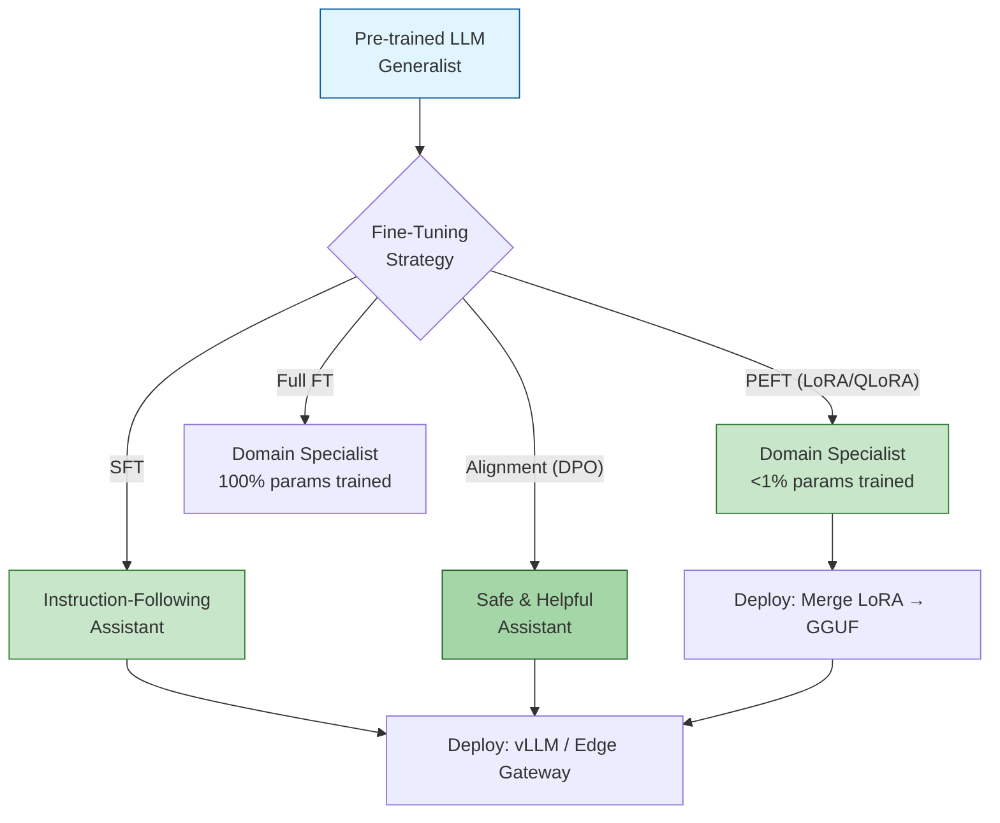

# 🎯 Welcome to Fine-Tuning LLMs

## 🎯 Learning Objectives

- **Understand** why fine-tuning bridges the gap between generalist pre-trained models and domain-specialized systems — and when it's the right tool vs prompting or RAG
- **Master** the memory math behind full fine-tuning, LoRA, QLoRA, and PEFT methods so you never OOM unexpectedly
- **Compare** six PEFT approaches (LoRA, QLoRA, Adapters, Prefix Tuning, IA3, DoRA) on parameter count, memory, quality, and inference overhead
- **Execute** end-to-end supervised fine-tuning (SFT) with dataset engineering, loss masking, and evaluation
- **Implement** alignment via DPO, RLHF, and preference optimization — teaching models to be helpful AND harmless

---

## Why Fine-Tuning: From Generalist to Specialist

GPT-4, Llama, and Gemma are generalists. Pre-trained on internet-scale corpora, they can write sonnets, debug Python, and summarize news articles — but they cannot draft a valid **force majeure** clause for a commercial lease, differentiate between **Type 1 and Type 2 diabetes** with clinical precision, or follow your company's **internal support escalation protocol**. These capabilities require domain specialization.

Fine-tuning is the process that bridges this gap. Starting from a pre-trained model with parameters $\theta_0$, fine-tuning produces $\theta^*$ that minimizes loss on a domain-specific dataset $\mathcal{D}$:

$$\theta^* = \arg\min_\theta \frac{1}{|\mathcal{D}|} \sum_{(x,y) \in \mathcal{D}} \mathcal{L}(f_\theta(x), y)$$

But full fine-tuning a 70B model requires ~1.1TB of GPU VRAM — impossible on any single GPU. This course teaches you how to achieve >95% of full fine-tuning quality while training <1% of parameters, fitting everything on a single consumer GPU.

> ⚠️ **Warning:** Fine-tuning does not inject new factual knowledge reliably. The model reorganizes and specializes existing knowledge. For facts that post-date the pre-training cutoff, combine fine-tuning with RAG.

> 💡 **Tip:** Before fine-tuning, ask: "Can prompting solve this? Can RAG solve this?" Fine-tune when you need consistent behavior, format, tone, or refusal patterns — not just knowledge retrieval.

---

## Course Map

| # | Note | Core Focus | Time |
|---|------|-----------|------|
| 01 | [[01 - Full Fine-Tuning vs PEFT - LoRA, QLoRA and Memory Math\|Full FT vs PEFT]] | Memory breakdown, LoRA theory, QLoRA quantization, NF4 math, hardware constraints | 3-5 h |
| 02 | [[02 - Advanced PEFT - Adapters, Prefix Tuning, IA3 and LoRA Variants\|Advanced PEFT]] | Adapters, Prefix/Prompt Tuning, IA3, LoRA+, DoRA, multi-task serving | 2-4 h |
| 03 | [[03 - Instruction Tuning and Supervised Fine-Tuning at Scale\|Instruction Tuning & SFT]] | Dataset engineering, format standards, loss masking, packing, evaluation, emergent refusal | 3-5 h |
| 04 | [[04 - Alignment - RLHF, DPO and Preference Optimization\|Alignment & DPO]] | RLHF pipeline, PPO stability, DPO theory, ORPO, KTO, preference flywheel | 3-5 h |

Each note is self-contained with theory-before-code, Mermaid diagrams, LaTeX derivations, and production-ready compression scripts.

---

## Prerequisites

| Concept | Expected Knowledge | Review If Needed |
|---------|-------------------|-----------------|
| Transformer architecture | Attention mechanism, multi-head attention, positional encoding | [[../06 - Fundamentos de LLMs/01 - Arquitectura Transformer\|Transformer Architecture]] |
| PyTorch fundamentals | Autograd, DataLoader, `torch.nn.Module`, optimizer state dicts | [[../../../05 - Deep Learning y Computer Vision/03 - Deep Learning con PyTorch/00 - Bienvenida\|Deep Learning with PyTorch]] |
| HuggingFace ecosystem | `transformers`, `datasets`, `Trainer`, `from_pretrained` | [[../16 - HuggingFace Transformers Deep Dive/00 - Welcome to HuggingFace Transformers Deep Dive\|HF Transformers Deep Dive]] |
| PEFT conceptual awareness | What LoRA, QLoRA, Adapters are at a high level | [[../07 - Fine-Tuning y Adaptacion de LLMs/00 - Bienvenida\|Spanish Fine-Tuning Course]] |
| Unsloth fundamentals | Kernel fusion, QLoRA setup, SFT workflows | [[../14 - Unsloth and Efficient Fine-Tuning/00 - Welcome to Unsloth and Efficient Fine-Tuning\|Unsloth Course]] |
| Experiment tracking | MLflow, Weights & Biases, metric logging | [[../../../09 - MLOps y Produccion/18 - Experiment Tracking/00 - Welcome to Experiment Tracking\|Experiment Tracking]] |
| GPU hardware | CUDA, VRAM, mixed precision (fp16/bf16) | NVIDIA documentation |

> ⚠️ **GPU Requirement:** A GPU with ≥ 24 GB VRAM (RTX 4090, A10, A5000) suffices for QLoRA fine-tuning of 7B models. A 48 GB GPU (A6000, L40S) handles 70B models with QLoRA. Cloud alternatives: Lambda Labs, RunPod, or your own [[../../../10 - Cloud, Infra y Backend/22 - Cloud Computing/00 - Bienvenida\|Cloud Computing]] resources.

---

## How to Use These Notes

1. **Theory first, code second** — every module explains *why* before showing *how*. The memory formulas and mathematical derivations build lasting intuition.
2. **Copy the compression code** — each note includes a complete, production-ready script (~25 lines) that you can paste and execute immediately.
3. **Follow the internal links** — `[[...]]` references connect concepts across courses. Knowledge compounds when you connect it.
4. **Study the real cases** — companies like Anthropic, Meta, and HuggingFace share their hard-won lessons so you don't repeat their mistakes.

---

---

**Caso real: OpenAI and ChatGPT.** The GPT-3.5 model was transformed from a raw text-completion engine into a conversational assistant through three phases: (1) SFT on human-written demonstration dialogues, (2) training a reward model on 33K human preference comparisons, and (3) RLHF optimization with PPO. This three-stage pipeline — data, reward, reinforcement — became the blueprint for every subsequent aligned language model. The key insight: **post-training (SFT + alignment) contributed more to user satisfaction than the pre-training compute increase.**

[[01 - Full Fine-Tuning vs PEFT - LoRA, QLoRA and Memory Math]]
