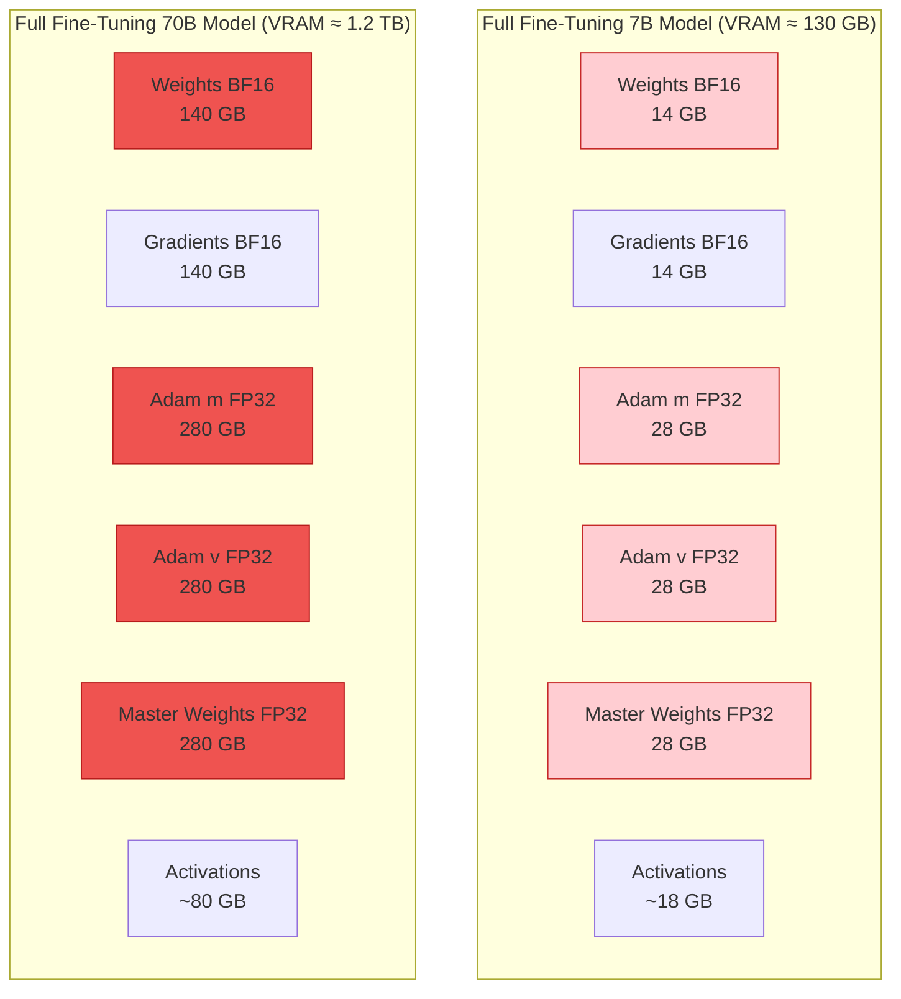
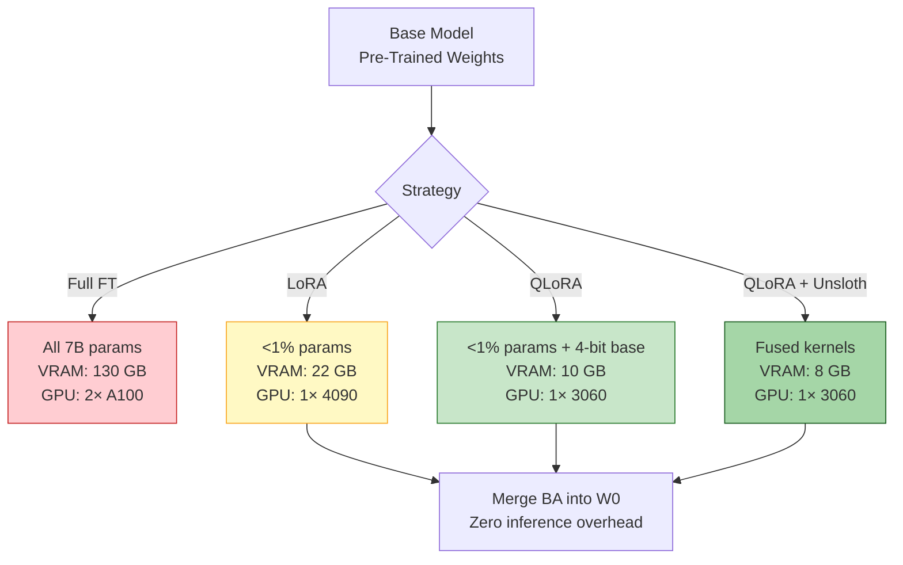

# 🧬 Full Fine-Tuning vs PEFT — LoRA, QLoRA, and Memory Math

## 🎯 Learning Objectives

- **Calculate** VRAM requirements for full fine-tuning any model size using the $M = \text{params} \times 16 \ \text{bytes}$ formula
- **Derive** LoRA's low-rank decomposition $\Delta W = BA$ and understand why $r=8$ achieves 99% of full fine-tuning quality
- **Choose** LoRA target modules per architecture (Llama, Mistral, T5) based on empirical evidence
- **Explain** NF4 quantization, double quantization, and paged optimizers — the three QLoRA innovations
- **Compare** full FT vs LoRA vs QLoRA memory for 7B and 70B models with a deterministic reference table

---

## Module 1: Full Fine-Tuning Memory Breakdown 🧠

### 1.1 Theoretical Foundation

Full fine-tuning updates every parameter of the model. For a 7B-parameter model, this means 7 billion floating-point numbers must be stored, differentiated, and optimized simultaneously on GPU VRAM. The memory formula is deterministic:

$$M_{\text{full}} = M_{\text{weights}} + M_{\text{gradients}} + M_{\text{optimizer}} + M_{\text{activations}}$$

With AdamW in mixed precision (BF16 weights, FP32 optimizer states):

$$M_{\text{full}} = 2P + 2P + 12P + M_{\text{activations}}$$

Where $P$ is the number of parameters. Let's decompose each term:

| Component | Bytes/Param | Why |
|-----------|-------------|-----|
| Weights (BF16) | 2 | $P$ params × 2 bytes = $2P$ |
| Gradients (BF16) | 2 | One gradient per parameter, same dtype as weights |
| Adam m (FP32) | 4 | Exponential moving average of gradients |
| Adam v (FP32) | 4 | Exponential moving average of squared gradients |
| Master weights (FP32) | 4 | Full-precision copy for stable updates |
| **Total** | **16** | $16P$ bytes before activations |

> **¡Sorpresa!** The master weights copy in FP32 is why mixed-precision training uses *more* memory than pure FP16 training — not less. AMP trades speed for numerical stability. $12P$ of the $16P$ goes to the optimizer alone. This is why 8-bit Adam (`adamw_8bit`) saves 75% of optimizer memory with negligible quality loss.

For concrete model sizes:

$$M_{\text{full}}(7\text{B}) = 7 \cdot 10^9 \times 16 = 112\ \text{GB (weights + optimizer)} + 10\text{--}20\ \text{GB (activations)} \approx 130\ \text{GB}$$

$$M_{\text{full}}(70\text{B}) = 70 \cdot 10^9 \times 16 = 1.12\ \text{TB (weights + optimizer)} + 50\text{--}80\ \text{GB (activations)} \approx 1.2\ \text{TB}$$

A single A100 has 80 GB. You would need **2× A100 for 7B** and **16× A100 for 70B**. At ~$3/GPU-hour, full fine-tuning a 70B model costs ~$48/hour in compute alone — before storage, data transfer, or engineering time.

### 1.2 Mental Model



### 1.3 Code: The OOM You'll Hit

```python
# ❌ Full fine-tuning a 7B model on 24 GB GPU — guaranteed OOM
import torch
from transformers import AutoModelForCausalLM

model = AutoModelForCausalLM.from_pretrained(
    "meta-llama/Llama-2-7b-hf",
    torch_dtype=torch.float16,
    device_map="auto",
)
# Weights alone: ~14 GB. First optimizer step allocates 56 GB → CUDA OOM.

# ✅ The only safe way: parameter-efficient methods
# See LoRA and QLoRA configs below — they fit 7B on 24 GB.
```

> ⚠️ Gradient checkpointing (`model.gradient_checkpointing_enable()`) reduces activation memory by recomputing instead of storing, but trades ~20% training speed. For full fine-tuning, this only defers the OOM — the optimizer states still dominate.

---

## Module 2: LoRA — Low-Rank Adaptation 🧠

### 2.1 Theoretical Foundation

The key insight from the LoRA paper (Hu et al., 2021): **weight updates during fine-tuning have low "intrinsic rank."** When you fine-tune a 4096 × 4096 weight matrix, the resulting update $\Delta W$ can be compressed into a rank-8 decomposition with <1% error relative to the full update.

This is not an empirical coincidence — it's predicted by the **intrinsic dimensionality** of the learning task. Fine-tuning moves the model within a low-dimensional subspace of the full parameter space. LoRA exploits this by reparameterizing:

$$W = W_0 + \Delta W = W_0 + BA$$

Where:
- $W_0 \in \mathbb{R}^{d \times k}$: frozen pre-trained weights
- $B \in \mathbb{R}^{d \times r}$: trainable up-projection matrix
- $A \in \mathbb{R}^{r \times k}$: trainable down-projection matrix
- $r \ll \min(d, k)$: the rank (typically 8–64)

$A$ is initialized with Kaiming uniform, $B$ with zeros — so $\Delta W = 0$ at the start and fine-tuning begins from the pre-trained behavior. The forward pass becomes:

$$h = W_0x + BAx = W_0x + B(Ax)$$

During inference, $BA$ is merged into $W_0$: $W_{\text{merged}} = W_0 + BA$. **Zero inference latency overhead.**

**Parameter reduction:** For attention projection $d = k = 4096$ and rank $r = 16$:

$$\text{Full params per matrix} = 4096 \times 4096 = 16.7\text{M}$$
$$\text{LoRA params per matrix} = r(d + k) = 16 \times 8192 = 131\text{K}$$
$$\text{Reduction ratio} = \frac{131\text{K}}{16.7\text{M}} = 0.78\%$$

Only **0.1–1%** of total model parameters are trained. The optimizer only tracks $B$ and $A$, so memory drops from $16P$ to $16 \times (0.01P) + 2P \approx 2P$.

### 2.2 LoRA Target Modules

Not all weight matrices benefit equally from LoRA. The original paper found that **attention projections** (Q, K, V, O) provide the majority of adaptation capacity. Adding MLP projections (gate_proj, up_proj, down_proj in LLaMA/GeGLU architectures) increases parameter count by 2-3× but yields diminishing returns.

| Architecture | Target Modules | Notes |
|-------------|---------------|-------|
| Llama / Mistral / Gemma | `q_proj`, `k_proj`, `v_proj`, `o_proj` | Minimum viable config |
| Llama / Mistral / Gemma (extended) | Above + `gate_proj`, `up_proj`, `down_proj` | +20% quality, +150% params |
| T5 | `q`, `v` | T5 uses relative position; K not needed |
| GPT-2 | `c_attn`, `c_proj` | Combined QKV projection |
| BERT | `query`, `value` | K is typically omitted |

**LoRA hyperparameter guide:**

| Param | Typical Range | Effect |
|-------|--------------|--------|
| $r$ (rank) | 8–64 | Higher = more capacity, risk of overfitting on small datasets |
| $\alpha$ (alpha) | $r$ to $2r$ | Scales LoRA output: $h = W_0x + \frac{\alpha}{r}BAx$ |
| Dropout | 0.0–0.1 | Regularization. 0.0 is often optimal for SFT; 0.05–0.1 for small datasets |

> 💡 **Tip:** $\alpha = 2r$ means LoRA output is weighted at $2\times$ relative to pre-trained weights. Start with $\alpha = r$ (balanced weighting) and increase if training loss decreases too slowly.

### 2.3 Code: LoRA Configuration

```python
# LoRA on 7B model — ~22 GB VRAM, fits on RTX 4090
from peft import LoraConfig, get_peft_model
from transformers import AutoModelForCausalLM
import torch

model = AutoModelForCausalLM.from_pretrained(
    "meta-llama/Llama-2-7b-hf",
    torch_dtype=torch.bfloat16,
    device_map="auto",
)

lora_config = LoraConfig(
    r=16,                              # Rank — 99% of full FT quality at rank 8
    lora_alpha=32,                     # alpha/r = effective weight ratio
    target_modules=["q_proj", "k_proj", "v_proj", "o_proj",
                    "gate_proj", "up_proj", "down_proj"],  # Attention + FFN
    lora_dropout=0.05,
    bias="none",
    task_type="CAUSAL_LM",
)

model = get_peft_model(model, lora_config)
model.print_trainable_parameters()
# Output: trainable params: 20,971,520 || all params: 7,261,941,760 || trainable%: 0.289%
# Memory: ~22 GB — trainable on RTX 4090

# ✅ Gradient checkpointing to reduce activation memory further
model.gradient_checkpointing_enable()  # Saves ~5 GB, costs ~20% speed
```

---

## Module 3: QLoRA — 4-bit Quantization That Changed Everything 🧠

### 3.1 Theoretical Foundation

QLoRA (Dettmers et al., 2023) introduced three innovations that collectively enable fine-tuning a 65B model on a single 48 GB GPU:

**1. NormalFloat4 (NF4)**

Standard integer quantization (INT4) assumes a uniform weight distribution: equally-spaced bins between min and max. But neural network weights are approximately normally distributed $\mathcal{N}(0, \sigma^2)$ — most values cluster near zero with sparse tails. NF4 places quantization bins at the **quantiles** of $\mathcal{N}(0,1)$, not at uniform intervals:

$$q_i = \Phi^{-1}\left(\frac{i}{15}\right), \quad i = 0, 1, \ldots, 15$$

Where $\Phi^{-1}$ is the inverse CDF (probit function). This places more bins near zero (high probability mass) and fewer at the tails (low probability mass), minimizing the expected quantization error:

$$\mathbb{E}_{w \sim \mathcal{N}(0,\sigma^2)}[|w - Q(w)|^2]$$

NF4 reduces quantization error from ~0.10 (INT4) to ~0.01 for normally-distributed weights — a 10× improvement.

**2. Double Quantization**

NF4 still requires per-block scaling factors. For block size 64, a 7B model needs ~110M scales stored at FP32 → 440 MB overhead. Double quantization applies a **second round of quantization to these scaling factors**, storing them as 8-bit integers with another level of block-wise quantization:

$$s_{\text{double}} = Q_8(s_{\text{block}})$$

This reduces the scale overhead from 440 MB to ~44 MB — saving an average of 0.37 bits per parameter.

**3. Paged Optimizers**

Standard PyTorch optimizers allocate monolithic GPU memory blocks for optimizer states. During gradient checkpointing spikes, the CUDA allocator panics and throws OOM. Paged optimizers (inspired by vLLM's PagedAttention) use OS-style paging: optimizer states are stored in fixed-size pages managed by a unified memory pool. Under memory pressure, unused pages are offloaded to CPU RAM and paged back when needed.

### 3.2 QLoRA Memory Math

For a 65B model at 4-bit with LoRA rank 16:

$$M_{\text{QLoRA}} = M_{\text{weights}} + M_{\text{LoRA}} + M_{\text{optimizer}} + M_{\text{activations}}$$

| Component | Calculation | Memory |
|-----------|-------------|--------|
| Base weights (NF4) | $65\text{B} \times 0.5\ \text{bytes}$ | 32.5 GB |
| Double quant scales | ~112 MB | 0.1 GB |
| LoRA adapters | ~0.3% × 65B × 2 bytes | 0.4 GB |
| Optimizer (LoRA only) | 0.3% × 65B × 12 bytes | 2.3 GB |
| Activations + buffers | Sequence-dependent | ~12 GB |
| **Total** | | **~48 GB** |

> **¡Sorpresa!** QLoRA's NF4 format has **no native GPU kernel** — weights are dequantized from 4-bit to BF16 on-the-fly during computation. A forward pass reads the NF4 weight block, converts to BF16 in registers, performs the matmul, then discards the BF16 version. This dequantization overhead makes QLoRA **slower per step than LoRA** (same rank) despite using less memory. Unsloth fixes this by fusing dequantization + matmul into a single kernel.

### 3.3 Code: QLoRA Configuration

```python
# QLoRA on 7B model — ~16 GB VRAM, fits on RTX 3060 (12 GB with tuning)
from transformers import AutoModelForCausalLM, BitsAndBytesConfig
from peft import LoraConfig, get_peft_model, prepare_model_for_kbit_training
import torch

# ⚠️ bnb_4bit_compute_dtype MUST be bfloat16 on Ampere+ GPUs.
# Using float16 here causes gradient underflow in QLoRA's dequantized matmuls.
bnb_config = BitsAndBytesConfig(
    load_in_4bit=True,
    bnb_4bit_quant_type="nf4",         # NormalFloat4 — optimal for normally-distributed weights
    bnb_4bit_compute_dtype=torch.bfloat16,  # BF16 for stability (Ampere+ only)
    bnb_4bit_use_double_quant=True,    # Double quantization saves ~0.4 bits/param
)

model = AutoModelForCausalLM.from_pretrained(
    "meta-llama/Llama-2-7b-hf",
    quantization_config=bnb_config,
    device_map="auto",
)
model = prepare_model_for_kbit_training(model)  # Prepares LoRA injection points

lora_config = LoraConfig(
    r=16, lora_alpha=32,
    target_modules=["q_proj", "k_proj", "v_proj", "o_proj",
                    "gate_proj", "up_proj", "down_proj"],
    lora_dropout=0.05,
    bias="none",
    task_type="CAUSAL_LM",
)

model = get_peft_model(model, lora_config)
model.print_trainable_parameters()
# Output: trainable params: 20,971,520 || all params: 7,261,941,760 || trainable%: 0.289%
# Memory: ~16 GB — trainable on RTX 4090, 3090, A5000
# ¡Sorpresa! The base weights occupy 3.5 GB, but dequantization during forward
# pass creates BF16 temporaries that consume additional VRAM transiently.
```

---

## Module 4: Memory Comparison Table

### 4.1 Full FT vs LoRA vs QLoRA

| Method | 7B Model VRAM | 70B Model VRAM | Trainable Params | Disk (One Model) | Cost/Hour |
|--------|--------------|---------------|-----------------|------------------|-----------|
| Full Fine-Tuning | ~130 GB (2×A100) | ~1.2 TB (16×A100) | 100% | 140 GB | ~$48 |
| LoRA (BF16) | ~22 GB (1×4090) | ~220 GB (3×A100) | 0.1–1% | 100 MB (adapter) | ~$3 |
| QLoRA (NF4) | ~10 GB (1×3060) | ~48 GB (1×A100) | 0.1–1% | 100 MB (adapter) | ~$3 |
| QLoRA + Unsloth | ~8 GB (1×3060) | ~40 GB (1×A6000) | 0.1–1% | 100 MB (adapter) | ~$3 |

> 💡 **Tip:** Full fine-tuning produces a 140 GB checkpoint that requires $140 GB × N_{\text{experiments}}$ of storage. LoRA adapters are 100 MB each — you can store 1,400 versions in the space of one full checkpoint.

### 4.2 Precision Impact on Memory

| Components | FP32 | FP16/BF16 | INT8 | NF4 |
|-----------|------|-----------|------|-----|
| Weights (7B) | 28 GB | 14 GB | 7 GB | 3.5 GB |
| Gradients | 28 GB | 14 GB | N/A | N/A |
| Optimizer (Adam) | 56 GB | 56 GB | 14 GB (8-bit) | 14 GB (8-bit) |
| LoRA Adapters | N/A | 0.04–0.4 GB | N/A | N/A |

---

## ❌/✅ Antipatterns

```python
# ❌ Full fine-tuning a 70B model on consumer hardware
model = AutoModelForCausalLM.from_pretrained(
    "meta-llama/Llama-2-70b-hf",
    torch_dtype=torch.float16,
)
# Requires 8×A100 at ~$30/hr. One model = 140 GB on disk.
# Even loading the model for inference needs 2×A100.
# ⚠️ If you see a tutorial claiming "fine-tune Llama-70B on Colab" —
#    they are using QLoRA, not full fine-tuning.

# ✅ QLoRA on 70B — single A100, $3/hr, 100 MB adapter
bnb_config = BitsAndBytesConfig(
    load_in_4bit=True,
    bnb_4bit_quant_type="nf4",
    bnb_4bit_use_double_quant=True,
    bnb_4bit_compute_dtype=torch.bfloat16,
)
model = AutoModelForCausalLM.from_pretrained(
    "meta-llama/Llama-2-70b-hf",
    quantization_config=bnb_config,
    device_map="auto",
)
model = prepare_model_for_kbit_training(model)
model = get_peft_model(model, LoraConfig(r=16, lora_alpha=32, ...))
# VRAM: ~48 GB. Single A100 at ~$3/hr. Adapters: 100 MB.

# ❌ Training without loss masking on instruction tokens
# The model learns to predict the USER'S instructions, not just the assistant's response.
# This teaches the model to generate user-prompts — wasting capacity.

# ✅ Loss masking: compute loss only on response/assistant tokens
# See Note 03 for the full implementation.

# ❌ Using INT4 for models with outlier features
# Llama and OPT have massive activation outliers in specific channels.
# INT4 quantization of those channels causes 10× higher error than NF4.

# ✅ NF4 handles outliers better because quantile-based bins concentrate
# precision where probability mass exists — near zero, not at outliers.
```

---




---

## 📦 Código de Compresión: LoRA vs QLoRA Memory Comparison

```python
#!/usr/bin/env python3
"""Compare memory footprints: Full FT vs LoRA vs QLoRA for a given model size.
Run: python memory_compare.py
"""
import torch
from transformers import AutoModelForCausalLM, BitsAndBytesConfig
from peft import LoraConfig, get_peft_model, prepare_model_for_kbit_training

MODEL_ID = "meta-llama/Llama-2-7b-hf"
RANK = 16

def get_memory_mb():
    torch.cuda.reset_peak_memory_stats()
    return torch.cuda.max_memory_allocated() / (1024 ** 2)

# --- Full model (BF16, no training) ---
model_full = AutoModelForCausalLM.from_pretrained(
    MODEL_ID, torch_dtype=torch.bfloat16, device_map="auto"
)
print(f"Full model (BF16, inference): {get_memory_mb():.0f} MB")

# --- LoRA (BF16 base + adapters) ---
model_full = get_peft_model(model_full, LoraConfig(
    r=RANK, lora_alpha=32,
    target_modules=["q_proj", "k_proj", "v_proj", "o_proj"],
    task_type="CAUSAL_LM",
))
model_full.print_trainable_parameters()
print(f"LoRA (BF16 base + LoRA): {get_memory_mb():.0f} MB")

# --- QLoRA (NF4 base + LoRA) ---
del model_full; torch.cuda.empty_cache()
bnb_config = BitsAndBytesConfig(
    load_in_4bit=True, bnb_4bit_quant_type="nf4",
    bnb_4bit_compute_dtype=torch.bfloat16, bnb_4bit_use_double_quant=True,
)
model_qlora = AutoModelForCausalLM.from_pretrained(
    MODEL_ID, quantization_config=bnb_config, device_map="auto",
)
model_qlora = prepare_model_for_kbit_training(model_qlora)
model_qlora = get_peft_model(model_qlora, LoraConfig(
    r=RANK, lora_alpha=32,
    target_modules=["q_proj", "k_proj", "v_proj", "o_proj"],
    task_type="CAUSAL_LM",
))
model_qlora.print_trainable_parameters()
print(f"QLoRA (NF4 base + LoRA): {get_memory_mb():.0f} MB")

# Expected output (RTX 4090):
# Full model (BF16, inference): ~13500 MB
# LoRA (BF16 base + LoRA): ~14100 MB
# QLoRA (NF4 base + LoRA): ~6200 MB
```

---

## Caso Real: Guanaco-65B — Fine-Tuning a 65B Model on a Single 48 GB GPU

Tim Dettmers and the QLoRA team fine-tuned **Guanaco-65B** (a Llama-65B variant) on a single 48 GB NVIDIA A6000 GPU — previously considered physically impossible. Before QLoRA, fine-tuning a 65B model required 16× A100 GPUs with a total cost exceeding $20,000 for a single run.

**Their results on the Vicuna benchmark:**
- Guanaco-65B (QLoRA, single GPU, $500 total) achieved **99.3% of ChatGPT's performance**
- The entire fine-tuning took 24 hours on one A6000 — a weekend run on a workstation
- The LoRA adapter was only 200 MB — distributable via email, loadable in seconds

This breakthrough democratized LLM fine-tuning. Before QLoRA, only well-funded labs could adapt large models. After QLoRA, a PhD student with a single A6000 can fine-tune a 65B model.

---

**Caso real: Unsloth's Kernel Fusion.** Unsloth builds on QLoRA by writing hand-written Triton and CUDA kernels that fuse NF4 dequantization with the attention matmul. The result: 2-5× faster QLoRA training with 40% less VRAM. The key innovation is eliminating the separate dequantization step — in standard QLoRA, each forward pass reads NF4 → dequantizes to BF16 → computes `Q @ K^T`. Unsloth fuses these into a single GPU kernel, reading NF4 weights and computing the matmul in one pass. See [[../14 - Unsloth and Efficient Fine-Tuning/01 - Unsloth Architecture and QLoRA Deep Dive|Unsloth Architecture]] for the kernel-level breakdown.

---

## Key Takeaways

- **Full fine-tuning memory formula**: $M = 16P$ bytes. For 7B: ~130 GB. For 70B: ~1.2 TB. The optimizer is 75% of that.
- **LoRA exploits low intrinsic rank**: $\Delta W = BA$, $r=8$ achieves 99% of full FT quality, training <1% of parameters.
- **QLoRA's three innovations** (NF4 + double quantization + paged optimizers) compress 65B fine-tuning from 16×A100 to 1×A6000.
- **NF4 is information-theoretically optimal** for normally-distributed weights — 10× lower quantization error than INT4.
- **QLoRA is slower per step than LoRA** because NF4 dequantization happens on-the-fly with no native GPU kernel.
- **LoRA adapters are 100–200 MB** vs 140 GB for a full checkpoint — store 1,400 versions in the same disk space.
- **Target modules**: Attention projections (Q, K, V, O) provide 90% of the gain. MLP projections add capacity but diminishing returns.

---

## References

- Hu et al. (2021), *LoRA: Low-Rank Adaptation of Large Language Models*, ICLR 2022
- Dettmers et al. (2023), *QLoRA: Efficient Finetuning of Quantized LLMs*, NeurIPS 2023
- Unsloth GitHub: `https://github.com/unslothai/unsloth`
- Hayou et al. (2024), *LoRA+: Efficient Low Rank Adaptation of Large Models*, ICML 2024

[[02 - Advanced PEFT - Adapters, Prefix Tuning, IA3 and LoRA Variants]]
