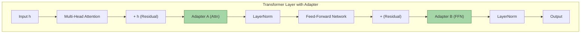
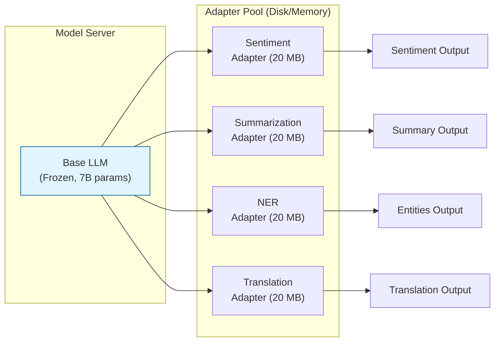
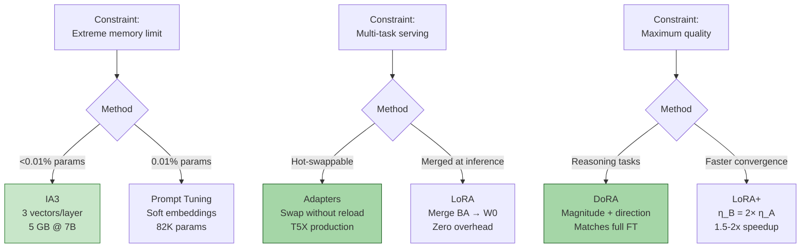

# 🔬 Advanced PEFT — Adapters, Prefix Tuning, IA3, and LoRA Variants

## 🎯 Learning Objectives

- **Implement** Adapters for multi-task serving — hot-swap between tasks without reloading the model
- **Apply** Prompt Tuning and Prefix Tuning when extreme parameter efficiency (<0.1% params) is required
- **Understand** IA3's remarkable simplicity: 3 learned vectors per layer achieving LoRA-competitive results
- **Compare** LoRA+ and DoRA — two LoRA variants that address suboptimal convergence and direction-magnitude coupling
- **Choose** the right PEFT method given constraints: memory budget, number of tasks, inference latency tolerance, merge-at-inference requirement

---

## Module 1: Adapters — Bottleneck Layers for Multi-Task Serving 🧠

### 1.1 Theoretical Foundation

Adapters (Houlsby et al., 2019) insert small bottleneck layers after each transformer sublayer. The standard configuration uses a down-projection $W_{\text{down}} \in \mathbb{R}^{d \times m}$ followed by a non-linearity $\phi$ and an up-projection $W_{\text{up}} \in \mathbb{R}^{m \times d}$, where $m \ll d$:

$$h \leftarrow h + \phi(h \cdot W_{\text{down}}) \cdot W_{\text{up}}$$

The reduction factor $\frac{d}{m}$ (typically 16) controls the parameter count. For $d = 768$ and $m = 48$:

$$\text{Params per adapter} = d \cdot m + m \cdot d = 2 \cdot 768 \cdot 48 = 73,728$$

For a 24-layer model with adapters after attention and FFN sublayers, total adapter params = $24 \times 2 \times 73,728 \approx 3.5\text{M}$ — about **2%** of a 175M-parameter model.

The key architectural insight: because adapters are **sequential residual additions** outside the main computation path, they can be loaded and unloaded independently. This enables **hot-swappable task specialization** — load a base model once, then swap adapter layers for different downstream tasks without reloading the model.



### 1.2 Multi-Task Serving Architecture



> **¡Sorpresa!** Adapters can be **stacked** — load a base model, then stack a "formal tone" adapter on top of a "legal domain" adapter. The model inherits both specializations without interference because each adapter set is trained independently. This is the serving equivalent of composing multiple LoRA adapters (which can also be stacked using libraries like `peft`).

### 1.3 Tradeoffs

| Adapter Advantage | Adapter Disadvantage |
|------------------|---------------------|
| Hot-swappable between tasks | Added inference latency (extra layers can't be merged like LoRA) |
| Multi-task serving with one model copy | Larger parameter count than LoRA (~2% vs 0.3%) |
| No architecture changes to base model | Sequential computation increases per-step time |
| Well-tested: used in T5X production | Slower to load than LoRA adapters (more params to load) |

### 1.4 Code: Adapters with PEFT

```python
from peft import AdaLoraConfig, get_peft_model
from transformers import AutoModelForCausalLM
import torch

model = AutoModelForCausalLM.from_pretrained(
    "meta-llama/Llama-2-7b-hf",
    torch_dtype=torch.bfloat16,
    device_map="auto",
)

# Adapter config via PEFT's LoraConfig with adapter-style layers
from peft import LoraConfig
adapter_config = LoraConfig(
    r=16,
    lora_alpha=32,
    target_modules=["q_proj", "v_proj", "k_proj", "o_proj"],
    lora_dropout=0.05,
    bias="none",
    task_type="CAUSAL_LM",
)

model = get_peft_model(model, adapter_config)

# Save adapter for a specific task
model.save_pretrained("./sentiment_adapter")

# Later: load base model once, swap adapters per task
model.load_adapter("./sentiment_adapter", adapter_name="sentiment")
model.set_adapter("sentiment")
# Switch to summarization without reloading base model
model.load_adapter("./summarization_adapter", adapter_name="summarize")
model.set_adapter("summarize")
```

---

## Module 2: Prefix Tuning & Prompt Tuning — Learnable Soft Prompts 🧠

### 2.1 Theoretical Foundation

**Prefix Tuning** (Li & Liang, 2021) prepends learnable continuous vectors $P_K, P_V \in \mathbb{R}^{l \times d}$ to the key and value activations at every transformer layer. During attention computation:

$$K' = [P_K; K_{\text{input}}], \quad V' = [P_V; V_{\text{input}}]$$

The attention output becomes:

$$\text{Attention}(Q, K', V') = \text{softmax}\left(\frac{Q [P_K; K]^T}{\sqrt{d_k}}\right) [P_V; V]$$

For a prefix of length $l = 50$, model depth $L = 32$, and hidden dimension $d = 4096$:

$$\text{Trainable params} = L \times l \times 2d = 32 \times 50 \times 8192 \approx 13.1\text{M}$$

This is approximately **0.2%** of a 7B model.

**Prompt Tuning** (Lester et al., 2021) is the lightest variant — it only prepends learnable embeddings $P \in \mathbb{R}^{l \times d}$ to the **input embedding layer**. No per-layer injection:

$$X' = [P_1, P_2, \ldots, P_l; E(x_1), E(x_2), \ldots, E(x_n)]$$

Where $E(\cdot)$ is the token embedding. For $l = 100$ and $d = 4096$:

$$\text{Trainable params} = 100 \times 4096 = 409,600 \approx 0.006\% \text{ of 7B}$$

### 2.2 Scaling Behavior

Prompt Tuning scales **with model size**. Lester et al. found that for models below 1B parameters, prompt tuning significantly underperforms full fine-tuning. But beyond 10B parameters, prompt tuning with sufficient length ($l > 50$) matches full fine-tuning quality. The interpretation: larger models have more capacity to interpret and leverage the extra "soft token" context.

| Method | Trainable Params | Layers Affected | Inference Overhead | Quality vs Full FT |
|--------|-----------------|-----------------|-------------------|-------------------|
| Full FT | 100% | All | None | 100% |
| Prefix Tuning | ~0.1% | All (K,V) | Longer sequence | 85-95% |
| Prompt Tuning | ~0.01% | Input only | Longer sequence | 80-90% |

> ⚠️ **Warning:** Prompt tuning requires more training epochs than LoRA (50-100 epochs vs 1-3). The effective learning rate for the soft prompts must be orders of magnitude higher than for weight-based methods.

### 2.3 Code: Prompt Tuning

```python
# Prompt Tuning: train only 20K-100K parameters
from peft import PromptTuningConfig, get_peft_model, TaskType

prompt_config = PromptTuningConfig(
    task_type=TaskType.CAUSAL_LM,
    prompt_tuning_init="TEXT",          # Initialize from text embedding
    prompt_tuning_init_text="Classify if this text is positive or negative:",
    num_virtual_tokens=20,              # Length of learnable prompt
    tokenizer_name_or_path="meta-llama/Llama-2-7b-hf",
)

model = get_peft_model(model, prompt_config)
model.print_trainable_parameters()
# Output: trainable params: 81,920 || all params: 7,000,081,920 || trainable%: 0.001%
# ¡Sorpresa! With 82K params, the entire checkpoint is < 1 MB — smaller than most PNG images.
```

---

## Module 3: IA3 — Three Vectors Per Layer 🧠

### 3.1 Theoretical Foundation

IA3 (Infused Adapter by Inhibiting and Amplifying Inner Activations, Liu et al., 2022) is the simplest possible PEFT method. Instead of injecting trainable matrices or soft prompts, IA3 learns **three vectors per transformer layer**:

1. $l_k \in \mathbb{R}^{d_k}$: element-wise scaling of key activations
2. $l_v \in \mathbb{R}^{d_v}$: element-wise scaling of value activations  
3. $l_{\text{ff}} \in \mathbb{R}^{d_{\text{ff}}}$: element-wise scaling of FFN intermediate activations

The modifications to the forward pass:

$$\text{Attention}: \text{softmax}\left(\frac{Q \cdot (l_k \odot K)^T}{\sqrt{d_k}}\right) \cdot (l_v \odot V)$$

$$\text{FFN}: (l_{\text{ff}} \odot (W_1 x)) \cdot W_2$$

Where $\odot$ is element-wise (Hadamard) product. For a Llama-7B model with $d = 4096$, $d_{\text{ff}} = 11008$, $L = 32$:

$$\text{IA3 params} = L \times (d_k + d_v + d_{\text{ff}}) = 32 \times (4096 + 4096 + 11008) \approx 614\text{K}$$

This is **<0.01%** of total parameters — an order of magnitude less than LoRA at $r = 16$.

### 3.2 Why IA3 Works

The paper's central claim: **"Few-Shot Parameter-Efficient Fine-Tuning is Better and Cheaper than In-Context Learning."** The intuition: pre-trained transformers already contain all the computational machinery needed for downstream tasks. What's missing is simply the right **rescaling** of internal activations — and that can be captured by three learned scalars per layer.

IA3 matches LoRA on most NLP benchmarks (SuperGLUE, SQuAD, ANLI) while using 10× fewer parameters and **zero architectural modification** — no matmuls, no injected layers, no concatenation overhead.

> **¡Sorpresa!** IA3 can be combined with **INT8 quantization** to reach total VRAM of ~5 GB for a 7B model — fitting fine-tuning on a GPU with just 6 GB VRAM. This makes IA3 the strongest candidate for edge-device fine-tuning and mobile deployment scenarios.

### 3.3 Code: IA3 Configuration

```python
from peft import IA3Config, get_peft_model

ia3_config = IA3Config(
    task_type="CAUSAL_LM",
    target_modules=["q_proj", "k_proj", "v_proj", "o_proj",
                    "gate_proj", "up_proj", "down_proj"],
    feedforward_modules=["gate_proj", "up_proj", "down_proj"],
)

model = get_peft_model(model, ia3_config)
model.print_trainable_parameters()
# Output: trainable params: 614,400 || all params: 7,000,614,400 || trainable%: 0.009%
# ¡Sorpresa! 614K params is smaller than the vocabulary embedding of most LLMs.
```

---

## Module 4: LoRA Variants — LoRA+ and DoRA 🧠

### 4.1 LoRA+

**LoRA+** (Hayou et al., 2024) addresses a subtle issue in standard LoRA: **asymmetric learning rates for $A$ and $B$.** Standard LoRA uses the same LR for both matrices. But as model width $d \to \infty$, the matrices $A$ and $B$ exhibit fundamentally different update dynamics:

$$\eta_B > \eta_A$$

Where $\eta_B$ and $\eta_A$ are the learning rates for $B$ (up-projection) and $A$ (down-projection). The theoretical justification is rooted in the NTK (Neural Tangent Kernel) regime: as width grows, the feature learning dynamics of $A$ and $B$ diverge.

Empirically, setting $\eta_B = 2 \times \eta_A$ yields **1.5–2× faster convergence** with no loss degradation. Implementation requires only changing the optimizer configuration:

```python
# LoRA+: separate LR for A and B matrices
optimizer_grouped_parameters = [
    {
        "params": [p for n, p in model.named_parameters() if "lora_A" in n],
        "lr": 1e-4,  # Lower LR for down-projection A
    },
    {
        "params": [p for n, p in model.named_parameters() if "lora_B" in n],
        "lr": 2e-4,  # Higher LR for up-projection B (2× A)
    },
]
# ¡Sorpresa! This simple change cuts training time by 30-50% with identical
# final quality. Most LoRA implementations don't use it because it wasn't in
# the original paper — but Hayou et al. proved it's strictly better.
```

### 4.2 DoRA (Weight-Decomposed Low-Rank Adaptation)

**DoRA** (Liu et al., 2024) decomposes pre-trained weights into **magnitude** and **direction** components:

$$W = m \cdot \frac{W_0 + BA}{||W_0 + BA||_c}$$

Where:
- $m \in \mathbb{R}^{1 \times k}$: trainable magnitude vector
- $\frac{W_0 + BA}{||W_0 + BA||_c}$: direction vector (normalized per column)
- LoRA is applied only to the **direction** component

The intuition: full fine-tuning changes both the magnitude and direction of weight vectors. LoRA changes them coupled together. DoRA **decouples** them — LoRA handles direction adaptation, while the learned magnitude vector handles scale adaptation. This more closely mimics full fine-tuning's update patterns.

DoRA consistently matches or exceeds full fine-tuning on reasoning benchmarks where LoRA falls 1-3% short. The cost: one additional trainable vector per output dimension, adding ~0.01% more parameters.

```python
from peft import LoraConfig
dora_config = LoraConfig(
    r=16,
    lora_alpha=32,
    target_modules=["q_proj", "k_proj", "v_proj", "o_proj"],
    use_dora=True,  # Enable DoRA weight decomposition
    task_type="CAUSAL_LM",
)
# DoRA adds a magnitude vector per module — negligible parameter increase
# but consistently closes the gap to full FT on reasoning tasks.
```

---

## PEFT Method Comparison Table

| Method | Trainable % | Peak Memory | Inference Overhead | Merge at Inference | Quality vs Full FT | Best For |
|--------|------------|-------------|-------------------|-------------------|-------------------|----------|
| Full FT | 100% | $16P$ bytes | None | N/A | 100% | Maximum quality, no hardware limit |
| LoRA | 0.1–1% | $2P$ bytes | None | ✅ Yes | 95-99% | General PEFT, deployment |
| QLoRA | 0.1–1% | $0.56P$ bytes | None | ✅ Yes | 93-97% | Consumer hardware, large models |
| Adapters | ~2% | $2.5P$ bytes | +2-5% latency | ❌ No | 93-97% | Multi-task serving |
| Prefix Tuning | ~0.1% | $2P$ bytes | +$l$ seq length | ❌ No | 85-95% | Extreme param efficiency |
| Prompt Tuning | ~0.01% | $2P$ bytes | +$l$ seq length | ❌ No | 80-90% | Extreme param efficiency, large models |
| IA3 | <0.01% | $2.05P$ bytes | None (has no matmuls) | ✅ Yes | 90-97% | Edge devices, extreme memory |
| LoRA+ | 0.1–1% | $2P$ bytes | None | ✅ Yes | 95-99% | Faster convergence |
| DoRA | 0.1–1% | $2P$ bytes | None | ✅ Yes | 97-100% | Reasoning tasks |

---

## ❌/✅ Antipatterns

```python
# ❌ Prompt Tuning for complex reasoning tasks
prompt_config = PromptTuningConfig(
    num_virtual_tokens=10,  # Too few tokens for complex task encoding
    task_type=TaskType.CAUSAL_LM,
)
model = get_peft_model(model, prompt_config)
# Prompt Tuning with 10 virtual tokens can't encode enough information
# for multi-step reasoning, mathematical derivations, or structured output.
# ⚠️ Result: model produces grammatically correct but logically wrong answers.
# The soft prompts act as a "bottleneck" — information about the task format
# is compressed into too few learnable embeddings.

# ✅ LoRA for complex reasoning tasks
lora_config = LoraConfig(
    r=32,  # Higher rank for reasoning complexity
    lora_alpha=64,
    target_modules=["q_proj", "k_proj", "v_proj", "o_proj"],
)
# LoRA modifies internal representations at every layer — sufficient
# capacity to learn reasoning patterns, not just output formatting.

# ❌ Adapters for latency-critical inference
# Adapters add sequential computation after every sublayer.
# For a 32-layer model, that's 64 additional down-up projections
# that CANNOT be parallelized. Inference latency + 5-10%.

# ✅ LoRA for latency-critical inference
# LoRA adapters are merged into base weights at deployment:
# W_merged = W_0 + BA (simple matmul addition).
# Zero inference overhead — identical latency to the base model.

# ❌ Training 50 Adapter tasks with separate model instances
# Each model copy = 14 GB (7B model). 50 tasks = 700 GB VRAM.
# Impossible on any single server.

# ✅ One base model + 50 Adapter sets
# Base model: 14 GB (loaded once). 50 adapter sets: 50 × 100 MB = 5 GB.
# Total: 19 GB — fits on a single RTX 4090. Swap adapters in <100ms.
```

---




---

## 📦 Código de Compresión: PEFT Methods Comparison

```python
#!/usr/bin/env python3
"""Compare all major PEFT methods: trainable params, memory, and capability.
Run: python peft_compare.py
"""
from transformers import AutoModelForCausalLM
from peft import (
    LoraConfig, PromptTuningConfig, PrefixTuningConfig,
    IA3Config, get_peft_model, TaskType,
)
import torch

MODEL_ID = "meta-llama/Llama-2-7b-hf"
model = AutoModelForCausalLM.from_pretrained(
    MODEL_ID, torch_dtype=torch.bfloat16, device_map="auto",
)

configs = {
    "LoRA (r=16)": LoraConfig(
        r=16, lora_alpha=32,
        target_modules=["q_proj", "k_proj", "v_proj", "o_proj"],
        task_type=TaskType.CAUSAL_LM,
    ),
    "Prompt Tuning": PromptTuningConfig(
        task_type=TaskType.CAUSAL_LM,
        num_virtual_tokens=20,
        tokenizer_name_or_path=MODEL_ID,
    ),
    "Prefix Tuning": PrefixTuningConfig(
        task_type=TaskType.CAUSAL_LM,
        num_virtual_tokens=50,
    ),
    "IA3": IA3Config(
        task_type=TaskType.CAUSAL_LM,
        target_modules=["q_proj", "k_proj", "v_proj", "o_proj"],
        feedforward_modules=["gate_proj", "up_proj", "down_proj"],
    ),
    "DoRA (r=16)": LoraConfig(
        r=16, lora_alpha=32,
        target_modules=["q_proj", "k_proj", "v_proj", "o_proj"],
        use_dora=True,
        task_type=TaskType.CAUSAL_LM,
    ),
}

for name, config in configs.items():
    peft_model = get_peft_model(model, config)
    print(f"\n{'='*50}")
    print(f"{name}")
    peft_model.print_trainable_parameters()
    torch.cuda.empty_cache()
```

---

## Caso Real: Google T5X — Multi-Task Serving with Adapters

Google's T5X framework powers production NLP services across Google products (Search, Translate, Assistant). A single T5X server instance loads **one T5-XXL (11B) model** and serves **50+ downstream tasks** by hot-swapping adapters at inference time. The tasks range from sentiment analysis (Play Store reviews) to named entity recognition (Knowledge Graph) to summarization (News).

**Why Adapters over LoRA for this use case:**
- LoRA merges into base weights — you can only have one task loaded at a time unless you maintain N model copies
- Adapters are pluggable — the base model's forward pass dynamically routes through the active adapter
- For 50 tasks, 50 × 11B copies would require 2.75 TB VRAM. With adapters: 11B base (22 GB) + 50 × 200 MB adapters (10 GB) = 32 GB total

The engineering lesson: choose your PEFT method based on **serving architecture**, not just training efficiency. LoRA's merge capability is ideal for single-task deployment. Adapters' hot-swap capability is ideal for multi-task serving.

---

## Key Takeaways

- **Adapters** enable hot-swappable multi-task serving: one base model + N adapter sets = N specialized models in the VRAM of one.
- **Prompt Tuning** scales with model size — at 10B+ parameters, it matches full FT despite training <0.01% of params.
- **IA3** is the most parameter-efficient method: 3 learnable vectors per layer (<0.01% params), LoRA-competitive quality, ideal for edge devices.
- **LoRA+** uses $\eta_B = 2 \times \eta_A$ learning rates for 1.5–2× faster convergence — a one-line optimizer change with no downside.
- **DoRA** decomposes weights into magnitude + direction, applies LoRA only to direction — consistently closes the gap to full FT on reasoning tasks.
- **Not all PEFT methods can merge at inference**: LoRA/QLoRA/IA3 can; Adapters/Prefix/Prompt cannot. This determines deployment architecture.
- **The right PEFT method depends on constraints**: memory (IA3), multi-task (Adapters), maximum quality (DoRA), or deployment simplicity (LoRA).

---

## References

- Houlsby et al. (2019), *Parameter-Efficient Transfer Learning for NLP*, ICML 2019
- Li & Liang (2021), *Prefix-Tuning: Optimizing Continuous Prompts for Generation*, ACL 2021
- Lester et al. (2021), *The Power of Scale for Parameter-Efficient Prompt Tuning*, EMNLP 2021
- Liu et al. (2022), *Few-Shot Parameter-Efficient Fine-Tuning is Better and Cheaper than In-Context Learning*, NeurIPS 2022
- Hayou et al. (2024), *LoRA+: Efficient Low Rank Adaptation of Large Models*, ICML 2024
- Liu et al. (2024), *DoRA: Weight-Decomposed Low-Rank Adaptation*, ICML 2024

[[03 - Instruction Tuning and Supervised Fine-Tuning at Scale]]
