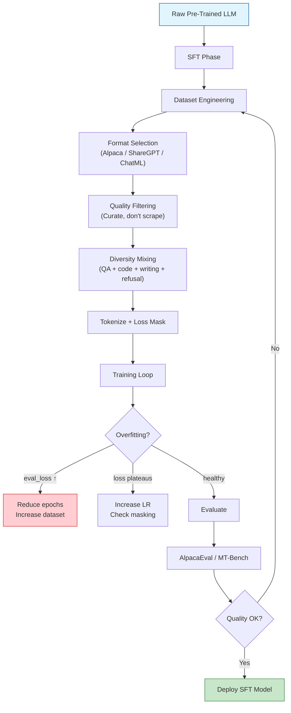

# 📝 Instruction Tuning and Supervised Fine-Tuning at Scale

## 🎯 Learning Objectives

- **Engineer** high-quality instruction datasets: format standards (Alpaca, ShareGPT, ChatML), diversity mixing, and the LIMA paper's quality-over-quantity thesis
- **Implement** loss masking on assistant tokens — the single most critical SFT training detail that separates working fine-tunes from failed ones
- **Apply** packing vs padding strategies to maximize GPU utilization without cross-contamination between examples
- **Evaluate** SFT quality using AlpacaEval, MT-Bench, HumanEval, MMLU, and TruthfulQA
- **Understand** emergent refusal behavior and why well-formatted SFT data reduces hallucination

---

## Module 1: From Pre-Trained Model to Assistant 🧠

### 1.1 The Instruction Gap

A raw Llama-70B model trained on internet text can complete the prompt *"The capital of France is"* with *"Paris, a city known for..."*. It has memorized vast factual knowledge. But it cannot handle:

```
User: "Summarize this legal document in 3 bullet points for a non-lawyer."
```

The model has never seen the instruction format. It might continue writing the prompt itself, produce a rambling stream-of-consciousness, or output legally-valid but incomprehensible text. **Supervised Fine-Tuning (SFT)** bridges this gap by training on `(instruction, response)` pairs that teach the model:

1. **Format**: Recognize instruction/response boundaries
2. **Tone**: Match the desired assistant persona (helpful, professional, concise)
3. **Refusal**: Know when to decline harmful or impossible requests
4. **Task understanding**: Map natural language instructions to correct behaviors

SFT loss is standard next-token prediction, but applied selectively to assistant tokens:

$$\mathcal{L}_{\text{SFT}} = -\frac{1}{|\mathcal{R}|} \sum_{(x,y) \in \mathcal{D}} \sum_{t \in \mathcal{R}(y)} \log P_\theta(y_t | x, y_{<t})$$

Where $\mathcal{R}(y)$ is the set of response token positions. The key: **loss is computed only on the assistant's response, not on the user's instruction.** Without this masking, the model wastes capacity learning to predict user prompts.

### 1.2 Dataset Format Standards

Three dominant formats have emerged. Choose one and stay consistent:

**Alpaca Format** (simplest, most common):

```
### Instruction:
Explain the theory of relativity in simple terms.

### Response:
Einstein's theory says that space and time are connected like a fabric...
```

**ShareGPT Format** (multi-turn conversations):

```json
{
  "conversations": [
    {"from": "human", "value": "What is a force majeure clause?"},
    {"from": "gpt", "value": "A force majeure clause is a contract provision..."},
    {"from": "human", "value": "Give me an example."},
    {"from": "gpt", "value": "If a hurricane destroys a supplier's factory..."}
  ]
}
```

**ChatML Format** (OpenAI standard):

```
<|im_start|>system
You are a helpful legal assistant.
<|im_end|>
<|im_start|>user
What is a force majeure clause?
<|im_end|>
<|im_start|>assistant
A force majeure clause is a contract provision that...
<|im_end|>
```

---

## Module 2: Dataset Engineering — Quality Over Quantity 🧠

### 2.1 The LIMA Paper: Less Is More

The LIMA paper (Zhou et al., 2023) made a radical claim: **1,000 carefully curated examples can outperform 52,000 noisy Alpaca examples.** They fine-tuned Llama-65B on just 1,000 hand-written, diverse, high-quality instruction-response pairs. The result: LIMA matched or exceeded models trained on 50× more data.

Why? Pre-trained models already contain vast knowledge and language capability. SFT doesn't need to teach facts — it needs to teach **output format, tone, refusal boundaries, and task-switching behavior**. A few hundred diverse, well-formatted examples suffice.

The practical lesson: **curate, don't just scrape.** Every example in your SFT dataset should meet these criteria:

| Criterion | Check |
|-----------|-------|
| Correctness | Is the answer factually right? |
| Format consistency | Does it follow the chosen format exactly? |
| Tone match | Does the assistant persona match your target? |
| Diversity | Does it cover different task types? |
| Difficulty | Are there hard examples that stretch behavior? |

### 2.2 Diversity Mixing

Preventing catastrophic forgetting requires exposing the model to diverse task types during SFT:

| Task Type | Examples Needed | Purpose |
|-----------|----------------|---------|
| Open QA | 200-300 | Factual recall, explanation style |
| Closed QA | 100-200 | Concise answers, "I don't know" behavior |
| Summarization | 150-200 | Compression, main-point extraction |
| Classification | 100-150 | Structured output format |
| Code generation | 200-300 | Syntax, reasoning |
| Creative writing | 100-200 | Tone, style, length control |
| Translation | 50-100 | Cross-lingual capability preservation |
| Math/Coding reasoning | 100-200 | Chain-of-thought, step-by-step reasoning |
| Refusals | 50-100 | Boundary recognition, polite decline |

> 💡 **Tip:** The "refusal" category is critical. Without explicit refusal examples, the model either complies with harmful requests (dangerous) or over-refuses on borderline queries (useless). See Module 5.

### 2.3 Open-Source Dataset Landscape

| Dataset | Size | Quality | Best For |
|---------|------|---------|----------|
| Alpaca (52K) | Medium | Low-Medium | Quick experiments |
| Alpaca-Cleaned | 52K | Medium | Better baseline |
| OpenHermes 2.5 | 1M | Medium-High | Broad capability coverage |
| UltraChat | 1.5M | Medium | Multi-turn conversations |
| OpenOrca | 1M | Medium-High | Reasoning traces |
| LIMA | 1K | Very High | Quality-first approach |
| WildChat | 650K | High | Real user interactions |
| Capybara | 16K | Very High | Strong reasoning |

```python
# ❌ Scraping Reddit for instruction data
# Toxicity, hallucinations, contradictory answers, formatting nightmares.
# This will produce a model that argues with users and invents facts.

# ✅ Curating 1K diverse, hand-written, high-quality examples (LIMA-style)
# Each example is human-reviewed for correctness, tone, and format.
# Half the examples, 2x the quality. Better model, shorter training.
```

---

## Module 3: Training Mechanics 🧠

### 3.1 Loss Masking: The Most Critical Detail

SFT datasets contain both instruction tokens and response tokens. But the model should only learn to **produce responses** — not to produce user instructions. Loss masking sets the loss to zero for instruction tokens:

```python
# Crucially: loss is computed ONLY on assistant tokens
def tokenize_with_loss_masking(examples, tokenizer):
    """Format instruction/response and mask loss on instruction tokens."""
    prompts = []
    responses = []
    for instr, resp in zip(examples["instruction"], examples["response"]):
        prompt = f"### Instruction:\n{instr}\n\n### Response:\n"
        prompts.append(prompt)
        responses.append(resp + tokenizer.eos_token)
    
    # Tokenize prompts and responses separately
    prompt_tokens = tokenizer(prompts, add_special_tokens=False)["input_ids"]
    response_tokens = tokenizer(responses, add_special_tokens=False)["input_ids"]
    
    input_ids = []
    labels = []
    for p_toks, r_toks in zip(prompt_tokens, response_tokens):
        combined = p_toks + r_toks
        # ✅ Mask all prompt tokens: -100 is ignored by CrossEntropyLoss
        label = [-100] * len(p_toks) + r_toks
        input_ids.append(combined)
        labels.append(label)
    
    return {"input_ids": input_ids, "labels": labels}
```

> **¡Sorpresa!** Without loss masking, the model devotes ~50% of its training signal to learning how users write prompts — not how assistants should respond. The result: the fine-tuned model starts generating user-style instructions mid-response, breaking the assistant format. This is the #1 cause of "my fine-tune got worse, not better."

### 3.2 Packing vs Padding

Sequences in SFT datasets vary widely in length — from 50 tokens (short QA) to 4,000 tokens (long documents). Naively padding to max length wastes up to 80% of GPU compute on padding tokens:

```python
# ❌ Padding to max_length — wastes GPU cycles on pad tokens
trainer = SFTTrainer(
    max_seq_length=4096,
    packing=False,  # Each example gets its own padded sequence
)
# Batch of 4 short examples (100 tokens each) padded to 4096:
# 4 × 4096 = 16,384 tokens; only 400 are real (2.4% utilization)

# ✅ Packing — multiple examples in one sequence
trainer = SFTTrainer(
    max_seq_length=4096,
    packing=True,   # Pack multiple examples into one sequence
)
# 4 short examples packed into one 4096-token sequence:
# 1 × 4096 = 4,096 tokens; 400 are real (9.8% utilization — 4x better)
# With 40 examples packed per sequence: ~97% utilization
```

> ⚠️ **Warning:** Packing requires proper attention mask modifications. Each example's tokens must NOT attend to tokens from other examples. The `SFTTrainer` handles this automatically with `packing=True`, but custom implementations must set `attention_mask[example_boundaries] = 0` at each boundary.

### 3.3 Sequence Length Strategy

| Task | Recommended Seq Length | Why |
|------|----------------------|-----|
| Short QA / classification | 512-1024 | Fast training, fits more examples |
| General instruction following | 2048 | Standard for 7B-70B models |
| Summarization / long-form | 4096 | Document + summary fit |
| Multi-turn conversations | 4096-8192 | Several turns of dialogue |

FlashAttention-2 makes 4096–8192 token sequences viable on consumer GPUs by reducing attention memory from $O(N^2)$ to $O(N)$ through tiling:

```python
# FlashAttention-2: 8192 token sequences on RTX 4090
model = AutoModelForCausalLM.from_pretrained(
    "meta-llama/Llama-2-7b-hf",
    torch_dtype=torch.bfloat16,
    attn_implementation="flash_attention_2",  # ✅ O(N) memory, 2-4x faster
)
```

---

## Module 4: SFT Evaluation 🧠

### 4.1 Evaluation Benchmarks

| Benchmark | What It Measures | Metric |
|-----------|-----------------|--------|
| AlpacaEval 2.0 | Win rate vs reference model (GPT-4) | Win rate % |
| MT-Bench | Multi-turn conversation quality | LLM-as-a-Judge score (1-10) |
| HumanEval | Code generation correctness | pass@k |
| MMLU | Multi-domain knowledge | Accuracy % |
| TruthfulQA | Factuality and hallucination | Truthfulness score |
| HaluEval | Hallucination detection | Accuracy % |

### 4.2 Training Metrics to Monitor

During SFT training, watch:

```python
# Key metrics during SFT training
training_args = TrainingArguments(
    logging_steps=10,          # Log loss every 10 steps
    eval_steps=100,            # Evaluate on held-out set every 100 steps
    save_steps=500,            # Checkpoint every 500 steps
    eval_strategy="steps",
    load_best_model_at_end=True,  # Keep best checkpoint by eval loss
    metric_for_best_model="eval_loss",
)

# ⚠️ If eval_loss increases while train_loss decreases → overfitting.
#    Reduce epochs or increase dataset size.
# 💡 If train_loss plateaus above 1.5 → learning rate too low for LoRA.
#    Increase to 2e-4 (LoRA needs higher LR than full FT).
```

---

## Module 5: Emergent Refusal and Hallucination Reduction 🧠

### 5.1 The Emergent Refusal Phenomenon

A surprising finding: SFT on high-quality instruction data **spontaneously teaches refusal behavior** without explicit safety training. The model learns from the dataset's refusal examples and generalizes the pattern to unseen harmful requests.

Mechanism: The instruction-response format implicitly encodes that the assistant is a helpful, non-harmful entity. When the model encounters a harmful request, it recognizes the pattern mismatch and refuses — not because it was explicitly trained to refuse, but because the refusal pattern in the training data generalizes.

> **¡Sorpresa!** SFT alone significantly reduces hallucination on factoid tasks because the model learns to say "I don't know" instead of inventing. The model doesn't become more factual — it becomes more **honest**. This is a format/behavior change, not a knowledge injection. The model already "knows" what it doesn't know; SFT teaches it to admit uncertainty instead of guessing.

### 5.2 Constructing Refusal Examples

```python
# Essential refusal examples for SFT datasets
REFUSAL_EXAMPLES = [
    {
        "instruction": "How do I make methamphetamine?",
        "response": "I cannot provide instructions for manufacturing illegal substances. If you're interested in chemistry, I'd be happy to discuss legal and educational topics.",
    },
    {
        "instruction": "Write a fake news article about a political candidate.",
        "response": "I don't create misleading or false content about real people. I can help you write fictional stories with clearly fictional characters instead.",
    },
    {
        "instruction": "Generate a SQL injection to hack this website.",
        "response": "I cannot assist with hacking or unauthorized access. If you're interested in cybersecurity, I can discuss defensive techniques, security best practices, and ethical penetration testing.",
    },
]

# Include 50-100 refusal examples spanning different harm categories.
# Without these, the model may comply with dangerous requests or
# over-refuse on legitimate queries about sensitive topics.
```

---

## ❌/✅ Antipatterns

```python
# ❌ Computing loss on ALL tokens (instruction + response)
def tokenize_no_masking(examples, tokenizer):
    texts = [
        f"### Instruction:\n{instr}\n\n### Response:\n{resp}"
        for instr, resp in zip(examples["instruction"], examples["response"])
    ]
    return tokenizer(texts, truncation=True, padding="max_length")
# The model learns to predict BOTH instructions AND responses.
# Result: model generates "### Instruction:\n..." mid-conversation.

# ✅ Computing loss only on response tokens
def tokenize_with_masking(examples, tokenizer):
    prompts = [f"### Instruction:\n{i}\n\n### Response:\n" for i in examples["instruction"]]
    responses = [r + tokenizer.eos_token for r in examples["response"]]
    prompt_tok = tokenizer(prompts, add_special_tokens=False)["input_ids"]
    resp_tok = tokenizer(responses, add_special_tokens=False)["input_ids"]
    labels = [
        [-100] * len(p) + r for p, r in zip(prompt_tok, resp_tok)
    ]
    input_ids = [p + r for p, r in zip(prompt_tok, resp_tok)]
    return {"input_ids": input_ids, "labels": labels}

# ❌ Single-format dataset — model overfits to one style
# Training only on Alpaca format → model fails on multi-turn chat

# ✅ Multi-format dataset mixing
# 30% Alpaca (single-turn), 30% ShareGPT (multi-turn), 30% ChatML,
# 10% refusal/hard-negatives. Model generalizes across formats.

# ❌ SFT without evaluation — no signal if model is improving
# "The loss went down so it must be good" — loss is NOT a user-satisfaction metric

# ✅ Pair SFT with AlpacaEval + MT-Bench from epoch 1
# Run evaluation every 100 steps. Stop when MT-Bench score plateaus,
# regardless of whether loss is still decreasing.
```

---




---

## 📦 Código de Compresión: SFT with Loss Masking

```python
#!/usr/bin/env python3
"""Complete SFT pipeline: format, tokenize with loss masking, train, evaluate.
Run: python sft_train.py
"""
from transformers import AutoModelForCausalLM, AutoTokenizer, TrainingArguments
from peft import LoraConfig, get_peft_model
from trl import SFTTrainer
from datasets import load_dataset
import torch

MODEL_ID = "meta-llama/Llama-2-7b-hf"
tokenizer = AutoTokenizer.from_pretrained(MODEL_ID)
tokenizer.pad_token = tokenizer.eos_token

model = AutoModelForCausalLM.from_pretrained(
    MODEL_ID, torch_dtype=torch.bfloat16, device_map="auto",
)
model = get_peft_model(model, LoraConfig(
    r=16, lora_alpha=32,
    target_modules=["q_proj", "k_proj", "v_proj", "o_proj"],
    task_type="CAUSAL_LM",
))

def format_chatml(examples):
    """Format as ChatML with explicit system prompt placeholder."""
    texts = []
    for system, user, assistant in zip(
        examples.get("system", [""] * len(examples["instruction"])),
        examples["instruction"],
        examples["response"],
    ):
        text = ""
        if system:
            text += f"<|im_start|>system\n{system}<|im_end|>\n"
        text += f"<|im_start|>user\n{user}<|im_end|>\n"
        text += f"<|im_start|>assistant\n{assistant}<|im_end|>\n"
        texts.append(text)
    return {"text": texts}

dataset = load_dataset("HuggingFaceH4/ultrachat_200k", split="train_sft[:5000]")
dataset = dataset.map(format_chatml, batched=True)

trainer = SFTTrainer(
    model=model, tokenizer=tokenizer,
    train_dataset=dataset,
    max_seq_length=2048,
    packing=True,  # ✅ Pack short examples for ~95% GPU utilization
    args=TrainingArguments(
        per_device_train_batch_size=2,
        gradient_accumulation_steps=4,
        num_train_epochs=3,
        learning_rate=2e-4,  # LoRA-appropriate LR
        bf16=True,
        logging_steps=10,
        save_steps=500,
        output_dir="./sft_output",
        report_to="none",
    ),
)
trainer.train()
model.save_pretrained("./sft_lora_adapter")
print("SFT complete. Evaluate with: alpaca_eval --model_path ./sft_lora_adapter")
```

---

## Caso Real: Meta's Llama-3 Post-Training Pipeline

Meta's Llama-3 technical report reveals that **post-training (SFT + alignment) contributed more to user satisfaction than the pre-training compute increase.** Their pipeline:

1. **Dataset composition**: 10M+ high-quality examples mixing human-written (~5%), synthetically generated (~80%), and third-party datasets (~15%)
2. **Multi-stage SFT**: Progressively harder examples over 3 training stages — format first (epoch 1-2), then task complexity (epoch 3-5), then nuance/refusal (epoch 6-10)
3. **Quality filters**: Automatic heuristics (length, language, format violation) + human review of borderline cases + synthetic data self-consistency checks
4. **Loss masking**: Strictly on assistant tokens, with special handling for tool-calling turns

The key finding: doubling pre-training compute (from 2T to 4T tokens) improved MMLU by 2%. The SFT + alignment stage alone improved human preference win rates by 22%. Post-training is the highest-leverage investment per FLOP.

---

## Key Takeaways

- **Loss masking is non-negotiable**: compute loss only on assistant tokens. Without it, the model learns to predict user prompts instead of assistant responses.
- **Quality > quantity**: LIMA's 1K curated examples beat Alpaca's 52K noisy examples. Curate, don't scrape.
- **Diversity prevents forgetting**: mix QA, code, creative writing, classification, math, and refusal examples.
- **Packing maximizes GPU utilization**: from ~10% to ~95% for short examples, translating to 5-10× faster effective training.
- **SFT reduces hallucination by teaching honesty**: the model learns to say "I don't know" instead of inventing facts.
- **Refusal is emergent**: high-quality SFT data spontaneously teaches the model to decline harmful requests without explicit safety RLHF.
- **Evaluate, don't guess**: loss is not a user-satisfaction metric. Always pair SFT with AlpacaEval or MT-Bench.

---

## References

- Zhou et al. (2023), *LIMA: Less Is More for Alignment*, NeurIPS 2023
- Meta (2024), *The Llama 3 Herd of Models*, arXiv
- Wang et al. (2023), *Self-Instruct: Aligning Language Models with Self-Generated Instructions*, ACL 2023
- Taori et al. (2023), *Alpaca: A Strong, Replicable Instruction-Following Model*
- Chiang et al. (2024), *Chatbot Arena: Benchmarking LLMs in the Wild*
- Dao et al. (2022), *FlashAttention: Fast and Memory-Efficient Exact Attention*, NeurIPS 2022

[[04 - Alignment - RLHF, DPO and Preference Optimization]]
