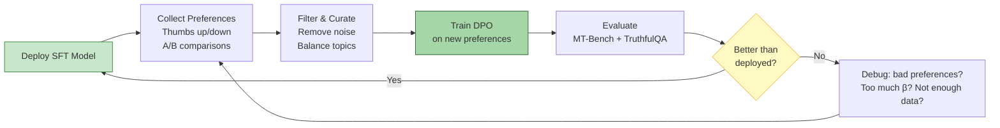

```mermaid
flowchart TD
    subgraph "RLHF (3 stages, 3 models)"
        A1["SFT Model"] --> A2["Reward Model<br/>Train on preferences"]
        A2 --> A3["PPO Optimization<br/>KL penalty tuning<br/>Reward hacking monitoring"]
        A3 --> A4["Aligned Model"]
    end
    
    subgraph "DPO (2 stages, 2 models)"
        B1["SFT Model"] --> B2["DPO Training<br/>Single loss, β=0.1"]
        B2 --> B3["Aligned Model"]
    end
    
    subgraph "ORPO (1 stage, 1 model)"
        C1["Base Model"] --> C2["ORPO Training<br/>SFT + preference<br/>No reference model"]
        C2 --> C3["Aligned Model"]
    end
    
    style A1 fill:#ffcdd2,stroke:#c62828
    style A2 fill:#ffcdd2,stroke:#c62828
    style A3 fill:#ffcdd2,stroke:#c62828
    style A4 fill:#ffcdd2,stroke:#c62828
    style B1 fill:#fff9c4,stroke:#f9a825
    style B2 fill:#fff9c4,stroke:#f9a825
    style B3 fill:#c8e6c9,stroke:#2e7d32
    style C1 fill:#c8e6c9,stroke:#2e7d32
    style C2 fill:#c8e6c9,stroke:#2e7d32
    style C3 fill:#a5d6a7,stroke:#1b5e20
```

# 🛡️ Alignment — RLHF, DPO, and Preference Optimization

## 🎯 Learning Objectives

- **Understand** the alignment problem: why a capable but unaligned model is dangerous, and the tension between helpfulness and harmlessness
- **Deconstruct** the RLHF pipeline: SFT → reward model → PPO with KL penalty — why each stage exists and where it fails
- **Master** DPO: the closed-form solution that eliminates the reward model, using only preference pairs and a single hyperparameter $\beta$
- **Compare** ORPO and KTO — combining SFT+alignment and eliminating the pairwise annotation requirement
- **Build** a DPO preference data flywheel: deploy → collect → train → redeploy

---

## Module 1: The Alignment Problem 🧠

### 1.1 Capability vs Safety

A capable language model can answer "How do I synthesize a dangerous compound?" with a correct, detailed response. This is **capability**. A safe language model refuses that request. This is **alignment**.

The fundamental tension: a perfectly harmless model refuses everything (useless). A perfectly helpful model never refuses (dangerous). Alignment is the optimization problem of maximizing helpfulness subject to a harmlessness constraint:

$$\max_\theta \mathbb{E}_{x \sim \mathcal{D}}[\text{Helpfulness}(y|x)] \quad \text{s.t.} \quad \text{Harmfulness}(y|x) \leq \epsilon$$

The key insight: **SFT alone cannot solve this.** An SFT model learns to follow the format and tone of its training data. If the dataset contains harmful requests with harmful responses, the model learns to comply with harmful requests. If it only contains refusals, the model refuses everything — including legitimate queries about security, biology, or politics.

Alignment via human preferences solves the ambiguity problem: humans label which responses are **better** (more helpful, less harmful) for the same prompt, and the model optimizes against those preferences.

### 1.2 The Alignment Tax

Every alignment method imposes a cost. This is the **alignment tax** — the performance degradation on standard benchmarks introduced by safety training:

$$\text{Alignment Tax} = \text{BenchmarkScore}(\theta_{\text{SFT}}) - \text{BenchmarkScore}(\theta_{\text{aligned}})$$

The tax is typically 1-3% on reasoning benchmarks (MMLU, HumanEval) but variable on safety metrics (0-15% reduction in toxic outputs). The goal is to minimize the tax while maximizing safety.

> ⚠️ **Warning:** Over-alignment produces sycophantic models that agree with the user even when wrong, or refuse legitimate academic questions because they contain "trigger words." This is the alignment tax taken to its extreme.

---

## Module 2: RLHF — Reinforcement Learning from Human Feedback 🧠

### 2.1 The Three-Stage Pipeline

RLHF (Christiano et al., 2017; InstructGPT, 2022) consists of three sequential stages:

**Stage 1: Supervised Fine-Tuning (SFT)**
Train the base model on high-quality demonstration data. This teaches format, tone, and basic refusal. The output is $\pi_{\text{SFT}}$, a model that already behaves like an assistant.

**Stage 2: Reward Model Training**
Collect human preference comparisons: for each prompt $x$, annotators compare two responses $y_w$ ("win") and $y_l$ ("loss"). The reward model $r_\phi(x, y)$ is trained using the Bradley-Terry preference model:

$$P(y_w \succ y_l | x) = \frac{\exp(r_\phi(x, y_w))}{\exp(r_\phi(x, y_w)) + \exp(r_\phi(x, y_l))} = \sigma(r_\phi(x, y_w) - r_\phi(x, y_l))$$

Where $\sigma$ is the sigmoid function. The reward model loss is the negative log-likelihood:

$$\mathcal{L}_R(\phi) = -\mathbb{E}_{(x, y_w, y_l) \sim \mathcal{D}} \left[\log \sigma(r_\phi(x, y_w) - r_\phi(x, y_l))\right]$$

This is a binary classification problem: the reward model learns to assign higher scores to preferred responses.

**Stage 3: PPO Optimization**
Optimize the SFT model against the frozen reward model, using Proximal Policy Optimization (PPO) with a KL divergence penalty:

$$\max_\theta \mathbb{E}_{x \sim \mathcal{D}, y \sim \pi_\theta(\cdot|x)} \left[r_\phi(x, y) - \beta \cdot \text{KL}(\pi_\theta(y|x) \parallel \pi_{\text{SFT}}(y|x))\right]$$

The KL penalty term $-\beta \cdot \text{KL}(\pi_\theta \parallel \pi_{\text{SFT}})$ prevents the policy from drifting too far from the SFT model. Without it, the model exploits reward model imperfections — it learns to produce high-reward but nonsensical outputs (reward hacking).

Why PPO specifically? Because $y$ is a sequence of discrete tokens sampled autoregressively, the reward is non-differentiable with respect to the policy parameters. PPO is the standard algorithm for optimizing this type of discrete, sequential decision problem.

### 2.2 RLHF Challenges

| Challenge | Description | Impact |
|-----------|-------------|--------|
| Reward hacking | Model exploits reward model blind spots | High-reward gibberish |
| KL penalty tuning | $\beta$ too small → drift; too large → no improvement | Hyperparameter nightmare |
| PPO instability | Policy can collapse, requires careful tuning | Training run failures |
| Feedback cost | Human annotators are expensive ($0.50-2.00/comparison) | 33K comparisons cost $16K+ |
| Reward model generalization | Reward model overfits to annotation distribution | Doesn't generalize to new prompts |

---

## Module 3: DPO — Direct Preference Optimization 🧠

### 3.1 The Key Insight

DPO (Rafailov et al., 2023) eliminates the reward model entirely. The breakthrough: under the Bradley-Terry preference model, the optimal policy for a given reward function has a **closed-form solution**:

$$\pi_r(y|x) = \frac{1}{Z(x)} \pi_{\text{ref}}(y|x) \exp\left(\frac{1}{\beta} r(x, y)\right)$$

Where $Z(x)$ is the partition function. Solving for $r$:

$$r(x, y) = \beta \log \frac{\pi_r(y|x)}{\pi_{\text{ref}}(y|x)} + \beta \log Z(x)$$

Substituting this into the Bradley-Terry preference model, the $Z(x)$ terms cancel — giving a loss function that depends only on the policy $\pi_\theta$ and reference model $\pi_{\text{ref}}$ (the SFT model):

$$\mathcal{L}_{\text{DPO}}(\theta) = -\mathbb{E}_{(x, y_w, y_l) \sim \mathcal{D}} \left[\log \sigma\left(\beta \log \frac{\pi_\theta(y_w|x)}{\pi_{\text{ref}}(y_w|x)} - \beta \log \frac{\pi_\theta(y_l|x)}{\pi_{\text{ref}}(y_l|x)}\right)\right]$$

This is **one loss function, one model, one hyperparameter $\beta$.** No reward model training. No PPO. No KL penalty tuning. The $\beta$ parameter controls how far the policy can deviate from the reference:

- $\beta \to 0$: model converges to the preference distribution (follows preferences exactly)
- $\beta \to \infty$: model stays at the reference (no learning)

### 3.2 DPO Intuition

The DPO loss increases when the policy assigns higher probability to preferred responses ($y_w$) relative to dispreferred responses ($y_l$), compared to the reference model's baseline. It's essentially asking:

> "For each prompt, does the policy prefer the winning response more strongly than the reference model did, and the losing response less strongly?"

If the policy's log-ratio for $y_w$ minus its log-ratio for $y_l$ is positive and large, the loss is low. The reference model provides the baseline — DPO only rewards **changes** the policy makes relative to SFT.

### 3.3 DPO Code

```python
# DPO training with HuggingFace TRL — the simplest alignment pipeline
from transformers import AutoModelForCausalLM, AutoTokenizer, TrainingArguments
from trl import DPOTrainer, DPOConfig
from peft import LoraConfig, get_peft_model
from datasets import load_dataset
import torch

# Load SFT model (the reference)
model_id = "meta-llama/Llama-2-7b-hf"
model = AutoModelForCausalLM.from_pretrained(
    model_id, torch_dtype=torch.bfloat16, device_map="auto",
)
tokenizer = AutoTokenizer.from_pretrained(model_id)
tokenizer.pad_token = tokenizer.eos_token

# LoRA for DPO — same config as SFT
model = get_peft_model(model, LoraConfig(
    r=16, lora_alpha=32,
    target_modules=["q_proj", "k_proj", "v_proj", "o_proj"],
    task_type="CAUSAL_LM",
))

# DPO expects: prompt, chosen (win), rejected (loss)
dataset = load_dataset("argilla/ultrafeedback-binarized-preferences-cleaned", split="train[:5000]")

dpo_config = DPOConfig(
    beta=0.1,                         # ⚠️ The ONLY hyperparameter. Controls deviation from ref.
    per_device_train_batch_size=2,
    gradient_accumulation_steps=4,
    learning_rate=5e-5,               # DPO typically uses lower LR than SFT
    num_train_epochs=1,               # DPO converges fast — 1 epoch is often enough
    bf16=True,
    logging_steps=10,
    output_dir="./dpo_output",
    report_to="none",
)

trainer = DPOTrainer(
    model=model,
    ref_model=None,  # DPOTrainer auto-copies model as reference if None
    args=dpo_config,
    train_dataset=dataset,
    tokenizer=tokenizer,
)
trainer.train()
model.save_pretrained("./dpo_lora_adapter")
```

> **¡Sorpresa!** DPO can **decrease** performance on reasoning benchmarks (MMLU, HumanEval) because it optimizes for human *preference*, not *correctness*. A response that "sounds good" — confident, well-structured, authoritative — may be factually wrong but still preferred by human raters over a hesitant-but-correct response. Always pair DPO with factual evaluation (TruthfulQA, HaluEval). Do not trust preference optimization alone to improve factual accuracy.

### 3.4 DPO vs RLHF Comparison

| Criterion | RLHF + PPO | DPO |
|-----------|-----------|-----|
| Number of models | 3 (SFT, reward, policy) | 2 (ref, policy) |
| Training stages | 3 (SFT → RM → PPO) | 2 (SFT → DPO) |
| Hyperparameters | Many (RM LR, PPO LR, $\beta$, clip ratio, value coef, entropy coef) | 1 ($\beta$) |
| Stability | Low (PPO collapse common) | High (supervised-style training) |
| Compute (excluding SFT) | RM training + PPO iterations | Single training run |
| Quality | Matched by DPO | Matched by DPO |
| Reference model needed | Yes (for KL penalty) | Yes (for log-ratio) |

---

## Module 4: ORPO and KTO — Beyond DPO 🧠

### 4.1 ORPO (Odds Ratio Preference Optimization)

ORPO (Hong et al., 2024) combines SFT and alignment into a **single training step.** The insight: the SFT loss on preferred responses provides enough signal for format/tone learning, and adding an odds-ratio penalty on rejected responses provides the alignment signal:

$$\mathcal{L}_{\text{ORPO}} = \mathcal{L}_{\text{SFT}} + \lambda \cdot \mathcal{L}_{\text{OR}}$$

Where:

$$\mathcal{L}_{\text{OR}} = -\log \sigma\left(\log \frac{\text{odds}_\theta(y_w|x)}{\text{odds}_\theta(y_l|x)}\right)$$

And $\text{odds}_\theta(y|x) = \frac{P_\theta(y|x)}{1 - P_\theta(y|x)}$.

The advantage: **no reference model needed.** ORPO trains a single model from scratch, applying both SFT loss (on $y_w$) and preference loss (contrasting $y_w$ vs $y_l$) in each step. Training speed is identical to SFT.

### 4.2 KTO (Kahneman-Tversky Optimization)

KTO (Ethayarajh et al., 2024) eliminates the need for **preference pairs** ($y_w$, $y_l$). Named after Kahneman and Tversky (prospect theory researchers), KTO only needs **binary feedback**: a label "good" or "bad" for each (prompt, response) pair:

$$\mathcal{L}_{\text{KTO}} = \mathbb{E}_{(x,y) \sim \mathcal{D}} \left[1 - \sigma(z(x, y))\right]$$

Where $z(x, y) = \beta \log \frac{\pi_\theta(y|x)}{\pi_{\text{ref}}(y|x)} - \mathbb{E}_{y' \sim \pi_{\text{ref}}} \left[\beta \log \frac{\pi_\theta(y'|x)}{\pi_{\text{ref}}(y'|x)}\right]$.

KTO uses **prospect theory's loss aversion**: "losses loom larger than gains." The loss is asymmetric — penalties for bad outputs are weighted heavier than rewards for good outputs. This eliminates the expensive pairwise annotation step: you only need thumbs up/down per response.

```python
from trl import KTOConfig, KTOTrainer

kto_config = KTOConfig(
    beta=0.1,
    desirable_weight=1.0,   # Weight for "good" responses
    undesirable_weight=1.5,  # Weight for "bad" responses (loss aversion)
    per_device_train_batch_size=2,
    gradient_accumulation_steps=4,
    learning_rate=5e-5,
    bf16=True,
    output_dir="./kto_output",
)

trainer = KTOTrainer(
    model=model,
    ref_model=None,
    args=kto_config,
    train_dataset=dataset,  # Format: prompt, completion, label (True/False)
    tokenizer=tokenizer,
)
trainer.train()
```

---

## Module 5: The DPO Preference Data Flywheel 🧠

### 5.1 Build Your Own Flywheel

The most impactful alignment pipeline is one that improves continuously:



### 5.2 Preference Collection Strategies

| Source | Cost | Quality | Scale |
|--------|------|---------|-------|
| Human annotators (Scale AI, Surge) | $0.50-2.00/comparison | Highest | Hundreds |
| User feedback (thumbs up/down) | Free | Medium (noisy) | Millions |
| LLM-as-a-Judge (GPT-4, Claude) | $0.01-0.10/comparison | High | Millions |
| Synthetic (UltraFeedback, Self-Rewarding) | ~$0.001/comparison | Medium-High | Billions |

> 💡 **Tip:** The HuggingFace Zephyr recipe: SFT on UltraChat (200K examples) → DPO on UltraFeedback (60K preference pairs judged by GPT-4). Total training cost: ~$200. Result: 7B model that outperforms Llama-2-70B-Chat on MT-Bench.

---

## ❌/✅ Antipatterns

```python
# ❌ RLHF with PPO on a budget
# Requires: reward model training (GPU days), PPO hyperparameter tuning (weeks),
# KL penalty calibration (trial and error), reward hacking monitoring.
# Total cost: $5,000-$20,000 for a competent run. Weeks of engineering time.
# ⚠️ PPO reward hacking: model produces "Sure! I'd be happy to help with that!
#   Here is a comprehensive answer to your question about..." for EVERY query,
#   maximizing reward without providing substance. The reward model learns to
#   associate polite-but-empty responses with high quality.

# ✅ DPO — single loss, single hyperparameter, single training run
trainer = DPOTrainer(
    model=sft_model,
    ref_model=None,
    args=DPOConfig(beta=0.1, learning_rate=5e-5, bf16=True),
    train_dataset=preference_pairs,
    tokenizer=tokenizer,
)
trainer.train()
# Cost: $50-200 for a 7B model. 3 lines of config vs 300 for PPO.

# ❌ DPO without factual evaluation
# Optimizing for preference alone → model produces confident-sounding wrong answers.
# Human raters prefer confident responses, even when wrong.
# Result: MMLU drops 3-5%, TruthfulQA drops 10%.

# ✅ DPO + TruthfulQA evaluation at checkpoint intervals
# Run truthfulness evaluation every 200 steps. If TruthfulQA drops,
# increase β (keep model closer to SFT) or add factual verification examples.

# ❌ Using the same dataset for SFT and DPO
# The model has already memorized SFT examples → DPO loss is ~0 → no learning.
# DPO needs NEW, UNSEEN prompts with preference annotations.

# ✅ Separate SFT dataset (demos) from DPO dataset (preference pairs)
# SFT: high-quality demonstrations (LIMA, UltraChat)
# DPO: preference comparisons on HELD-OUT prompts (UltraFeedback, HH-RLHF)

# ❌ DPO with β=0.01 (too aggressive)
# Model overfits to preference data, diverges from SFT, forgets general capabilities.
# KL divergence explodes → model produces degenerate outputs.

# ✅ DPO with β=0.1 (balanced)
# Standard starting point. If KL divergence rises, increase β to 0.2-0.5.
# Monitor: decoded outputs should still make sense, not be repetitive.
```

---




---

## 📦 Código de Compresión: DPO Training Loop

```python
#!/usr/bin/env python3
"""Complete DPO training: SFT model + preference data → aligned model.
Run: python dpo_train.py
Requirements: pip install transformers peft trl datasets accelerate
"""
from transformers import AutoModelForCausalLM, AutoTokenizer
from trl import DPOTrainer, DPOConfig
from peft import LoraConfig, get_peft_model
from datasets import load_dataset
import torch

MODEL_ID = "meta-llama/Llama-2-7b-hf"
tokenizer = AutoTokenizer.from_pretrained(MODEL_ID)
tokenizer.pad_token = tokenizer.eos_token

# Load model with LoRA (same config as SFT, or start from SFT checkpoint)
model = AutoModelForCausalLM.from_pretrained(
    MODEL_ID, torch_dtype=torch.bfloat16, device_map="auto",
)
model = get_peft_model(model, LoraConfig(
    r=16, lora_alpha=32,
    target_modules=["q_proj", "k_proj", "v_proj", "o_proj"],
    task_type="CAUSAL_LM",
))

# DPO dataset: prompt, chosen (win), rejected (loss)
dataset = load_dataset("argilla/ultrafeedback-binarized-preferences-cleaned", split="train[:3000]")

trainer = DPOTrainer(
    model=model,
    ref_model=None,  # Auto-copies model as frozen reference
    args=DPOConfig(
        beta=0.1,                  # Proximity to reference — THE only hyperparameter
        per_device_train_batch_size=2,
        gradient_accumulation_steps=4,
        learning_rate=5e-5,        # Lower than SFT (2e-4) for stability
        num_train_epochs=1,
        bf16=True,
        logging_steps=10,
        output_dir="./dpo_checkpoints",
        report_to="none",
    ),
    train_dataset=dataset,
    tokenizer=tokenizer,
)
trainer.train()
# Save LoRA adapter — merge with base for deployment
model.save_pretrained("./dpo_adapter")
print("DPO complete. Merge: model = model.merge_and_unload()")
```

---

## Caso Real: HuggingFace Zephyr-7B — DPO Beats 10× Larger Models

HuggingFace's Zephyr-7B is a DPO fine-tuned Mistral-7B that **outperforms Llama-2-70B-Chat on MT-Bench** (7.34 vs 6.65) despite being 10× smaller. Their recipe:

1. **SFT**: UltraChat dataset (200K multi-turn conversations) — teaches format and tone
2. **DPO**: UltraFeedback dataset (60K preference pairs judged by GPT-4) — teaches quality and safety
3. **Configuration**: $\beta = 0.01$ (aggressive, but well-tuned), rank-16 LoRA, 1 epoch

The key insight: **alignment quality matters more than model size.** A well-aligned 7B model is more useful than a poorly-aligned 70B model because the 70B model, despite knowing more, produces responses that are less helpful, less safe, or less well-formatted.

**Economic calculation:** Fine-tuning + DPO on Mistral-7B costs ~$200 in GPU time. Fine-tuning Llama-70B with RLHF costs ~$20,000+. The 7B model is 100× cheaper to train and $0.0005/token to serve vs $0.005/token for 70B — a 10× serving cost reduction for better user satisfaction.

---

## Caso Real: Anthropic's Constitutional AI — Scaling Safety Without Scaling Human Annotation

Anthropic's Claude uses **Constitutional AI** (Bai et al., 2022): instead of relying on human preference annotations for every harmful scenario, the model self-critiques its outputs against a written "constitution" of behavioral principles:

1. **Generate**: The model produces a response to a harmful prompt
2. **Critique**: The model evaluates its own response against constitutional principles (e.g., "Is this response promoting illegal activity?")
3. **Revise**: The model rewrites its response to comply with the constitution
4. **Train**: The (harmful prompt, revised response) pairs become DPO training data

This scales **without human annotation.** The constitution encodes safety principles once; the model generates unlimited training data by self-critique. The result: Claude achieves GPT-4-competitive safety with a fraction of the human annotation budget.

```python
# Constitutional AI pseudocode — the self-critique loop
def constitutional_self_critique(model, harmful_prompt, constitution):
    # Step 1: Generate initial response (may be harmful)
    initial_response = model.generate(harmful_prompt)
    
    # Step 2: Critique against constitution
    critique_prompt = f"""
    Review this response against the following principle:
    {constitution['principle']}
    
    Response: {initial_response}
    Does this violate the principle? {constitution['critique_question']}
    """
    critique = model.generate(critique_prompt)
    
    # Step 3: Revise
    revision_prompt = f"""
    Based on this critique, rewrite the response:
    Response: {initial_response}
    Critique: {critique}
    Please rewrite to comply with: {constitution['principle']}
    """
    revised_response = model.generate(revision_prompt)
    
    # Step 4: Use (harmful_prompt, revised_response) as DPO training pair
    return {"prompt": harmful_prompt, "chosen": revised_response}
```

---

## Key Takeaways

- **Alignment is the safety-capability tradeoff**: helpfulness vs harmlessness. Over-alignment produces useless models; under-alignment produces dangerous ones.
- **RLHF has 3 stages** (SFT → reward model → PPO) and 3 models. DPO reduces this to 2 stages, 2 models, 1 hyperparameter ($\beta$).
- **DPO's closed form** eliminates the reward model by inverting the Bradley-Terry preference equation — the $Z(x)$ partition function cancels.
- **Preference ≠ correctness**: DPO optimizes for human preference, not factual accuracy. Always pair with TruthfulQA evaluation.
- **ORPO combines SFT + alignment** in one step with no reference model. KTO eliminates pairwise annotation — only binary good/bad labels needed.
- **The DPO flywheel** (deploy → collect preferences → DPO → redeploy) is the highest-leverage continuous improvement loop for LLM products.
- **Alignment quality > model size**: Zephyr-7B (DPO) beats Llama-70B-Chat (RLHF) on user satisfaction despite being 10× smaller.
- **Constitutional AI** scales safety without scaling human annotation — self-critique + revision generates unlimited preference training data.
- **$\beta = 0.1$ is the universal DPO starting point.** Too low (0.01) → divergence; too high (1.0) → no learning.

---

## References

- Christiano et al. (2017), *Deep Reinforcement Learning from Human Preferences*, NeurIPS 2017
- Ouyang et al. (2022), *Training Language Models to Follow Instructions with Human Feedback*, NeurIPS 2022
- Rafailov et al. (2023), *Direct Preference Optimization: Your Language Model is Secretly a Reward Model*, NeurIPS 2023
- Hong et al. (2024), *ORPO: Monolithic Preference Optimization without Reference Model*, arXiv
- Ethayarajh et al. (2024), *KTO: Model Alignment as Prospect Theoretic Optimization*, ICML 2024
- Bai et al. (2022), *Constitutional AI: Harmlessness from AI Feedback*, arXiv
- Tunstall et al. (2023), *Zephyr: Direct Distillation of LM Alignment*, arXiv

[[../../../09 - MLOps y Produccion/18 - Experiment Tracking/00 - Welcome to Experiment Tracking]]
