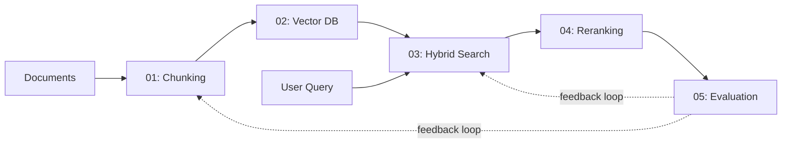
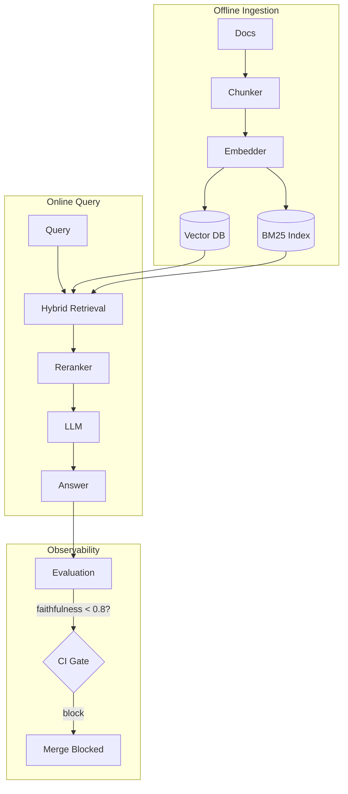

# 🏭 Welcome to Production RAG

Retrieval-Augmented Generation (RAG) is the **#1 enterprise LLM pattern**. Every job posting for ML/AI engineers mentions it. This course builds production-grade RAG from fundamentals to deployment — not toy notebooks, but systems that handle 10K queries/second with sub-100ms latency.

> 💡 **Why RAG matters:** Foundation models know *when the French Revolution happened* but not *what your company's Q4 sales report says*. RAG bridges this gap by giving LLMs access to your private data at query time — no fine-tuning required.

---

## Course Map

This course is structured as five deep, focused notes that progressively build a complete production RAG system:

| # | Note | Core Question |
|---|------|--------------|
| 01 | [[01 - Document Chunking Strategies]] | How do you split documents so the right passage is findable? |
| 02 | [[02 - Vector Databases for RAG]] | How do you store and search millions of vectors at sub-10ms? |
| 03 | [[03 - Advanced Retrieval - Hybrid Search and Fusion]] | How do you combine dense + sparse search? |
| 04 | [[04 - Reranking - Cross-Encoders, ColBERT and LLM-as-Reranker]] | How do you re-rank 100 candidates to get 10 perfect ones? |
| 05 | [[05 - RAG Evaluation - RAGAS, DeepEval and Production Metrics]] | How do you measure and CI-test retrieval quality? |

---

## Prerequisites

- **Python 3.10+** — all code examples use Python
- **Embeddings fundamentals** — you know what a 768-dim vector is and why cosine similarity works
- **Basic vector search** — you've run `faiss.IndexFlatL2` at least once
- **LLM familiarity** — you've used `gpt-4o-mini` or similar via an API

If you come from [[06 - Fundamentos de LLMs]], you're ready. If not, the [[06/13/00 - Welcome to vLLM and Advanced RAG]] course has a prerequisite refresher note.

---

## How to Use This Course

1. **Read sequentially** — each note builds on the previous one. Chunking (01) determines what goes into the vector DB (02), which determines what hybrid search (03) operates on, which feeds the reranker (04), which gets evaluated (05).
2. **Run the Código de Compresión** — every note ends with a ~25-line self-contained code block. Run it. Break it. Change the parameters. The fastest way to learn is to see HNSW fail when you set efSearch too low.
3. **Study the Caso Real sections** — each note includes a real company case study (Microsoft, Notion, Elastic, Cohere, LangChain). These are not hypotheticals; they are production patterns you can steal.

---

## Key Internal Links

This course is part of a larger RAG curriculum. When you finish, continue to:

- **[[06/13 - vLLM and Advanced RAG]]** — GPU-accelerated inference, multi-GPU serving, continuous batching, and advanced RAG patterns (HyDE, self-RAG, FLARE)
- **[[10/33 - Vector Databases]]** — deeper dive into Qdrant, Milvus, Weaviate internals; distributed index sharding, consistency models, multi-tenancy
- **[[06/17 - ColBERT Next-Gen Retrieval]]** — token-level late interaction, PLAID indexing, MaxSim, ColBERTv2

---

## Production RAG at a Glance

The architecture you'll build:

## RAG Market Context

RAG is not a fad — it's the default architecture for enterprise LLM applications:

- **93% of enterprises** using LLMs in production employ some form of RAG (LangChain State of AI 2024)
- **RAG engineer** is the most common job title in the "AI Engineer" category on LinkedIn
- **Cost efficiency:** RAG answers cost ~$0.002/query (embedding + retrieval + LLM) vs $0.05-0.50 for fine-tuned model inference serving the same knowledge

The skills in this course — chunking strategy, vector index tuning, hybrid search fusion, reranker selection, RAGAS evaluation — appear directly in job descriptions from Stripe, Notion, Datadog, and every company building AI features.

Let's start with the foundation: [[01 - Document Chunking Strategies]].

