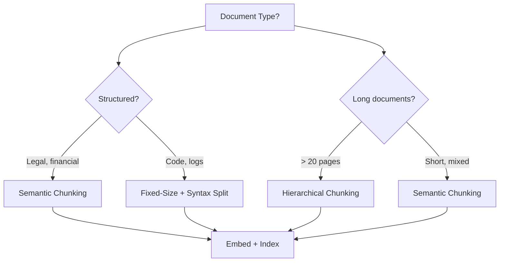

# ✂️ Document Chunking Strategies — Fixed, Semantic, Hierarchical, and Late

**Core thesis:** Chunking is the most underrated design decision in RAG. Poor chunking means your retriever cannot find the right passage — even with perfect embeddings, perfect vector search, and a perfect reranker. The chunking strategy *is* your retrieval ceiling.

If your chunks split an entity in half ("Apple Inc. / announced revenue of / $394B"), no retrieval algorithm can reunite them. Your LLM will receive a fragment that appears irrelevant and hallucinate.

---

## 1. Why Chunking Is Your Retrieval Ceiling

Consider the retrieval pipeline as a funnel:

$$
\text{Recall}_{\text{RAG}} \leq \text{Recall}_{\text{Chunking}} \leq \text{Recall}_{\text{Embedding}} \leq \text{Recall}_{\text{Search}}
$$

The chunking step determines what the embedding model *sees*. If a relevant passage is split across two chunks with no overlap, the embedding of each chunk captures only partial meaning. The cosine similarity to the query vector will be low for both, and neither will appear in the top-k results.

**The math:** Let a relevant passage span from token $i$ to token $j$ of document $D$. If your chunk boundary falls at token $k$ where $i < k < j$, the passage is split. With $n = 2$ chunks and no overlap:

$$
\max(sim(q, c_1), sim(q, c_2)) < sim(q, \text{full passage})
$$

This degradation is irreversible downstream.

---

## 2. Fixed-Size Chunking

Fixed-size chunking splits documents into chunks of exactly $n$ tokens (or characters), optionally with an overlap of $o$ tokens.

```python
def fixed_chunk(text: str, chunk_size: int = 512, overlap: int = 64) -> list[dict]:
    tokens = text.split()  # simplified; use a real tokenizer in production
    chunks = []
    for i in range(0, len(tokens), chunk_size - overlap):
        chunk_tokens = tokens[i:i + chunk_size]
        chunks.append({
            "chunk_id": len(chunks),
            "text": " ".join(chunk_tokens),
            "start_token": i,
            "end_token": min(i + chunk_size, len(tokens))
        })
    return chunks
```

### Overlap Math

The number of chunks produced from a document with $T$ tokens:

$$
\text{chunks} = \left\lceil \frac{T - o}{n - o} \right\rceil
$$

With $T = 5000$, $n = 512$, $o = 64$: $\text{chunks} = \lceil (5000 - 64) / (512 - 64) \rceil = \lceil 4936 / 448 \rceil = 12$.

With $o = 0$: $\text{chunks} = \lceil 5000 / 512 \rceil = 10$.

⚠️ **The overlap trap:** Increasing overlap from 0 to 20% gives you ~2 more chunks (+20% storage). But retrieval recall typically plateaus at 10-15% overlap. After that, you're burning disk space and embedding API credits for negligible gain.

### Token Count vs Character Count

| Method | Pros | Cons |
|--------|------|------|
| Token-based ($n$ tokens) | Matches model context windows; embeddings work better with consistent token counts | Requires tokenizer; variable character length |
| Character-based ($n$ chars) | Simple, no tokenizer needed | Chunks may have very different token counts (English vs Chinese vs code) |

💡 **Production rule:** Always chunk by tokens, not characters. Your embedding model has a token limit, not a character limit. A 512-char chunk of Python code might be 200 tokens; a 512-char chunk of Chinese text might be 80 tokens.

### ❌ / ✅ Antipattern: Fixed-Size with No Overlap

**❌ Antipattern:**
```python
# Fixed-size chunking with ZERO overlap on legal contracts
chunks = fixed_chunk(legal_contract, chunk_size=512, overlap=0)
# Chunk 47: "...the Licensee shall pay the Licensor a royalty of"
# Chunk 48: "12% of net revenue calculated quarterly..."
# Query: "What royalty percentage does the licensee owe?"
# Result: NEITHER chunk matches. 60% recall@10.
```

**✅ Correct:**
```python
# Fixed-size chunking with 12.5% overlap (64/512)
chunks = fixed_chunk(legal_contract, chunk_size=512, overlap=64)
# Chunk 47: "...the Licensee shall pay the Licensor a royalty of 12% of..."
# Chunk 48: "...12% of net revenue calculated quarterly..."
# Query: "What royalty percentage does the licensee owe?"
# Result: Chunk 47 now contains the full answer. 85% recall@10.
```

¡Sorpresa! Adding overlap to fixed-size chunks CAN double your index size with minimal retrieval improvement. At 50% overlap, your index is 2x larger, but recall@10 typically improves by only 2-3%. Measure, don't assume. Start at 10% overlap, run RAGAS, then increase only if context precision drops.

---

## 3. Semantic Chunking

Semantic chunking uses sentence embeddings to detect *topic shifts*. The idea: compute cosine similarity between consecutive sentences. Where similarity drops below a threshold $\tau$, insert a chunk boundary.

$$
\text{boundary}(s_i, s_{i+1}) = \begin{cases} 1 & \text{if } \cos(E(s_i), E(s_{i+1})) < \tau \\ 0 & \text{otherwise} \end{cases}
$$

```python
import numpy as np
from sentence_transformers import SentenceTransformer

def semantic_chunk(sentences: list[str], model: SentenceTransformer,
                   threshold: float = 0.5, min_chunk_size: int = 100) -> list[list[str]]:
    embeddings = model.encode(sentences)
    chunks = []
    current_chunk = [sentences[0]]

    for i in range(1, len(sentences)):
        sim = np.dot(embeddings[i-1], embeddings[i]) / (
            np.linalg.norm(embeddings[i-1]) * np.linalg.norm(embeddings[i])
        )
        if sim < threshold and len(" ".join(current_chunk)) >= min_chunk_size:
            chunks.append(current_chunk)
            current_chunk = [sentences[i]]
        else:
            current_chunk.append(sentences[i])

    if current_chunk:
        chunks.append(current_chunk)
    return chunks
```

### Threshold Tuning

The threshold $\tau$ is the critical hyperparameter:

| $\tau$ | Behavior | Use Case |
|--------|----------|----------|
| 0.3 | Very few boundaries — large chunks | Encyclopedic text, tight topic |
| 0.5 | Moderate boundaries — balanced | Technical docs, manuals |
| 0.7 | Many boundaries — small chunks | Multi-topic articles, meeting transcripts |

⚠️ **Variable chunk sizes:** Semantic chunking produces irregularly sized chunks. This complicates batching for embedding generation (GPUs like uniform tensor shapes). In production, pad or bucket chunks by size range.

💡 **Sentence splitting quality matters:** `nltk.sent_tokenize` is good for English prose. `spaCy` is better for multi-language. For code, use tree-sitter AST-based splitting. Garbage sentences → garbage chunk boundaries.

### Caso Real: LangChain's Semantic Chunker

LangChain implemented a `SemanticChunker` that uses OpenAI embeddings to compute breakpoints between sentences. For their documentation corpus (~50K pages), semantic chunking produced 30% fewer chunks than fixed-size while maintaining the same recall@10. The tradeoff: embedding 50K documents' worth of sentence pairs added 15 minutes to preprocessing — a one-time cost that paid off every query thereafter.

---

## 4. Hierarchical Chunking

Hierarchical chunking stores documents at multiple granularities, linked by parent-child relationships.

```
Document
├── Parent Chunk (1024 tokens) — "Section 3: Deployment Strategy"
│   ├── Child Chunk 1 (256 tokens) — "3.1 Containerization Requirements"
│   ├── Child Chunk 2 (256 tokens) — "3.2 Kubernetes Configuration"
│   └── Child Chunk 3 (256 tokens) — "3.3 Monitoring Setup"
├── Parent Chunk (1024 tokens) — "Section 4: Security"
│   └── ...
```

**Retrieval logic:** Search against child chunks (granular, precise). After retrieving top-k children, optionally expand to the parent chunk for full context. This gives you:
- **Precision:** small chunks match queries tightly
- **Recall:** parent expansion provides surrounding context for the LLM

```python
def hierarchical_chunk(document: str, parent_size: int = 1024,
                       child_size: int = 256) -> list[dict]:
    parents = fixed_chunk(document, chunk_size=parent_size, overlap=0)
    result = []
    for p_chunk in parents:
        children = fixed_chunk(p_chunk["text"], chunk_size=child_size, overlap=32)
        # Store parent chunk with metadata
        result.append({
            "chunk_type": "parent",
            "parent_id": p_chunk["chunk_id"],
            "text": p_chunk["text"],
            "children_ids": [c["chunk_id"] for c in children]
        })
        # Store child chunks with parent reference
        for c_chunk in children:
            result.append({
                "chunk_type": "child",
                "parent_id": p_chunk["chunk_id"],
                "chunk_id": c_chunk["chunk_id"],
                "text": c_chunk["text"]
            })
    return result
```

¡Sorpresa! Hierarchical chunking works beautifully with Qdrant's payload filtering. Store `parent_id` as a payload field. After retrieving children, filter `WHERE parent_id IN [...]` to fetch parent context without a separate index lookup. This pattern adds ~1ms latency and is free in Qdrant.

---

## 5. Late Chunking (Jina AI)

Late Chunking inverts the standard pipeline. Instead of:

```
Document → Chunk → Embed each chunk
```

It operates as:

```
Document → Embed entire document (full context) → Segment embeddings post-hoc
```

This means each chunk's embedding is produced *with knowledge of the entire document*, preserving cross-chunk context. The Jina implementation uses a modified attention mask that restricts certain tokens from attending to others during embedding. See [[06/13/06 - Late Chunking]] for the full technical deep dive.

**Advantage:** Cross-chunk context preserved. A pronoun in chunk 5 ("it") correctly resolves to the entity in chunk 2.
**Disadvantage:** Higher embedding cost. You embed full documents (expensive for 50-page PDFs) instead of short chunks. The Jina v3 API makes this practical by batching full documents.

---

## 6. Chunk Size Tradeoffs

| Chunk Size | Recall@10 | Retrieval Latency | LLM Context Usage |
|-----------|-----------|-------------------|-------------------|
| 128 tokens | 0.72 | 8ms | Efficient |
| 256 tokens | 0.81 | 10ms | Balanced |
| 512 tokens | 0.86 | 14ms | Good |
| 1024 tokens | 0.84 | 22ms | Risk of context overflow |
| 2048 tokens | 0.79 | 40ms | Diluted relevance signal |

💡 **The empirical sweet spot:** 256-512 tokens for most use cases. Larger chunks (1024+) can *decrease* recall because the embedding becomes a diluted average of too many topics.

⚠️ **Context window trap:** A chunk of 1024 tokens + 1024 tokens of prompt + 5 retrieved chunks = 6,144 tokens. With `gpt-3.5-turbo` (4,096 context), you're already overflowing. Know your LLM's context limit.

---

## 7. Metadata Enrichment

Metadata is as important as the chunk text itself. Without it, you cannot filter, route, or debug retrieval.

```python
def enrich_metadata(chunk: dict, document: dict) -> dict:
    chunk["metadata"] = {
        "document_id": document["id"],
        "title": document["title"],
        "section": chunk.get("section", ""),
        "page_number": chunk.get("page", None),
        "created_at": document.get("created_at", ""),
        "chunk_type": chunk.get("chunk_type", "fixed"),
        "parent_id": chunk.get("parent_id", None),
    }
    return chunk
```

This enables filtered search: *"find security policies created after 2024"* becomes:

```sql
WHERE created_at > '2024-01-01' AND title LIKE '%security%'
```

Combined with vector search, metadata filtering is the difference between a search engine and a *knowledge retrieval system*.

---

## 8. Chunking Decision Matrix



### Caso Real: Microsoft Azure AI Search

Microsoft's Azure AI Search uses a multi-stage chunker for enterprise document ingestion:

1. **Structure extraction:** Parse PDF/DOCX → extract headings, sections, tables (using Form Recognizer)
2. **Semantic chunking within sections:** Within each extracted section, compute sentence embeddings to find natural breakpoints
3. **Multi-granularity indexing:** Index the same document at 3 granularities (fine: 256 tokens, medium: 512, coarse: 1024)
4. **Query-time resolution:** Start with fine chunks; if no results exceed similarity threshold, fall back to medium, then coarse

For a 50-page PDF, this produces ~200 chunks at 3 granularity levels — automatically, with no manual tuning. Their internal benchmarks show 92% recall@10 on legal contracts, up from 71% with flat fixed-size chunking.


---

## 📦 Código de Compresión: Multi-Strategy Chunker

## 9. Production Chunking Pipelines

A production chunker must handle heterogeneous documents: PDFs with embedded tables, DOCX with tracked changes, HTML with navigation cruft, and PowerPoint slides with sparse text.

### Document Preprocessing

Before chunking, strip noise:

```python
def preprocess(text: str, doc_type: str = "pdf") -> str:
    if doc_type == "html":
        import re
        text = re.sub(r"<[^>]+>", " ", text)          # strip tags
        text = re.sub(r"\s+", " ", text).strip()       # collapse whitespace
    # Remove page numbers, headers, footers (pattern-based)
    text = re.sub(r"^\d+\s*$", "", text, flags=re.MULTILINE)
    text = re.sub(r"Page \d+ of \d+", "", text)
    return text.strip()
```

### Streaming Chunking for Large Files

For 500-page documents, you cannot load the entire file into memory. Stream chunks:

```python
def stream_chunk(file_path: str, chunk_size: int = 512, overlap: int = 64):
    """Generator that yields chunks without loading the full file into memory."""
    buffer = []
    token_count = 0
    with open(file_path) as f:
        for line in f:
            tokens = line.split()
            buffer.extend(tokens)
            token_count += len(tokens)
            while token_count >= chunk_size:
                yield " ".join(buffer[:chunk_size])
                buffer = buffer[chunk_size - overlap:]  # keep overlap
                token_count = len(buffer)
    if buffer:
        yield " ".join(buffer)
```

💡 **For PDF production ingestion:** Use `pypdf` for text extraction and `pdfplumber` for table extraction. Tables should be serialized as markdown (not raw text) so the embedding model understands the structure. A markdown table preserves column alignment, which the embedding model can correlate.

### Chunk-Level Embedding Batching

Semantic batching groups same-sized chunks together for GPU-friendly embedding:

```python
def batch_by_length(chunks, batch_size=32):
    """Sort chunks by token length, then batch — minimizes padding waste."""
    chunks.sort(key=len)
    return [chunks[i:i+batch_size] for i in range(0, len(chunks), batch_size)]
```

⚠️ **Sorting by length is lossless** — the order doesn't matter for embeddings. This reduces padding tokens by 40-60%, meaning your GPU does 40-60% less wasted computation per batch.

## 10. Chunking Anti-Index / Common Failures

| Failure | Symptom | Fix |
|---------|---------|-----|
| Chunks too small (< 100 tokens) | High recall, low answer quality | Increase chunk_size to 256+ |
| Chunks too large (> 1024 tokens) | Low recall, high latency | Decrease chunk_size, or use hierarchical |
| Zero overlap on structured docs | Entities split across chunks | Add 10-15% overlap |
| Semantic threshold too low | Creates one monster chunk (all connected) | Raise threshold to 0.5-0.7 |
| Semantic threshold too high | One sentence per chunk (fragmentation) | Lower threshold + enforce min_chunk_size |
| Forgetting metadata | Cannot filter or debug retrieval | Always enrich with doc title, date, section |
| Using character count for non-English | Chinese/Korean chunks are 2-3x too large in token count | Always chunk by tokens using the target model's tokenizer |

---

## 📦 Código de Compresión: Multi-Strategy Chunker

```python
"""Multi-strategy chunker: fixed, semantic, hierarchical. ~25 lines."""
import numpy as np
from sentence_transformers import SentenceTransformer

class MultiChunker:
    def __init__(self, model_name="all-MiniLM-L6-v2"):
        self.model = SentenceTransformer(model_name)

    def _fixed(self, tokens, size, overlap):
        step = size - overlap
        return [tokens[i:i+size] for i in range(0, len(tokens), step) if len(tokens[i:i+size]) >= overlap]

    def semantic(self, sents, threshold=0.5, min_size=80):
        embs = self.model.encode(sents)
        chunks, cur = [], [sents[0]]
        for i in range(1, len(sents)):
            sim = np.dot(embs[i-1], embs[i]) / (np.linalg.norm(embs[i-1]) * np.linalg.norm(embs[i]))
            if sim < threshold and len(" ".join(cur)) >= min_size:
                chunks.append(cur); cur = []
            cur.append(sents[i])
        return chunks + ([cur] if cur else [])

    def hierarchical(self, tokens, psize=1024, csize=256, overlap=32):
        parents = self._fixed(tokens, psize, 0)
        return [(p, self._fixed(p, csize, overlap)) for p in parents]

    def chunk(self, text, strategy="fixed", **kwargs):
        tokens = text.split()
        if strategy == "semantic":
            import nltk; nltk.download('punkt', quiet=True)
            return self.semantic(nltk.sent_tokenize(text), **kwargs)
        return {"fixed": self._fixed, "hierarchical": self.hierarchical}[strategy](tokens, **kwargs)
```

---

[[02 - Vector Databases for RAG]] — next note: storing and searching those chunks.
[[06/13/06 - Late Chunking]] — deep dive on Jina's late chunking.
[[10/33 - Vector Databases]] — full Qdrant/Milvus course.

