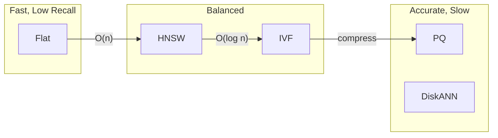
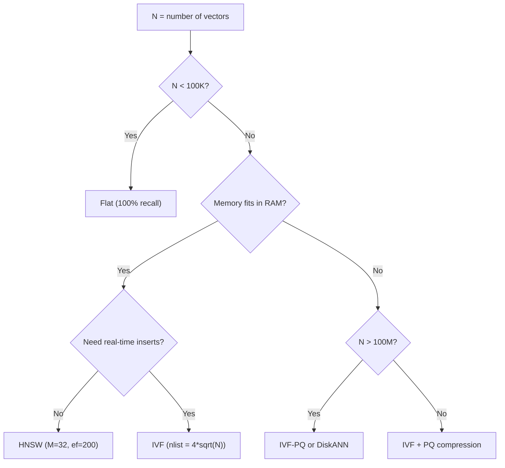

# 🗄️ Vector Databases for RAG — HNSW, IVF, PQ, and Filtering

**Core thesis:** The vector database is the retrieval engine. HNSW gives you sub-10ms search with 95%+ recall. IVF-PQ gives you billion-scale with compression. Understanding the index types is the difference between "it works in my notebook" and "it works at 10K queries/second."

Choosing the wrong index for your scale is the #1 cause of "but it worked fine on my laptop."

---

## 1. The Index Spectrum

Every vector index represents a tradeoff along three axes:

$$
\text{Quality (recall)} \longleftrightarrow \text{Speed (latency)} \longleftrightarrow \text{Cost (memory+compute)}
$$



---

## 2. Flat (Brute Force)

Flat search computes the distance from the query vector to *every* database vector. No approximation, no compression, no shortcuts.

$$
\text{score}(q, v_i) = \|q - v_i\|_2 \quad \forall i \in [1, N]
$$

**Cost:** $O(N \cdot d)$ distance computations. For $N = 1,000,000$ vectors of dimension $d = 768$: $768,000,000$ floating-point operations per query.

| Property | Value |
|----------|-------|
| Recall@10 | 100% (by definition) |
| Memory | $N \cdot d \cdot 4$ bytes (FP32) |
| QPS (1M vectors) | ~10 on CPU, ~100 on GPU |
| When to use | $N < 100,000$, benchmarking ground truth |

⚠️ **Flat has 100% recall but O(n) latency.** Above 100K vectors, you cannot run flat in production. It's the baseline against which all approximate indexes are measured.

---

## 3. HNSW (Hierarchical Navigable Small World)

HNSW builds a multi-layer proximity graph. At query time, it navigates from sparse long-range connections in upper layers down to dense local connections at layer 0.

### Construction

1. **Insert node $v$:** Randomly assign a level $l \sim \text{Geometric}(1/M_L)$
2. **For each level $\ell$ from $l$ down to 0:** Find $efConstruction$ nearest neighbors at level $\ell$, add bidirectional edges
3. **Prune edges:** If a node has more than $M$ edges, keep only the $M$ closest

**Parameters:**
- **M** (edges per node): 16-64. Higher M = denser graph = better recall, more memory.
- **efConstruction** (build effort): 100-500. Higher = more careful graph = better recall, slower build.
- **efSearch** (query effort): 100-500. Higher = wider search beam = better recall, slower query.

Memory formula for HNSW:

$$
\text{Memory} \approx N \cdot \left(d \cdot 4 + M \cdot 8 \right) \text{ bytes}
$$

For $N = 1M$, $d = 768$, $M = 32$: $\approx 1M \cdot (3072 + 256) \approx 3.33$ GB.

```python
import numpy as np
import heapq
from typing import List, Tuple

class HNSW:
    """HNSW index from scratch — Layer construction + greedy search."""

    def __init__(self, dim: int, M: int = 16, ef_construction: int = 200,
                 M_max: int = None, M_max0: int = None):
        self.dim = dim
        self.M = M
        self.M_max = M_max or M
        self.M_max0 = M_max0 or 2 * M
        self.ef_construction = ef_construction
        self.vectors: List[np.ndarray] = []
        self.graphs: List[dict] = []         # graphs[l][node_id] = set of neighbors
        self.entry_point = -1
        self.max_level = -1

    def _distance(self, a: np.ndarray, b: np.ndarray) -> float:
        return float(np.linalg.norm(a - b))

    def _search_layer(self, q: np.ndarray, ep: int, ef: int, lc: int) -> List[Tuple[float, int]]:
        """Greedy search within a single layer."""
        visited = {ep}
        candidates = [(self._distance(q, self.vectors[ep]), ep)]
        results = [(self._distance(q, self.vectors[ep]), ep)]

        while candidates:
            c_dist, c_id = heapq.heappop(candidates)
            if len(results) > 0 and c_dist > results[-1][0]:
                break
            for neighbor in self.graphs[lc].get(c_id, set()):
                if neighbor not in visited:
                    visited.add(neighbor)
                    n_dist = self._distance(q, self.vectors[neighbor])
                    if len(results) < ef or n_dist < results[-1][0]:
                        heapq.heappush(candidates, (n_dist, neighbor))
                        heapq.heappush(results, (-n_dist, neighbor))
                        if len(results) > ef:
                            heapq.heappop(results)
        results = [(-dist, nid) for dist, nid in results]
        results.sort()
        return results[:ef]

    def insert(self, vec: np.ndarray):
        idx = len(self.vectors)
        self.vectors.append(vec)
        level = int(-np.log(np.random.random()) * (1.0 / np.log(self.M)))  # Geometric distribution
        while len(self.graphs) <= level:
            self.graphs.append({})
            self.max_level = level

        if self.entry_point == -1:
            self.entry_point = idx
            return

        ep = self.entry_point
        for lc in range(self.max_level, level, -1):
            res = self._search_layer(vec, ep, 1, lc)
            ep = res[0][1]

        for lc in range(min(level, self.max_level), -1, -1):
            res = self._search_layer(vec, ep, self.ef_construction, lc)
            M_cur = self.M_max0 if lc == 0 else self.M_max
            neighbors = [r[1] for r in res[:M_cur]]
            for n in neighbors:
                self.graphs[lc].setdefault(idx, set()).add(n)
                self.graphs[lc].setdefault(n, set()).add(idx)
                if len(self.graphs[lc][n]) > M_cur:
                    self.graphs[lc][n] = set(
                        sorted(self.graphs[lc][n],
                               key=lambda x: self._distance(self.vectors[x], self.vectors[n]))[:M_cur]
                    )
            ep = res[0][1]
        if level > self.max_level:
            self.entry_point = idx

    def search(self, q: np.ndarray, k: int, ef: int = 100) -> List[Tuple[int, float]]:
        ep = self.entry_point
        for lc in range(self.max_level, 0, -1):
            res = self._search_layer(q, ep, 1, lc)
            ep = res[0][1]
        res = self._search_layer(q, ep, ef, 0)
        return [(nid, dist) for dist, nid in res[:k]]
```

💡 **HNSW builds the graph at INSERT time, not query time.** Adding 1M vectors takes minutes (not seconds) because every insertion triggers a multi-layer graph update. For real-time insertion workloads ($< 50$ms per insert), prefer IVF or disk-based indexes.

⚠️ **efSearch controls query-time recall, not efConstruction.** Many beginners set `efConstruction=500` thinking it affects query accuracy — it doesn't. Set `efSearch` at query time. The formula is: `efSearch ≥ k * 10` for good recall.

---

## 4. IVF (Inverted File Index)

IVF partitions the vector space into $nlist$ Voronoi cells via k-means clustering. At query time, search only the nearest $nprobe$ cells.

$$
\text{Cells searched} = \frac{nprobe}{nlist} \cdot N \text{ vectors}
$$

With $nlist = 4096$, $nprobe = 64$: you search $\frac{64}{4096} = 1.56\%$ of the data.

**Tradeoff:**

| nprobe | Recall@10 | Speed (relative) |
|--------|-----------|-----------------|
| 1 | 0.65 | 256x |
| 8 | 0.88 | 32x |
| 64 | 0.95 | 4x |
| 256 | 0.98 | 1x (nearly flat) |

```python
import faiss
import numpy as np

# IVF index with 1M 768-dim vectors
d = 768
nlist = 4096
quantizer = faiss.IndexFlatL2(d)                       # coarse quantizer
index = faiss.IndexIVFFlat(quantizer, d, nlist, faiss.METRIC_L2)

# Train (required for k-means clustering)
vectors = np.random.randn(1_000_000, d).astype('float32')
index.train(vectors[:100_000])                          # train on subset
index.add(vectors)

# Search
index.nprobe = 64                                       # search 64/4096 = 1.56% of cells
D, I = index.search(np.random.randn(1, d).astype('float32'), k=10)
print(f"Distances: {D[0][:3]}... Indices: {I[0][:3]}")
```

¡Sorpresa! IVF requires **training** (k-means clustering) before use — unlike HNSW which is trained on insert. If you add vectors and forget to call `.train()` first, FAISS will raise an error. This is the most common "my IVF index doesn't work" bug.

---

## 5. PQ (Product Quantization)

PQ compresses vectors by splitting them into $m$ subvectors and quantizing each independently.

For a 768-dim vector with $m = 8$ subvectors ($768/8 = 96$ dims each):

1. Split: $\mathbf{v} = [\mathbf{v}_1, \mathbf{v}_2, ..., \mathbf{v}_8]$, each $\mathbf{v}_i \in \mathbb{R}^{96}$
2. Cluster each subspace into $256$ centroids via k-means
3. Store: $8$ bytes (one `uint8` per subspace, pointing to centroid ID)

**Compression ratio:**

$$
\frac{768 \times 4}{8} = 384\times
$$

From 3,072 bytes/vector (FP32) to 8 bytes/vector ($\text{uint8}$).

**Accuracy cost:** The quantization error depends on $m$:

| $m$ | Subvector dim | Compression | Recall@10 drop |
|-----|---------------|-------------|----------------|
| 4 | 192 | 768x | 3-5% |
| 8 | 96 | 384x | 2-3% |
| 16 | 48 | 192x | 1-2% |
| 32 | 24 | 96x | negligible |

⚠️ **PQ encodes via asymmetric distance computation (ADC):** At query time, the query vector is NOT compressed. Instead, distances to all centroids in each subspace are precomputed, then looked up. This gives exact distances at compressed memory.

---

## 6. IVF-PQ Combo

The standard billion-scale recipe:

1. **IVF (coarse quantization):** Cluster into $nlist$ cells → search nearest $nprobe$
2. **PQ (fine quantization):** Within searched cells, compress vectors via product quantization
3. **ADC (distance computation):** Use asymmetric distance to score candidates

```python
# IVF-PQ: billion-scale index
m = 8                # subquantizers
bits = 8             # bits per subquantizer (256 centroids)
index = faiss.IndexIVFPQ(quantizer, d, nlist, m, bits)
index.train(vectors[:500_000])
index.add(vectors[:10_000_000])
# Memory: ~80 MB for 10M vectors (vs ~30 GB for flat)
```

### Caso Real: Milvus' IVF-PQ for Billion-Scale

Milvus powers their open-source documentation's RAG system on a self-hosted Kubernetes cluster (4 worker nodes). They index 10M+ vector chunks using IVF-PQ with $nlist = 16384$ and $nprobe = 128$. The compressed index uses ~160 MB RAM per node. Query latency: P99 < 30ms. The alternative (flat index) would require ~30 GB RAM — 4x their available node memory.


---

## 7. Decision Matrix: Qdrant vs Milvus vs Weaviate vs Chroma

| Feature | Qdrant | Milvus | Weaviate | Chroma |
|---------|--------|--------|----------|--------|
| Language | Rust | C++/Go | Go | Python |
| Index types | HNSW | HNSW, IVF, DiskANN, GPU | HNSW, Flat | HNSW |
| Filtering | Payload index (native) | Scalar index | Inverted index | Metadata filter (Python) |
| Scale sweet spot | 1M-100M | 100M-10B | 100K-50M | 10K-500K |
| Multi-tenancy | Native | Partition key | Multi-tenancy class | Manual |
| Self-hosted | Docker, K8s | K8s (Milvus Operator) | Docker, K8s | `pip install` |
| Cloud/managed | Qdrant Cloud | Zilliz Cloud | Weaviate Cloud | — |

### ❌ / ✅ Antipattern: Chroma for Production RAG

**❌ Antipattern:**
```python
# Using Chroma for 10M+ production documents
import chromadb
client = chromadb.PersistentClient(path="./chroma_db")
collection = client.create_collection("docs")
# After 5M documents: single-node bottleneck, Python GIL contention
# No native payload filtering — filter in Python post-search
# No horizontal scaling — hard ceiling at ~10M vectors
```

**✅ Correct:**
```python
# Using Qdrant for 10M+ production documents
from qdrant_client import QdrantClient
from qdrant_client.models import Distance, VectorParams, Filter, FieldCondition, MatchValue

client = QdrantClient(host="qdrant.prod.internal", port=6333)
client.create_collection(
    collection_name="docs",
    vectors_config=VectorParams(size=768, distance=Distance.COSINE),
)

# Filtered search: Rust-native, no Python overhead
results = client.search(
    collection_name="docs",
    query_vector=query_emb,
    query_filter=Filter(
        must=[FieldCondition(key="created_at", match=MatchValue(value="2024"))]
    ),
    limit=10
)
```

¡Sorpresa! Qdrant's payload index is built with RocksDB-compatible data structures in Rust. A filtered ANN search with 10 filter conditions adds < 2ms latency. In Chroma, the same filtering (done in Python post-search) adds 20-50ms. For a 1000 QPS system, this is unworkable.

---

## 8. Filtered ANN: Pre-filtering vs Post-filtering

Both approaches have correctness-speed tradeoffs.

| Strategy | How it works | Risk |
|----------|-------------|------|
| **Pre-filter** (filter then search) | Apply metadata filter → reduce set → ANN search on subset | If filters eliminate a relevant cluster (IVF), recall drops |
| **Post-filter** (search then filter) | ANN search on all → apply filter to results → return k | May return < k results, especially with strict filters |
| **Hybrid** (Qdrant approach) | Dynamic pre-filtering with adaptive nprobe expansion | Best of both, but requires payload-aware index |

Qdrant's payload index implements the hybrid approach: it pre-filters the HNSW graph traversal (edges to filtered-out nodes are skipped), then post-validates results. This guarantees $k$ results without sacrificing recall.

### Caso Real: Notion's AI Search on Qdrant

Notion uses Qdrant to power their AI-assisted workspace search. They index billions of document chunks across millions of user workspaces, each as a separate multi-tenant partition. Their P95 search latency is < 50ms thanks to Qdrant's Rust implementation and payload-aware HNSW traversal. The filtering requirement is critical: each user can only search their own workspace documents — a security-hard requirement, not an optimization.

---

## 9. DiskANN and Disk-Based Indexes

When vectors don't fit in RAM, DiskANN (Microsoft, integrated into Milvus) uses a Vamana graph stored on SSD with a small in-memory cache of "entry points." Disk-based indexes trade latency (~10-50ms) for massive scale (trillions of vectors) at commodity hardware prices.

💡 **Rule of thumb:** If your vector index fits in RAM, use HNSW. If not, use IVF-PQ or DiskANN. Never use flat above 100K vectors.

---

## 10. Index Selection Flowchart and Production Checklist

### How to Choose an Index



### Production Checklist

| Item | Status |
|------|--------|
| Index type selected for your scale (HNSW < 10M, IVF-PQ > 10M) | [ ] |
| efSearch tuned on validation set (start at k × 20) | [ ] |
| Payload indexing enabled for filtered queries | [ ] |
| Multi-tenancy configured (partition key in Milvus, collection per tenant in Qdrant) | [ ] |
| Monitoring: P95 search latency, index size, memory usage | [ ] |
| Warm-up queries run after restart (HNSW graph is in-memory, needs cache warm) | [ ] |
| Backup strategy: vector snapshots + metadata replication | [ ] |
| Connection pooling configured (Qdrant: 4 connections/node, Milvus: 1 per process) | [ ] |

⚠️ **HNSW graph is NOT persisted on disk between restarts** in some configurations. Qdrant persists the HNSW graph to disk by default; FAISS does NOT (you must serialize after build). Always test restart recovery — build the index, restart the process, run a query, and verify recall hasn't dropped.

💡 **Warm-up queries matter.** The first query after a cold start can be 10-50x slower because the HNSW graph pages are not in OS page cache. Send 5-10 pre-canned queries after restart to warm the cache. This is standard practice at Notion, Elastic, and every production vector DB deploy.

---

```python
"""Qdrant production client: create collection, upsert, filtered search."""
from qdrant_client import QdrantClient
from qdrant_client.models import Distance, VectorParams, PointStruct, Filter, FieldCondition, Range

client = QdrantClient(host="localhost", port=6333)

def setup_collection(name="rag_docs", dim=768):
    client.recreate_collection(name, vectors_config=VectorParams(size=dim, distance=Distance.COSINE))
    return client

def upsert_chunks(chunks, embeddings, payloads, batch_size=100):
    points = [PointStruct(id=i, vector=emb.tolist(), payload=pl)
              for i, (emb, pl) in enumerate(zip(embeddings, payloads))]
    for i in range(0, len(points), batch_size):
        client.upsert(collection_name="rag_docs", points=points[i:i+batch_size])

def search(query_emb, top_k=10, year=None, section=None):
    must_filters = []
    if year: must_filters.append(FieldCondition(key="year", range=Range(gte=year)))
    if section: must_filters.append(FieldCondition(key="section", match={"value": section}))
    return client.search("rag_docs", query_vector=query_emb,
                         query_filter=Filter(must=must_filters), limit=top_k)
```
