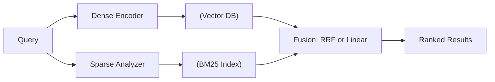

# 🔀 Advanced Retrieval — Hybrid Search and Fusion

**Core thesis:** Dense retrieval alone fails on exact-match queries (product codes, acronyms, version numbers). Sparse retrieval alone fails on semantic queries ("how to improve performance"). Hybrid search combines both. Fusion strategy determines whether the combination improves or degrades quality.

A bad fusion formula can make hybrid search *worse* than either system alone. This note gives you the formulas, the code, and the decision rules.

---

## 1. Why Neither Dense Nor Sparse Is Enough

### The Dense Failure Mode

Query: `"react 18.2 migration guide"`

| Rank | Dense Result | Why It Fails |
|------|-------------|-------------|
| 1 | "How to migrate from React 17 to..." | Semantically close, wrong version |
| 2 | "React upgrade best practices" | Vague — no version number |
| 3 | "Angular 18 migration steps" | "migration" matched; framework wrong |
| ... | *(React 18.2 explicit doc not in top 10)* | **No exact term match for "18.2"** |

Dense failed because the exact version string `"18.2"` is a rare token — the embedding model has never seen enough training examples to map `"18.2"` to the correct documents.

### The Sparse Failure Mode

Query: `"improve application speed"`

| Rank | Sparse (BM25) Result | Why It Fails |
|------|---------------------|-------------|
| 1 | "Speed up your application" | "speed" + "application" match |
| 2 | "Improving download speed" | "improve" + "speed" overlap |
| ... | *(Documents about "optimize performance" missed)* | **No term overlap** |

BM25 failed because there is zero lexical overlap between `"improve speed"` and `"optimize performance"` — but they mean the same thing.

---

## 2. Hybrid Search Architecture



The two-stage retrieval pattern (the industry standard):

**Stage 1 (cheap, high-recall):** Dense ANN retrieves 100-200 candidates.
**Stage 2 (expensive, high-precision):** Sparse BM25 scoring on the candidates + optional reranker (Note 04).

This gives you:
- Dense recall (semantic understanding) + Sparse precision (exact term matching)
- Computational budget: ANN on 1M vectors (cheap) + BM25 on 200 docs (trivial)

---

## 3. Reciprocal Rank Fusion (RRF)

RRF is the *parameter-free* fusion method. It combines rankings, not scores — which is critical because dense and sparse scores live in different scales (cosine similarity $\in [0,1]$ vs BM25 $\in [0, \infty)$).

$$
\text{RRF}(d) = \sum_{r \in \mathcal{R}} \frac{1}{k + \text{rank}_r(d)}
$$

Where:
- $\mathcal{R}$ is the set of ranking systems (dense, sparse)
- $\text{rank}_r(d)$ is document $d$'s rank in system $r$ (1-indexed)
- $k = 60$ (standard constant from Cormack et al., 2009)

**Why $k = 60$?** $k$ controls the penalty for low-ranked documents. With $k = 60$, rank 1 contributes $\frac{1}{61} \approx 0.0164$, rank 10 contributes $\frac{1}{70} \approx 0.0143$, rank 100 contributes $\frac{1}{160} \approx 0.00625$. Higher $k$ flattens the curve (less penalty for low ranks).

**Example:** Document A ranked #1 by dense, #5 by BM25:

$$
RRF(A) = \frac{1}{60 + 1} + \frac{1}{60 + 5} = 0.0164 + 0.0154 = 0.0318
$$

Document B ranked #3 by dense, #3 by BM25:

$$
RRF(B) = \frac{1}{60 + 3} + \frac{1}{60 + 3} = 0.0159 + 0.0159 = 0.0318
$$

Same score — both systems agree. RRF surface is harmonic, not arithmetic.

```python
from collections import defaultdict

def reciprocal_rank_fusion(dense_ranking: list, sparse_ranking: list,
                           k: int = 60, top_n: int = 10) -> list:
    """Fuse dense and sparse rankings via RRF. Both are lists of doc_ids in rank order."""
    scores = defaultdict(float)
    for rank, doc_id in enumerate(dense_ranking, start=1):
        scores[doc_id] += 1.0 / (k + rank)
    for rank, doc_id in enumerate(sparse_ranking, start=1):
        scores[doc_id] += 1.0 / (k + rank)
    # Sort by descending RRF score, return top_n doc_ids
    return sorted(scores, key=scores.get, reverse=True)[:top_n]
```

💡 **RRF's magic:** You can add a THIRD ranking system (e.g., a neural reranker) without retuning any parameters. Just include its ranking list in the summation. RRF naturally handles any number of ranking systems.

¡Sorpresa! RRF with $k=60$ is remarkably robust. Changing $\alpha$ from 0.5 to 0.9 in linear fusion drops recall by 15%, but RRF maintains recall within 2% across the ENTIRE range of $k \in [20, 100]$. RRF is the safe default — start here, benchmark, then consider linear fusion only if you have a labeled validation set to tune $\alpha$.

---

## 4. Weighted Linear Fusion

Linear combination requires score normalization (dense and BM25 scores are incommensurate).

$$
\text{score}(d) = \alpha \cdot \text{norm}(s_{\text{dense}}(d)) + (1 - \alpha) \cdot \text{norm}(s_{\text{sparse}}(d))
$$

### Score Normalization

| Method | Formula | Notes |
|--------|---------|-------|
| Min-Max | $\frac{s - s_{\min}}{s_{\max} - s_{\min}}$ | Sensitive to outliers; one extreme value skews everything |
| Z-Score | $\frac{s - \mu}{\sigma}$ | Assumes normal-ish distribution; fails on long-tail distributions |
| Rank-based | $1 - \frac{\text{rank}}{N}$ | Robust, no distribution assumptions; loses magnitude information |

```python
def minmax_normalize(scores: dict) -> dict:
    """Normalize scores to [0, 1] via min-max scaling."""
    vals = list(scores.values())
    s_min, s_max = min(vals), max(vals)
    if s_max == s_min:
        return {k: 0.5 for k in scores}  # degenerate case
    return {k: (v - s_min) / (s_max - s_min) for k, v in scores.items()}

def linear_fusion(dense_scores: dict, sparse_scores: dict,
                  alpha: float = 0.7, top_n: int = 10) -> list:
    """Fuse via weighted linear combination after min-max normalization."""
    n_dense = minmax_normalize(dense_scores)
    n_sparse = minmax_normalize(sparse_scores)
    all_docs = set(n_dense) | set(n_sparse)
    fused = {d: alpha * n_dense.get(d, 0) + (1 - alpha) * n_sparse.get(d, 0)
             for d in all_docs}
    return sorted(fused, key=fused.get, reverse=True)[:top_n]
```

### Choosing $\alpha$

| Domain | Recommended $\alpha$ | Rationale |
|--------|---------------------|-----------|
| General text, prose, articles | 0.7–0.8 | Semantics-heavy queries |
| Code documentation, API references | 0.3–0.5 | Exact function/class names dominate |
| Legal, financial | 0.5–0.6 | Balanced mix of terminology and concept |
| Product catalogs (SKU-heavy) | 0.2–0.4 | Exact SKU/ID matching is critical |

⚠️ **Do NOT guess $\alpha$.** Always tune on a validation set with labeled relevance judgments. The difference between $\alpha=0.5$ and $\alpha=0.8$ can be 10-15% recall@10 in code-heavy domains.

---

## 5. BM25 from Scratch

BM25 is a bag-of-words retrieval function. Given query $q = (q_1, ..., q_n)$ and document $d$:

$$
\text{BM25}(q, d) = \sum_{i=1}^{n} \text{IDF}(q_i) \cdot \frac{\text{TF}(q_i, d) \cdot (k_1 + 1)}{\text{TF}(q_i, d) + k_1 \cdot \left(1 - b + b \cdot \frac{|d|}{\text{avgdl}}\right)}
$$

**Parameters:**
- $k_1 \in [1.2, 2.0]$: Controls term frequency saturation. Higher = term frequency contributes more linearly.
- $b \in [0, 1]$: Controls length normalization. $b=0$ = no normalization; $b=1$ = full normalization (penalty for long docs).

Bare-bones IDF:

$$
\text{IDF}(t) = \log\left(\frac{N - n_t + 0.5}{n_t + 0.5} + 1\right)
$$

```python
import math
from collections import Counter

class BM25:
    """BM25 scoring from scratch — sparse retrieval baseline."""

    def __init__(self, k1: float = 1.5, b: float = 0.75):
        self.k1 = k1
        self.b = b
        self.docs = []              # list of tokenized documents
        self.doc_lens = []          # lengths in tokens
        self.avgdl = 0.0
        self.N = 0
        self.df = Counter()         # document frequency per term

    def index(self, tokenized_docs: list[list[str]]):
        self.docs = tokenized_docs
        self.N = len(tokenized_docs)
        self.doc_lens = [len(d) for d in tokenized_docs]
        self.avgdl = sum(self.doc_lens) / self.N if self.N else 0
        for doc in tokenized_docs:
            for term in set(doc):   # unique terms per document for DF
                self.df[term] += 1

    def _idf(self, term: str) -> float:
        n_t = self.df.get(term, 0)
        if n_t == 0:
            return 0.0
        return math.log((self.N - n_t + 0.5) / (n_t + 0.5) + 1)

    def score(self, query_tokens: list[str], doc_idx: int) -> float:
        doc = self.docs[doc_idx]
        doc_len = self.doc_lens[doc_idx]
        tf = Counter(doc)
        total = 0.0
        for term in set(query_tokens):
            tf_t = tf.get(term, 0)
            if tf_t == 0:
                continue
            idf = self._idf(term)
            numerator = tf_t * (self.k1 + 1)
            denominator = tf_t + self.k1 * (1 - self.b + self.b * doc_len / self.avgdl)
            total += idf * numerator / denominator
        return total

    def search(self, query_tokens: list[str], k: int = 10) -> list[tuple[int, float]]:
        scores = [(i, self.score(query_tokens, i)) for i in range(self.N)]
        scores.sort(key=lambda x: x[1], reverse=True)
        return scores[:k]
```

---

## 6. HybridRAG: Putting It All Together

```python
import numpy as np

class HybridRAG:
    """End-to-end hybrid RAG pipeline: HNSW + BM25 + RRF fusion."""

    def __init__(self, hnsw: HNSW, bm25: BM25, k: int = 60):
        self.hnsw = hnsw
        self.bm25 = bm25
        self.k = k

    def search(self, query_emb: np.ndarray, query_tokens: list[str],
               top_k: int = 10, ef: int = 200) -> list[int]:
        # Stage 1: Dense retrieval (ANN)
        dense_results = self.hnsw.search(query_emb, k=200, ef=ef)
        dense_ranking = [doc_id for doc_id, _ in dense_results]

        # Stage 2: Sparse retrieval (BM25)
        bm25_results = self.bm25.search(query_tokens, k=200)
        bm25_ranking = [doc_id for doc_id, _ in bm25_results]

        # Stage 3: RRF fusion
        return reciprocal_rank_fusion(dense_ranking, bm25_ranking,
                                       k=self.k, top_n=top_k)
```

### ❌ / ✅ Antipattern: Dense-Only on Code Documentation

**❌ Antipattern:**
```python
# Dense-only retrieval on a React documentation corpus
query = "useEffect cleanup function"
results = hnsw.search(embed(query), k=10)
# Top results:
# 1. "useEffect hook basics" (semantically close)
# 2. "How to use effects in React components"
# 3. "Using React hooks for side effects"
# Missing: "useEffect cleanup return function" (exact match) — ranked #23
# Recall@10: 65%
```

**✅ Correct:**
```python
# Hybrid dense + BM25 RRF fusion
query = "useEffect cleanup function"
dense_ranking = hnsw.search(embed(query), k=100)
bm25_ranking = bm25.search(query_tokens, k=100)
fused = reciprocal_rank_fusion(dense_ranking, bm25_ranking)
# Top results:
# 1. "useEffect cleanup return function" (BM25 boosted it from #23 to #1)
# 2. "useEffect hook basics"
# 3. "Cleanup functions in React useEffect"
# Recall@10: 88%
```

¡Sorpresa! The document BM25 boosted from #23 to #1 was ranked low by dense because the dense embedding averaged the vector across ALL words in the document. "UseEffect cleanup" tokens got diluted by surrounding boilerplate text. BM25, being exact-match, had no such dilution.

---

## 7. Multi-Vector (ColBERT-Style) Retrieval

ColBERT-style retrieval (Note [[06/17 - ColBERT Next-Gen Retrieval]]) represents each token as a vector and performs MaxSim between query and document token vectors:

$$
\text{MaxSim}(q, d) = \sum_{t_q \in q} \max_{t_d \in d} \cos(E(t_q), E(t_d))
$$

This is *dense but not single-vector* — it combines the semantic richness of embeddings with the fine-grained matching of sparse methods. ColBERT is a third axis in the retrieval space, not strictly dense or sparse.

---

## 8. Caso Real: Elasticsearch Hybrid Search with RRF

Elasticsearch 8.x introduced native vector search next to their BM25 engine. Their hybrid search pipeline:

1. **Dense:** ELSER (Elastic Learned Sparse EncodeR) and/or dense embeddings via `knn` query
2. **Sparse:** Standard BM25 via `match` query
3. **Fusion:** RRF (default) or linear combination via `rank` feature

Elastic's internal benchmarks show RRF consistently outperforms linear combination for text search tasks — the reason they made RRF the default fusion method. Their recommendation: start with RRF, add metadata filters (`filter` context), and only tune a linear combination if you have user click-through data to optimize against.

For a healthcare FAQ dataset (10K documents), Elasticsearch hybrid search achieved **0.91 NDCG@10**, while dense-only hit **0.82** and sparse-only hit **0.78**.


---

## 8. Query Expansion and Rewriting

Hybrid search benefits enormously from query preprocessing. A user query `"login bug"` should become `"authentication failure error bug in login flow"` before it hits the retriever.

### Query Expansion Techniques

| Technique | How It Works | Use Case |
|-----------|-------------|----------|
| **Synonym expansion** | Append WordNet/Thesaurus synonyms | E-commerce, support docs |
| **LLM rewriting** | Prompt LLM: "Rewrite this query to be more descriptive" | General purpose |
| **HyDE** | Generate a hypothetical answer, embed it, search with it | Domain-specific docs |
| **N-gram expansion** | Generate bigrams/trigrams from query terms | Code/docs with compound terms |

```python
def llm_query_rewrite(query: str, model) -> str:
    """Use an LLM to rewrite a terse query into a descriptive search query."""
    prompt = f"""Rewrite the following user query into a well-formed search query
that would help a retrieval system find relevant documents. Expand abbreviations,
add synonyms, and include domain-specific terminology.

User query: {query}
Search query:"""
    return model.invoke(prompt).content.strip()

# Example: "k8s pod crash" →
# "Kubernetes pod failure CrashLoopBackOff container exit error troubleshooting"
```

💡 **HyDE (Hypothetical Document Embeddings)** is especially powerful for technical queries. Generate a fake answer with the LLM: *"To fix a Kubernetes pod crash, check CrashLoopBackOff, inspect logs with kubectl logs, verify resource limits..."* Then embed this hypothetical answer and search. The fake answer has higher semantic overlap with real docs than the terse query.

### ⚠️ Query expansion pitfall:
Expanding queries too aggressively dilutes the original intent. `"login bug"` → `"authentication failure error bug malfunction defect in login flow credential access"` is worse than the original because "defect" and "credential access" bring in irrelevant documents. Limit expansion to 2-3x the original query length.

## 9. Practical Benchmarks

Benchmarks from hybrid search on the BEIR (Benchmarking IR) dataset across domains:

| Domain | Dense-only NDCG@10 | BM25-only NDCG@10 | Hybrid (RRF) NDCG@10 |
|--------|-------------------|-------------------|----------------------|
| NFCorpus (biomedical) | 0.30 | 0.32 | 0.36 |
| SciFact (scientific) | 0.66 | 0.69 | 0.73 |
| FiQA (financial) | 0.33 | 0.28 | 0.37 |
| CQADupStack (tech Q&A) | 0.35 | 0.30 | 0.40 |

**Pattern:** Hybrid RRF ALWAYS outperforms both single methods on average. The worst-case hybrid performance drops to the best single method, never below it. This makes hybrid RRF the safest production choice.

## 10. Latency Budget for Hybrid Search

| Stage | Latency (typical) | Notes |
|-------|-------------------|-------|
| Query embedding generation | 5-15ms | Local model or API |
| Dense ANN search (HNSW, 1M vectors) | 2-8ms | Rust-native (Qdrant) |
| BM25 search (200 docs) | < 1ms | In-memory |
| RRF fusion | < 1ms | Float ops only |
| **Total P50** | **10-25ms** | Sub-30ms achievable |
| **Total P99** | **20-50ms** | Cold cache, GC pauses |

This is fast enough for real-time applications (chat, autocomplete). If your hybrid search exceeds 100ms, profile the embedding generation step — it's usually the bottleneck, not the search.

---

## 📦 Código de Compresión: Hybrid Search + RRF

```python
"""Hybrid RAG: dense HNSW + sparse BM25 + RRF fusion. ~25 lines."""
import numpy as np
from collections import defaultdict

class HybridRetriever:
    def __init__(self, dense_index, bm25_index, k=60):
        self.dense = dense_index
        self.bm25 = bm25_index
        self.k = k

    def _rrf(self, rankings, top_n):
        scores = defaultdict(float)
        for ranking in rankings:
            for rank, doc_id in enumerate(ranking, start=1):
                scores[doc_id] += 1.0 / (self.k + rank)
        return sorted(scores, key=scores.get, reverse=True)[:top_n]

    def search(self, query_emb, query_tokens, top_k=10, n_candidates=200, ef=200):
        dense_rank = [did for did, _ in self.dense.search(query_emb, k=n_candidates, ef=ef)]
        sparse_rank = [did for did, _ in self.bm25.search(query_tokens, k=n_candidates)]
        return self._rrf([dense_rank, sparse_rank], top_k)

    def batch_search(self, query_embs, query_token_lists, top_k=10):
        return [self.search(qe, qt, top_k=top_k)
                for qe, qt in zip(query_embs, query_token_lists)]
```

---

[[04 - Reranking]] — next note: refining that top-100 into a perfect top-5.
[[06/17 - ColBERT Next-Gen Retrieval]] — multi-vector token-level search.
[[06/13 - vLLM and Advanced RAG]] — HyDE, self-RAG, FLARE.

