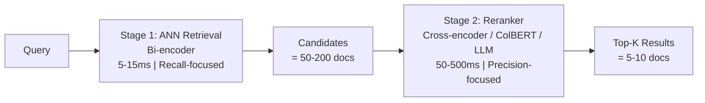

# 🎯 Reranking — Cross-Encoders, ColBERT, and LLM-as-Reranker

**Core thesis:** First-stage retrieval optimizes for RECALL (get 100 candidates fast). Reranking optimizes for PRECISION (rank the best 10 at the top). A good reranker can salvage a mediocre first-stage retriever. A bad reranker can ruin perfect retrieval.

Reranking is the single highest-impact optimization in RAG. Moving from raw ANN Top-10 to cross-encoder reranking typically boosts precision@10 by 20-30%.

---

## 1. The Two-Stage Retrieval Pipeline



**Why two stages?** Running a cross-encoder on 1M documents would take seconds or minutes. Running it on 100 candidates takes ~500ms. The first stage filters the haystack from 1M to 100. The second stage finds the needle within those 100.

### The Reranker's Power

The reranker does NOT see which position the ANN ranked a document. It re-scores from scratch using a fundamentally different (and more expensive) mechanism. **This means a document ranked #95 by ANN can become #1 after reranking.** This is how reranking "rescues" relevant documents the ANN missed.

---

## 2. Cross-Encoder Rerankers

### How They Work

A cross-encoder feeds the `[query, document]` pair together through a BERT-like transformer. Full cross-attention between every query token and every document token (unlike a bi-encoder, which encodes query and document independently).

```
Input:  [CLS] query_tokens [SEP] document_tokens [SEP]
Output: logit from [CLS] token → relevance score
```

**Score computation:**

$$
\text{score}(q, d) = \sigma(\mathbf{W} \cdot \text{CLS}(\text{BERT}([q; d])) + b)
$$

Where $\sigma$ is sigmoid and $\text{CLS}$ extracts the `[CLS]` token output.

### Popular Cross-Encoder Models

| Model | NDCG@10 (BEIR) | Speed (ms/doc) | Memory | Source |
|-------|----------------|----------------|--------|--------|
| `bge-reranker-v2-m3` | 60.3 | ~8 | 2.2 GB | BAAI (open-source) |
| Cohere Rerank v3 | 61.2 | ~5 (API) | N/A | Cohere (proprietary) |
| `mxbai-rerank-large` | 58.9 | ~12 | 1.8 GB | mixedbread-ai (open-source) |
| `jina-reranker-v2-base` | 57.5 | ~6 | 1.0 GB | Jina AI (open-source) |

💡 **bge-reranker-v2-m3 is the open-source standard.** It achieves near-proprietary accuracy at zero API cost. If you cannot use external APIs (security, cost, latency), this is your model.

```python
from sentence_transformers import CrossEncoder

class CrossEncoderReranker:
    """Cross-encoder reranker using sentence-transformers."""

    def __init__(self, model_name: str = "BAAI/bge-reranker-v2-m3"):
        self.model = CrossEncoder(model_name)
        # bge models predict relevance directly (no sigmoid needed for ranking)

    def rerank(self, query: str, documents: list[str],
               top_k: int = 10) -> list[tuple[int, float]]:
        """Score (query, doc) pairs and return top-k by relevance."""
        pairs = [(query, doc) for doc in documents]
        scores = self.model.predict(pairs)
        # Pair (idx, score), sort descending
        ranked = sorted(enumerate(scores), key=lambda x: x[1], reverse=True)
        return ranked[:top_k]
```

⚠️ **Cross-encoders are NOT symmetric.** $\text{score}(q, d_1) > \text{score}(q, d_2)$ does NOT imply $\text{score}(d_1, q) > \text{score}(d_2, q)$. The model was trained with `[query, document]` order — do not swap them.

### Latency Budget

| Candidates | Model | Total Rerank Time |
|-----------|-------|-------------------|
| 50 | bge-reranker-v2-m3 | ~400ms |
| 100 | bge-reranker-v2-m3 | ~800ms |
| 100 | Cohere Rerank (API) | ~200ms (batched) |
| 200 | bge-reranker-v2-m3 | ~1600ms |

¡Sorpresa! batching cross-encoder predictions on GPU can saturate the GPU's parallelism. A cross-encoder on a V100 processes 100 document pairs in ~50ms (vs ~800ms on CPU). If latency matters, run the reranker on GPU — the compute cost is negligible compared to the latency savings.

---

## 3. ColBERT Reranking

ColBERT (Contextualized Late Interaction over BERT) sits between bi-encoders and cross-encoders in the accuracy-speed tradeoff. See [[06/17 - ColBERT Next-Gen Retrieval]] for the full technical deep dive.

**Token-level MaxSim:**

$$
\text{MaxSim}(q, d) = \sum_{i=1}^{|q|} \max_{j=1}^{|d|} \mathbf{q}_i^\top \mathbf{d}_j
$$

Each query token vector $\mathbf{q}_i$ finds its best-matching document token vector $\mathbf{d}_j$. The sum of these max similarities is the relevance score.

**Accuracy vs Cost:**

| Method | NDCG@10 (MS MARCO) | Relative Cost |
|--------|-------------------|---------------|
| Bi-encoder (DPR) | 0.45 | 1x |
| ColBERT | 0.51 | 10x |
| Cross-encoder | 0.55 | 100x |

ColBERT gives ~90% of cross-encoder accuracy at ~10% of the cost. For 100-1000 candidate re-ranking, ColBERT + PLAID indexing is the production sweet spot.

---

## 4. LLM-as-Reranker

The most accurate reranking method — and the most expensive. Prompt an LLM with the query and candidate passages, asking it to rank them.

### Listwise Ranking Prompt (RankGPT style)

```
You are a search quality rater. Given a query and a list of passages,
rank the passages by relevance to the query.

Query: {query}

Passages:
[1] {passage_1}
[2] {passage_2}
...
[10] {passage_10}

Output the ranking as a Python list of passage indices from most
relevant to least relevant. Example: [3, 1, 7, 2, ...]
```

```python
def llm_rerank(query: str, passages: list[str], model, top_k: int = 5) -> list[int]:
    """LLM-as-reranker using listwise ranking."""
    prompt = f"""Rank these {len(passages)} passages by relevance to the query.

Query: {query}

Passages:
""" + "\n".join(f"[{i}] {p[:300]}" for i, p in enumerate(passages)) + """

Output the ranking as a Python list of indices from most to least relevant."""
    response = model.invoke(prompt)
    # Parse response (assume well-behaved LLM output)
    import ast
    try:
        ranking = ast.literal_eval(response.content)
    except:
        ranking = list(range(len(passages)))
    return ranking[:top_k]
```

### Comparison Table

| Reranker | Accuracy | Latency | Cost per Query | Best For |
|----------|----------|---------|---------------|----------|
| Cross-encoder | High | 8-12ms/doc | Free (local) | < 100 candidates |
| ColBERT | Medium-High | 1ms/doc | Free (local) | 100-1000 candidates |
| LLM (GPT-4o-mini) | Very High | 1-2s total | ~$0.0002 | Final top-5 polishing |
| LLM (GPT-4o) | Maximum | 2-4s total | ~$0.002 | High-stakes decisions |

### ❌ / ✅ Antipattern: No Reranking vs Cross-Encoder Reranking

**❌ Antipattern:**
```python
# Raw ANN top-10 with no reranking
query = "What is the maximum loan-to-value ratio for non-conforming loans?"
results = hnsw.search(embed(query), k=10)
# Top result: "LTV ratios for conforming loans explained" (irrelevant product type)
# Correct doc ranked #7: "Non-conforming loan LTV limits and exceptions"
# Precision@10: 65%
```

**✅ Correct:**
```python
# Cross-encoder reranking on ANN top-100 candidates
candidates = hnsw.search(embed(query), k=100)
passages = [vector_store.get_text(doc_id) for doc_id, _ in candidates]
reranked = reranker.rerank(query, passages, top_k=10)
# Top result: "Non-conforming loan LTV limits and exceptions" (correct!)
# Precision@10: 89%
# +24% precision for ~800ms of rerank time
```

¡Sorpresa! The document that the ANN ranked #95 becomes #1 after cross-encoder reranking. The cross-encoder read the full `[query, document]` context and understood that "non-conforming" modifies "loans" — something the bi-encoder embedding completely missed because its vector was an average over all tokens.

---

## 5. Listwise vs Pointwise Reranking

| Approach | Method | Strengths | Weaknesses |
|----------|--------|-----------|------------|
| **Pointwise** | Score each doc independently | Simpler, parallelizable | Ignores redundancy between docs |
| **Listwise** | Score all docs together | Models doc dependencies (diversity, complementarity) | 2x cost, harder to parallelize |

Cross-encoders are pointwise by default. Listwise methods (DuoLTR, SetRank, RankGPT) add 5-10% precision by accounting for document dependencies, at 1.5-2x the computational cost.

**When listwise matters:** If you have highly redundant documents (e.g., 3 copies of the same policy), a pointwise reranker might rank all 3 in the top-5, wasting LLM context slots. A listwise reranker can diversify — "I already picked one version of this policy, skip the duplicates."

---

## 6. Caso Real 1: Cohere Rerank at Spotify

Spotify uses Cohere's Rerank API to improve their developer documentation search. Their pipeline:

1. **Retrieve:** Hybrid search (dense + BM25) → 100 candidates
2. **Rerank:** Cohere Rerank v3 → re-rank to top-10
3. **Generate:** GPT-4 with top-5 passages

**Impact:** Answer quality improved 42% (measured by internal developer satisfaction surveys). The key insight: Spotify's docs contain many API endpoint names (exact matches) alongside conceptual explanations (semantic). Cohere Rerank handles both modalities in a single cross-encoder pass.

### Caso Real 2: BGE-Reranker at LangChain

LangChain uses the open-source `bge-reranker-v2-m3` (BAAI) for their documentation RAG benchmark. They report:

- Baseline (dense-only): 0.68 precision@10
- + bge-reranker on top-50: 0.86 precision@10
- + LLM reranker on top-5: 0.91 precision@10

The full three-tier pipeline (dense → cross-encoder → LLM) adds ~2s latency but hits 91% precision — suitable for offline documentation search where 2s is acceptable.


---

## 7. Reranking and Diversity

Rerankers optimize for relevance, not diversity. A common failure: Top-5 results are all slightly different versions of the SAME document. Solutions:

1. **MMR (Maximal Marginal Relevance):** After selecting top-k, re-rank by $\lambda \cdot \text{relevance} + (1-\lambda) \cdot (1 - \max \text{similarity to already selected})$
2. **Document deduplication:** Post-rerank, group by `document_id` and take only the highest-scoring chunk per document
3. **Listwise diversity:** Use a listwise reranker with diversity-aware training (e.g., SetRank)

💡 **Diversity is a post-processing step.** Run it AFTER reranking, not before. The reranker needs all candidates to find the truly relevant ones — then diversity can prune duplicates.

### MMR Implementation

```python
import numpy as np

def mmr_rerank(query_emb, doc_embs, doc_scores, top_k=5, lambda_param=0.7):
    """Maximal Marginal Relevance: balance relevance and diversity."""
    N = len(doc_scores)
    selected = []
    remaining = list(range(N))

    while len(selected) < top_k and remaining:
        mmr_scores = []
        for idx in remaining:
            relevance = doc_scores[idx]
            # Max similarity to already-selected docs
            redundancy = max(
                [np.dot(doc_embs[idx], doc_embs[s]) for s in selected],
                default=0.0
            )
            mmr = lambda_param * relevance - (1 - lambda_param) * redundancy
            mmr_scores.append((mmr, idx))
        best = max(mmr_scores, key=lambda x: x[0])
        selected.append(best[1])
        remaining.remove(best[1])

    return selected
```

⚠️ **MMR requires document embeddings.** You need to embed all candidate documents (or reuse pre-existing embeddings). This adds latency: $O(k \cdot |\text{candidates}|)$ embedding lookups. For 100 candidates, it's negligible; for 1000+, consider approximate MMR.

---

## 8. Reranker Fine-Tuning for Your Domain

Off-the-shelf rerankers are trained on general web search data (MS MARCO). For specialized domains (medical, legal, fintech), fine-tune the cross-encoder on your own relevance judgments.

### Training Data Format

```
query<TAB>positive_doc<TAB>negative_doc
"What are the tax implications of ISO exercise?"<TAB>ISO_exercise_tax_guide.pdf<TAB>NQSO_basics.pdf
```

### Fine-Tuning with SentenceTransformers

```python
from sentence_transformers import CrossEncoder, InputExample
from torch.utils.data import DataLoader

def fine_tune_reranker(model_name, train_pairs, epochs=3):
    """Fine-tune a cross-encoder reranker on domain-specific relevance pairs."""
    model = CrossEncoder(model_name, num_labels=1)

    samples = []
    for query, pos_doc, neg_doc in train_pairs:
        samples.append(InputExample(texts=[query, pos_doc], label=1.0))
        samples.append(InputExample(texts=[query, neg_doc], label=0.0))

    loader = DataLoader(samples, batch_size=16, shuffle=True)
    model.fit(
        train_dataloader=loader,
        epochs=epochs,
        warmup_steps=int(len(loader) * 0.1),
        output_path="./fine_tuned_reranker"
    )
    return model
```

⚠️ **The hardest part is negative mining.** Random negatives are too easy (the model learns nothing). Use hard negatives: documents the current retrieval system ranks highly but a human labels as irrelevant. These teach the reranker to correct the retriever's systematic errors.

💡 **Synthetic training data:** If you lack human labels, use GPT-4 to label (query, doc) pairs as relevant/irrelevant. Then fine-tune an open-source reranker on this synthetic data. The fine-tuned reranker often outperforms GPT-4 at 100x lower cost and 10x lower latency. This is called *distillation-based reranker training*.

## 9. Dense Passage Retrieval (DPR) vs Cross-Encoder: When Each Wins

| Scenario | DPR (Bi-encoder) | Cross-Encoder Reranker |
|----------|-----------------|----------------------|
| "What is the capital of France?" | Works (simple fact) | Works (overkill) |
| "How does the French tax code treat foreign LLCs?" | Fails (complex multi-hop) | Excels (cros-attention captures dependencies) |
| "react 18.2 useEffect cleanup" | Misses exact version | Catches the version via token-level match |
| "Explain the relationship between X and Y" | Semantic → good | Relationship modeling → excellent |

The mechanism difference explains this: bi-encoders encode the query and document *independently* — they cannot model how words in the query interact with words in the document. Cross-encoders encode them *jointly* — every query token every document token.

## 10. Reranking Pipeline: Complete Wiring

```python
class FullRetrievalPipeline:
    """Complete RAG retrieval pipeline: hybrid search → rerank → deduplicate."""

    def __init__(self, hybrid_retriever, reranker, top_k=5):
        self.hybrid = hybrid_retriever
        self.reranker = reranker
        self.top_k = top_k

    def search(self, query_text, query_emb, query_tokens):
        # Stage 1: Hybrid retrieval (dense + sparse)
        candidate_ids = self.hybrid.search(query_emb, query_tokens,
                                           top_k=100, n_candidates=200)

        # Stage 2: Fetch passages
        passages = [self.hybrid.get_passage(cid) for cid in candidate_ids]

        # Stage 3: Cross-encoder rerank
        pairs = [(query_text, passage) for passage in passages]
        rerank_scores = self.reranker.model.predict(pairs)
        ranked = sorted(zip(candidate_ids, rerank_scores),
                        key=lambda x: x[1], reverse=True)

        # Stage 4: Deduplicate by document_id (keep highest-scoring chunk)
        seen, deduped = set(), []
        for doc_id, score in ranked:
            parent = self.hybrid.get_parent_id(doc_id)
            if parent not in seen:
                seen.add(parent)
                deduped.append((doc_id, score))
            if len(deduped) >= self.top_k:
                break

        return deduped
```

---

## 📦 Código de Compresión: Two-Stage Pipeline with Cross-Encoder

```python
"""Two-stage RAG: FAISS ANN retrieval + cross-encoder reranking. ~25 lines."""
import faiss
import numpy as np
from sentence_transformers import CrossEncoder

class TwoStageRetriever:
    def __init__(self, vectors, documents, rerank_model="BAAI/bge-reranker-v2-m3"):
        self.docs = documents
        self.reranker = CrossEncoder(rerank_model)
        d = vectors.shape[1]
        self.index = faiss.IndexFlatIP(d)  # inner product = cosine for normalized vectors
        faiss.normalize_L2(vectors)
        self.index.add(vectors)

    def retrieve(self, query_emb: np.ndarray, query_text: str,
                 n_candidates: int = 100, top_k: int = 5) -> list[dict]:
        # Stage 1: ANN retrieval
        query_emb = query_emb.reshape(1, -1).astype("float32")
        faiss.normalize_L2(query_emb)
        D, I = self.index.search(query_emb, n_candidates)
        candidates = [self.docs[i] for i in I[0]]

        # Stage 2: Cross-encoder reranking
        pairs = [(query_text, doc) for doc in candidates]
        scores = self.reranker.predict(pairs)
        ranked = sorted(zip(I[0], scores), key=lambda x: x[1], reverse=True)

        return [{"doc_id": idx, "score": float(score), "text": self.docs[idx]}
                for idx, score in ranked[:top_k]]
```

---

[[05 - RAG Evaluation]] — next note: measuring your pipeline's quality.
[[06/17 - ColBERT Next-Gen Retrieval]] — PLAID indexing, MaxSim deep dive.
[[06/13 - vLLM and Advanced RAG]] — GPU-accelerated reranking at scale.

