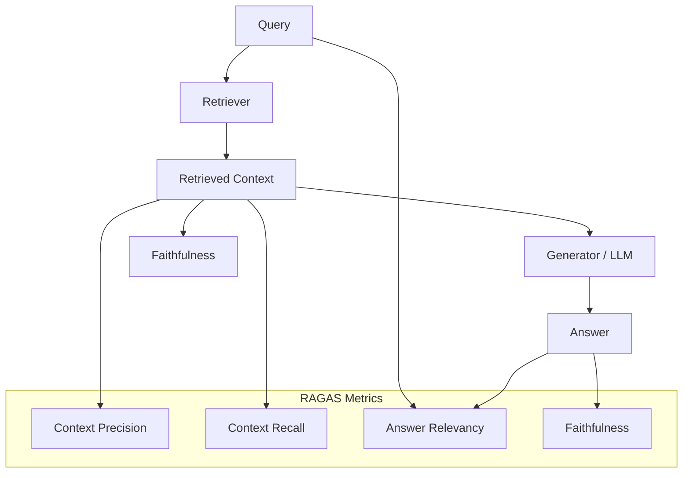
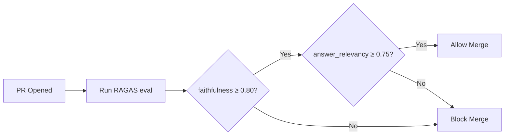
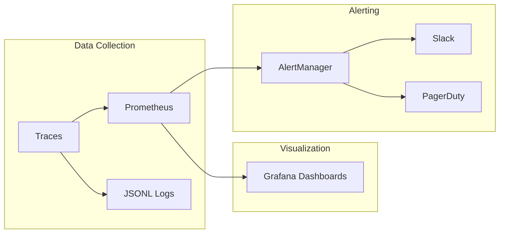

# 📊 RAG Evaluation — RAGAS, DeepEval, and Production Metrics

**Core thesis:** RAG without evaluation is a demo. RAGAS and DeepEval provide structured frameworks for measuring retrieval quality, generation faithfulness, and end-to-end RAG performance. The metrics you choose determine the system you optimize for.

If you optimize for answer accuracy alone, your retriever could return irrelevant documents but the LLM guesses correctly anyway — and next time, it won't. Evaluation MUST disentangle retrieval quality from generation quality.

---

## 1. Why RAG Evaluation Is Unique

Standard QA evaluation (exact match, BLEU, ROUGE, F1) measures surface-level text overlap. It cannot answer:

- **Did we retrieve the RIGHT documents?** A correct answer from wrong documents is a time bomb.
- **Is the answer FAITHFUL to the retrieved context?** The LLM might hallucinate convincingly.
- **Are irrelevant documents ranked HIGHER than relevant ones?** Precision at the top matters for limited context windows.

$$
\text{RAG Quality} \neq \text{Answer Quality}
$$

A system can produce correct answers 80% of the time while its retriever is broken — the LLM is cheating using its parametric knowledge. RAGAS diagnoses this.



---

## 2. RAGAS Framework

RAGAS is a purpose-built evaluation framework for RAG pipelines. It does NOT require ground-truth answers — only the query, retrieved contexts, and generated answer.

### 2.1 Faithfulness

**Definition:** Are all claims in the answer supported by the retrieved context?

**Algorithm:**
1. Decompose the generated answer into atomic claims: $A = \{c_1, c_2, ..., c_n\}$
2. For each claim $c_i$, check if it is entailed by the retrieved context using an NLI model
3. Compute:

$$
\text{Faithfulness} = \frac{|\{c_i \in A : c_i \text{ is supported by context}\}|}{|A|}
$$

```python
from ragas.metrics import faithfulness
from ragas import evaluate
from datasets import Dataset

# Input format
eval_dataset = Dataset.from_dict({
    "question": ["What is the max LTV ratio for non-conforming loans?"],
    "answer": ["Non-conforming loans have a maximum LTV of 80%..."],
    "contexts": [["LTV limits: conforming 97%, non-conforming 80%, jumbo 70%"]]
})

result = evaluate(eval_dataset, metrics=[faithfulness])
print(f"Faithfulness: {result['faithfulness']}")
# Faithfulness: [0.92]  — 92% of claims are supported by context
```

⚠️ **High faithfulness, low usefulness:** The LLM can be 100% faithful to IRRELEVANT context. "The document discusses the warranty policy for Model X..." is faithful to a warranty document but useless for a performance query. Always pair faithfulness with context precision.

### 2.2 Answer Relevancy

**Definition:** Is the answer about what the question actually asked?

**Algorithm:**
1. Generate $k$ reverse questions from the answer: $\{rq_1, ..., rq_k\}$ (e.g., "What question would this answer be a good response to?")
2. Compute cosine similarity between the original question and each reverse question
3. Average the similarities:

$$
\text{Answer Relevancy} = \frac{1}{k} \sum_{i=1}^{k} \cos(E(q_{\text{original}}), E(rq_i))
$$

```python
from ragas.metrics import answer_relevancy

result = evaluate(eval_dataset, metrics=[answer_relevancy])
print(f"Answer Relevancy: {result['answer_relevancy']}")
# Answer Relevancy: [0.88]
```

¡Sorpresa! RAGAS faithfulness can be > 0.9 while answer relevancy is < 0.5. This means the LLM is faithfully describing irrelevant documents. The system retrieved the wrong context, but the LLM dutifully summarized it. Always monitor BOTH metrics — they diagnose different failure modes.

### 2.3 Context Precision

**Definition:** Among the retrieved documents, are relevant ones ranked higher than irrelevant ones?

**Formula (Precision@k with graded relevance):**

$$
\text{CP@k} = \frac{\sum_{i=1}^{k} \text{Precision@i} \cdot \text{rel}_i}{\sum_{i=1}^{k} \text{rel}_i}
$$

Where $\text{rel}_i \in \{0, 1\}$ is whether document at rank $i$ is relevant.

This is a *rank-aware* metric: it penalizes systems that retrieve relevant documents but bury them at rank 8-10.

```python
from ragas.metrics import context_precision

result = evaluate(eval_dataset, metrics=[context_precision])
print(f"Context Precision: {result['context_precision']}")
# Context Precision: [0.75]  — relevant docs are generally ranked high
```

### 2.4 Context Recall

**Definition:** Did we retrieve ALL relevant documents? (Requires ground-truth annotations.)

$$
\text{Context Recall} = \frac{|\{\text{retrieved docs}\} \cap \{\text{relevant docs}\}|}{|\{\text{relevant docs}\}|}
$$

💡 **Context Recall requires labeled data.** Unlike faithfulness and answer relevancy (reference-free), context recall needs a human or LLM to annotate which documents are relevant to each query. Build a test set of 100-200 queries with relevance labels before you can measure this.

### Full RAGAS Pipeline

```python
from ragas import evaluate
from ragas.metrics import faithfulness, answer_relevancy, context_precision, context_recall
from datasets import Dataset

def evaluate_rag(questions, answers, contexts, ground_truths=None):
    """Full RAGAS evaluation suite."""
    data = {
        "question": questions,
        "answer": answers,
        "contexts": contexts,  # list of lists
    }
    metrics = [faithfulness, answer_relevancy, context_precision]
    if ground_truths:
        data["ground_truth"] = ground_truths
        metrics.append(context_recall)

    dataset = Dataset.from_dict(data)
    return evaluate(dataset, metrics=metrics)
```

---

## 3. DeepEval: CI/CD-Native RAG Testing

DeepEval is an alternative evaluation framework designed for CI/CD integration. Unlike RAGAS (library-style), DeepEval structures evaluation as **pytest tests** that you can run as part of your build pipeline.

```python
from deepeval import assert_test
from deepeval.test_case import LLMTestCase
from deepeval.metrics import HallucinationMetric, AnswerRelevancyMetric

def test_rag_pipeline():
    test_case = LLMTestCase(
        input="What is our latency SLA for premium customers?",
        actual_output="Premium customers have a 99.9% uptime SLA with < 100ms p95 latency.",
        retrieval_context=[
            "SLA tiers: Basic (99.5%), Standard (99.9%), Premium (99.99%).",
            "Premium latency SLA: P95 < 100ms for all API endpoints."
        ]
    )
    hallucination_metric = HallucinationMetric(threshold=0.1)
    relevancy_metric = AnswerRelevancyMetric(threshold=0.7)

    assert_test(test_case, [hallucination_metric, relevancy_metric])
```

**Run in CI:**
```bash
deepeval test run tests/test_rag.py
```

If `hallucination > 0.1`, the test fails → CI blocks the PR merge.

### DeepEval vs RAGAS

| Feature | RAGAS | DeepEval |
|---------|-------|----------|
| Integration style | Python library (call evaluate()) | pytest-based (assert_test()) |
| Metrics | 4 RAG-specific metrics | 15+ metrics (hallucination, bias, toxicity, etc.) |
| CI/CD ready | Manual (wrap in script) | Native (`deepeval test run`) |
| LLM dependency | Built-in (uses LLM for claim decomposition) | Built-in (configurable LLM backend) |
| Dashboard | None (manual logging) | Confident AI dashboard (paid) |
| Open source | Yes (Apache 2.0) | Yes (Apache 2.0) |

💡 **Use BOTH:** RAGAS for detailed retrieval diagnostics (context precision/recall), DeepEval for CI gates (hallucination < X, relevancy > Y). They complement each other.

---

## 4. Human Evaluation Protocol

Automated metrics miss nuance. Periodically (weekly/monthly), evaluate a random sample of 100 answers with human annotators.

### Setup

- **3 annotators** per answer (to compute agreement)
- **Scale:** 1-5 Likert for each dimension
- **Dimensions:** Faithfulness, Helpfulness, Conciseness

### Inter-Annotator Agreement

Compute **Krippendorff's alpha** across the 3 annotators:

$$
\alpha = 1 - \frac{D_o}{D_e}
$$

Where $D_o$ is observed disagreement and $D_e$ is expected disagreement by chance. Target: $\alpha > 0.7$ (acceptable), $\alpha > 0.8$ (good).

```python
from krippendorff import alpha
import numpy as np

# 3 annotators × 100 answers, values 1-5
annotations = np.array([
    [4, 5, 4, 3, 5, ...],   # Annotator 1 (100 ratings)
    [5, 4, 4, 3, 5, ...],   # Annotator 2
    [4, 5, 5, 2, 4, ...],   # Annotator 3
])

print(f"Krippendorff's alpha: {alpha(annotations, level_of_measurement='ordinal'):.3f}")
# Krippendorff's alpha: 0.78
```

⚠️ **Low agreement means your rubric is ambiguous.** If $\alpha < 0.6$, refine annotation guidelines before collecting more data. Add examples of "what constitutes a 5 vs a 3" for each dimension.

---

## 5. Production Metrics

Automated metrics run offline. Production metrics run continuously.

### Key Metrics to Track

| Metric | Description | Target |
|--------|-------------|--------|
| **Retrieval latency P95** | 95th percentile time for hybrid search + rerank | < 500ms |
| **Generation latency P99** | 99th percentile time for LLM to generate answer | < 5s |
| **TTFT (Time to First Token)** | Time from query to first token (streaming) | < 200ms |
| **Throughput** | Queries per second sustained | > 50 QPS (single node) |
| **Thumbs up/down ratio** | User feedback (like ChatGPT) | > 85% up |
| **Empty result rate** | Queries returning 0 results after reranking | < 2% |
| **Document recall (synthetic)** | Recall on a pre-generated synthetic query set | > 90% |

### Synthetic Query Evaluation

Generate 500-1000 synthetic queries from your document corpus (using an LLM), embed them, and store them as a golden test set. Run them through retrieval weekly and track recall.

```python
def synthetic_query_recall(retriever, synthetic_queries, expected_doc_ids, k=10):
    """Run synthetic queries and compute recall@k."""
    hits = 0
    for query, expected_id in zip(synthetic_queries, expected_doc_ids):
        results = retriever.search(query, k=k)
        if expected_id in [r.doc_id for r in results]:
            hits += 1
    return hits / len(synthetic_queries)
```

---

## 6. RAG Evaluation in CI



### ❌ / ✅ Antipattern: QA Exact Match on RAG Outputs

**❌ Antipattern:**
```python
# Using exact match (EM) to evaluate RAG
reference = "Non-conforming loans have a maximum LTV of 80%."
generated = "The maximum loan-to-value ratio for non-conforming loans is 80 percent."
score = 1.0 if reference == generated else 0.0
# score = 0.0 — semantically identical, but EM fails
# False negative: system looks broken, but it's working perfectly
```

**✅ Correct:**
```python
# Using RAGAS faithfulness + context precision
from ragas.metrics import faithfulness, context_precision

eval_dataset = Dataset.from_dict({
    "question": ["What is the max LTV for non-conforming loans?"],
    "answer": ["The maximum loan-to-value ratio for non-conforming loans is 80 percent."],
    "contexts": [["LTV limits: conforming 97%, non-conforming 80%, jumbo 70%"]]
})
result = evaluate(eval_dataset, metrics=[faithfulness, context_precision])
# faithfulness: 0.96  — claims are supported
# context_precision: 1.0  — retrieved context is relevant
# Both correctly identify the system as working well
```

¡Sorpresa! BLEU and ROUGE scores on RAG answers are misleading. A faithful, relevant answer that uses different wording scores low on BLEU. Meanwhile, a hallucination that uses the document's vocabulary scores HIGH on BLEU. Text overlap metrics are WORSE THAN USELESS for RAG evaluation — they are actively misleading.

---

## 7. Caso Real: LangChain's CI RAG Benchmarks

LangChain maintains internal RAG benchmarks using RAGAS for automated evaluation on every commit to their retrieval module. Their setup:

1. **Test set:** 200 synthetic queries generated from LangChain documentation
2. **Metrics:** faithfulness, context precision, answer relevancy
3. **CI gate:** faithfulness < 0.80 → block merge
4. **Trending:** Weekly averages plotted in a dashboard (regression detection)

**War story:** A chunk size parameter change from 512 → 768 tokens caused a faithfulness drop from 0.88 to 0.82. The CI gate caught it before merge. Root cause: larger chunks meant more irrelevant text in each chunk, diluting the signal and causing the LLM to pick up irrelevant details. The team reverted chunk_size to 512 and added a test that faithfulness must be ≥ 0.85 for all chunking experiments.


---

## 8. Observability Stack for RAG

Evaluation at development time is not enough. Production RAG needs continuous monitoring.

### Logging What Matters

```python
import time
import json
from dataclasses import dataclass, asdict

@dataclass
class RAGTrace:
    query_id: str
    query_text: str
    timestamp: float
    retrieval_latency_ms: float
    rerank_latency_ms: float
    generation_latency_ms: float
    num_candidates_retrieved: int
    num_results_after_rerank: int
    answer: str
    source_doc_ids: list[int]
    faithfulness_score: float | None = None
    user_feedback: int | None = None   # 1=up, 0=none, -1=down

def log_trace(trace: RAGTrace, path: str = "rag_traces.jsonl"):
    with open(path, "a") as f:
        f.write(json.dumps(asdict(trace)) + "\n")
```

### Key Dashboards

1. **Latency breakdown**: Stacked area chart — retrieval vs rerank vs generation
2. **Result count histogram**: Distribution of `num_results_after_rerank` (alert if 0 for > 2% of queries)
3. **Faithfulness trend**: Weekly rolling average of faithfulness scores on eval queries
4. **User feedback ratio**: % thumbs-up over last 7 days (alert if drops below 80%)
5. **Recall on synthetic queries**: Weekly recall@10 on golden test set (alert if drops below 85%)

### Alerting Rules

| Alert | Condition | Severity |
|-------|-----------|----------|
| Retrieval P95 > 500ms | > 5% of queries over 5 min | Warning |
| Empty results > 5% | > 5% of queries return 0 | Critical |
| Faithfulness drop | Weekly avg < 0.75 | Warning |
| Faithfulness crash | Weekly avg < 0.60 | Critical (rollback) |



---

## 9. A/B Testing RAG Pipelines

When changing any component (new chunking strategy, new embedding model, new reranker), run an A/B test:

```python
def ab_test_rag(pipeline_a, pipeline_b, queries, ground_truth):
    """Compare two RAG pipelines on faithfulness and context precision."""
    from ragas import evaluate
    from ragas.metrics import faithfulness, context_precision

    results_a = [pipeline_a(q) for q in queries]
    results_b = [pipeline_b(q) for q in queries]

    ds_a = Dataset.from_dict({
        "question": queries,
        "answer": [r["answer"] for r in results_a],
        "contexts": [r["contexts"] for r in results_a],
    })
    ds_b = Dataset.from_dict({
        "question": queries,
        "answer": [r["answer"] for r in results_b],
        "contexts": [r["contexts"] for r in results_b],
    })

    scores_a = evaluate(ds_a, metrics=[faithfulness, context_precision])
    scores_b = evaluate(ds_b, metrics=[faithfulness, context_precision])

    return {
        "pipeline_a": {k: float(v) for k, v in scores_a.items()},
        "pipeline_b": {k: float(v) for k, v in scores_b.items()},
        "winner": "b" if scores_b["faithfulness"] > scores_a["faithfulness"] else "a"
    }
```

💡 **Minimum test size for A/B:** 100 queries. With fewer, variance dominates and you cannot distinguish signal from noise. With 500+ queries, you can detect 2-3% differences reliably.

⚠️ **Production A/B:** Route 5% of live traffic to the new pipeline, 95% to the old. Measure thumbs-up ratio and empty result rate. If the new pipeline shows lower empty-results AND equivalent thumbs-up, graduate to 50% traffic, then 100%.

---

## 📦 Código de Compresión: RAGAS Evaluation Pipeline

```python
"""RAGAS evaluation pipeline: faithfulness + context precision. ~25 lines."""
from ragas import evaluate
from ragas.metrics import faithfulness, context_precision, answer_relevancy
from datasets import Dataset

class RAGEvaluator:
    def __init__(self, metrics=None):
        self.metrics = metrics or [faithfulness, context_precision, answer_relevancy]

    def evaluate(self, rag_pipeline, test_queries: list[str]) -> dict:
        answers, contexts_list = [], []
        for query in test_queries:
            result = rag_pipeline(query)
            answers.append(result["answer"])
            contexts_list.append(result["contexts"])

        dataset = Dataset.from_dict({
            "question": test_queries,
            "answer": answers,
            "contexts": contexts_list,
        })
        scores = evaluate(dataset, metrics=self.metrics)
        return {k: float(v) for k, v in scores.items()}

    def ci_gate(self, scores: dict, thresholds: dict) -> bool:
        return all(scores.get(k, 0) >= v for k, v in thresholds.items())

# Usage:
# evaluator = RAGEvaluator()
# scores = evaluator.evaluate(my_rag, ["What is the SLA?", "How to reset password?"])
# print(scores)   # {'faithfulness': 0.88, 'context_precision': 0.82, 'answer_relevancy': 0.91}
# assert evaluator.ci_gate(scores, {'faithfulness': 0.80, 'answer_relevancy': 0.75})
```
