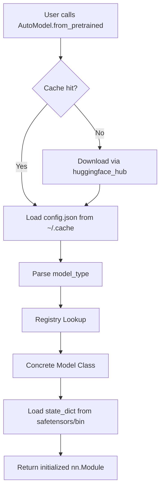
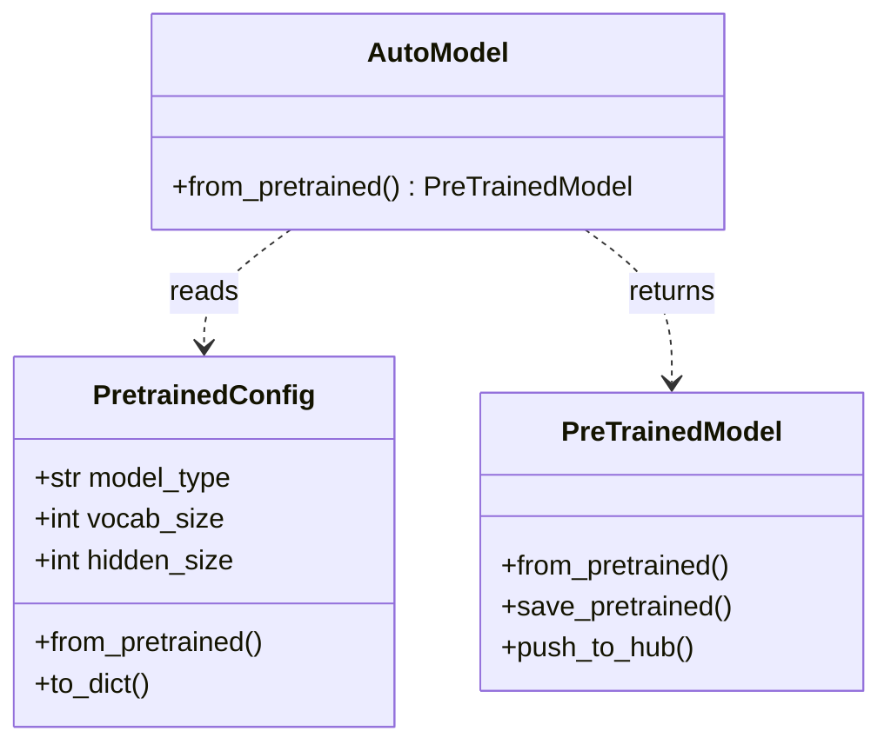
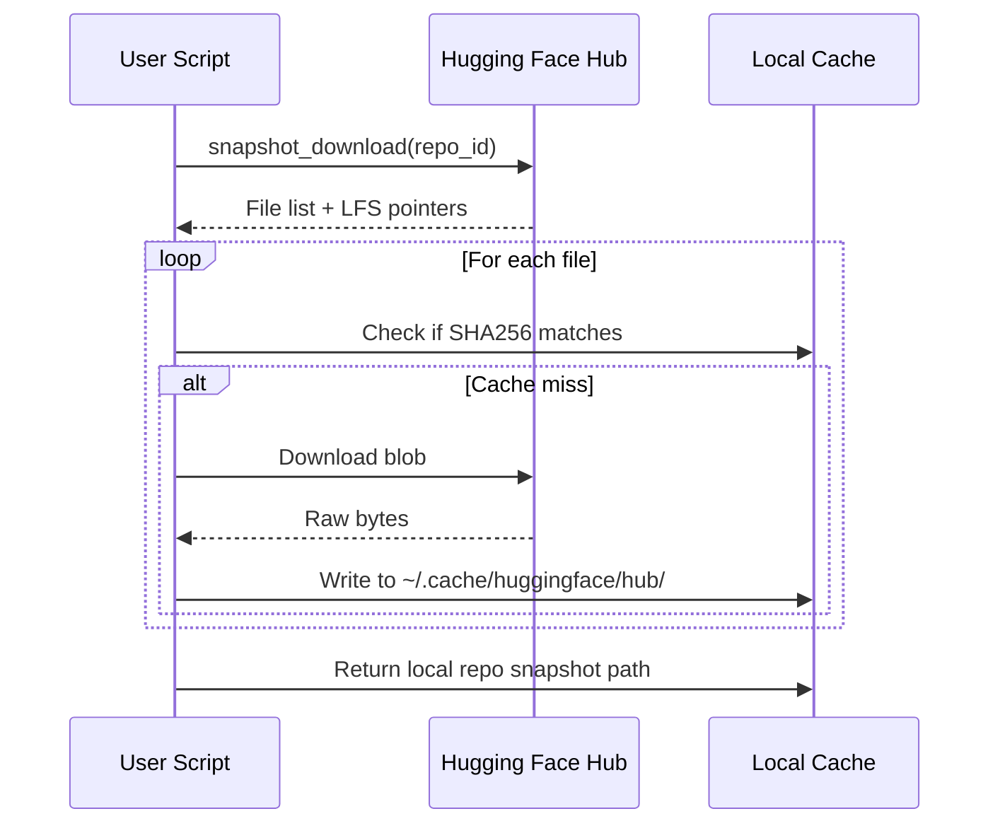
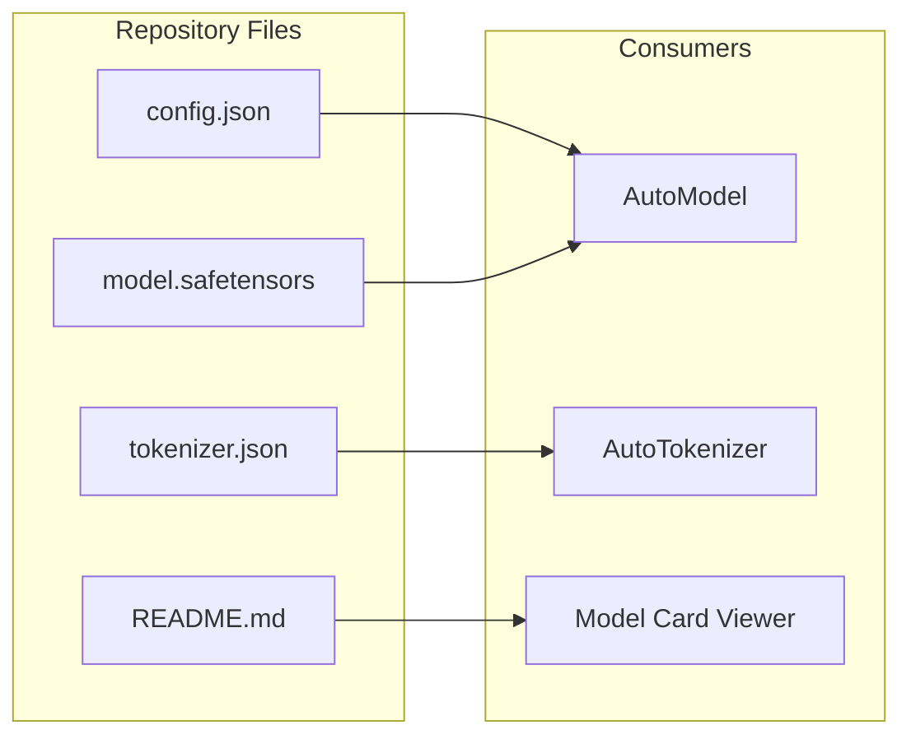

# 🏷️ The from_pretrained Ecosystem

## 🎯 Learning Objectives

- Master the internal mechanics of `from_pretrained()` and the `PretrainedConfig` system.
- Understand the `AutoClass` registry pattern and how model classes are resolved dynamically.
- Interact programmatically with the Hugging Face Hub via `huggingface_hub`.
- Evaluate security and efficiency trade-offs between `safetensors` and legacy pickle formats.
- Diagnose cache, registry, and resolution errors when loading models in production.

## Introduction

Before the Hugging Face Hub, downloading a pretrained model was a fragile manual process: find a GitHub release, download a `.pth` or `.h5` file, parse a README for the exact class name, and pray the checkpoint matched your local library version. The `from_pretrained()` paradigm changed this by unifying discovery, download, caching, and instantiation into a single API call. This abstraction is the gateway to the entire ecosystem.

This note dissects that gateway. We explore how `transformers` resolves a model identifier like `"meta-llama/Llama-2-7b-hf"` into a fully initialized `nn.Module`, how the Hub stores and versions artifacts, and why `safetensors` has become the de facto serialization standard. These concepts are foundational before touching tokenizers or trainers, because every downstream operation begins with a model loaded from the Hub. For context on how these models are later served, see [[06 - Large Language Models/13 - vLLM Deep Dive|vLLM Deep Dive]] and [[06 - Large Language Models/14 - Unsloth Deep Dive|Unsloth Deep Dive]].

---

## Module 1: The from_pretrained Mechanism and AutoClasses

### 1.1 Theoretical Foundation 🧠

The `from_pretrained()` method solves three distinct problems: **discovery** (how do I find the model?), **configuration** (how do I know its architecture and hyperparameters?), and **instantiation** (how do I build the right Python object?). Prior to the `AutoClass` system, users had to import the exact model class—e.g., `BertForSequenceClassification`—and pass it a manually constructed `BertConfig`. This coupling between model identifier and class name did not scale to thousands of architectures.

The solution is a **registry pattern** combined with a **convention-over-configuration** approach. Every model repository on the Hub contains a `config.json` file. This JSON defines the `model_type` field (e.g., `"llama"`, `"bert"`, `"gpt2"`). The `transformers` library maintains an internal mapping from `model_type` to a tuple of configuration class, model class, and tokenizer class. When you call `AutoModel.from_pretrained("meta-llama/Llama-2-7b-hf")`, the library downloads `config.json`, reads `"model_type": "llama"`, looks up the registry, and delegates to `LlamaModel.from_pretrained(...)`.

This design decouples the user-facing API from the implementation. It also enables seamless model swapping: changing `"bert-base-uncased"` to `"roberta-base"` requires zero code changes if you use `AutoModel`. The registry is populated at import time via decorators on each model class, making the system extensible for custom models submitted to the Hub.

Under the hood, `PretrainedConfig` is not just a data bag; it is a validated schema. Each config class defines default values, type constraints, and custom logic (such as `num_attention_heads` dividing `hidden_size` evenly). When `from_pretrained()` loads `config.json`, it deserializes into the concrete config class, which can then be passed to `AutoModel.from_config(config)` to instantiate weights randomly. This split between configuration and instantiation is what allows researchers to share architecture recipes without sharing multi-gigabyte checkpoints.

### 1.2 Mental Model 📐

```text
User Request: "meta-llama/Llama-2-7b-hf"
          │
          ▼
┌─────────────────────┐
│  Hugging Face Hub   │  ← API resolves repo_id, returns file list
│  (huggingface.co)   │
└─────────┬───────────┘
          │
          ▼
┌─────────────────────┐
│   Local Cache       │  ← ~/.cache/huggingface/hub/
│  (snapshot_download)│
└─────────┬───────────┘
          │
          ▼
┌─────────────────────┐
│   config.json       │  → model_type = "llama"
│  (PretrainedConfig) │
└─────────┬───────────┘
          │
          ▼
┌─────────────────────┐
│   AutoClass         │  → Registry["llama"] → LlamaConfig, LlamaModel
│   Registry Lookup   │
└─────────┬───────────┘
          │
          ▼
┌─────────────────────┐
│  LlamaModel         │  ← from_pretrained loads weights into nn.Module
│  (state_dict)       │
└─────────────────────┘
```

### 1.3 Syntax and Semantics 📝

```python
from transformers import AutoModel, AutoConfig, AutoTokenizer
import torch

# WHY: AutoModel abstracts away the concrete class. It downloads config.json,
# reads model_type, and delegates to the correct architecture class.
model = AutoModel.from_pretrained(
    "bert-base-uncased",           # Repo ID on the Hub
    torch_dtype=torch.float16,     # WHY: Cast weights at load time to save memory
    device_map="auto",             # WHY: Automatically shard across GPUs/CPU via accelerate
    trust_remote_code=False        # WHY: Security gate; True executes arbitrary Python from Hub
)

# WHY: AutoConfig reconstructs the architecture blueprint without weights.
# Useful for inspecting hyperparameters or modifying them before model creation.
config = AutoConfig.from_pretrained("bert-base-uncased")
print(config.hidden_size)          # 768
print(config.num_attention_heads)  # 12

# WHY: You can mutate config and instantiate from scratch.
config.num_hidden_layers = 4       # Smaller model for experiments
model_small = AutoModel.from_config(config)

# WHY: AutoTokenizer uses the same registry pattern to fetch the matching tokenizer class.
tokenizer = AutoTokenizer.from_pretrained("bert-base-uncased")
```

### 1.4 Visual Representation 🖼️






### 1.5 Application in ML/AI Systems 🤖

**Real case: Writer.com** uses the `AutoClass` system to let customers bring their own models. Their inference backend accepts any Hub model ID, calls `AutoModelForCausalLM.from_pretrained(..., device_map="auto")`, and serves it through a unified wrapper without knowing the architecture ahead of time.

| ML Use Case | This Concept | Impact |
|-------------|-------------|--------|
| Multi-model serving | `AutoModel` registry | One inference container serves 50+ architectures. |
| A/B testing | Swap repo_id string | Zero code change to test Llama vs Mistral. |
| Configuration audits | `PretrainedConfig` | Automated compliance checks on layer counts and dims. |
| Edge deployment | `from_config` + pruning | Build tiny variants from official configs. |

### 1.6 Common Pitfalls ⚠️

⚠️ **Loading pickles from the Hub**: Repositories with `pytorch_model.bin` use Python's `pickle` module, which can execute arbitrary code during deserialization. Prefer `model.safetensors` and set `trust_remote_code=False` unless you audit the repository.

💡 **Mnemonic**: "**SAFE** tensors are **SAFE**; **PICKLE** can **PRICK** you."

⚠️ **Cache pollution**: The default cache lives in `~/.cache/huggingface/hub/`. If you load many variants, disk usage balloons silently. Use `HF_HUB_CACHE` or `huggingface-cli scan-cache` to manage it.

💡 **Tip**: Pin `revision="main"` or a specific commit hash in production to avoid surprise updates when the model author pushes a new version.

### 1.7 Knowledge Check ❓

1. What are the three problems solved by `from_pretrained()`, and which file in the repository answers the configuration problem?
2. Write a one-liner to load `"gpt2"` in `bfloat16` on GPU 0 without using `AutoModel`. Is this more or less brittle than `AutoModel`?
3. Why does `trust_remote_code=True` pose a supply-chain risk, and when is it unavoidable?

---

## Module 2: The Hugging Face Hub and Model Artifacts

### 2.1 Theoretical Foundation 🧠

The Hugging Face Hub is more than a file host: it is a versioned, metadata-rich artifact store for machine learning. Each repository is a Git LFS-backed store that can contain model weights, tokenizer files, dataset loaders, and model cards. The `huggingface_hub` Python library provides a programmatic interface to this store, decoupling your training and inference pipelines from manual web UI interactions.

Before dedicated ML artifact stores, teams used S3 buckets with ad-hoc naming conventions. This led to "model.bin.v2.final.really.final" chaos. The Hub solves this with immutable commits, tags, and a structured repository layout. A standard model repo contains:
- `config.json`: Architecture blueprint.
- `model.safetensors` or `pytorch_model.bin`: Serialized weights.
- `tokenizer.json` / `tokenizer_config.json`: Tokenization vocabulary and rules.
- `README.md` (model card): Training data, intended use, limitations, and licensing.

The `safetensors` format was introduced to address the security and efficiency flaws of pickle. It uses a flat JSON header + raw tensor buffer layout, enabling zero-copy memory mapping and preventing arbitrary code execution. For production systems, especially those discussed in [[09 - MLOps y Produccion|MLOps]], using `safetensors` is a hard requirement.

Another critical detail is how the Hub handles large files. Because model weights can exceed 5GB, the Hub uses Git Large File Storage (LFS) to version binaries outside the Git tree. When `snapshot_download` runs, it resolves LFS pointers and streams the actual blob. This means the repository commit hash tracks metadata immutably, while the weight files are fetched on demand. In air-gapped environments, administrators can pre-seed the local cache with `huggingface-cli download` and then set `local_files_only=True` to guarantee zero external network calls during inference.

### 2.2 Mental Model 📐

```text
┌──────────────────────────────────────────┐
│         Hugging Face Hub                 │
│  ┌─────────┐ ┌─────────┐ ┌───────────┐  │
│  │ config  │ │ weights │ │ tokenizer │  │
│  │ .json   │ │.safeten │ │  .json    │  │
│  └────┬────┘ │ sors    │ └─────┬─────┘  │
│       └──────┴────┬────┘       │        │
│                   │            │        │
│  ┌────────────────┴────────────┘        │
│  │  README.md (Model Card)              │
│  │  - License: apache-2.0               │
│  │  - Datasets: C4, Wikipedia           │
│  └──────────────────────────────────────┘
└──────────────────────────────────────────┘
              │
              ▼
┌──────────────────────────────────────────┐
│     huggingface_hub Client Library       │
│  - snapshot_download                     │
│  - HfApi.create_repo                     │
│  - upload_file / upload_folder           │
│  - hf_hub_download (single file)         │
└──────────────────────────────────────────┘
```

### 2.3 Syntax and Semantics 📝

```python
from huggingface_hub import snapshot_download, HfApi, create_repo, upload_file
import os

# WHY: snapshot_download pulls an ENTIRE repository into the local cache.
# It returns the local path and handles resume, symlinks, and LFS files.
local_path = snapshot_download(
    repo_id="bert-base-uncased",
    cache_dir="/mnt/fast/hf_cache",  # WHY: Override default to use fast NVMe storage
    revision="main",                  # WHY: Pin to a branch or commit hash
    local_files_only=False            # WHY: Set True for air-gapped environments
)

# WHY: HfApi provides full CRUD operations on the Hub.
api = HfApi(token=os.getenv("HF_TOKEN"))

# WHY: create_repo initializes a new model/dataset/space repository.
api.create_repo(
    repo_id="my-username/my-finetuned-bert",
    repo_type="model",                # Could be "dataset" or "space"
    private=True,                     # WHY: Keep experiments private until publication
    exist_ok=True
)

# WHY: upload_file pushes individual artifacts without managing Git manually.
upload_file(
    path_or_fileobj="./model.safetensors",
    path_in_repo="model.safetensors",
    repo_id="my-username/my-finetuned-bert"
)

# WHY: Programmatic metadata ensures downstream tools can audit your model.
api.update_repo_settings(
    repo_id="my-username/my-finetuned-bert",
    gated="auto",                     # Require user acceptance of terms
    private=False
)
```

### 2.4 Visual Representation 🖼️






### 2.5 Application in ML/AI Systems 🤖

**Real case: Stability AI** distributes Stable Diffusion variants through the Hub. Their CI pipeline uses `upload_folder` to push checkpoints after every training epoch. Downstream consumers use `snapshot_download` with `local_files_only=True` in air-gapped inference clusters, ensuring the exact approved artifact is served.

In regulated industries such as healthcare and finance, the combination of model cards and immutable commit hashes enables audit trails. A compliance officer can trace a deployed model back to its exact training configuration, dataset references, and licensing terms by reading the `README.md` at a specific commit.

| ML Use Case | This Concept | Impact |
|-------------|-------------|--------|
| Model governance | `HfApi` + model cards | Legal and compliance teams audit licenses automatically. |
| CI/CD artifacts | `create_repo` + `upload_file` | Every training run produces a versioned Hub snapshot. |
| Air-gapped inference | `snapshot_download` + `local_files_only` | Approved models move from DMZ to secure zone via cache copy. |
| Community collaboration | Public repos + PRs | External researchers submit improvements via Hub Pull Requests. |

### 2.6 Common Pitfalls ⚠️

⚠️ **Silent weight format fallback**: If `safetensors` is absent, `transformers` falls back to `pytorch_model.bin` automatically. In secure environments, this silent fallback can violate security policies. Use `use_safetensors=True` to enforce the format.

💡 **Mnemonic**: "**SAFE** by default; **BIN** for legacy; **FORCE** when paranoid."

⚠️ **Missing model cards**: A repository without `README.md` lacks license and bias metadata. This is a production hazard. Always require model cards in your organization's upload pipeline.

💡 **Tip**: Use `huggingface-cli scan-cache` and `huggingface-cli delete-cache` to prevent your CI runners from running out of disk space.

### 2.7 Knowledge Check ❓

1. Compare `snapshot_download` versus `hf_hub_download` in terms of use case and network overhead.
2. You are building a secure inference pod that must never execute arbitrary code. What two arguments do you pass to `from_pretrained`, and what file extension do you look for in the repository?
3. Write a short script that creates a private repo, uploads a `config.json`, and then makes it public.

---

## 📦 Compression Code

```python
"""
Complete workflow: download a model, inspect its config,
enforce safetensors, and re-upload to your own namespace.
"""
from transformers import AutoModel, AutoConfig, AutoTokenizer
from huggingface_hub import snapshot_download, HfApi, upload_folder
import os

REPO_ID = "bert-base-uncased"
MY_REPO = "my-org/bert-clone"
CACHE = "/tmp/hf_demo"

# 1. Download full snapshot
snapshot_download(REPO_ID, cache_dir=CACHE, local_files_only=False)

# 2. Load with safety and efficiency constraints
config = AutoConfig.from_pretrained(REPO_ID, cache_dir=CACHE)
model = AutoModel.from_pretrained(
    REPO_ID,
    cache_dir=CACHE,
    use_safetensors=True,      # Enforce safe format
    trust_remote_code=False    # Reject custom Python
)
tokenizer = AutoTokenizer.from_pretrained(REPO_ID, cache_dir=CACHE)

# 3. Save locally in the exact structure expected by the Hub
local_save_path = "/tmp/my_model_export"
model.save_pretrained(local_save_path, safe_serialization=True)
config.save_pretrained(local_save_path)
tokenizer.save_pretrained(local_save_path)

# 4. Upload to private or public repo
api = HfApi(token=os.getenv("HF_TOKEN"))
api.create_repo(MY_REPO, repo_type="model", exist_ok=True)
upload_folder(folder_path=local_save_path, repo_id=MY_REPO)
```

## 🎯 Documented Project

**Description**: Build a "Model Mirror Service" that synchronizes approved public models into a private organization namespace, enforcing `safetensors` conversion and injecting compliance metadata into the model card.

**Functional Requirements**:
- Accept a list of public Hub repo IDs via YAML config.
- Download each repository and reject any that lack `safetensors` or contain `trust_remote_code` models.
- Append a compliance footer to `README.md` with timestamp and auditor name.
- Upload the sanitized artifact to `private-org/<original-name>`.
- Expose a Prometheus metric for mirror latency and success rate.

**Main Components**:
- `MirrorOrchestrator`: Parses YAML, iterates repo IDs.
- `SafetensorsEnforcer`: Validates weight formats, converts via `save_pretrained(..., safe_serialization=True)` if needed.
- `ModelCardInjector`: Jinja2 template for compliance footer.
- `HubUploader`: Wraps `HfApi` and `upload_folder` with retries.

**Success Metrics**:
- 100% of mirrored models use `safetensors`.
- Mirror latency < 5 minutes for models under 10GB.
- Zero manual steps between repo list update and private Hub availability.

## 🎯 Key Takeaways

- `from_pretrained()` unifies discovery, configuration, and instantiation via the `config.json` → `model_type` → registry pattern.
- `AutoClasses` decouple user code from concrete architecture names, enabling plug-and-play model swapping.
- The Hugging Face Hub is a versioned artifact store; `huggingface_hub` provides production-grade programmatic access.
- `safetensors` eliminates pickle's security risks and enables memory-mapped weight loading.
- Local caching is transparent but can consume significant disk; monitor it in CI and production.
- `trust_remote_code` and `revision` are the two most important security and reproducibility knobs at load time.
- `use_safetensors=True` should be the default in any production or CI pipeline to prevent pickle deserialization attacks.
- Understanding the cache directory structure (`models--<org>--<name>/snapshots/<commit>/`) helps debug load failures and disk space issues.

## References

- Hugging Face Docs: [https://huggingface.co/docs/transformers](https://huggingface.co/docs/transformers)
- `huggingface_hub` Library: [https://huggingface.co/docs/huggingface_hub](https://huggingface.co/docs/huggingface_hub)
- `safetensors` Specification: [https://github.com/huggingface/safetensors](https://github.com/huggingface/safetensors)
- Wolf et al., "Transformers: State-of-the-Art Natural Language Processing", EMNLP 2020.
- Related Vault: [[02 - Tokenizers and Data Processing]]
- Related Vault: [[03 - Trainer, TrainingArguments, and Distributed Training]]
