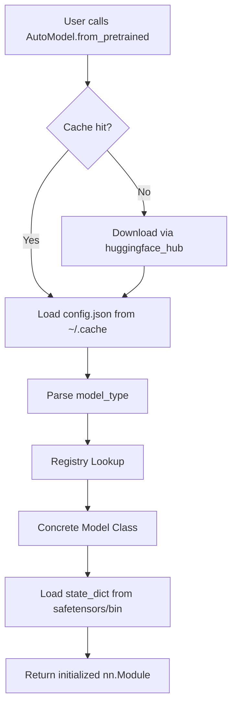

# 🤗 The from_pretrained Ecosystem

## 🎯 Learning Objectives

- Master the internal mechanics of `from_pretrained()` and the `PretrainedConfig` system.
- Understand the `AutoClass` registry pattern and how model classes are resolved dynamically.
- Interact programmatically with the Hugging Face Hub via `huggingface_hub`.
- Evaluate security and efficiency trade-offs between `safetensors` and legacy pickle formats.
- Diagnose cache, registry, and resolution errors when loading models in production.

## Introduction

Before the Hugging Face Hub, downloading a pretrained model was a fragile manual process: find a GitHub release, download a `.pth` or `.h5` file, parse a README for the exact class name, and pray the checkpoint matched your local library version. The `from_pretrained()` paradigm changed this by unifying discovery, download, caching, and instantiation into a single API call. It is the foundation upon which everything else in the ecosystem builds.

This note dissects that foundation. We explore how `transformers` resolves a model identifier like `"meta-llama/Llama-2-7b-hf"` into a fully initialized `nn.Module`, how the Hub stores and versions artifacts, and why `safetensors` has become the de facto serialization standard. These mechanisms precede tokenizer or trainer usage, because every downstream operation begins with a loaded model. For production serving context, see [[06 - Large Language Models/13 - vLLM Deep Dive|vLLM Deep Dive]] and [[06 - Large Language Models/14 - Unsloth Deep Dive|Unsloth Deep Dive]].

---

## 1. The from_pretrained() Mechanism and AutoClass Registry

Every call to `from_pretrained()` solves three distinct problems: **discovery** (find the model artifact), **configuration** (infer architecture and hyperparameters), and **instantiation** (build the correct Python object). Before the `AutoClass` system, users had to import exact classes like `BertForSequenceClassification` and construct `BertConfig` manually. This coupling did not scale to thousands of architectures.

The solution is a **registry pattern** with **convention-over-configuration**. Each Hub repository contains a `config.json` whose `model_type` field (e.g., `"llama"`, `"bert"`, `"gpt2"`) triggers a lookup in an internal dictionary:

$$\text{Registry}[\text{model\_type}] = \big(\text{ConfigClass}, \text{ModelClass}, \text{TokenizerClass}\big)$$

The resolution function $R(r)$ for a repository ID $r$ is:

$$R(r) = \text{Registry}\big[\texttt{model\_type}\big(\texttt{config.json}(r)\big)\big]$$

This registry is populated at import time via class decorators (`@register_for_model_type`), making it extensible for third-party models published to the Hub. When you call `AutoModel.from_pretrained("bert-base-uncased")`, the chain is:

1. **Cache check**: Look for `config.json` in `~/.cache/huggingface/hub/models--bert-base-uncased/snapshots/<hash>/`
2. **Download**: If missing, fetch via `huggingface_hub` and write to cache
3. **Parse**: Read `model_type` from the deserialized JSON
4. **Lookup**: Map `"bert"` → `(BertConfig, BertModel, BertTokenizer)`
5. **Delegate**: Call `BertModel.from_pretrained(path, **kwargs)`, which loads weight files
6. **Return**: An initialized `nn.Module` with pretrained weights

### PretrainedConfig: The Validated Schema

`PretrainedConfig` is not merely a dictionary. Each concrete subclass enforces architectural constraints. For example, BERT's `hidden_size` must be divisible by `num_attention_heads`. Default values cascade through the MRO so that subclass configs inherit sensible defaults while overriding only what changes:

```python
from transformers import AutoConfig, AutoModel, AutoTokenizer
import torch

# Inspect architecture without downloading weights
config = AutoConfig.from_pretrained("bert-base-uncased")
print(f"Layers: {config.num_hidden_layers}, "
      f"Hidden: {config.hidden_size}, "
      f"Heads: {config.num_attention_heads}")
# Layers: 12, Hidden: 768, Heads: 12

# Mutate and instantiate from scratch (no weights loaded)
config.num_hidden_layers = 4
small_model = AutoModel.from_config(config)
print(sum(p.numel() for p in small_model.parameters()))
# ~28M vs the original 110M

# Load full model with hardware-aware settings
model = AutoModel.from_pretrained(
    "bert-base-uncased",
    torch_dtype=torch.float16,    # Cast weights at load time
    device_map="auto",            # Accelerate-based sharding
    use_safetensors=True,         # Enforce safe format
    trust_remote_code=False       # Block arbitrary Python
)

tokenizer = AutoTokenizer.from_pretrained("bert-base-uncased")
```

✅ **Antipattern: Hardcoding model classes**
```python
# ❌ Brittle: changing the model family requires import changes
from transformers import BertModel
model = BertModel.from_pretrained("bert-base-uncased")

# ✅ Flexible: one-line change from BERT to RoBERTa
from transformers import AutoModel
model = AutoModel.from_pretrained("roberta-base")
```

The `AutoModel` family extends beyond the base class. Task-specific variants follow the same pattern: `AutoModelForSequenceClassification`, `AutoModelForCausalLM`, `AutoModelForSeq2SeqLM`, etc. Each adds a task head on top of the base architecture, and all resolve via the same `config.json` → registry lookup.

> **Caso real: Writer.com** uses `AutoModelForCausalLM.from_pretrained(..., device_map="auto")` in their inference backend. Customers bring any Hub model ID, and a single container serves 50+ architectures. The registry pattern eliminates the need for per-model deployment pipelines.

⚠️ **`trust_remote_code=True`** allows arbitrary Python from the Hub to execute during loading. Only enable for audited repositories. Production pipelines should default to `False`.

💡 **Reproducibility**: Pin `revision`, ideally to a commit hash. Model authors can push weight updates that silently alter your outputs. A hash guarantees bit-identical loading across time and environments.

---

## 2. The Hugging Face Hub and Artifact Management

The Hub is a versioned, metadata-rich artifact store backed by Git LFS. Each repository is a Git repository where large binary files (weights) are stored as LFS pointers and the content is served from object storage. A standard model repo contains:

| File | Purpose |
|------|---------|
| `config.json` | Architecture blueprint (model_type, layer counts, dims) |
| `model.safetensors` | Serialized weights in safe format |
| `pytorch_model.bin` | Legacy pickle-based weights |
| `tokenizer.json` | Fast tokenizer (Rust-backed) vocabulary |
| `tokenizer_config.json` | Tokenizer configuration metadata |
| `README.md` | Model card: training data, limitations, license |

### Programmatic Access via huggingface_hub

The `huggingface_hub` Python library decouples pipelines from manual browser interactions. It handles LFS resolution, caching, authentication, and retries natively:

```python
from huggingface_hub import (
    snapshot_download,
    hf_hub_download,
    HfApi,
    create_repo,
    upload_file,
    upload_folder
)
import os

# Pull all files from a repo into the local cache
local_path = snapshot_download(
    repo_id="bert-base-uncased",
    cache_dir="/mnt/nvme/hf_cache",
    revision="main",
    local_files_only=False
)

# Download a single file without fetching the entire repo
tokenizer_path = hf_hub_download(
    repo_id="bert-base-uncased",
    filename="tokenizer.json"
)

# Full CRUD operations via HfApi
api = HfApi(token=os.getenv("HF_TOKEN"))

api.create_repo(
    repo_id="my-org/my-finetuned-bert",
    repo_type="model",
    private=True,
    exist_ok=True
)

upload_file(
    path_or_fileobj="./model.safetensors",
    path_in_repo="model.safetensors",
    repo_id="my-org/my-finetuned-bert"
)

# Push an entire directory (common for CI pipelines)
upload_folder(
    folder_path="./checkpoint-1000",
    repo_id="my-org/my-finetuned-bert"
)

api.update_repo_settings(
    repo_id="my-org/my-finetuned-bert",
    gated="auto",
    private=False
)
```

### Cache Directory Structure

Understanding the cache layout is essential for debugging and capacity planning:

```
~/.cache/huggingface/hub/
├── models--bert-base-uncased/    # <type>--<org>--<name>
│   ├── blobs/                    # Deduplicated binary content (content-addressed)
│   │   ├── e7a3...               # SHA256 hash as filename
│   │   └── f2b9...
│   ├── refs/                     # Branch/tag → commit hash pointers
│   │   └── main                  # Contains commit hash
│   └── snapshots/
│       └── 8b6a.../              # Commit hash directory
│           ├── config.json       # Symlink → ../../blobs/e7a3...
│           ├── model.safetensors # Symlink → ../../blobs/f2b9...
│           └── tokenizer.json
```

Symlinks enable deduplication: the same blob shared across multiple commits occupies disk space only once. Use `huggingface-cli` to audit and clean:

```bash
huggingface-cli scan-cache
huggingface-cli delete-cache
```

### Air-Gapped Deployments

```python
# Pre-seed on a secure build machine
snapshot_download("meta-llama/Llama-2-7b-hf", cache_dir="/secure/cache")

# On inference nodes with no internet
model = AutoModel.from_pretrained(
    "meta-llama/Llama-2-7b-hf",
    cache_dir="/secure/cache",
    local_files_only=True
)
```

`local_files_only=True` fails immediately if any file is missing, preventing silent fallback to a network call. Combined with pinned revisions, this guarantees that the exact approved artifact is served.

⚠️ **Cache pollution**: Loading many model variants silently fills disk space. In CI, set `HF_HUB_CACHE` to a dedicated volume and run `huggingface-cli delete-cache` after each job.



> **Caso real: Stability AI** distributes Stable Diffusion variants through the Hub. Their CI pipeline uses `upload_folder` to push checkpoints after every training epoch. Downstream clusters use `snapshot_download` with `local_files_only=True` in air-gapped environments, and each deployment is traceable to a specific Git commit hash.

---

## 3. Security and Serialization: safetensors vs Pickle

Python's `pickle` module can execute arbitrary code during deserialization via the `__reduce__` protocol. A malicious `pytorch_model.bin` could exfiltrate environment variables, install backdoors, or corrupt other artifacts. The `safetensors` format eliminates this class of attack entirely.

### Format Comparison

| Property | Pickle (`.bin`) | safetensors |
|----------|----------------|-------------|
| Arbitrary code execution | ✅ Yes (`__reduce__`) | ❌ No |
| Memory mapping | ❌ No (streaming) | ✅ Yes (zero-copy mmap) |
| Lazy loading | ❌ No | ✅ Yes |
| File format | Opaque byte stream | JSON header + raw buffer |
| Load speed | Slow (full parse) | Fast (header parse + mmap) |

### Zero-Copy Loading

`safetensors` uses a JSON header describing each tensor's dtype, shape, and byte offset, followed by a contiguous binary buffer. Loading does not copy tensor data into Python heap; instead, `torch.frombuffer()` maps the buffer as a read-only tensor directly from disk:

```
safetensors file structure:
[4 bytes: header length (uint64)]
[JSON header: tensor metadata]
[Raw tensor data (aligned to 64 bytes)]
```

```python
import torch
from safetensors import safe_open
from safetensors.torch import save_file

# Loading with zero-copy
tensors = {}
with safe_open("model.safetensors", framework="pt", device="cpu") as f:
    for key in f.keys():
        tensors[key] = f.get_tensor(key)  # mmap'd, no copy

# Saving
save_file(tensors, "model.safetensors", metadata={"format": "pt"})
```

💡 **Mnemonic**: "SAFE tensors are SAFE; PICKLE can PRICK you."

✅ **Antipattern: Silent format fallback**
```python
# ❌ transformadores silently fall back to pickle if safetensors missing
model = AutoModel.from_pretrained("some-repo")

# ✅ Enforce safe format explicitly
model = AutoModel.from_pretrained("some-repo", use_safetensors=True)
```

### Security Configuration for Production

```python
model = AutoModel.from_pretrained(
    "meta-llama/Llama-2-7b-hf",
    use_safetensors=True,       # Refuse to load pickle
    trust_remote_code=False,    # Block arbitrary Python execution
    revision="8b6a..."          # Pin exact commit
)
```

> **Caso real: A financial institution** mandates `use_safetensors=True` in all model-loading code. During routine auditing, a compromised Hub repository was discovered that used `__reduce__` in its pickle weights to exfiltrate `AWS_SECRET_ACCESS_KEY`. The safetensors policy prevented the attack across all 200+ deployed models.

✅ **Antipattern: Unmanaged cache growth**
```python
# ❌ Never audit or clean cache
os.environ["HF_HUB_CACHE"] = "/mnt/nvme/hf_cache"
# GB of stale blobs accumulate silently

# ✅ Periodic maintenance
# huggingface-cli scan-cache
# huggingface-cli delete-cache
```

## 🎯 Key Takeaways

- `from_pretrained()` unifies discovery, configuration, and instantiation via the `config.json` → `model_type` → registry pattern.
- `AutoClasses` decouple user code from concrete architecture names, enabling plug-and-play model swapping with a single line change.
- The Hugging Face Hub is a versioned, LFS-backed artifact store; `huggingface_hub` provides production-grade programmatic access.
- `safetensors` eliminates pickle's arbitrary-code-execution risk and enables memory-mapped weight loading for lower peak RAM.
- Cache is content-addressed with symlinks for deduplication; monitor it with `huggingface-cli scan-cache` in CI and production.
- `trust_remote_code=False` and `revision=<commit_hash>` are the two most important security and reproducibility knobs.
- `use_safetensors=True` should be the default in every production pipeline to prevent pickle deserialization attacks.
- Air-gapped deployments require pre-seeding the cache with `local_files_only=True` and a pinned revision.
- Understanding the `models--<org>--<name>/snapshots/<commit>/` cache structure helps diagnose load failures and disk issues.

## References

- Hugging Face Docs: [https://huggingface.co/docs/transformers](https://huggingface.co/docs/transformers)
- `huggingface_hub` Library: [https://huggingface.co/docs/huggingface_hub](https://huggingface.co/docs/huggingface_hub)
- `safetensors` Specification: [https://github.com/huggingface/safetensors](https://github.com/huggingface/safetensors)
- Wolf et al., "Transformers: State-of-the-Art Natural Language Processing", EMNLP 2020.
- Related Vault: [[02 - Tokenizers and Data Processing]]
- Related Vault: [[03 - Trainer, TrainingArguments, and Distributed Training]]

## Código de compresión

```python
"""
Complete workflow: download, inspect, enforce safetensors, and re-upload.
"""
from transformers import AutoModel, AutoConfig, AutoTokenizer
from huggingface_hub import snapshot_download, HfApi, upload_folder
import os

REPO_ID = "bert-base-uncased"
MY_REPO = "my-org/bert-clone"
CACHE = "/tmp/hf_demo"

snapshot_download(REPO_ID, cache_dir=CACHE, local_files_only=False)

config = AutoConfig.from_pretrained(REPO_ID, cache_dir=CACHE)
print(f"Architecture: {config.model_type}, "
      f"Hidden: {config.hidden_size}, "
      f"Params: ~{config.num_hidden_layers * config.hidden_size ** 2 * 4 // 1_000_000}M")

model = AutoModel.from_pretrained(
    REPO_ID,
    cache_dir=CACHE,
    use_safetensors=True,
    trust_remote_code=False
)
tokenizer = AutoTokenizer.from_pretrained(REPO_ID, cache_dir=CACHE)

local_save_path = "/tmp/my_model_export"
model.save_pretrained(local_save_path, safe_serialization=True)
config.save_pretrained(local_save_path)
tokenizer.save_pretrained(local_save_path)

api = HfApi(token=os.getenv("HF_TOKEN"))
api.create_repo(MY_REPO, repo_type="model", exist_ok=True)
upload_folder(folder_path=local_save_path, repo_id=MY_REPO)
print(f"Uploaded to https://huggingface.co/{MY_REPO}")
```
