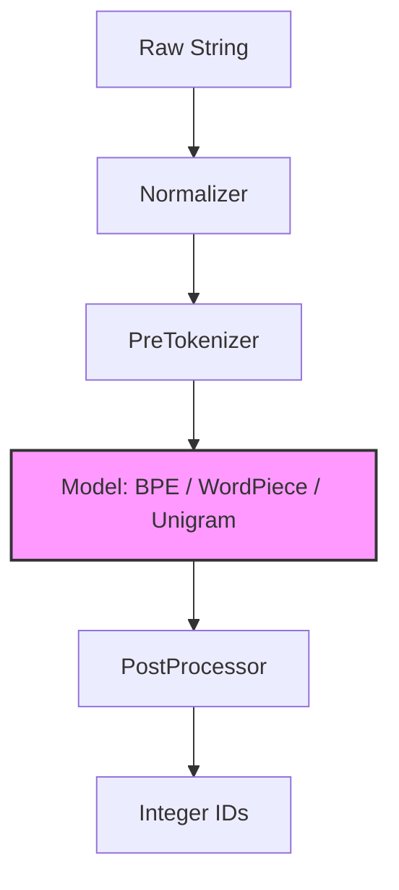
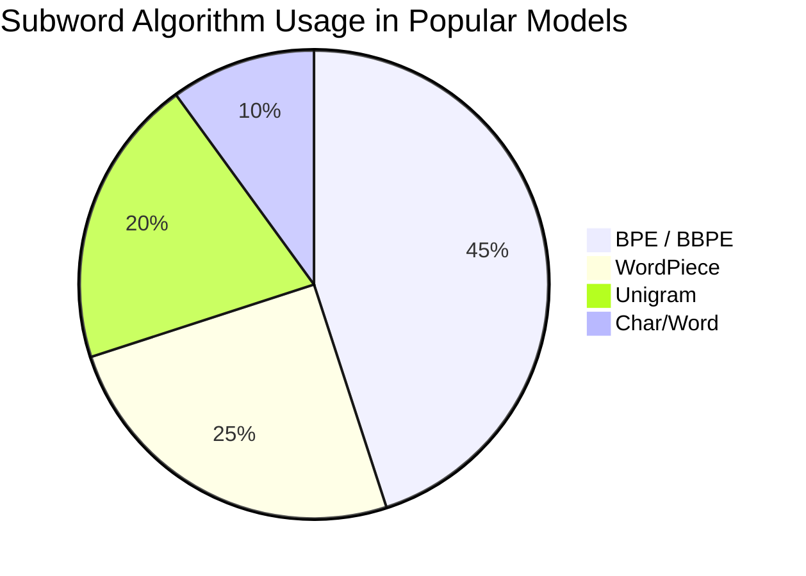
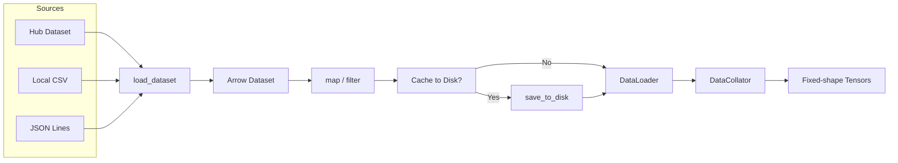
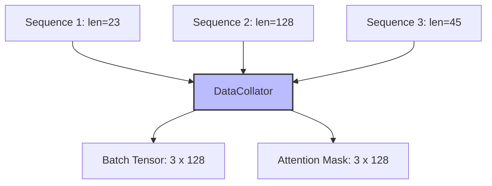

# 🏷️ Tokenizers and Data Processing

## 🎯 Learning Objectives

- Understand the algorithmic foundations of BPE, WordPiece, Unigram, and Byte-level BPE.
- Master the `tokenizers` library API for fast, parallelized encoding.
- Configure padding, truncation, and batching strategies for variable-length sequences.
- Leverage `datasets` advanced features (`map`, `filter`, streaming) for scalable data pipelines.
- Choose the correct `DataCollator` variant for classification, language modeling, and seq2seq tasks.

## Introduction

Tokenization is the silent bottleneck of every NLP pipeline. A model cannot consume raw text; it needs fixed-vocabulary integer identifiers. The choice of tokenization algorithm directly impacts vocabulary size, out-of-vocabulary rate, sequence length, and even model bias. While early systems used whitespace or character splitting, modern LLMs rely on subword algorithms that balance vocabulary coverage and sequence efficiency.

This note goes beyond `tokenizer.encode()`. We dissect the Rust-backed `tokenizers` library, compare subword algorithms, and build production data pipelines using the `datasets` library. These skills are prerequisites for efficient training (see [[03 - Trainer, TrainingArguments, and Distributed Training|Trainer note]]) and for understanding why generation behaves differently across model families (see [[04 - Generation, Decoding, and Structured Output|Generation note]]). If you are coming from computer vision, think of tokenization as the analog of image normalization and patch extraction.

---

## Module 1: Tokenization Algorithms and the tokenizers Library

### 1.1 Theoretical Foundation 🧠

Subword tokenization emerged because pure word-level vocabularies explode in size (English alone has >1M words) while character-level sequences become too long for transformers to model effectively. The core idea is to represent rare words as concatenations of frequent subword units, keeping the vocabulary compact while maintaining semantic granularity.

**Byte-Pair Encoding (BPE)** starts with a character vocabulary and iteratively merges the most frequent adjacent pairs in a training corpus. It was popularized by GPT-2 and is greedy: once a merge rule is learned, it is applied deterministically. **WordPiece** (used by BERT) is similar but selects merges based on maximizing training data likelihood rather than raw frequency. **Unigram Language Model** (used by T5, XLNet) starts with a large seed vocabulary and prunes tokens that least hurt the corpus likelihood, enabling multiple segmentation paths and subword sampling. **Byte-level BPE (BBPE)** operates on UTF-8 bytes rather than Unicode characters, guaranteeing that no input is truly out-of-vocabulary—every string is representable. This is the backbone of GPT-2, RoBERTa, and modern LLaMA models.

The `tokenizers` library implements these algorithms in Rust with Python bindings, achieving 10-100x speedups over pure Python tokenizers. It handles normalization (NFD, lowercasing), pre-tokenization (splitting on whitespace/punctuation), the core model (BPE/Unigram), and post-processing (adding special tokens like `[CLS]`).

A subtle but important distinction exists between the Hugging Face `tokenizers` library and Google's SentencePiece. SentencePiece treats the input as a raw stream of characters and learns subwords directly from that stream, including whitespace as a token. This makes it inherently language-agnostic and reversible. The Hugging Face library, by contrast, separates pre-tokenization (which splits on whitespace) from the subword model. This design is faster and more interpretable for English-centric models but requires careful configuration when handling languages without explicit word boundaries, such as Japanese or Chinese.

### 1.2 Mental Model 📐

```text
Raw Text: "Tokenization is cool!"
          │
          ▼
┌─────────────────────────────┐
│    Normalization            │  → lowercase, strip accents, NFD
│  "tokenization is cool!"    │
└─────────────┬───────────────┘
              │
              ▼
┌─────────────────────────────┐
│   Pre-tokenization          │  → split on whitespace/punctuation
│  ["tokenization", "is", "cool", "!"] │
└─────────────┬───────────────┘
              │
              ▼
┌─────────────────────────────┐
│   Tokenizer Model           │  → BPE/WordPiece/Unigram merges
│  ["token", "ization", "is", "cool", "!"] │
└─────────────┬───────────────┘
              │
              ▼
┌─────────────────────────────┐
│   Post-processing           │  → add [CLS], [SEP], pad
│  [101, 19204, 3989, 2003, ...] │
└─────────────────────────────┘
```

### 1.3 Syntax and Semantics 📝

```python
from transformers import AutoTokenizer
from tokenizers import Tokenizer, models, pre_tokenizers, decoders, trainers

# WHY: AutoTokenizer selects the correct fast Rust-backed tokenizer.
# For BERT, this loads a WordPiece model; for GPT-2, a BPE model.
tokenizer = AutoTokenizer.from_pretrained("bert-base-uncased")

# WHY: encode_plus returns input_ids, attention_mask, and token_type_ids
# in one dict. This is the canonical format for model.forward().
encoded = tokenizer.encode_plus(
    "HuggingFace is great!",
    add_special_tokens=True,      # WHY: [CLS] and [SEP] are required for BERT downstream tasks
    max_length=12,
    padding="max_length",         # WHY: Ensures fixed-shape tensors for batching
    truncation=True,              # WHY: Prevents index errors on long sequences
    return_tensors="pt"           # WHY: Returns PyTorch tensors directly
)
print(encoded["input_ids"])       # tensor([[101, 17662, ...]])

# WHY: batch_encode_plus handles multiple sequences and aligns padding.
batch = tokenizer.batch_encode_plus(
    ["Short.", "A much longer sentence here."],
    padding="longest",            # WHY: Pad to the longest sequence in the batch, not a global max
    truncation=True,
    return_tensors="pt"
)

# WHY: Training a custom BPE tokenizer from scratch.
# This is essential when working with domain-specific text (e.g., genomic sequences, code).
tokenizer_new = Tokenizer(models.BPE())
tokenizer_new.pre_tokenizer = pre_tokenizers.Whitespace()
trainer = trainers.BpeTrainer(vocab_size=10000, special_tokens=["<pad>", "<s>", "</s>"])
files = ["train.txt"]
tokenizer_new.train(files, trainer)
tokenizer_new.save("custom_tokenizer.json")
```

### 1.4 Visual Representation 🖼️






### 1.5 Application in ML/AI Systems 🤖

**Real case: GitHub Copilot** uses a Byte-level BPE tokenizer trained on source code. Because code contains rare identifiers (variable names, library paths), a subword approach is mandatory. BBPE guarantees that even Unicode characters in comments or string literals are never `<unk>`.

| ML Use Case | This Concept | Impact |
|-------------|-------------|--------|
| Multilingual LLMs | BBPE on UTF-8 bytes | No `<unk>` for low-resource scripts. |
| Genomic NLP | Custom BPE on DNA bases | Vocabulary of k-mers instead of English words. |
| Legal document search | WordPiece truncation strategies | Long documents chunked with sliding windows. |
| Real-time chatbots | Fast Rust tokenizer | <10ms latency per request in high-concurrency serving. |

### 1.6 Common Pitfalls ⚠️

⚠️ **Left-side versus right-side truncation**: BERT truncates from the right by default (`truncation_side="right"`). For tasks where the end of a document contains crucial information (e.g., conclusion sentences), this silently drops the most important tokens.

💡 **Mnemonic**: "**RIGHT** truncation drops the **TAIL**; check if your **HEAD** is all you need."

⚠️ **Mismatched tokenizer and model**: Loading `"gpt2"` weights with a `"bert-base-uncased"` tokenizer produces gibberish because the embedding tables are indexed by incompatible vocabularies. This is a silent logic error, not a runtime exception.

💡 **Tip**: Always verify `tokenizer.vocab_size == model.config.vocab_size` in your initialization smoke tests.

### 1.7 Knowledge Check ❓

1. Why does Byte-level BPE guarantee zero out-of-vocabulary tokens? What is the trade-off?
2. You have a batch of sequences with lengths `[5, 128, 12, 400]`. Explain the memory and semantic implications of `padding="max_length"` versus `padding="longest"` with `max_length=256`.
3. Write a snippet that trains a minimal BPE tokenizer on a list of strings without writing to disk.

---

## Module 2: Datasets and DataCollators

### 2.1 Theoretical Foundation 🧠

Modern NLP datasets are too large to fit in RAM as a single Python list. The `datasets` library, built on Apache Arrow, provides a memory-mapped, columnar storage format that allows you to load terabyte-scale corpora without exhausting system memory. Arrow's zero-copy semantics mean that slicing and batching operations do not duplicate data in RAM.

The `Dataset` abstraction is lazy and functional. Operations like `map`, `filter`, and `interleave_datasets` build a transformation graph rather than executing immediately. This enables efficient preprocessing pipelines that run on-the-fly during training. For multi-epoch training, you can materialize the transformed dataset with `save_to_disk` to avoid recomputing expensive tokenization on every epoch.

Streaming datasets (`streaming=True`) take laziness further: rows are fetched from the Hub or local storage only when requested by the dataloader. This is essential for web-scale corpora (e.g., C4, The Pile) that exceed local disk capacity. However, streaming disables random access shuffling, requiring approximate shuffling via sharded buffers.

`DataCollator` objects bridge the gap between variable-length tokenized examples and fixed-shape tensors required by PyTorch. Because sequences differ in length, the collator pads them to the batch maximum (or a preset maximum) and constructs attention masks so the model ignores padding positions during self-attention.

For reproducibility and collaboration, the `datasets` library supports versioning via the Hub and local `save_to_disk` / `load_from_disk` workflows. When you materialize a transformed dataset to disk, Apache Arrow writes a self-contained directory that can be loaded on another machine without re-executing the `map` transforms. This is critical for large teams where preprocessing pipelines are owned by data engineers and training scripts are owned by researchers. The separation of concerns prevents accidental data leakage and ensures that every training run starts from the exact same tokenized inputs.

### 2.2 Mental Model 📐

```text
Raw Dataset (Arrow-backed)
          │
          ▼
┌─────────────────────────────────────────┐
│  .map(tokenize, batched=True,           │
│        num_proc=8)                      │
│  WHY: Vectorized over batches,          │
│  parallelized over CPU cores            │
└─────────────────┬───────────────────────┘
                  │
                  ▼
┌─────────────────────────────────────────┐
│  .filter(lambda x: len(x) < 512)        │
│  WHY: Remove outliers before collation  │
└─────────────────┬───────────────────────┘
                  │
                  ▼
┌─────────────────────────────────────────┐
│  DataLoader + DataCollatorWithPadding   │
│  WHY: Dynamically pad each batch to     │
│  its longest sequence for efficiency    │
└─────────────────────────────────────────┘
```

### 2.3 Syntax and Semantics 📝

```python
from datasets import load_dataset, interleave_datasets, concatenate_datasets
from transformers import DataCollatorWithPadding, DataCollatorForLanguageModeling
from torch.utils.data import DataLoader

# WHY: load_dataset supports Hub, local files, CSV, JSON, and Python scripts.
# streaming=True is critical for web-scale data that does not fit on disk.
dataset = load_dataset("wikitext", "wikitext-2-raw-v1", split="train")
stream = load_dataset("oscar", "unshuffled_deduplicated_en", split="train", streaming=True)

# WHY: map applies a transformation lazily (or eagerly if batched and cached).
# batched=True is 10x+ faster because the tokenizer processes lists of strings.
def tokenize_function(examples):
    return tokenizer(examples["text"], truncation=True, max_length=512)

tokenized = dataset.map(
    tokenize_function,
    batched=True,
    num_proc=4,               # WHY: Parallelize across 4 CPU cores
    remove_columns=["text"]   # WHY: Drop raw text to save memory; only keep IDs
)

# WHY: interleave_datasets balances multiple sources (e.g., code + natural language).
mixed = interleave_datasets([dataset_a, dataset_b], probabilities=[0.7, 0.3])

# WHY: DataCollatorWithPadding pads to the longest sequence IN THE BATCH.
# This is more efficient than global max_length padding for variable-length data.
collator = DataCollatorWithPadding(tokenizer=tokenizer)
loader = DataLoader(tokenized, batch_size=8, collate_fn=collator)

# WHY: DataCollatorForLanguageModeling handles masked language modeling (MLM).
# It randomly masks tokens and constructs labels for BERT-style training.
mlm_collator = DataCollatorForLanguageModeling(
    tokenizer=tokenizer,
    mlm=True,
    mlm_probability=0.15      # WHY: BERT paper uses 15% masking
)

# WHY: Streaming requires iterative consumption; no len() or random access.
for batch in stream:
    pass  # Process batch
```

### 2.4 Visual Representation 🖼️






### 2.5 Application in ML/AI Systems 🤖

**Real case: MosaicML** uses `streaming=True` with `interleave_datasets` to compose training mixtures for MPT models. Their data platform streams sharded Arrow files from object storage, applies on-the-fly tokenization, and feeds directly into `Trainer` without ever materializing the full dataset on local NVMe.

| ML Use Case | This Concept | Impact |
|-------------|-------------|--------|
| Trillion-token pretraining | `streaming=True` + `interleave_datasets` | Train on data larger than local disk. |
| Low-latency fine-tuning | `map(..., num_proc=8)` | Preprocess millions of examples in minutes. |
| Multi-task instruction tuning | `concatenate_datasets` | Merge NLP, code, and math corpora. |
| Production inference batching | `DataCollatorWithPadding` | Minimize wasted compute on padded tokens. |

### 2.6 Common Pitfalls ⚠️

⚠️ **Memory explosion with map**: Calling `map` without `remove_columns` or `batched=True` can materialize redundant columns and crash the process. Arrow datasets share memory, but Python objects created inside `map` do not.

💡 **Mnemonic**: "**BATCH** it, **DROP** it, **CACHE** it, **STREAM** it."

⚠️ **Streaming shuffle limitations**: `dataset.shuffle()` on a streaming dataset uses a fixed-size buffer. If your data has strong ordering bias (e.g., all Wikipedia before all code), a small buffer fails to global-shuffle, destroying convergence.

💡 **Tip**: Set a large `buffer_size` (e.g., 100_000) for streaming shuffle, or pre-shuffle shards at the file level.

### 2.7 Knowledge Check ❓

1. Explain why `num_proc` in `dataset.map()` speeds up tokenization but `num_proc` in a PyTorch `DataLoader` is a different concept (worker processes for loading).
2. You are training on a 2TB corpus. Write the `load_dataset` call and explain why `streaming=True` is necessary and what functionality you lose.
3. Design a `DataCollatorForSeq2Seq` scenario: given source and target sequences of varying lengths, what two tensors must the collator produce, and why is decoder input shifting required?

---

## 📦 Compression Code

```python
"""
End-to-end data pipeline: load, tokenize, filter, collate, and stream.
"""
from datasets import load_dataset, interleave_datasets
from transformers import AutoTokenizer, DataCollatorWithPadding
from torch.utils.data import DataLoader

TOKENIZER_NAME = "bert-base-uncased"
MAX_LENGTH = 512
BATCH_SIZE = 16

# 1. Load and mix two sources
wiki = load_dataset("wikitext", "wikitext-2-raw-v1", split="train")
book = load_dataset("bookcorpus", split="train")
mixed = interleave_datasets([wiki, book], probabilities=[0.5, 0.5])

# 2. Tokenize with parallel preprocessing
tokenizer = AutoTokenizer.from_pretrained(TOKENIZER_NAME)
def preprocess(batch):
    return tokenizer(
        batch["text"],
        truncation=True,
        max_length=MAX_LENGTH,
        padding=False           # WHY: Defer padding to collator for efficiency
    )

tokenized = mixed.map(
    preprocess,
    batched=True,
    num_proc=4,
    remove_columns=mixed.column_names
)

# 3. Filter extremely short sequences
tokenized = tokenized.filter(lambda x: len(x["input_ids"]) > 10)

# 4. Collate and batch
collator = DataCollatorWithPadding(tokenizer=tokenizer)
loader = DataLoader(tokenized, batch_size=BATCH_SIZE, collate_fn=collator)

# 5. Iterate
for batch in loader:
    print(batch["input_ids"].shape)
    break
```

## 🎯 Documented Project

**Description**: Build a "Data Foundry" CLI that ingests raw text corpora (CSV, JSONL, TXT folders), trains a domain-specific BPE tokenizer, produces an Arrow dataset with configurable filtering, and exports shards ready for `Trainer` or external frameworks.

**Functional Requirements**:
- Accept a directory of raw files and a YAML config specifying tokenizer type, vocab size, and normalization rules.
- Train the tokenizer and save it as `tokenizer.json`.
- Convert raw files into a `datasets.Dataset`, apply length and quality filters (e.g., deduplication, language detection).
- Support both eager (`save_to_disk`) and streaming output modes.
- Emit statistics: token count, sequence length distribution, and filtering rejection rate.

**Main Components**:
- `TokenizerTrainer`: Wraps `tokenizers` trainers with config-driven normalization.
- `ArrowConverter`: Maps file types to `load_dataset` calls.
- `QualityFilter`: Pluggable filters for length, language, and dedup.
- `ShardExporter`: Writes `dataset` to `00001-of-00010.parquet` shards.

**Success Metrics**:
- Process 100GB of text in < 30 minutes on a 16-core machine.
- Tokenizer compression ratio (text bytes / token count) within 10% of a reference tokenizer.
- Zero data loss due to encoding errors (use BBPE or UTF-8 fallback).

## 🎯 Key Takeaways

- Subword tokenization (BPE, WordPiece, Unigram, BBPE) is the bridge between infinite text and finite vocabulary.
- The `tokenizers` library provides Rust-backed speed; always prefer `AutoTokenizer` with `use_fast=True`.
- Padding strategies matter: `longest` saves memory per batch, while `max_length` simplifies tensor shapes.
- The `datasets` library uses Apache Arrow for memory-efficient, lazy, and parallelizable data processing.
- `DataCollator` objects dynamically align variable-length sequences into fixed-shape tensors for the model.
- Streaming datasets enable training on web-scale corpora but sacrifice random access and exact shuffling.
- `DataCollatorForSeq2Seq` requires special handling because decoder inputs are shifted right by one position relative to labels during teacher forcing.
- Always verify `tokenizer.is_fast` is `True` in production; the pure Python fallback is orders of magnitude slower and lacks batch alignment guarantees.
- Materializing preprocessed datasets with `save_to_disk` eliminates non-determinism across training restarts and team members.

## References

- Hugging Face Tokenizers Docs: [https://huggingface.co/docs/tokenizers](https://huggingface.co/docs/tokenizers)
- Hugging Face Datasets Docs: [https://huggingface.co/docs/datasets](https://huggingface.co/docs/datasets)
- Sennrich et al., "Neural Machine Translation of Rare Words with Subword Units", ACL 2016.
- Kudo & Richardson, "SentencePiece: A simple and language independent subword tokenizer and detokenizer", EMNLP 2018.
- Related Vault: [[01 - The from_pretrained Ecosystem]]
- Related Vault: [[03 - Trainer, TrainingArguments, and Distributed Training]]
