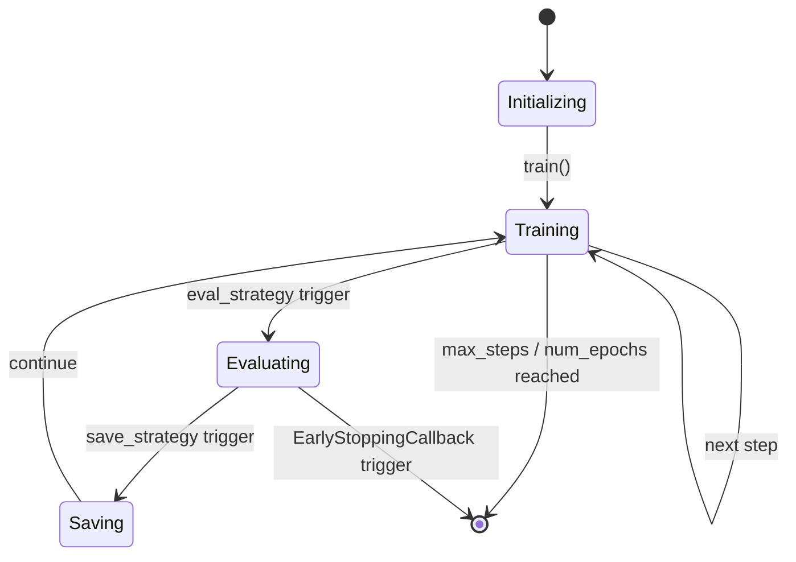
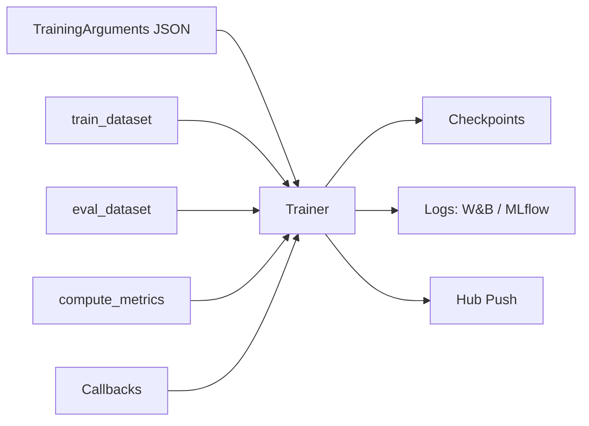
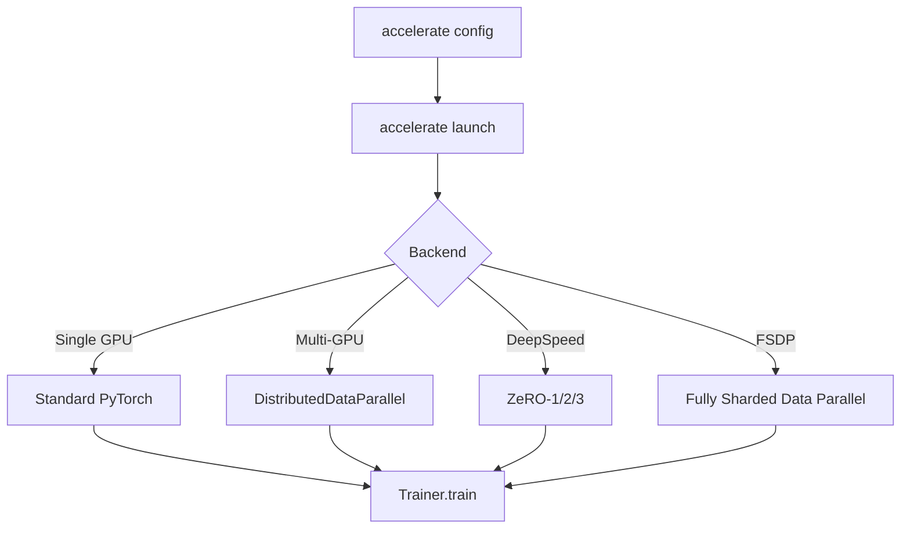
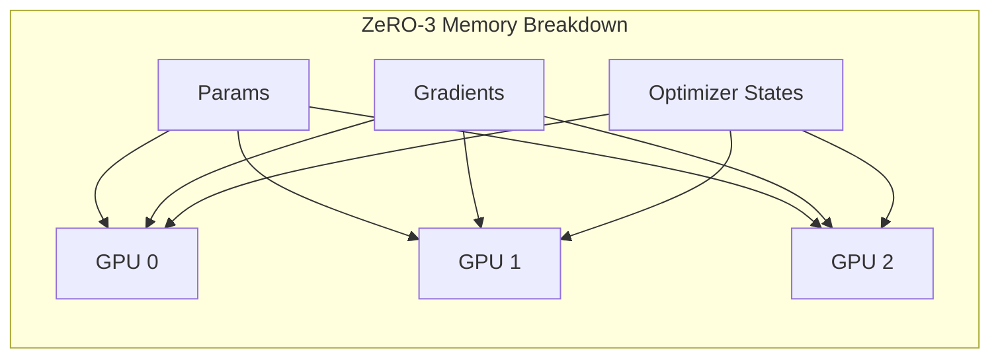

# 🏷️ Trainer, TrainingArguments, and Distributed Training

## 🎯 Learning Objectives

- Understand the full `Trainer` lifecycle and how `TrainingArguments` controls every training hyperparameter.
- Implement custom `TrainerCallback` objects for checkpointing, early stopping, and experiment tracking.
- Configure mixed precision (`fp16`/`bf16`), gradient accumulation, and distributed strategies via `accelerate`.
- Integrate DeepSpeed and FSDP into `transformers` training loops with minimal code changes.

## Introduction

Training a transformer at scale is not merely a matter of calling `.fit()`. It requires orchestrating optimizers, schedulers, checkpointing, logging, distributed synchronization, and memory management across heterogeneous hardware. The `Trainer` class in Hugging Face `transformers` abstracts this complexity into a single, extensible loop, while `TrainingArguments` exposes every knob an ML engineer needs to tune.

This note deconstructs that loop. We examine why `Trainer` exists (to prevent every research team from rewriting the same boilerplate), how `TrainingArguments` maps to deep learning theory, and how to scale beyond a single GPU using `accelerate`, DeepSpeed, and FSDP. These topics are the bridge between data preparation ([[02 - Tokenizers and Data Processing]]) and model deployment ([[09 - MLOps y Produccion|MLOps]]). If you have worked with PyTorch Lightning, think of `Trainer` as its more opinionated, Hub-integrated cousin.

---

## Module 1: Trainer Lifecycle and TrainingArguments

### 1.1 Theoretical Foundation 🧠

The standard PyTorch training loop—forward, loss.backward(), optimizer.step(), scheduler.step()—is deceptively simple. In production, you must also handle: gradient clipping, mixed-precision scaling, checkpoint saving every N steps, evaluation every N epochs, metric computation, logging to W&B or MLflow, and pushing artifacts to the Hub. Reimplementing this correctly for every experiment is error-prone and wastes engineering time.

`Trainer` encapsulates this lifecycle into a state machine with hooks: `on_init`, `on_train_begin`, `on_step_begin`, `on_step_end`, `on_epoch_end`, `on_evaluate`, `on_save`, and `on_train_end`. Each hook can be intercepted by `TrainerCallback` subclasses, enabling arbitrary customization without subclassing `Trainer` itself. This design follows the **Observer pattern**, keeping the core loop clean while allowing orthogonal concerns (logging, checkpointing) to attach declaratively.

`TrainingArguments` is the configuration object that drives this loop. It is deliberately exhaustive: learning rate, batch size, gradient accumulation, warmup steps, weight decay, label smoothing, mixed precision, dataloader workers, and Hub integration are all explicit fields. This verbosity is a feature, not a bug. It makes training runs reproducible because every hyperparameter is serialized alongside the model checkpoint.

### 1.2 Mental Model 📐

```text
┌─────────────────────────────────────────────┐
│           TrainingArguments                 │
│  (immutable config: lr, batch_size, etc.)   │
└─────────────────────┬───────────────────────┘
                      │
                      ▼
┌─────────────────────────────────────────────┐
│              Trainer                        │
│  ┌─────────────────────────────────────┐    │
│  │  on_train_begin                     │    │
│  │    ├─> Callback: init W&B run       │    │
│  │  loop over epochs                   │    │
│  │    ├─> loop over batches            │    │
│  │    │   ├─> forward + loss          │    │
│  │    │   ├─> backward                │    │
│  │    │   ├─> gradient accumulation?  │    │
│  │    │   └─> optimizer.step()        │    │
│  │    ├─> on_epoch_end                │    │
│  │    │   ├─> evaluate()             │    │
│  │    │   └─> save_checkpoint()      │    │
│  │  on_train_end                      │    │
│  └─────────────────────────────────────┘    │
└─────────────────────────────────────────────┘
```

### 1.3 Syntax and Semantics 📝

```python
from transformers import (
    AutoModelForSequenceClassification,
    TrainingArguments,
    Trainer,
    EarlyStoppingCallback
)
import numpy as np
import evaluate

# WHY: TrainingArguments is the single source of truth for the training run.
# Every field is serialized, making the run reproducible from a JSON file.
args = TrainingArguments(
    output_dir="./results",
    num_train_epochs=3,
    per_device_train_batch_size=8,
    per_device_eval_batch_size=16,
    gradient_accumulation_steps=4,   # WHY: Effective batch = 8 * 4 = 32 without OOM
    learning_rate=2e-5,
    warmup_steps=500,                # WHY: Linear warmup stabilizes early training
    weight_decay=0.01,               # WHY: L2 regularization on all non-bias/norm params
    max_grad_norm=1.0,               # WHY: Gradient clipping prevents explosion
    logging_steps=50,
    eval_strategy="epoch",           # WHY: Evaluate after every full pass
    save_strategy="epoch",
    load_best_model_at_end=True,     # WHY: Rollback to checkpoint with best eval metric
    metric_for_best_model="accuracy",
    greater_is_better=True,
    fp16=True,                       # WHY: Mixed precision halves memory, speeds up on Tensor Cores
    dataloader_num_workers=4,        # WHY: Preload batches in parallel CPU workers
    remove_unused_columns=False,     # WHY: Keep extra columns for custom compute_metrics
    push_to_hub=False,
    report_to="wandb"                # WHY: Auto-logs hyperparameters and curves
)

# WHY: compute_metrics decouples metric computation from the core loop.
metric = evaluate.load("accuracy")
def compute_metrics(eval_pred):
    logits, labels = eval_pred
    preds = np.argmax(logits, axis=-1)
    return metric.compute(predictions=preds, references=labels)

model = AutoModelForSequenceClassification.from_pretrained("bert-base-uncased", num_labels=2)

trainer = Trainer(
    model=model,
    args=args,
    train_dataset=train_ds,
    eval_dataset=eval_ds,
    compute_metrics=compute_metrics,
    callbacks=[EarlyStoppingCallback(early_stopping_patience=3)]  # WHY: Stop if no improvement
)

# WHY: trainer.train() handles the full lifecycle.
trainer.train()
trainer.save_model("./best_model")
trainer.push_to_hub("my-org/bert-finetuned")
```

### 1.4 Visual Representation 🖼️






### 1.5 Application in ML/AI Systems 🤖

**Real case: AI2 (Allen Institute for AI)** uses `Trainer` with custom callbacks to train OLMo, a fully open-source LLM. Their callbacks synchronize checkpointing to S3, emit custom token-throughput metrics, and enforce evaluation-only on specific data slices for scientific reproducibility.

| ML Use Case | This Concept | Impact |
|-------------|-------------|--------|
| Reproducible research | `TrainingArguments` serialization | Every run is re-runnable from a single JSON. |
| Production fine-tuning | `Trainer` + `push_to_hub` | Automated artifact promotion from training to staging. |
| Cost optimization | `fp16` + gradient accumulation | Train larger models on fewer GPUs. |
| Experiment tracking | `report_to` + callbacks | Centralized comparison of 100+ hyperparameter sweeps. |

### 1.6 Common Pitfalls ⚠️

⚠️ **Gradient accumulation without loss scaling**: When accumulating gradients over `N` steps, you must divide the loss by `N` or the effective learning rate explodes. `Trainer` handles this automatically, but custom loops often forget.

💡 **Mnemonic**: "**ACCUMULATE** the gradient; **AVERAGE** the loss."

⚠️ **`remove_unused_columns=True` (default)**: If your dataset contains columns that are not direct `forward()` arguments but are needed in `compute_metrics`, `Trainer` silently drops them. This causes cryptic KeyErrors during evaluation.

💡 **Tip**: Always set `remove_unused_columns=False` when using custom `compute_metrics` or multi-input tasks.

### 1.7 Knowledge Check ❓

1. If `per_device_train_batch_size=2` and `gradient_accumulation_steps=8`, what is the effective global batch size on 4 GPUs? Show your work.
2. Explain the difference between `max_steps` and `num_train_epochs`. When would you prefer one over the other?
3. Your validation loss plateaus but `EarlyStoppingCallback` never triggers. What two `TrainingArguments` fields could be misconfigured?

---

## Module 2: Distributed Training and Customization

### 2.1 Theoretical Foundation 🧠

Single-GPU training hits a memory wall long before you hit a compute wall. A 7B parameter model in FP32 requires 28GB just for weights—exceeding consumer GPU memory. Distributed training solves this through two orthogonal strategies: **data parallelism** (split the batch across GPUs) and **model parallelism** (split the layers across GPUs). In practice, modern training uses **sharded data parallelism** hybrids like DeepSpeed ZeRO and FSDP, which partition optimizer states, gradients, and even parameters across workers.

`accelerate` is Hugging Face's abstraction over PyTorch distributed backends. It handles device placement, mixed-precision autocasting, gradient synchronization, and DeepSpeed/FSDP configuration without changing your model definition. The key insight is that distributed training should be a configuration concern, not a code concern. You write standard PyTorch; `accelerate` adapts it.

DeepSpeed ZeRO (Zero Redundancy Optimizer) eliminates redundant replication of optimizer states across GPUs. ZeRO-1 shards optimizer states, ZeRO-2 shards gradients, and ZeRO-3 shards model parameters. FSDP (Fully Sharded Data Parallel), PyTorch's native equivalent, wraps modules and all-gather parameters on-demand during the forward pass, then discards them to save memory. Both integrate with `Trainer` via `TrainingArguments` or `accelerate` config files.

### 2.2 Mental Model 📐

```text
Single GPU                    Multi-GPU Data Parallel
┌─────────────┐              ┌─────────┐ ┌─────────┐
│  Model      │              │ Model   │ │ Model   │
│  Optimizer  │              │ Optim   │ │ Optim   │
│  Gradients  │              │ Grad    │ │ Grad    │
└─────────────┘              └────┬────┘ └────┬────┘
                                  │  AllReduce  │
                                  └──────┬──────┘
                                         ▼
                                  Averaged Gradients

DeepSpeed ZeRO-3
┌─────────┐ ┌─────────┐ ┌─────────┐
│ Param   │ │ Param   │ │ Param   │  ← Each GPU holds 1/N of params
│ Shard 1 │ │ Shard 2 │ │ Shard 3 │
└────┬────┘ └────┬────┘ └────┬────┘
     │  AllGather │           │        ← On demand during forward
     └─────┬──────┘           │
           ▼                  │
     Full Model (temp)        │
```

### 2.3 Syntax and Semantics 📝

```python
from accelerate import Accelerator
from torch.optim import AdamW
from torch.utils.data import DataLoader

# WHY: Accelerator abstracts device placement, mixed precision, and distributed setup.
# You write plain PyTorch; Accelerator adapts it behind the scenes.
accelerator = Accelerator(
    mixed_precision="fp16",       # WHY: Enables autocast + GradScaler automatically
    gradient_accumulation_steps=4,
    deepspeed_plugin=None,        # WHY: Can inject DeepSpeed config here or via CLI
    fsdp_plugin=None              # WHY: Similarly for PyTorch FSDP
)

model = AutoModelForCausalLM.from_pretrained("gpt2")
optimizer = AdamW(model.parameters(), lr=3e-5)
loader = DataLoader(dataset, batch_size=8)

# WHY: prepare() wraps model, optimizer, and dataloader for distributed.
# On multi-GPU, this inserts DistributedDataParallel and shuffles the sampler.
model, optimizer, loader = accelerator.prepare(model, optimizer, loader)

model.train()
for step, batch in enumerate(loader):
    with accelerator.accumulate(model):
        outputs = model(**batch)
        loss = outputs.loss
        # WHY: backward() handles scaled gradients and DeepSpeed/FSDP hooks.
        accelerator.backward(loss)
        optimizer.step()
        optimizer.zero_grad()

# WHY: TrainingArguments can also inject DeepSpeed via a JSON config path.
args = TrainingArguments(
    output_dir="./ds_output",
    deepspeed="ds_config_zero3.json",  # WHY: Offload optimizer states to CPU/NVMe
    per_device_train_batch_size=1,
    gradient_accumulation_steps=8,
    fp16=True
)
```

### 2.4 Visual Representation 🖼️






### 2.5 Application in ML/AI Systems 🤖

**Real case: Stability AI** trains Stable Diffusion XL using DeepSpeed ZeRO-2 and gradient checkpointing across hundreds of A100 GPUs. The `Trainer` integration allows their researchers to switch between DDP, DeepSpeed, and FSDP by changing a single JSON file and relaunching with `accelerate launch`.

| ML Use Case | This Concept | Impact |
|-------------|-------------|--------|
| 70B+ model pretraining | DeepSpeed ZeRO-3 + FSDP | Fit trillion-parameter models on commodity clusters. |
| Low-latency fine-tuning | `accelerate` + `device_map="auto"` | Single script runs on 1 GPU or 8 GPUs unchanged. |
| Cloud cost reduction | `fp16` + gradient checkpointing | 2x throughput on spot instances. |
| On-premise clusters | FSDP with `limit_all_gathers` | Maximize bandwidth on InfiniBand links. |

### 2.6 Common Pitfalls ⚠️

⚠️ **`Accelerator` with `Trainer` double-wrapping**: If you manually wrap a model with `Accelerator.prepare()` and then pass it to `Trainer`, `Trainer` may attempt to wrap it again, causing DDP nesting errors. Let `Trainer` handle distribution unless you are writing a custom loop.

💡 **Mnemonic**: "**ONE** wrapper to rule them all—**TRAINER** or **ACCELERATOR**, never both."

⚠️ **DeepSpeed CPU offload I/O bottleneck**: ZeRO-3 with CPU/NVMe offload saves VRAM but can saturate PCIe bandwidth. If your step time is dominated by parameter swapping rather than compute, offload is hurting you.

💡 **Tip**: Profile with `deepspeed --num_gpus 8 train.py` and watch the `param_swap` timer. If it exceeds 30% of step time, reduce offload levels or use NVMe offload instead of CPU.

### 2.7 Knowledge Check ❓

1. Compare ZeRO-1, ZeRO-2, and ZeRO-3 in terms of what is sharded and what remains replicated per GPU.
2. You have a script that runs fine on 1 GPU but hangs on 2 GPUs at the first `loss.backward()`. What is the most likely missing call in a custom loop versus a `Trainer` loop?
3. Write a minimal `accelerate` launch command that enables DeepSpeed ZeRO-2 and mixed precision without modifying the Python source.

---

## 📦 Compression Code

```python
"""
Production training script using Trainer + DeepSpeed + W&B.
"""
from transformers import (
    AutoModelForCausalLM,
    AutoTokenizer,
    TrainingArguments,
    Trainer,
    DataCollatorForLanguageModeling
)
from datasets import load_dataset
import wandb

MODEL = "gpt2"
DATA = "wikitext"

tokenizer = AutoTokenizer.from_pretrained(MODEL)
tokenizer.pad_token = tokenizer.eos_token  # WHY: GPT-2 has no pad token by default

def tokenize(batch):
    return tokenizer(batch["text"], truncation=True, max_length=512)

ds = load_dataset(DATA, "wikitext-2-raw-v1", split="train")
ds = ds.map(tokenize, batched=True, remove_columns=ds.column_names)

model = AutoModelForCausalLM.from_pretrained(MODEL)

args = TrainingArguments(
    output_dir="./gpt2-finetuned",
    num_train_epochs=1,
    per_device_train_batch_size=4,
    gradient_accumulation_steps=4,
    learning_rate=5e-5,
    warmup_steps=100,
    logging_steps=10,
    save_steps=500,
    fp16=True,
    deepspeed="ds_config.json",   # WHY: ZeRO-2 config file
    report_to="wandb",
    run_name="gpt2-wikitext-demo"
)

collator = DataCollatorForLanguageModeling(tokenizer=tokenizer, mlm=False)

trainer = Trainer(
    model=model,
    args=args,
    train_dataset=ds,
    data_collator=collator
)

trainer.train()
trainer.save_model("./gpt2-finetuned-final")
```

## 🎯 Documented Project

**Description**: Build a "Universal Fine-Tuning Launcher" that accepts a model ID, dataset ID, and a YAML config defining training, evaluation, and distributed strategies. It produces a reproducible training run with automatic Hub push and experiment tracking.

**Functional Requirements**:
- Parse YAML config defining `TrainingArguments`, DeepSpeed/FSDP flags, and callback list.
- Support task types: `causal_lm`, `seq2seq`, `sequence_classification`.
- Auto-select `DataCollator` and `compute_metrics` based on task type.
- Integrate W&B or MLflow via `report_to`; emit custom throughput metrics (tokens/sec/GPU).
- On completion, push the best checkpoint to the Hub with a generated model card.
- Support resumption from the latest checkpoint via `resume_from_checkpoint`.

**Main Components**:
- `LauncherConfig`: Pydantic model validating YAML against `TrainingArguments` schema.
- `TaskRegistry`: Maps task strings to model classes, collators, and metric functions.
- `CustomCheckpointCallback`: Uploads checkpoints to S3 in parallel with local save.
- `ThroughputMonitorCallback`: Computes tokens processed per second per GPU.

**Success Metrics**:
- Single command launch for any Hub model + dataset pair.
- Reproducible runs: identical YAML produces bit-identical loss curves (deterministic).
- Distributed scaling efficiency > 85% from 1 to 8 GPUs (measured by throughput).

## 🎯 Key Takeaways

- `Trainer` is a state machine with hook-based callbacks; prefer callbacks over subclassing for orthogonal concerns.
- `TrainingArguments` serializes every hyperparameter, making runs auditable and reproducible.
- Gradient accumulation increases effective batch size without increasing memory; divide loss by accumulation steps.
- `accelerate` unifies single-GPU, multi-GPU, DeepSpeed, and FSDP under one abstraction.
- DeepSpeed ZeRO shards optimizer states, gradients, and parameters across GPUs to train models that exceed single-GPU memory.
- FSDP is PyTorch's native sharded data parallelism and integrates cleanly with `Trainer` via `fsdp` config fields.
- Mixed precision (`fp16`/`bf16`) is almost always a free performance and memory win on modern NVIDIA hardware.

## References

- Hugging Face Trainer Docs: [https://huggingface.co/docs/transformers/main_classes/trainer](https://huggingface.co/docs/transformers/main_classes/trainer)
- Accelerate Docs: [https://huggingface.co/docs/accelerate](https://huggingface.co/docs/accelerate)
- DeepSpeed: [https://www.deepspeed.ai/](https://www.deepspeed.ai/)
- PyTorch FSDP: [https://pytorch.org/tutorials/intermediate/FSDP_tutorial.html](https://pytorch.org/tutorials/intermediate/FSDP_tutorial.html)
- Related Vault: [[02 - Tokenizers and Data Processing]]
- Related Vault: [[04 - Generation, Decoding, and Structured Output]]
- Related Vault: [[09 - MLOps y Produccion]]
