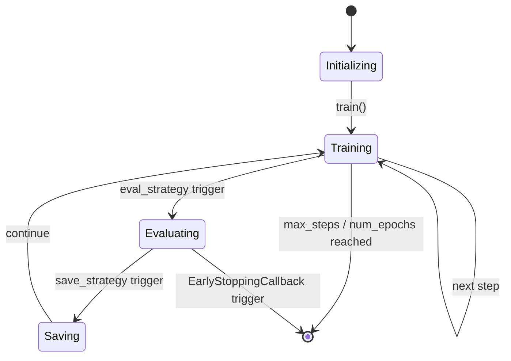

# 🤗 Trainer, TrainingArguments, and Distributed Training

## 🎯 Learning Objectives

- Understand the full `Trainer` lifecycle and how `TrainingArguments` controls every training hyperparameter.
- Implement custom `TrainerCallback` objects for checkpointing, early stopping, and experiment tracking.
- Configure mixed precision (`fp16`/`bf16`), gradient accumulation, and distributed strategies via `accelerate`.
- Integrate DeepSpeed and FSDP into `transformers` training loops with minimal code changes.

## Introduction

Training a transformer at scale is not merely a matter of calling `.fit()`. It requires orchestrating optimizers, schedulers, checkpointing, logging, distributed synchronization, and memory management across heterogeneous hardware. The `Trainer` class in Hugging Face `transformers` abstracts this complexity into a single, extensible loop, while `TrainingArguments` exposes every knob an ML engineer needs to tune.

This note deconstructs that loop. We examine why `Trainer` exists (to prevent every research team from rewriting the same boilerplate), how `TrainingArguments` maps to deep learning theory, and how to scale beyond a single GPU using `accelerate`, DeepSpeed, and FSDP. These topics bridge data preparation ([[02 - Tokenizers and Data Processing]]) and model deployment ([[09 - MLOps y Produccion|MLOps]]). If you have worked with PyTorch Lightning, think of `Trainer` as its more opinionated, Hub-integrated cousin.

---

## 1. The Trainer Lifecycle and TrainingArguments

The standard PyTorch training loop—forward, `loss.backward()`, `optimizer.step()`, `scheduler.step()`—is deceptively simple. In production, you must also handle gradient clipping, mixed-precision scaling, checkpoint saving every $N$ steps, evaluation every epoch, metric computation, logging to W&B or MLflow, and artifact pushing to the Hub. Reimplementing this correctly for every experiment wastes engineering time and introduces subtle bugs.

`Trainer` encapsulates this lifecycle as a **state machine with hooks**. The key insight is that the training loop has well-defined transition points that can be intercepted:

$$T = \{ \text{init}, \text{train\_begin}, \text{step\_begin}, \text{step\_end}, \text{epoch\_end}, \text{evaluate}, \text{save}, \text{train\_end} \}$$

Each $t \in T$ maps to a `TrainerCallback` method (e.g., `on_step_end`). This **Observer pattern** keeps the core loop clean while letting orthogonal concerns attach declaratively. You compose callbacks rather than subclassing `Trainer`.

### TrainingArguments: The Single Source of Truth

`TrainingArguments` is deliberately exhaustive. Every hyperparameter is an explicit field — learning rate, batch size, gradient accumulation, warmup steps, weight decay, label smoothing, mixed precision — all serialized alongside the checkpoint. This verbosity is a feature: a training run is reproducible from a single JSON file.

The effective batch size combines three factors:

$$B_{\text{eff}} = B_{\text{device}} \times N_{\text{GPUs}} \times G_{\text{accum}}$$

where $G_{\text{accum}}$ is the number of gradient accumulation steps. For example, with $B_{\text{device}} = 8$, $N_{\text{GPUs}} = 4$, and $G_{\text{accum}} = 2$, the effective batch is 64. Accumulation simulates a larger batch without exceeding per-device memory.

The learning rate schedule combines warmup and decay. A common choice is linear warmup followed by cosine decay:

$$\eta(t) = \begin{cases}
\eta_{\text{max}} \cdot \frac{t}{T_{\text{warmup}}} & 0 \leq t < T_{\text{warmup}} \\[4pt]
\eta_{\text{max}} \cdot \frac{1}{2} \left(1 + \cos\left(\pi \frac{t - T_{\text{warmup}}}{T_{\text{total}} - T_{\text{warmup}}}\right)\right) & T_{\text{warmup}} \leq t \leq T_{\text{total}}
\end{cases}$$

```python
from transformers import (
    AutoModelForSequenceClassification,
    TrainingArguments,
    Trainer,
    EarlyStoppingCallback
)
import numpy as np
import evaluate

args = TrainingArguments(
    output_dir="./results",
    num_train_epochs=3,
    per_device_train_batch_size=8,
    per_device_eval_batch_size=16,
    gradient_accumulation_steps=4,    # Effective batch = 8 * 4 = 32 (single GPU)
    learning_rate=2e-5,
    warmup_steps=500,
    weight_decay=0.01,
    max_grad_norm=1.0,
    logging_steps=50,
    eval_strategy="epoch",
    save_strategy="epoch",
    load_best_model_at_end=True,
    metric_for_best_model="accuracy",
    greater_is_better=True,
    fp16=True,                        # Mixed precision halves memory
    dataloader_num_workers=4,
    remove_unused_columns=False,
    report_to="wandb"
)

metric = evaluate.load("accuracy")

def compute_metrics(eval_pred):
    logits, labels = eval_pred
    predictions = np.argmax(logits, axis=-1)
    return metric.compute(predictions=predictions, references=labels)

model = AutoModelForSequenceClassification.from_pretrained(
    "bert-base-uncased", num_labels=2
)

trainer = Trainer(
    model=model,
    args=args,
    train_dataset=train_dataset,
    eval_dataset=eval_dataset,
    compute_metrics=compute_metrics,
    callbacks=[EarlyStoppingCallback(early_stopping_patience=3)]
)

trainer.train()
trainer.save_model("./best_model")
trainer.push_to_hub("my-org/bert-finetuned")
```

### State Machine Transitions



### Custom Callbacks

```python
from transformers import TrainerCallback, TrainerState, TrainerControl

class ThroughputCallback(TrainerCallback):
    """Logs tokens per second per GPU for cost tracking."""
    def on_step_begin(self, args, state, control, **kwargs):
        if state.global_step == 0:
            state.log_history.append({"step": 0, "tokens_per_sec": 0.0})

    def on_log(self, args, state, control, logs=None, **kwargs):
        if logs and "loss" in logs:
            tokens = args.per_device_train_batch_size * args.max_seq_length
            logs["tokens_per_sec_per_gpu"] = tokens / (state.global_step + 1)

class UploadCheckpointCallback(TrainerCallback):
    """Uploads checkpoints to S3 in parallel with local save."""
    def on_save(self, args, state, control, **kwargs):
        import subprocess
        subprocess.Popen(["aws", "s3", "sync", args.output_dir,
                         f"s3://my-bucket/checkpoints/{state.global_step}"])

trainer.add_callback(ThroughputCallback())
trainer.add_callback(UploadCheckpointCallback())
```

✅ **Antipattern: Subclassing Trainer for every modification**
```python
# ❌ Forking core loop for logging
class MyTrainer(Trainer):
    def log(self, logs):
        super().log(logs)
        wandb.log(logs)

# ✅ Declarative: attach callbacks instead
trainer.add_callback(WandbCallback())
```

> **Caso real: AI2 (Allen Institute for AI)** uses `Trainer` with custom callbacks to train OLMo, a fully open-source LLM. Their callbacks synchronize checkpoints to S3, emit custom token-throughput metrics, and enforce evaluation on specific data slices. The callback pattern lets them add infrastructure capabilities without forking the core `Trainer` class.

⚠️ **Gradient accumulation without loss normalization**: When accumulating gradients over $N$ steps, the loss must be divided by $N$ before `backward()`, or the effective learning rate scales by $N$. `Trainer` handles this automatically, but custom loops often forget.

💡 **Always set `remove_unused_columns=False`** when using custom `compute_metrics` or multi-input tasks. The default `True` silently drops extra columns, causing KeyErrors during evaluation.

---

## 2. Distributed Training and Memory Optimization

Single-GPU training hits a memory wall long before a compute wall. A 7B parameter model in FP32 requires 28 GB just for weights — exceeding consumer GPU memory. Distributed training solves this through two orthogonal strategies: **data parallelism** (split the batch across GPUs) and **model parallelism** (split the layers across GPUs). Modern training uses **sharded data parallelism** hybrids like DeepSpeed ZeRO and FSDP, which partition optimizer states, gradients, and parameters across workers.

### The Memory Scaling Problem

Let $\Psi$ be the number of parameters. In standard data parallelism, every GPU holds a full copy of:
- FP16 model parameters: $2\Psi$ bytes
- FP32 master weights (for Adam): $4\Psi$ bytes
- Adam momentum: $4\Psi$ bytes
- Adam variance: $4\Psi$ bytes
- Gradients (FP16): $2\Psi$ bytes

Total per GPU: $16\Psi$ bytes. For $\Psi = 7 \times 10^9$, that is 112 GB per GPU — impossible even on an A100 (80 GB).

### DeepSpeed ZeRO Stages

ZeRO eliminates redundant copies by sharding across $N$ GPUs:

| Stage | Sharded | Replicated | Per-GPU Memory |
|-------|---------|------------|----------------|
| ZeRO-1 | Optimizer states | Params, grads | $\frac{12\Psi}{N} + 4\Psi$ |
| ZeRO-2 | Optimizer states, grads | Params | $\frac{14\Psi}{N} + 2\Psi$ |
| ZeRO-3 | Optimizer states, grads, params | Nothing | $\frac{16\Psi}{N}$ |

With ZeRO-3 and $N = 8$, a 7B model requires $16 \times 7 / 8 = 14$ GB per GPU — fitting comfortably on consumer hardware.

### accelerate: One Abstraction for All Backends

`accelerate` is Hugging Face's abstraction over PyTorch distributed backends. You write standard PyTorch; `accelerate` adapts it to single-GPU, multi-GPU DDP, DeepSpeed, or FSDP based on a configuration file:

```python
from accelerate import Accelerator
from torch.optim import AdamW
from torch.utils.data import DataLoader

accelerator = Accelerator(
    mixed_precision="fp16",
    gradient_accumulation_steps=4,
    deepspeed_plugin=None,
    fsdp_plugin=None
)

model = AutoModelForCausalLM.from_pretrained("gpt2")
optimizer = AdamW(model.parameters(), lr=3e-5)
loader = DataLoader(dataset, batch_size=8)

model, optimizer, loader = accelerator.prepare(model, optimizer, loader)

model.train()
for step, batch in enumerate(loader):
    with accelerator.accumulate(model):
        outputs = model(**batch)
        loss = outputs.loss
        accelerator.backward(loss)
        optimizer.step()
        optimizer.zero_grad()
```

### DeepSpeed and FSDP Integration

Both integrate with `Trainer` through `TrainingArguments` fields, requiring zero code changes:

```python
# DeepSpeed config via JSON path
args = TrainingArguments(
    output_dir="./ds_output",
    per_device_train_batch_size=1,
    gradient_accumulation_steps=8,
    fp16=True,
    deepspeed="ds_config_zero3.json"
)

# FSDP config
args_fsdp = TrainingArguments(
    output_dir="./fsdp_output",
    per_device_train_batch_size=2,
    fsdp="full_shard auto_wrap",
    fsdp_config={
        "cpu_ram_efficient_loading": True,
        "limit_all_gathers": True
    }
)
```

```json
{
  "zero_optimization": {
    "stage": 3,
    "offload_optimizer": {"device": "cpu"},
    "offload_param": {"device": "cpu"},
    "overlap_comm": true,
    "contiguous_gradients": true
  },
  "fp16": {"enabled": true},
  "gradient_accumulation_steps": 8,
  "train_batch_size": 64
}
```

```bash
# Launch with accelerate
accelerate launch --num_processes 8 train.py

# Or with deepspeed directly
deepspeed --num_gpus 8 train.py
```

✅ **Antipattern: Double wrapping with accelerate and Trainer**
```python
# ❌ Accelerator.prepare() then Trainer = DDP nesting
model = accelerator.prepare(model)
trainer = Trainer(model=model, args=args, ...)
# Trainer wraps again → error

# ✅ Let Trainer handle distribution internally
trainer = Trainer(model=model, args=args, ...)
trainer.train()
```

> **Caso real: Stability AI** trains Stable Diffusion XL using DeepSpeed ZeRO-2 and gradient checkpointing across hundreds of A100 GPUs. The `Trainer` integration lets their researchers switch between DDP, DeepSpeed, and FSDP by changing a single JSON file and relaunching with `accelerate launch`. No Python code changes required.

⚠️ **DeepSpeed CPU offload I/O bottleneck**: ZeRO-3 with CPU/NVMe offload saves VRAM but can saturate PCIe bandwidth. If `param_swap` exceeds 30% of step time, reduce offload levels or switch to NVMe offload.

💡 **Profile**: Run `deepspeed --num_gpus 8 train.py` and inspect the `param_swap` timer in the logs. If it dominates, reduce offload or use `stage=2` instead.

## 🎯 Key Takeaways

- `Trainer` is a state machine with hook-based callbacks; prefer composing callbacks over subclassing `Trainer` for orthogonal concerns.
- `TrainingArguments` serializes every hyperparameter, making each run auditable and reproducible from a single JSON.
- Gradient accumulation increases effective batch size without increasing per-device memory; `Trainer` handles loss normalization automatically.
- `accelerate` unifies single-GPU, multi-GPU DDP, DeepSpeed, and FSDP under one abstraction with zero code changes.
- DeepSpeed ZeRO shards optimizer states (ZeRO-1), gradients (ZeRO-2), and parameters (ZeRO-3) across GPUs to fit larger models.
- FSDP is PyTorch's native sharded data parallelism that integrates cleanly with `Trainer` via `fsdp` config fields.
- Mixed precision (`fp16`/`bf16`) is almost always a free performance and memory win on modern NVIDIA hardware with Tensor Cores.
- Never wrap a model with both `Accelerator.prepare()` and `Trainer`; choose one abstraction per training script.

## References

- Hugging Face Trainer Docs: [https://huggingface.co/docs/transformers/main_classes/trainer](https://huggingface.co/docs/transformers/main_classes/trainer)
- Accelerate Docs: [https://huggingface.co/docs/accelerate](https://huggingface.co/docs/accelerate)
- DeepSpeed: [https://www.deepspeed.ai/](https://www.deepspeed.ai/)
- PyTorch FSDP: [https://pytorch.org/tutorials/intermediate/FSDP_tutorial.html](https://pytorch.org/tutorials/intermediate/FSDP_tutorial.html)
- Rajbhandari et al., "ZeRO: Memory Optimizations Toward Training Trillion Parameter Models", SC 2020.
- Related Vault: [[02 - Tokenizers and Data Processing]]
- Related Vault: [[04 - Generation, Decoding, and Structured Output]]
- Related Vault: [[09 - MLOps y Produccion]]

## Código de compresión

```python
"""
Production training script using Trainer + DeepSpeed + W&B.
"""
from transformers import (
    AutoModelForCausalLM,
    AutoTokenizer,
    TrainingArguments,
    Trainer,
    DataCollatorForLanguageModeling
)
from datasets import load_dataset

MODEL = "gpt2"
DATA = "wikitext"

tokenizer = AutoTokenizer.from_pretrained(MODEL)
tokenizer.pad_token = tokenizer.eos_token

def tokenize(batch):
    return tokenizer(batch["text"], truncation=True, max_length=512)

ds = load_dataset(DATA, "wikitext-2-raw-v1", split="train")
ds = ds.map(tokenize, batched=True, remove_columns=ds.column_names)

model = AutoModelForCausalLM.from_pretrained(MODEL)

args = TrainingArguments(
    output_dir="./gpt2-finetuned",
    num_train_epochs=1,
    per_device_train_batch_size=4,
    gradient_accumulation_steps=4,
    learning_rate=5e-5,
    warmup_steps=100,
    logging_steps=10,
    save_steps=500,
    fp16=True,
    deepspeed="ds_config.json",
    report_to="wandb",
    run_name="gpt2-wikitext-demo"
)

collator = DataCollatorForLanguageModeling(tokenizer=tokenizer, mlm=False)

trainer = Trainer(
    model=model,
    args=args,
    train_dataset=ds,
    data_collator=collator
)

trainer.train()
trainer.save_model("./gpt2-finetuned-final")
print("Training complete. Model saved to ./gpt2-finetuned-final")
```
