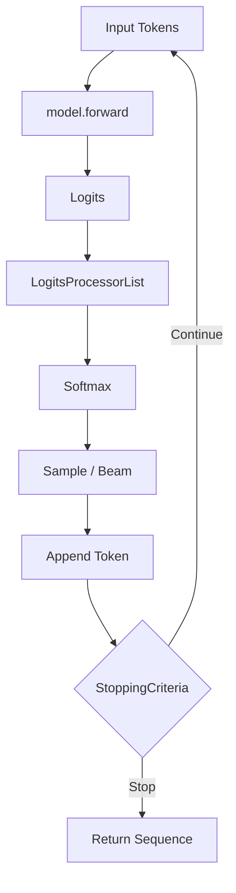
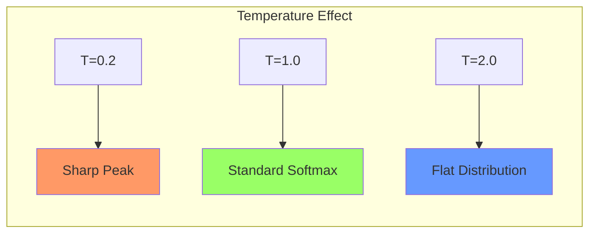
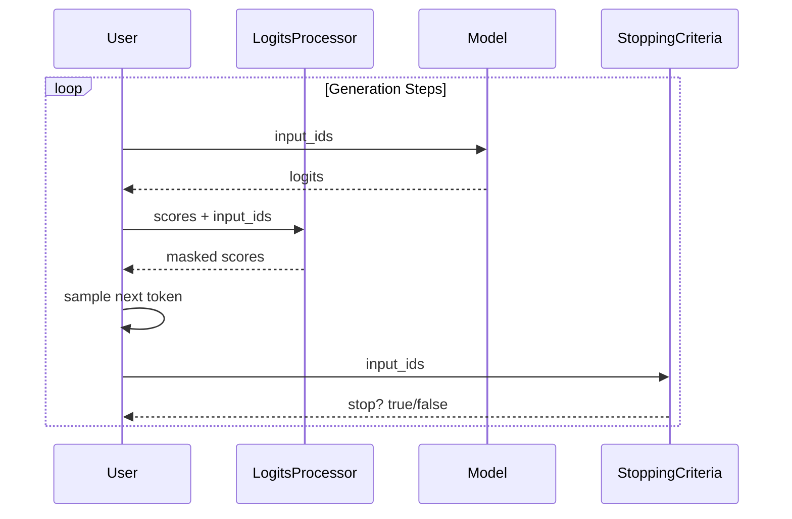
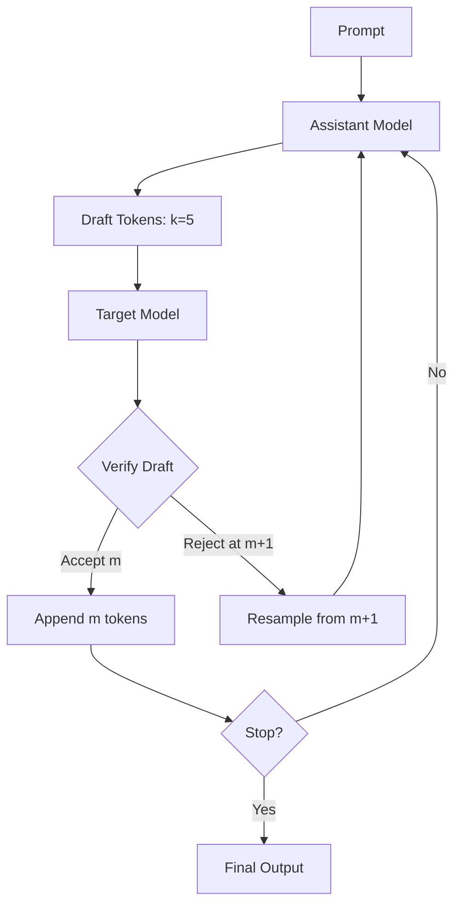

# 🏷️ Generation, Decoding, and Structured Output

## 🎯 Learning Objectives

- Understand the autoregressive loop inside `model.generate()` and how it wraps the forward pass.
- Configure `GenerationConfig` parameters (temperature, top_k, top_p, repetition_penalty) with theoretical justification.
- Implement custom `LogitsProcessor`, `LogitsWarper`, and `StoppingCriteria` for fine-grained inference control.
- Apply beam search, constrained decoding, and structured output techniques for production use cases.

## Introduction

Training teaches a model the distribution of language; generation samples from that distribution to produce coherent text. The gap between a trained model and a useful product is bridged by decoding strategies. Greedy decoding often produces repetitive, generic output, while naive random sampling yields incoherent gibberish. Modern systems balance diversity and quality through temperature scaling, nucleus sampling, and constrained beam search.

This note demystifies `model.generate()`, the Swiss Army knife of text generation in `transformers`. We trace how a single token prediction expands into a full sequence, how `GenerationConfig` shapes the probability distribution at each step, and how custom processors enforce hard constraints like JSON schemas or banned phrases. These techniques are essential for building reliable agents and APIs, and they connect directly to inference optimization in [[06 - Large Language Models/13 - vLLM Deep Dive|vLLM Deep Dive]] and structured API design in [[10 - FastAPI|FastAPI]].

---

## Module 1: Generation Internals and Decoding Strategies

### 1.1 Theoretical Foundation 🧠

Autoregressive generation treats text as a Markov chain with long-range dependencies. At each timestep `t`, the model outputs a probability distribution `P(x_t | x_{<t})` over the vocabulary. The decoder's job is to select `x_t` from this distribution according to a strategy that maximizes some objective—typically fluency, diversity, or task-specific correctness.

**Greedy decoding** selects `argmax P(x_t)` at every step. It is deterministic and fast but prone to loops ("the the the") and locally optimal but globally poor sequences. **Beam search** maintains `k` partial hypotheses at each step, expanding all `k * V` candidates and pruning back to `k`. This approximates maximum-likelihood decoding but can still produce bland, high-probability text because it optimizes for the most "average" sequence.

**Sampling-based methods** introduce randomness. Temperature scaling divides logits by `T` before softmax: `T < 1` sharpens the distribution (more conservative), while `T > 1` flattens it (more creative). **Top-k sampling** restricts the candidate pool to the `k` most likely tokens, preventing bizarre low-probability choices. **Top-p (nucleus) sampling** dynamically chooses the smallest set of tokens whose cumulative probability exceeds `p`, adapting the candidate pool to the model's confidence at each step.

### 1.2 Mental Model 📐

```text
Input: "The future of AI is"
          │
          ▼
┌─────────────────────────────────────────┐
│  Forward Pass                           │
│  → Logits vector shape: [1, V]          │
└─────────────────┬───────────────────────┘
                  │
                  ▼
┌─────────────────────────────────────────┐
│  LogitsProcessorList                    │
│  - RepetitionPenaltyProcessor           │
│  - TemperatureScaler (divide by T)      │
│  - TopPLogitsWarper (mask out nucleus)  │
└─────────────────┬───────────────────────┘
                  │
                  ▼
┌─────────────────────────────────────────┐
│  Softmax → Probability Distribution     │
└─────────────────┬───────────────────────┘
                  │
                  ▼
┌─────────────────────────────────────────┐
│  Sampling (multinomial) or Argmax       │
│  → Next token ID                        │
└─────────────────┬───────────────────────┘
                  │
                  ▼
┌─────────────────────────────────────────┐
│  StoppingCriteria?                      │
│  - EOS reached?  → Return sequence      │
│  - Max length?   → Return sequence      │
│  - Custom?       → Evaluate and stop    │
└─────────────────────────────────────────┘
```

### 1.3 Syntax and Semantics 📝

```python
from transformers import AutoModelForCausalLM, AutoTokenizer, GenerationConfig
import torch

model = AutoModelForCausalLM.from_pretrained("gpt2")
tokenizer = AutoTokenizer.from_pretrained("gpt2")

# WHY: GenerationConfig centralizes all decoding hyperparameters.
# It can be loaded from the Hub or constructed programmatically.
gen_config = GenerationConfig(
    max_new_tokens=50,           # WHY: Hard limit to prevent infinite generation
    do_sample=True,              # WHY: False = greedy; True = sampling-based
    temperature=0.8,             # WHY: T<1 boosts high-prob tokens for coherence
    top_k=50,                    # WHY: Filter to 50 most likely candidates
    top_p=0.95,                  # WHY: Nucleus sampling adapts pool dynamically
    repetition_penalty=1.2,      # WHY: Divide logits of already-seen tokens
    eos_token_id=tokenizer.eos_token_id,
    pad_token_id=tokenizer.eos_token_id  # WHY: GPT-2 lacks pad; reuse EOS
)

inputs = tokenizer("The future of AI is", return_tensors="pt")

# WHY: generate() runs the autoregressive loop, calling model.forward() repeatedly.
# It handles KV-cache optimization internally for speed.
outputs = model.generate(
    **inputs,
    generation_config=gen_config
)
print(tokenizer.decode(outputs[0], skip_special_tokens=True))

# WHY: Manual generation loop for educational clarity (Trainer uses this internally).
past_key_values = None
input_ids = inputs["input_ids"]
for _ in range(20):
    out = model(input_ids, past_key_values=past_key_values, use_cache=True)
    logits = out.logits[:, -1, :]       # WHY: Only the last timestep predicts next token
    past_key_values = out.past_key_values  # WHY: Cache avoids recomputing attention for prefix
    probs = torch.softmax(logits / 0.8, dim=-1)
    next_token = torch.multinomial(probs, num_samples=1)
    input_ids = torch.cat([input_ids, next_token], dim=-1)
```

### 1.4 Visual Representation 🖼️






### 1.5 Application in ML/AI Systems 🤖

**Real case: Perplexity.ai** uses a hybrid decoding stack: nucleus sampling (`top_p=0.9`, `temperature=0.7`) for general queries, but switches to greedy decoding with `repetition_penalty` for fact-retrieval prompts where hallucination must be minimized. Their serving layer dynamically selects the `GenerationConfig` based on prompt intent classification.

| ML Use Case | This Concept | Impact |
|-------------|-------------|--------|
| Creative writing | `temperature=1.2`, `top_p=0.95` | Diverse, stylistic outputs. |
| Code generation | `temperature=0.2`, `top_k=10` | Deterministic, syntactically valid code. |
| Chatbots | `repetition_penalty=1.1` + `top_p` | Natural turn-taking without loops. |
| Fact extraction | Greedy + high repetition penalty | Minimizes hallucinated entities. |

### 1.6 Common Pitfalls ⚠️

⚠️ **Temperature and top_k/top_p interaction**: Setting `temperature=2.0` while also using `top_k=1` is contradictory—you flatten the distribution then immediately discard everything except the argmax. This silently disables sampling benefits.

💡 **Mnemonic**: "**TEMP** controls **SHAPE**; **TOP** controls **POOL**. Tune them together, not against each other."

⚠️ **KV-cache and attention mask mismatch**: When using `past_key_values`, the attention mask must be extended by one token each step. Forgetting to cat the mask causes position embedding misalignment and gibberish output in long sequences.

💡 **Tip**: Prefer `model.generate()` over manual loops; it handles KV-cache, attention masks, and special tokens correctly.

### 1.7 Knowledge Check ❓

1. Explain why greedy decoding can enter infinite repetition loops and how `repetition_penalty` mitigates this mathematically.
2. You want high diversity for brainstorming but zero diversity for a SQL query generator. Write two `GenerationConfig` snippets and justify each parameter.
3. In the manual generation loop, what happens if you omit `use_cache=True` on a 4096-token sequence? Quantify the computational overhead.

---

## Module 2: Structured Output and Advanced Generation

### 2.1 Theoretical Foundation 🧠

Unconstrained generation is insufficient for production systems that must emit valid JSON, SQL, or domain-specific languages. **Structured generation** forces the decoder to respect a grammar or schema at every timestep. The naive approach—generate freely then validate—is brittle because a single syntax error invalidates the entire output. Instead, we constrain the probability distribution so that invalid tokens receive zero probability.

Two mechanisms enable this in `transformers`. First, **constrained beam search** (`force_words_ids`) biases the search toward sequences containing required phrases. Second, **custom `LogitsProcessor` subclasses** filter the vocabulary at each step based on the partial output and an external grammar. For example, a JSON logits processor tracks whether the model is inside a string literal, a number, or a key position, and masks out tokens that would break the syntax.

**Speculative decoding** (`assistant_model` in `transformers`) accelerates inference by using a smaller, faster "draft" model to predict multiple tokens ahead. The large target model verifies the draft tokens in a single forward pass. Tokens that match are accepted; the first mismatch is corrected, and the process repeats. This yields speedups of 1.5-3x without changing the output distribution, because verification ensures equivalence to the target model's greedy or sampled output.

### 2.2 Mental Model 📐

```text
Standard Generation          Constrained Generation
          │                            │
          ▼                            ▼
┌─────────────────┐          ┌──────────────────────┐
│  All tokens     │          │  Grammar State       │
│  allowed        │          │  Machine (e.g., JSON │
│                 │          │  parser state)       │
└────────┬────────┘          └──────────┬───────────┘
         │                              │
         ▼                              ▼
┌─────────────────┐          ┌──────────────────────┐
│  Sample next    │          │  Valid next tokens   │
│  token          │          │  for this state      │
└─────────────────┘          └──────────┬───────────┘
                                        │
                                        ▼
                              ┌──────────────────────┐
                              │  Mask invalid logits │
                              │  to -inf             │
                              └──────────────────────┘

Speculative Decoding
┌─────────────┐      draft k tokens      ┌─────────────┐
│ Small Model │  ──────────────────────> │ Large Model │
│  (fast)     │                          │  (slow)     │
└─────────────┘                          └─────────────┘
       │                                        │
       │  <───── verify all k in parallel <─────┤
       │         accept m, reject 1             │
       │         (m <= k)                       │
       └────────────────────────────────────────┘
```

### 2.3 Syntax and Semantics 📝

```python
from transformers import (
    AutoModelForCausalLM,
    AutoTokenizer,
    LogitsProcessorList,
    LogitsProcessor,
    StoppingCriteria,
    StoppingCriteriaList
)
import torch

# WHY: Custom LogitsProcessor enforces structure by setting invalid logits to -inf.
class JSONLogitsProcessor(LogitsProcessor):
    def __init__(self, tokenizer):
        self.tokenizer = tokenizer
        self.open_braces = 0

    def __call__(self, input_ids, scores):
        # WHY: This is a simplified example. A real processor tracks parser state.
        last_tokens = input_ids[0, -1:]
        decoded = self.tokenizer.decode(last_tokens)
        if decoded.strip().endswith("{"):
            self.open_braces += 1
        elif decoded.strip().endswith("}"):
            self.open_braces -= 1

        # WHY: If braces are balanced and we are at max length, force EOS.
        if self.open_braces == 0:
            # In a real system, use a grammar-based mask
            pass
        return scores

# WHY: StoppingCriteria stops generation beyond standard EOS.
class MaxNewlineCriteria(StoppingCriteria):
    def __init__(self, max_newlines=3):
        self.max_newlines = max_newlines

    def __call__(self, input_ids, scores, **kwargs):
        # WHY: Stop after generating N newlines for bullet-list tasks.
        text = tokenizer.decode(input_ids[0])
        return text.count("\n") >= self.max_newlines

model = AutoModelForCausalLM.from_pretrained("gpt2")
tokenizer = AutoTokenizer.from_pretrained("gpt2")

inputs = tokenizer("List:\n", return_tensors="pt")

processor_list = LogitsProcessorList([JSONLogitsProcessor(tokenizer)])
stop_list = StoppingCriteriaList([MaxNewlineCriteria(max_newlines=3)])

outputs = model.generate(
    **inputs,
    max_new_tokens=50,
    logits_processor=processor_list,
    stopping_criteria=stop_list,
    do_sample=True,
    temperature=0.7
)

# WHY: Constrained beam search forces inclusion of specific token sequences.
force_words = [[tokenizer.encode("artificial intelligence", add_special_tokens=False)]]
outputs_forced = model.generate(
    **inputs,
    num_beams=4,
    force_words_ids=force_words,
    max_new_tokens=30
)

# WHY: Speculative decoding with an assistant model.
assistant = AutoModelForCausalLM.from_pretrained("gpt2", num_layers=6)  # Smaller variant
outputs_spec = model.generate(
    **inputs,
    assistant_model=assistant,
    max_new_tokens=50
)
```

### 2.4 Visual Representation 🖼️






### 2.5 Application in ML/AI Systems 🤖

**Real case: Outlines.dev** (a structured generation library built on `transformers`) uses regex-compiled finite state machines as `LogitsProcessor` objects to enforce JSON schemas. When generating API responses, the processor masks out any token that would violate the schema, ensuring 100% syntactic validity without post-hoc parsing or retry loops.

| ML Use Case | This Concept | Impact |
|-------------|-------------|--------|
| API response generation | JSON LogitsProcessor | Zero invalid JSON responses in production. |
| SQL generation | Grammar-constrained beam search | Prevents injection and syntax errors. |
| Speculative serving | `assistant_model` | 2x throughput in latency-sensitive chat services. |
| Structured extraction | `force_words_ids` | Guarantees required entities appear in output. |

### 2.6 Common Pitfalls ⚠️

⚠️ **Overly aggressive masking**: A `LogitsProcessor` that masks too many tokens can drive the model into a dead end where no valid token has non-zero probability. The generation loop will then emit `<unk>` or hang.

💡 **Mnemonic**: "**MASK** with care; a **BLANK** wall stops all **THOUGHT**."

⚠️ **Assistant model distribution mismatch**: If the small assistant model's distribution diverges significantly from the target model, speculative decoding rejects draft tokens early, yielding minimal speedup. The assistant should be a distilled variant of the same model family.

💡 **Tip**: Limit speculative batches to 3-5 tokens; larger drafts have diminishing acceptance rates.

### 2.7 Knowledge Check ❓

1. Design a `LogitsProcessor` that bans a specific list of phrases (e.g., toxic words) by checking if any banned phrase would be formed by appending each candidate token to the existing sequence. What is the computational complexity with vocabulary size `V` and ban list length `B`?
2. Explain why speculative decoding with `assistant_model` does not alter the output distribution compared to running the target model alone.
3. You need to generate a JSON object with exactly three keys: `name`, `age`, and `city`. Outline the state machine your `LogitsProcessor` must track across timesteps.

---

## 📦 Compression Code

```python
"""
Production generation script with structured output helpers,
speculative decoding, and constrained beam search.
"""
from transformers import (
    AutoModelForCausalLM,
    AutoTokenizer,
    LogitsProcessorList,
    LogitsProcessor,
    StoppingCriteriaList,
    StoppingCriteria
)
import torch

MODEL = "gpt2"
model = AutoModelForCausalLM.from_pretrained(MODEL)
tokenizer = AutoTokenizer.from_pretrained(MODEL)

class RepetitionPenaltyLogitsProcessor(LogitsProcessor):
    """Simple custom processor: penalize recently seen tokens."""
    def __init__(self, penalty=1.2, window=50):
        self.penalty = penalty
        self.window = window

    def __call__(self, input_ids, scores):
        for seq in input_ids:
            recent = set(seq[-self.window:].tolist())
            for idx in recent:
                scores[0, idx] /= self.penalty
        return scores

class LengthStopCriteria(StoppingCriteria):
    def __init__(self, max_tokens):
        self.max_tokens = max_tokens

    def __call__(self, input_ids, scores, **kwargs):
        return input_ids.shape[-1] >= self.max_tokens

inputs = tokenizer("In the year 2050, AI will", return_tensors="pt")

logits_proc = LogitsProcessorList([RepetitionPenaltyLogitsProcessor(penalty=1.15)])
stop_criteria = StoppingCriteriaList([LengthStopCriteria(max_tokens=60)])

# Standard sampling
outputs = model.generate(
    **inputs,
    max_new_tokens=60,
    do_sample=True,
    temperature=0.8,
    top_p=0.92,
    logits_processor=logits_proc,
    stopping_criteria=stop_criteria,
    pad_token_id=tokenizer.eos_token_id
)
print(tokenizer.decode(outputs[0], skip_special_tokens=True))

# Constrained beam search example
force_phrase = [tokenizer.encode("transform the world", add_special_tokens=False)]
outputs_beam = model.generate(
    **inputs,
    num_beams=5,
    force_words_ids=force_phrase,
    max_new_tokens=40,
    pad_token_id=tokenizer.eos_token_id
)
print(tokenizer.decode(outputs_beam[0], skip_special_tokens=True))
```

## 🎯 Documented Project

**Description**: Build a "Structured Inference Gateway" that exposes an HTTP API (using [[10 - FastAPI|FastAPI]]) for text generation with pluggable constraints: JSON schema, SQL grammar, banned phrases, and speculative decoding.

**Functional Requirements**:
- Accept a generation request with `prompt`, `decoding_config` (temperature, top_p, etc.), and `constraint_type`.
- Support constraint types: `none`, `json_schema`, `sql_grammar`, `ban_list`, `force_phrases`.
- If `json_schema` is provided, compile it into a `LogitsProcessor` that enforces valid JSON token-by-token.
- If `use_speculative` is true, load a configured `assistant_model` and route through speculative decoding.
- Return generated text, tokens used, and latency metrics.
- Integrate with [[09 - MLOps y Produccion|MLOps]] monitoring for per-constraint accuracy and hallucination rates.

**Main Components**:
- `GatewayAPI`: FastAPI routes for `/generate`, `/health`, and `/metrics`.
- `ConstraintCompiler`: Converts JSON schemas / regexes / ban lists into `LogitsProcessor` objects.
- `SpeculativeEngine`: Manages target + assistant model pairs and draft verification.
- `MetricsExporter`: Prometheus-compatible latency and token-throughput counters.

**Success Metrics**:
- 100% syntactic validity for `json_schema` and `sql_grammar` constraints.
- Speculative decoding yields >= 1.5x throughput versus standard decoding.
- P99 latency < 200ms for 50-token outputs on a single A100.

## 🎯 Key Takeaways

- `model.generate()` is an autoregressive loop that applies `LogitsProcessorList`, samples, and checks `StoppingCriteria` at every step.
- Temperature, top_k, and top_p are not independent: they jointly shape the sampling distribution.
- `repetition_penalty` is a simple but effective heuristic to break degenerate repetition loops.
- Custom `LogitsProcessor` subclasses enable hard constraints (grammar, schema, bans) at the token level.
- `force_words_ids` provides constrained beam search for guaranteed phrase inclusion.
- Speculative decoding (`assistant_model`) speeds up inference by verifying draft tokens without altering the output distribution.
- Structured generation is preferable to generate-then-validate because it prevents invalid outputs rather than discarding them.

## References

- Hugging Face Generation Docs: [https://huggingface.co/docs/transformers/main_classes/text_generation](https://huggingface.co/docs/transformers/main_classes/text_generation)
- Holtzman et al., "The Curious Case of Neural Text Degeneration", ICLR 2020.
- Leviathan et al., "Fast Inference from Transformers via Speculative Decoding", ICML 2023.
- Related Vault: [[03 - Trainer, TrainingArguments, and Distributed Training]]
- Related Vault: [[06 - Large Language Models/13 - vLLM Deep Dive|vLLM Deep Dive]]
- Related Vault: [[10 - FastAPI]]
