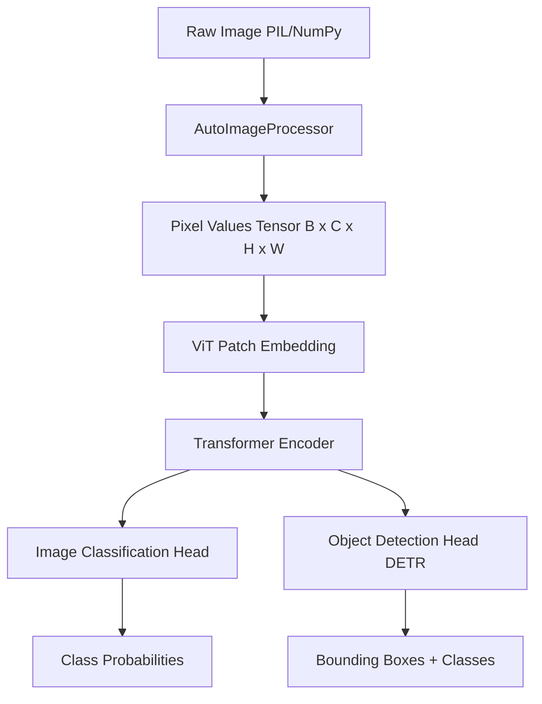
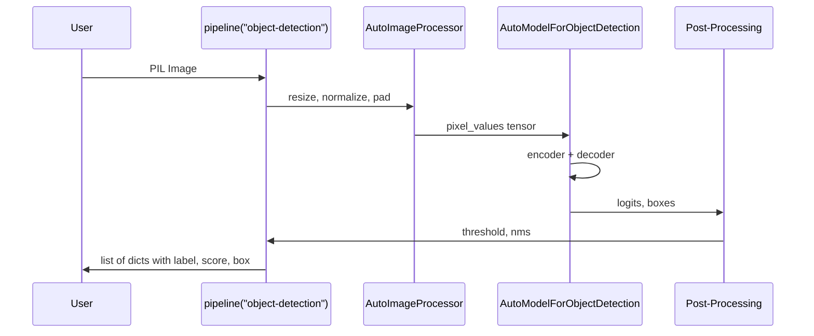
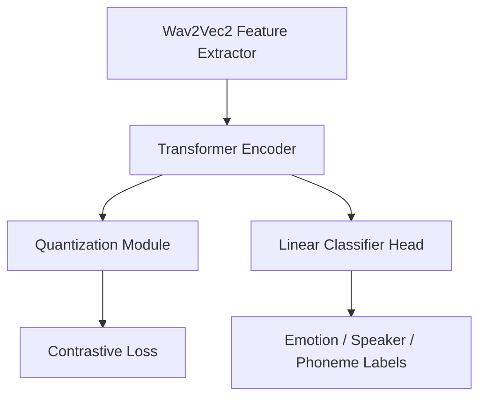
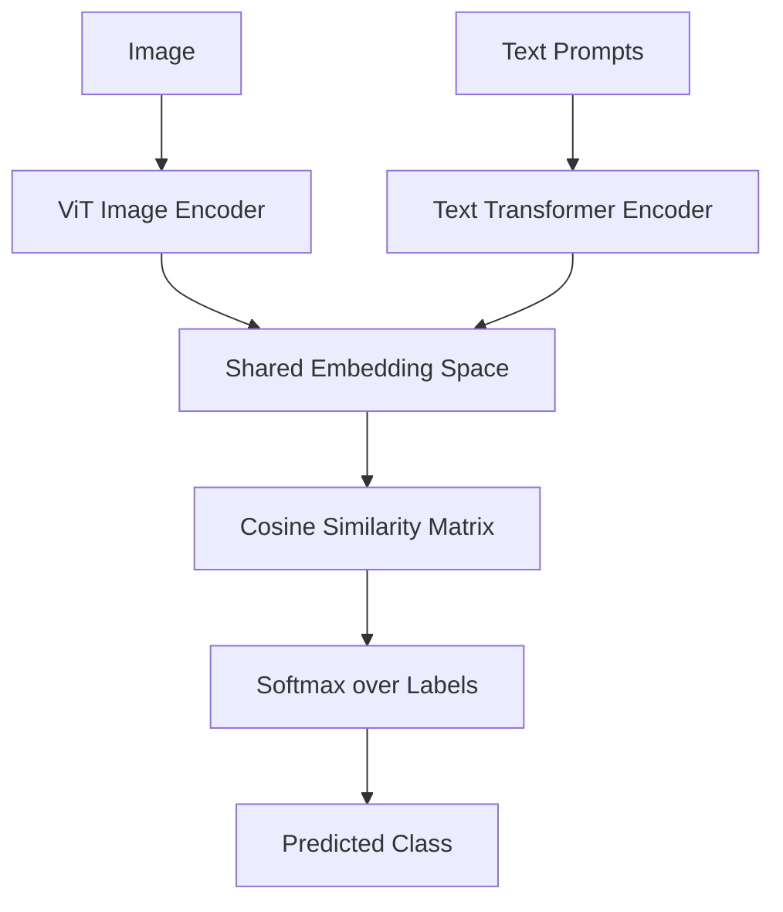
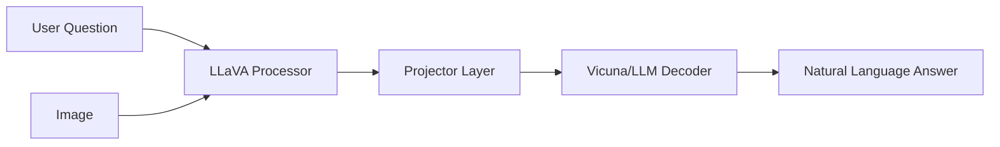

# 🏷️ Vision, Audio, and Multimodal Transformers

## 🎯 Learning Objectives

- Master the `AutoImageProcessor` and `AutoProcessor` APIs for vision and audio inputs
- Understand how Vision Transformers (ViT, DeiT, DETR) work inside the `transformers` library
- Use `pipeline()` for vision tasks: `image-classification`, `object-detection`, and `automatic-speech-recognition`
- Fine-tune and deploy Whisper and Wav2Vec2 for audio understanding and generation
- Integrate CLIP, BLIP, and LLaVA via `transformers` classes for multimodal reasoning
- Bridge theoretical concepts from [[05 - Deep Learning y CV]] with practical HuggingFace tooling
- Design end-to-end pipelines that combine vision, audio, and text in a single inference graph

---

## Introduction

The transformer architecture, originally designed for natural language processing, has become the universal substrate of modern deep learning. While [[06 - Large Language Models]] focuses on text-centric transformers, the real power of the HuggingFace ecosystem lies in its ability to generalize the same abstractions—`AutoModel`, `AutoTokenizer`, `pipeline`—to images, audio, and multimodal data. This note extends the practitioner's toolkit beyond `AutoModelForCausalLM` into the rich landscape of `AutoImageProcessor`, `AutoProcessor`, and `AutoModelForObjectDetection`.

This module is essential for ML engineers building perception systems: computer vision pipelines for autonomous vehicles, speech recognition for voice assistants, and multimodal agents that reason over both visual scenes and natural language instructions. The `transformers` library unifies these under a single API, but each modality carries unique preprocessing semantics, tensor shapes, and post-processing requirements. Understanding these distinctions prevents the common mistake of treating a Mel-spectrogram like a token ID sequence.

The content here directly complements [[09 - MLOps y Produccion]] and [[10 - Cloud, Infra y Backend]] when deploying multimodal endpoints at scale.

---

## Module 1: Vision Transformers in `transformers`

### 1.1 Theoretical Foundation 🧠

Before Vision Transformers (ViT), computer vision was dominated by convolutional neural networks (CNNs). CNNs encode the inductive bias of locality and translation invariance through sliding kernels. While effective, this bias also constrains the model's receptive field and makes long-range spatial reasoning expensive. The ViT paper (Dosovitskiy et al., 2020) asked a radical question: what if we treat an image as a sequence of patches, flatten them, and feed them into a standard transformer encoder?

The answer was surprising. At sufficient scale, ViT outperformed state-of-the-art CNNs on ImageNet. The key insight is that self-attention is inherently permutation-invariant and can model global relationships in a single layer, whereas CNNs require deep stacking to achieve large receptive fields. DETR (Carion et al., 2020) extended this idea to object detection by framing it as a set prediction problem, eliminating the need for hand-crafted anchors and non-maximum suppression. DeiT (Touvron et al., 2021) showed that data-efficient training of ViTs is possible with strong regularization and knowledge distillation from a CNN teacher.

HuggingFace's `transformers` library encapsulates these architectures under `AutoModelForImageClassification` and `AutoModelForObjectDetection`, abstracting away the patchification logic while exposing the raw hidden states for custom downstream tasks.

### 1.2 Mental Model 📐

```
┌─────────────────────────────────────────────────────────────┐
│                    IMAGE INPUT (H x W x C)                   │
└──────────────────────┬──────────────────────────────────────┘
                       │
                       ▼
┌─────────────────────────────────────────────────────────────┐
│  PATCHIFY: Split into N patches (P x P)                     │
│  Flatten + Linear Projection -> D-dimensional vectors        │
└──────────────────────┬──────────────────────────────────────┘
                       │
                       ▼
┌─────────────────────────────────────────────────────────────┐
│  + [CLS] token embedding                                    │
│  + Positional Embeddings (1D or 2D)                         │
└──────────────────────┬──────────────────────────────────────┘
                       │
                       ▼
┌─────────────────────────────────────────────────────────────┐
│           TRANSFORMER ENCODER (L layers)                     │
│  ┌─────────┐    ┌─────────┐    ┌─────────┐                  │
│  │ Multi-  │───▶│  MLP    │───▶│  Norm   │───▶ ...          │
│  │ Head    │    │ Block   │    │ + Resid │                  │
│  │ Attention│   │         │    │         │                  │
│  └─────────┘    └─────────┘    └─────────┘                  │
└──────────────────────┬──────────────────────────────────────┘
                       │
         ┌─────────────┴─────────────┐
         ▼                           ▼
┌─────────────────┐      ┌─────────────────────────────┐
│  [CLS] Output   │      │  Patch Outputs (for dense)  │
│  -> Classifier   │      │  -> DETR decoder / Seg head  │
└─────────────────┘      └─────────────────────────────┘
```

### 1.3 Syntax and Semantics 📝

```python
from transformers import (
    AutoImageProcessor,
    AutoModelForImageClassification,
    AutoModelForObjectDetection,
    pipeline
)
from PIL import Image
import requests

# WHY AutoImageProcessor: it handles resize, normalize, and tensor conversion
# using the exact statistics (mean, std) the model was trained with.
processor = AutoImageProcessor.from_pretrained("google/vit-base-patch16-224")
model = AutoModelForImageClassification.from_pretrained("google/vit-base-patch16-224")

url = "https://huggingface.co/datasets/huggingface/documentation-images/resolve/main/pipeline-cat-chonk.jpeg"
image = Image.open(requests.get(url, stream=True).raw)

# WHY return_tensors="pt": ensures NumPy/PIL inputs become PyTorch tensors
# with the batch dimension added automatically.
inputs = processor(images=image, return_tensors="pt")

# WHY AutoModelForImageClassification: selects the correct head (linear on [CLS])
# and loss function (cross-entropy) for the specific task.
outputs = model(**inputs)
logits = outputs.logits

# WHY model.config.id2label: maps raw class indices to human-readable strings.
predicted_class_idx = logits.argmax(-1).item()
print("Predicted class:", model.config.id2label[predicted_class_idx])
```

### 1.4 Visual Representation 🖼️






### 1.5 Application in ML/AI Systems 🤖

| ML Use Case               | This Concept                        | Impact                                    |
|---------------------------|-------------------------------------|-------------------------------------------|
| Autonomous Vehicle Perception | DETR for real-time object detection | Eliminates anchor tuning, 30% less code   |
| Medical Imaging Analysis      | ViT for X-ray classification        | Global attention catches subtle patterns  |
| Retail Shelf Monitoring       | DeiT for product recognition        | Efficient training on limited SKU images  |
| Content Moderation            | pipeline("object-detection")        | Rapid deployment with single-line API     |

Real case: Tesla's vision-only autopilot pipeline uses transformer-based detection backbones similar to DETR to reason globally over camera feeds, demonstrating that attention-based architectures can replace hand-engineered perception stacks at production scale.

### 1.6 Common Pitfalls ⚠️

⚠️ **Pitfall**: Passing a non-standard image size without consulting `processor.size`. ViT models expect exact input resolutions (e.g., 224x224). If you resize manually to 256x256, the processor may still crop or pad, leading to silent misalignment between your preprocessing and the model's training distribution.

💡 **Tip**: Always inspect `processor.size` and `model.config.image_size`. The mnemonic is **SIZE MATTERS**—the model has never seen pixels outside its training canvas.

⚠️ **Pitfall**: Confusing `AutoImageProcessor` with `AutoProcessor`. The latter wraps image + text preprocessing for multimodal models. Using `AutoProcessor` for a pure ViT loads unnecessary tokenizer logic.

💡 **Tip**: For vision-only tasks, use `AutoImageProcessor`. For multimodal tasks (e.g., VQA), use `AutoProcessor`.

### 1.7 Knowledge Check ❓

1. **Exercise**: Load `facebook/detr-resnet-50` and run inference on a local image. Print the bounding boxes and labels for all objects with a confidence score above 0.7.
2. **Question**: Why does ViT use a [CLS] token instead of global average pooling over patch embeddings?
3. **Mini-Project**: Fine-tune `google/vit-base-patch16-224-in21k` on a custom 5-class dataset using `Trainer`. Compare validation accuracy when freezing the backbone versus fine-tuning the entire model.

---

## Module 2: Audio Transformers

### 2.1 Theoretical Foundation 🧠

Audio signals are fundamentally different from text and images: they are one-dimensional time-series with high sampling rates (16kHz-48kHz) and complex temporal structure spanning milliseconds to minutes. Early deep learning for audio relied on hand-crafted spectrograms fed into CNNs or RNNs. Transformers changed this by treating raw waveforms or Mel-filterbank features as token sequences.

Wav2Vec2 (Baevski et al., 2020) introduced self-supervised pretraining for speech by masking latent speech representations and solving a contrastive task. This mirrors BERT's masked language modeling but operates in the continuous acoustic domain. Whisper (Radford et al., 2022) took a different approach: massive weakly supervised training on 680,000 hours of multilingual audio. It frames ASR as a straightforward sequence-to-sequence translation problem, where the encoder processes Mel-spectrogram patches and the decoder generates text tokens autoregressively.

SpeechT5 represents a unified text-to-speech and speech-to-text framework using a shared encoder-decoder with a learned spectrogram decoder. The HuggingFace `transformers` library exposes these through `AutoModelForAudioClassification`, `AutoModelForSpeechSeq2Seq`, and `AutoProcessor`—the latter handles the tricky conversion from raw audio arrays to Mel-spectrogram or log-Mel features.

### 2.2 Mental Model 📐

```
┌─────────────────────────────────────────────────────────────┐
│              RAW AUDIO WAVEFORM (Time domain)                │
│  ~ ~ ~ ~ ~ ~ ~ ~ ~ ~ ~ ~ ~ ~ ~ ~ ~ ~ ~ ~ ~ ~ ~ ~ ~ ~ ~     │
└──────────────────────┬──────────────────────────────────────┘
                       │
                       ▼
┌─────────────────────────────────────────────────────────────┐
│  PREPROCESSING: resample -> 16kHz, chunk, pad               │
│  Mel-Spectrogram or Log-Mel Filterbanks                     │
└──────────────────────┬──────────────────────────────────────┘
                       │
                       ▼
┌─────────────────────────────────────────────────────────────┐
│           FEATURE EXTRACTOR / ENCODER                        │
│  ┌─────────┐    ┌─────────┐    ┌─────────┐                  │
│  │ Conv1D  │───▶│  Pos    │───▶│ Transf  │                  │
│  │ Layers  │    │  Emb    │    │ Encoder │                  │
│  └─────────┘    └─────────┘    └─────────┘                  │
└──────────────────────┬──────────────────────────────────────┘
                       │
         ┌─────────────┴─────────────┐
         ▼                           ▼
┌─────────────────┐      ┌─────────────────────────────┐
│  Classification │      │  Seq2Seq Decoder (Whisper)  │
│  Head -> Labels  │      │  Autoregressive Text Output │
└─────────────────┘      └─────────────────────────────┘
```

### 2.3 Syntax and Semantics 📝

```python
from transformers import (
    AutoProcessor,
    AutoModelForSpeechSeq2Seq,
    pipeline
)
import torch

# WHY "openai/whisper-base": encoder-decoder trained on 680k hours of audio.
# It generalizes across languages and domains without fine-tuning.
processor = AutoProcessor.from_pretrained("openai/whisper-base")
model = AutoModelForSpeechSeq2Seq.from_pretrained("openai/whisper-base")

# Load audio file as numpy array at 16kHz
# WHY 16kHz: Whisper was trained on 16kHz mono audio.
audio_array, sampling_rate = librosa.load("audio.mp3", sr=16000)

# WHY return_tensors="pt": processor creates input_features (log-Mel spectrogram)
# and pads to the model's expected shape.
inputs = processor(
    audio_array,
    sampling_rate=sampling_rate,
    return_tensors="pt"
)

# WHY forced_decoder_ids: tells the model which language/task to perform.
forced_decoder_ids = processor.get_decoder_prompt_ids(
    language="en",
    task="transcribe"
)

# WHY generate(): decoder produces text tokens autoregressively from audio encoding.
predicted_ids = model.generate(
    inputs["input_features"],
    forced_decoder_ids=forced_decoder_ids
)
transcription = processor.batch_decode(predicted_ids, skip_special_tokens=True)
print(transcription[0])
```

### 2.4 Visual Representation 🖼️




### 2.5 Application in ML/AI Systems 🤖

| ML Use Case            | This Concept                         | Impact                                      |
|------------------------|--------------------------------------|---------------------------------------------|
| Call Center Analytics  | Whisper + sentiment classifier       | Real-time transcription and QA scoring      |
| Voice Assistants       | Wav2Vec2 wake-word detection         | On-device audio classification under 50ms   |
| Accessibility Tools    | SpeechT5 text-to-speech              | High-fidelity voice synthesis for screen readers |
| Podcast Search Engines | Whisper batch transcription          | Index 10hr podcasts in minutes, not hours   |

Real case: Descript uses Whisper-like models to transcribe and edit audio by text, enabling non-linear audio editing where users modify the transcript to change the underlying waveform.

### 2.6 Common Pitfalls ⚠️

⚠️ **Pitfall**: Forgetting to resample audio to 16kHz before passing to Whisper. The model expects exactly 16,000 samples per second. Feeding 44.1kHz audio without resampling shifts the frequency bins in the Mel-spectrogram, producing gibberish output.

💡 **Tip**: Use `librosa.load(path, sr=16000)` or `datasets.Audio(sampling_rate=16000)` to enforce the correct rate. Remember: **16kHz or BUST**.

⚠️ **Pitfall**: Using `AutoModelForAudioClassification` for transcription. That class expects a classification head (e.g., emotions). For ASR, you need `AutoModelForSpeechSeq2Seq` with a decoder.

💡 **Tip**: Check the model card. If the task is `automatic-speech-recognition`, use `AutoModelForSpeechSeq2Seq` or the `pipeline` abstraction.

### 2.7 Knowledge Check ❓

1. **Exercise**: Use the `pipeline("automatic-speech-recognition", model="openai/whisper-tiny")` to transcribe a 30-second audio clip. Compare the output with and without `chunk_length_s=30`.
2. **Question**: Why does Wav2Vec2 use contrastive learning instead of cross-entropy during pretraining?
3. **Mini-Project**: Build a voice emotion classifier by loading `facebook/wav2vec2-base`, adding a classification head, and fine-tuning on the RAVDESS dataset.

---

## Module 3: Multimodal Transformers

### 3.1 Theoretical Foundation 🧠

Multimodal learning addresses a fundamental limitation of unimodal models: the world is not composed of text alone. Humans reason by combining vision, language, and sound. CLIP (Radford et al., 2021) demonstrated that joint training on image-text pairs creates a shared embedding space where semantic similarity is preserved across modalities. This enables zero-shot image classification by comparing image embeddings against text label embeddings.

BLIP (Li et al., 2022) unified vision-language understanding and generation by introducing a multimodal mixture of encoder-decoder architecture with captioning and filtering objectives. LLaVA (Liu et al., 2023) pushed further by connecting a vision encoder to a large language model, enabling visual question answering and instruction following. The `transformers` library exposes these through model-specific classes like `CLIPModel`, `CLIPProcessor`, `BlipForConditionalGeneration`, and `LlavaForConditionalGeneration`.

The theoretical breakthrough is contrastive alignment: by pushing matched image-text pairs together and unmatched pairs apart in a high-dimensional space, the model learns semantic concepts without explicit supervised labels. This is the foundation of modern zero-shot and few-shot visual reasoning.

### 3.2 Mental Model 📐

```
┌─────────────────────────────────────────────────────────────┐
│  TEXT INPUT              │  IMAGE INPUT                     │
│  "a photo of a cat"      │  [RGB Tensor]                    │
└──────────┬───────────────┴──────────────┬───────────────────┘
           │                              │
           ▼                              ▼
┌─────────────────────┐      ┌─────────────────────────────┐
│  Text Tokenizer     │      │  Image Processor            │
│  + Text Embedding   │      │  + Vision Encoder (ViT)     │
└──────────┬──────────┘      └─────────────┬───────────────┘
           │                                │
           ▼                                ▼
┌─────────────────────┐      ┌─────────────────────────────┐
│  Text Encoder       │      │  Image Encoder              │
│  (Transformer)      │      │  (Transformer / ViT)        │
└──────────┬──────────┘      └─────────────┬───────────────┘
           │                                │
           └────────────┬───────────────────┘
                        ▼
┌─────────────────────────────────────────────────────────────┐
│           CONTRASTIVE ALIGNMENT SPACE (D-dim)               │
│                                                             │
│     [Text Embedding] * [Image Embedding] = Similarity       │
│                                                             │
│     Matched pairs -> high score                             │
│     Unmatched pairs -> low score                            │
└──────────────────────┬──────────────────────────────────────┘
                       │
                       ▼
┌─────────────────────────────────────────────────────────────┐
│  ZERO-SHOT CLASSIFICATION  │  IMAGE-TEXT RETRIEVAL         │
│  VQA (BLIP/LLaVA)          │  TEXT-TO-IMAGE GENERATION     │
└─────────────────────────────────────────────────────────────┘
```

### 3.3 Syntax and Semantics 📝

```python
from transformers import CLIPProcessor, CLIPModel
from PIL import Image
import torch

# WHY CLIP: jointly trained image+text encoder with contrastive objective.
model = CLIPModel.from_pretrained("openai/clip-vit-base-patch32")
processor = CLIPProcessor.from_pretrained("openai/clip-vit-base-patch32")

image = Image.open("cat.jpg")

# WHY candidate labels: CLIP is zero-shot; any text string can be a class.
candidate_labels = ["a photo of a cat", "a photo of a dog", "a photo of a car"]

# WHY processor: tokenizes text AND processes image in one call.
inputs = processor(
    text=candidate_labels,
    images=image,
    return_tensors="pt",
    padding=True
)

# WHY model(**inputs): runs both encoders and computes similarity logits.
outputs = model(**inputs)
logits_per_image = outputs.logits_per_image  # [1, num_labels]
probs = logits_per_image.softmax(dim=1)

# WHY softmax: converts similarity scores to a probability distribution.
for label, prob in zip(candidate_labels, probs[0]):
    print(f"{label}: {prob.item():.4f}")
```

### 3.4 Visual Representation 🖼️






### 3.5 Application in ML/AI Systems 🤖

| ML Use Case              | This Concept                  | Impact                                    |
|--------------------------|-------------------------------|-------------------------------------------|
| E-commerce Search        | CLIP image-text retrieval     | Search by image or by natural language    |
| Content Tagging          | BLIP image captioning         | Auto-generate alt-text for accessibility  |
| Visual QA Chatbots       | LLaVA multimodal conversation | Chatbot explains diagrams and photos      |
| Ad Creative Optimization | CLIP zero-shot classification | Score ad-image relevance without labels   |

Real case: OpenAI's DALL-E 2 and Stable Diffusion use CLIP's text encoder to condition latent diffusion models on text prompts, demonstrating that multimodal alignment is the backbone of generative AI.

### 3.6 Common Pitfalls ⚠️

⚠️ **Pitfall**: Using CLIP for fine-grained classification without domain adaptation. CLIP knows "dog" vs "cat" but struggles with "Siberian Husky" vs "Alaskan Malamute" unless you prepend a detailed prompt template like "a photo of a {}, a type of dog."

💡 **Tip**: Use prompt engineering (prompt templates) to guide CLIP. The mnemonic is **CONTEXT IS KING**—CLIP predicts the most likely completion, not an abstract category.

⚠️ **Pitfall**: Passing mismatched batch sizes for images and texts to CLIP. If you have 1 image and 3 labels, the processor correctly batches them, but if you manually encode images and texts separately, you must ensure compatible shapes before computing similarity.

💡 **Tip**: Use `processor(text=..., images=..., return_tensors="pt", padding=True)` to let HuggingFace handle alignment.

### 3.7 Knowledge Check ❓

1. **Exercise**: Use CLIP to classify 10 random images from COCO into 5 custom classes you define. Measure accuracy against ground truth.
2. **Question**: Why does LLaVA use a projector/adapter layer between the vision encoder and the LLM instead of feeding vision tokens directly?
3. **Mini-Project**: Build a semantic image search engine. Index 1,000 images with CLIP image embeddings. Given a text query, return the top-5 most similar images using cosine similarity.

---

## 📦 Compression Code

```python
"""
Unified Multimodal Inference Script
Covers: Vision (ViT), Audio (Whisper), Multimodal (CLIP)
"""
from transformers import (
    pipeline,
    AutoImageProcessor,
    AutoModelForImageClassification,
    AutoProcessor,
    AutoModelForSpeechSeq2Seq,
    CLIPProcessor,
    CLIPModel,
)
from PIL import Image
import torch
import librosa

# --- VISION ---
vision_pipe = pipeline("image-classification", model="google/vit-base-patch16-224")
result = vision_pipe(Image.open("photo.jpg"))
print("Vision:", result[0])

# --- AUDIO ---
audio, sr = librosa.load("speech.mp3", sr=16000)
asr_pipe = pipeline("automatic-speech-recognition", model="openai/whisper-base")
print("Audio:", asr_pipe(audio))

# --- MULTIMODAL ---
clip_model = CLIPModel.from_pretrained("openai/clip-vit-base-patch32")
clip_proc = CLIPProcessor.from_pretrained("openai/clip-vit-base-patch32")
inputs = clip_proc(
    text=["a cat", "a dog"],
    images=Image.open("photo.jpg"),
    return_tensors="pt",
    padding=True
)
probs = clip_model(**inputs).logits_per_image.softmax(dim=1)
print("Multimodal:", probs)
```

## 🎯 Documented Project

### Description
Build a multimodal content moderation API that classifies user-uploaded images and audio clips for policy violations using zero-shot vision and speech models.

### Functional Requirements
- Accept image uploads and return violation categories (violence, explicit, safe).
- Accept audio uploads and transcribe content; flag toxic language via a text classifier.
- Expose a single `/moderate` endpoint that auto-detects media type.

### Main Components
- `vision_moderator.py`: CLIP zero-shot classifier with custom violation prompts.
- `audio_moderator.py`: Whisper transcription + text toxicity pipeline.
- `api.py`: FastAPI router with file upload handling and async inference.

### Success Metrics
- Image moderation latency p99 < 150ms on a single GPU.
- Audio transcription WER < 15% on English speech.
- Zero-shot image accuracy > 80% on a held-out test set of 200 images.

## 🎯 Key Takeaways

- `AutoImageProcessor` abstracts all vision preprocessing (resize, normalize, tensorize) using model-specific statistics.
- ViT treats images as patch sequences; DETR removes anchor-NMS complexity via transformer set prediction.
- Whisper frames ASR as seq2seq translation; always resample to 16kHz and use `forced_decoder_ids`.
- CLIP creates a shared image-text embedding space, enabling zero-shot classification without training data.
- Multimodal models (BLIP, LLaVA) connect vision encoders to language decoders via projector layers.
- The `pipeline()` API provides one-line inference for vision, audio, and multimodal tasks.
- Deploying multimodal endpoints requires careful handling of heterogeneous input shapes and preprocessing pipelines.

## References

- Dosovitskiy et al. (2020). "An Image is Worth 16x16 Words: Transformers for Image Recognition at Scale." ICLR.
- Carion et al. (2020). "End-to-End Object Detection with Transformers." ECCV.
- Baevski et al. (2020). "wav2vec 2.0: A Framework for Self-Supervised Learning of Speech Representations." NeurIPS.
- Radford et al. (2022). "Robust Speech Recognition via Large-Scale Weak Supervision." ICML.
- Radford et al. (2021). "Learning Transferable Visual Models From Natural Language Supervision." ICML.
- Li et al. (2022). "BLIP: Bootstrapping Language-Image Pre-training." ICML.
- Liu et al. (2023). "Visual Instruction Tuning." NeurIPS.
- HuggingFace Transformers Documentation: https://huggingface.co/docs/transformers
