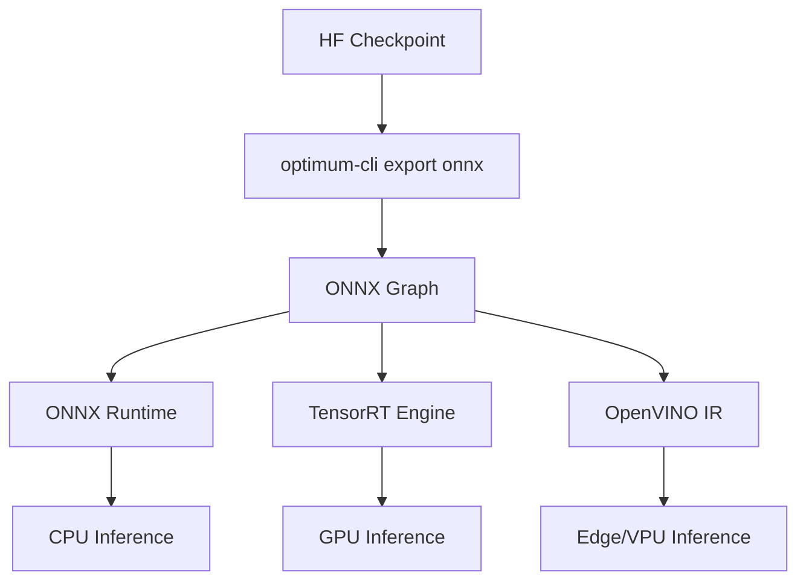
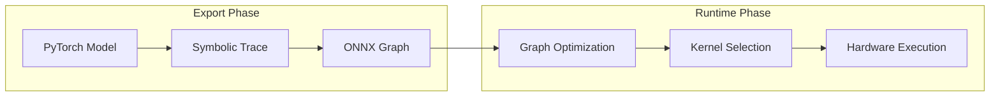
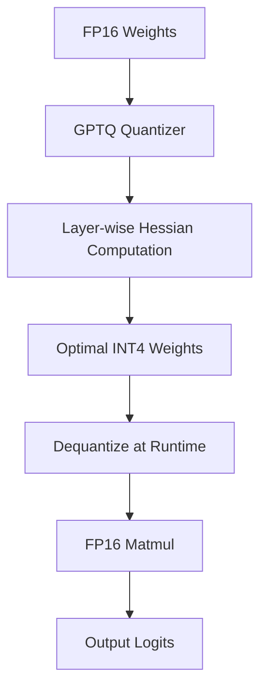
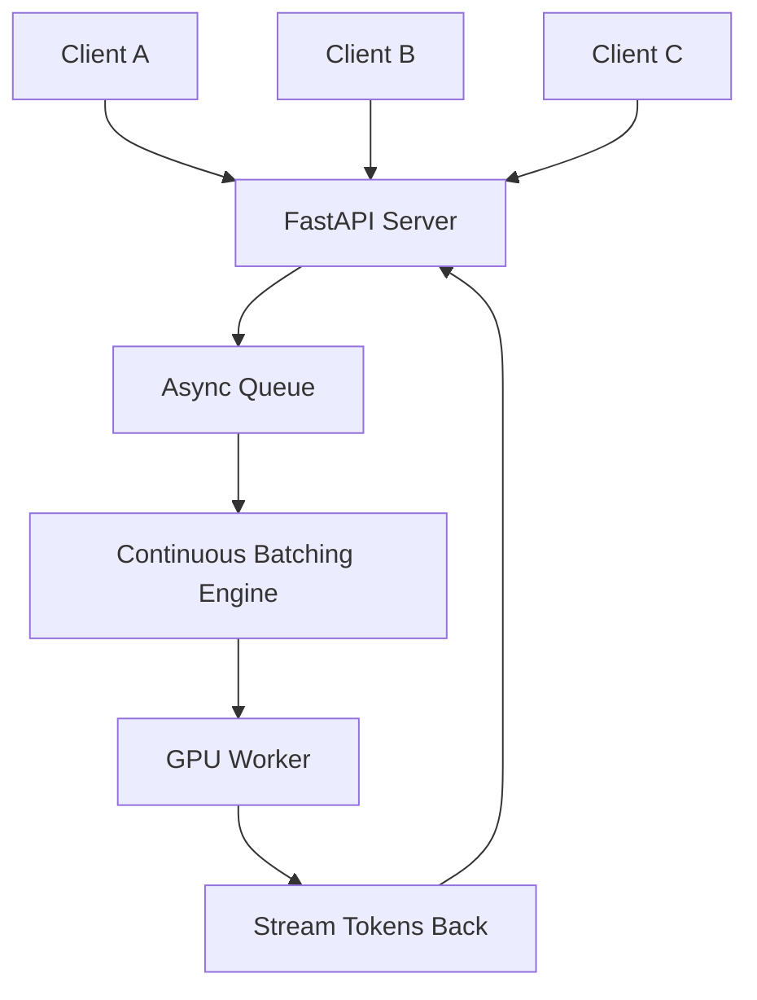
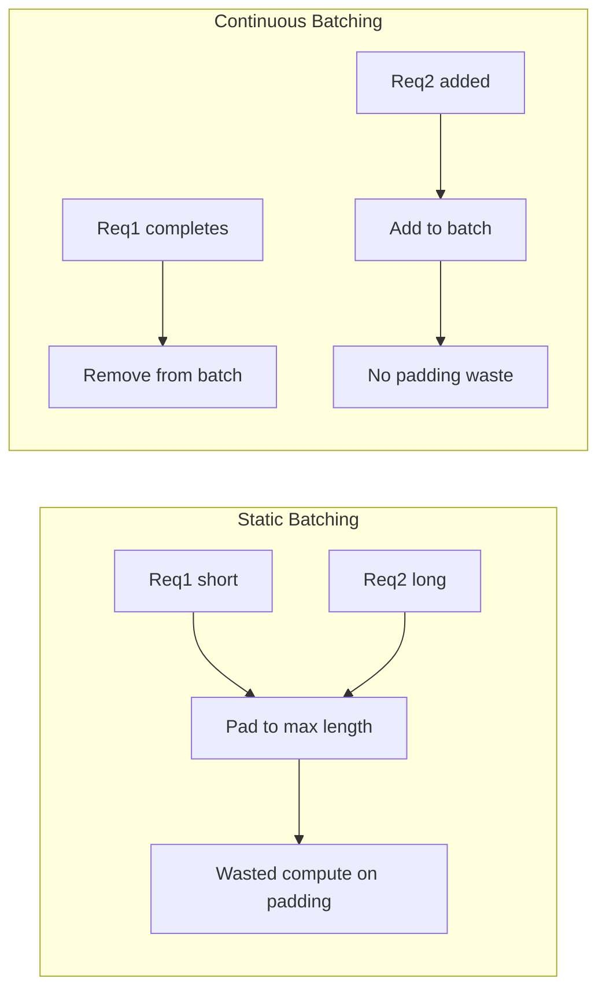

# 🏷️ Export, Optimization, and Production Serving

## 🎯 Learning Objectives

- Export HuggingFace models to ONNX, TensorRT, and OpenVINO using the `optimum` library
- Apply `torch.compile` to `transformers` models for graph-level acceleration
- Implement quantization strategies: GPTQ, AWQ, and dynamic quantization with `optimum`
- Understand `text-generation-inference` (TGI) architecture and when to self-host it
- Design FastAPI serving patterns with batching, async queues, and streaming
- Compare HF Inference API, TGI, Triton, and vLLM for production workloads
- Build Docker-based deployment pipelines for transformer models at scale

---

## Introduction

Training a state-of-the-art transformer is only half the battle. The other half is getting it to serve predictions with millisecond latency under bursty traffic, on hardware that your finance team actually approved. This note bridges the gap between the research checkpoint and the production endpoint. While [[06 - Large Language Models]] teaches you to fine-tune, and [[09 - MLOps y Produccion]] covers the CI/CD lifecycle, this module focuses on the mechanical transformation of a PyTorch `nn.Module` into a production artifact.

The HuggingFace ecosystem provides a dedicated optimization library, `optimum`, that acts as a compiler and runtime adapter for transformers. It supports ONNX for framework interoperability, TensorRT for NVIDIA GPU inference, and OpenVINO for Intel hardware. Beyond export, `torch.compile` (PyTorch 2.0+) offers graph compilation with minimal code changes. For serving, `text-generation-inference` (TGI) wraps `transformers` with a Rust-based HTTP server, continuous batching, and flash attention kernels.

Understanding these tools is non-negotiable for ML engineers in [[10 - Cloud, Infra y Backend]] roles. A model that takes 2 seconds per request on a naive `model.generate()` loop can often be pushed below 200ms with the right combination of quantization, compilation, and serving infrastructure.

---

## Module 1: Model Export with `optimum`

### 1.1 Theoretical Foundation 🧠

Deep learning frameworks like PyTorch and TensorFlow are designed for research flexibility, not production efficiency. Their dynamic computation graphs, Python overhead, and eager execution modes introduce latency that is unacceptable for high-throughput APIs. Export formats like ONNX (Open Neural Network Exchange) solve this by representing the model as a static computation graph in a framework-agnostic format. Once in ONNX, the model can be optimized by runtime-specific compilers: TensorRT fuses layers and selects CUDA kernels for NVIDIA GPUs; OpenVINO applies layer fusion and quantization for Intel CPUs and VPUs.

The core insight is separation of concerns: the mathematical graph (ONNX) is distinct from the execution engine (TensorRT/OpenVINO). This decoupling allows the same exported model to run on an AWS g5 instance (TensorRT) and an edge Intel NUC (OpenVINO) without retraining. `optimum` automates this pipeline by tracing the `transformers` model with dummy inputs, handling dynamic axes (batch size, sequence length), and invoking the correct exporter for the target backend.

Quantization further reduces memory and compute by converting weights from FP32 to INT8 or lower. GPTQ (Frantar et al., 2022) quantizes weights layer-by-layer using approximate second-order information, while AWQ (Lin et al., 2023) protects salient weight channels during quantization to preserve accuracy.

### 1.2 Mental Model 📐

```
┌─────────────────────────────────────────────────────────────┐
│         HUGGINGFACE CHECKPOINT (PyTorch weights)             │
│              config.json + pytorch_model.bin                 │
└──────────────────────┬──────────────────────────────────────┘
                       │
                       ▼
┌─────────────────────────────────────────────────────────────┐
│              OPTIMUM EXPORT PIPELINE                         │
│  ┌─────────────┐  ┌─────────────┐  ┌─────────────┐         │
│  │   ONNX      │  │  TensorRT   │  │  OpenVINO   │         │
│  │  Export     │  │   Export    │  │   Export    │         │
│  │  (default)  │  │  (GPU opt)  │  │  (CPU opt)  │         │
│  └──────┬──────┘  └──────┬──────┘  └──────┬──────┘         │
└─────────┼────────────────┼────────────────┼────────────────┘
          │                │                │
          ▼                ▼                ▼
┌─────────────────┐ ┌─────────────────┐ ┌─────────────────┐
│  model.onnx     │ │  model.trt      │ │  model.xml      │
│  + tokenizer    │ │  + engine       │ │  + tokenizer    │
│    (ONNX Runtime)│ │    (TRT Runtime)│ │    (OV Runtime) │
└─────────────────┘ └─────────────────┘ └─────────────────┘
```

### 1.3 Syntax and Semantics 📝

```bash
# WHY optimum-cli: command-line interface avoids boilerplate Python scripts.
# It reads config.json, infers shapes, and writes the exported graph.

# Export a BERT model to ONNX for CPU inference
optimum-cli export onnx \
    --model bert-base-uncased \
    --task text-classification \
    ./bert_onnx/

# WHY --task: tells the exporter which model head to trace
# (e.g., causal-lm, seq2seq-lm, image-classification).

# Export with optimization for a specific accelerator
optimum-cli export onnx \
    --model google/vit-base-patch16-224 \
    --task image-classification \
    --optimize O2 \
    ./vit_onnx/
```

```python
from optimum.onnxruntime import ORTModelForSequenceClassification
from transformers import AutoTokenizer

# WHY ORTModelForSequenceClassification: wraps ONNX Runtime
# and exposes the exact same API as the PyTorch model.
model = ORTModelForSequenceClassification.from_pretrained("./bert_onnx/")
tokenizer = AutoTokenizer.from_pretrained("./bert_onnx/")

inputs = tokenizer("Hello world", return_tensors="pt")
outputs = model(**inputs)
print(outputs.logits.argmax(-1))
```

### 1.4 Visual Representation 🖼️






### 1.5 Application in ML/AI Systems 🤖

| ML Use Case           | This Concept                    | Impact                                        |
|-----------------------|---------------------------------|-----------------------------------------------|
| SaaS NLP API          | ONNX export + ONNX Runtime      | 3x throughput on CPU vs eager PyTorch         |
| Autonomous Driving    | TensorRT export from DETR       | 10ms inference on Jetson AGX Xavier           |
| Edge IoT Devices      | OpenVINO INT8 quantization      | Run BERT on Raspberry Pi at 500ms/token       |
| Multi-cloud Deploy    | ONNX as intermediate format     | Same artifact runs on AWS, Azure, and GCP     |

Real case: Microsoft Azure's Cognitive Services export internal transformer models to ONNX Runtime to serve billions of NLP requests daily across global regions with sub-100ms latency.

### 1.6 Common Pitfalls ⚠️

⚠️ **Pitfall**: Exporting a model with dynamic sequence lengths but forgetting to specify `dynamic_axes`. Without dynamic axes, the ONNX graph hardcodes the sequence length from the dummy input, causing runtime errors for longer or shorter inputs.

💡 **Tip**: `optimum-cli` automatically infers dynamic axes for common tasks. If writing custom export code, explicitly declare `dynamic_axes={"input_ids": {0: "batch", 1: "sequence"}}`.

⚠️ **Pitfall**: Expecting the same accuracy after aggressive INT8 quantization. Small models (< 100M parameters) or tasks requiring fine-grained outputs (regression) can degrade significantly.

💡 **Tip**: Always evaluate the exported model on a validation set before deploying. The mnemonic is **VERIFY BEFORE FLY**.

### 1.7 Knowledge Check ❓

1. **Exercise**: Export `distilbert-base-uncased-finetuned-sst-2-english` to ONNX and benchmark 1,000 inferences against the PyTorch version. Report latency and memory usage.
2. **Question**: Why does TensorRT require a builder configuration with explicit batch size or dynamic shape profiles?
3. **Mini-Project**: Write a Python script that auto-detects the available hardware (CUDA vs CPU) and loads the appropriate `optimum` runtime (ORT vs TensorRT vs OpenVINO).

---

## Module 2: Quantization and `torch.compile`

### 2.1 Theoretical Foundation 🧠

Modern LLMs contain billions of FP16 parameters, requiring 2GB+ per billion parameters just for weights. Quantization reduces numerical precision—typically FP32 -> FP16 -> INT8 -> INT4—to shrink memory footprints and accelerate matrix multiplications on hardware with low-precision support. Dynamic quantization applies INT8 weights and FP32 activations at runtime, while static quantization calibrates activation scales on a representative dataset.

GPTQ (General-purpose Post-Training Quantization) treats quantization as an optimization problem: for each layer, it finds quantized weights that minimize the L2 error to the full-precision output. It uses approximate second-order information (the Hessian) to do this efficiently. AWQ (Activation-aware Weight Quantization) observes that a small subset of weight channels disproportionately affects activation magnitudes; by keeping these channels in higher precision, AWQ achieves better accuracy than uniform quantization at the same bit width.

`torch.compile` (PyTorch 2.0) takes a different approach. Instead of changing weights, it compiles the Python/PyTorch program into optimized C++ / Triton kernels using a graph compiler (TorchInductor). It fuses operations, eliminates redundant memory copies, and generates fused attention kernels (FlashAttention-2). The result is often a 1.5x-2x speedup with zero accuracy loss.

### 2.2 Mental Model 📐

```
┌─────────────────────────────────────────────────────────────┐
│              FULL-PRECISION MODEL (FP16)                     │
│  Weights: 2 bytes/param    Activations: 2 bytes/element      │
└──────────────────────┬──────────────────────────────────────┘
                       │
         ┌─────────────┼─────────────┐
         ▼             ▼             ▼
┌─────────────────┐ ┌─────────────────┐ ┌─────────────────┐
│  Dynamic Quant  │ │  GPTQ / AWQ     │ │  torch.compile  │
│  (INT8 weights) │ │  (INT4 weights) │ │  (Graph compile)│
│  No calibration │ │  Layer-wise opt │ │  Kernel fusion  │
└────────┬────────┘ └────────┬────────┘ └────────┬────────┘
         │                   │                   │
         ▼                   ▼                   ▼
┌─────────────────┐ ┌─────────────────┐ ┌─────────────────┐
│  4x smaller     │ │  8x smaller     │ │  Same size      │
│  2-3x faster    │ │  3-4x faster    │ │  1.5-2x faster  │
│  Slight loss    │ │  Moderate loss  │ │  Zero loss      │
└─────────────────┘ └─────────────────┘ └─────────────────┘
```

### 2.3 Syntax and Semantics 📝

```python
import torch
from transformers import AutoModelForCausalLM, AutoTokenizer

model_id = "meta-llama/Llama-2-7b-hf"

# WHY torch.compile: compiles the forward pass into optimized kernels.
# mode="reduce-overhead" is good for small batches; "max-autotune" for large.
model = AutoModelForCausalLM.from_pretrained(
    model_id,
    torch_dtype=torch.float16,
    device_map="auto"
)
model = torch.compile(model, mode="reduce-overhead")

tokenizer = AutoTokenizer.from_pretrained(model_id)
inputs = tokenizer("The future of AI is", return_tensors="pt").to("cuda")

# WHY generate(): still works transparently over compiled model.
outputs = model.generate(**inputs, max_new_tokens=50)
print(tokenizer.decode(outputs[0]))
```

```python
from optimum.gptq import GPTQQuantizer

# WHY GPTQ: quantizes to 4-bit with minimal perplexity increase.
# desc_act=False improves compatibility with some kernels.
quantizer = GPTQQuantizer(
    bits=4,
    dataset="c4",
    desc_act=False,
)

# WHY quantize(): performs layer-wise Hessian-based quantization.
# This requires a GPU and can take 30-60 minutes for a 7B model.
quantizer.quantize_model(model, tokenizer)
quantizer.save(model, "./llama-7b-gptq/")
```

### 2.4 Visual Representation 🖼️




### 2.5 Application in ML/AI Systems 🤖

| ML Use Case         | This Concept              | Impact                                   |
|---------------------|---------------------------|------------------------------------------|
| Consumer GPU LLM    | GPTQ 4-bit quantization   | Run 70B model on single 24GB GPU         |
| Real-time Chatbot   | torch.compile + FP16      | 1.8x throughput with no accuracy loss    |
| Mobile Deployment   | Dynamic INT8 quantization | 50% latency reduction on ARM CPUs        |
| Batch Inference     | AWQ + vLLM                | Serve 4x more requests per GPU           |

Real case: TheBloke's HuggingFace repository hosts thousands of GPTQ/AWQ quantized models, enabling the open-source community to run LLaMA-2-70B on consumer RTX 4090 GPUs with acceptable quality degradation.

### 2.6 Common Pitfalls ⚠️

⚠️ **Pitfall**: Applying `torch.compile` to a model and then modifying its weights or architecture afterward. The compiled graph is frozen; dynamic changes can cause graph breaks or silent incorrectness.

💡 **Tip**: Compile only after all training/loading/PEFT adaptation is complete. Remember: **COMPILE LAST**.

⚠️ **Pitfall**: Using GPTQ on a model that will be further fine-tuned with PEFT. Quantized weights are not differentiable in standard PyTorch autograd.

💡 **Tip**: Use QLoRA (quantized LoRA) if you need to fine-tune a 4-bit model. It keeps the base model frozen in INT4 while training LoRA adapters in FP16.

### 2.7 Knowledge Check ❓

1. **Exercise**: Benchmark `meta-llama/Llama-2-7b-hf` with and without `torch.compile(mode="reduce-overhead")`. Measure tokens/second for a batch of 10 prompts.
2. **Question**: Why does AWQ outperform uniform INT4 quantization on the same model size?
3. **Mini-Project**: Load a GPTQ-quantized 7B model from TheBloke's Hub and evaluate perplexity on WikiText-2. Compare against the FP16 baseline.

---

## Module 3: Production Serving Patterns

### 3.1 Theoretical Foundation 🧠

Serving a transformer in production involves more than calling `model.generate()`. Real-world APIs face bursty traffic, variable input lengths, and strict latency SLAs. Naive synchronous serving processes one request at a time, leaving GPU memory and compute underutilized during the prefill and generation phases. Production servers use three key techniques: batching, continuous batching, and asynchronous scheduling.

Batching groups multiple requests into a single forward pass to maximize GPU tensor core utilization. However, static batching is inefficient because requests with different sequence lengths pad to the longest, wasting compute. Continuous batching (also called in-flight batching) dynamically adds and removes requests from the GPU batch as sequences complete, eliminating the "tail latency" problem where one long sequence blocks the entire batch.

`text-generation-inference` (TGI) is HuggingFace's production server built in Rust. It wraps `transformers` with a Tokio-based async runtime, a Python tokenizer process, and custom CUDA kernels (FlashAttention, PagedAttention). vLLM extends this with PagedAttention, a memory management system inspired by virtual memory that eliminates memory fragmentation during decoding. Triton with TensorRT-LLM offers similar capabilities but requires manual model compilation.

### 3.2 Mental Model 📐

```
┌─────────────────────────────────────────────────────────────┐
│                     CLIENT REQUESTS                          │
│  Req A: "Hello"  Req B: "The capital of France"  Req C: ...│
└──────────────────────┬──────────────────────────────────────┘
                       │
                       ▼
┌─────────────────────────────────────────────────────────────┐
│              LOAD BALANCER / REVERSE PROXY                   │
│              (nginx / traefik / AWS ALB)                     │
└──────────────────────┬──────────────────────────────────────┘
                       │
                       ▼
┌─────────────────────────────────────────────────────────────┐
│              FASTAPI / TGI / VLLM SERVER                     │
│  ┌─────────────┐  ┌─────────────┐  ┌─────────────┐         │
│  │  Async      │  │  Continuous │  │  Token      │         │
│  │  Queue      │  │  Batching   │  │  Streaming  │         │
│  │  (tokio)    │  │  Engine     │  │  (SSE)      │         │
│  └──────┬──────┘  └──────┬──────┘  └──────┬──────┘         │
└─────────┼────────────────┼────────────────┼────────────────┘
          │                │                │
          └────────────────┴────────────────┘
                           │
                           ▼
┌─────────────────────────────────────────────────────────────┐
│              GPU WORKER (CUDA Kernels)                       │
│  ┌─────────────┐  ┌─────────────┐  ┌─────────────┐         │
│  │  Prefill    │  │  FlashAttn  │  │  PagedAttn  │         │
│  │  (encoder)  │  │  (fused)    │  │  (memory)   │         │
│  └─────────────┘  └─────────────┘  └─────────────┘         │
└─────────────────────────────────────────────────────────────┘
```

### 3.3 Syntax and Semantics 📝

```python
from fastapi import FastAPI
from transformers import pipeline
import asyncio
from typing import List

app = FastAPI()

# WHY pipeline: encapsulates tokenization, inference, and post-processing.
# device_map="auto" spreads layers across available GPUs.
generator = pipeline(
    "text-generation",
    model="meta-llama/Llama-2-7b-hf",
    torch_dtype="auto",
    device_map="auto"
)

@app.post("/generate")
async def generate(prompt: str, max_new_tokens: int = 50):
    # WHY run_in_executor: PyTorch is CPU-bound during tokenization
    # and GPU-bound during inference; running in a thread pool
    # prevents blocking the FastAPI event loop.
    loop = asyncio.get_event_loop()
    result = await loop.run_in_executor(
        None,
        lambda: generator(
            prompt,
            max_new_tokens=max_new_tokens,
            do_sample=True,
            temperature=0.7
        )
    )
    return {"generated_text": result[0]["generated_text"]}
```

```bash
# WHY text-generation-inference: Rust server with continuous batching.
# It exposes an OpenAI-compatible HTTP API.
docker run --gpus all \
    -p 8080:80 \
    -v $(pwd)/data:/data \
    ghcr.io/huggingface/text-generation-inference:latest \
    --model-id meta-llama/Llama-2-7b-hf \
    --quantize gptq \
    --max-batch-prefill-tokens 4096

# WHY --quantize gptq: loads a 4-bit model to fit on smaller GPUs.
# WHY --max-batch-prefill-tokens: limits memory used during the prefill phase.
```

### 3.4 Visual Representation 🖼️






### 3.5 Application in ML/AI Systems 🤖

| ML Use Case         | This Concept              | Impact                                      |
|---------------------|---------------------------|---------------------------------------------|
| Chatbot API         | TGI with GPTQ             | 500+ concurrent users on a single A100      |
| Batch Document Gen  | FastAPI + async queue     | Process 10k prompts overnight reliably      |
| Real-time Coding AI | vLLM + PagedAttention     | < 100ms time-to-first-token                 |
| Multi-model Gateway | Triton Inference Server   | Route text, vision, and audio to right GPU  |

Real case: Perplexity.ai uses vLLM with continuous batching to serve open-source LLMs to millions of users with sub-200ms latency, demonstrating that efficient serving infrastructure is as important as model quality.

### 3.6 Common Pitfalls ⚠️

⚠️ **Pitfall**: Running `model.generate()` directly inside a FastAPI endpoint without an executor or queue. This blocks the event loop, causing all concurrent requests to serialize behind the first one.

💡 **Tip**: Always use `asyncio.run_in_executor` or a dedicated inference worker process. The mnemonic is **NEVER BLOCK THE LOOP**.

⚠️ **Pitfall**: Underestimating GPU memory fragmentation in long-running servers. Each request allocates KV-cache tensors; without memory management, OOM crashes occur after hours of uptime.

💡 **Tip**: Use TGI or vLLM, which implement PagedAttention to manage KV-cache like virtual memory pages. If building custom, pre-allocate a fixed pool of buffers.

### 3.7 Knowledge Check ❓

1. **Exercise**: Deploy `meta-llama/Llama-2-7b-hf` with TGI in Docker. Send 50 concurrent requests using `curl` and measure p50/p99 latency.
2. **Question**: Why does continuous batching provide higher throughput than static batching for variable-length generation tasks?
3. **Mini-Project**: Build a FastAPI gateway that routes small models to CPU (ONNX Runtime) and large models to GPU (TGI) based on request payload size.

---

## 📦 Compression Code

```python
"""
Production Optimization and Serving Script
Covers: ONNX export, torch.compile, TGI Docker launch, FastAPI wrapper
"""
import subprocess
from fastapi import FastAPI
from transformers import pipeline
from optimum.onnxruntime import ORTModelForSequenceClassification
import torch
import asyncio

# 1. EXPORT TO ONNX
subprocess.run([
    "optimum-cli", "export", "onnx",
    "--model", "distilbert-base-uncased-finetuned-sst-2-english",
    "--task", "text-classification",
    "./onnx_model/"
])

# 2. LOAD OPTIMIZED MODEL
ort_model = ORTModelForSequenceClassification.from_pretrained("./onnx_model/")

# 3. TORCH.COMPILE FOR GENERATIVE MODEL
gen_model = pipeline("text-generation", model="gpt2", device_map="auto")
gen_model.model = torch.compile(gen_model.model, mode="reduce-overhead")

# 4. FASTAPI SERVING
app = FastAPI()

@app.post("/classify")
async def classify(text: str):
    loop = asyncio.get_event_loop()
    result = await loop.run_in_executor(None, lambda: ort_model(text))
    return {"label": result}

@app.post("/generate")
async def generate(prompt: str):
    loop = asyncio.get_event_loop()
    result = await loop.run_in_executor(
        None, lambda: gen_model(prompt, max_new_tokens=50)
    )
    return {"text": result[0]["generated_text"]}

# 5. TGI DOCKER (run externally)
# docker run --gpus all -p 8080:80 ghcr.io/huggingface/text-generation-inference:latest \
#     --model-id meta-llama/Llama-2-7b-hf --quantize gptq
```

## 🎯 Documented Project

### Description
Build an optimized LLM inference microservice that auto-selects the best runtime (ONNX for CPU, TGI for GPU) based on model size and query type.

### Functional Requirements
- Accept text generation and text classification requests.
- Route classification to ONNX Runtime on CPU for cost efficiency.
- Route generation to TGI on GPU for latency and throughput.
- Expose Prometheus metrics for latency, throughput, and queue depth.

### Main Components
- `router.py`: FastAPI app with routing logic based on model type.
- `onnx_worker.py`: ORTModel wrapper with dynamic batching.
- `tgi_client.py`: Async HTTP client to local TGI container.
- `docker-compose.yml`: TGI + FastAPI + Prometheus stack.

### Success Metrics
- Classification p99 latency < 50ms on CPU.
- Generation throughput > 50 tokens/sec on a single A10G GPU.
- Zero-downtime deployment via Docker rolling updates.

## 🎯 Key Takeaways

- `optimum-cli export onnx` converts HuggingFace checkpoints to framework-agnostic graphs for cross-platform deployment.
- TensorRT and OpenVINO are backend-specific optimizers that fuse layers and select hardware-appropriate kernels.
- GPTQ and AWQ enable 4-bit inference, shrinking model size by 4x with manageable accuracy loss.
- `torch.compile` accelerates PyTorch models via graph compilation without altering weights or architecture.
- TGI provides production-grade text generation with continuous batching, FlashAttention, and an OpenAI-compatible API.
- FastAPI + `asyncio.run_in_executor` is the minimum viable pattern for non-blocking Python inference servers.
- Always evaluate quantized/exported models on a validation set before production deployment.

## References

- HuggingFace Optimum Documentation: https://huggingface.co/docs/optimum
- PyTorch 2.0 torch.compile: https://pytorch.org/tutorials/intermediate/torch_compile_tutorial.html
- Frantar et al. (2022). "GPTQ: Accurate Post-Training Quantization for Generative Pre-trained Transformers." ICLR.
- Lin et al. (2023). "AWQ: Activation-aware Weight Quantization for LLM Compression and Acceleration." MLSys.
- TGI Repository: https://github.com/huggingface/text-generation-inference
- vLLM Paper: Kwon et al. (2023). "Efficient Memory Management for Large Language Model Serving with PagedAttention." SOSP.
- ONNX Runtime Documentation: https://onnxruntime.ai/
