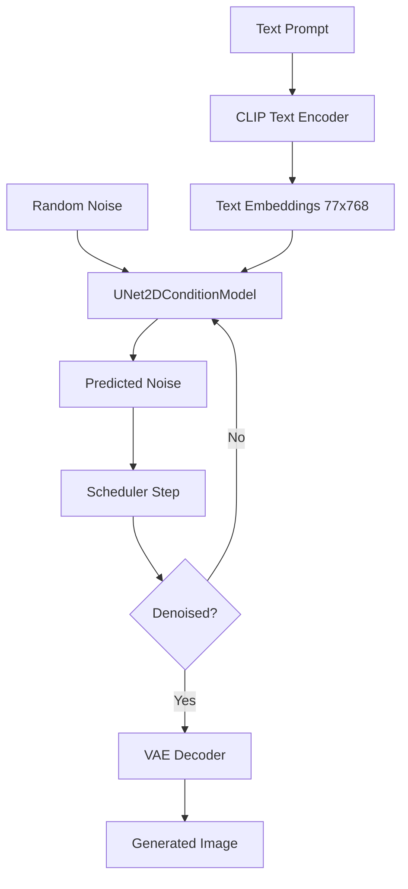
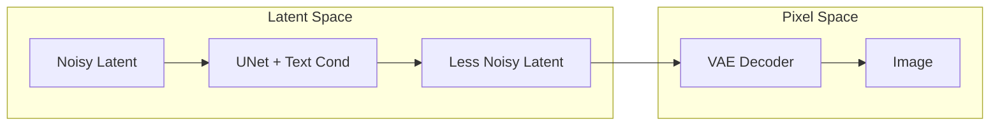
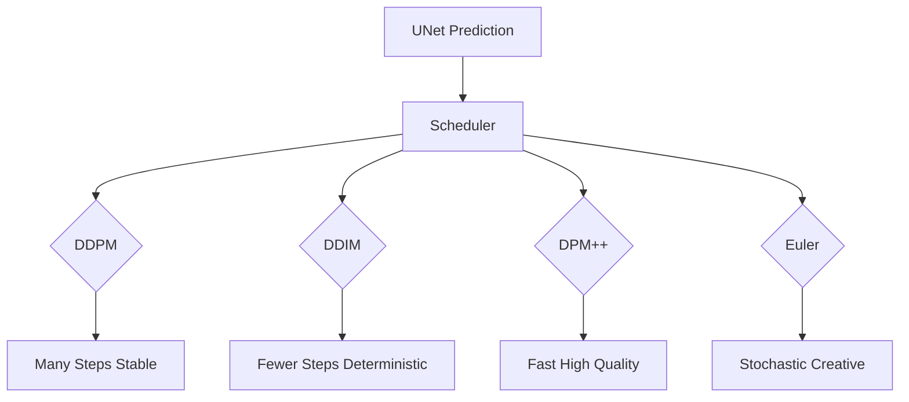
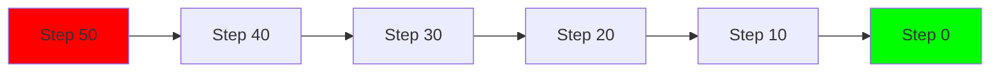
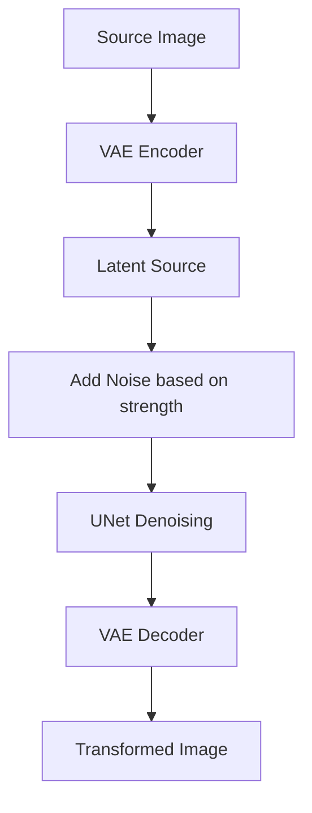
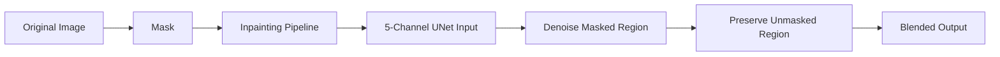

# 🏷️ Diffusers I - Stable Diffusion Fundamentals

## 🎯 Learning Objectives

- Understand the latent diffusion architecture: VAE, UNet, and CLIP text encoder
- Master the `diffusers` library core classes: `Pipeline`, `Scheduler`, `UNet2DConditionModel`
- Configure inference parameters: `guidance_scale`, `num_inference_steps`, `negative_prompt`
- Use different schedulers: DDPM, PNDM, DPM++ 2M Karras, Euler
- Run image-to-image translation and inpainting with specialized pipelines
- Connect diffusion theory to the practical `StableDiffusionPipeline` API
- Build a mental model of how noise is transformed into coherent images step-by-step

---

## Introduction

Generative AI has captured the world's imagination, and at the heart of this revolution lies latent diffusion. While [[06 - Large Language Models]] taught us to generate text token-by-token, diffusion models generate images pixel-by-pixel—or more precisely, latent-by-latent. Stable Diffusion, released by Stability AI in 2022, democratized high-quality image generation by running in latent space rather than pixel space, reducing memory requirements from impossible (A100-only) to accessible (consumer GPUs).

The `diffusers` library is HuggingFace's dedicated toolkit for diffusion models. It decouples the generation process into modular components: a pipeline orchestrates the loop, a scheduler defines the noise schedule, a UNet predicts noise, and a VAE compresses and decompresses images. This modularity allows researchers and engineers to swap schedulers, fine-tune UNets, and compose pipelines without rewriting the entire inference stack.

This note is foundational for [[08 - Diffusers II - Advanced Pipelines and ControlNet]], where we extend these basics with ControlNet conditioning, LoRA adaptation, and community pipelines. Understanding the fundamentals here is also essential for [[09 - MLOps y Produccion]] when deploying diffusion endpoints that must handle concurrent requests within strict latency budgets.

---

## Module 1: Stable Diffusion Architecture

### 1.1 Theoretical Foundation 🧠

Diffusion models learn to reverse a gradual noising process. Given a clean image x₀, we define a forward process that adds Gaussian noise over T timesteps, producing a sequence x₁, x₂, ..., x_T that approaches pure noise. The model's job is to learn the reverse process: given x_t and timestep t, predict the noise that was added. This is formulated as a denoising objective: the UNet is trained to predict the noise component ε conditioned on the text prompt.

Stable Diffusion's critical innovation is operating in latent space. Instead of diffusing over 512x512x3 pixel tensors (~786k values), it uses a Variational Autoencoder (VAE) to encode images into a 64x64x4 latent tensor (~16k values). The UNet operates on these compact latents, making training and inference feasible on 8GB GPUs. The text prompt is encoded by CLIP's text encoder into a context embedding that conditions the UNet via cross-attention layers. During inference, random Gaussian noise is iteratively denoised by the UNet, guided by the text embedding, and finally decoded back to pixel space by the VAE decoder.

The classifier-free guidance (CFG) technique is essential for prompt fidelity. During training, the UNet sees both text-conditioned and unconditioned (null prompt) examples. At inference, the predicted noise is extrapolated away from the unconditioned prediction and toward the conditioned prediction by a factor of `guidance_scale`. A scale of 7.5 is standard; higher values increase prompt adherence but reduce diversity.

### 1.2 Mental Model 📐

```
┌─────────────────────────────────────────────────────────────┐
│  TEXT PROMPT: "a photo of an astronaut riding a horse"      │
└──────────────────────┬──────────────────────────────────────┘
                       │
                       ▼
┌─────────────────────────────────────────────────────────────┐
│              CLIP TEXT ENCODER                               │
│         "astronaut" + "riding" + "horse" -> 77x768           │
└──────────────────────┬──────────────────────────────────────┘
                       │  text_embeddings
                       ▼
┌─────────────────────────────────────────────────────────────┐
│              RANDOM GAUSSIAN NOISE (latent)                  │
│              shape: 1 x 4 x 64 x 64                          │
└──────────────────────┬──────────────────────────────────────┘
                       │
         ┌─────────────┴─────────────┐
         │  FOR t = T down to 1      │
         ▼                           │
┌────────────────────────────────────┴──────────────────────┐
│  UNet2DConditionModel predicts noise in latent space      │
│  ┌─────────────────────────────────────────────────────┐  │
│  │  Cross-Attention: latent_q @ text_k^T -> attend     │  │
│  │  Residual blocks + down/up sampling                 │  │
│  │  Time embedding injected via sinusoidal encoding    │  │
│  └─────────────────────────────────────────────────────┘  │
│                      │ predicted_noise                      │
│                      ▼                                      │
│  Scheduler computes: x_{t-1} = f(x_t, noise_pred, t)      │
│                      (DDPM / Euler / DPM++ update rule)    │
└──────────────────────┬──────────────────────────────────────┘
                       │  (repeat T times)
                       ▼
┌─────────────────────────────────────────────────────────────┐
│              VAE DECODER                                     │
│         latent 64x64 -> pixel 512x512x3                     │
└──────────────────────┬──────────────────────────────────────┘
                       │
                       ▼
┌─────────────────────────────────────────────────────────────┐
│              GENERATED IMAGE                                 │
└─────────────────────────────────────────────────────────────┘
```

### 1.3 Syntax and Semantics 📝

```python
import torch
from diffusers import StableDiffusionPipeline

# WHY "runwayml/stable-diffusion-v1-5": the canonical v1.5 checkpoint.
# It contains: unet, vae, text_encoder, tokenizer, scheduler.
pipe = StableDiffusionPipeline.from_pretrained(
    "runwayml/stable-diffusion-v1-5",
    torch_dtype=torch.float16,
)
pipe = pipe.to("cuda")

# WHY guidance_scale=7.5: standard CFG strength.
# 1.0 = no guidance; 15+ = very strict but potentially over-saturated.
prompt = "a photo of an astronaut riding a horse, high quality, 8k"
negative_prompt = "blurry, low quality, deformed"

# WHY num_inference_steps=50: tradeoff between quality and speed.
# 20-30 is often sufficient with fast schedulers like DPM++.
image = pipe(
    prompt,
    negative_prompt=negative_prompt,
    num_inference_steps=50,
    guidance_scale=7.5,
    height=512,
    width=512,
    generator=torch.Generator("cuda").manual_seed(42)
).images[0]

image.save("astronaut.png")
```

### 1.4 Visual Representation 🖼️






### 1.5 Application in ML/AI Systems 🤖

| ML Use Case         | This Concept                  | Impact                                   |
|---------------------|-------------------------------|------------------------------------------|
| Marketing Creative  | Stable Diffusion text-to-image| Generate ad variations in seconds        |
| Game Asset Pipeline | Img2Img + Inpainting          | Rapid iteration on textures and concepts |
| Architectural Viz   | High-res diffusion + upscaler | Concept renders from text descriptions   |
| Fashion Design      | Prompt-conditioned generation | Explore styles without physical samples  |

Real case: Canva integrated Stable Diffusion into its design platform, allowing 100M+ users to generate images directly in the editor. They optimized inference with TensorRT and custom schedulers to serve generations under 2 seconds.

### 1.6 Common Pitfalls ⚠️

⚠️ **Pitfall**: Running Stable Diffusion on CPU without setting `torch_dtype=torch.float32`. FP16 on CPU is unsupported and will produce black images or NaNs.

💡 **Tip**: On CPU, always use FP32. On GPU, use FP16 for 2x speedup. The mnemonic is **GPU=FP16, CPU=FP32**.

⚠️ **Pitfall**: Setting `guidance_scale` too high (>15) without increasing `num_inference_steps`. The noise extrapolation can overshoot, producing artifacts or repetitive patterns.

💡 **Tip**: If you increase guidance, also increase steps. A balanced combo is `guidance_scale=7.5` with `num_inference_steps=50`.

### 1.7 Knowledge Check ❓

1. **Exercise**: Generate 4 images of the same prompt with different seeds. Compare how guidance_scale=2 vs guidance_scale=12 affects diversity and adherence.
2. **Question**: Why does Stable Diffusion use a VAE instead of diffusing directly in pixel space?
3. **Mini-Project**: Profile the GPU memory usage of `StableDiffusionPipeline` with `height=512` vs `height=1024`. Explain the quadratic scaling.

---

## Module 2: Schedulers and Inference Parameters

### 2.1 Theoretical Foundation 🧠

The scheduler defines the mathematical rule for updating the latent at each timestep. It is not a neural network; it is a deterministic or stochastic algorithm that uses the UNet's noise prediction to step backward in the diffusion process. Different schedulers offer different tradeoffs between generation quality, number of steps, and numerical stability.

DDPM (Denoising Diffusion Probabilistic Models) is the original formulation. It requires many steps (1000) because each step removes a tiny amount of noise. DDIM (Denoising Diffusion Implicit Models) introduced implicit sampling, allowing generation with far fewer steps (50) by treating the process as a non-Markovian ODE. PNDM (Pseudo Numerical Methods) approximates the solution using Runge-Kutta-like methods for faster convergence.

Modern fast samplers like DPM++ 2M Karras and Euler a use higher-order solvers and noise schedule adjustments. DPM++ (DPM-Solver++) is a second-order solver that achieves high quality in 20-30 steps. Euler a adds stochasticity (ancestral sampling) which can improve texture detail. The Karras noise schedule modifies the sigma values to concentrate more steps near the end of the process where fine details emerge.

Understanding schedulers is crucial for production because they directly determine latency: a 20-step DPM++ run is 2.5x faster than a 50-step DDPM run with comparable quality.

### 2.2 Mental Model 📐

```
┌─────────────────────────────────────────────────────────────┐
│  TIMESTEP t = 50  ->  49  ->  ...  ->  1  ->  0            │
│                                                             │
│  DDPM:    small steps, many iterations, very stable         │
│  DDIM:    deterministic, fewer steps, good quality          │
│  PNDM:    pseudo-numerical, fast convergence                │
│  DPM++:   second-order solver, best quality/steps ratio     │
│  Euler a: stochastic, creative textures, slightly noisy     │
│                                                             │
│  Sigma Schedule:                                            │
│  Karras:  concentrates steps where details emerge           │
│  Simple:  linear spacing                                    │
└─────────────────────────────────────────────────────────────┘
```

### 2.3 Syntax and Semantics 📝

```python
from diffusers import StableDiffusionPipeline, DPMSolverMultistepScheduler
import torch

pipe = StableDiffusionPipeline.from_pretrained(
    "runwayml/stable-diffusion-v1-5",
    torch_dtype=torch.float16
).to("cuda")

# WHY DPMSolverMultistepScheduler: converges in 20-25 steps with high quality.
# It replaces the default PNDM scheduler that needs 50 steps.
pipe.scheduler = DPMSolverMultistepScheduler.from_config(pipe.scheduler.config)

image = pipe(
    "a cyberpunk cityscape at night, neon lights, rain",
    num_inference_steps=25,  # WHY 25: DPM++ achieves quality at low steps
    guidance_scale=7.5,
    generator=torch.Generator("cuda").manual_seed(123)
).images[0]

# WHY EulerDiscreteScheduler: alternative for more artistic/stochastic results.
from diffusers import EulerDiscreteScheduler
pipe.scheduler = EulerDiscreteScheduler.from_config(pipe.scheduler.config)
```

### 2.4 Visual Representation 🖼️






### 2.5 Application in ML/AI Systems 🤖

| ML Use Case         | This Concept              | Impact                                   |
|---------------------|---------------------------|------------------------------------------|
| Real-time Avatar Gen| DPM++ 25 steps            | Sub-2s generation on A10G                |
| Art Generation App  | Euler a + high steps      | Rich textures, user-preferred aesthetic  |
| Video Frame Gen     | DDIM deterministic        | Temporal consistency across frames       |
| API Cost Reduction  | DPM++ vs DDPM             | 50% compute savings with same quality    |

Real case: Midjourney uses proprietary scheduler tuning and noise schedules to achieve its distinctive aesthetic in 30-40 steps, proving that scheduler choice is as important as model weights for product differentiation.

### 2.6 Common Pitfalls ⚠️

⚠️ **Pitfall**: Changing the scheduler but not reloading `from_config`. Each scheduler has different configuration keys (e.g., `trained_betas` vs `prediction_type`). Mismatched configs cause black images.

💡 **Tip**: Always use `SchedulerClass.from_config(pipe.scheduler.config)` to inherit the correct noise schedule parameters from the checkpoint.

⚠️ **Pitfall**: Using `num_inference_steps < 10` with DDPM. The step size becomes too large, and the approximation breaks down, producing noise or artifacts.

💡 **Tip**: For very fast generation, switch to DPM++ or Euler, not DDPM. Remember: **FAST SCHEDULER FOR FAST STEPS**.

### 2.7 Knowledge Check ❓

1. **Exercise**: Generate the same prompt using DDPM (50 steps), DPM++ (25 steps), and Euler (30 steps). Conduct a blind quality ranking.
2. **Question**: What is the mathematical difference between a first-order solver (Euler) and a second-order solver (DPM++)?
3. **Mini-Project**: Implement a custom scheduler wrapper that dynamically adjusts `num_inference_steps` based on prompt complexity (measured by token count).

---

## Module 3: Image-to-Image and Inpainting

### 3.1 Theoretical Foundation 🧠

Text-to-image generation from scratch is powerful, but often we want to edit or transform an existing image. Image-to-image translation uses the same diffusion architecture but initializes the latent not with pure noise, but with a noised version of the source image's latent encoding. The `strength` parameter controls how much noise is added: strength=0.0 returns the original image; strength=1.0 is equivalent to text-to-image. Values between 0.3 and 0.7 produce the best balance of structure preservation and creative transformation.

Inpainting extends this by masking a region of the image. The UNet is modified to accept 5-channel input: the 4 latent channels plus a 1-channel mask. During inference, only the masked region is denoised while the unmasked region is preserved from the original encoding. This requires an inpainting-specific UNet checkpoint trained to handle the 5-channel input and to seamlessly blend the generated region with the surrounding context.

The key theoretical insight is that diffusion models are not just generative; they are conditional generative processes. By conditioning on a partial observation (a noised image or a masked image), we steer the generation process to respect existing structure while allowing creativity in the uncertain regions.

### 3.2 Mental Model 📐

```
┌─────────────────────────────────────────────────────────────┐
│  SOURCE IMAGE                                                │
└──────────────────────┬──────────────────────────────────────┘
                       │
                       ▼
┌─────────────────────────────────────────────────────────────┐
│  VAE ENCODER -> latent_source                                │
└──────────────────────┬──────────────────────────────────────┘
                       │
         ┌─────────────┴─────────────┐
         │  strength controls noise  │
         ▼                           ▼
┌─────────────────┐      ┌─────────────────────────────┐
│  Image2Image    │      │  Inpainting                 │
│  latent_noisy   │      │  latent_source + mask       │
│  = add_noise    │      │  = 5 channels (4+1)         │
│  (latent_source)│      │  UNet inpainting variant    │
└────────┬────────┘      └─────────────┬───────────────┘
         │                             │
         └─────────────┬───────────────┘
                       ▼
┌─────────────────────────────────────────────────────────────┐
│  DENOISING LOOP (prompt-conditioned)                         │
│  Unmasked regions: preserved from source                     │
│  Masked/noisy regions: generated from prompt                 │
└──────────────────────┬──────────────────────────────────────┘
                       │
                       ▼
┌─────────────────────────────────────────────────────────────┐
│  VAE DECODER -> edited image                                 │
└─────────────────────────────────────────────────────────────┘
```

### 3.3 Syntax and Semantics 📝

```python
from diffusers import StableDiffusionImg2ImgPipeline, StableDiffusionInpaintPipeline
from PIL import Image
import torch

# --- IMAGE-TO-IMAGE ---
pipe_i2i = StableDiffusionImg2ImgPipeline.from_pretrained(
    "runwayml/stable-diffusion-v1-5",
    torch_dtype=torch.float16
).to("cuda")

init_image = Image.open("photo.jpg").convert("RGB").resize((512, 512))

# WHY strength=0.75: high enough to transform, low enough to keep structure.
prompt = "turn this into a cyberpunk scene, neon lights, rain"
result = pipe_i2i(
    prompt=prompt,
    image=init_image,
    strength=0.75,
    num_inference_steps=50,
    guidance_scale=7.5
).images[0]

# --- INPAINTING ---
pipe_inpaint = StableDiffusionInpaintPipeline.from_pretrained(
    "runwayml/stable-diffusion-inpainting",
    torch_dtype=torch.float16
).to("cuda")

# WHY mask_image: white pixels = region to regenerate; black = preserve.
mask = Image.open("mask.png").convert("L").resize((512, 512))

result = pipe_inpaint(
    prompt="a cute cat sitting on the bench",
    image=init_image,
    mask_image=mask,
    num_inference_steps=50,
    guidance_scale=7.5
).images[0]
```

### 3.4 Visual Representation 🖼️






### 3.5 Application in ML/AI Systems 🤖

| ML Use Case         | This Concept              | Impact                                   |
|---------------------|---------------------------|------------------------------------------|
| Photo Editing SaaS  | Img2Img with low strength | Style transfer while keeping composition |
| Object Removal      | Inpainting                | Remove watermarks, people, defects       |
| Virtual Staging     | Inpainting + depth        | Add furniture to empty rooms             |
| Character Design    | Img2Img sketch-to-art     | Convert rough sketches to polished art   |

Real case: Adobe Photoshop's Generative Fill uses an inpainting diffusion model to let users remove or add objects with a brush stroke, demonstrating how inpainting transforms professional creative workflows.

### 3.6 Common Pitfalls ⚠️

⚠️ **Pitfall**: Using a standard text-to-image UNet for inpainting. The standard UNet expects 4-channel latents; inpainting requires 5 channels (latent + mask). Loading the wrong checkpoint causes a channel mismatch error.

💡 **Tip**: Always use `runwayml/stable-diffusion-inpainting` or a checkpoint explicitly fine-tuned for inpainting. Remember: **5 CHANNELS FOR INPAINTING**.

⚠️ **Pitfall**: Setting `strength=1.0` in img2img and expecting the composition to match the source. At strength=1.0, the original image is completely overwritten by noise.

💡 **Tip**: Start with `strength=0.5` and adjust. Lower values preserve structure; higher values allow creativity.

### 3.7 Knowledge Check ❓

1. **Exercise**: Take a portrait photo and use img2img with strength values [0.3, 0.5, 0.7, 0.9]. Document which strength best preserves identity while changing style.
2. **Question**: Why does the inpainting UNet require a mask channel instead of simply zeroing out the latent region?
3. **Mini-Project**: Build a Gradio app that takes an image, a mask drawing, and a prompt, then runs inpainting and returns the result.

---

## 📦 Compression Code

```python
"""
Stable Diffusion Fundamentals Script
Covers: text2img, img2img, inpainting, scheduler swap
"""
import torch
from diffusers import (
    StableDiffusionPipeline,
    StableDiffusionImg2ImgPipeline,
    StableDiffusionInpaintPipeline,
    DPMSolverMultistepScheduler,
)
from PIL import Image

# TEXT-TO-IMAGE
pipe = StableDiffusionPipeline.from_pretrained(
    "runwayml/stable-diffusion-v1-5",
    torch_dtype=torch.float16
).to("cuda")
pipe.scheduler = DPMSolverMultistepScheduler.from_config(pipe.scheduler.config)

img = pipe(
    "a serene lake at sunrise, oil painting",
    num_inference_steps=25,
    guidance_scale=7.5,
    generator=torch.Generator("cuda").manual_seed(42)
).images[0]
img.save("text2img.png")

# IMAGE-TO-IMAGE
pipe_i2i = StableDiffusionImg2ImgPipeline.from_pretrained(
    "runwayml/stable-diffusion-v1-5",
    torch_dtype=torch.float16
).to("cuda")
src = Image.open("text2img.png").convert("RGB").resize((512, 512))
img2 = pipe_i2i(prompt="cyberpunk version", image=src, strength=0.6, num_inference_steps=30).images[0]
img2.save("img2img.png")

# INPAINTING
pipe_inpaint = StableDiffusionInpaintPipeline.from_pretrained(
    "runwayml/stable-diffusion-inpainting",
    torch_dtype=torch.float16
).to("cuda")
mask = Image.new("L", (512, 512), 0)
mask.paste(255, (200, 200, 300, 300))  # white square mask
img3 = pipe_inpaint(prompt="a glowing orb", image=src, mask_image=mask, num_inference_steps=30).images[0]
img3.save("inpaint.png")
```

## 🎯 Documented Project

### Description
Build a REST API for on-demand image generation that supports text-to-image, image-to-image, and inpainting with queue-based job processing.

### Functional Requirements
- POST `/generate`: text-to-image with configurable scheduler and steps.
- POST `/transform`: image-to-image with strength parameter.
- POST `/inpaint`: inpainting with uploaded image, mask, and prompt.
- All endpoints enqueue jobs and return job IDs for async polling.

### Main Components
- `diffusion_worker.py`: Celery worker running `diffusers` pipelines on GPU.
- `api.py`: FastAPI endpoints with file upload handling.
- `scheduler_config.py`: Map scheduler names to `diffusers` classes.
- `redis_queue.py`: Redis-backed job queue for decoupling API from GPU.

### Success Metrics
- Text-to-image p99 latency < 3s on A10G for 512x512.
- Queue throughput > 10 jobs/minute without OOM.
- Inpainting mask accuracy: user-rated > 4.0/5.0 on 50 test cases.

## 🎯 Key Takeaways

- Stable Diffusion operates in latent space via a VAE, making inference feasible on consumer GPUs.
- The UNet predicts noise conditioned on text embeddings via cross-attention.
- Classifier-free guidance (CFG) scales the prompt influence; 7.5 is the standard default.
- Schedulers define the denoising update rule; DPM++ achieves high quality in 20-25 steps.
- Image-to-image uses `strength` to control how much of the source structure is preserved.
- Inpainting requires a 5-channel UNet and a mask image to specify the edit region.
- Always match scheduler configs to the checkpoint and use FP16 on GPU, FP32 on CPU.

## References

- Rombach et al. (2022). "High-Resolution Image Synthesis with Latent Diffusion Models." CVPR.
- HuggingFace Diffusers Documentation: https://huggingface.co/docs/diffusers
- Stable Diffusion v1.5: https://huggingface.co/runwayml/stable-diffusion-v1-5
- Karras et al. (2022). "Elucidating the Design Space of Diffusion-Based Generative Models." NeurIPS.
- Lu et al. (2022). "DPM-Solver++: Fast Solver for Guided Sampling of Diffusion Probabilistic Models." NeurIPS.
