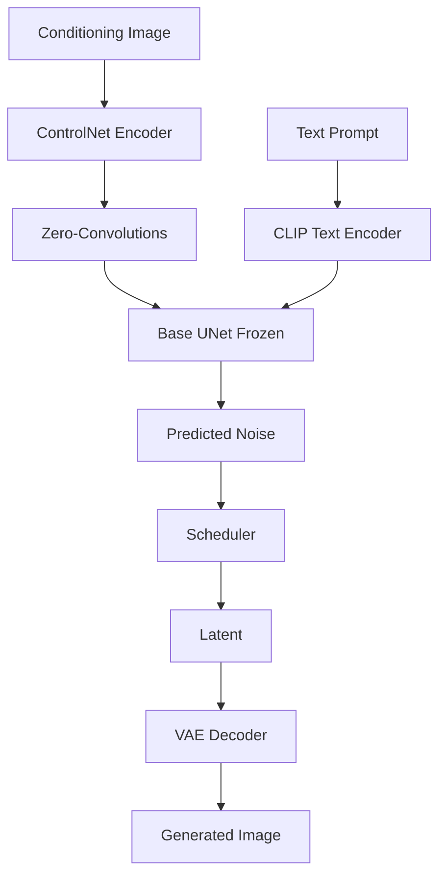
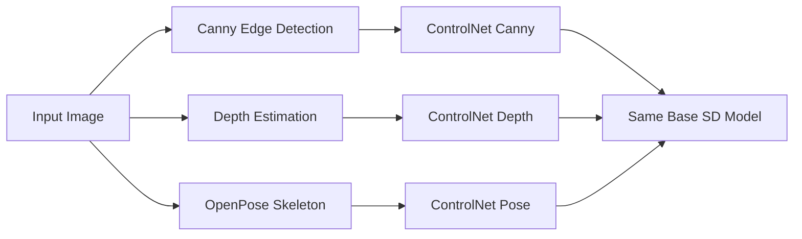
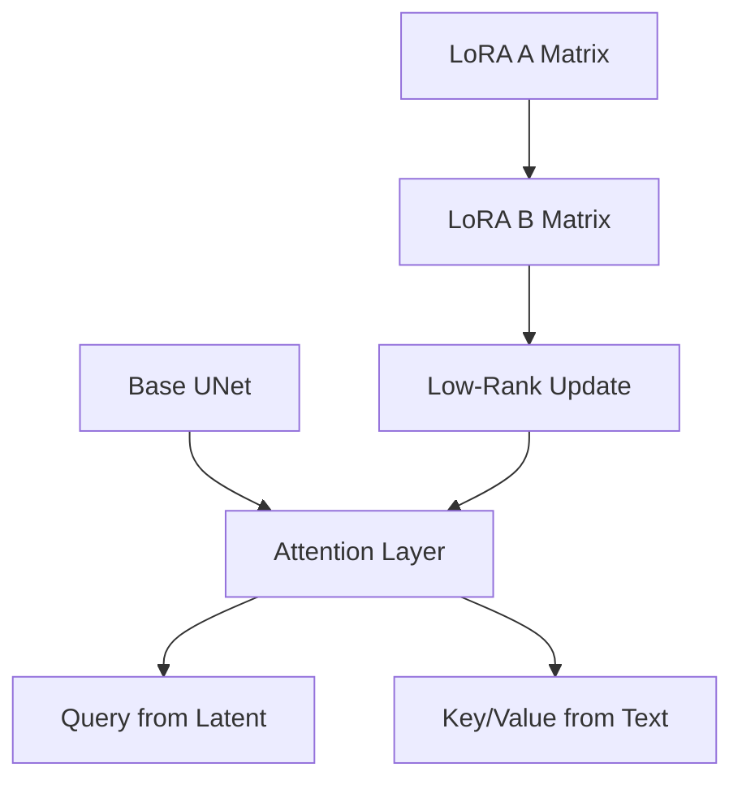
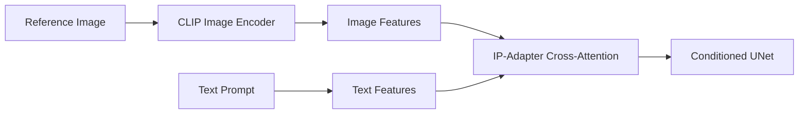
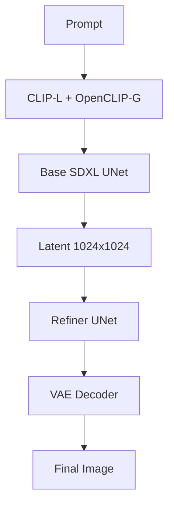
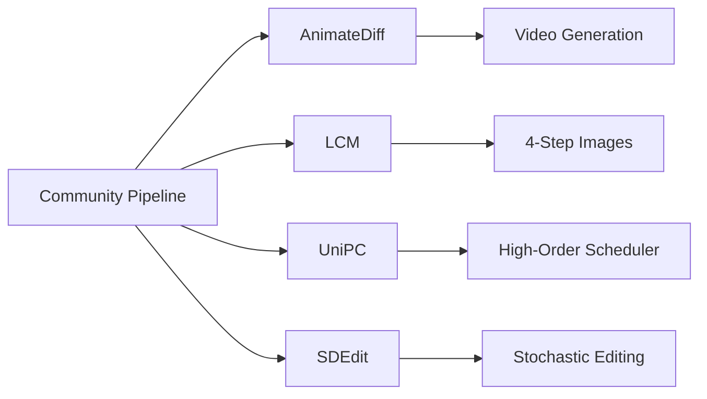

# 🏷️ Diffusers II - Advanced Pipelines and ControlNet

## 🎯 Learning Objectives

- Understand ControlNet architecture: duplicated UNet encoder + zero-convolution conditioning
- Implement ControlNet pipelines with canny, depth, pose, and scribble conditioning
- Apply LoRA and load community weights with `load_lora_weights` and merging
- Use IP-Adapter for image prompting and DreamBooth for subject-specific fine-tuning
- Explore Stable Diffusion XL (SDXL) and Flux pipeline differences
- Leverage `diffusers` community pipelines for cutting-edge research implementations
- Design production-ready diffusion systems with conditioning and personalization

---

## Introduction

Basic text-to-image generation is a solved problem; the frontier now lies in controlling what is generated. While [[07 - Diffusers I - Stable Diffusion Fundamentals]] taught us to generate images from noise and text, real-world creative workflows demand precise control over composition, pose, structure, and style. An architect cannot afford to regenerate a building 100 times hoping the perspective aligns; they need a control mechanism.

This note covers the advanced tooling in the `diffusers` ecosystem: ControlNet for structural conditioning, LoRA for efficient style/person adaptation, IP-Adapter for image-based prompting, and DreamBooth for subject personalization. We also examine SDXL and Flux, the next-generation architectures that push resolution and coherence boundaries. These techniques are essential for ML engineers building generative products in [[09 - MLOps y Produccion]] and creative toolchains that integrate with [[10 - Cloud, Infra y Backend]] services.

The unifying theme is conditioning: moving from unconditional or text-only generation to multi-source guidance where geometry, style, and subject identity are independently controllable.

---

## Module 1: ControlNet

### 1.1 Theoretical Foundation 🧠

ControlNet (Zhang et al., 2023) solves the controllability problem in diffusion models. Standard diffusion accepts only text embeddings as conditioning, which is inherently ambiguous for spatial tasks. ControlNet introduces a trainable copy of the UNet encoder (the "locked" original plus a "trainable" duplicate) that accepts an additional conditioning image—such as edges, depth maps, or human poses. The outputs of the trainable encoder are injected into the original UNet via zero-initialized convolution layers, ensuring that the conditioning does not disrupt the pre-trained base model at initialization.

The zero-convolution trick is critical. At the start of training, the zero weights mean the ControlNet outputs nothing, so the base model behaves exactly as before. During training, only the duplicated encoder and the zero-convolutions learn, while the base UNet remains frozen. This preserves the rich prior knowledge of the pre-trained diffusion model while teaching it to respect the spatial structure of the conditioning signal.

The result is a plug-and-play control mechanism. You can use the same base Stable Diffusion model with different ControlNets for canny edges, depth maps, normal maps, scribbles, or open poses. Each ControlNet is a relatively small checkpoint (~800MB) compared to the base model (~4GB), making it practical to hot-swap conditioning types at runtime.

### 1.2 Mental Model 📐

```
┌─────────────────────────────────────────────────────────────┐
│  CONDITIONING IMAGE (canny / depth / pose / scribble)       │
└──────────────────────┬──────────────────────────────────────┘
                       │
                       ▼
┌─────────────────────────────────────────────────────────────┐
│  CONDITIONING ENCODER (trainable copy of UNet encoder)      │
│  ┌─────────┐    ┌─────────┐    ┌─────────┐                 │
│  │  Conv   │───▶│  ResNet │───▶│  Attn   │                 │
│  │  In     │    │  Blocks │    │  Blocks │                 │
│  └────┬────┘    └────┬────┘    └────┬────┘                 │
│       │              │              │                        │
│       └──────────────┴──────────────┘                        │
│                      │                                       │
│                      ▼                                       │
│  ZERO-CONVOLUTIONS (1x1 conv initialized to 0)              │
│  -> outputs start at 0, gradually learn conditioning        │
└──────────────────────┬──────────────────────────────────────┘
                       │  residual connections into base UNet
                       ▼
┌─────────────────────────────────────────────────────────────┐
│  BASE UNet (FROZEN weights from Stable Diffusion)           │
│  ┌─────────┐    ┌─────────┐    ┌─────────┐                 │
│  │  ResNet │───▶│  Attn   │───▶│  Up     │                 │
│  │  Blocks │    │  + Text │    │  Sample │                 │
│  │         │    │  Cond   │    │         │                 │
│  └─────────┘    └─────────┘    └─────────┘                 │
└──────────────────────┬──────────────────────────────────────┘
                       │
                       ▼
┌─────────────────────────────────────────────────────────────┐
│  PREDICTED NOISE (respects structure from conditioning)     │
└─────────────────────────────────────────────────────────────┘
```

### 1.3 Syntax and Semantics 📝

```python
import torch
from diffusers import StableDiffusionControlNetPipeline, ControlNetModel
from diffusers.utils import load_image
import cv2
import numpy as np
from PIL import Image

# WHY ControlNetModel: loads only the duplicated encoder + zero-convs.
# Each conditioning type has its own checkpoint.
controlnet = ControlNetModel.from_pretrained(
    "lllyasviel/sd-controlnet-canny",
    torch_dtype=torch.float16
)

pipe = StableDiffusionControlNetPipeline.from_pretrained(
    "runwayml/stable-diffusion-v1-5",
    controlnet=controlnet,
    torch_dtype=torch.float16
).to("cuda")

# Prepare canny edge conditioning image
image = load_image("https://huggingface.co/lllyasviel/sd-controlnet-canny/resolve/main/images/bird.png")
image = np.array(image)

# WHY Canny: detects edges at multiple scales; 100/200 are standard thresholds.
low_threshold = 100
high_threshold = 200
image = cv2.Canny(image, low_threshold, high_threshold)
image = Image.fromarray(image)

# WHY guidance_scale: controls prompt adherence.
# WHY num_inference_steps: standard 20-30 is enough with good schedulers.
prompt = "a colorful bird, high quality, detailed"
negative_prompt = "low quality, blurry"

result = pipe(
    prompt,
    negative_prompt=negative_prompt,
    image=image,
    num_inference_steps=20,
    guidance_scale=7.5
).images[0]

result.save("bird_controlnet.png")
```

### 1.4 Visual Representation 🖼️






### 1.5 Application in ML/AI Systems 🤖

| ML Use Case         | This Concept              | Impact                                   |
|---------------------|---------------------------|------------------------------------------|
| Architectural Viz   | ControlNet depth + lines  | Generate renders from CAD wireframes     |
| Character Animation | ControlNet OpenPose       | Lock character pose across frames        |
| Fashion Design      | ControlNet canny          | Preserve garment silhouette              |
| Storyboarding       | ControlNet scribble       | Turn rough sketches into polished scenes |

Real case: Interior AI uses ControlNet depth conditioning to let users upload room photos and generate redesigns that respect the existing geometry, achieving structural consistency that pure text prompts cannot guarantee.

### 1.6 Common Pitfalls ⚠️

⚠️ **Pitfall**: Using a ControlNet checkpoint trained for one base model (e.g., SD v1.5) with a different base model (e.g., SD v2.1 or SDXL). The channel dimensions and attention head configurations differ, causing shape mismatch errors.

💡 **Tip**: Always match the ControlNet version to the base model. The mnemonic is **MATCH THE BASE**.

⚠️ **Pitfall**: Passing a conditioning image with the wrong resolution. ControlNet expects 512x512 for SD v1.5. If you pass 1024x1024 without adjusting, the edge map is downscaled by the pipeline but may lose fine details.

💡 **Tip**: Preprocess your conditioning image to the exact training resolution of the base model.

### 1.7 Knowledge Check ❓

1. **Exercise**: Generate 3 images of the same prompt using canny, depth, and pose ControlNets from the same source photo. Compare structural fidelity.
2. **Question**: Why are the zero-convolution layers initialized to zero instead of random weights?
3. **Mini-Project**: Build a preprocessing pipeline that auto-detects the best ControlNet type (canny for line art, depth for photos, pose for people) and routes to the appropriate checkpoint.

---

## Module 2: LoRA, IP-Adapter, and Fine-Tuning

### 2.1 Theoretical Foundation 🧠

Full fine-tuning of a 4GB diffusion model for every new style or subject is prohibitively expensive. Low-Rank Adaptation (LoRA, Hu et al., 2021) adapts the idea from NLP to diffusion: instead of updating all UNet weights, LoRA injects trainable low-rank matrices into the attention layers. If the original weight matrix is W (d x k), LoRA represents the update as ΔW = B*A where B is d x r and A is r x k, with r << min(d, k). During inference, the adapted weights are W + α/r * B*A. This reduces trainable parameters by 1000x while capturing style and subject information.

DreamBooth (Ruiz et al., 2022) personalizes diffusion models by fine-tuning on 3-5 images of a specific subject with a unique identifier token (e.g., "a photo of a [V] dog"). Combined with LoRA, DreamBooth becomes feasible on a single GPU in under 30 minutes. Textual Inversion (Gal et al., 2022) takes an even lighter approach: it learns only new token embeddings in the text encoder while freezing the UNet entirely. This is ideal for teaching the model new concepts without altering the generation behavior.

IP-Adapter (Ye et al., 2023) decouples image prompting from text prompting by adding cross-attention layers that attend to image features extracted by a CLIP image encoder. Unlike img2img, which noised the entire source latent, IP-Adapter injects image semantics through attention, preserving more of the base model's generative diversity while strongly biasing toward the reference image's style or content.

### 2.2 Mental Model 📐

```
┌─────────────────────────────────────────────────────────────┐
│  FULL FINE-TUNING (expensive)                                │
│  Update ALL UNet weights: ~1B parameters                     │
│  Storage: 4GB per checkpoint                                 │
└──────────────────────┬──────────────────────────────────────┘
                       │
         ┌─────────────┼─────────────┐
         ▼             ▼             ▼
┌─────────────────┐ ┌─────────────────┐ ┌─────────────────┐
│  LoRA           │ │  Textual Inv    │ │  IP-Adapter     │
│  ΔW = B*A       │ │  New token emb  │ │  Image cross-att│
│  ~10-50MB       │ │  ~10KB          │ │  ~100MB         │
│  Style/Subject  │ │  New concepts   │ │  Image prompt   │
└─────────────────┘ └─────────────────┘ └─────────────────┘
```

### 2.3 Syntax and Semantics 📝

```python
from diffusers import StableDiffusionPipeline
import torch

# WHY load_lora_weights: merges LoRA deltas into the UNet attention layers.
# The base model stays in memory; LoRA is applied at load time.
pipe = StableDiffusionPipeline.from_pretrained(
    "runwayml/stable-diffusion-v1-5",
    torch_dtype=torch.float16
).to("cuda")

pipe.load_lora_weights("nerijs/pixel-art-xl")
pipe.fuse_lora()  # WHY fuse: permanently merges weights for faster inference.

image = pipe(
    "a castle in the mountains, pixel art style",
    num_inference_steps=25,
    guidance_scale=7.5
).images[0]

# WHY unfuse_lora(): restores base model if you need to switch styles.
pipe.unfuse_lora()
```

```python
from diffusers import StableDiffusionPipeline
from PIL import Image

# IP-Adapter setup
pipe = StableDiffusionPipeline.from_pretrained(
    "runwayml/stable-diffusion-v1-5",
    torch_dtype=torch.float16
).to("cuda")

# WHY IP-Adapter: loads image encoder + decoupled cross-attention.
pipe.load_ip_adapter("h94/IP-Adapter", subfolder="models", weight_name="ip-adapter_sd15.bin")

ip_image = Image.open("reference_portrait.jpg")

# WHY scale=0.7: balances image prompt influence vs text prompt.
# 1.0 = strong image influence; 0.0 = no influence.
pipe.set_ip_adapter_scale(0.7)

image = pipe(
    prompt="a portrait in the style of the reference",
    ip_adapter_image=ip_image,
    num_inference_steps=25,
    guidance_scale=7.5
).images[0]
```

### 2.4 Visual Representation 🖼️






### 2.5 Application in ML/AI Systems 🤖

| ML Use Case         | This Concept              | Impact                                   |
|---------------------|---------------------------|------------------------------------------|
| Brand Asset Gen     | LoRA brand style          | Generate on-brand creatives instantly    |
| Avatar Creation     | DreamBooth + LoRA         | Personalize model with 5 user photos     |
| Concept Teaching    | Textual Inversion         | Add "cyberpunk-mechanical-panda" vocab   |
| Style Transfer      | IP-Adapter                | Copy style from reference without img2img|

Real case: PhotoRoom uses DreamBooth-style fine-tuning to let e-commerce sellers generate product photos with their specific items in various contexts, reducing photography costs by 90%.

### 2.6 Common Pitfalls ⚠️

⚠️ **Pitfall**: Loading multiple LoRA weights without understanding their interaction. LoRA weights are additive; loading a "anime" LoRA and a "photorealistic" LoRA simultaneously produces conflicting attention biases.

💡 **Tip**: Load one LoRA at a time, or use weighted merging if the library supports it. Test combinations empirically.

⚠️ **Pitfall**: Forgetting to call `pipe.unload_lora_weights()` before switching to a different LoRA. The weights accumulate, causing unpredictable outputs.

💡 **Tip**: After using a LoRA, always unload or reload the base pipeline. Remember: **CLEAN HOUSE BETWEEN STYLES**.

### 2.7 Knowledge Check ❓

1. **Exercise**: Train a LoRA on a specific art style using 20 images and the `diffusers` training script. Compare generated images with and without the LoRA loaded.
2. **Question**: Why does IP-Adapter use decoupled cross-attention instead of directly concatenating image and text embeddings?
3. **Mini-Project**: Build a style-switching API that accepts a prompt and a LoRA name, loads the LoRA, generates an image, then unloads it for the next request.

---

## Module 3: SDXL, Flux, and Community Pipelines

### 3.1 Theoretical Foundation 🧠

Stable Diffusion XL (SDXL, Podell et al., 2023) addresses the main limitations of SD v1.5: low resolution (512px), weak text rendering, and poor composition at complex prompts. SDXL uses a significantly larger UNet (2.6B parameters vs 860M), a second text encoder (OpenCLIP ViT-bigG alongside CLIP ViT-L), and a two-stage pipeline: a base model generates latents at 1024x1024, and a refiner model adds high-frequency details. The dual text encoders provide richer semantic understanding, especially for complex prompts with multiple subjects and attributes.

Flux (Black Forest Labs, 2024) pushes further with a transformer-based diffusion architecture instead of a UNet. It uses flow matching (a continuous-time formulation of diffusion) and scales to 12B parameters. Flow matching trains the model to predict the velocity of the data point along a straight-line probability flow, which is more stable and efficient than discrete timestep denoising. Flux also natively supports high resolutions up to 2MP without a separate upscaler or refiner.

Community pipelines in `diffusers` are user-contributed implementations of research papers that are not yet in the core library. They allow rapid experimentation with cutting-edge techniques like AnimateDiff (motion modules for video), Latent Consistency Models (LCM for ultra-fast generation), and UniPC (unified predictor-corrector scheduler).

### 3.2 Mental Model 📐

```
┌─────────────────────────────────────────────────────────────┐
│  SD v1.5 (860M params)                                       │
│  512x512, single text encoder, UNet                          │
└──────────────────────┬──────────────────────────────────────┘
                       │
                       ▼
┌─────────────────────────────────────────────────────────────┐
│  SDXL (2.6B params)                                          │
│  1024x1024, dual text encoders, base + refiner               │
│  ┌─────────────┐    ┌─────────────┐                         │
│  │ Base Model  │───▶│ Refiner     │                         │
│  │ 1024 latent │    │ Detail enh  │                         │
│  └─────────────┘    └─────────────┘                         │
└──────────────────────┬──────────────────────────────────────┘
                       │
                       ▼
┌─────────────────────────────────────────────────────────────┐
│  Flux (12B params)                                           │
│  Flow matching, transformer backbone, up to 2MP              │
│  Continuous-time, straight-line flow, no discrete steps      │
└─────────────────────────────────────────────────────────────┘
```

### 3.3 Syntax and Semantics 📝

```python
from diffusers import StableDiffusionXLPipeline
import torch

# WHY SDXL: dual text encoders + larger UNet + native 1024x1024.
pipe = StableDiffusionXLPipeline.from_pretrained(
    "stabilityai/stable-diffusion-xl-base-1.0",
    torch_dtype=torch.float16,
    variant="fp16"
).to("cuda")

# WHY refiner: adds detail to the base latent.
from diffusers import StableDiffusionXLImg2ImgPipeline
refiner = StableDiffusionXLImg2ImgPipeline.from_pretrained(
    "stabilityai/stable-diffusion-xl-refiner-1.0",
    torch_dtype=torch.float16,
    variant="fp16"
).to("cuda")

prompt = "a majestic lion wearing a crown, digital art, highly detailed"

# Base generation
image = pipe(
    prompt=prompt,
    num_inference_steps=40,
    guidance_scale=7.5,
    output_type="latent"  # WHY latent: pass raw latents to refiner
).images[0]

# Refinement
image = refiner(
    prompt=prompt,
    image=image,
    num_inference_steps=20
).images[0]

image.save("lion_sdxl.png")
```

```python
from diffusers import DiffusionPipeline

# WHY FluxPipeline: flow matching requires a different class.
# Note: Flux requires a HuggingFace token and accepts different parameters.
pipe = DiffusionPipeline.from_pretrained(
    "black-forest-labs/FLUX.1-dev",
    torch_dtype=torch.bfloat16
).to("cuda")

image = pipe(
    prompt="a futuristic cityscape at dusk, neon lights reflecting on wet streets",
    guidance_scale=3.5,  # WHY 3.5: flow matching uses lower guidance
    num_inference_steps=50,
    height=1024,
    width=1024
).images[0]
```

### 3.4 Visual Representation 🖼️






### 3.5 Application in ML/AI Systems 🤖

| ML Use Case         | This Concept              | Impact                                   |
|---------------------|---------------------------|------------------------------------------|
| Print-on-Demand     | SDXL 1024x1024            | Native resolution for merchandise        |
| Advertising         | SDXL dual encoders        | Better adherence to complex multi-subject prompts |
| Concept Art         | Flux 2MP                  | Final-quality renders without upscaling  |
| Social Media Video  | AnimateDiff community     | Animated memes from static images        |

Real case: Leonardo.ai uses SDXL as its default generation backbone because the dual text encoders and larger UNet produce significantly better prompt adherence for complex scenes with multiple characters and objects.

### 3.6 Common Pitfalls ⚠️

⚠️ **Pitfall**: Using SDXL with a v1.5 VAE or scheduler. SDXL requires its own VAE (different scaling factor) and benefits from schedulers designed for its noise schedule. Mismatched components cause color distortion or poor quality.

💡 **Tip**: Always use the VAE and scheduler bundled with the SDXL checkpoint. Remember: **USE THE BUNDLE**.

⚠️ **Pitfall**: Running Flux on GPUs with less than 24GB VRAM without offloading. Flux's 12B parameter transformer requires significant memory.

💡 **Tip**: Use `device_map="auto"` or CPU offloading for Flux on smaller GPUs. For production, use H100/A100 instances.

### 3.7 Knowledge Check ❓

1. **Exercise**: Generate the same prompt with SD v1.5, SDXL, and Flux. Conduct a blind quality comparison focusing on text legibility and multi-subject composition.
2. **Question**: What is flow matching, and why does it allow Flux to use a transformer instead of a UNet?
3. **Mini-Project**: Implement a community pipeline (e.g., LCM) and benchmark generation time against the standard DPM++ scheduler on SD v1.5.

---

## 📦 Compression Code

```python
"""
Advanced Diffusers Script
Covers: ControlNet, LoRA, IP-Adapter, SDXL, Flux
"""
import torch
from diffusers import (
    StableDiffusionControlNetPipeline,
    ControlNetModel,
    StableDiffusionXLPipeline,
    StableDiffusionXLImg2ImgPipeline,
    DiffusionPipeline,
)
from PIL import Image
import cv2
import numpy as np

# CONTROLNET
controlnet = ControlNetModel.from_pretrained("lllyasviel/sd-controlnet-canny", torch_dtype=torch.float16)
pipe_cn = StableDiffusionControlNetPipeline.from_pretrained(
    "runwayml/stable-diffusion-v1-5", controlnet=controlnet, torch_dtype=torch.float16
).to("cuda")
img = np.array(Image.open("input.png"))
canny = Image.fromarray(cv2.Canny(img, 100, 200))
out_cn = pipe_cn("a beautiful landscape", image=canny, num_inference_steps=20).images[0]
out_cn.save("controlnet_out.png")

# LORA
pipe_lora = StableDiffusionXLPipeline.from_pretrained(
    "stabilityai/stable-diffusion-xl-base-1.0", torch_dtype=torch.float16, variant="fp16"
).to("cuda")
pipe_lora.load_lora_weights("nerijs/pixel-art-xl")
pipe_lora.fuse_lora()
out_lora = pipe_lora("a dragon", num_inference_steps=25).images[0]
out_lora.save("lora_out.png")

# SDXL + REFINER
base = StableDiffusionXLPipeline.from_pretrained(
    "stabilityai/stable-diffusion-xl-base-1.0", torch_dtype=torch.float16, variant="fp16"
).to("cuda")
refiner = StableDiffusionXLImg2ImgPipeline.from_pretrained(
    "stabilityai/stable-diffusion-xl-refiner-1.0", torch_dtype=torch.float16, variant="fp16"
).to("cuda")
latent = base("a futuristic car", num_inference_steps=40, output_type="latent").images[0]
out_sdxl = refiner("a futuristic car", image=latent, num_inference_steps=20).images[0]
out_sdxl.save("sdxl_out.png")
```

## 🎯 Documented Project

### Description
Build a creative generation platform API that supports text-to-image, ControlNet-guided generation, style LoRA switching, and SDXL with refiner.

### Functional Requirements
- POST `/generate`: text-to-image with optional LoRA style.
- POST `/controlnet`: accept image + control type (canny/depth/pose) + prompt.
- POST `/sdxl`: high-res generation with automatic refiner pass.
- GET `/styles`: list available LoRA checkpoints.

### Main Components
- `generation_worker.py`: Celery worker with pipeline cache and LoRA hot-swapping.
- `controlnet_preprocess.py`: OpenCV-based preprocessing for canny/depth/pose.
- `api.py`: FastAPI with file upload and job queue.
- `pipeline_cache.py`: LRU cache for loaded pipelines to avoid repeated initialization.

### Success Metrics
- ControlNet p99 latency < 4s on A10G.
- SDXL base+refiner p99 latency < 8s.
- LoRA switch time < 2s without restarting the worker.

## 🎯 Key Takeaways

- ControlNet duplicates the UNet encoder and injects conditioning via zero-convolutions, preserving the base model while adding spatial control.
- LoRA enables efficient style/subject adaptation with ~10-50MB checkpoints instead of 4GB fine-tuned models.
- IP-Adapter uses decoupled image cross-attention for image prompting without altering the latent noise initialization.
- DreamBooth personalizes models with 3-5 images; Textual Inversion teaches new concepts via token embeddings.
- SDXL uses dual text encoders and a base+refiner two-stage pipeline for 1024x1024 generation.
- Flux replaces UNet with a transformer and uses flow matching for continuous-time generation at up to 2MP.
- Community pipelines in `diffusers` provide rapid access to cutting-edge research techniques.

## References

- Zhang et al. (2023). "Adding Conditional Control to Text-to-Image Diffusion Models." ICCV.
- Hu et al. (2021). "LoRA: Low-Rank Adaptation of Large Language Models." ICLR.
- Ruiz et al. (2022). "DreamBooth: Fine Tuning Text-to-Image Diffusion Models for Subject-Driven Generation." CVPR.
- Gal et al. (2022). "An Image is Worth One Word: Personalizing Text-to-Image Generation using Textual Inversion." ICLR.
- Ye et al. (2023). "IP-Adapter: Text Compatible Image Prompt Adapter for Text-to-Image Diffusion Models." arXiv.
- Podell et al. (2023). "SDXL: Improving Latent Diffusion Models for High-Resolution Image Synthesis." ICLR.
- Esser et al. (2024). "Scaling Rectified Flow Transformers for High-Resolution Image Synthesis." (Flux).
- HuggingFace Diffusers Documentation: https://huggingface.co/docs/diffusers
