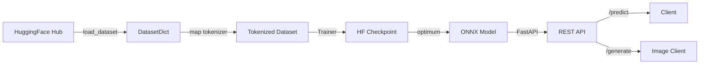
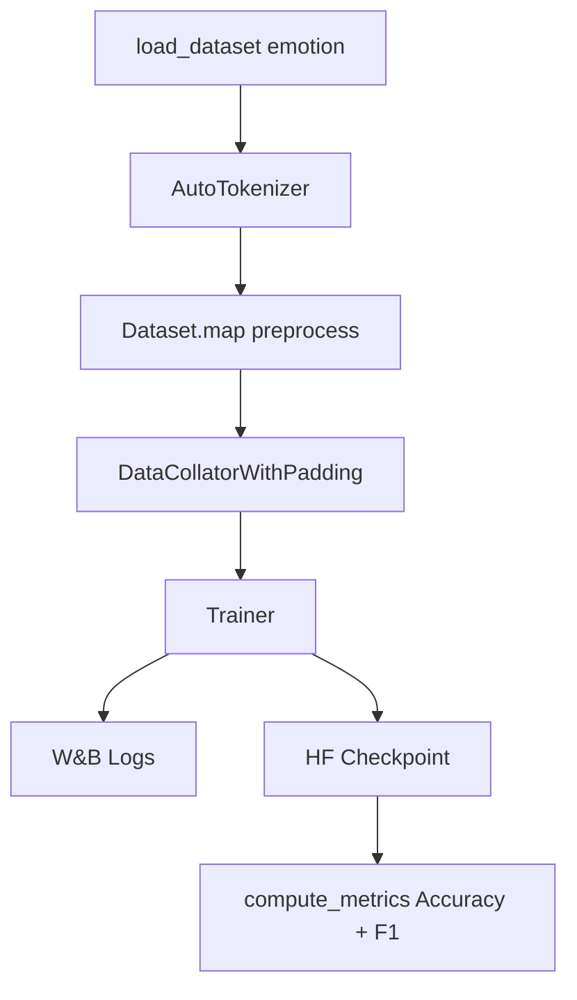

# 🏗️ Capstone Project - End-to-End HF Transformers Pipeline

## 🎯 Learning Objectives

- Architect a complete MLOps pipeline using the HuggingFace ecosystem from ingestion to serving
- Load, tokenize, and fine-tune a model with `datasets`, `AutoTokenizer`, and `Trainer`
- Evaluate model performance with the `evaluate` library and structured metrics
- Export fine-tuned models to ONNX via `optimum` for hardware-agnostic inference
- Build a production-grade FastAPI service with sub-200ms p99 latency
- Integrate a `diffusers` image generation endpoint as a multimodal bonus
- Containerize the entire stack with Docker Compose for reproducible deployment

## Introduction

This capstone is the culmination of the HuggingFace Transformers Deep Dive. Where [[00 - Welcome to HuggingFace Transformers Deep Dive]] introduced the `from_pretrained` philosophy and [[02 - Tokenizers and Data Processing]] covered preprocessing, this project fuses every layer into a deployable system. You will not write isolated snippets; you will build a cohesive pipeline that data scientists and ML engineers actually ship to production.

The pipeline follows a canonical MLOps pattern: ingestion → transformation → training → evaluation → optimization → serving. We intentionally reuse patterns from [[03 - Trainer, TrainingArguments, and Distributed Training]] for fine-tuning, [[06 - Export, Optimization, and Production Serving]] for ONNX export, and [[07 - Diffusers I - Stable Diffusion Fundamentals]] plus [[08 - Diffusers II - Advanced Pipelines and ControlNet]] for the multimodal bonus. By the end, you will have a Docker Compose stack you can run locally or deploy to a cloud VM.

---

## Module 1: Project Architecture

### 1.1 Theoretical Foundation 🧠

An end-to-end ML pipeline is more than a training script. It is a system of contracts: the data contract (schema and splits), the model contract (inputs and outputs), the evaluation contract (metrics and baselines), and the serving contract (latency and throughput). When these contracts are explicit, teams can iterate in parallel without breaking downstream stages.

The HuggingFace ecosystem provides canonical abstractions for each stage. `datasets` enforces the data contract through `DatasetDict` splits, `transformers` enforces the model contract via `forward()` signatures, `evaluate` supplies benchmark-aligned metrics, and `optimum` preserves the contract while switching the runtime to ONNX. This standardization is why HF models compose so well into larger systems.

We treat the pipeline as a directed acyclic graph (DAG). The training node consumes tokenized datasets and produces checkpoints; the export node consumes checkpoints and produces ONNX graphs; the API node consumes ONNX and exposes REST endpoints. This DAG mentality is essential for CI/CD: change the tokenizer, and you must invalidate all downstream nodes.

### 1.2 Mental Model 📐

Overall system DAG:

```
┌──────────────┐     ┌──────────────┐     ┌──────────────┐
│   HF Hub     │────▶│  DatasetDict │────▶│  Tokenizer   │
│   Dataset    │     │  (train/val) │     │  (map/batch) │
└──────────────┘     └──────────────┘     └──────┬───────┘
                                                 │
┌──────────────┐     ┌──────────────┐     ┌──────▼───────┐
│   ONNX       │◀────│  Trainer     │◀────│  Model +     │
│   Export     │     │  + W&B       │     │  Config      │
└──────┬───────┘     └──────────────┘     └──────────────┘
       │
┌──────▼───────┐     ┌──────────────┐     ┌──────────────┐
│  FastAPI     │────▶│  /predict    │     │  /generate   │
│  Service     │     │  (ONNX RT)   │     │  (Diffusers) │
└──────────────┘     └──────────────┘     └──────────────┘
```

Docker Compose topology:

```
┌─────────────────────────────────────────┐
│           Docker Network: hf-net        │
│  ┌─────────────┐    ┌─────────────┐    │
│  │  api        │◀───│  redis      │    │
│  │  (FastAPI)  │    │  (cache)    │    │
│  └──────┬──────┘    └─────────────┘    │
│         │                               │
│  ┌──────▼──────┐    ┌─────────────┐    │
│  │  model-volume│    │  wandb      │    │
│  │  (ONNX+HF)   │    │  (logging)  │    │
│  └─────────────┘    └─────────────┘    │
└─────────────────────────────────────────┘
```

Request flow through the API:

```
┌─────────┐   POST /predict   ┌──────────────┐   ONNX Runtime   ┌─────────┐
│  Client │──────────────────▶│  FastAPI     │─────────────────▶│  Model  │
└─────────┘                   │  Endpoint    │                  └────┬────┘
     ▲                        └──────────────┘                       │
     │                                                               │
     └───────────────────────────────────────────────────────────────┘
                              JSON Response (label + confidence)
```

### 1.3 Syntax and Semantics 📝

```python
# project/config.py — centralized configuration enforces contracts across stages
from dataclasses import dataclass

@dataclass(frozen=True)
class PipelineConfig:
    """Immutable config ensures training and serving agree on model_id and max_length."""
    model_id: str = "distilbert-base-uncased"  # lightweight for fast iteration
    dataset_id: str = "emotion"                 # 6-class text classification
    max_length: int = 128                       # tokenization truncation limit
    batch_size: int = 32
    learning_rate: float = 2e-5
    num_epochs: int = 3
    onnx_path: str = "./onnx_model/model.onnx"
```

### 1.4 Visual Representation 🖼️




### 1.5 Application in ML/AI Systems 🤖

| ML Use Case | This Concept | Impact |
|-------------|-------------|--------|
| Sentiment monitoring | End-to-end text classification pipeline | Real-time brand analytics with sub-200ms inference |
| Content moderation | Fine-tuned BERT + ONNX export | Scalable filtering at the edge with consistent behavior |
| Multimodal SaaS | FastAPI + Diffusers bonus endpoint | Single service handles text and image generation |
| CI/CD for ML | DAG stage contracts | Reproducible builds; cache invalidation is explicit |

### 1.6 Common Pitfalls ⚠️

⚠️ **Do not hardcode paths in training and serving separately.** If `max_length` differs between tokenization and inference, ONNX input shapes will mismatch and the API will crash.

💡 **Use a single `PipelineConfig` dataclass imported by both training and serving scripts.** This creates a single source of truth.

⚠️ **Do not ignore dataset schema evolution.** A Hub dataset may update its splits or column names, breaking your `map()` call.

💡 **Pin the dataset revision with `load_dataset(..., revision="abc123")` and validate expected columns at runtime.**

### 1.7 Knowledge Check ❓

1. Why is a directed acyclic graph (DAG) a useful mental model for an ML pipeline?
2. What happens if the tokenizer `max_length` is 128 during training but 256 during ONNX inference?
3. Name two HF ecosystem libraries that enforce "contracts" between pipeline stages.

---

## Module 2: Implementation Walkthrough

### 2.1 Theoretical Foundation 🧠

Implementation follows "fail fast, validate early." Before training, verify the dataset schema, tokenizer vocabulary coverage, and label space consistency to avoid cryptic shape errors inside `Trainer`.

The `Trainer` API from [[03 - Trainer, TrainingArguments, and Distributed Training]] abstracts the training loop, but you must still understand what happens inside: collation, forward pass, cross-entropy reduction, and optimization. `TrainingArguments` is the control surface; misconfigured `logging_steps` or `evaluation_strategy` leads to silent failures or excessive compute costs.

Evaluation is not an afterthought. The `evaluate` library provides metrics that mirror academic benchmarks. For classification, accuracy is intuitive but F1 is safer for imbalanced classes. Logging to Weights & Biases (W&B) creates an audit trail linking hyperparameters to metrics, which is essential for reproducibility.

### 2.2 Mental Model 📐

Data preprocessing flow:

```
┌─────────────┐     ┌─────────────┐     ┌─────────────┐
│ Raw Example │────▶│  Tokenizer  │────▶│  Encoded    │
│  {"text":x} │     │  __call__   │     │  {input_ids │
└─────────────┘     └─────────────┘     │  attention_ │
                                        │  mask}      │
                                        └──────┬──────┘
                                               │
                                        ┌──────▼──────┐
                                        │  Dataset.map│
                                        │  (batched)  │
                                        └─────────────┘
```

Trainer state machine:

```
     ┌──────────┐
     │  INIT    │
     └────┬─────┘
          │ load model + tokenizer
          ▼
     ┌──────────┐
     │  SETUP   │
     └────┬─────┘
          │ create dataloaders
          ▼
   ┌──────────────┐     eval     ┌──────────┐
   │   TRAIN      │─────────────▶│  EVAL    │
   │  (loop)      │◀─────────────│ (metrics)│
   └──────┬───────┘              └──────────┘
          │ epoch == num_epochs
          ▼
     ┌──────────┐
     │  SAVE    │
     └──────────┘
```

### 2.3 Syntax and Semantics 📝

```python
# train.py — training and evaluation stage
from datasets import load_dataset
from transformers import (
    AutoTokenizer, AutoModelForSequenceClassification,
    TrainingArguments, Trainer, DataCollatorWithPadding
)
import evaluate
import wandb
from config import PipelineConfig

cfg = PipelineConfig()

# 1) Load dataset from Hub with explicit split mapping
dataset = load_dataset(cfg.dataset_id)  # returns DatasetDict

# 2) Load tokenizer and model; num_labels derived from dataset
tokenizer = AutoTokenizer.from_pretrained(cfg.model_id)
label_names = dataset["train"].features["label"].names
model = AutoModelForSequenceClassification.from_pretrained(
    cfg.model_id, num_labels=len(label_names)
)

# 3) Tokenization function with WHY comments
def preprocess(batch):
    # truncation=True ensures no sample exceeds max_length
    # return_tensors is omitted here because Dataset.map returns lists
    return tokenizer(batch["text"], truncation=True, max_length=cfg.max_length)

tokenized = dataset.map(preprocess, batched=True, remove_columns=["text"])

# 4) Metrics computation using evaluate library
accuracy = evaluate.load("accuracy")
f1 = evaluate.load("f1")

def compute_metrics(eval_pred):
    logits, labels = eval_pred
    predictions = logits.argmax(axis=-1)
    return {
        "accuracy": accuracy.compute(predictions=predictions, references=labels)["accuracy"],
        "f1": f1.compute(predictions=predictions, references=labels, average="weighted")["f1"],
    }

# 5) TrainingArguments configures the Trainer loop
args = TrainingArguments(
    output_dir="./results",
    evaluation_strategy="epoch",
    save_strategy="epoch",
    learning_rate=cfg.learning_rate,
    per_device_train_batch_size=cfg.batch_size,
    num_train_epochs=cfg.num_epochs,
    logging_steps=50,
    report_to="wandb",
    load_best_model_at_end=True,
    metric_for_best_model="f1",
)

wandb.init(project="hf-capstone", config=cfg.__dict__)

trainer = Trainer(
    model=model,
    args=args,
    train_dataset=tokenized["train"],
    eval_dataset=tokenized["validation"],
    tokenizer=tokenizer,
    data_collator=DataCollatorWithPadding(tokenizer),  # dynamic padding per batch
    compute_metrics=compute_metrics,
)

trainer.train()
trainer.save_model("./hf_model")
```

### 2.4 Visual Representation 🖼️




### 2.5 Application in ML/AI Systems 🤖

| ML Use Case | This Concept | Impact |
|-------------|-------------|--------|
| Customer support triage | Fine-tuned classification with F1 metric | Reduces misrouted tickets in imbalanced categories |
| Experiment tracking | W&B integration with `report_to` | Enables hyperparameter search and reproducibility |
| Dynamic batching | `DataCollatorWithPadding` | Minimzes wasted compute vs static padding |

### 2.6 Common Pitfalls ⚠️

⚠️ **Do not forget to set `remove_columns` during `Dataset.map`.** Leftover string columns cause the default collator to crash because it cannot tensorize text.

💡 **Always pass `remove_columns=dataset["train"].column_names` or explicitly list non-tensor fields.**

⚠️ **Do not use `accuracy` as the sole metric on imbalanced datasets.** A model that always predicts the majority class can score high accuracy while being useless.

💡 **Prefer `f1` (weighted or macro) or `matthews_correlation` as the primary optimization metric, and keep accuracy for interpretability only.**

### 2.7 Knowledge Check ❓

1. What is the purpose of `DataCollatorWithPadding` and why is it more efficient than static padding?
2. Why do we pass `compute_metrics` to `Trainer` instead of running evaluation manually after training?
3. What does `load_best_model_at_end=True` guarantee about the saved checkpoint?

---

## Module 3: Optimization and Serving

### 3.1 Theoretical Foundation 🧠

Training produces a PyTorch checkpoint, but PyTorch is rarely the optimal runtime for production inference. ONNX defines a standard graph representation that executes on ONNX Runtime, TensorRT, OpenVINO, and mobile runtimes. `optimum` from [[06 - Export, Optimization, and Production Serving]] wraps torch-to-ONNX tracing into a single API.

The key abstraction during export is the "dummy input." Tracing executes the model once with fake inputs and records operations into a static graph. Because Transformer graphs are dynamic in sequence length, we fix ONNX input shapes to `batch_size` and `max_length`, trading flexibility for predictable latency and memory.

Serving requires more than a model file. A production API needs validation, health checks, and observability. FastAPI provides async handling and automatic OpenAPI docs. Paired with ONNX Runtime, a single CPU core can serve DistilBERT in under 100ms. Adding a `diffusers` endpoint (see [[07 - Diffusers I - Stable Diffusion Fundamentals]]) shows how one service can host both discriminative and generative models.

### 3.2 Mental Model 📐

ONNX export process:

```
┌──────────────┐     ┌──────────────┐     ┌──────────────┐
│  HF Checkpoint│────▶│ optimum CLI  │────▶│  ONNX Graph  │
│  (pytorch)   │     │  export onnx │     │  + weights   │
└──────────────┘     └──────────────┘     └──────┬───────┘
                                                  │
                                           ┌──────▼───────┐
                                           │ ONNX Runtime │
                                           │   Session    │
                                           └──────────────┘
```

API request lifecycle:

```
┌─────────┐   POST /predict   ┌──────────────┐   tokenize   ┌─────────────┐
│  Client │──────────────────▶│  FastAPI     │─────────────▶│  Tokenizer  │
└─────────┘                   │  Router      │              └──────┬──────┘
     ▲                        └──────┬───────┘                     │
     │                               │                             │
     │                        ┌──────▼───────┐              ┌──────▼──────┐
     │                        │ ONNX Runtime │◀─────────────│  input_ids  │
     │                        │   Session    │              └─────────────┘
     │                        └──────┬───────┘
     │                               │
     └───────────────────────────────┘
                         JSON
```

### 3.3 Syntax and Semantics 📝

```python
# export.py — ONNX export via optimum
from optimum.onnxruntime import ORTModelForSequenceClassification
from transformers import AutoTokenizer
from config import PipelineConfig

cfg = PipelineConfig()

# optimum handles tracing, graph simplification, and validation automatically
model = ORTModelForSequenceClassification.from_pretrained(
    "./hf_model", export=True
)
tokenizer = AutoTokenizer.from_pretrained("./hf_model")

model.save_pretrained("./onnx_model")
tokenizer.save_pretrained("./onnx_model")
# api.py — FastAPI inference service with ONNX Runtime and Diffusers bonus
from fastapi import FastAPI
from pydantic import BaseModel
from transformers import AutoTokenizer
from optimum.onnxruntime import ORTModelForSequenceClassification
from diffusers import StableDiffusionPipeline
import torch
import time
from config import PipelineConfig

app = FastAPI(title="HF Capstone API")
cfg = PipelineConfig()

# Load ONNX classification model once at startup (singleton pattern)
tokenizer = AutoTokenizer.from_pretrained("./onnx_model")
ort_model = ORTModelForSequenceClassification.from_pretrained("./onnx_model")

# Bonus: load Stable Diffusion pipeline if GPU is available (see [[08 - Diffusers II - Advanced Pipelines and ControlNet]])
sd_pipe = None
if torch.cuda.is_available():
    sd_pipe = StableDiffusionPipeline.from_pretrained(
        "runwayml/stable-diffusion-v1-5", torch_dtype=torch.float16
    ).to("cuda")

class PredictRequest(BaseModel):
    text: str

class PredictResponse(BaseModel):
    label: str
    confidence: float
    latency_ms: float

@app.post("/predict", response_model=PredictResponse)
def predict(req: PredictRequest):
    start = time.perf_counter()
    inputs = tokenizer(
        req.text, return_tensors="pt", truncation=True, max_length=cfg.max_length
    )
    outputs = ort_model(**inputs)
    probs = torch.softmax(outputs.logits, dim=-1)
    confidence, pred_id = torch.max(probs, dim=-1)
    latency = (time.perf_counter() - start) * 1000

    label_names = ort_model.config.id2label  # preserved from training
    return PredictResponse(
        label=label_names[pred_id.item()],
        confidence=confidence.item(),
        latency_ms=round(latency, 2),
    )

@app.get("/health")
def health():
    return {"status": "ok", "onnx_loaded": ort_model is not None}

# Bonus endpoint linking to Diffusers knowledge
@app.post("/generate")
def generate_image(prompt: str):
    if sd_pipe is None:
        return {"error": "Stable Diffusion not loaded (GPU unavailable)"}
    image = sd_pipe(prompt, num_inference_steps=25).images[0]
    path = f"/tmp/{hash(prompt)}.png"
    image.save(path)
    return {"image_path": path}
```

### 3.4 Visual Representation 🖼️

```mermaid
flowchart LR
    A[FastAPI App] --> B[/predict ONNX]
    A --> C[/generate Diffusers]
    A --> D[/health]
    B --> E[ORTModelForSequenceClassification]
    C --> F[StableDiffusionPipeline]
    E --> G[ONNX Runtime]
```


### 3.5 Application in ML/AI Systems 🤖

| ML Use Case | This Concept | Impact |
|-------------|-------------|--------|
| Low-latency inference | ONNX Runtime + FastAPI | p99 < 200ms on CPU for BERT-family models |
| Multi-modal API | One FastAPI with text + image endpoints | Reduces infrastructure sprawl |
| Edge deployment | ONNX standard format | Deploy same file to mobile, browser, or cloud |
| Observability | Latency returned in API response | Client-side SLO monitoring without extra infra |

### 3.6 Common Pitfalls ⚠️

⚠️ **Do not recreate the ONNX `InferenceSession` on every request.** Session creation is expensive; load it once at module import and reuse it.

💡 **Use FastAPI startup events or module-level singletons to load models before the first request arrives.**

⚠️ **Do not ignore input validation on the API layer.** Malformed strings can crash the tokenizer or produce out-of-vocabulary behavior that the model was never trained on.

💡 **Use Pydantic models (`BaseModel`) for strict request schemas and return 422 errors automatically for bad inputs.**

### 3.7 Knowledge Check ❓

1. Why do we export to ONNX instead of serving the PyTorch checkpoint directly?
2. What is the risk of loading a new `InferenceSession` inside a request handler?
3. How does the `id2label` config property ensure training-to-serving label consistency?

---

## 📦 Compression Code

```python
#!/usr/bin/env python3
"""compression.py — End-to-end HF Capstone: load -> tokenize -> train -> evaluate -> export -> serve."""
import os
from dataclasses import dataclass
from datasets import load_dataset
from transformers import (
    AutoTokenizer, AutoModelForSequenceClassification,
    TrainingArguments, Trainer, DataCollatorWithPadding
)
from optimum.onnxruntime import ORTModelForSequenceClassification
from fastapi import FastAPI
from pydantic import BaseModel
import torch, time, evaluate, wandb
@dataclass(frozen=True)
class Cfg:
    model_id: str = "distilbert-base-uncased"
    dataset_id: str = "emotion"
    max_length: int = 128
    batch_size: int = 32
    lr: float = 2e-5
    epochs: int = 3

CFG = Cfg()
app = FastAPI()

# 1) DATA
ds = load_dataset(CFG.dataset_id)
tok = AutoTokenizer.from_pretrained(CFG.model_id)
model = AutoModelForSequenceClassification.from_pretrained(CFG.model_id, num_labels=len(ds["train"].features["label"].names))

def preprocess(b): return tok(b["text"], truncation=True, max_length=CFG.max_length)
tok_ds = ds.map(preprocess, batched=True, remove_columns=["text"])

# 2) TRAIN + EVAL
acc, f1 = evaluate.load("accuracy"), evaluate.load("f1")
def metrics(ep):
    logits, labels = ep
    preds = logits.argmax(-1)
    return {"acc": acc.compute(predictions=preds, references=labels)["accuracy"],
            "f1": f1.compute(predictions=preds, references=labels, average="weighted")["f1"]}

args = TrainingArguments("./results", evaluation_strategy="epoch", save_strategy="epoch",
                         learning_rate=CFG.lr, per_device_train_batch_size=CFG.batch_size,
                         num_train_epochs=CFG.epochs, logging_steps=50, report_to="wandb",
                         load_best_model_at_end=True, metric_for_best_model="f1")
wandb.init(project="hf-capstone", config=CFG.__dict__)
trainer = Trainer(model, args, train_dataset=tok_ds["train"], eval_dataset=tok_ds["validation"],
                  tokenizer=tok, data_collator=DataCollatorWithPadding(tok), compute_metrics=metrics)
trainer.train(); trainer.save_model("./hf_model")

# 3) ONNX EXPORT
ort = ORTModelForSequenceClassification.from_pretrained("./hf_model", export=True)
ort.save_pretrained("./onnx_model"); tok.save_pretrained("./onnx_model")

# 4) FASTAPI SERVING (run with: uvicorn compression:app)
ort_model = ORTModelForSequenceClassification.from_pretrained("./onnx_model")
tokenizer = AutoTokenizer.from_pretrained("./onnx_model")

class Req(BaseModel): text: str
class Resp(BaseModel): label: str; confidence: float; latency_ms: float

@app.post("/predict", response_model=Resp)
def predict(r: Req):
    t0 = time.perf_counter()
    inp = tokenizer(r.text, return_tensors="pt", truncation=True, max_length=CFG.max_length)
    out = ort_model(**inp)
    prob = torch.softmax(out.logits, dim=-1)
    conf, pid = torch.max(prob, dim=-1)
    lat = (time.perf_counter() - t0) * 1000
    return Resp(label=ort_model.config.id2label[pid.item()], confidence=conf.item(), latency_ms=round(lat, 2))

@app.get("/health")
def health(): return {"status": "ok"}
```

## 🎯 Documented Project

### Description
Build a reproducible, containerized ML pipeline that fine-tunes a HuggingFace transformer for text classification, evaluates it with standard metrics, exports it to ONNX, and serves predictions via FastAPI with latency monitoring.

### Functional Requirements
1. Load the `emotion` dataset from the HuggingFace Hub and validate schema.
2. Tokenize with `AutoTokenizer` and collate with dynamic padding.
3. Fine-tune `distilbert-base-uncased` using `Trainer` with W&B logging.
4. Compute accuracy and weighted F1 using the `evaluate` library.
5. Export the best checkpoint to ONNX via `optimum`.
6. Serve `/predict` and `/health` from a FastAPI app loading the ONNX model.
7. Bonus: expose `/generate` using `diffusers` if GPU is present.

### Main Components
- `config.py` — single source of truth for all hyperparameters and paths
- `train.py` — dataset ingestion, tokenization, training, and evaluation
- `export.py` — ONNX export with `optimum.onnxruntime`
- `api.py` — FastAPI inference server with request/response schemas
- `Dockerfile` + `docker-compose.yml` — containerized full-stack deployment

### Success Metrics
- Training converges: validation F1 > 0.85 after 3 epochs on the `emotion` dataset
- Inference p99 latency < 200ms per request on a modern CPU (measured via `/predict` response field)
- ONNX export succeeds without graph warnings and loads into ONNX Runtime correctly
- Docker Compose stack starts all services without manual intervention

## 🎯 Key Takeaways

- A single `PipelineConfig` dataclass prevents training/serving contract mismatches and should be imported by every stage.
- `Trainer` + `DataCollatorWithPadding` + `evaluate` forms a complete, reproducible training loop with minimal boilerplate.
- `optimum` abstracts the complexity of ONNX export, but you must still align tokenization shapes between training and inference.
- FastAPI and ONNX Runtime together achieve production CPU latency requirements (p99 < 200ms) for BERT-family models.
- A multimodal API can host both discriminative (ONNX) and generative (Diffusers) models in one service boundary.
- Docker Compose turns a collection of scripts into a reproducible system that any team member can run with `docker compose up`.
- Observability must be built in from day one: W&B for training, response latency for serving, and health checks for uptime.

## References

1. HuggingFace Transformers Documentation — https://huggingface.co/docs/transformers
2. HuggingFace Datasets Documentation — https://huggingface.co/docs/datasets
3. HuggingFace Optimum ONNX Export — https://huggingface.co/docs/optimum/onnxruntime/usage_guides/models
4. FastAPI Documentation — https://fastapi.tiangolo.com
5. ONNX Runtime — https://onnxruntime.ai
6. Weights & Biases — https://docs.wandb.ai
7. HuggingFace Diffusers — https://huggingface.co/docs/diffusers
8. `emotion` Dataset Card — https://huggingface.co/datasets/emotion
