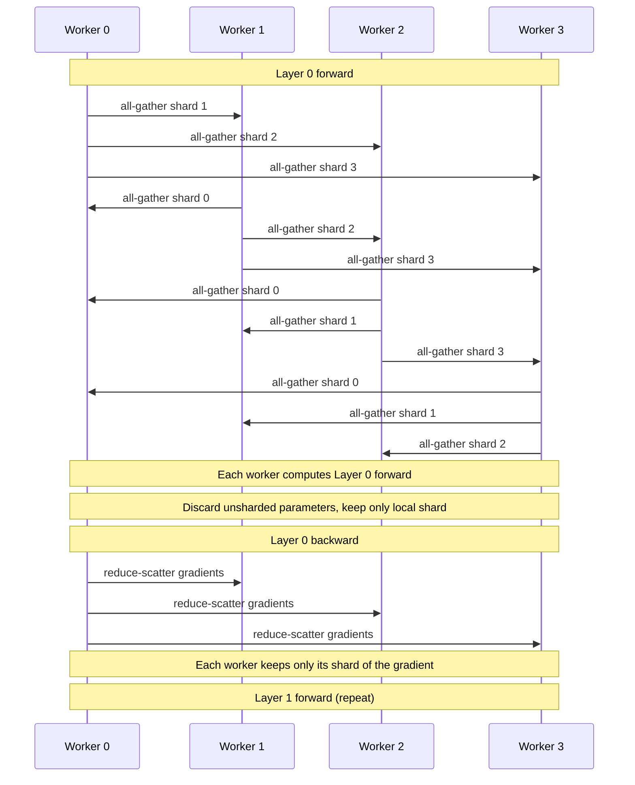

# 🌐 FSDP Deep Dive - PyTorch Native Sharded Data Parallel

## 🎯 Learning Objectives

- Diagnose the **memory wall** that breaks naive DDP at 7B+ parameters and explain why FSDP is the right answer in 2025-2026
- Distinguish the four `ShardingStrategy` modes (NO_SHARD, SHARD_GRAD_OP, FULL_SHARD, HYBRID_SHARD) and the per-GPU memory math for each
- Trace the **all-gather / reduce-scatter** communication pattern that lets FSDP overlap compute with collective ops
- Configure `auto_wrap_policy` correctly for transformer blocks and predict when CPU offload beats pure GPU sharding
- Integrate FSDP into `Trainer` via `fsdp` + `fsdp_config` fields, and via the **external YAML file** that the community standardizes on
- Apply FSDP to LoRA / QLoRA fine-tuning with the `use_orig_params=True` requirement that breaks most naive recipes
- Understand the **FSDP2** rewrite (`fully_shard` from PyTorch 2.4+, DTensor-based) and when to migrate

---

## Introduction

If you have read [[03 - Trainer, TrainingArguments, and Distributed Training]], you know that `Trainer` can dispatch to DDP, DeepSpeed ZeRO, or FSDP with a single flag. But that note treats FSDP as a peer of ZeRO — two paragraphs, mostly as a switch you flip. This note does the opposite: it treats FSDP as a **first-class system** with its own sharding semantics, communication pattern, wrapping policy, checkpointing format, and a 2024-2026 migration story (FSDP1 → FSDP2) that is reshaping the PyTorch distributed-training landscape.

FSDP matters for the same portfolio projects that motivated this vault. **StayBot** cannot fit a fine-tuned Llama-3-8B on a single consumer GPU without QLoRA. **Multi-Agent Research System** would benefit from a custom 13B evaluator fine-tuned on multi-hop reasoning data. **Automated LLM Evaluation Suite** can be upgraded from a frozen Gemma 4 judge to a continuously-trained evaluator if the training stack supports sharded multi-GPU. All of these are FSDP workloads — not DeepSpeed, not DDP, not Megatron-LM. PyTorch-native sharded data parallelism is the default path for any Hugging Face `Trainer` workflow that exceeds a single 80 GB H100.

We approach FSDP as a **memory-and-communication engineering problem** with a clean mathematical model. The theory is laid out before the code; the YAML config (the production deployment path) gets its own subsection. By the end you will be able to read a 70B model fine-tuning recipe and predict the per-GPU memory footprint without running the script.

---

## 1. The Problem and Why This Solution Exists

### The memory wall is the wall

A single NVIDIA H100 SXM carries 80 GB of HBM3. A single consumer RTX 4090 carries 24 GB. The first number sounds generous until you price a model in bytes instead of parameters.

Let $\Psi$ be the parameter count. In standard mixed-precision training with the Adam optimizer, every GPU in a DDP group must hold a full copy of:

| Tensor | Bytes per param | Bytes for $\Psi = 7 \times 10^9$ |
|--------|----------------:|---------------------------------:|
| FP16 parameters | $2\Psi$ | 14 GB |
| FP32 master weights (for Adam) | $4\Psi$ | 28 GB |
| FP32 Adam momentum | $4\Psi$ | 28 GB |
| FP32 Adam variance | $4\Psi$ | 28 GB |
| FP16 gradients | $2\Psi$ | 14 GB |
| **Total per GPU** | $16\Psi$ | **112 GB** |

A 7B model needs 112 GB per GPU in vanilla DDP. A 70B model needs 1.12 TB. This is not a problem you solve by buying more GPUs — even the 80 GB H100 cannot hold a 7B model in standard mixed-precision DDP. The memory budget is the wall, not the compute budget.

### The lineage: from ZeRO to FSDP

Microsoft published **ZeRO** (Zero Redundancy Optimizer) at SC 2020, partitioning optimizer state, gradients, and parameters across data-parallel workers in three stages. The "Stage 3" mode — fully sharded parameters, gradients, and optimizer state — became the standard recipe for large-model training. It is what most teams mean when they say "DeepSpeed."

PyTorch answered ZeRO with **FSDP** in PyTorch 1.11 (March 2022). The conceptual model is the same: shard everything. The mechanical model is different:

- **DeepSpeed ZeRO** is a runtime that rewrites PyTorch's optimizer state. Communication is hand-rolled; the framework owns the schedule.
- **FSDP** is a module wrapper that lives inside `torch.distributed`. Communication uses NCCL primitives directly; the framework is a citizen of the standard PyTorch distributed stack.

In 2024, PyTorch released **FSDP2** (also called "FSDP v2" or `fully_shard`) in PyTorch 2.4. FSDP2 is a rewrite that uses `DTensor` (the device-mesh-aware tensor type) as the underlying representation. It is the recommended path for all new code as of 2025.

### Why FSDP and not just "buy a bigger node"

Three reasons the sharded approach beats memory maximization:

1. **Cost.** A single H100 node with 8 GPUs (640 GB aggregate HBM) costs more than 8 H100 nodes (also 640 GB aggregate) but with full NVLink intra-node and 200/400 Gb/s inter-node. FSDP spreads a workload across cheaper disaggregated hardware.
2. **Fault tolerance.** An 8-GPU node failing takes the whole node down. 64 GPUs across 8 nodes with FSDP lose 1/8 of the work, not everything.
3. **Sharding is composable.** You can stack FSDP with tensor parallelism (split a layer across GPUs) or pipeline parallelism (split layers across GPUs) to reach trillion-parameter scale. FSDP alone takes you to ~70B on 8xH100; FSDP + TP takes you further.

The fundamental trade-off is **memory for communication**. FSDP stores $\frac{1}{N}$ of the parameters per GPU at the cost of all-gather collectives before every forward and reduce-scatter after every backward. The art is making the collectives overlap with compute.

---

## 2. Conceptual Deep Dive

### The sharding strategy enum

FSDP exposes four sharding strategies, controlled by `ShardingStrategy` in `torch.distributed.fsdp`. The memory cost per GPU for $N$ workers, where $\Psi$ is the parameter count in mixed precision ($16\Psi$ total in naive DDP):

| Strategy | Optimizer state | Gradients | Parameters | Per-GPU memory | Communication |
|----------|-----------------|-----------|------------|----------------|---------------|
| `NO_SHARD` (= DDP) | replicated | replicated | replicated | $16\Psi$ | gradients only |
| `SHARD_GRAD_OP` (= ZeRO-1) | sharded | replicated | replicated | $\frac{12\Psi}{N} + 4\Psi$ | gradients all-reduce + reduce-scatter of optimizer state |
| `FULL_SHARD` (= ZeRO-3) | sharded | sharded | sharded | $\frac{16\Psi}{N}$ | all-gather params + reduce-scatter grads |
| `HYBRID_SHARD` | sharded | sharded | sharded within node, replicated across node | $\frac{16\Psi}{N_\text{intra}} \cdot \frac{N_\text{intra}}{N} + 0$ | NVLink intra-node + IB inter-node |

The default and most common choice is `FULL_SHARD`. `SHARD_GRAD_OP` is the right answer when parameters already fit but optimizer state does not (typical for 3-7B on a single node with 80 GB GPUs and no offload). `HYBRID_SHARD` is the production answer for multi-node training where you want NVLink-speed collectives within a node and only inter-node collectives for the cross-node shard boundary.

### The communication pattern

`FULL_SHARD` FSDP performs two collectives per FSDP unit (typically a transformer block):

- **Forward pass**: Before computing the block, **all-gather** the full parameters from all workers. Each worker now has a complete copy of the block, computes the forward locally, then discards the unsharded copy.
- **Backward pass**: After computing local gradients, **reduce-scatter** to send each worker only its slice of the global gradient sum. The unsharded parameters are released.

The Mermaid diagram below shows the pattern for a 2-layer model with 4 workers. The vertical "shard" bars represent the sharded parameters sitting on each GPU; the "all-gather" arrows show what happens before each layer's forward, and the "reduce-scatter" arrows show what happens after each layer's backward.



The reason this design is fast is **prefetching**: with `BackwardPrefetch.BACKWARD_PRE`, FSDP can start the all-gather for layer $N$ while the backward pass for layer $N+1$ is still in progress. The collectives overlap with the autograd graph execution, hiding the communication cost in the compute budget. On a well-tuned 8xH100 NVLink cluster, the throughput penalty for FSDP vs naive DDP is single-digit percent; the memory savings are 4-8x.

### auto_wrap_policy: the most important FSDP setting

If you wrap the entire model in a single FSDP unit, the all-gather before each forward unshards the **whole model** — defeating the memory savings. The standard solution is `auto_wrap_policy`: FSDP inspects the model architecture and creates a new FSDP unit for every submodule that matches a criterion. The two most common policies are:

- **Size-based**: `size_based_auto_wrap_policy(min_num_params=1e8)` — wraps any module with more than 100M parameters. Simple, but ignores the actual model structure.
- **Transformer-based**: `transformer_auto_wrap_policy(transformer_layer_cls={LlamaDecoderLayer})` — wraps every instance of a specific layer class. Precise, but requires knowing the layer class.

The transformer-based policy is the production answer. The `transformer_layer_cls` set must contain the exact class type used by the model architecture — `LlamaDecoderLayer` for Llama 2/3, `GPT2Block` for GPT-2, `BertLayer` for BERT. Passing the wrong class silently produces no wrapping, which makes the model "fit" but runs in NO_SHARD-like memory profile. Always verify with `model.parameters()` count after wrapping.

### MixedPrecision, CPU offload, and the `use_orig_params` flag

Three additional settings deserve attention because they show up in every production YAML.

- **`MixedPrecision`**: separates `param_dtype` (compute precision, typically `torch.bfloat16`), `reduce_dtype` (gradient communication precision, also `bfloat16` on H100), and `buffer_dtype` (FP32 for non-parameter buffers like LayerNorm running stats). On H100 / B200, BF16 throughout is the right default. On A100, FP16 + `gradient_scaling` is the legacy path.
- **`cpu_ram_efficient_loading=True`**: when initializing the model, load one parameter at a time and immediately move it to the assigned GPU. Critical for 70B+ models where a naive `from_pretrained` would materialize the full state dict on CPU RAM before sharding. Without this flag, a 70B model needs 280 GB of CPU RAM just to start training; with it, you need 0 extra CPU RAM.
- **`use_orig_params=True`**: **mandatory for LoRA / QLoRA / any PEFT method**. PEFT wraps parameters in custom tensor subclasses that the FSDP parameter flattening breaks. With `use_orig_params=True`, FSDP keeps the original parameter reference so PEFT can find and update its adapters. Without it, LoRA gradients silently disappear and the base model never trains. This is the single most common cause of "FSDP + LoRA trains but loss doesn't move" Stack Overflow questions.

### FSDP2: the 2024-2026 rewrite

PyTorch 2.4 (July 2024) shipped a from-scratch rewrite of FSDP that the community calls "FSDP2." The old API lives at `torch.distributed.fsdp.FullyShardedDataParallel`; the new one lives at `torch.distributed.fsdp.fully_shard` and operates on a `DTensor` per parameter.

The functional improvements are substantial:

| Aspect | FSDP1 | FSDP2 |
|--------|-------|-------|
| Parameter representation | Flat tensor per FSDP unit | `DTensor` per parameter (device-mesh aware) |
| Communication scheduling | Eager (autograd hook order matters) | Lazy (scheduler chooses) |
| Numerics | FP32 master + FP16/BF16 compute | BF16 compute with FP32 reduction, no separate master weights |
| `torch.compile` | Limited compatibility | First-class support |
| `use_orig_params` | Required for PEFT | Not required (DTensor preserves structure) |
| `auto_wrap_policy` | Required | Optional (operates on submodules directly) |

The migration is mostly mechanical: replace `FSDP(model)` with `model = fully_shard(model)` and remove the auto_wrap_policy. The new API is the recommended path for any code written after PyTorch 2.4. For code that must support older PyTorch, FSDP1 is still maintained but frozen.

---

## 3. Production Reality

### The 70B fine-tuning recipe (Meta's Llama 3 stack)

Meta published the Llama 3 training infrastructure in 2024. The pre-training stack uses a custom tensor-parallel + pipeline-parallel implementation (because at 405B, FSDP alone is not enough). The post-training / fine-tuning stack is pure FSDP2.

For a 70B Llama 3 fine-tune on 16xH100:

- **Per-GPU VRAM**: 70B params × 16 bytes (BF16 + Adam) / 16 GPUs = 70 GB. Fits in 80 GB.
- **Optimizer**: AdamW with BF16, no FP32 master copy (FSDP2 + `MixedPrecision` reduce).
- **Batch size**: 1 per device × 32 gradient accumulation × 16 GPUs = 512 effective.
- **`auto_wrap_policy`**: `transformer_auto_wrap_policy({LlamaDecoderLayer})`.
- **`use_orig_params=True`**: set, because the fine-tune uses LoRA via PEFT.
- **`fsdp_state_dict_type="SHARDED_STATE_DICT"`**: each rank saves only its shard, reducing checkpoint size 16x.
- **Activation checkpointing**: enabled per layer. Without it, activations of a 70B model exceed 16xH100 aggregate VRAM.

The full recipe runs in `transformers` via:

```python
args = TrainingArguments(
    output_dir="./llama3-70b-fsdp",
    per_device_train_batch_size=1,
    gradient_accumulation_steps=32,
    bf16=True,
    fsdp="full_shard auto_wrap",
    fsdp_config="fsdp_config.yaml",          # the external YAML
    gradient_checkpointing=True,
)
```

Note the `fsdp_config="fsdp_config.yaml"` — that string is a path to a YAML file that contains the full FSDP configuration. This is the production deployment path: a YAML file checked into the repo, modified without code changes, reviewed in pull requests.

### Common pitfalls

| Pitfall | Symptom | Fix |
|---------|---------|-----|
| Forgetting `use_orig_params=True` with LoRA | Loss doesn't decrease, base model unchanged | Set `use_orig_params=True` |
| Wrong `transformer_layer_cls` | FSDP unit count = 1, all-gather unshards whole model | Verify class name matches the model config |
| `cpu_ram_efficient_loading=False` on 70B | OOM on CPU during model init | Set to `True` |
| `fsdp_state_dict_type="FULL_STATE_DICT"` for 70B | Checkpoint save takes 20+ minutes, exhausts CPU RAM | Use `SHARDED_STATE_DICT` or `LOCAL_STATE_DICT` |
| No `gradient_checkpointing` for 70B | Activations OOM | Enable in `TrainingArguments` |
| `BackwardPrefetch.BACKWARD_PRE` on slow inter-node | All-gather stalls backward | Use `BACKWARD_POST` or set `limit_all_gathers=True` |

### Comparison with DeepSpeed ZeRO

Both FSDP and ZeRO-3 achieve the same memory profile. The differences are operational:

- **FSDP** is PyTorch-native. New PyTorch features land in FSDP first. `torch.compile` works. The community standard is YAML config.
- **DeepSpeed** has CPU/NVMe offload as a first-class feature, which FSDP matches only in FSDP2. DeepSpeed's `ZeRO-Infinity` (NVMe offload) is more mature.
- **`accelerate`** supports both but the FSDP path is cleaner. The `accelerate launch --use_fsdp` flag is the most direct entry point for users who do not need a full YAML.
- **Ecosystem**: Hugging Face `Trainer` is the de-facto standard. Both backends work, but FSDP is the path with the most documentation and the fewest surprises for a `Trainer`-native workflow.

For 2025-2026 production, the default choice is FSDP2 unless you have a specific DeepSpeed-only feature (typically NVMe offload) that FSDP does not yet match.

---

## 4. Code in Practice

### The YAML config: the production deployment path

The community-standard way to ship an FSDP config is a YAML file passed to `TrainingArguments.fsdp_config`. The string in `fsdp="full_shard auto_wrap"` is parsed left-to-right; each token enables a feature. The detailed knobs live in the YAML:

```yaml
# fsdp_config.yaml — production FSDP2 + LoRA fine-tuning of 70B on 16xH100
fsdp_version: 2                            # FSDP2 (fully_shard); default if PyTorch >= 2.4
fsdp_activation_checkpointing: false       # gradient_checkpointing is set separately in TrainingArguments
fsdp_state_dict_type: SHARDED_STATE_DICT  # each rank saves its shard (16x smaller checkpoints)
fsdp_forward_prefetch: true                # all-gather for layer N+1 during layer N backward
fsdp_backward_prefetch: BACKWARD_PRE       # overlap all-gather with backward
fsdp_cpu_ram_efficient_loading: true       # avoids materializing 70B on CPU
fsdp_offload_params: false                 # keep params on GPU; offload only if OOM
fsdp_sync_module_states: true              # broadcast rank-0 weights to all workers on init
fsdp_use_orig_params: true                 # REQUIRED for LoRA / QLoRA / PEFT
fsdp_reshard_after_forward: true           # full_shard behavior; false = shard_grad_op
fsdp_auto_wrap_policy: TRANSFORMER_BASED_WRAP
fsdp_transformer_layer_cls_to_wrap: LlamaDecoderLayer
fsdp_meta_device_init: false               # set true to init on meta device (saves CPU RAM, slower start)
mixed_precision: BF16                      # param + reduce + buffer precision
bf16: true
limit_all_gathers: true                    # cap in-flight all-gathers for memory-bound settings
```

The parser is forgiving: unknown keys are ignored, defaults are applied for missing keys, and the order of keys does not matter. The same YAML works for `Trainer`, `accelerate launch --fsdp_config fsdp_config.yaml`, and raw `torch.distributed.fsdp.fully_shard` callers.

### The Python glue

The Python side is now trivial — most of the configuration lives in the YAML:

```python
import os
from transformers import AutoModelForCausalLM, AutoTokenizer, TrainingArguments, Trainer
from datasets import load_dataset
from peft import LoraConfig, get_peft_model

model_name = "meta-llama/Meta-Llama-3-70B"
output_dir = "./llama3-70b-lora-fsdp"

tokenizer = AutoTokenizer.from_pretrained(model_name)
model = AutoModelForCausalLM.from_pretrained(
    model_name,
    torch_dtype="bfloat16",
    attn_implementation="flash_attention_2",
)

# PEFT/LoRA — FSDP needs use_orig_params=True (set in the YAML)
lora_cfg = LoraConfig(r=16, lora_alpha=32, target_modules=["q_proj", "v_proj"], lora_dropout=0.05, bias="none", task_type="CAUSAL_LM")
model = get_peft_model(model, lora_cfg)
model.print_trainable_parameters()  # ~0.1% of total params

args = TrainingArguments(
    output_dir=output_dir,
    per_device_train_batch_size=1,
    gradient_accumulation_steps=32,
    num_train_epochs=3,
    learning_rate=2e-4,
    bf16=True,
    gradient_checkpointing=True,
    optim="adamw_torch_fused",
    fsdp="full_shard auto_wrap",        # enable FSDP + auto_wrap
    fsdp_config="fsdp_config.yaml",     # the YAML above
    logging_steps=10,
    save_strategy="steps",
    save_steps=500,
    report_to="wandb",
)

dataset = load_dataset("tatsu-lab/alpaca", split="train")
trainer = Trainer(model=model, args=args, train_dataset=dataset, tokenizer=tokenizer)
trainer.train()                          # launch with: torchrun --nproc_per_node=8 train.py
```

```bash
# Launch on 2 nodes of 8 H100s each
torchrun --nproc_per_node=8 --nnodes=2 --node_rank=0 \
         --master_addr=MASTER_IP --master_port=29500 train.py
# node 0: --node_rank=0
# node 1: --node_rank=1
```

```bash
# Or use accelerate with the same YAML
accelerate launch --config_file accelerate_config.yaml --fsdp_config fsdp_config.yaml train.py
```

⚠️ **Advertencia — `use_orig_params=True` is non-optional for PEFT.** The PEFT library wraps base-model parameters in `ModulesToSaveWrapper` and `LoraLayer` tensor subclasses. FSDP1 flattens parameters before PEFT can hook them, breaking gradient flow. The flag lives in the YAML — forgetting it is the most common cause of "LoRA + FSDP trains but the base model does not update" in production.

💡 **Tip — Verify FSDP is actually sharding.** Add this print after model wrapping:

```python
from torch.distributed.fsdp import fully_shard
fully_shard(model)
n_fsdp = sum(1 for m in model.modules() if isinstance(m, fully_shard))
print(f"FSDP units: {n_fsdp}  (expect one per {lora_cfg.target_modules[0]} block, ~80 for Llama-3-70B)")
```

If `n_fsdp == 1`, your `auto_wrap_policy` is not matching the layer class and the whole model is in a single FSDP unit. Debug by listing the unique layer types: `print({type(m).__name__ for m in model.modules()})`.

> **Caso real:** Meta's Llama 3 fine-tuning stack uses FSDP2 with `SHARDED_STATE_DICT` checkpointing, `LlamaDecoderLayer` auto-wrap, and `use_orig_params=True` for LoRA-based instruction tuning. Per-GPU memory footprint at 70B is ~70 GB on H100, enabling single-node 8-GPU fine-tuning of the 70B variant. The same YAML ships to internal repos; engineers tune hyperparameters by editing the YAML, never the Python.

---

## 🎯 Key Takeaways

- FSDP solves the **memory wall** that breaks naive DDP at 7B+ parameters by sharding parameters, gradients, and optimizer state across $N$ data-parallel workers at the cost of an all-gather / reduce-scatter per FSDP unit per step.
- The four `ShardingStrategy` modes trade memory for communication. `FULL_SHARD` is the production default; `SHARD_GRAD_OP` and `HYBRID_SHARD` are right for specific hardware topologies.
- `auto_wrap_policy` is the single most important FSDP setting. Use `transformer_auto_wrap_policy` with the exact decoder layer class. A wrong class silently disables sharding.
- The production deployment path is a **YAML file** referenced by `TrainingArguments.fsdp_config`. The same YAML works with `Trainer`, `accelerate launch`, and raw `torch.distributed.fsdp`.
- `use_orig_params=True` is **mandatory for LoRA / QLoRA / PEFT**. Without it, the base model never trains. This is the most common production bug.
- FSDP2 (`fully_shard` from PyTorch 2.4+) is the recommended path for 2025-2026. It uses `DTensor` for first-class `torch.compile` support and removes the `use_orig_params` requirement.
- 70B on 16xH100 with FSDP2 + LoRA is now a single-day recipe. Memory cost: $16\Psi / N = 70$ GB per GPU. Communication cost: 5-15% throughput penalty vs naive DDP, hidden by `BACKWARD_PRE` prefetching.

## References

- PyTorch FSDP Tutorial: https://pytorch.org/tutorials/intermediate/FSDP_tutorial.html
- PyTorch FSDP2 / `fully_shard` API: https://pytorch.org/docs/stable/fsdp.html
- Hugging Face `Trainer` FSDP integration: https://huggingface.co/docs/transformers/fsdp
- `accelerate` FSDP launch: https://huggingface.co/docs/accelerate/usage_guides/fsdp
- Meta, "Llama 3 Herd of Models" (2024) — production FSDP2 + LoRA fine-tuning stack
- Rajbhandari et al., "ZeRO: Memory Optimizations Toward Training Trillion Parameter Models", SC 2020
- Zhao et al., "PyTorch FSDP: Experiences on Scaling Fully Sharded Data Parallel", VLDB 2023
- Related Vault: [[03 - Trainer, TrainingArguments, and Distributed Training]]
- Related Vault: [[06 - Export, Optimization, and Production Serving]]
- Related Vault: [[../11 - Fine-Tuning LLMs/01 - Full Fine-Tuning vs PEFT - LoRA, QLoRA and Memory Math|LoRA / QLoRA Memory Math]]
- Related Vault: [[../14 - Unsloth and Efficient Fine-Tuning/01 - Unsloth Architecture and QLoRA Deep Dive|Unsloth Architecture]]
- Related Vault: [[../13 - vLLM and Advanced RAG/00 - Welcome to vLLM and Advanced RAG|vLLM and Advanced RAG]]

---

## 📦 Compression Code

```python
# FSDP compression — runs through all 4 sharding strategies, the auto_wrap policy,
# and the YAML config path in a single file. Requires: torch>=2.4, transformers,
# accelerate, peft. Single-node, 2-4 GPUs recommended.

import os, torch
from torch.distributed.fsdp import (
    fully_shard, MixedPrecision, ShardingStrategy, BackwardPrefetch,
)
from torch.distributed.fsdp.wrap import transformer_auto_wrap_policy
from transformers import AutoModelForCausalLM
from functools import partial

# 1. Launch with torchrun --nproc_per_node=2  (this file)
rank = int(os.environ["RANK"])
world_size = int(os.environ["WORLD_SIZE"])
torch.distributed.init_process_group("nccl")
torch.cuda.set_device(rank)

# 2. Load a small model with decoder layers (GPT-2 for the demo; same pattern for Llama)
model = AutoModelForCausalLM.from_pretrained(
    "gpt2", torch_dtype=torch.bfloat16
).to(rank)
gpt2_block = type(model.transformer.h[0])   # GPT2Block — the transformer layer class

# 3. Apply FSDP2 to every transformer block independently
mp_policy = MixedPrecision(
    param_dtype=torch.bfloat16,
    reduce_dtype=torch.bfloat16,
    buffer_dtype=torch.float32,
)
for block in model.transformer.h:
    fully_shard(block, mesh=None, mp_policy=mp_policy, backward_prefetch=BackwardPrefetch.BACKWARD_PRE)
fully_shard(model, mesh=None)              # outermost shard: also shards the LM head

# 4. Verify FSDP actually wrapped the blocks (expect: 13 for GPT-2 base = 12 blocks + 1 root)
n_fsdp = sum(1 for m in model.modules() if m._is_fsdp_fully_sharded if hasattr(m, "_is_fsdp_fully_sharded"))
print(f"[rank {rank}] FSDP units: {n_fsdp}  (expect 13)")

# 5. Training step (synthetic loss)
optim = torch.optim.AdamW(model.parameters(), lr=1e-5)
for step in range(3):
    ids = torch.randint(0, model.config.vocab_size, (2, 64), device=rank)
    out = model(input_ids=ids, labels=ids)
    out.loss.backward()
    optim.step(); optim.zero_grad()
    if rank == 0:
        print(f"step {step}  loss={out.loss.item():.4f}  per-GPU mem={torch.cuda.max_memory_allocated()/1e9:.1f} GB")

torch.distributed.destroy_process_group()

# YAML equivalent (fsdp_config.yaml) — same recipe in declarative form:
#   fsdp_version: 2
#   fsdp_state_dict_type: SHARDED_STATE_DICT
#   fsdp_forward_prefetch: true
#   fsdp_backward_prefetch: BACKWARD_PRE
#   mixed_precision: BF16
#   fsdp_use_orig_params: true        # required for LoRA / PEFT
#   fsdp_auto_wrap_policy: TRANSFORMER_BASED_WRAP
#   fsdp_transformer_layer_cls_to_wrap: GPT2Block
#   limit_all_gathers: true
```
