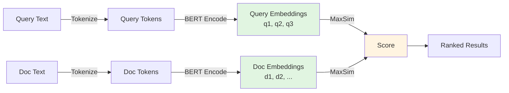
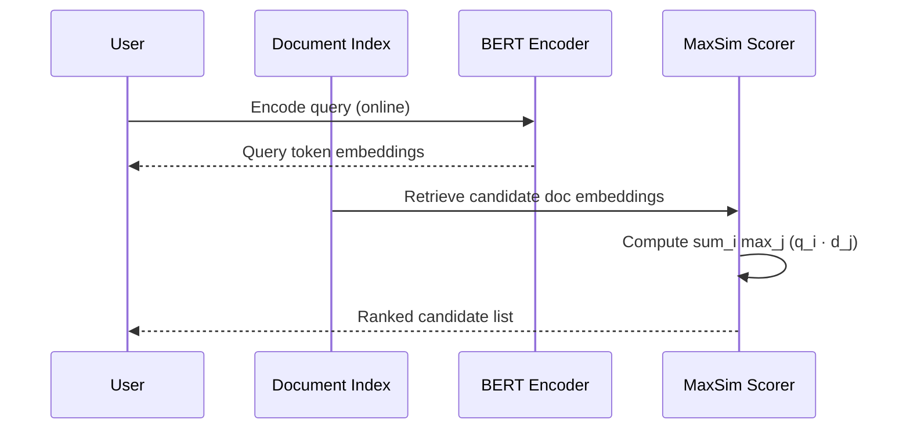
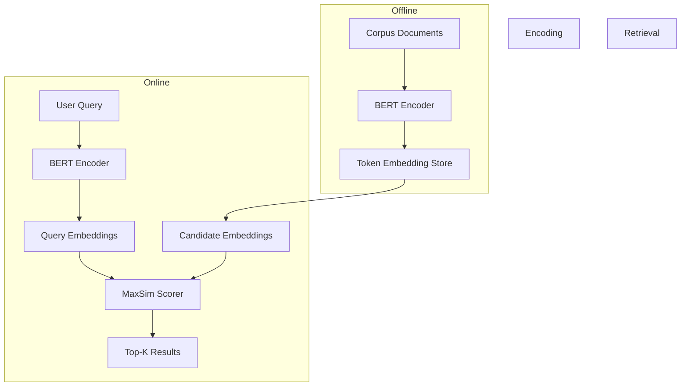

# 🏷️ ColBERT: Token-Level Late Interaction

## 🎯 Learning Objectives

- Distinguish bi-encoders, cross-encoders, and late-interaction architectures on accuracy–latency axes.
- Derive the MaxSim scoring function from first principles and explain why it preserves fine-grained token alignment.
- Implement a minimal ColBERT indexer and retriever using the `colbert-ai` ecosystem.
- Evaluate memory–accuracy trade-offs when moving from single-vector retrieval to token-level retrieval.

## Introduction

**ColBERT** stands for **CO**ntextualized **L**ate **I**nteraction over **BERT**. The name is a sentence: we take BERT, we contextualize every token (instead of pooling to a single vector), and we defer—*late*—the interaction between query and document until the moment of search. This is not a minor implementation detail; it is a fundamental architectural choice that redefines the accuracy–latency frontier in neural information retrieval.

To understand why this matters, consider the two dominant paradigms before ColBERT. **Bi-encoders** encode queries and documents into single dense vectors and score them with a dot product. They are fast because approximate nearest neighbor (ANN) search is sub-linear, but they are inaccurate because a single vector must summarize an entire passage, losing token-level nuance. **Cross-encoders** concatenate query and document and feed them through a transformer with full cross-attention. They are accurate because every query token attends to every document token, but they are unusable for first-stage retrieval because scoring thousands of documents requires thousands of forward passes. ColBERT was designed to occupy the empty space between these two extremes: cross-encoder accuracy at bi-encoder speed. It achieves this by storing *all* token embeddings and computing a lightweight but expressive MaxSim operation at query time.

Today, ColBERT is the backbone of state-of-the-art RAG pipelines that refuse to sacrifice retrieval quality for speed. It integrates naturally with [[06 - Large Language Models/12 - Production RAG/04 - Production RAG System]] and can be used as a reranker atop vector databases like Milvus or Qdrant ([[10 - Cloud, Infra y Backend/33 - Vector Databases and Semantic Search/00 - Welcome to Vector Databases and Semantic Search]]). If you have already studied dense retrieval in [[06 - Large Language Models/13 - vLLM and Advanced RAG/00 - Welcome to vLLM and Advanced RAG]], ColBERT is the upgrade path when dense retrieval starts failing on out-of-domain or fine-grained queries.

---

## Module 1: Late Interaction Architecture

### 1.1 Theoretical Foundation 🧠

The central dilemma in neural retrieval is the **interaction–efficiency trade-off**. Early interaction (cross-encoders) is expensive because it computes pairwise attention over the full query–document sequence. No interaction (bi-encoders) is cheap because it reduces each text to a single vector, but the compression is lossy. The insight behind late interaction is that we can split the difference: encode query and document independently (keeping the encoding phase cheap and parallelizable), but store a rich, per-token representation so that interaction, when it finally happens, is still expressive.

Historically, this idea was foreshadowed by convolutional neural networks for text (e.g., DeepCT) that learned term weights, and by interaction-focused models like DRMM that used histogram pooling. However, these methods relied on static or coarse representations. ColBERT's breakthrough was to use deep contextualized embeddings—specifically BERT's last hidden state—and to define an interaction function (MaxSim) that is both differentiable and computationally lightweight. The "late" in late interaction means the query and document vectors literally do not see each other until the scoring stage. During encoding, the query is passed through BERT alone, and each document is passed through BERT alone. This allows document embeddings to be pre-computed and indexed offline, a property shared with bi-encoders but impossible with cross-encoders.

The design motivation is rooted in empirical observations about retrieval errors. Bi-encoders struggle with queries that require matching specific entities or phrases because the CLS token must average over all tokens. For example, the query "Who invented the laser?" requires strong alignment between "invented" and a document containing "invented," not just a generic semantic similarity between "laser" and "physics." By retaining token-level vectors, ColBERT allows "invented" to match "invented" directly, while still benefiting from BERT's contextualization (e.g., distinguishing "invented" as a verb from "invented" in a proper noun).

### 1.2 Mental Model 📐

```
┌─────────────────────────────────────────────────────────────┐
│                    LATE INTERACTION PIPELINE                │
├─────────────────────────────────────────────────────────────┤
│                                                             │
│   Query Text          Document Corpus                       │
│        │                    │                               │
│        ▼                    ▼                               │
│   ┌─────────┐         ┌─────────┐                           │
│   │  BERT   │         │  BERT   │  (offline, once)          │
│   │ Encoder │         │ Encoder │                           │
│   └────┬────┘         └────┬────┘                           │
│        │                    │                               │
│        ▼                    ▼                               │
│   Query Tokens        Doc Tokens                            │
│   [q1,q2,q3]          [d1,d2,d3,...,dn]                     │
│        │                    │                               │
│        └────────┬───────────┘                               │
│                 ▼                                           │
│            ┌─────────┐                                      │
│            │ MaxSim  │  (at query time)                     │
│            │  score  │                                      │
│            └────┬────┘                                      │
│                 ▼                                           │
│           Ranked Results                                    │
│                                                             │
└─────────────────────────────────────────────────────────────┘
```

```
┌─────────────────────────────────────────────────────────────┐
│              INTERACTION SPECTRUM COMPARISON                │
├─────────────────────────────────────────────────────────────┤
│                                                             │
│  Bi-Encoder          ColBERT            Cross-Encoder       │
│  ───────────         ───────            ─────────────       │
│                                                             │
│  [Q]──►[●]           [Q]──►[q1,q2]     [Q+D]──►[Attn]     │
│  [D]──►[●]           [D]──►[d1,d2]     [Score]            │
│   ●·● = dot          MaxSim(q,d)                            │
│                                                             │
│  Speed:  ████████    ██████             █                   │
│  Acc:    ████        ████████           ████████            │
│                                                             │
└─────────────────────────────────────────────────────────────┘
```

```
┌─────────────────────────────────────────────────────────────┐
│                     MAXSIM OPERATION                        │
├─────────────────────────────────────────────────────────────┤
│                                                             │
│   Query token q_i scans all document tokens d_j             │
│                                                             │
│        d1    d2    d3    d4                                 │
│   q1   0.1   0.8   0.2   0.1   ──► max = 0.8               │
│   q2   0.4   0.3   0.9   0.2   ──► max = 0.9               │
│   q3   0.7   0.1   0.1   0.6   ──► max = 0.7               │
│                                                             │
│   Score = 0.8 + 0.9 + 0.7 = 2.4                             │
│                                                             │
│   (Each q_i finds its BEST matching d_j)                    │
│                                                             │
└─────────────────────────────────────────────────────────────┘
```

### 1.3 Syntax and Semantics 📝

```python
# Minimal conceptual implementation of late-interaction scoring.
# In production, use the official `colbert-ai` library with optimized kernels.

import torch
import torch.nn.functional as F
from transformers import AutoTokenizer, AutoModel

# We use a BERT-family model; ColBERTv1/v2 uses bert-base-uncased.
MODEL_NAME = "bert-base-uncased"
tokenizer = AutoTokenizer.from_pretrained(MODEL_NAME)
model = AutoModel.from_pretrained(MODEL_NAME)
model.eval()


def encode(text: str):
    """
    WHY: We need per-token contextualized embeddings, not a pooled CLS.
    BERT's last hidden state gives us one vector per input token.
    """
    inputs = tokenizer(text, return_tensors="pt", truncation=True, max_length=512)
    with torch.no_grad():
        outputs = model(**inputs)
    # Shape: (batch=1, seq_len, hidden_dim)
    return outputs.last_hidden_state.squeeze(0)


def maxsim_score(query_emb: torch.Tensor, doc_emb: torch.Tensor) -> float:
    """
    WHY: For each query token, we care about the SINGLE best document token.
    This mimics term matching but in continuous embedding space.
    Summing over query tokens ensures the entire query is satisfied.
    """
    # L2-normalize so cosine similarity = dot product
    query_emb = F.normalize(query_emb, dim=-1)
    doc_emb = F.normalize(doc_emb, dim=-1)

    # similarities[i, j] = similarity between query token i and doc token j
    similarities = query_emb @ doc_emb.T  # (q_len, d_len)

    # max over document dimension: each query token picks its best match
    max_per_query_token, _ = similarities.max(dim=1)

    # sum over query tokens: the overall score is additive
    score = max_per_query_token.sum().item()
    return score


# Example usage
query = "Who invented the laser?"
doc = "The laser was invented by Theodore Maiman in 1960."

q_emb = encode(query)
d_emb = encode(doc)

score = maxsim_score(q_emb, d_emb)
print(f"ColBERT MaxSim score: {score:.4f}")
```

### 1.4 Visual Representation 🖼️






### 1.5 Application in ML/AI Systems 🤖

Real case: **Stanford Information Retrieval Group** uses ColBERT as the first-stage retriever in open-domain QA pipelines, achieving state-of-the-art nDCG@10 on the BEIR benchmark suite. Microsoft Research has also published experiments integrating ColBERT into Bing's candidate-generation stack.

| ML Use Case                     | This Concept                    | Impact                                                  |
|--------------------------------|--------------------------------|---------------------------------------------------------|
| Open-domain QA                 | ColBERT first-stage retrieval  | +5–10 nDCG over dense bi-encoders on out-of-domain data |
| Legal / patent search          | Token-level phrase matching    | Captures entity matches lost by semantic pooling        |
| RAG pipeline reranking         | MaxSim on top-k from FAISS     | Cross-encoder quality at 1/100th the latency            |
| Multi-hop reasoning            | Late interaction decomposition | Each hop can be scored independently without re-encoding|

### 1.6 Common Pitfalls ⚠️

⚠️ **Storing all token embeddings is memory-intensive.** A single 512-token document at hidden size 768 consumes 512 × 768 × 4 bytes ≈ 1.5 MB in float32. For a corpus of 10M passages, this is ~15 GB before compression. The root cause is that you are trading compute for memory: you avoid cross-attention at query time but must pay for storage.

💡 **Mnemonic: "Late to the party, but brings gifts."** The interaction is late (cheap query time), but the gift is every token embedding stored in the index. If your gift budget (RAM) is tight, use PLAID or residual compression (see [[02 - ColBERT in Production - PLAID and Vector Integration]]).

### 1.7 Knowledge Check ❓

1. **Why does ColBERT normalize embeddings before MaxSim?** Explain the relationship between L2 normalization and cosine similarity in the scoring formula.
2. **Compute the MaxSim score by hand** for query tokens `[q1, q2]` and document tokens `[d1, d2, d3]` given the similarity matrix `[[0.2, 0.9, 0.1], [0.8, 0.3, 0.7]]`.
3. **Architecture debate:** A teammate argues that bi-encoders are "just ColBERT with max_length=1." Write two sentences explaining why this is wrong.

---

## Module 2: MaxSim Scoring and Implementation Patterns

### 2.1 Theoretical Foundation 🧠

The mathematical formulation of ColBERT is deceptively simple:

```
score(q, d) = Σ_i max_j (E_q[i] · E_d[j])
```

where `E_q` and `E_d` are the contextualized token embeddings of the query and document, respectively. The summation is over query tokens `i`; the inner maximization is over document tokens `j`. This is a sum of maxima, hence **MaxSim**.

To understand why this formula works, consider its behavior on two extreme document types. A **perfectly relevant** document will contain a token (or contextualized variant) for every query token, yielding high dot products across the board. A **partially relevant** document will match some query tokens strongly but others weakly; the sum captures the degree of coverage. An **irrelevant** document will produce uniformly low dot products. Unlike bi-encoder dot product, MaxSim is not symmetric: the query drives the summation, so a long document that happens to contain many unrelated tokens does not inflate the score, because each query token only takes its *maximum* match.

Another crucial property is that MaxSim is differentiable. During training, the model can be optimized with pairwise or listwise loss functions (e.g., margin ranking loss or KL divergence from softmax scores). The gradients flow back through the `max` operator (subgradient) and into the BERT encoder, teaching it to produce embeddings where relevant query–document token pairs align and irrelevant pairs repel. This is why ColBERT is not simply a post-processing trick on frozen BERT embeddings; the entire model is fine-tuned for the retrieval objective.

### 2.2 Mental Model 📐

```
┌─────────────────────────────────────────────────────────────┐
│              TOKEN ALIGNMENT MATCHING                       │
├─────────────────────────────────────────────────────────────┤
│                                                             │
│   Query:  "capital of France"                               │
│                                                             │
│   Doc A:  "The capital city of France is Paris."            │
│           capital ───────► capital  (strong match)          │
│           of      ───────► of       (strong match)          │
│           France  ───────► France   (strong match)          │
│           Score = high                                      │
│                                                             │
│   Doc B:  "France is a country in Europe."                  │
│           capital ───────► country  (weak match)            │
│           of      ───────► in       (weak match)            │
│           France  ───────► France   (strong match)          │
│           Score = medium                                    │
│                                                             │
└─────────────────────────────────────────────────────────────┘
```

```
┌─────────────────────────────────────────────────────────────┐
│                 COLBERT INDEX LAYOUT                        │
├─────────────────────────────────────────────────────────────┤
│                                                             │
│  Doc ID 0 ──► [emb_t0, emb_t1, ..., emb_tN]               │
│  Doc ID 1 ──► [emb_t0, emb_t1, ..., emb_tM]               │
│  Doc ID 2 ──► [emb_t0, emb_t1, ..., emb_tK]               │
│                                                             │
│  Each row is a tensor of shape (num_tokens, hidden_dim)     │
│  Stored as a flat buffer with offsets for variable length   │
│                                                             │
└─────────────────────────────────────────────────────────────┘
```

```
┌─────────────────────────────────────────────────────────────┐
│              QUERY TIME BATCHED SCORING                     │
├─────────────────────────────────────────────────────────────┤
│                                                             │
│  Batch of queries: Q1, Q2, Q3                               │
│                                                             │
│  For each candidate doc:                                    │
│     ├─ Q1_emb @ Doc_emb.T  ──► max ──► sum = score_1      │
│     ├─ Q2_emb @ Doc_emb.T  ──► max ──► sum = score_2      │
│     └─ Q3_emb @ Doc_emb.T  ──► max ──► sum = score_3      │
│                                                             │
│  GPU parallelizes over (query, doc) pairs                   │
│                                                             │
└─────────────────────────────────────────────────────────────┘
```

### 2.3 Syntax and Semantics 📝

```python
# Training-time example: pairwise margin ranking loss.
# WHY: We need the model to learn embeddings such that positive
# documents score higher than negatives by a margin.

import torch
import torch.nn as nn

class ColBERTLoss(nn.Module):
    def __init__(self, margin: float = 1.0):
        super().__init__()
        self.margin = margin

    def forward(self, pos_score: torch.Tensor, neg_score: torch.Tensor) -> torch.Tensor:
        """
        WHY margin ranking: we don't care about absolute scores,
        only that positives are separated from negatives.
        """
        losses = torch.relu(neg_score - pos_score + self.margin)
        return losses.mean()


# Efficient batched retrieval on GPU using matrix operations.
# WHY: Python loops over documents kill throughput.
# We batch documents into a padded tensor and compute all scores
# in a single kernel launch.

import torch.nn.functional as F


def batch_maxsim(query_emb: torch.Tensor, doc_embs: list[torch.Tensor]) -> torch.Tensor:
    """
    WHY: Documents have variable lengths. To batch them, we pad
    to the max length in the batch and mask padded positions
    so they contribute -inf to the max.
    """
    max_len = max(d.shape[0] for d in doc_embs)
    hidden = query_emb.shape[1]
    batch_size = len(doc_embs)

    # Build padded document tensor: (batch_size, max_len, hidden)
    doc_padded = torch.zeros(batch_size, max_len, hidden)
    mask = torch.ones(batch_size, max_len, dtype=torch.bool)
    for i, d in enumerate(doc_embs):
        doc_padded[i, : d.shape[0], :] = d
        mask[i, : d.shape[0]] = False  # valid positions

    # Normalize
    query_emb = F.normalize(query_emb, dim=-1).unsqueeze(0)  # (1, q_len, hidden)
    doc_padded = F.normalize(doc_padded, dim=-1)  # (batch, d_len, hidden)

    # similarities: (batch, q_len, d_len)
    similarities = torch.bmm(query_emb.expand(batch_size, -1, -1), doc_padded.transpose(1, 2))

    # Mask padded doc positions with -inf so they never win max
    similarities = similarities.masked_fill(mask.unsqueeze(1), float("-inf"))

    # Max over document dimension, sum over query dimension
    max_per_q = similarities.max(dim=2).values  # (batch, q_len)
    scores = max_per_q.sum(dim=1)  # (batch,)
    return scores
```

### 2.4 Visual Representation 🖼️



```mermaid
xychart-beta
    title "Accuracy vs. Latency Trade-off"
    x-axis "Latency (ms per query)" [1, 10, 100, 1000]
    y-axis "nDCG@10 (MS MARCO Dev)" [0.30, 0.35, 0.40, 0.45]
    line [0.33, 0.36, 0.40, 0.43]
    annotation "Bi-Encoder" at (1, 0.33)
    annotation "ColBERT" at (10, 0.40)
    annotation "Cross-Encoder" at (1000, 0.43)
```


### 2.5 Application in ML/AI Systems 🤖

Real case: **RAGatouille** is a popular wrapper around ColBERT that allows practitioners to add a ColBERT reranker to any existing RAG pipeline in three lines of code. It is used in production by legal-tech startups that need to match statutory phrases against case law.

| ML Use Case              | This Concept                              | Impact                                       |
|-------------------------|------------------------------------------|----------------------------------------------|
| E-commerce search       | MaxSim on product descriptions           | Matches specific attributes (size, color)    |
| Scientific literature   | Token-level entity alignment             | Links gene names to disease mentions         |
| Conversational agents   | Late interaction for FAQ retrieval       | Robust to paraphrased user questions         |
| Code search             | Subtoken matching via BPE embeddings     | Matches function names across repositories   |

### 2.6 Common Pitfalls ⚠️

⚠️ **Using frozen BERT without fine-tuning for MaxSim.** A generic BERT encoder is not optimized for asymmetric retrieval; it is optimized for masked language modeling and next-sentence prediction. The `max` operator creates a non-convex landscape that requires task-specific fine-tuning. Root cause: distribution mismatch between pre-training and retrieval objectives.

💡 **Mnemonic: "MaxSim needs a gym."** Fine-tune your encoder with a ranking loss before expecting competitive retrieval quality.

### 2.7 Knowledge Check ❓

1. **Why is MaxSim asymmetric?** Describe what happens to the score if you swap the roles of query and document.
2. **Batching challenge:** In the `batch_maxsim` code, what would happen if you replaced `float("-inf")` with `0.0` in the mask fill step? Trace through the effect on the final score for a short document in a batch with a longer document.
3. **Design question:** ColBERT stores per-token embeddings. A colleague proposes storing per-*bigram* embeddings to capture phrase structure. Write one advantage and one disadvantage of this proposal.

---

## 📦 Compression Code

```python
"""
Minimal ColBERT-style retriever demonstrating:
- Independent query/document encoding
- L2 normalization
- MaxSim scoring with batching and masking
- Pairwise ranking loss for fine-tuning
"""

import torch
import torch.nn as nn
import torch.nn.functional as F
from transformers import AutoModel, AutoTokenizer


class TinyColBERT(nn.Module):
    def __init__(self, model_name: str = "bert-base-uncased"):
        super().__init__()
        self.bert = AutoModel.from_pretrained(model_name)
        self.linear = nn.Linear(self.bert.config.hidden_size, 128)
        # WHY: dimension reduction lowers memory without heavy accuracy loss

    def encode(self, texts: list[str], tokenizer, max_length: int = 512):
        inputs = tokenizer(
            texts,
            return_tensors="pt",
            padding=True,
            truncation=True,
            max_length=max_length,
        )
        with torch.no_grad():
            h = self.bert(**inputs).last_hidden_state
        projections = self.linear(h)
        return F.normalize(projections, dim=-1), inputs.attention_mask

    def maxsim(self, q_emb, q_mask, d_emb, d_mask):
        # WHY: attention masks prevent [PAD] tokens from contributing
        sim = torch.bmm(q_emb, d_emb.transpose(1, 2))  # (B, q_len, d_len)
        sim = sim.masked_fill(~d_mask.unsqueeze(1), float("-inf"))
        max_per_q = sim.max(dim=2).values
        max_per_q = max_per_q.masked_fill(~q_mask, 0.0)
        return max_per_q.sum(dim=1)


if __name__ == "__main__":
    tokenizer = AutoTokenizer.from_pretrained("bert-base-uncased")
    model = TinyColBERT()
    docs = ["The Eiffel Tower is in Paris.", "Paris is the capital of France."]
    q = ["Where is the Eiffel Tower?"]
    d_emb, d_mask = model.encode(docs, tokenizer)
    q_emb, q_mask = model.encode(q, tokenizer)
    # Repeat query to match doc batch size for demo
    q_emb = q_emb.expand(d_emb.shape[0], -1, -1)
    q_mask = q_mask.expand(d_emb.shape[0], -1)
    scores = model.maxsim(q_emb, q_mask, d_emb, d_mask)
    print("Scores:", scores)
```

## 🎯 Documented Project

### Description
Build a command-line semantic search tool that indexes a JSONL corpus of passages and answers queries using ColBERT-style MaxSim scoring.

### Functional Requirements
- Ingest a JSONL file where each line is `{"id": str, "text": str}`.
- Encode documents offline and serialize embeddings to disk.
- Accept ad-hoc queries, encode them online, and return the top-5 passages by MaxSim.
- Support batched scoring for multiple queries at once.

### Main Components
- `indexer.py`: BERT encoding, L2 normalization, flat-file storage.
- `searcher.py`: Query encoding, candidate loading, `batch_maxsim`, ranking.
- `cli.py`: Argument parsing and result formatting.

### Success Metrics
- nDCG@10 ≥ 0.35 on a held-out MS MARCO subset (≥ bi-encoder baseline).
- Query latency p99 ≤ 200 ms for 100K passages on a single GPU.

## 🎯 Key Takeaways

- **Late interaction** defers query–document matching to retrieval time, preserving token-level expressiveness while keeping encoding offline and parallelizable.
- **MaxSim** (`Σ_i max_j q_i · d_j`) is the core operation: asymmetric, differentiable, and empirically near cross-encoder accuracy.
- ColBERT requires storing all token embeddings, creating a memory burden that demands compression strategies (see [[02 - ColBERT in Production - PLAID and Vector Integration]]).
- Fine-tuning the encoder with a ranking loss is mandatory; frozen BERT underperforms because it is not aligned with the MaxSim objective.
- Batched GPU implementation requires careful padding and masking to handle variable-length documents without loop overhead.
- ColBERT sits at a unique point in the accuracy–latency spectrum and is the natural upgrade when bi-encoders fail on fine-grained or out-of-domain retrieval tasks.

## References

- Khattab, O., & Zaharia, M. (2020). *ColBERT: Efficient and Effective Passage Search via Contextualized Late Interaction over BERT*. ACM SIGIR.
- Khattab, O. et al. (2021). *ColBERTv2: Effective and Efficient Retrieval via Lightweight Late Interaction*. arXiv:2112.01488.
- `colbert-ai` official repository: https://github.com/stanford-futuredata/ColBERT
- `RAGatouille` wrapper: https://github.com/bclavie/RAGatouille
