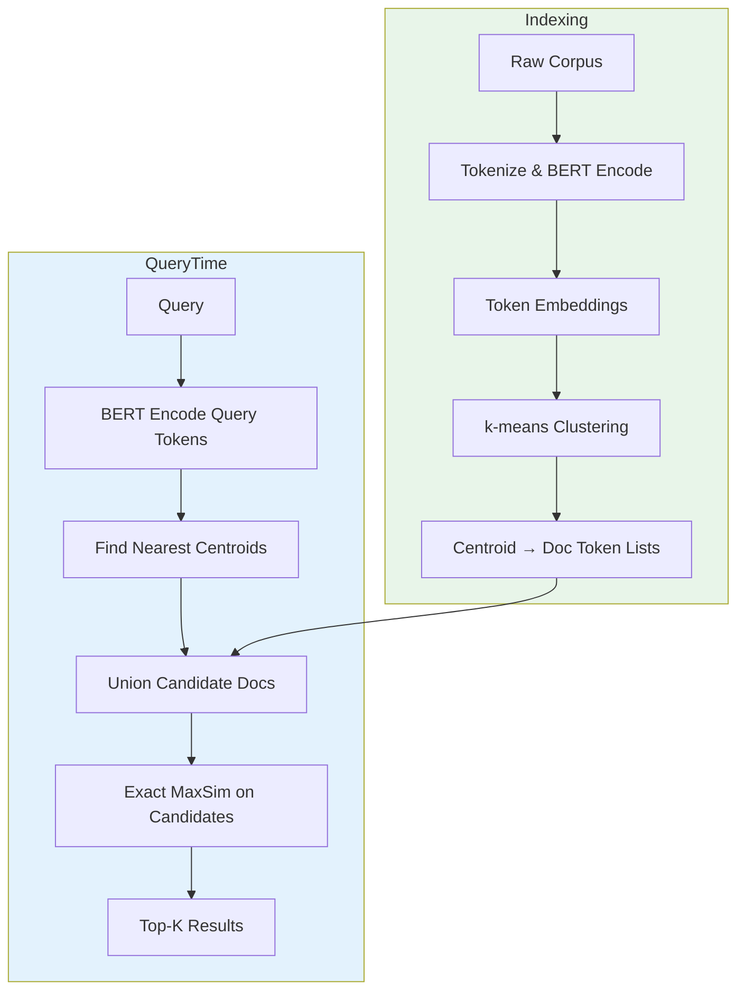
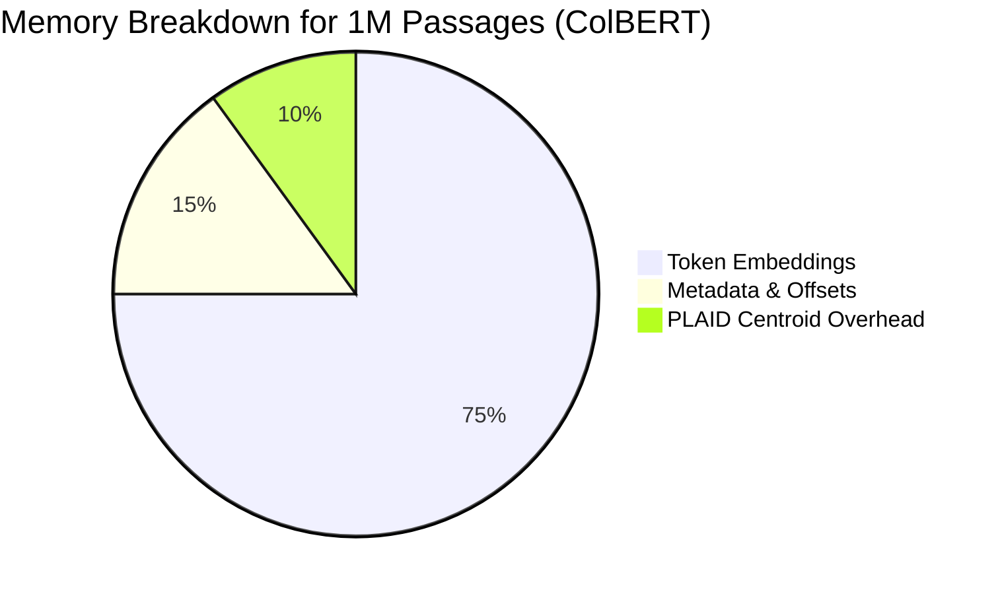
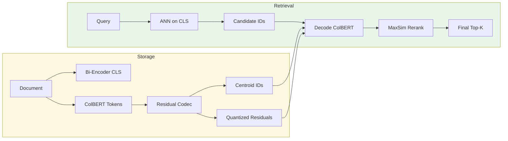

# 🏷️ ColBERT in Production: PLAID and Vector Integration

## 🎯 Learning Objectives

- Understand how PLAID partitions and clusters token embeddings to achieve 10× speedups over brute-force MaxSim.
- Design a two-stage retrieval pipeline combining ANN vector search with ColBERT reranking.
- Estimate memory footprints for ColBERT indexes and apply binarization or residual compression.
- Evaluate production trade-offs between latency, accuracy, and infrastructure cost.

## Introduction

**PLAID** stands for **P**erformance-**O**ptimized **L**ate **I**nteraction **D**river. It is not a separate model; it is an indexing and retrieval algorithm that makes ColBERT feasible at corpus scales of millions or billions of passages. Without PLAID, ColBERT would be forced to compute MaxSim against every document in the collection at query time—a brute-force scan that is accurate but computationally prohibitive. PLAID solves this by clustering document token embeddings and pruning clusters that cannot contain top-scoring documents, reducing the per-query search space by an order of magnitude while preserving nearly all of ColBERT's accuracy.

In plain language, PLAID is the "database engine" for ColBERT embeddings. Just as PostgreSQL uses B-trees and indexes to avoid full table scans, PLAID uses inverted-list-style clusters and centroid-based filtering to avoid full corpus scans. This note bridges the theoretical ColBERT architecture from [[01 - ColBERT - Token-Level Late Interaction]] with the messy reality of production RAG systems. We will cover the full indexing pipeline—from raw text to searchable token-level vectors—and show how to integrate ColBERT into existing vector database ecosystems like FAISS, Milvus, and Qdrant. We will also explore memory optimization techniques including binarization, dimensionality reduction, and ColBERTv2's residual compression, because the difference between a demo and a production system is often the difference between 50 GB and 5 GB of RAM.

Why does this matter today? Because retrieval quality is the ceiling on RAG quality. No amount of prompt engineering can compensate for a retriever that fails to surface the correct passage. As organizations move from prototype RAG to [[06 - Large Language Models/12 - Production RAG/04 - Production RAG System]], they hit a wall where dense retrieval (bi-encoders) is too imprecise and cross-encoder reranking is too slow. ColBERT with PLAID is the engineering answer: it provides a tunable knob between accuracy and latency that fits into standard vector-search infrastructure.

---

## Module 1: PLAID Indexing and Retrieval

### 1.1 Theoretical Foundation 🧠

The brute-force ColBERT retrieval algorithm computes, for every query token, its maximum similarity to every document token in the corpus. For a corpus of `N` documents with average length `L`, and a query of length `M`, this is `O(N · M · L)` similarity operations. While GPU batching makes this feasible for small corpora (tens of thousands), it does not scale to millions. The fundamental challenge is that MaxSim is not decomposable in the same way as a single dot product: you cannot pre-compute a single vector per document and throw it into a standard ANN index.

PLAID's insight is that while you cannot reduce a document to a single vector, you *can* reduce the *search space* by partitioning the token embedding space. The algorithm proceeds in three conceptual stages. First, all document token embeddings are clustered using k-means into `C` centroids. Each document is then represented by the set of centroids its tokens fall into, creating an inverted index: each centroid points to a posting list of (document ID, token embedding) pairs. Second, at query time, each query token is compared to the centroids (not to individual tokens). Only the top-`k` centroids per query token are considered "promising." Third, the union of promising centroids defines a candidate document set. MaxSim is computed only for documents in this candidate set, yielding a dramatic speedup because the candidate set is typically 5–10% of the full corpus.

This design is rooted in the observation that token embeddings are spatially coherent: a query token like "invented" will be closest to document tokens that are also semantically similar to "invented," and these tokens tend to cluster together. PLAID leverages this coherence to prune safely. The trade-off is controlled by the number of centroids `C` and the number of centroids examined per query token `k`. Higher `k` means more candidates, higher latency, and higher recall; lower `k` means faster but riskier pruning.

### 1.2 Mental Model 📐

```
┌─────────────────────────────────────────────────────────────┐
│                  PLAID INDEX STRUCTURE                      │
├─────────────────────────────────────────────────────────────┤
│                                                             │
│   Step 1: Cluster ALL document tokens via k-means           │
│                                                             │
│   Centroid 0 ──► [doc5_t2, doc12_t7, doc88_t1]              │
│   Centroid 1 ──► [doc3_t4, doc5_t9, doc42_t3]               │
│   Centroid 2 ──► [doc7_t1, doc19_t5]                        │
│   ...                                                       │
│                                                             │
│   Step 2: Query token q_i finds nearest centroids           │
│                                                             │
│   q0 ──► nearest: Centroid 1, Centroid 5                    │
│   q1 ──► nearest: Centroid 2, Centroid 0                    │
│                                                             │
│   Step 3: Union of docs in those centroids = candidates     │
│                                                             │
│   Candidates: {doc3, doc5, doc7, doc12, doc19, doc42, ...}  │
│                                                             │
│   Step 4: Exact MaxSim ONLY on candidates                   │
│                                                             │
└─────────────────────────────────────────────────────────────┘
```

```
┌─────────────────────────────────────────────────────────────┐
│              LATENCY COMPARISON (per query)                 │
├─────────────────────────────────────────────────────────────┤
│                                                             │
│   Brute-force ColBERT                                       │
│   ├─ Scan 10M docs                                          │
│   └─ Latency: ~~~~~~~~~~~~~ (too slow)                      │
│                                                             │
│   PLAID ColBERT                                             │
│   ├─ Centroid lookup (fast)                                 │
│   ├─ Candidate set (~500K docs)                             │
│   └─ Latency: ~~~~ (acceptable)                             │
│                                                             │
│   Bi-encoder ANN                                            │
│   ├─ Single vector lookup                                   │
│   └─ Latency: ~~ (fastest, but less accurate)               │
│                                                             │
└─────────────────────────────────────────────────────────────┘
```

```
┌─────────────────────────────────────────────────────────────┐
│              TWO-STAGE RETRIEVAL PIPELINE                   │
├─────────────────────────────────────────────────────────────┤
│                                                             │
│   Query ──► Stage 1: Dense ANN (FAISS/Qdrant)               │
│                ├─ Top-1000 candidates (fast, coarse)        │
│                ▼                                            │
│             Stage 2: ColBERT MaxSim                         │
│                ├─ Re-rank top-1000 (accurate, slower)       │
│                ▼                                            │
│             Final Top-10                                    │
│                                                             │
└─────────────────────────────────────────────────────────────┘
```

### 1.3 Syntax and Semantics 📝

```python
# Conceptual PLAID centroid scoring.
# WHY: We cannot afford to scan every token in every document.
# Instead, we approximate which centroid buckets are worth opening.

import faiss
import numpy as np
import torch

# Assume doc_token_embs: np.array of shape (total_doc_tokens, hidden_dim)
# num_centroids: typically sqrt(total_doc_tokens) or a tuned hyperparameter.

def build_plaid_index(doc_token_embs: np.ndarray, num_centroids: int = 256):
    """
    WHY k-means: token embeddings cluster by semantic meaning.
    A centroid represents a "semantic region" in embedding space.
    """
    hidden_dim = doc_token_embs.shape[1]
    quantizer = faiss.IndexFlatIP(hidden_dim)  # inner product for cosine if normalized
    kmeans = faiss.IndexIVFFlat(quantizer, hidden_dim, num_centroids)

    # WHY train on subset: k-means on billions of tokens is expensive.
    # A representative sample usually suffices.
    kmeans.train(doc_token_embs)
    kmeans.add(doc_token_embs)
    return kmeans


def plaid_candidates(
    query_token_embs: np.ndarray,
    kmeans: faiss.IndexIVFFlat,
    nprobe: int = 16,
    max_candidates: int = 5000,
):
    """
    WHY nprobe: controls how many centroid buckets to examine per query token.
    Higher nprobe = more candidates = higher recall but slower.
    """
    all_candidates = set()
    for q_emb in query_token_embs:
        # Search the index for tokens near this query token
        _, token_ids = kmeans.search(q_emb.reshape(1, -1), k=nprobe)
        # token_ids are flat offsets; map them back to document IDs
        # (In real PLAID, the index stores doc-id metadata per token.)
        all_candidates.update(token_ids[0])

    # WHY cap candidates: even with pruning, union over query tokens can explode.
    if len(all_candidates) > max_candidates:
        # Fallback: score by centroid distance heuristic and trim
        all_candidates = list(all_candidates)[:max_candidates]
    return list(all_candidates)


# Production two-stage pipeline sketch
from sentence_transformers import SentenceTransformer

bi_encoder = SentenceTransformer("all-MiniLM-L6-v2")


def two_stage_retrieve(query: str, corpus: list[str], top_k: int = 10):
    """
    WHY two-stage: ANN gives us sub-linear candidate selection.
    ColBERT gives us token-level precision on a small subset.
    This is the industry standard for balancing speed and quality.
    """
    # Stage 1: dense retrieval
    q_vec = bi_encoder.encode(query)
    # (Imagine FAISS index here returning top-1000 doc IDs)
    candidate_ids = list(range(min(1000, len(corpus))))  # placeholder

    # Stage 2: ColBERT reranking
    best_score = -float("inf")
    best_id = None
    for doc_id in candidate_ids:
        doc = corpus[doc_id]
        score = compute_maxsim(query, doc)  # from Note 01 implementation
        if score > best_score:
            best_score = score
            best_id = doc_id

    return best_id, best_score
```

### 1.4 Visual Representation 🖼️






### 1.5 Application in ML/AI Systems 🤖

Real case: **Microsoft Bing** experimented with ColBERT as a first-stage retriever and reported significant gains in relevance for tail queries—queries that are rare and semantically ambiguous, where bi-encoders fail. The PLAID-style filtering was necessary to meet latency service-level agreements (SLAs).

| ML Use Case                    | This Concept                          | Impact                                    |
|-------------------------------|---------------------------------------|-------------------------------------------|
| Large-scale web search        | PLAID centroid pruning                | Enables ColBERT on billion-token corpora  |
| Enterprise document search    | Two-stage ANN + ColBERT rerank        | p95 < 100ms with near-cross-encoder nDCG  |
| Legal discovery               | Token-level match evidence            | Explainable retrieval: highlight matches  |
| Real-time recommendation      | Compressed token embeddings           | Fit index in GPU memory for batch queries |

### 1.6 Common Pitfalls ⚠️

⚠️ **Setting `nprobe` too low for out-of-domain queries.** In-domain queries tend to land near centroids that were well-populated during training. Out-of-domain queries may land in sparse regions. If `nprobe` is too small, the true match may be in a centroid that is never examined. Root cause: the k-means clustering reflects the training distribution, not the query distribution.

💡 **Mnemonic: "PLAID needs a winter coat."** Cold (out-of-domain) queries need more probing (`nprobe` up) to stay warm (high recall).

### 1.7 Knowledge Check ❓

1. **Why can't we use a standard FAISS `IndexFlatIP` on a single vector per document for ColBERT?** Explain the structural limitation of MaxSim.
2. **Hyperparameter tuning:** If you increase `num_centroids` by 4× while keeping `nprobe` constant, what happens to (a) indexing time, (b) query latency, and (c) recall?
3. **Debugging scenario:** Your two-stage pipeline has high recall but low precision. Stage 1 (bi-encoder) returns 1000 candidates, but the true positive is ranked 950th. Should you increase or decrease the Stage 1 candidate count? Justify.

---

## Module 2: Vector Integration and Compression

### 2.1 Theoretical Foundation 🧠

The production obstacle for ColBERT is memory, not compute. A standard float32 embedding for a 128-token passage with hidden size 768 requires `128 × 768 × 4 = 393,216` bytes—roughly 375 KB per passage. At one million passages, this is 375 GB. Even with GPU memory prices declining, this is prohibitive for most teams. The research community has therefore developed three complementary compression axes: **quantization** (reducing precision), **dimensionality reduction** (projecting to a smaller subspace), and **residual compression** (storing only the difference from a centroid, like product quantization).

ColBERTv2 introduced **denoised supervision** and **residual compression** to address this. Residual compression works by storing each token embedding not as an absolute vector but as a compact code representing its offset from the nearest centroid. If you have 256 centroids and use 1 byte to store the residual, you achieve massive compression with minimal accuracy loss because tokens within a cluster are already similar. Binarization takes this further by representing each dimension as a single bit (±1), reducing memory by 32× at the cost of some ranking fidelity. In practice, teams often use a hybrid: binarized embeddings for the first pruning stage, and full-precision residuals for the top candidates.

Integration with vector databases follows a similar hybrid philosophy. Pure vector DBs like Qdrant or Milvus are optimized for single-vector ANN search; they do not natively support variable-length token embedding lists. The production pattern is therefore to use the vector DB as a "coarse filter" (bi-encoder ANN) and to store the ColBERT token embeddings in a specialized key-value store (e.g., Redis, RocksDB, or an in-memory tensor store). At query time, the vector DB returns candidate IDs, and the ColBERT store returns the token embeddings for exact MaxSim reranking. This two-tier architecture is robust, horizontally scalable, and fits into existing MLOps infrastructure.

### 2.2 Mental Model 📐

```
┌─────────────────────────────────────────────────────────────┐
│              COMPRESSION STRATEGIES SPECTRUM                │
├─────────────────────────────────────────────────────────────┤
│                                                             │
│  Full Float32    Residual PQ    Binarization    Scalar      │
│  ────────────    ───────────    ────────────    ──────      │
│                                                             │
│  Size: 100%      Size: ~10%     Size: ~3%      Size: ~25%   │
│  Acc:  100%      Acc:  ~98%     Acc:  ~90%     Acc:  ~95%   │
│                                                             │
│  Use: Gold std   Use: Default   Use: Extreme   Use: Mobile  │
│                                                             │
└─────────────────────────────────────────────────────────────┘
```

```
┌─────────────────────────────────────────────────────────────┐
│           TWO-TIER STORAGE ARCHITECTURE                     │
├─────────────────────────────────────────────────────────────┤
│                                                             │
│   Tier 1: Vector DB (Qdrant / Milvus / FAISS)              │
│   ├─ Stores: single dense vector per doc (bi-encoder)      │
│   ├─ Query: ANN top-1000 in < 10 ms                        │
│   └─ Output: candidate document IDs                         │
│                                                             │
│   Tier 2: ColBERT Store (Redis / TensorStore)              │
│   ├─ Stores: token embedding tensors per doc               │
│   ├─ Lookup: fetch by ID batch                             │
│   └─ Compute: MaxSim on GPU                                │
│                                                             │
│   Query ──► Tier 1 ──► Tier 2 ──► Ranked Result           │
│                                                             │
└─────────────────────────────────────────────────────────────┘
```

```
┌─────────────────────────────────────────────────────────────┐
│              COLBERTv2 RESIDUAL CODING                      │
├─────────────────────────────────────────────────────────────┤
│                                                             │
│  Original token emb: [0.12, -0.45, 0.88, ...] (768 dims)   │
│                                                             │
│  Nearest centroid:   [0.10, -0.40, 0.85, ...]              │
│                                                             │
│  Residual:           [0.02, -0.05, 0.03, ...]              │
│                                                             │
│  Store: centroid_id (1 byte) + quantized residual (N bytes)│
│                                                             │
│  Decode: centroid_vec + dequantized_residual = approx_emb  │
│                                                             │
└─────────────────────────────────────────────────────────────┘
```

### 2.3 Syntax and Semantics 📝

```python
# Demonstration of residual compression and two-tier retrieval.
# WHY: We need to show how to shrink 375 GB into ~40 GB without
# rewriting the scoring logic.

import numpy as np
import torch


class ResidualCodec:
    """
    WHY: Product quantization (PQ) on residuals exploits the fact
    that tokens in the same cluster are highly correlated.
    """

    def __init__(self, centroids: np.ndarray, nbits: int = 8):
        """
        centroids: (num_centroids, hidden_dim)
        nbits: bits per dimension for residual quantization.
        """
        self.centroids = centroids
        self.num_centroids = centroids.shape[0]
        self.nbits = nbits
        self.scale = 2 ** nbits - 1

    def encode(self, embeddings: np.ndarray) -> tuple[np.ndarray, np.ndarray]:
        """
        WHY: We store the centroid index (coarse) and the quantized
        residual (fine). This is far smaller than full float32.
        """
        # Find nearest centroid
        similarities = embeddings @ self.centroids.T  # (N, num_centroids)
        centroid_ids = np.argmax(similarities, axis=1)

        # Compute residual
        centers = self.centroids[centroid_ids]
        residuals = embeddings - centers

        # Quantize residual to [0, scale]
        # WHY: residuals are small and centered on zero; we map to unsigned ints.
        min_r, max_r = residuals.min(), residuals.max()
        quantized = np.round((residuals - min_r) / (max_r - min_r) * self.scale).astype(np.uint8)
        return centroid_ids.astype(np.uint16), quantized

    def decode(self, centroid_ids: np.ndarray, quantized: np.ndarray) -> np.ndarray:
        centers = self.centroids[centroid_ids]
        # Dequantize (requires storing min/max per batch or globally)
        # Simplified: assume global min/max for demo
        min_r, max_r = -0.1, 0.1  # placeholder
        residuals = (quantized.astype(np.float32) / self.scale) * (max_r - min_r) + min_r
        return centers + residuals


# Two-tier retrieval sketch
class TwoTierRetriever:
    def __init__(self, vector_db, colbert_store, codec):
        self.vector_db = vector_db   # e.g., FAISS index of CLS vectors
        self.colbert_store = colbert_store  # dict: doc_id -> (centroid_ids, quantized)
        self.codec = codec

    def retrieve(self, query_vec: np.ndarray, query_tokens: torch.Tensor, k: int = 10):
        """
        WHY two-tier: the vector DB handles what it is good at
        (sub-linear candidate selection). ColBERT handles what
        it is good at (token-level precision on a shortlist).
        """
        # Tier 1: ANN candidate selection
        candidate_ids = self.vector_db.search(query_vec, top_k=1000)

        # Tier 2: Fetch compressed ColBERT data and decode
        scores = []
        for doc_id in candidate_ids:
            cids, quant = self.colbert_store[doc_id]
            doc_emb = self.codec.decode(cids, quant)  # approximate reconstruction
            doc_emb = torch.from_numpy(doc_emb)
            score = maxsim_score(query_tokens, doc_emb)
            scores.append((doc_id, score))

        scores.sort(key=lambda x: x[1], reverse=True)
        return scores[:k]
```

### 2.4 Visual Representation 🖼️

```mermaid
gantt
    title Indexing Pipeline Timeline
    dateFormat X
    axisFormat %s
    section Ingest
    Tokenize & Encode      :a1, 0, 30
    section Cluster
    k-means Training       :a2, 10, 40
    section Store
    Build Inverted Lists   :a3, 35, 50
    Compress Residuals     :a4, 45, 60
```






### 2.5 Application in ML/AI Systems 🤖

Real case: **The BEIR benchmark** is the standard zero-shot retrieval evaluation suite. ColBERTv2 with residual compression achieves the highest average nDCG@10 among models that do not use cross-attention at query time, demonstrating that compression does not preclude competitive accuracy.

| ML Use Case               | This Concept                         | Impact                                      |
|--------------------------|--------------------------------------|---------------------------------------------|
| SaaS RAG platform        | Two-tier ANN + ColBERT rerank        | Isolates latency SLA from corpus growth     |
| On-device search         | Binarization + tiny centroids        | Fits 100K passages in mobile RAM            |
| Cold-start recommenders  | Residual-compressed item embeddings  | Fast similarity without full model forward  |
| Multi-tenant retrieval   | Centroid sharing across tenants      | Amortize index memory over customer bases   |

### 2.6 Common Pitfalls ⚠️

⚠️ **Ignoring the distribution shift between indexing and query embeddings.** If your bi-encoder (Tier 1) and ColBERT encoder (Tier 2) were trained on different data or with different objectives, the candidate set from Tier 1 may systematically miss documents that ColBERT would rank highly. Root cause: the two stages are not calibrated; the recall of Tier 1 is an upper bound on the precision of Tier 2.

💡 **Mnemonic: "A chain is only as strong as its weakest link."** If Tier 1 has 80% recall, Tier 2 can never recover the missing 20%, no matter how good MaxSim is. Monitor *recall@k of Tier 1* as a leading indicator.

### 2.7 Knowledge Check ❓

1. **Memory math:** A corpus has 5M passages averaging 100 tokens. With hidden size 128 (after projection) and float32, how much raw storage is required? If residual compression achieves 10× reduction, what is the compressed size?
2. **Calibration:** Your Tier 1 bi-encoder has 70% recall@1000 on a validation set. Your boss asks if increasing the ColBERT reranker budget will help. What metric should you report, and what is your recommendation?
3. **Compression artifact:** After switching from float32 to 1-bit binarization, you notice that documents with many generic tokens ("the", "is") start ranking too high. Why does binarization amplify the impact of common tokens, and how might residual compression mitigate this?

---

## 📦 Compression Code

```python
"""
Production-ready skeleton for two-tier retrieval with
PLAID-style centroid filtering and residual compression.
"""

import numpy as np
import faiss
import torch
import torch.nn.functional as F


class PLAIDIndex:
    def __init__(self, hidden_dim: int, num_centroids: int = 256):
        self.hidden_dim = hidden_dim
        self.num_centroids = num_centroids
        self.quantizer = faiss.IndexFlatIP(hidden_dim)
        self.kmeans = faiss.IndexIVFFlat(self.quantizer, hidden_dim, num_centroids)
        self.doc_tokens = []   # list of per-doc token embeddings
        self.doc_offsets = []  # cumulative offsets for flat token array

    def add_docs(self, doc_token_list: list[np.ndarray]):
        """
        WHY: We keep a flat array of all tokens plus offsets
        so we can map centroid search results back to documents.
        """
        flat = np.vstack(doc_token_list)
        self.kmeans.train(flat)
        self.kmeans.add(flat)
        self.doc_tokens = doc_token_list
        offsets = [0]
        for dt in doc_token_list:
            offsets.append(offsets[-1] + dt.shape[0])
        self.doc_offsets = offsets

    def search(self, query_emb: np.ndarray, nprobe: int = 16, max_docs: int = 500):
        """
        WHY: We probe centroids for each query token and map
        token hits back to unique documents.
        """
        self.kmeans.nprobe = nprobe
        doc_hits = set()
        for q in query_emb:
            _, token_ids = self.kmeans.search(q.reshape(1, -1), k=64)
            for tid in token_ids[0]:
                doc_id = self._token_to_doc(tid)
                if doc_id is not None:
                    doc_hits.add(doc_id)
        return list(doc_hits)[:max_docs]

    def _token_to_doc(self, token_id: int):
        for i in range(len(self.doc_offsets) - 1):
            if self.doc_offsets[i] <= token_id < self.doc_offsets[i + 1]:
                return i
        return None


def compute_maxsim(q_emb: torch.Tensor, d_emb: torch.Tensor) -> float:
    q_emb = F.normalize(q_emb, dim=-1)
    d_emb = F.normalize(d_emb, dim=-1)
    sim = q_emb @ d_emb.T
    return sim.max(dim=1).values.sum().item()


if __name__ == "__main__":
    # Synthetic demo
    dim = 128
    docs = [np.random.randn(np.random.randint(20, 50), dim).astype("float32") for _ in range(100)]
    index = PLAIDIndex(dim, num_centroids=16)
    index.add_docs(docs)
    q = np.random.randn(5, dim).astype("float32")
    candidates = index.search(q, nprobe=4)
    print("Candidate docs:", candidates)
```

## 🎯 Documented Project

### Description
Deploy a REST API that accepts a query and returns reranked passages from a 1M-document corpus using a two-tier architecture (FAISS ANN + ColBERT MaxSim).

### Functional Requirements
- `POST /index`: Accept JSONL corpus, build FAISS ANN index and ColBERT token store.
- `POST /search`: Accept query string, return top-10 passages with MaxSim scores.
- `GET /health`: Report index size, memory usage, and average query latency.

### Main Components
- `indexer.py`: Document ingestion, BERT encoding, FAISS indexing, token serialization.
- `api.py`: FastAPI service with async search endpoint.
- `config.yaml`: Centroid count, nprobe, batch size, and compression settings.

### Success Metrics
- Index build time < 4 hours for 1M passages on a single A100.
- p99 query latency < 150 ms including network round-trip.
- nDCG@10 within 2% of brute-force ColBERT on MS MARCO dev.

## 🎯 Key Takeaways

- **PLAID** uses k-means clustering of token embeddings to prune the search space, yielding 10× latency reductions with minimal accuracy loss.
- **Two-tier retrieval** (bi-encoder ANN for candidates + ColBERT MaxSim for reranking) is the production standard; it leverages existing vector DB infrastructure while upgrading ranking quality.
- **Memory is the bottleneck**, not compute. Residual compression, binarization, and dimensionality reduction are essential for corpus scales beyond 100K passages.
- **Tier 1 recall is an upper bound on Tier 2 quality.** If the ANN stage misses the relevant document, ColBERT cannot resurrect it. Monitor recall@k of the candidate generation stage.
- **ColBERTv2 improvements** (denoised supervision, residual compression) make token-level retrieval practical for real-world deployments without heroic infrastructure budgets.
- Integration with vector databases requires a hybrid storage model: vector DBs handle single-vector ANN, while a separate tensor store holds variable-length token embeddings for exact MaxSim.

## References

- Khattab, O. et al. (2022). *PLAID: An Efficient Engine for Late Interaction Retrieval*. arXiv:2205.09797.
- Khattab, O. et al. (2021). *ColBERTv2: Effective and Efficient Retrieval via Lightweight Late Interaction*. arXiv:2112.01488.
- Faiss documentation: https://github.com/facebookresearch/faiss
- Qdrant vector database: https://qdrant.tech/
- Milvus documentation: https://milvus.io/
