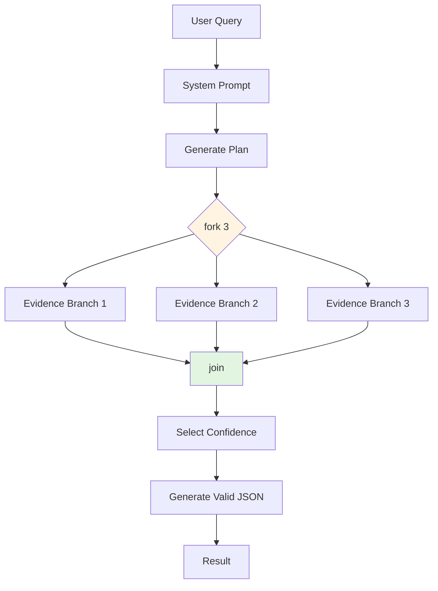
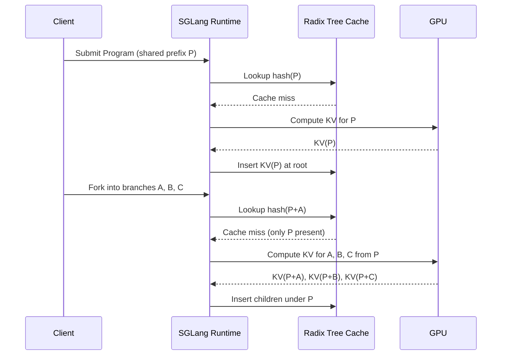
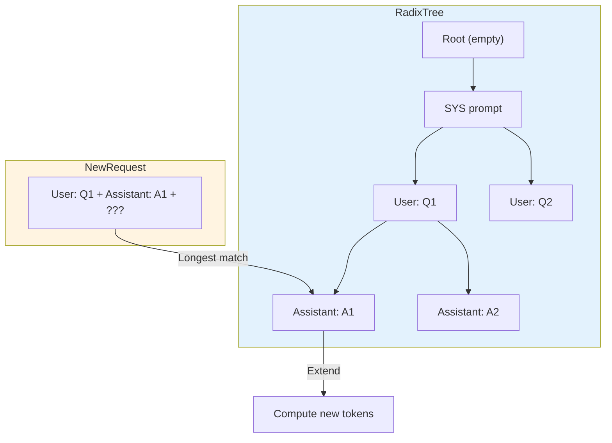
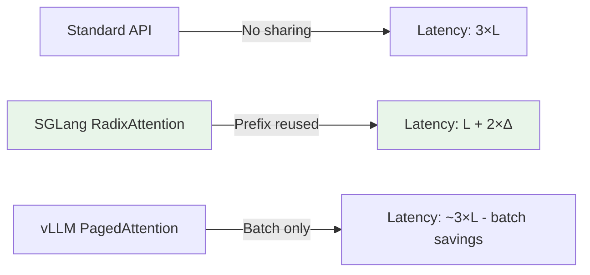

# 🏷️ SGLang: Structured Generation and RadixAttention

## 🎯 Learning Objectives

- Articulate why standard LLM inference APIs fail for multi-step programs and what SGLang's DSL fixes.
- Explain RadixAttention's radix-tree KV cache sharing with concrete examples of prefix reuse, fork, and branch.
- Write SGLang programs using `gen()`, `select()`, `fork()`, and control flow primitives.
- Compare SGLang with vLLM's PagedAttention and identify workloads where SGLang achieves 2–5× speedups.

## Introduction

**SGLang** stands for **S**tructured **G**eneration **Lang**uage. The name tells you exactly what it is: a language for writing programs whose primitive operations are calls to a large language model, with the guarantee that the *structure* of the program—not just the prompts—drives execution. In standard LLM inference (OpenAI API, HuggingFace `generate`, vLLM), each request is an isolated string. If your application is a simple Q&A, this is fine. But modern AI systems are not simple Q&A; they are programs. They loop, branch, validate JSON schemas, run LLM-as-a-Judge over multiple candidate outputs, and spawn parallel reasoning paths. In these programs, the same system prompt, the same conversation history, and the same reasoning prefixes are processed again and again, wasting enormous amounts of compute.

SGLang was built on the observation that LLM programs have structure that the runtime can exploit. If Step 2 of your program branches into three parallel evaluations, those three branches share the KV cache from Step 1. If a user's second turn in a chat app starts with the same system prompt and history as their first turn, the KV cache is reused automatically. This is not memoization at the application layer; it is automatic, content-addressed KV cache reuse inside the inference engine. The mechanism is called **RadixAttention**: a radix tree (prefix tree) that indexes all KV caches by the hash of their token sequence. When a new request arrives, SGLang walks the tree to find the longest matching prefix and only computes the new suffix.

Why is this cutting-edge in 2025–2026? Because the industry is shifting from "prompt engineering" to "LLM programming." Agents, multi-step tool use, and structured output generation are the dominant application patterns. vLLM revolutionized single-request batching with PagedAttention, but it treats every request as independent. SGLang is the first production system optimized for *programs*, not prompts. Benchmarks on structured generation workloads—JSON schema enforcement, parallel candidate evaluation, multi-turn dialogue—consistently show 2–5× throughput improvements over vLLM because SGLang eliminates redundant prefix computation across the program graph. For teams running LLM-as-a-Judge pipelines or agent loops at scale, this is the difference between economic viability and burning cloud credits.

This note connects naturally to [[06 - Large Language Models/13 - vLLM and Advanced RAG/00 - Welcome to vLLM and Advanced RAG]]; SGLang is the evolutionary next step for serving structured LLM programs. It also complements [[06 - Large Language Models/12 - Production RAG/04 - Production RAG System]], where structured generation is often used to validate retrieved outputs before presenting them to users.

---

## Module 1: The SGLang DSL and Structured Generation

### 1.1 Theoretical Foundation 🧠

Traditional LLM inference exposes a function `generate(prompt) -> text`. This interface is convenient but semantically impoverished. It forces the developer to encode all structure—branching, validation, repetition—into raw strings, and it forces the inference engine to treat every call as a black box. The result is massive redundancy. Consider a multi-step agent: Turn 1 generates a plan; Turn 2 executes the first tool call; Turn 3 observes the result and decides the next step. In a standard API, Turn 2 must re-process the system prompt and Turn 1 output. Turn 3 must re-process the system prompt, Turn 1 output, and Turn 2 output. The cost is quadratic in the number of turns.

SGLang reifies the program structure into a domain-specific language. The key primitives are:
- `gen(name, ...)`: Generate text and bind it to a variable.
- `select(name, choices=[...])`: Constrain the next token to one of a discrete set, enabling classification without free-form generation.
- `fork(n)`: Split the program into `n` parallel branches that share the prefix KV cache.
- Control flow: standard Python `if`, `for`, and function calls interleave with LLM primitives.

The theoretical advance is that these primitives expose *intention* to the runtime. When the SGLang compiler sees `fork(3)`, it knows that three sequences will diverge from a common prefix, and it can schedule them as a single batched decode step with shared KV pages. When it sees a long shared prompt across multiple requests, it builds a radix tree and reuses the cached attention keys and values. This is not possible with opaque string APIs because the runtime cannot see the sharing pattern.

Structured decoding constraints (regex, JSON schema, context-free grammars) are another pillar. Standard inference samples tokens greedily or with temperature and hopes the output is valid JSON. SGLang integrates constrained decoding into the sampler: at each step, the logits mask is intersected with the set of tokens that keep the partial output conformant to the schema. This guarantees syntactic correctness without post-hoc parsing and retry loops, reducing both latency and token waste.

### 1.2 Mental Model 📐

```
┌─────────────────────────────────────────────────────────────┐
│           STANDARD API vs. SGLang PROGRAM                   │
├─────────────────────────────────────────────────────────────┤
│                                                             │
│  Standard API (repeated work):                              │
│  Turn 1: [SYS] + [Turn1]  ──► compute KV                   │
│  Turn 2: [SYS] + [Turn1] + [Turn2] ──► recompute SYS+T1    │
│  Turn 3: [SYS] + [Turn1] + [Turn2] + [Turn3] ──► recompute │
│                                                             │
│  SGLang Program (shared prefix):                            │
│  [SYS] + [Turn1] ──► compute KV once ──► cache node A      │
│       ├─► [Turn2a]  (extends A)                            │
│       ├─► [Turn2b]  (extends A)                            │
│       └─► [Turn2c]  (extends A)                            │
│                                                             │
│  Only new suffix tokens are computed.                       │
│                                                             │
└─────────────────────────────────────────────────────────────┘
```

```
┌─────────────────────────────────────────────────────────────┐
│                 SGLang PRIMITIVE MAP                        │
├─────────────────────────────────────────────────────────────┤
│                                                             │
│  gen(name="answer", regex=r"\d+")                           │
│   └── Generate and bind; sampler constrained by regex       │
│                                                             │
│  select(name="sentiment", choices=["pos","neg","neu"])      │
│   └── Classify without open-ended generation                │
│                                                             │
│  fork(3)                                                    │
│   └── Split into 3 branches; KV pages shared via refcount   │
│                                                             │
│  @function                                                  │
│   └── Reusable sub-program; compiled once, cached forever   │
│                                                             │
└─────────────────────────────────────────────────────────────┘
```

```
┌─────────────────────────────────────────────────────────────┐
│              STRUCTURED DECODING LAYERS                     │
├─────────────────────────────────────────────────────────────┤
│                                                             │
│  User Schema: {"name": str, "age": int}                     │
│       │                                                     │
│       ▼                                                     │
│  Grammar Compiler ──► Token-level FSM                       │
│       │                                                     │
│       ▼                                                     │
│  Sampler: logits ──► mask invalid tokens ──► sample         │
│       │                                                     │
│       ▼                                                     │
│  Guaranteed valid JSON output (no retries)                  │
│                                                             │
└─────────────────────────────────────────────────────────────┘
```

### 1.3 Syntax and Semantics 📝

```python
# A complete SGLang program demonstrating gen, select, fork,
# and structured decoding with a JSON schema.
# WHY: This is not pseudo-code; it mirrors the actual SGLang API.

import sglang as sgl


@sgl.function
def multi_hop_qa(s, question: str):
    """
    WHY @sgl.function: compiles the program graph ahead of time,
    allowing the runtime to plan batching and cache reuse.
    """
    # Shared system prompt: computed once and cached
    s += sgl.system("You are a careful reasoning assistant.")

    # Step 1: generate a reasoning plan
    s += sgl.user(f"Question: {question}\nPlan your reasoning.")
    s += sgl.assistant(sgl.gen("plan", max_tokens=128))

    # Step 2: fork into parallel evidence-gathering branches
    # WHY fork: each branch shares the plan's KV cache.
    # The runtime schedules them as a single batched decode.
    forks = s.fork(3)
    for i, f in enumerate(forks):
        f += sgl.user(f"Gather evidence from perspective {i+1}.")
        f += sgl.assistant(sgl.gen(f"evidence_{i}", max_tokens=64))

    # Step 3: merge branches and classify confidence
    # WHY join: concatenates branch outputs back into the main sequence
    s.join(forks)
    s += sgl.user("Synthesize and select confidence level.")
    s += sgl.assistant(
        sgl.select("confidence", choices=["high", "medium", "low"])
    )

    # Step 4: structured final answer (JSON schema enforcement)
    s += sgl.user("Return the final answer as JSON.")
    s += sgl.assistant(
        sgl.gen(
            "answer_json",
            json_schema={
                "type": "object",
                "properties": {
                    "answer": {"type": "string"},
                    "citations": {"type": "array", "items": {"type": "string"}},
                },
                "required": ["answer", "citations"],
            },
        )
    )


# Execution against a backend (e.g., SGLang runtime with RadixAttention)
if __name__ == "__main__":
    # WHY: the runtime handles RadixAttention, batching, and grammar FSMs.
    sgl.set_default_backend(sgl.RuntimeEndpoint("http://localhost:30000"))
    state = multi_hop_qa.run(question="What is the capital of Assyria?")
    print(state["answer_json"])
```

### 1.4 Visual Representation 🖼️






### 1.5 Application in ML/AI Systems 🤖

Real case: **Berkeley AI Research** uses SGLang to serve evaluation pipelines for LLM-as-a-Judge, where the same rubric and reference answer are prepended to thousands of model outputs. RadixAttention shares the rubric prefix across all evaluations, cutting serving costs by ~60%.

| ML Use Case               | This Concept                     | Impact                                           |
|--------------------------|----------------------------------|--------------------------------------------------|
| LLM-as-a-Judge           | Shared prefix KV caching         | 3× throughput on evaluation fleets               |
| Multi-step agents        | Fork/join + structured decoding  | Deterministic tool calls without retry loops     |
| JSON API generation      | Regex/schema-constrained `gen()` | Zero invalid payloads, no post-processing          |
| A/B testing prompts      | Parallel branches with shared KV | Compare N prompts at marginal compute cost         |

### 1.6 Common Pitfalls ⚠️

⚠️ **Assuming SGLang replaces vLLM for all workloads.** If your workload is single-turn, stateless chat with no shared prefixes (e.g., random user questions), RadixAttention provides no benefit and SGLang's overhead is wasted. Root cause: the speedup comes from *structural reuse*, not from faster matrix kernels.

💡 **Mnemonic: "SGLang is a carpool lane."** It only saves time when multiple requests (or branches) share a common route (prefix). If everyone drives solo, it's just another lane.

### 1.7 Knowledge Check ❓

1. **In the `multi_hop_qa` program, which tokens are guaranteed to hit the RadixAttention cache on the second fork branch, and which tokens must be computed fresh?**
2. **Schema evolution:** You change the JSON schema in `gen()` to require an additional field. Why does SGLang not need to recompute the KV cache for the shared prefix, and what component *does* need to be recompiled?
3. **Design critique:** A colleague proposes implementing `fork()` at the client level by launching three separate HTTP requests with the same prompt prefix. Write two sentences explaining why this fails to achieve the latency benefits of SGLang's runtime-level fork.

---

## Module 2: RadixAttention and Runtime Architecture

### 2.1 Theoretical Foundation 🧠

The attention mechanism in transformers is the dominant cost in autoregressive decoding. For a sequence of length `L`, computing attention from scratch requires `O(L²)` operations and produces Key (K) and Value (V) tensors of size `O(L · d)` that must be stored for future tokens. In standard inference servers, the KV cache is managed per request: when a request finishes, its cache is discarded. This is logical for stateless APIs but disastrous for programs where prefixes recur.

RadixAttention introduces a **content-addressed** KV cache. The key insight is that a prefix of tokens has a deterministic KV representation regardless of what comes after it. If two requests begin with the same 500 tokens, those 500 tokens produce identical K and V matrices. Instead of storing KV caches in a request-scoped page table (as vLLM's PagedAttention does), RadixAttention stores them in a global radix tree keyed by the hash of the token sequence. Each node in the tree represents a token suffix; the path from the root to a node represents a full prefix. When a new request arrives, the runtime hashes its token prefix and walks the tree to find the longest match. It then allocates only the *remaining* suffix tokens for fresh computation.

This design elegantly handles three patterns that are common in LLM programs but impossible to optimize with request-scoped caches:
1. **Prefix reuse across independent requests:** Multiple users submit prompts with the same system message.
2. **Fork and join:** A program splits into parallel branches that diverge after a shared prefix.
3. **Multi-turn conversation:** Turn N shares all tokens from Turns 1..N-1.

The radix tree also implements an LRU eviction policy at the node level. When GPU memory is full, leaf nodes (suffixes) are evicted before internal nodes (shared prefixes), maximizing the probability that future requests can still hit the common trunk. This is a direct application of the observation that shared prefixes are more valuable than unique suffixes because they serve more future requests.

### 2.2 Mental Model 📐

```
┌─────────────────────────────────────────────────────────────┐
│                 RADIX TREE KV CACHE                         │
├─────────────────────────────────────────────────────────────┤
│                                                             │
│  Root (empty)                                               │
│   │                                                         │
│   ├─ [SYS] ──► KV(SYS)                                    │
│   │    │                                                    │
│   │    ├─ [User: Hi] ──► KV(SYS+Hi)                       │
│   │    │      │                                             │
│   │    │      ├─ [Bot: Hello] ──► KV(SYS+Hi+Hello)        │
│   │    │      │                                             │
│   │    │      └─ [Bot: Hey] ──► KV(SYS+Hi+Hey)            │
│   │    │                                                    │
│   │    └─ [User: Bye] ──► KV(SYS+Bye)                     │
│   │                                                         │
│   └─ [ALT_SYS] ──► KV(ALT_SYS)                            │
│                                                             │
│  New request "SYS + User: Hi + Bot: Hello + ???"           │
│  ──► Walk tree to KV(SYS+Hi+Hello), compute only ???       │
│                                                             │
└─────────────────────────────────────────────────────────────┘
```

```
┌─────────────────────────────────────────────────────────────┐
│              PAGEDATTENTION vs RADIXATTENTION               │
├─────────────────────────────────────────────────────────────┤
│                                                             │
│  PagedAttention (vLLM)                                      │
│  ├─ Memory managed in fixed-size pages per request          │
│  ├─ Pages freed when request ends                           │
│  └─ Sharing: only within a single batch (copy-on-write)     │
│                                                             │
│  RadixAttention (SGLang)                                    │
│  ├─ Memory managed in a global radix tree                   │
│  ├─ Nodes persist across requests                           │
│  └─ Sharing: automatic by content hash across all history   │
│                                                             │
│  Analogy:                                                   │
│  PagedAttention = process memory (isolated per PID)         │
│  RadixAttention = content-addressed filesystem (deduped)    │
│                                                             │
└─────────────────────────────────────────────────────────────┘
```

```
┌─────────────────────────────────────────────────────────────┐
│              FORK/JOIN KV PAGE SHARING                      │
├─────────────────────────────────────────────────────────────┤
│                                                             │
│  Step 1: Shared prefix P                                    │
│           [P] ──► KV pages: [PPPP]                          │
│                                                             │
│  Step 2: fork(2)                                            │
│           Branch A: [PPPP] + [AA]  (refcount = 2)           │
│           Branch B: [PPPP] + [BB]  (refcount = 2)           │
│                                                             │
│  Step 3: Branch A extends                                   │
│           Branch A: [PPPP] + [AAA]  (copy-on-write new A)   │
│                                                             │
│  WHY refcount: allows in-place sharing until a branch       │
│  writes, minimizing memory copies.                          │
│                                                             │
└─────────────────────────────────────────────────────────────┘
```

### 2.3 Syntax and Semantics 📝

```python
# Demonstrating RadixAttention behavior via the SGLang runtime API.
# WHY: Understanding the runtime primitives is essential for
# debugging cache hit rates and designing efficient programs.

import sglang as sgl


@sgl.function
def structured_classification(s, text: str):
    """
    WHY: A real-world pattern—classify text, then generate
    a structured report. Both steps share the input text prefix.
    """
    shared_prefix = f"Analyze the following text and respond.\nText: {text}\n"
    s += shared_prefix

    # First generation: classification label
    s += "Label: "
    s += sgl.select("label", choices=["spam", "ham", "uncertain"])

    # Second generation: explanation conditioned on label
    # WHY: RadixAttention reuses KV(shared_prefix + label) automatically.
    s += "\nExplanation: "
    s += sgl.gen("explanation", max_tokens=64)


def inspect_cache(runtime_endpoint: str):
    """
    WHY: Production debugging requires visibility into cache hit rates.
    SGLang exposes metrics on the radix tree size and reuse statistics.
    """
    import requests
    resp = requests.get(f"{runtime_endpoint}/get_cache_info")
    info = resp.json()
    print(f"Radix tree nodes: {info['num_nodes']}")
    print(f"Cache hit rate: {info['hit_rate']:.2%}")
    print(f"Evicted nodes (LRU): {info['evicted_nodes']}")


# Launching the runtime with explicit cache configuration
# WHY: cache size is a critical production parameter.
if __name__ == "__main__":
    backend = sgl.Runtime(
        model_path="meta-llama/Llama-2-7b-chat-hf",
        radix_cache=True,          # Enable RadixAttention
        max_radix_cache_tokens=40960,  # Cap memory usage
    )
    sgl.set_default_backend(backend)

    # First call warms the cache with the system/prompt prefix
    state1 = structured_classification.run(text="Buy cheap watches now!!!")
    print(state1["label"])

    # Second call with SAME prefix hits cache, only label/explanation computed
    state2 = structured_classification.run(text="Buy cheap watches now!!!")
    print(state2["label"])

    inspect_cache("http://localhost:30000")
```

### 2.4 Visual Representation 🖼️






### 2.5 Application in ML/AI Systems 🤖

Real case: **LMSYS** (the team behind the Chatbot Arena) uses SGLang to serve judge models that evaluate hundreds of thousands of model responses daily. The evaluation rubric is a long, shared system prompt; RadixAttention reduces the per-evaluation cost to the marginal cost of scoring the response itself.

| ML Use Case                  | This Concept                   | Impact                                         |
|-----------------------------|--------------------------------|------------------------------------------------|
| Multi-turn chatbots         | Automatic prefix KV reuse      | p50 latency drops 50% after turn 1             |
| Tree-of-Thought reasoning   | Fork into N reasoning paths    | Evaluate 16 branches at cost of 1 prefix       |
| Batch JSON generation       | Schema-constrained decode      | 100% valid JSON, 2× faster than retry loops    |
| Agent tool loops            | join + stateful cache          | Retain tool context without quadratic slowdown |

### 2.6 Common Pitfalls ⚠️

⚠️ **Forgetting that KV cache eviction is LRU and memory-bounded.** If your radix cache size is too small for the working set of prefixes, the most valuable shared nodes may be evicted by bursty unique traffic. Root cause: the cache does not know which prefixes are "important"; it only knows which were accessed recently.

💡 **Mnemonic: "Radix tree roots run deep."** Ensure your cache budget is large enough to hold the common trunk prefixes; shallow caches evict the shared roots and destroy the multi-request speedup.

### 2.7 Knowledge Check ❓

1. **Trace the radix tree insertion:** A program runs `fork(2)` producing branches `A` and `B`, then branch `A` runs `fork(2)` producing `A1` and `A2`. Draw the tree structure (root → P → A → A1/A2, root → P → B) and indicate where refcounts are > 1.
2. **Cache sizing:** Your system prompt is 500 tokens. You expect 100 concurrent users with unique follow-ups. If each follow-up is 50 tokens and your cache budget is 30K tokens, will the system prompt likely remain cached? Show your math.
3. **Comparison:** vLLM's PagedAttention uses copy-on-write *within a batch* to share prefixes. Explain why this still misses the optimization that RadixAttention captures when the same prefix appears in *subsequent* batches.

---

## 📦 Compression Code

```python
"""
Minimal demonstration of structured generation concepts:
- Constrained decoding with regex
- Programmatic fork/join pattern
- Prefix reuse via manual cache tracking (conceptual RadixAttention)
"""

import re
from typing import List


class SimplePrefixCache:
    """
    WHY: Conceptual stand-in for RadixAttention.
    In production, use sglang.Runtime with radix_cache=True.
    """

    def __init__(self):
        self.cache = {}  # token_sequence_str -> (k_cache, v_cache)

    def lookup(self, tokens: List[int]):
        # WHY: longest prefix match simplified to exact match for demo
        key = tuple(tokens)
        return self.cache.get(key)

    def store(self, tokens: List[int], kv):
        self.cache[tuple(tokens)] = kv


class RegexConstrainedSampler:
    """
    WHY: Shows how structured decoding works at the token level.
    A real engine compiles regex to a DFA and masks logits per step.
    """

    def __init__(self, vocab: dict[int, str], pattern: str):
        self.vocab = vocab
        self.pattern = re.compile(pattern)

    def valid_tokens(self, prefix: str) -> List[int]:
        valid = []
        for tid, token_str in self.vocab.items():
            candidate = prefix + token_str
            if self.pattern.match(candidate) or self.pattern.search(candidate):
                valid.append(tid)
        return valid


if __name__ == "__main__":
    cache = SimplePrefixCache()
    # Simulate: prefix computed once
    prefix_tokens = [101, 2023, 2003]
    cache.store(prefix_tokens, kv="fake_kv")

    # Simulate: new request with same prefix
    hit = cache.lookup(prefix_tokens)
    print("Cache hit:", hit is not None)

    sampler = RegexConstrainedSampler(
        vocab={1: "{", 2: "}", 3: "a", 4: "1"},
        pattern=r"\{[a-z]+\}",
    )
    print("Valid next tokens after '{':", sampler.valid_tokens("{"))
```

## 🎯 Documented Project

### Description
Build an LLM-as-a-Judge microservice that evaluates generated answers against a rubric. Use SGLang to enforce a structured output schema and exploit RadixAttention for rubric prefix reuse across evaluation batches.

### Functional Requirements
- `POST /evaluate`: Accept batch of `(answer, rubric_id)` pairs; return structured scores.
- Rubrics are long system prompts loaded from a registry; they must be cached and shared.
- Output schema: `{"overall": int, "dimensions": {"accuracy": int, "clarity": int}}`.
- `GET /metrics`: Report cache hit rate, average tokens computed vs. cached, and p99 latency.

### Main Components
- `judge.py`: SGLang program with `select()` for dimension scores and `gen()` for JSON output.
- `service.py`: FastAPI batching layer that groups evaluations by rubric to maximize prefix sharing.
- `config.yaml`: Cache size limits, model endpoint, and concurrency settings.

### Success Metrics
- Cache hit rate > 80% for repeated rubrics in a batch of 100 evaluations.
- p99 latency < 300 ms per evaluation when rubric prefix is warm.
- 100% schema validity on output JSON (zero parse failures).

## 🎯 Key Takeaways

- **SGLang is a language for LLM programs**, not just an inference server. It exposes program structure (`gen`, `select`, `fork`) to the runtime, enabling optimizations impossible with opaque string APIs.
- **RadixAttention** stores KV caches in a global content-addressed radix tree, automatically sharing prefixes across requests, branches, and conversation turns. This is the key differentiator from vLLM's request-scoped PagedAttention.
- **Structured decoding constraints** (regex, JSON schema) are enforced at the sampler level, guaranteeing valid outputs and eliminating costly retry loops.
- **The speedup is workload-dependent:** SGLang excels on multi-step agents, parallel evaluation, and multi-turn chat. For purely random, single-turn prompts, the benefits are minimal.
- **Production tuning requires monitoring cache hit rates and sizing the radix cache** to retain high-value shared prefixes against eviction pressure.
- SGLang naturally complements retrieval pipelines from [[06 - Large Language Models/12 - Production RAG/04 - Production RAG System]]: retrieved context becomes a shared prefix for structured answer generation.

## References

- Zheng, L. et al. (2023). *Efficiently Programming Large Language Models Using Structured Generation Language*. arXiv:2312.07104.
- SGLang documentation: https://github.com/sgl-project/sglang
- vLLM & PagedAttention: [[06 - Large Language Models/13 - vLLM and Advanced RAG/00 - Welcome to vLLM and Advanced RAG]]
- LMSYS Blog on SGLang serving: https://lmsys.org/blog/
