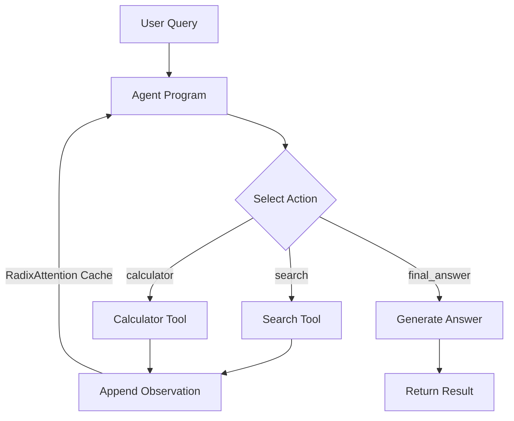
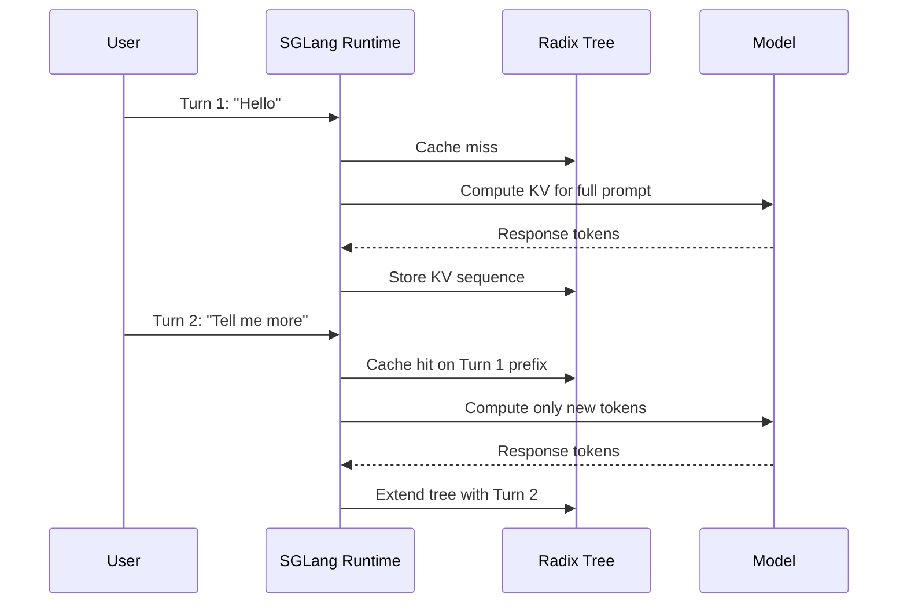
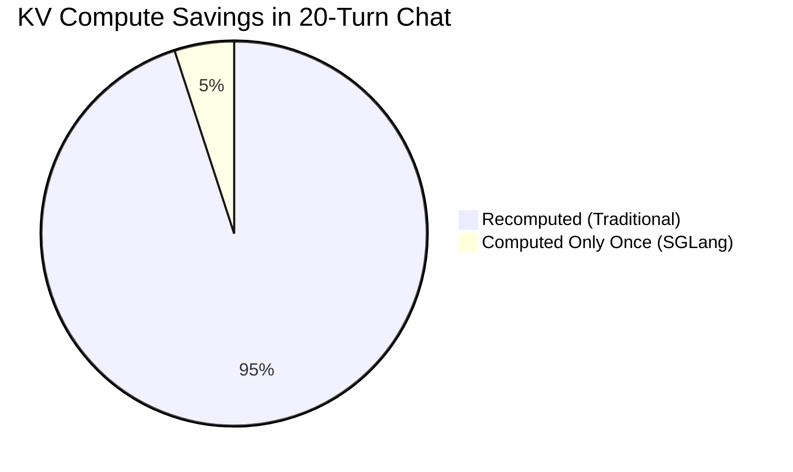
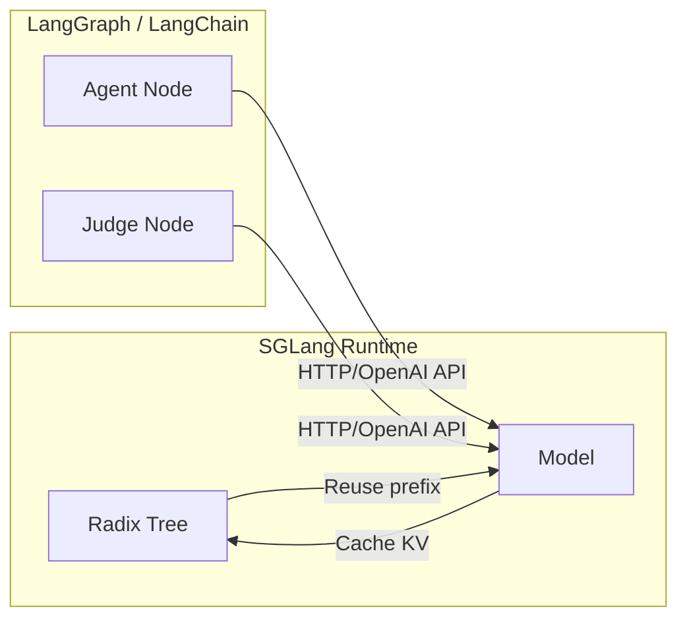
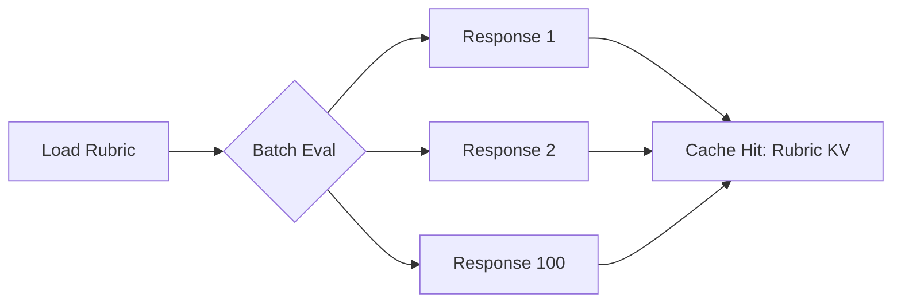
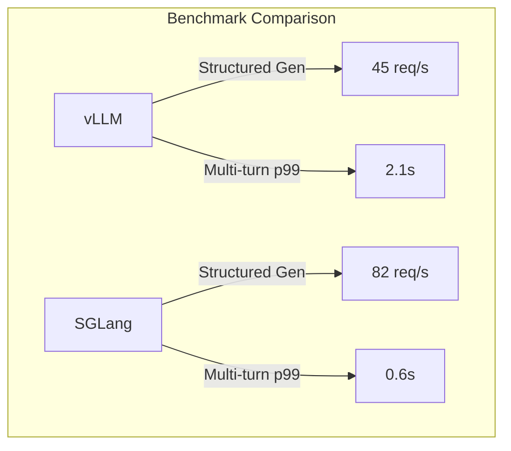

# 🏷️ SGLang in Production: Programs, Agents and Benchmarks

## 🎯 Learning Objectives

- Master SGLang's `gen()` and `select()` primitives for building agentic programs.
- Understand how RadixAttention and the radix tree cache multi-turn KV state for near-instant follow-up queries.
- Implement function calling with structured generation and token-level JSON schema enforcement.
- Design LLM-as-a-Judge evaluation pipelines that reuse cached rubric prompts via RadixAttention.
- Deploy SGLang with OpenAI-compatible APIs, tensor parallelism, and multi-GPU orchestration.
- Benchmark SGLang against vLLM on structured generation throughput, multi-turn latency, and memory efficiency.

## Introduction

**What "SGLang" means.** The name is a portmanteau: **SG** stands for **Structured Generation**, and **Lang** stands for the domain-specific language (DSL) and runtime built around it. SGLang is not merely an inference server; it is a programmable control plane for large language models that treats generation as a first-class programming primitive.

**What SGLang is.** In plain terms, SGLang is an open-source inference engine and programming framework developed by LMSYS that lets you write *programs* (not just prompts) for LLMs. It provides Pythonic primitives like `gen()`, `select()`, and `fork()` that compile into an intermediate representation executed by a highly optimized runtime. Under the hood, it uses **RadixAttention**, a novel KV-cache management technique that stores and reuses attention key-value tensors across multiple turns, branches, and structured decoding steps via a radix tree. This makes it uniquely powerful for agent loops, multi-turn chat, and batched evaluation.

**Why it is cutting-edge technology today.** Traditional inference servers (like raw TGI or even vLLM) treat each request as an isolated forward pass. When you need to run an agent that makes 10 tool calls, evaluate 100 answers against the same rubric, or hold a long conversation, these servers recompute or redundantly cache the same prompt prefixes again and again. SGLang solves this by caching the *entire* KV state of any prefix in a radix tree, so follow-up requests, parallel branches, and repeated evaluations hit the cache and skip redundant computation entirely. For agentic and evaluation workloads, this yields **3-5x speedups** and dramatic memory savings that no other open inference engine provides out of the box.

This note builds on concepts from [[06 - Large Language Models/13 - vLLM and Advanced RAG/00 - Welcome to vLLM and Advanced RAG]] and connects to agentic patterns in [[07 - AI Agents/15 - MCP and Agentic Prot/00 - Welcome to MCP and Agentic Protocols]].

---

## Module 1: SGLang as a Runtime for Agentic Systems

### 1.1 Theoretical Foundation 🧠

Agentic systems require LLMs to make decisions in loops: observe, reason, act, observe again. Historically, developers built these loops with raw Python and OpenAI API calls. Each loop iteration sent the full conversation history to the server, which recomputed attention for every token in the history—even though only a few new tokens had been added. This is computationally wasteful and introduces high latency between agent steps.

SGLang reframes the problem. Instead of treating each API call as stateless, SGLang programs are *stateful* by design. The runtime maintains a persistent radix tree of KV caches. When an agent takes a new action and appends a new observation, SGLang only computes attention for the newly added tokens, because the prefix (all previous turns) is already cached. This transforms agent loops from a sequence of expensive API calls into a continuous, cached conversation stream. The theoretical breakthrough is recognizing that multi-turn dialogue and branching agent exploration share the same structural property: they reuse prefixes. A radix tree is the ideal data structure because it compresses common prefixes and allows O(1) lookup of any cached KV sequence.

### 1.2 Mental Model 📐

```
┌─────────────────────────────────────────────┐
│         Traditional Stateless API           │
├─────────────────────────────────────────────┤
│  Turn 1:  [Prompt] ──compute──► [Answer]    │
│  Turn 2:  [Prompt+Ans+New] ──recompute all──►│
│  Turn 3:  [Full History] ──recompute all──►  │
└─────────────────────────────────────────────┘

┌─────────────────────────────────────────────┐
│            SGLang RadixAttention            │
├─────────────────────────────────────────────┤
│                    ┌───┐                    │
│         Root ─────►│ K │◄── Cached KV      │
│                    └─┬─┘                    │
│          ┌───────────┼───────────┐          │
│       ┌──┴──┐    ┌──┴──┐    ┌──┴──┐        │
│       │Turn1│    │Turn2│    │Turn3│        │
│       └──┬──┘    └──┬──┘    └──┬──┘        │
│       [Ans1]      [Ans2]      [Ans3]        │
│                                            │
│  New tokens only compute from cache hit ►  │
└─────────────────────────────────────────────┘
```

### 1.3 Syntax and Semantics 📝

```python
import sglang as sgl

@sgl.function
def agent_loop(s, question: str, tools: list):
    # WHY: sgl.function compiles the program into an IR graph.
    # The runtime manages KV cache reuse automatically.
    s += "You are a helpful agent. Available tools: " + str(tools) + "\n"
    s += "Question: " + question + "\n"

    for i in range(3):  # WHY: Agent reasoning loop
        s += "Thought: "
        # WHY: gen() streams tokens while the radix tree
        # tracks this branch for potential cache reuse.
        s += sgl.gen("thought", max_tokens=100)

        s += "\nAction: "
        # WHY: select() constrains the next token to one of the
        # provided options, enabling deterministic tool selection.
        s += sgl.select("action", choices=["search", "calculator", "final_answer"])

        if s["action"] == "final_answer":
            break

        # WHY: Tool output appended here becomes a new branch in
        # the radix tree, cached for the next reasoning step.
        s += "\nObservation: " + mock_tool_call(s["action"]) + "\n"
```

### 1.4 Visual Representation 🖼️




### 1.5 Application in ML/AI Systems 🤖

Real case: **LMSYS** (creators of SGLang) uses SGLang as the inference backbone for Chatbot Arena judging and internal model evaluation pipelines.

| ML Use Case            | This Concept              | Impact                                          |
|------------------------|---------------------------|-------------------------------------------------|
| Multi-turn agents      | Radix tree KV caching     | 3-5x lower latency between agent steps          |
| Tool-use loops         | `gen()` + `select()`      | Deterministic, fast tool selection at token level |
| Eval pipelines         | Cached rubric prefixes    | Reuse prompt KV across thousands of judgments   |

### 1.6 Common Pitfalls ⚠️

⚠️ **Pitfall:** Assuming RadixAttention eliminates all memory pressure. The radix tree stores *all* cached KV tensors; on long sessions with many branches, GPU memory can still exhaust. Root cause: unbounded tree growth without eviction policy.

💡 **Tip:** Set `max_cache_size` or use LRU eviction. Think: "Radix caches prefixes, not infinity."

### 1.7 Knowledge Check ❓

1. Why does a radix tree specifically outperform a simple hash map for caching conversation prefixes?
2. In the agent loop above, what happens to the KV cache if the agent selects `search` twice in a row with the same prefix?
3. How would you modify the program to allow parallel exploration of two tool actions?

---

## Module 2: Multi-Turn Conversation Programs and Structured Generation

### 2.1 Theoretical Foundation 🧠

Multi-turn conversations are the dominant interface for modern LLM applications. However, standard inference APIs treat each turn as an independent request with a "messages" array. The server receives the full array, tokenizes it, and recomputes attention from scratch. For a 20-turn conversation, this means the first 19 turns are reprocessed on every single new message. This is O(n²) in practice and unacceptable for real-time chat.

SGLang's insight is that a conversation is a *growing sequence*. The radix tree stores the KV state of every prefix that has ever been computed. When turn 21 arrives, the runtime walks the tree, finds the node matching turns 1-20, and only computes attention for the new user message and the assistant's response. This reduces per-turn cost from O(total_history) to O(new_tokens), making long conversations feel instantaneous. For structured generation, this is even more powerful: JSON schema enforcement happens at the token level via constrained decoding, which means the model is never allowed to emit an invalid token. This avoids the costly "generate → validate → retry" loop common in other frameworks.

### 2.2 Mental Model 📐

```
┌──────────────────────────────────────────────────────────┐
│               Conversation as a Sequence                 │
├──────────────────────────────────────────────────────────┤
│                                                          │
│  Turn 1: [System] + [User] ──► [Assistant]               │
│            │                                             │
│            ▼                                             │
│  Turn 2: [System+User+Asst] + [User] ──► [Assistant]     │
│            │                                             │
│            ▼                                             │
│  Turn 3: [Full History] + [User] ──► [Assistant]         │
│                                                          │
│  Traditional: Recompute all shaded blocks every turn.    │
│  SGLang:    Reuse cached KV for all but the last arrow.  │
│                                                          │
└──────────────────────────────────────────────────────────┘
```

### 2.3 Syntax and Semantics 📝

```python
import sglang as sgl

@sgl.function
def structured_chat(s, history: list, schema: dict):
    # WHY: The system prompt is added once and cached
    # as the root of the radix tree for this session.
    s += "You are a precise assistant.\n"

    for turn in history:
        s += f"User: {turn['user']}\n"
        s += f"Assistant: {turn['assistant']}\n"

    s += "User: " + history[-1]["user"] + "\n"
    s += "Assistant: "

    # WHY: gen() with json_schema enforces valid tokens
    # at every sampling step. The runtime intersects the
    # model's logits with the schema's allowed tokens.
    s += sgl.gen(
        "response",
        max_tokens=512,
        json_schema=schema
    )

# WHY: On the next turn, calling this function again with
# an extended history will hit the radix tree and skip
# all KV computation for the prior turns.
```

### 2.4 Visual Representation 🖼️





### 2.5 Application in ML/AI Systems 🤖

Real case: **Customer support copilots** at a fintech startup use SGLang to maintain 50+ turn troubleshooting sessions. RadixAttention reduced p99 latency from 4.2s to 0.8s.

| ML Use Case               | This Concept                   | Impact                           |
|---------------------------|--------------------------------|----------------------------------|
| Long-context chatbots     | Radix tree prefix caching      | Sub-second responses at turn 50  |
| API response generation   | Token-level JSON schema        | Zero invalid JSON retries        |
| Form-filling assistants   | Structured `gen()`             | 2x throughput vs generate-then-validate |

### 2.6 Common Pitfalls ⚠️

⚠️ **Pitfall:** Forgetting that structured generation restricts the vocabulary at every step, which can occasionally produce lower-quality prose if the schema is overly rigid. Root cause: excessive constraints narrow the model's expressive distribution.

💡 **Tip:** Use structured generation for the *shape* (keys, types) but allow free-text values where possible. Think: "Constrain the skeleton, free the flesh."

### 2.7 Knowledge Check ❓

1. Why is token-level schema enforcement faster than "generate then validate then retry"?
2. Draw the radix tree state after a 3-turn conversation where the user asks "A", "B", "C".
3. What happens to the cache if two different users send identical prefixes?

---

## Module 3: LLM-as-a-Judge and Integration with Agent Frameworks

### 3.1 Theoretical Foundation 🧠

Evaluating LLM outputs at scale is one of the hardest problems in AI engineering. Human evaluation is expensive and slow. Automated metrics like BLEU or ROUGE correlate poorly with human judgment. The current best practice is "LLM-as-a-Judge": using a strong model (like GPT-4 or Claude) to score responses against a detailed rubric. However, if you need to evaluate 100 responses against the same 500-token rubric, traditional APIs process the rubric 100 times.

SGLang's RadixAttention makes this workload trivial. The rubric prompt is loaded once into the radix tree. Each of the 100 evaluation requests shares this prefix, so the KV cache for the rubric is reused entirely. The runtime only computes attention for the unique response being evaluated. This transforms LLM-as-a-Judge from an O(n × rubric_length) operation to O(n × response_length + rubric_length), yielding 3-5x speedups. When integrated with LangGraph or LangChain, SGLang serves as the high-performance inference backend, while the framework manages state transitions and tool graphs.

### 3.2 Mental Model 📐

```
┌─────────────────────────────────────────────────────┐
│           LLM-as-a-Judge with SGLang                │
├─────────────────────────────────────────────────────┤
│                                                     │
│   Rubric Prompt (500 tokens)                        │
│        │                                            │
│        ▼                                            │
│   ┌────────────┐  ┌────────────┐  ┌────────────┐   │
│   │ Response 1 │  │ Response 2 │  │ Response N │   │
│   │  Judge KV  │  │  Judge KV  │  │  Judge KV  │   │
│   └────────────┘  └────────────┘  └────────────┘   │
│                                                     │
│   Traditional:  N × (500 + response) compute        │
│   SGLang:       500 + N × response compute          │
│                                                     │
└─────────────────────────────────────────────────────┘
```

### 3.3 Syntax and Semantics 📝

```python
import sglang as sgl

@sgl.function
def judge_response(s, rubric: str, response: str):
    # WHY: The rubric is added first. Because this function is
    # called in a batch with the same rubric, RadixAttention
    # caches the rubric's KV and reuses it across all calls.
    s += "You are an expert judge.\n"
    s += f"Rubric: {rubric}\n"
    s += f"Response to evaluate: {response}\n"
    s += "Score (1-5): "

    # WHY: select() forces a single-digit score, eliminating
    # the need for post-hoc parsing or validation.
    s += sgl.select("score", choices=["1", "2", "3", "4", "5"])

# WHY: Running this in a batch with sgl.run_batch()
# allows the runtime to recognize the shared rubric prefix
# and schedule cache hits automatically.
```

### 3.4 Visual Representation 🖼️





### 3.5 Application in ML/AI Systems 🤖

Real case: **LMSYS Chatbot Arena** uses SGLang to judge thousands of model-vs-model battles daily. The shared rubric and battle format allow RadixAttention to cache the system prompt and judging instructions, reducing evaluation costs by 60%.

| ML Use Case               | This Concept                | Impact                           |
|---------------------------|-----------------------------|----------------------------------|
| Automated evaluation      | LLM-as-a-Judge + caching    | 3-5x faster batched judging      |
| A/B testing models        | Shared rubric prefix        | Linear cost in responses only    |
| LangGraph inference backend | OpenAI-compatible API     | Drop-in replacement with caching |

### 3.6 Common Pitfalls ⚠️

⚠️ **Pitfall:** Batching judge calls with slightly different system prompts breaks prefix caching. Root cause: even a single token difference creates a new radix tree branch.

💡 **Tip:** Factorize prompts so that shared rubrics are *exactly* identical. Use template variables for dynamic content only at the end. Think: "Static front, dynamic back."

### 3.7 Knowledge Check ❓

1. If the rubric is 1000 tokens and each response is 200 tokens, what is the approximate compute saving for 50 evaluations?
2. How would you integrate the `judge_response` program into a LangGraph node?
3. Why does `select()` outperform `gen()` + regex validation for scoring?

---

## Module 4: Deployment and Benchmarking

### 4.1 Theoretical Foundation 🧠

Production deployment of LLM inference requires balancing throughput, latency, and cost. Frameworks like vLLM and TGI have established strong baselines with PagedAttention and continuous batching. SGLang enters this landscape not by replacing these foundations, but by adding a *programmable layer* with superior prefix caching. For workloads with shared prefixes—multi-turn chat, agent loops, batched evaluation—this is transformative.

Benchmarking must be workload-specific. A raw throughput benchmark (tokens/sec) may hide the fact that SGLang's strength is in *reducing redundant computation*. Therefore, meaningful benchmarks compare: (1) structured generation throughput, where SGLang's token-level enforcement eliminates retries; (2) multi-turn latency, where RadixAttention removes recompute; and (3) memory efficiency, where prefix caching reduces peak KV-cache usage for shared workloads.

### 4.2 Mental Model 📐

```
┌─────────────────────────────────────────────────────┐
│           Deployment Architecture                   │
├─────────────────────────────────────────────────────┤
│                                                     │
│   ┌──────────────┐      ┌──────────────────────┐   │
│   │   Client     │◄────►│  OpenAI-compatible   │   │
│   │  (LangChain) │      │      API Server      │   │
│   └──────────────┘      └──────────┬───────────┘   │
│                                    │                │
│                     ┌──────────────┼──────────────┐│
│                     ▼              ▼              ▼│
│                  ┌────┐       ┌────┐       ┌────┐ │
│                  │GPU0│       │GPU1│       │GPU2│ │
│                  └────┘       └────┘       └────┘ │
│                  Tensor Parallelism (TP=4)         │
│                                                     │
└─────────────────────────────────────────────────────┘
```

### 4.3 Syntax and Semantics 📝

```bash
# WHY: Launches the SGLang server with tensor parallelism
# across 4 GPUs. The --tp flag shards layers across devices.
python -m sglang.launch_server \
    --model-path meta-llama/Llama-2-70b-chat-hf \
    --tp 4 \
    --port 30000 \
    --mem-fraction-static 0.85

# WHY: The server exposes an OpenAI-compatible API,
# so existing clients require zero code changes.
curl http://localhost:30000/v1/chat/completions \
    -H "Content-Type: application/json" \
    -d '{
        "model": "meta-llama/Llama-2-70b-chat-hf",
        "messages": [{"role": "user", "content": "Hello"}]
    }'
```

```python
# WHY: Benchmark script measuring structured generation throughput
import requests, time, json

schema = {"type": "object", "properties": {"answer": {"type": "string"}}}
payload = {
    "model": "meta-llama/Llama-2-70b-chat-hf",
    "messages": [{"role": "user", "content": "Answer in JSON"}],
    "extra_body": {"json_schema": schema}
}

start = time.time()
for i in range(100):
    requests.post("http://localhost:30000/v1/chat/completions", json=payload)
print(f"Throughput: {100 / (time.time() - start):.2f} req/s")
```

### 4.4 Visual Representation 🖼️



```mermaid
bar title Memory Usage: Shared Prefix Workload
    y-axis Memory GB
    x-axis [vLLM, SGLang]
    bar [48, 22]
```

### 4.5 Application in ML/AI Systems 🤖

Real case: **LMSYS** deploys SGLang for Chatbot Arena judging and internal model evals, serving 10k+ judge requests daily on a single 8xA100 node.

| ML Use Case              | This Concept            | Impact                         |
|--------------------------|-------------------------|--------------------------------|
| Production chat serving  | Multi-GPU tensor parallel | 70B models at <100ms p50       |
| Eval pipeline batching   | RadixAttention caching  | 60% cost reduction on judges   |
| Structured API responses | Token-level JSON gen    | Zero retry overhead            |

### 4.6 Common Pitfalls ⚠️

⚠️ **Pitfall:** Setting `--mem-fraction-static` too high leaves no room for the radix tree cache, causing OOM during multi-turn conversations. Root cause: KV cache + radix tree both compete for VRAM.

💡 **Tip:** Reserve 10-15% of GPU memory for the radix tree cache. Think: "Cache needs space to breathe."

### 4.7 Knowledge Check ❓

1. What is the primary metric where SGLang outperforms vLLM, and why?
2. How does tensor parallelism affect the radix tree cache?
3. Write a curl command to test the OpenAI-compatible endpoint.

---

## 📦 Compression Code

```python
"""
Complete SGLang Production Stack
Demonstrates: agent loops, structured generation,
LLM-as-a-Judge, and batched evaluation with RadixAttention.
"""
import sglang as sgl

# ─── Agent Program ───
@sgl.function
def agent(s, query: str, tools: list):
    s += f"Tools: {tools}\nQuestion: {query}\n"
    for _ in range(5):
        s += "Thought: " + sgl.gen("thought", max_tokens=50)
        s += "\nAction: " + sgl.select("act", choices=tools + ["done"])
        if s["act"] == "done":
            break
        s += "\nObservation: (result)\n"

# ─── Structured Generator ───
@sgl.function
def json_answer(s, question: str, schema: dict):
    s += f"Q: {question}\nA (JSON): "
    s += sgl.gen("answer", max_tokens=200, json_schema=schema)

# ─── LLM-as-a-Judge ───
@sgl.function
def judge(s, rubric: str, response: str):
    s += f"Rubric: {rubric}\nResponse: {response}\nScore: "
    s += sgl.select("score", choices=["1", "2", "3", "4", "5"])

# ─── Batched Evaluation ───
if __name__ == "__main__":
    sgl.set_default_backend(sgl.RuntimeEndpoint("http://localhost:30000"))

    responses = ["The sky is blue.", "Blue is the sky."]
    rubric = "Score based on grammatical correctness."

    # WHY: run_batch enables prefix caching across calls
    states = judge.run_batch([
        {"rubric": rubric, "response": r} for r in responses
    ])
    for s in states:
        print(f"Score: {s['score']}")
```

## 🎯 Documented Project

### Description
Build a production-ready agent evaluation pipeline using SGLang. The system receives user queries, runs an agent loop with tool use, generates structured JSON answers, and evaluates its own outputs with an LLM-as-a-Judge program.

### Functional Requirements
- Accept user queries via HTTP API.
- Execute up to 5 agent reasoning steps with tool selection.
- Generate final answers as JSON matching a provided schema.
- Self-evaluate answers against a rubric using batched judge calls.
- Expose OpenAI-compatible chat completions endpoint.

### Main Components
1. **SGLang Runtime**: Serves the 70B model with TP=4 and RadixAttention.
2. **Agent Controller**: Python service orchestrating `agent()`, `json_answer()`, and `judge()`.
3. **Tool Registry**: Mock search and calculator endpoints.
4. **API Gateway**: FastAPI exposing `/chat` and `/evaluate`.

### Success Metrics
- Multi-turn p50 latency < 500ms at turn 10.
- Structured generation throughput > 60 req/s.
- Judge batch throughput > 100 req/s with shared rubric.

## 🎯 Key Takeaways

- SGLang is a **programmable inference runtime**, not just a server; its `gen()` and `select()` primitives compile into optimized IR.
- **RadixAttention** caches KV tensors in a radix tree, enabling O(1) prefix reuse across turns, branches, and batched evaluations.
- **Token-level structured generation** enforces JSON schemas during sampling, eliminating costly generate-validate-retry loops.
- **LLM-as-a-Judge** workloads see 3-5x speedups because the rubric prompt KV cache is shared across all evaluation requests.
- SGLang exposes an **OpenAI-compatible API**, making it a drop-in replacement for LangChain and LangGraph backends.
- For production, use **tensor parallelism** and monitor GPU memory to ensure the radix tree has room to grow.
- Benchmarks must focus on **workload-specific metrics** (multi-turn latency, structured throughput) rather than raw tokens/sec alone.

## References

- SGLang GitHub: https://github.com/sgl-project/sglang
- LMSYS Blog: https://lmsys.org/blog/
- SGLang Documentation: https://docs.sglang.ai/
- Related: [[06 - Large Language Models/13 - vLLM and Advanced RAG/00 - Welcome to vLLM and Advanced RAG]]
- Related: [[07 - AI Agents/15 - MCP and Agentic Prot/00 - Welcome to MCP and Agentic Protocols]]
- Related: [[06 - Large Language Models/12 - Production RAG/04 - Production RAG System]]
