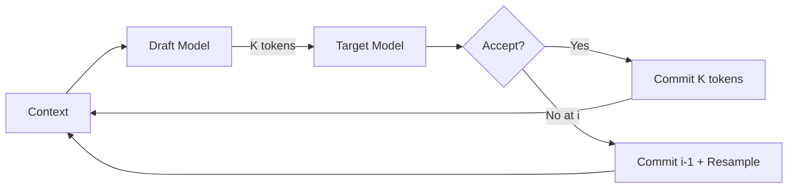
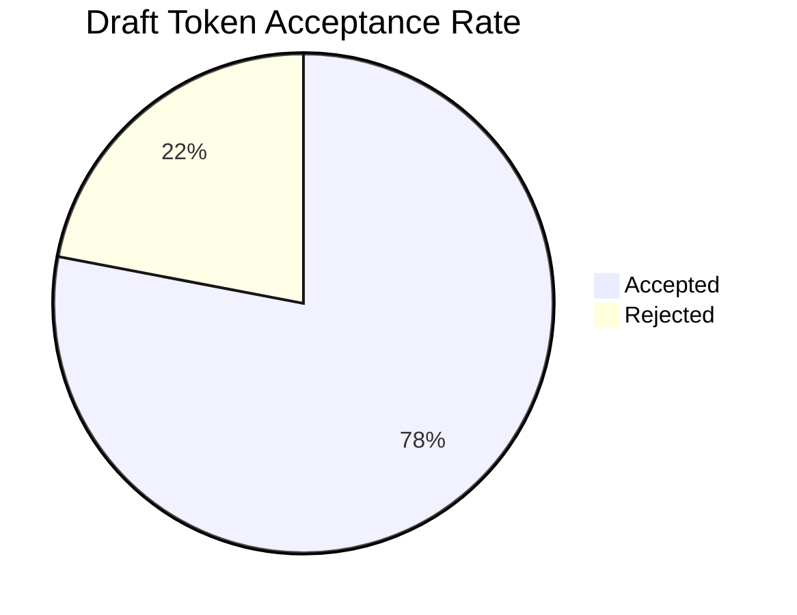
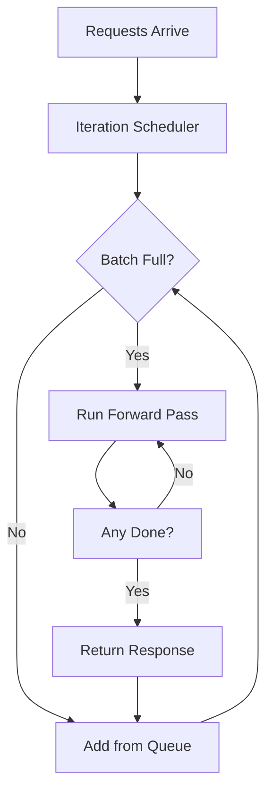
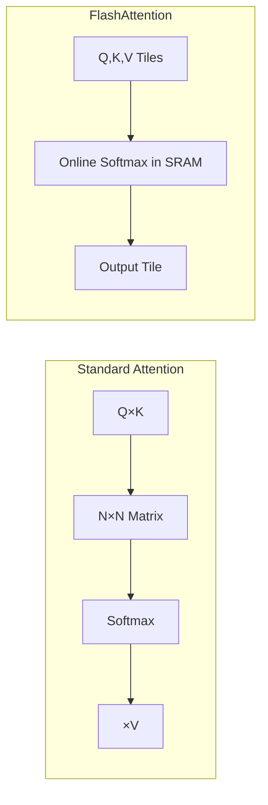
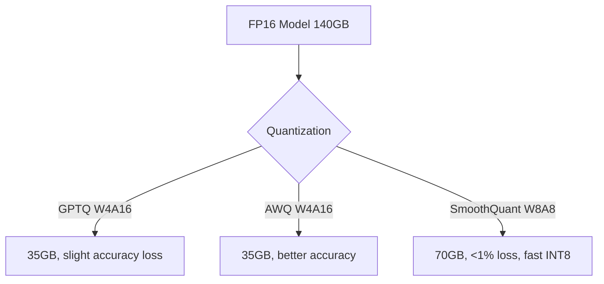
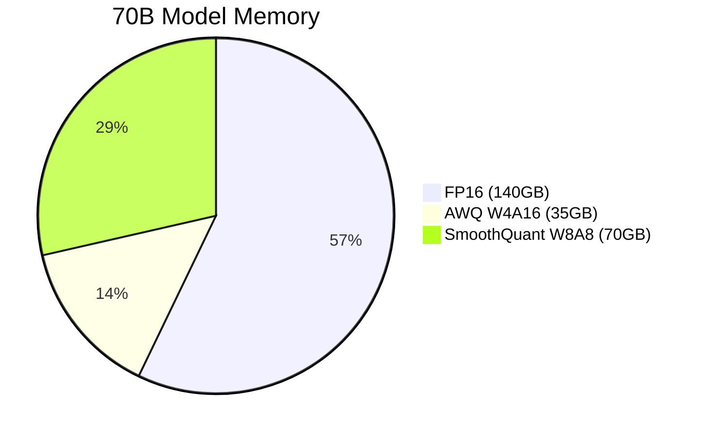
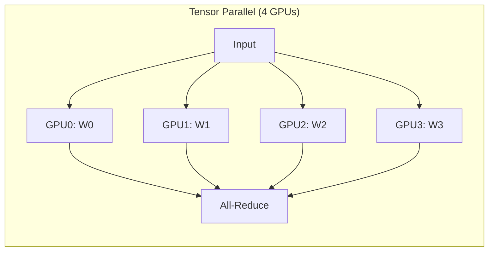
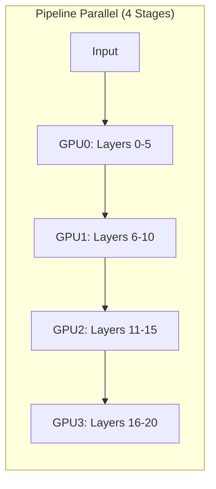
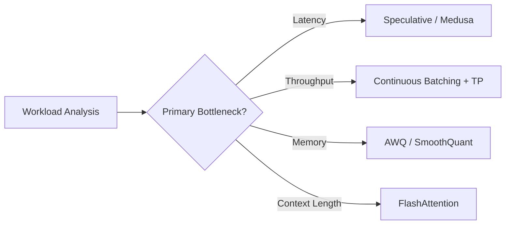

# 🏷️ Advanced Inference Optimization

## 🎯 Learning Objectives

- Understand the mechanics of speculative decoding and why a small draft model can accelerate a large target model by 2-3x.
- Master continuous batching (in-flight scheduling) and explain why it maximizes GPU utilization compared to static batching.
- Explain FlashAttention and FlashDecoding at the algorithmic level and their impact on long-context inference.
- Compare quantization strategies (GPTQ, AWQ, SmoothQuant) in terms of accuracy, speed, and hardware compatibility.
- Differentiate tensor parallelism from pipeline parallelism and explain when to combine them.
- Evaluate Medusa and Lookahead Decoding as draft-model-free speculative methods.
- Select the right optimization technique for a given latency, throughput, or cost constraint.

## Introduction

**What these optimization names mean.** "Speculative Decoding" borrows from speculative execution in CPUs: guess the future, verify in parallel, commit if correct. "FlashAttention" refers to its IO-awareness—it "flashes" through memory hierarchies by fusing attention operations into custom CUDA kernels to minimize HBM reads/writes. "GPTQ" stands for **General-purpose Post-Training Quantization**; "AWQ" is **Activation-aware Weight Quantization**; "SmoothQuant" describes its mathematical operation of smoothing activation outliers into weights before quantization. "Medusa" is named after the mythical figure with many heads—referencing the multiple decoding heads that predict future tokens in parallel.

**What advanced inference optimization is.** In plain terms, it is the art and science of making large language models run faster, cheaper, and on longer inputs without retraining them. It spans the entire inference stack: from the mathematical algorithms (attention approximations), through the scheduling layer (continuous batching), to the numerical representation of weights (quantization), and the hardware layout (model parallelism). Each technique attacks a different bottleneck: memory bandwidth, compute underutilization, or redundant token generation.

**Why it is cutting-edge technology today.** As models scale to hundreds of billions of parameters and context windows stretch to millions of tokens, naive inference becomes economically and practically infeasible. A 70B model on a single GPU might take 10 seconds per token without optimization. A 100K context window might OOM on an 80GB A100. Advanced inference optimization is the *only* way to deploy frontier models at reasonable cost and latency. Companies like OpenAI, Anthropic, and Google deploy proprietary stacks built from these exact techniques. The open-source ecosystem—vLLM, SGLang, TensorRT-LLM, TGI—is racing to productionize them. Mastering these optimizations is the difference between a demo and a production-grade LLM system.

This note connects to [[06 - Large Language Models/13 - vLLM and Advanced RAG/00 - Welcome to vLLM and Advanced RAG]] and complements deployment concepts from [[06 - Large Language Models/16 - HuggingFace Transformers Deep Dive/00 - Welcome to HuggingFace Transformers Deep Dive]].

---

## Module 1: Speculative Decoding

### 1.1 Theoretical Foundation 🧠

Autoregressive models generate one token at a time, yet output tokens are often locally predictable. A small "draft" model (e.g., 7B) can predict K future tokens nearly as well as a large "target" model (e.g., 70B) for common patterns. Speculative decoding uses the draft model to propose K tokens, then the target model verifies them all in a *single* forward pass. Because attention is triangular (token i attends only to < i), all K positions can be evaluated in parallel. Accepted tokens are committed; rejected tokens are resampled from the target distribution. The method is exact and yields 2-3x speedups when draft acceptance is high (e.g., 80%).

### 1.2 Mental Model 📐

```
┌─────────────────────────────────────────────────────────────┐
│                  Speculative Decoding                        │
├─────────────────────────────────────────────────────────────┤
│  Draft Model (7B)          Target Model (70B)               │
│  ┌─────────────┐           ┌─────────────────────┐         │
│  │ Predict:    │           │ Verify:             │         │
│  │ "The",      │           │ "The"  ✓ Accept     │         │
│  │ "cat",      │──►        │ "cat"  ✓ Accept     │         │
│  │ "sat",      │           │ "sat"  ✗ Reject     │         │
│  │ "on"        │           │ "on"  Resample      │         │
│  └─────────────┘           └─────────────────────┘         │
│  4 draft tokens             1 forward pass                  │
│  (fast, small model)        (slower, but parallel verify)   │
└─────────────────────────────────────────────────────────────┘
```

### 1.3 Syntax and Semantics 📝

```python
# WHY: The draft model generates K candidate tokens autoregressively.
draft_tokens = []
for _ in range(K):
    next_token = draft_model.sample_next(context + draft_tokens)
    draft_tokens.append(next_token)

# WHY: The target model evaluates all K draft tokens in one pass.
# logits[i] is the distribution for position i given tokens[0:i].
logits = target_model.forward(context + draft_tokens)

# WHY: Walk through draft tokens and accept/reject.
accepted = []
for i, draft_token in enumerate(draft_tokens):
    target_dist = softmax(logits[i])
    if draft_token matches target_dist (via ratio test):
        accepted.append(draft_token)
    else:
        # WHY: Resample from the corrected distribution.
        accepted.append(sample_from(target_dist))
        break
```

### 1.4 Visual Representation 🖼️





### 1.5 Application in ML/AI Systems 🤖

Real case: **Google's DeepMind** uses speculative decoding in Gemini serving to reduce time-to-first-token for consumer-facing search summaries.

| ML Use Case           | This Concept          | Impact                    |
|-----------------------|-----------------------|---------------------------|
| Chatbot serving       | Speculative decoding  | 2-3x throughput gain      |
| Code generation       | Draft model predicts common syntax | Lower latency for boilerplate |
| Edge deployment       | Tiny draft (1B) + target (7B) | Makes large models runnable on single GPU |

### 1.6 Common Pitfalls ⚠️

⚠️ **Pitfall:** Using a draft model with a different tokenizer than the target model. Root cause: token spaces must align exactly for acceptance testing.

💡 **Tip:** Use the same model family for draft and target, or ensure vocabulary alignment. Think: "Same dictionary, different depth."

### 1.7 Knowledge Check ❓

1. Why can the target model verify K tokens in parallel despite being autoregressive?
2. If the draft model accepts 50% of tokens, what is the approximate speedup for K=4?
3. How does speculative decoding differ from beam search?

---

## Module 2: Continuous Batching and FlashAttention

### 2.1 Theoretical Foundation 🧠

Static batching waits for the *slowest* request to finish, creating idle "bubble" time. **Continuous batching** (in-flight scheduling) solves this by allowing new requests to join the running batch at every iteration. When one request finishes, a new one takes its slot immediately, keeping the GPU fully utilized.

**FlashAttention** attacks memory bandwidth. Standard attention materializes an N×N matrix in HBM. FlashAttention reformulates attention as *online softmax* operations, fusing the computation into a single CUDA kernel using SRAM-resident tiles. It never materializes the full N×N matrix, reducing HBM reads/writes from O(N²) to O(N), yielding exact 2-4x speedups on long sequences.

**FlashDecoding** extends FlashAttention to the decoding phase, parallelizing the attention reduction across the sequence length. This eliminates the latency spike when generating the first new token in a long-context window.

### 2.2 Mental Model 📐

```
┌─────────────────────────────────────────────────────────┐
│              Static vs Continuous Batching              │
├─────────────────────────────────────────────────────────┤
│  Static:                                                │
│  ┌────────┬────────┬────────┬────────┐                 │
│  │ Req A  │ Req B  │ Req C  │ Req D  │                 │
│  │ ████   │ ██████████ │ ██ │ ██████ │                 │
│  └────────┴────────┴────────┴────────┘                 │
│  All wait for B (longest). GPU idle after A, C, D.     │
│  Continuous:                                            │
│  Iter 1: ┌────┬────┬────┬────┐                        │
│  Iter 2: │ A  │ B  │ C  │ D  │                        │
│  Iter 3: │done│ B  │ C  │ D  │  ← E joins            │
│  Iter 4: │ E  │ B  │done│ D  │                        │
│  GPU always full. No bubbles.                          │
└─────────────────────────────────────────────────────────┘
```

### 2.3 Syntax and Semantics 📝

```python
# WHY: vLLM's scheduler implements continuous batching.
# At each iteration, it checks the waiting queue and
# adds requests that fit in the KV cache memory pool.
from vllm import LLM, SamplingParams

llm = LLM(model="meta-llama/Llama-2-7b", gpu_memory_utilization=0.9)

# WHY: Requests can arrive at any time and are added
# to the current batch dynamically.
sampling_params = SamplingParams(temperature=0.7)
outputs = llm.generate(prompts, sampling_params)  # continuous under the hood
```

```python
# WHY: FlashAttention is used via the flash-attn library.
# The API is a drop-in replacement for standard attention.
from flash_attn import flash_attn_func

# WHY: q, k, v are already projected. flash_attn_func fuses
# the entire attention operation into one kernel.
out = flash_attn_func(q, k, v, causal=True)
# No N×N attention matrix ever materializes in HBM.
```

### 2.4 Visual Representation 🖼️



### 2.5 Application in ML/AI Systems 🤖

Real case: **Together AI** uses continuous batching and FlashAttention to serve 100K+ context windows for legal document analysis, achieving p50 latency under 2s.

| ML Use Case              | This Concept           | Impact                        |
|--------------------------|------------------------|-------------------------------|
| High-throughput serving  | Continuous batching    | 5-10x GPU utilization         |
| Long-context inference   | FlashAttention         | 4x speedup at 32K+ tokens     |
| Decoding from long cache | FlashDecoding          | Eliminates first-token spike  |

### 2.6 Common Pitfalls ⚠️

⚠️ **Pitfall:** Enabling FlashAttention on unsupported GPUs (pre-Ampere). Root cause: FlashAttention relies on specific tensor core and shared memory features.

💡 **Tip:** FlashAttention requires CUDA capability >= 8.0 (A100, H100, RTX 30xx+). Think: "Flash needs Ampere or newer."

### 2.7 Knowledge Check ❓

1. Why does continuous batching increase throughput without increasing latency for individual requests?
2. What is the complexity of HBM accesses in FlashAttention vs standard attention?
3. At what sequence length does FlashDecoding become critical?

---

## Module 3: Quantization for Inference

### 3.1 Theoretical Foundation 🧠

Neural network weights are typically stored as FP16/BF16. A 70B model requires 140GB—far beyond a single GPU. Quantization compresses weights and activations into INT8, INT4, or FP8, but naive rounding destroys quality because weight distributions are non-uniform and activation outliers amplify error.

**GPTQ** applies layer-wise quantization using Optimal Brain Surgeon (OBS), a second-order method that adjusts remaining weights to compensate for rounding error. It produces 4-bit weights with 16-bit activations (W4A16).

**AWQ** observes that ≈1% of weights protect important activation outliers. AWQ keeps these "salient" weights in higher precision while quantizing the rest, achieving better 4-bit accuracy than GPTQ without expensive second-order statistics.

**SmoothQuant** solves activation quantization by mathematically "smoothing" outliers into weights via per-channel scaling. After smoothing, both weights and activations quantize to INT8 (W8A8) with <1% accuracy loss, enabling 2x memory reduction and faster integer arithmetic.

### 3.2 Mental Model 📐

```
┌──────────────────────────────────────────────────────────┐
│              Quantization Strategies                      │
├──────────────────────────────────────────────────────────┤
│  Full Precision (FP16)     Quantized (INT4/INT8)         │
│  ┌─────────────────┐      ┌─────────────────┐           │
│  │ 0.00342         │      │ 3  (4-bit)      │           │
│  │ -0.01510        │      │ -15 (4-bit)     │           │
│  │ 0.00001         │      │ 0  (4-bit)      │           │
│  └─────────────────┘      └─────────────────┘           │
│        16 bits                  4 bits                   │
│  GPTQ: OBS layer-wise compensation                       │
│  AWQ:  Protect 1% salient weights                        │
│  SmoothQuant: Move outliers W → A before INT8            │
└──────────────────────────────────────────────────────────┘
```

### 3.3 Syntax and Semantics 📝

```python
# WHY: AutoGPTQ loads a pre-quantized 4-bit model.
# The Linear layers are replaced with custom quantized kernels.
from auto_gptq import AutoGPTQForCausalLM

model = AutoGPTQForCausalLM.from_quantized(
    "TheBloke/Llama-2-70B-GPTQ",
    device_map="auto",
    use_safetensors=True
)
# WHY: Weights are 4-bit; activations are dequantized on-the-fly.
```

```python
# WHY: AWQ models are loaded via AutoAWQ.
from awq import AutoAWQForCausalLM

model = AutoAWQForCausalLM.from_quantized(
    "TheBloke/Llama-2-70B-AWQ",
    fuse_layers=True  # WHY: fuses QKV projections for speed
)
```

```python
# WHY: SmoothQuant requires a calibration step to compute
# per-channel scaling factors, then exports an INT8 engine.
# Typically used with Intel Neural Compressor or NVIDIA TensorRT.
# Example pseudo-code:
from smoothquant import calibrate, export_int8

scales = calibrate(model, calibration_data)
export_int8(model, scales, "model_int8.onnx")
# WHY: W8A8 enables fast INT8 GEMM on modern GPUs.
```

### 3.4 Visual Representation 🖼️





### 3.5 Application in ML/AI Systems 🤖

Real case: **Databricks** deploys AWQ-quantized Llama models for SQL generation, fitting 70B models on single A100s for their analytics assistant.

| ML Use Case            | This Concept    | Impact                        |
|------------------------|-----------------|-------------------------------|
| Single-GPU deployment  | GPTQ / AWQ      | 70B models on 1x A100         |
| High-throughput INT8   | SmoothQuant     | 2x throughput vs FP16         |
| Edge / mobile          | INT4 AWQ        | 7B models on 8GB VRAM         |

### 3.6 Common Pitfalls ⚠️

⚠️ **Pitfall:** Quantizing a model and then fine-tuning it without considering quantization-aware training (QAT). Root cause: post-training quantization assumes the model is frozen; fine-tuning can reintroduce outliers.

💡 **Tip:** Quantize *after* fine-tuning, not before. For best results, use QLoRA (quantized LoRA) if you must adapt. Think: "Freeze, then shrink."

### 3.7 Knowledge Check ❓

1. Why does AWQ outperform GPTQ despite both being 4-bit methods?
2. What makes activation quantization harder than weight quantization?
3. For a latency-sensitive API, would you choose AWQ or SmoothQuant, and why?

---

## Module 4: Model Parallelism and Draft-Free Speculation

### 4.1 Theoretical Foundation 🧠

When a model exceeds the memory of a single GPU, or when single-GPU throughput is insufficient, **model parallelism** distributes the model across multiple devices. **Tensor Parallelism (TP)** splits individual layers (typically attention and MLP matrices) across GPUs. Each GPU holds a shard of the weights and computes a partial result; an all-reduce communication synchronizes the final output. TP requires high-bandwidth interconnect (NVLink) and is typically used within a single node (8 GPUs).

**Pipeline Parallelism (PP)** splits the model by layers: GPU 0 holds layers 0-10, GPU 1 holds layers 11-20, and so on. Activations (not weights) are communicated between stages. PP can scale across nodes but suffers from "pipeline bubbles" unless micro-batching is used. For 100B+ models, TP and PP are combined: TP within a node, PP across nodes.

**Medusa** and **Lookahead Decoding** remove the need for a separate draft model. Medusa trains small "decoding heads" on top of the base model's hidden states. These heads predict multiple future tokens directly from the current hidden state. During inference, the base model generates the next token, and the Medusa heads propose K candidate continuations. The base model verifies them in parallel, just like speculative decoding. Lookahead Decoding uses a similar idea but with n-gram-based token matching from recent context, requiring no extra training. Both methods avoid the memory and scheduling overhead of hosting a second model.

### 4.2 Mental Model 📐

```
┌────────────────────────────────────────────────────────────┐
│              Tensor vs Pipeline Parallelism                │
├────────────────────────────────────────────────────────────┤
│  Tensor Parallel (TP)                                      │
│  Layer: [W] ──► Split into [W0] [W1] [W2] [W3]          │
│  GPU0   GPU1   GPU2   GPU3                                 │
│  All-reduce after matmul                                   │
│  Pipeline Parallel (PP)                                    │
│  GPU0: Layers 0-5                                          │
│  GPU1: Layers 6-10                                         │
│  GPU2: Layers 11-15                                        │
│  GPU3: Layers 16-20                                        │
│  Activations flow GPU0 → GPU1 → GPU2 → GPU3               │
└────────────────────────────────────────────────────────────┘
```

### 4.3 Syntax and Semantics 📝

```python
# WHY: vLLM configures TP and PP via arguments.
# TP splits layers; PP splits the model depth.
python -m vllm.entrypoints.openai.api_server \
    --model meta-llama/Llama-2-70b \
    --tensor-parallel-size 4 \
    --pipeline-parallel-size 2
# WHY: 4 GPUs do TP within each node, 2 nodes do PP.
# Total GPUs = 4 × 2 = 8.
```

```python
# WHY: Medusa heads are loaded as adapters on top
# of the base model. They predict future tokens.
from medusa.model.medusa_model import MedusaModel

model = MedusaModel.from_pretrained(
    "lmsys/vicuna-7b-v1.5",
    medusa_num_heads=4,      # WHY: 4 heads predict 1..4 future tokens
    medusa_num_layers=1      # WHY: 1-layer MLP head is fast
)
# WHY: The base model verifies Medusa proposals in parallel.
```

### 4.4 Visual Representation 🖼️





### 4.5 Application in ML/AI Systems 🤖

Real case: **NVIDIA Megatron-LM** uses TP+PP to train and serve GPT-3 175B across hundreds of GPUs. Medusa is integrated into vLLM for draft-free speculative serving.

| ML Use Case           | This Concept              | Impact                          |
|-----------------------|---------------------------|---------------------------------|
| 100B+ model serving   | TP + PP                   | Scales beyond single GPU/node   |
| Low-latency chat      | Medusa heads              | 1.5-2x speedup, no draft model  |
| Resource-constrained  | Lookahead Decoding        | Zero extra memory overhead      |

### 4.6 Common Pitfalls ⚠️

⚠️ **Pitfall:** Using pipeline parallelism without micro-batching on small batch sizes. Root cause: large pipeline bubbles dominate latency when batch size < pipeline stages.

💡 **Tip:** Use micro-batches of size ≥ pipeline stages, or prefer tensor parallelism for small batches. Think: "PP needs flow; TP needs bandwidth."

### 4.7 Knowledge Check ❓

1. Why is tensor parallelism limited to a single node in most deployments?
2. How do Medusa heads differ from a separate draft model?
3. In what scenario would you use TP=8, PP=1 vs TP=2, PP=4?

---

## Module 5: Optimization Technique Comparison

### 5.1 Theoretical Foundation 🧠

No single optimization is best for all workloads. Speculative decoding helps latency but adds memory overhead for the draft model. Continuous batching improves throughput but does not reduce per-request memory. Quantization reduces memory but can degrade accuracy. FlashAttention enables long contexts but requires specific hardware. The skill of an inference engineer lies in selecting and composing the right techniques for the target SLA.

### 5.2 Mental Model 📐

```
┌─────────────────────────────────────────────────────────────┐
│              Optimization Decision Tree                     │
├─────────────────────────────────────────────────────────────┤
│  Latency bottleneck?    → Speculative / Medusa              │
│  Throughput bottleneck? → Continuous Batching + TP/PP       │
│  Memory bottleneck?     → AWQ / GPTQ / SmoothQuant          │
│  Long-context bottleneck? → FlashAttention + FlashDecoding  │
└─────────────────────────────────────────────────────────────┘
```

### 5.3 Syntax and Semantics 📝

```python
# WHY: A composite configuration for maximum efficiency.
from vllm import LLM

llm = LLM(
    model="meta-llama/Llama-2-70b",
    quantization="awq",           # WHY: Reduce memory 4x
    tensor_parallel_size=4,       # WHY: Distribute across 4 GPUs
    max_num_seqs=256,             # WHY: Enable continuous batching depth
    max_model_len=32768,          # WHY: Long-context serving
    enforce_eager=False           # WHY: Use CUDA graph for speed
)
# WHY: This stack combines memory, parallelism, and scheduling
# optimizations into a single production deployment.
```

### 5.4 Visual Representation 🖼️



### 5.5 Application in ML/AI Systems 🤖

Real case: **Anyscale** (Ray Serve) recommends AWQ + TP=4 + continuous batching as the default stack for open-source LLM APIs.

| ML Use Case               | Recommended Stack                   | Expected Outcome           |
|---------------------------|-------------------------------------|----------------------------|
| Low-latency chat (7B)     | Medusa + continuous batching        | <50ms per token            |
| High-throughput RAG (70B) | AWQ + TP=4 + continuous batching    | 500+ req/s                 |
| 100K context summarization| FlashAttention + FP16               | 4x faster than baseline    |
| Single-GPU edge (13B)     | AWQ W4A16                           | Fits in 16GB VRAM          |

### 5.6 Common Pitfalls ⚠️

⚠️ **Pitfall:** Stacking every optimization without profiling. Root cause: optimizations interact; e.g., quantization can reduce the benefit of speculative decoding if the draft model is also quantized poorly.

💡 **Tip:** Profile first, optimize second. Use nsight or PyTorch profiler to identify the true bottleneck. Think: "Measure, then cut."

### 5.7 Knowledge Check ❓

1. For a 175B model on 16x H100s, what TP/PP split would you choose?
2. Why might speculative decoding show diminished returns on a heavily quantized target model?
3. Design a stack for a real-time coding assistant requiring 128K context.

---

## 📦 Compression Code

```python
"""
Complete Advanced Inference Optimization Stack
Demonstrates: speculative decoding config, continuous batching,
FlashAttention, quantization loading, and TP/PP deployment.
"""
from vllm import LLM, SamplingParams

# ─── Production Configuration ───
llm = LLM(
    model="meta-llama/Llama-2-70b",
    quantization="awq",           # W4A16: 35GB on 4 GPUs
    tensor_parallel_size=4,       # Intra-node TP
    pipeline_parallel_size=1,     # Single node
    max_num_seqs=256,             # Continuous batching depth
    max_model_len=32768,          # FlashAttention long context
    enforce_eager=False,          # CUDA graphs for speed
    gpu_memory_utilization=0.90
)

sampling_params = SamplingParams(
    temperature=0.7,
    top_p=0.95,
    max_tokens=512
)

# ─── Batch Inference ───
prompts = [
    "Explain speculative decoding in one paragraph.",
    "What is continuous batching?",
    "Compare AWQ and GPTQ."
]

# WHY: vLLM applies continuous batching, FlashAttention,
# and AWQ dequantization kernels automatically.
outputs = llm.generate(prompts, sampling_params)

for prompt, output in zip(prompts, outputs):
    print(f"Prompt: {prompt}")
    print(f"Output: {output.outputs[0].text}\n")
```

## 🎯 Documented Project

### Description
Build a benchmark harness that compares inference stacks across three dimensions: latency (p50/p99), throughput (req/s), and memory (GB). Test configurations include FP16 baseline, AWQ W4A16, SmoothQuant W8A8, and AWQ + Medusa.

### Functional Requirements
- Load Llama-2-70b in FP16, AWQ, and SmoothQuant variants.
- Run a fixed set of prompts at varying batch sizes (1, 8, 32, 128).
- Measure and log time-to-first-token, per-token latency, and total throughput.
- Report GPU memory usage via `nvidia-smi` polling.

### Main Components
1. **Benchmark Driver**: Python script orchestrating model loading and measurement.
2. **Model Registry**: Paths to FP16, AWQ, and SmoothQuant checkpoints.
3. **Metrics Collector**: Logs latency percentiles and throughput.
4. **Reporter**: Generates a comparison table and recommendation.

### Success Metrics
- AWQ achieves <3% accuracy degradation on MMLU vs FP16.
- Medusa provides >1.5x speedup on single-request latency.
- SmoothQuant W8A8 reaches within 5% of FP16 perplexity.

## 🎯 Key Takeaways

- **Speculative decoding** uses a small draft model to propose K tokens, verified in parallel by the target model, yielding 2-3x exact speedups.
- **Continuous batching** eliminates GPU idle time by dynamically adding and removing requests at every iteration, maximizing throughput.
- **FlashAttention** fuses attention into SRAM-resident kernels, avoiding N×N materialization and enabling 100K+ context windows.
- **Quantization** trades precision for memory: AWQ protects salient weights for best 4-bit accuracy; SmoothQuant enables fast W8A8 by smoothing activation outliers.
- **Model parallelism** scales beyond single-GPU memory: TP splits layers within a node; PP splits depth across nodes; combine both for 100B+ models.
- **Medusa / Lookahead** provide speculative speedups without a draft model, using trained heads or n-gram matching on the base model's own states.
- **Optimization is workload-dependent**: profile first, then compose techniques (quantization + TP + continuous batching) for your specific SLA.
## References

- Speculative Decoding: Leviathan et al., "Fast Inference from Transformers via Speculative Decoding" (2022)
- FlashAttention: Dao et al., "FlashAttention: Fast and Memory-Efficient Exact Attention" (2022)
- FlashDecoding: Dao et al., "Flash-Decoding for Long-Context Inference" (2023)
- GPTQ: Frantar et al., "GPTQ: Accurate Post-Training Quantization" (2022)
- AWQ: Lin et al., "AWQ: Activation-aware Weight Quantization" (2023)
- SmoothQuant: Xiao et al., "SmoothQuant: Accurate and Efficient Post-Training Quantization" (2022)
- Medusa: Cai et al., "Medusa: Simple LLM Inference Acceleration Framework" (2024)
- vLLM: Kwon et al., "Efficient Memory Management for LLM Serving" (2023)
- Related: [[06 - Large Language Models/13 - vLLM and Advanced RAG/00 - Welcome to vLLM and Advanced RAG]]
- Related: [[06 - Large Language Models/16 - HuggingFace Transformers Deep Dive/00 - Welcome to HuggingFace Transformers Deep Dive]]
- Related: [[10 - Cloud, Infra y Backend/33 - Vector Databases and Semantic Search/00 - Welcome to Vector Databases and Semantic Search]]
