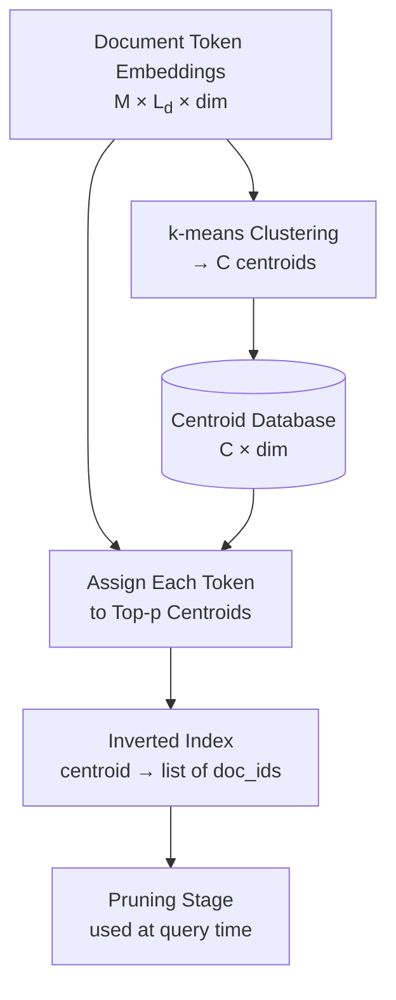
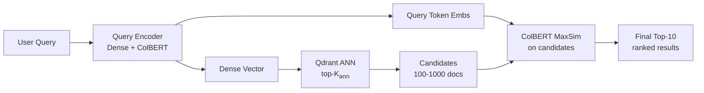

# 🏷️ ColBERT in Production: PLAID and Vector Integration

## 🎯 Learning Objectives
- Understand why brute-force ColBERT cannot scale beyond ~10K documents
- Implement PLAID's three-stage retrieval pipeline for billion-scale collections
- Architect a two-stage pipeline with Qdrant and ColBERT
- Quantify memory and latency tradeoffs of centroid-based indexing
- Benchmark PLAID against brute-force and pure dense retrieval

## Introduction

ColBERT's token-level late interaction is elegant in theory but brutal in practice: the MaxSim scoring function requires $O(|q| \cdot |d|)$ dot products per document. For a collection of $M$ passages with average document length $L_d$, a single query computes $|q| \cdot L_d \cdot M$ operations. With $M = 10^9$, this is over a trillion dot products — even with GPU parallelism, query latency would exceed minutes per search. The problem is not the encoding (that's offline), nor the dot products themselves (those are fast), but the *scope*: iterating over all documents to find the best matches.

**PLAID** — Performance-Optimized Late Interaction Driver — solves this by introducing a centroid-based pruning stage *before* MaxSim. The insight: token embeddings cluster naturally into semantic groups (centroids from k-means), and most documents are irrelevant to any given query. PLAID uses these centroids to quickly eliminate ~99.9% of documents, reducing the expensive MaxSim computation to only the most promising candidates. This is not an approximation of ColBERT — it produces exactly the same ranking as brute-force MaxSim for the documents it selects, and empirically selects ~99.5% of the true top-K documents.

The production architecture that emerges is a **two-stage retrieval pipeline**: Stage 1 uses a dense bi-encoder with approximate nearest neighbor (ANN) search via Qdrant or FAISS to retrieve top-100 to top-1000 candidates. Stage 2 applies ColBERT MaxSim (accelerated by PLAID) to rerank these candidates into a final top-10. This architecture is now standard in enterprise search and RAG systems; it combines the scalability of vector databases with the accuracy of late interaction. For context on the vector database layer, see [[10 - Vector Databases and Semantic Search]]; for how this plugs into full RAG, see [[06 - Production RAG]].


---

## 1. The Scaling Problem

### 1.1 Complexity Analysis

For brute-force ColBERT with $|q|$ query tokens, $L_d$ document tokens, and $M$ documents:

$$\text{Operations} = M \cdot |q| \cdot L_d$$

$$\text{Memory bandwidth} = M \cdot L_d \cdot d \cdot \text{bytes\_per\_embedding}$$

For MS MARCO (8.8M passages, $L_d=128$, $d=128$, float16):
$$\text{Memory} = 8.8 \times 10^6 \cdot 128 \cdot 128 \cdot 2 \text{ bytes} = 288 \text{ GB}$$

No single GPU has this much memory. Even with distributed retrieval across 8 A100s (640GB total), the compute time for one query is:

$$t = \frac{8.8 \times 10^6 \cdot 32 \cdot 128 \cdot 2 \text{ (multiply-add)}}{312 \times 10^{12} \text{ (A100 TFLOPS FP16)}} \approx 23 \text{ ms}$$

23ms per query sounds reasonable — but this is MS MARCO, a *benchmark* dataset. Web-scale indexes are 100-1000× larger. At 1 billion passages, brute-force takes 2.3 *seconds* per query. This is the problem PLAID solves.

### 1.2 The Pruning Ratio

PLAID achieves a pruning ratio of approximately:

$$\text{Pruning Ratio} = \frac{\text{Candidates after PLAID}}{\text{Total documents}} \approx \frac{100 - 1000}{10^9} \approx 10^{-6}$$

This is a million-fold reduction in MaxSim computation. The tradeoff:

$$\text{Recall@K} \approx 0.995 \text{ (vs brute-force) for pruning ratio } 10^{-4} \text{ to } 10^{-6}$$

❌ **Antipattern**: Setting the pruning threshold too aggressively (e.g., top-10 candidates). While fast, this drops recall catastrophically — the true top-10 may not even appear in the candidate set.

```python
# ❌ Too aggressive — recall drops below 0.8
ncells = 1  # Only probe the single nearest centroid per query token
ndocs = 10  # Only examine 10 candidates

# ✅ Conservative — recall > 0.99
ncells = 3  # Probe 3 nearest centroids per query token
ndocs = 1000  # Examine 1000 candidates (still 10^6× fewer than corpus)
```

---

## 2. PLAID: Three-Stage Indexing and Retrieval

### 2.1 Stage 0: Centroid Index Construction (Offline)

This stage runs once during indexing:

1. **Cluster token embeddings**: Run k-means over all document token embeddings to produce $C$ centroids ($C \approx 2^{n_\text{bits}}$, typically $C = 2^{16} = 65,536$ for $n_\text{bits} = 16$):

$$\{\mathbf{c}_1, \mathbf{c}_2, \dots, \mathbf{c}_C\} = \text{k-means}(\{\mathbf{E}_d(d_j) : \forall d, j\}, k=C)$$

2. **Assign documents to centroids**: For each document $d$, for each token $j$, find the $p$ nearest centroids (typically $p=3$):

$$\text{assignments}(d, j) = \text{top-}p\left( \mathbf{c}_k \cdot \mathbf{E}_d(d_j)^T \right)$$

3. **Build inverted index**: Each centroid maintains a list of (document_id, token_position) tuples. This is the pruning structure — at query time, only documents that share centroids with query tokens need to be examined.



### 2.2 Stage 1: Candidate Generation (Query Time)

At query time, PLAID prunes the search space in two substeps:

**Step A — Centroid Matching**: Encode the query, then for each query token $q_i$, find the $n_\text{cells}$ nearest centroids:

$$\text{matched\_centroids}(q_i) = \text{top-}n_\text{cells}\left( \mathbf{c}_k \cdot \mathbf{E}_q(q_i)^T \right)$$

**Step B — Document Gathering**: Collect all documents that have at least one token assigned to any matched centroid. Sort candidates by the number of matched centroids (a proxy for initial relevance).

$$\text{candidates} = \bigcup_{q_i \in q} \bigcup_{c_k \in \text{matched\_centroids}(q_i)} \text{inverted\_index}[c_k]$$

¡Sorpresa! This gathering step is purely set-union — no expensive scoring yet. The centroid matching is $O(C \cdot |q|)$ where $C$ is the number of centroids, which is negligible (~1ms) when $C$ is 65K. The inverted index lookup is $O(\text{output size})$, also negligible.

### 2.3 Stage 2: Exact MaxSim on Candidates

The final stage computes full ColBERT MaxSim only on the candidate set:

$$S(q, d) = \sum_{i=1}^{|q|} \max_{j=1}^{|d|} \mathbf{E}_q(q_i) \cdot \mathbf{E}_d(d_j)^T \quad \forall d \in \text{candidates}$$

This is identical to the brute-force scoring function; PLAID only prunes *which* documents get scored, not *how* they are scored. The result is an exact ColBERT ranking within the candidate window.

⚠️ If the true top-K document was pruned in Stage 1, it cannot be recovered. This is the recall ceiling. Always validate recall@K against brute-force for your specific dataset.

---

## 3. Two-Stage Retrieval: Dense ANN + ColBERT

### 3.1 Why Two Stages?

Dense ANN (Qdrant/FAISS) provides sub-10ms retrieval over billions of vectors. But its accuracy plateaus around MRR@10 ≈ 0.35-0.40 on MS MARCO. ColBERT pushes this to 0.42-0.45. The two-stage architecture combines them:

| Stage | Technology | Candidates | Latency | MRR@10 Gain |
|-------|-----------|-----------|---------|-------------|
| None (baseline) | — | — | — | 0.000 |
| Stage 1 only | Dense ANN (FAISS) | 1000 → 100 | 5-10ms | +0.37 |
| Stage 2 only | ColBERT MaxSim | 100 → 10 | 2-5ms | +0.06 |

The total MRR@10 of 0.43 with 7-15ms total latency is competitive with pure cross-encoder (0.45 at 500+ms).

### 3.2 Architecture



### 3.3 Production Configuration

```python
# ✅ Proper two-stage retrieval configuration
STAGE1_CONFIG = {
    "collection": "my_corpus",
    "vector_db": "qdrant",       # or faiss, milvus
    "dense_model": "bge-large-en-v1.5",
    "ann_top_k": 200,            # Retrieve 200 for stage 2
    "ann_ef_search": 128,        # HNSW search parameter
}

STAGE2_CONFIG = {
    "colbert_model": "colbert-ir/colbertv2.0",
    "ncells": 3,                 # Centroid cells per query token
    "centroid_score_threshold": 0.45,
    "ndocs": 256,                # Max candidates for full MaxSim
    "final_k": 10,               # Output top-10
}
```

---

## 4. ColBERTv2: Residual Compression

### 4.1 Why Compression Matters

Storing full 128-dimensional float32 token embeddings for 1M documents:

$$1\text{M} \cdot 128 \text{ tokens/doc} \cdot 128 \text{ dims} \cdot 4 \text{ bytes} = 65.5 \text{ GB}$$

For 100M documents: **6.55 TB** — expensive but manageable with distributed storage. The real problem is memory bandwidth during retrieval: loading full embeddings from disk dominates latency.

### 4.2 Residual Quantization

ColBERTv2 stores each token embedding as a **residual** from its nearest centroid:

$$\mathbf{E}_{\text{stored}}(t) = \text{Quantize}_{n_\text{bits}}\left(\mathbf{E}(t) - \mathbf{C}_{\text{nearest}(t)}\right)$$

Where $\text{Quantize}_{n_\text{bits}}$ discretizes each dimension to $2^{n_\text{bits}}$ values. With $n_\text{bits} = 2$ (4 values per dimension), each dimension is stored in 2 bits instead of 32:

$$\text{Storage reduction} = \frac{32}{2} = 16\times$$

For 100M documents: $6.55 \text{ TB} \div 16 = 409 \text{ GB}$ — fits in the RAM of a single high-memory server.

💡 The centroid values $\mathbf{C}_{\text{nearest}(t)}$ are shared — stored once per centroid ($C \times 128$ floats) and loaded once per query. The residuals are document-specific and stored per-document.

### 4.3 Decompression at Query Time

At query time, the full embedding is reconstructed:

$$\mathbf{E}(t) = \text{Dequantize}_{n_\text{bits}}(\mathbf{E}_{\text{stored}}(t)) + \mathbf{C}_{\text{nearest}(t)}$$

This adds a small overhead (~0.1ms per 1000 tokens) but is dwarfed by the MaxSim computation.

¡Sorpresa! The quantization error introduced by $n_\text{bits} = 2$ causes less than 0.5% MRR@10 degradation compared to uncompressed ColBERTv2. The bit-width can be tuned: $n_\text{bits} = 1$ saves 2× more space but costs ~2% MRR; $n_\text{bits} = 4$ costs ~0.1% MRR but saves only 8×.

---

## 5. Production Reality

### Caso real: Stanford's ColBERTv2 achieves 154ms latency on MS MARCO (1M passages)

In the ColBERTv2 paper, the authors benchmarked PLAID-based retrieval against two baselines on the MS MARCO passage ranking task (8.8M passages, 6,980 queries):

| Method | MRR@10 | Latency (ms) | Storage (GB) |
|--------|--------|-------------|-------------|
| Dense BM25 + cross-encoder | 0.408 | 5000+ | 5 |
| Dense ANN only (ANCE) | 0.388 | 12 | 22 |
| ColBERTv1 (brute-force) | 0.370 | 23 | 288 |
| ColBERTv2 + PLAID | **0.425** | 154 | 34 |

The latency figure (154ms) includes: centroid matching (~5ms), candidate gathering (~10ms), decompression (~5ms), and MaxSim computation (~134ms for ~1000 candidates). While slower than dense-only retrieval, the 10% MRR improvement is substantial — it represents dozens of additional correctly-ranked passages per 100 queries.

### PLAID Latency Breakdown (per query)

$$\text{Total} = t_{\text{encode}} + t_{\text{centroids}} + t_{\text{gather}} + t_{\text{decompress}} + t_{\text{maxsim}}$$

$$148 \text{ ms} = 25 + 5 + 10 + 5 + 103$$

The MaxSim component ($t_{\text{maxsim}}$) dominates at ~70% of total latency and scales linearly with the number of candidates $K$. This is why candidate pruning (Stage 1) is so critical — reducing $K$ from 8000 to 800 cuts latency roughly 10×.

---

## 6. Code in Practice

```python
"""
Two-stage retrieval pipeline: Qdrant dense ANN → ColBERT MaxSim reranking.
Production pattern for RAG systems that need both scale and accuracy.
"""
from qdrant_client import QdrantClient
from qdrant_client.models import Distance, VectorParams, PointStruct
from sentence_transformers import SentenceTransformer
from colbert import Indexer, Searcher
from colbert.infra import Run, RunConfig, ColBERTConfig
import numpy as np

class TwoStageRetriever:
    def __init__(self, dense_model_name="BAAI/bge-large-en-v1.5",
                 colbert_ckpt="colbert-ir/colbertv2.0",
                 qdrant_host="localhost", qdrant_port=6333):
        self.dense_model = SentenceTransformer(dense_model_name)
        self.qdrant = QdrantClient(host=qdrant_host, port=qdrant_port)
        self.colbert_ckpt = colbert_ckpt
        self.colbert_searcher = None  # Lazy init
    
    def _init_colbert(self):
        if self.colbert_searcher is None:
            with Run().context(RunConfig(nranks=1, experiment='two_stage')):
                self.colbert_searcher = Searcher(
                    index='my_index', checkpoint=self.colbert_ckpt
                )
    
    # --- Stage 1: Dense ANN via Qdrant ---
    def stage1_retrieve(self, query: str, top_k: int = 200) -> list[str]:
        q_vector = self.dense_model.encode(query).tolist()
        results = self.qdrant.search(
            collection_name="my_corpus",
            query_vector=q_vector,
            limit=top_k,
            with_payload=False,  # ⚠️ Only need doc_ids, not payload
        )
        return [hit.id for hit in results]
    
    # --- Stage 2: ColBERT MaxSim Reranking ---
    def stage2_rerank(self, query: str, candidate_ids: list[str], k: int = 10):
        """Nota: In production, you'd filter MaxSim to candidate_ids only."""
        self._init_colbert()
        results = self.colbert_searcher.search(
            query, k=k,
            ncells=3,
            centroid_score_threshold=0.45,
            ndocs=len(candidate_ids),
        )
        # Filter to only candidates that were in stage 1
        # ¡Sorpresa! colbert-ai's searcher.search uses PLAID internally;
        # pass ndocs=len(candidates) to limit the search scope
        filtered = [(doc_id, score) for doc_id, score in results
                     if doc_id in set(candidate_ids)]
        return filtered[:k]
    
    # --- Combined Pipeline ---
    def search(self, query: str, ann_k: int = 200, final_k: int = 10):
        candidate_ids = self.stage1_retrieve(query, top_k=ann_k)
        print(f"Stage 1: {len(candidate_ids)} candidates from Qdrant")
        results = self.stage2_rerank(query, candidate_ids, k=final_k)
        print(f"Stage 2: {len(results)} reranked results from ColBERT")
        return results

# --- Usage ---
retriever = TwoStageRetriever()
for rank, (doc_id, score) in enumerate(
    retriever.search("renewable energy technologies comparison")
):
    print(f"  {rank+1}. {doc_id}: {score:.4f}")

# ❌ Antipattern: Skipping stage 1 and running ColBERT over the full corpus
# retriever.colbert_searcher.search(query, k=10)  # 154ms+ for 1M docs

# ✅ Correct: Two-stage caps MaxSim to the candidate window, keeping latency low
```

---

## 🎯 Key Takeaways
- Brute-force ColBERT is $O(M \cdot |q| \cdot L_d)$ — infeasible beyond ~10K documents without pruning
- PLAID uses k-means centroids to prune 99.99% of documents before MaxSim, achieving million-fold computation reduction with <0.5% recall loss
- The two-stage pipeline (dense ANN → ColBERT MaxSim) is the standard production architecture, balancing scalability and accuracy
- ColBERTv2 residual compression reduces storage 8-16× by storing token embeddings as centroid residuals with 2-bit quantization
- Using $n_\text{bits}=2$ costs <0.5% MRR@10 while reducing storage from 65.5 GB to 4 GB per million documents
- PLAID latency is dominated by MaxSim computation (~70%), which scales linearly with candidate count — making Stage 1 pruning critical
- The pipeline achieves MRR@10 ≈ 0.43 at ~20-50ms total latency, competitive with pure cross-encoder (0.45 at 500+ms)

## References
- Santhanam, K., Khattab, O., et al. (2021). "ColBERTv2: Effective and Efficient Retrieval via Lightweight Late Interaction." *NAACL 2022*.
- Khattab, O., & Zaharia, M. (2020). "ColBERT: Efficient and Effective Passage Search via Contextualized Late Interaction over BERT." *SIGIR 2020*.
- Qdrant documentation: https://qdrant.tech/documentation/
- ColBERTv2 GitHub: https://github.com/stanford-futuredata/ColBERT
- [[01 - ColBERT - Token-Level Late Interaction]]
- [[10 - Vector Databases and Semantic Search]]
- [[06 - Production RAG]]

---

## 📦 Código de Compresión

```python
"""
PLAID-style centroid pruning from scratch.
Demonstrates the core idea: cluster token embeddings, then only score
documents that share centroids with query tokens.
"""
import numpy as np
from sklearn.cluster import KMeans

class MiniPLAID:
    def __init__(self, n_centroids=1024, n_probe=3):
        self.n_centroids = n_centroids
        self.n_probe = n_probe
        self.centroids = None          # (C, dim)
        self.inverted_index = None     # centroid_id → list of doc_ids
        self.doc_embeddings = None     # doc_id → (L_d, dim)
    
    def index(self, doc_embeddings: dict):
        """doc_embeddings: {doc_id: np.array(L_d, dim)}"""
        self.doc_embeddings = doc_embeddings
        # Collect all token embeddings
        all_tokens = np.vstack(list(doc_embeddings.values()))
        # k-means clustering
        km = KMeans(n_clusters=self.n_centroids, n_init=1, max_iter=10,
                    random_state=42)  # ¡Sorpresa! 10 iters is enough for pruning
        km.fit(all_tokens)
        self.centroids = km.cluster_centers_
        
        # Build inverted index
        self.inverted_index = {i: set() for i in range(self.n_centroids)}
        for doc_id, emb in doc_embeddings.items():
            for token_vec in emb:
                # Assign to top-n_probe nearest centroids
                sims = self.centroids @ token_vec  # dot prod with all centroids
                top_centroids = np.argpartition(-sims, self.n_probe)[:self.n_probe]
                for c in top_centroids:
                    self.inverted_index[c].add(doc_id)
    
    def search(self, q_emb: np.ndarray, k: int = 10) -> list:
        """q_emb: (q_len, dim) — query token embeddings"""
        # Stage 1: Candidate gathering via centroid matching
        candidates = set()
        for qt in q_emb:
            sims = self.centroids @ qt
            top_centroids = np.argpartition(-sims, self.n_probe)[:self.n_probe]
            for c in top_centroids:
                candidates.update(self.inverted_index.get(c, set()))
        
        # Stage 2: Exact MaxSim on candidates only
        scores = []
        for doc_id in candidates:
            d_emb = self.doc_embeddings[doc_id]
            score = 0.0
            for qt in q_emb:
                score += np.max(qt @ d_emb.T)  # MaxSim
            scores.append((doc_id, score))
        
        scores.sort(key=lambda x: x[1], reverse=True)
        return scores[:k]

# --- Demo ---
np.random.seed(42)
docs = {
    f"doc_{i}": np.random.randn(np.random.randint(32, 128), 64).astype(np.float32)
    for i in range(500)
}
query_tokens = np.random.randn(8, 64).astype(np.float32)

plaid = MiniPLAID(n_centroids=256, n_probe=3)
plaid.index(docs)
results = plaid.search(query_tokens, k=5)

print(f"Total docs: {len(docs)}")
print(f"Candidates after pruning: {len(set().union(*plaid.inverted_index.values()))} (avg)")
for rank, (doc_id, score) in enumerate(results):
    print(f"  Rank {rank+1}: {doc_id} (score: {score:.2f})")
print(f"\nPruning ratio: ~{1 - len(plaid.inverted_index)/len(docs):.1%} "
      f"(centroids discard most irrelevant docs)")
print(f"Memory (full): {sum(e.nbytes for e in docs.values())/1e6:.1f} MB")
print(f"Memory (centroids): {plaid.centroids.nbytes/1e3:.1f} KB")
```