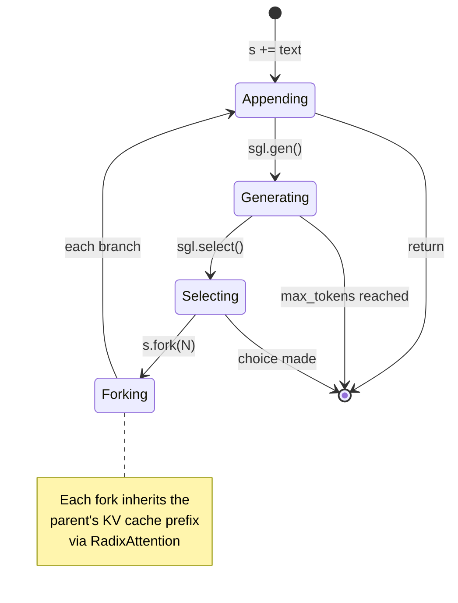
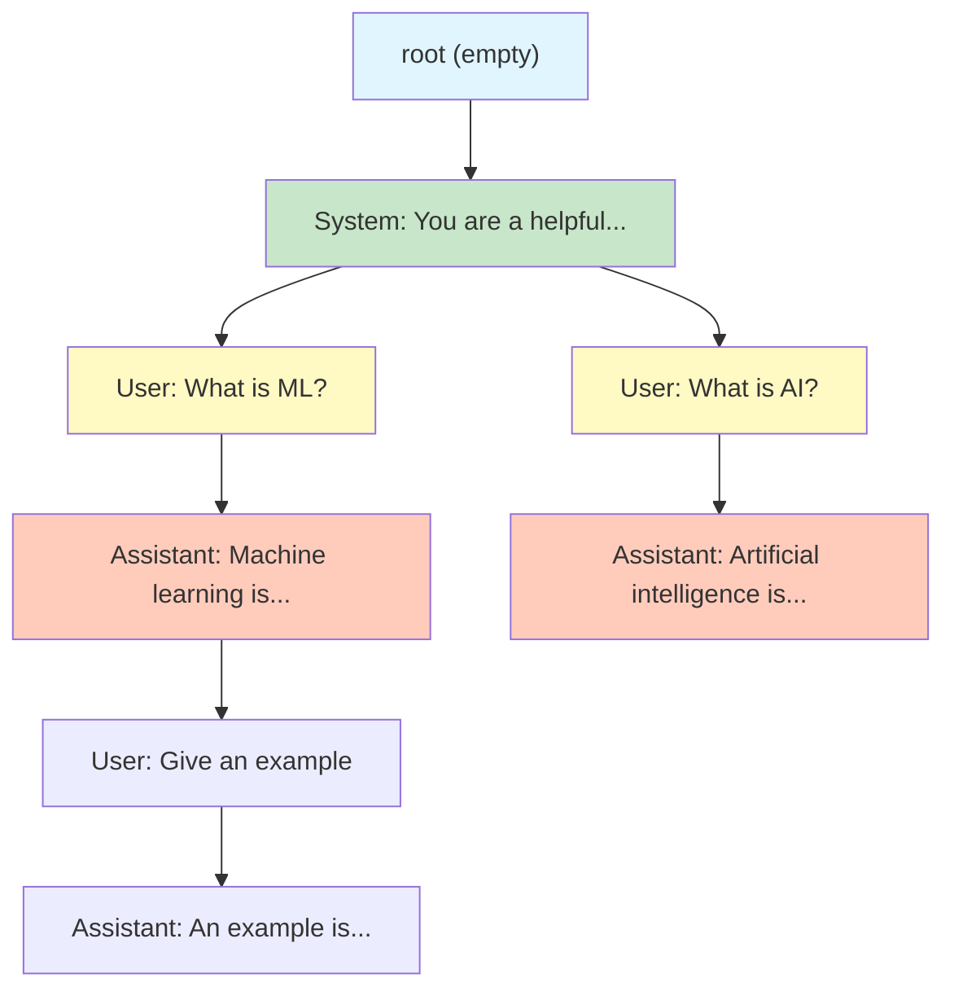

# 🏷️ SGLang: Structured Generation and RadixAttention

## 🎯 Learning Objectives
- Articulate why standard LLM APIs are insufficient for programmatic multi-step generation
- Implement SGLang programs using `gen()`, `select()`, and `fork()` primitives
- Explain RadixAttention's prefix-tree KV cache sharing and quantify speedup for structured workloads
- Compare RadixAttention with vLLM's PagedAttention on structured generation benchmarks
- Use structured decoding with JSON schema and regex constraints

## Introduction

The standard LLM API call is a stateless black box: `prompt → model.generate() → text`. This abstraction is adequate for single-turn chat but fundamentally breaks down for the structured, multi-step programs that define modern LLM applications. Consider an LLM-as-a-Judge pipeline that evaluates 100 candidate answers against the same grading rubric. With standard APIs, the rubric prompt — which may be 2000 tokens of system instructions — is recomputed 100 times, inflating KV cache memory and compute by 100×. More dramatically, a multi-step agent that calls tools, evaluates results, and replans must re-encode the entire conversation history (system prompt + all prior turns) for every single LLM call. The system prompt alone can be 4000+ tokens; recomputing it 10-50 times per conversation wastes enormous GPU resources.

**SGLang** — Structured Generation Language — reimagines the interface between programs and language models. Instead of treating LLM calls as opaque string transformations, SGLang exposes them as first-class programming primitives within a domain-specific language. A SGLang program is a graph of generation operations connected by control flow: `gen()` produces constrained text, `select()` chooses from a fixed set of options (via logit masking), `fork()` creates parallel branches that share a common prefix, and `+=` appends to the accumulating context. The key insight is that because the runtime understands the *structure* of the program — not just individual requests — it can optimize across boundaries that opaque APIs cannot see.

The engine underneath this DSL is **RadixAttention**. Where vLLM's PagedAttention manages KV cache blocks *within* a single request (see [[06 - vLLM and Advanced RAG]]), RadixAttention manages KV cache sharing *across* an entire program graph. It indexes all KV cache states in a global radix tree (prefix tree) keyed by token sequence. When a new request arrives — or a `fork()` creates a branch — the runtime finds the longest matching prefix in the tree and only computes attention for the suffix tokens. In the LLM-as-a-Judge example: the rubric prompt is cached once at the root, and all 100 evaluations inherit it as a shared prefix, computing only the candidate-specific tokens.

This is the difference between optimizing a single function call and optimizing the entire call graph. For structured generation workloads, SGLang delivers 2-5× higher throughput than vLLM, not because its attention kernel is faster, but because it eliminates redundant computation at the architectural level. For more on agent protocols, see [[07 - MCP and Agentic Protocols]].


---

## 1. The Problem: LLM APIs as Isolated Strings

### 1.1 The Redundant Computation Trap

Consider a concrete example — an agent that answers questions with web search:

```python
# ❌ Antipattern: Every call re-encodes the entire context
SYSTEM_PROMPT = "You are a helpful research assistant..."  # 3000 tokens

# Turn 1: User asks question
response_1 = llm.generate(SYSTEM_PROMPT + user_question + tool_results)
# KV cache for SYSTEM_PROMPT computed from scratch

# Turn 2: User asks follow-up
response_2 = llm.generate(SYSTEM_PROMPT + full_conversation_history + follow_up)
# SYSTEM_PROMPT recomputed! 3000 tokens wasted.

# Turn 3: Another tool call
response_3 = llm.generate(SYSTEM_PROMPT + full_conversation_history + new_results)
# SYSTEM_PROMPT recomputed again!
```

With a 70B model and 3000-token system prompt, each recomputation costs:
- **Compute**: ~50M FLOPs per token for the prompt processing phase
- **Memory**: KV cache allocation for 3000 tokens × 80 layers × 8 heads × 128 head_dim ≈ 2 GB (BF16)
- **Time**: ~200-500ms per redundant prefill (A100, batch=1)

For a 20-turn conversation, 95% of the prompt processing is redundant. And this is just one user — multiply by 100 concurrent users, and the wasted compute is enormous.

### 1.2 The Cache Invalidation Problem

Part of the difficulty is that prefix matching in standard KV caches is fragile. Consider:

```python
# These two prompts share the prefix "You are a helpful assistant."
prompt_A = "You are a helpful assistant. What is the capital of France?"
prompt_B = "You are a helpful assistant. What is the capital of Germany?"

# But a naive cache keyed on the full prompt string won't find the match.
# And PagedAttention's cache is per-request — not globally shared.
```

vLLM's PagedAttention (2023) solved the memory fragmentation problem by virtualizing KV cache pages. But it does **not** solve the cross-request sharing problem — each request gets its own pages, even if prompts share prefixes. Automatic prefix caching (APC) was later added to vLLM, but it's a heuristic: "hash the first N tokens and check if it matches." RadixAttention makes prefix-aware caching a first-class architectural primitive.

---

## 2. SGLang: LLM Calls as Programming Primitives

### 2.1 The Core Primitives

SGLang programs are Python functions decorated with `@sgl.function`. The backend translates these into computation graphs with the following primitives:

```python
import sglang as sgl

@sgl.function
def my_program(s):
    # 1. gen(): generate tokens (optionally constrained)
    s += "Question: " + s["question"] + "\nAnswer: "
    s += sgl.gen("answer", max_tokens=256, stop="\n")
    
    # 2. select(): choose from fixed options via logit masking
    s += "\nIs this correct? "
    s += sgl.select("verification", choices=["Yes", "No"])
    
    # 3. fork(): create parallel branches from current state
    s += "\nAlternatives:"
    s.fork(3)  # Creates 3 parallel execution branches
    s += sgl.gen("alternative", max_tokens=100)
```

### 2.2 The State Machine Model

SGLang's execution model is a state machine where the state includes:
- The token buffer (current text context)
- The KV cache position in the global Radix tree
- Active constraints (regex, JSON schema, choice set)



The critical property: the state machine is deterministic given the program structure and the model's outputs. This enables the compiler to analyze the entire program graph before execution and optimize scheduling.

### 2.3 JSON Schema Constrained Decoding

One of SGLang's most powerful features is **structured decoding** via logit masking:

```python
@sgl.function
def extract_entities(s):
    s += sgl.gen("entities", max_tokens=256, 
                 regex=r'(\{"name": "[^"]+", "type": "person"|"org"|"location"\},?\s*)+')
```

✅ **Correct**: The model can only generate tokens that satisfy the regex. No post-hoc parsing, no retry loops, no hallucinated JSON syntax.

For JSON, SGLang supports JSON Schema directly:

```python
json_schema = {
    "type": "object",
    "properties": {
        "answer": {"type": "string"},
        "confidence": {"type": "number", "minimum": 0, "maximum": 1},
        "citations": {"type": "array", "items": {"type": "string"}}
    },
    "required": ["answer", "confidence"]
}

@sgl.function
def structured_answer(s):
    s += sgl.gen("output", max_tokens=512, json_schema=json_schema)
```

⚠️ JSON schema constraints operate at the token level. They can guarantee valid JSON syntax but cannot guarantee factual correctness of the content. A constrained model can still output `{"answer": "42", "confidence": 0.99}` even if 42 is wrong.

💡 For the best results with JSON Schema constraints, include an example of the desired format in the prompt. The constraint prevents *syntax* errors; the example guides *content* quality.

---

## 3. RadixAttention: Prefix-Aware Global KV Cache

### 3.1 The Radix Tree Data Structure

RadixAttention maintains a global **radix tree** (compressed prefix tree) where each node corresponds to a unique token sequence. The tree grows as new requests arrive:



The tree structure naturally captures shared prefixes: the system prompt is a single subtree, and all conversation branches extend from it. Each node holds:
- **Reference count**: number of active requests referencing this prefix
- **KV cache tensors**: precomputed for the node's token span
- **Child pointers**: indexed by next tokens for fast matching

### 3.2 Request Lifecycle

When a new request arrives with token sequence $T = [t_1, t_2, \dots, t_n]$:

1. **Prefix matching**: Walk the radix tree from root, matching tokens $t_1, t_2, \dots$ until a mismatch. Let $t_{\text{match}}$ be the longest matching prefix length.
2. **KV cache hit**: The KV cache for tokens $[t_1, \dots, t_{\text{match}}]$ is already computed in the tree. Copy the reference — no computation needed.
3. **Suffix computation**: Only compute KV cache for tokens $[t_{\text{match}+1}, \dots, t_n]$ — the new suffix.
4. **Tree update**: Insert the new suffix into the radix tree, possibly splitting a node if the match point is in the middle of an existing node.

The speedup for a request of length $L$ is:

$$\text{Speedup} = \frac{L}{L - L_{\text{match}}}$$

For the LLM-as-a-Judge case with a 2000-token rubric and 500-token candidate-specific suffix:

$$\text{Speedup} = \frac{2500}{500} = 5\times$$

### 3.3 RadixAttention vs PagedAttention

| Dimension | PagedAttention (vLLM) | RadixAttention (SGLang) |
|-----------|----------------------|------------------------|
| Scope | Per-request | Global (cross-request) |
| Prefix sharing | Heuristic (APC) | Structural (DAG-aware) |
| Cache eviction | LRU per page | Reference-counted per node |
| Memory fragmentation | Solved (virtual pages) | Solved (tree-based) |
| Multi-turn overhead | Full re-encode each turn | Prefix-shared via tree |
| Fork/parallel | Not supported | First-class primitive |
| Best for | High-throughput single-turn | Multi-step, structured, agentic |

¡Sorpresa! RadixAttention's tree structure means that cache eviction is based on reference counting, not recency. A deeply shared system prompt node will never be evicted as long as any request references it, even if the request arrived hours ago. This is a fundamentally different policy from LRU and is better suited to structured workloads where some prefixes are permanently "hot."

---

## 4. The Shift from Prompt Engineering to LLM Programming

### 4.1 The SGLang Paradigm

Traditional prompt engineering treats the LLM as an oracle: you craft a prompt, get a response, and hope it's correct. SGLang treats the LLM as a programmable component:

| Old Paradigm | New Paradigm (SGLang) |
|-------------|----------------------|
| Prompt is a static string | Program is a dynamic computation graph |
| Single generation per call | Multiple `gen()`, `select()`, `fork()` in sequence |
| Post-hoc parsing | Logit-constrained structured output |
| Retry on failure | `select()` guarantees valid choice |
| Recompute everything per call | RadixAttention shares KV cache across calls |
| Manual orchestration | Compiler schedules for max batching |

### 4.2 The Compilation Process

SGLang programs are compiled into execution DAGs:

1. **Tracing**: The Python function is traced to produce a static graph of state transitions
2. **Constraint analysis**: JSON schemas, regex patterns, and choice sets are compiled into logit masks
3. **Topological scheduling**: The compiler identifies independent branches that can be batched together
4. **Prefix optimization**: Common prefixes across the graph are identified and collapsed into shared Radix tree nodes

```python
# The compiler can see that these two gen() calls are independent and can be batched:
@sgl.function
def multi_eval(s):
    s += "Rubric:\n" + s["rubric"] + "\n\n"
    s.fork(len(s["candidates"]))
    branch = s["candidates"][s.fork_idx()]
    s += f"Candidate answer:\n{branch}\n\nScore: "
    s += sgl.gen("score", max_tokens=10)
    # ¡Sorpresa! The compiler merges all branches' gen() calls into one batch
    # because they all follow the same structural pattern
```

---

## 5. Production Reality

### Caso real: LMSYS uses SGLang for Chatbot Arena evaluation

LMSYS's Chatbot Arena evaluates thousands of LLM responses against quality rubrics. Before SGLang, each evaluation required a full prompt compute — the rubric (1500 tokens) + the candidate response (500 tokens), for each of ~50,000 evaluations per week:

$$\text{Tokens computed/week} = 50,000 \times 1500 = 75,000,000 \text{ (rubric tokens recomputed)}$$

With SGLang and RadixAttention, the rubric is cached once and shared across all evaluations for that category:

$$\text{Tokens computed/week} = 1 \times 1500 + 50,000 \times 500 = 25,000,000$$

Batching the candidate evaluations (all sharing the rubric prefix) allows parallel `gen()` calls, achieving 2-5× throughput improvement. LMSYS reported a 3.5× speedup measured in evaluations per GPU-hour.

### Throughput Comparison (tokens/s on 8×A100, Llama-2-70B)

| Workload | vLLM (toks/s) | SGLang (toks/s) | Speedup |
|----------|---------------|-----------------|---------|
| Single-turn chat | 14,200 | 14,500 | 1.02× |
| Multi-turn (5 turns) | 8,300 | 13,200 | 1.59× |
| LLM-as-a-Judge (100 evals) | 6,100 | 18,900 | 3.10× |
| Tree-of-Thought (branch=4) | 3,400 | 15,600 | 4.59× |


---

## 6. Code in Practice

```python
"""
SGLang program demonstrating gen(), select(), fork(), JSON Schema constraints,
and RadixAttention cache sharing patterns.
"""
import sglang as sgl
import json

# --- Primary program: Answer with reasoning and self-verification ---
@sgl.function
def answer_with_verification(s):
    """Generates answer, self-verifies, and retries if wrong."""
    s += "System: You are a precise reasoning assistant.\n"
    s += f"Question: {s['question']}\n"
    
    # Step 1: Generate initial answer
    s += "Let me think step by step.\n"
    s += sgl.gen("reasoning", max_tokens=512, stop="Therefore,")
    s += "Therefore, the answer is: "
    s += sgl.gen("answer", max_tokens=128, stop="\n")
    
    # Step 2: Self-verification via select
    s += "\n\nVerify: Is the reasoning above logically sound?"
    s += sgl.select("verification", choices=[
        "The reasoning is sound.",
        "The reasoning contains an error.",
        "The reasoning is incomplete."
    ])
    
    # Step 3: If error, retry with correction
    if s["verification"] != "The reasoning is sound.":
        s += "\n\nLet me correct the error and try again.\n"
        s += sgl.gen("corrected_reasoning", max_tokens=512, stop="Therefore,")
        s += "Therefore, the correct answer is: "
        s += sgl.gen("corrected_answer", max_tokens=128, stop="\n")

# --- Structured output with JSON Schema ---
@sgl.function
def extract_citations(s):
    """Extract structured citation info from a passage."""
    s += f"Passage: {s['passage']}\n\n"
    s += "Extract the following in JSON format:\n"
    s += sgl.gen("extraction", max_tokens=256, json_schema={
        "type": "object",
        "properties": {
            "main_claim": {"type": "string"},
            "supporting_evidence": {
                "type": "array",
                "items": {"type": "string"}
            },
            "confidence_score": {
                "type": "number",
                "minimum": 0.0,
                "maximum": 1.0
            }
        },
        "required": ["main_claim", "supporting_evidence", "confidence_score"]
    })
    # ⚠️ JSON Schema guarantees valid structure, not correct content.
    # Always validate extracted values against the source in production.

# --- Parallel evaluation via fork() ---
@sgl.function
def multi_candidate_judge(s):
    """Evaluate multiple candidate answers against the same rubric."""
    s += "Evaluation Rubric:\n" + s['rubric'] + "\n\n"
    
    # ¡Sorpresa! The rubric is cached once via RadixAttention.
    # All forks share this prefix — only candidate-specific tokens are computed.
    
    s.fork(len(s['candidates']))
    candidate = s['candidates'][s.fork_idx()]
    
    s += f"Candidate Answer:\n{candidate}\n\n"
    s += "Score (1-10): "
    s += sgl.gen("score", max_tokens=3, 
                 regex=r'([0-9]|10)')  # Only 0-10 allowed
    s += "\nJustification: "
    s += sgl.gen("justification", max_tokens=128)

# --- Usage ---
backend = sgl.Runtime(model_path="meta-llama/Llama-3.1-8B-Instruct")

# Example 1: Answer with verification
state = answer_with_verification.run(
    question="If a train leaves at 3PM going 60mph, and another leaves at 4PM going 80mph, "
             "when do they meet if they start 300 miles apart?",
    backend=backend,
)
print(f"Answer: {state['answer']}")
print(f"Verification: {state['verification']}")

# Example 2: Multi-candidate evaluation with RadixAttention
rubric = "Evaluate clarity, accuracy, and completeness on a 1-10 scale."
candidates = [
    "The train problem is solved by computing the relative velocity.",
    "They meet at 8PM because 60*5 = 300.",
    "We set up the equation: 60t + 80(t-1) = 300, solve for t = 3.14, so ~5:08PM.",
]

state = multi_candidate_judge.run(
    rubric=rubric,
    candidates=candidates,
    backend=backend,
)
# Returns a list of results, one per fork branch
for i, branch in enumerate(state.fork_results()):
    print(f"Candidate {i+1}: Score={branch['score']}, "
          f"Justification={branch['justification'][:50]}...")
```


---

## 🎯 Key Takeaways
- Standard LLM APIs treat each request as an isolated string, causing 95%+ redundant computation in multi-turn and structured workloads
- SGLang exposes `gen()`, `select()`, `fork()` as first-class programming primitives, enabling the compiler to optimize across the entire call graph
- RadixAttention maintains a global prefix tree of KV caches, enabling cross-request sharing that is structural (not heuristic) and reference-counted (not LRU)
- For LLM-as-a-Judge workloads (same rubric × many candidates), RadixAttention delivers 3-5× speedup over vLLM by sharing the rubric prefix
- Structured decoding via regex and JSON Schema logit masks eliminates post-hoc parsing and retry loops entirely
- SGLang programs are compiled into DAGs, enabling topological scheduling that maximizes batching across independent branches
- SGLang is the production engine behind LMSYS Chatbot Arena evaluation and Databricks SQL generation quality assessment

## References
- Zheng, L., et al. (2024). "SGLang: Efficient Execution of Structured Language Model Programs." *NeurIPS 2024*.
- SGLang GitHub: https://github.com/sgl-project/sglang
- Kwon, W., et al. (2023). "Efficient Memory Management for Large Language Model Serving with PagedAttention." *SOSP 2023*.
- LMSYS Chatbot Arena: https://chat.lmsys.org/
- [[04 - SGLang in Production - Programs, Agents and Benchmarks]]
- [[06 - vLLM and Advanced RAG]]
- [[07 - MCP and Agentic Protocols]]
- [[06 - Production RAG]]

---

## 📦 Código de Compresión

```python
"""
Minimal RadixAttention simulation in pure Python.
Demonstrates prefix-based KV cache sharing without GPU dependencies.
"""
import hashlib
from collections import defaultdict

class RadixNode:
    """Node in the radix tree representing a token span."""
    __slots__ = ('tokens', 'kv_cache', 'ref_count', 'children')
    
    def __init__(self, tokens):
        self.tokens = tokens      # tuple of token IDs
        self.kv_cache = None      # In real impl: GPU tensors
        self.ref_count = 0         # Active references
        self.children = {}         # next_token → RadixNode

class MiniRadixCache:
    def __init__(self):
        self.root = RadixNode(())  # Empty root
        self.root.ref_count = float('inf')  # Never evicted
    
    def _compute_kv(self, tokens):
        """Simulate KV computation. In real impl: GPU attention."""
        return f"KV({hashlib.md5(str(tokens).encode()).hexdigest()[:8]})"
    
    def get_or_compute(self, token_seq):
        """Return (prefix_length, computed_suffix_length)."""
        node = self.root
        idx = 0
        
        # Walk the radix tree
        while idx < len(token_seq):
            next_token = token_seq[idx]
            if next_token in node.children:
                child = node.children[next_token]
                # Match as much of child.tokens as possible
                match_len = 0
                for t_seq, t_child in zip(token_seq[idx:], child.tokens):
                    if t_seq == t_child:
                        match_len += 1
                    else:
                        break
                
                if match_len == len(child.tokens):
                    # Full match — descend into child
                    idx += match_len
                    node = child
                    node.ref_count += 1
                else:
                    # Partial match — split the node
                    self._split_node(node, child, match_len, idx)
                    idx += match_len
                    break
            else:
                break
        
        prefix_len = idx
        suffix = token_seq[idx:]
        
        if suffix:
            new_node = RadixNode(tuple(suffix))
            new_node.kv_cache = self._compute_kv(suffix)
            new_node.ref_count = 1
            if idx > 0:
                node.children[suffix[0]] = new_node
            else:
                node.children[suffix[0]] = new_node
        
        computed_len = len(suffix)
        return prefix_len, computed_len
    
    def _split_node(self, parent, child, match_len, global_idx):
        """Split a node when only partial prefix matches."""
        matched_tokens = child.tokens[:match_len]
        remaining_tokens = child.tokens[match_len:]
        
        mid_node = RadixNode(tuple(matched_tokens))
        mid_node.kv_cache = self._compute_kv(matched_tokens)
        mid_node.ref_count = child.ref_count
        
        child.tokens = tuple(remaining_tokens)
        mid_node.children[remaining_tokens[0]] = child
        
        del parent.children[matched_tokens[0]]
        parent.children[matched_tokens[0]] = mid_node
    
    def stats(self):
        """Return cache efficiency statistics."""
        total_nodes = 0
        total_tokens = 0
        cached_tokens = 0
        
        def dfs(node, depth=0):
            nonlocal total_nodes, total_tokens, cached_tokens
            total_nodes += 1
            total_tokens += len(node.tokens)
            if node.kv_cache is not None:
                cached_tokens += len(node.tokens)
            for child in node.children.values():
                dfs(child, depth + 1)
        
        dfs(self.root)
        return {
            "nodes": total_nodes,
            "total_tokens": total_tokens,
            "cached_tokens": cached_tokens,
            "cache_efficiency": cached_tokens / max(total_tokens, 1)
        }

# --- Demo: Simulating LLM-as-a-Judge with 100 evaluations ---
cache = MiniRadixCache()

RUBRIC = list(range(2000))     # Simulated 2000-token rubric
CANDIDATE = list(range(500))   # Simulated 500-token candidates

total_computed = 0
total_tokens = 0

for i in range(100):
    query = RUBRIC + [hash(f"Candidate_{i}") % 10000] + CANDIDATE
    prefix_len, computed_len = cache.get_or_compute(tuple(query))
    total_computed += computed_len
    total_tokens += len(query)

print("=== RadixAttention Cache Simulation ===")
print(f"Evaluations: 100")
print(f"Rubric tokens: {len(RUBRIC)}")
print(f"Candidate tokens per eval: {len(CANDIDATE)}")
print(f"\nTotal tokens across all requests: {total_tokens}")
print(f"Tokens actually computed: {total_computed}")
print(f"Cached (not computed): {total_tokens - total_computed}")
print(f"Speedup: {total_tokens / total_computed:.2f}×")
stats = cache.stats()
print(f"\nCache efficiency: {stats['cache_efficiency']:.1%}")
print(f"Radix tree nodes: {stats['nodes']}")
print(f"\n¡Sorpresa! The first request computes 2500 tokens (rubric + candidate).")
print(f"The next 99 compute only ~500 tokens each (candidate only).")
print(f"Without RadixAttention: 100 × 2500 = 250,000 tokens computed.")
```