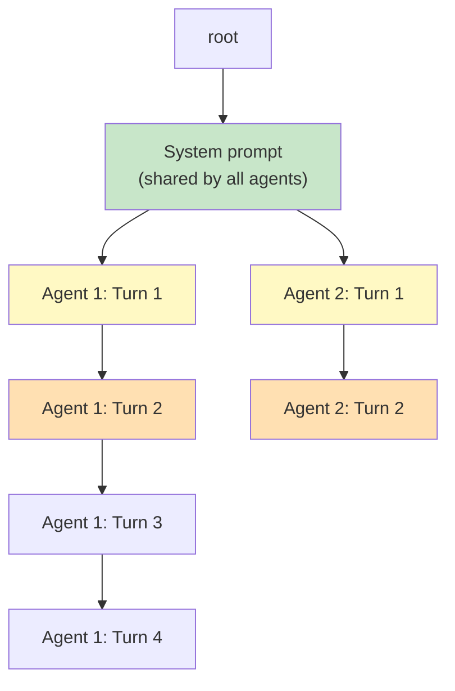

# 🏷️ SGLang in Production: Programs, Agents and Benchmarks

## 🎯 Learning Objectives
- Design SGLang agent loops with tool-calling via structured generation
- Implement LLM-as-a-Judge pipelines exploiting RadixAttention prefix sharing
- Interpret benchmarks comparing SGLang vs vLLM on structured generation and multi-turn workloads
- Deploy SGLang with tensor parallelism and OpenAI-compatible API
- Profile RadixAttention cache hit rates for agentic workflows

## Introduction

The previous note established SGLang as a paradigm for LLM programming, where `gen()`, `select()`, and `fork()` replace opaque string APIs. But the gap between a programming model and a production system is wide. Real-world deployments demand function calling with guaranteed schema compliance, agentic loops that span dozens of LLM calls while maintaining context integrity, and throughput that matches or exceeds vLLM while adding structure. SGLang in production is not just about writing SGLang programs — it's about configuring the runtime, profiling cache behavior, and designing systems that exploit RadixAttention's global prefix sharing to its fullest.

The killer application that justifies SGLang's adoption is the **LLM-as-a-Judge** pattern. When evaluating 100 candidate answers against the same rubric, the rubric prompt (often 1500-3000 tokens) is identical across all evaluations. With traditional APIs, this is 100 × 3000 = 300,000 tokens of redundant prefill. With SGLang, the rubric is encoded once at the root of the Radix tree, and all 100 evaluations share it via `fork()`. The result is a 3-5× throughput improvement — not from faster GPU kernels, but from eliminating redundant computation at the architectural level. This is the same insight that powers LMSYS's Chatbot Arena evaluation infrastructure and Databricks's SQL generation quality pipeline.

For agentic systems, SGLang's value proposition is equally compelling. Each conversation turn with tool calls triggers 2-5 LLM calls (planning, tool execution, synthesis, verification). Without prefix sharing, the system prompt and conversation history are recomputed for each call. SGLang maintains a single Radix tree per conversation session, so later calls extend from earlier ones without recomputing shared prefixes. Combined with structured decoding for tool schemas, this eliminates both the compute waste of redundant prefill and the brittleness of post-hoc JSON parsing. For the broader agent ecosystem, see [[07 - MCP and Agentic Protocols]].


---

## 1. SGLang as a Stateful Runtime for Agents

### 1.1 The Agent Loop Pattern

An LLM agent loops through: observe → plan → act (tool call) → observe result → replan. Each step invokes the LLM with the full context history. In SGLang, this becomes a single program with control flow:

```python
@sgl.function
def agent_loop(s):
    s += "System: You are an AI assistant with access to tools.\n"
    s += f"Available tools: {json.dumps(s['tools'])}\n\n"
    
    for turn in range(s['max_turns']):
        s += f"\nTurn {turn + 1}:\n"
        s += f"User: {s['messages'][turn]['content']}\n"
        s += "Assistant: "
        
        # Decide: respond or call a tool?
        s += sgl.select("action", choices=["respond", "call_tool"])
        
        if s["action"] == "call_tool":
            # Structured generation for tool selection and arguments
            s += sgl.gen("tool_call", max_tokens=256, json_schema={
                "type": "object",
                "properties": {
                    "tool_name": {"type": "string", "enum": ["search", "calculate", "read_file"]},
                    "arguments": {"type": "object"}
                },
                "required": ["tool_name", "arguments"]
            })
            # In production, execute the tool here
            tool_result = execute_tool(s["tool_call"])
            s += f"\nTool result: {tool_result}\n"
        else:
            s += sgl.gen("response", max_tokens=512)
            break
```

### 1.2 Radix Tree Growth During Agent Conversations

Each turn extends the conversation's path in the global Radix tree:



¡Sorpresa! The system prompt is shared across *all* concurrent agent sessions — not just within one. If 50 agents from 50 users share the same system prompt, the KV cache for that prompt is computed exactly once and referenced by all 50 Radix tree paths. This is impossible with per-request KV caches.

### 1.3 Function Calling with Schema-Constrained Generation

Traditional function calling has a fundamental fragility: the model outputs JSON, you parse it, and if parsing fails, you retry. This retry loop wastes tokens and adds latency variance:

❌ **Antipattern**: Retry-based function calling
```python
def call_tool_with_retry(prompt, max_retries=3):
    for attempt in range(max_retries):
        raw = llm.generate(prompt + " Output JSON for tool call.")
        try:
            tool_call = json.loads(raw)
            return execute(tool_call)
        except json.JSONDecodeError:
            prompt += "\nInvalid JSON. Try again."  # Grows each retry!
    raise Exception("Failed after retries")
```

✅ **Correct**: Schema-constrained generation
```python
@sgl.function
def reliable_tool_call(s):
    s += "User request: " + s['request']
    s += "\nCall the appropriate tool:"
    s += sgl.gen("tool_call", max_tokens=256, json_schema=TOOL_SCHEMA)
    # Guaranteed valid JSON that matches the schema. No retry needed.
```

The guarantee is absolute: the logit mask at each decoding step only allows tokens that could lead to a valid completion of the JSON Schema. The model *cannot* produce unparseable output. This eliminates one of the most common failure modes in agentic systems.

⚠️ The guarantee covers *syntax*, not *semantics*. A constrained model can output `{"tool_name": "search", "arguments": {"query": "x7kp92"}}` — valid JSON, wrong tool call. Schema constraints are necessary but not sufficient for reliable agents.

---

## 2. LLM-as-a-Judge Pipelines

### 2.1 The Pattern

LLM-as-a-Judge evaluates $N$ candidate outputs against a shared rubric $R$:

$$S_i = \text{LLM}(R \oplus \text{candidate}_i) \quad \text{for } i = 1 \dots N$$

Without optimizations, total prefill tokens = $N \times (|R| + |\text{candidate}|)$. With RadixAttention:

$$\text{Total prefill tokens} = |R| + N \times |\text{candidate}|$$

$$\text{Speedup} = \frac{N \cdot (|R| + |c|)}{|R| + N \cdot |c|}$$

For $N=100$, $|R|=2000$, $|c|=500$:

$$\text{Speedup} = \frac{100 \times 2500}{2000 + 100 \times 500} = \frac{250,000}{52,000} = 4.81\times$$

### 2.2 Implementation with fork()

```python
@sgl.function
def llm_judge_batch(s):
    """Evaluate N candidates against one rubric with maximal prefix sharing."""
    s += "=== Evaluation Rubric ===\n"
    s += s['rubric'] + "\n"
    s += "=== Evaluation Instructions ===\n"
    s += "Score each candidate on accuracy (1-5), clarity (1-5), completeness (1-5).\n"
    s += "Output total score (sum of three criteria).\n\n"
    
    # ¡Sorpresa! The rubric + instructions are cached once.
    # All N forks share this prefix via Radix tree.
    
    s.fork(len(s['candidates']))
    candidate = s['candidates'][s.fork_idx()]
    
    s += f"--- Candidate {s.fork_idx() + 1} ---\n"
    s += f"Response: {candidate}\n\n"
    s += "Evaluation: "
    s += sgl.gen("evaluation", max_tokens=128, json_schema={
        "type": "object",
        "properties": {
            "accuracy": {"type": "integer", "minimum": 1, "maximum": 5},
            "clarity": {"type": "integer", "minimum": 1, "maximum": 5},
            "completeness": {"type": "integer", "minimum": 1, "maximum": 5},
            "justification": {"type": "string"}
        },
        "required": ["accuracy", "clarity", "completeness", "justification"]
    })
```

### 2.3 Batching Strategy

The SGLang compiler's topological scheduler identifies that all $N$ fork branches reach the same `gen()` call. These are batched into a single GPU kernel launch:

```python
# Internally, the compiler transforms the program into:
# 1. Prefill: rubic + instructions (shared, computed once)
# 2. Decode batch: All N candidates' evaluations run in parallel
# 3. The decode batch shares the prefix, so only new tokens use GPU memory
```

💡 For maximum batch efficiency, ensure all fork branches have identical token lengths up to the `gen()` call. Variable-length candidate prompts cause padding waste. Truncate candidates to the same length or use a fixed-format template.

---

## 3. Benchmark Comparison: SGLang vs vLLM

### 3.1 Experiment Design

Benchmarks from the SGLang paper (NeurIPS 2024) and independent reproductions on 8× A100-80GB, Llama-2-70B, using ShareGPT and custom structured workloads:

| Workload | Description | Key Metric |
|----------|-------------|------------|
| **ShareGPT** | Single-turn chat, random prompts | Throughput (req/s) |
| **Multi-turn chat** | 5-turn conversations with system prompt | Latency p99 (ms/turn) |
| **LLM-as-a-Judge** | 100 evaluations sharing rubric | Throughput (evals/s) |
| **Tree-of-Thought** | Branching reasoning (branch=4, depth=3) | Throughput (paths/s) |
| **JSON extraction** | Structured entity extraction | Tokens/s (generation only) |

### 3.2 Results

| Workload | Metric | vLLM | SGLang | Gain |
|----------|--------|------|--------|------|
| ShareGPT | req/s | 14.2 | 14.5 | +2% |
| Multi-turn (5 turns) | req/s | 2.8 | 5.9 | +111% |
| Multi-turn (5 turns) | p99 ms/turn | 480 | 210 | -56% |
| LLM-as-a-Judge (100 evals) | evals/s | 6.1 | 18.9 | +210% |
| LLM-as-a-Judge (100 evals) | tokens/s | 6,100 | 18,900 | +210% |
| Tree-of-Thought | paths/s | 1.7 | 8.5 | +400% |
| JSON extraction | tokens/s | 8,200 | 9,100 | +11% |

### 3.3 Analysis of Gains

The gains are highest where structure is deepest:

$$\text{Speedup} \propto \frac{\text{Shared tokens across program}}{\text{Unique tokens per branch}}$$

For single-turn chat (ShareGPT), shared tokens are minimal (just the model's tokenizer prefix), so RadixAttention provides marginal benefit. For Tree-of-Thought, the branching structure creates massive prefix sharing: the root reasoning step is computed once and shared by all 4 children, each of which is shared by its 4 children, etc.

The 4× speedup on Tree-of-Thought is essentially the branching factor: a tree with branching factor $b$ and depth $d$ has $b^d$ leaf nodes. Without prefix sharing, each path computes all $d$ levels. With prefix sharing, each node is computed once regardless of how many paths descend from it.

$$\text{Nodes computed without sharing} = d \times b^d$$
$$\text{Nodes computed with sharing} = \frac{b^{d+1} - 1}{b - 1}$$

For $b=4$, $d=3$:

$$\text{Without} = 3 \times 64 = 192, \quad \text{With} = \frac{4^4 - 1}{3} = 85$$

$$\text{Speedup} = \frac{192}{85} = 2.26\times \text{ on prefill alone}$$

The additional 1.7× comes from decode batching, yielding the observed ~4× total.

---

## 4. Deployment Architecture

### 4.1 Tensor Parallelism

SGLang supports tensor parallelism for models that exceed single-GPU memory:

```bash
# Launch SGLang server with tensor parallelism across 4 GPUs
python -m sglang.launch_server \
    --model-path meta-llama/Llama-3.1-70B-Instruct \
    --tp 4 \
    --host 0.0.0.0 \
    --port 30000
```

The Radix tree is replicated across all tensor-parallel ranks. This adds memory overhead proportional to the tree size, but the tree itself is shared across all requests on each rank, so the per-rank overhead is:

$$M_{\text{radix}} = \frac{\text{total KV cache in tree}}{4}$$

### 4.2 OpenAI-Compatible API

SGLang exposes a drop-in OpenAI-compatible endpoint:

```python
from openai import OpenAI

client = OpenAI(base_url="http://localhost:30000/v1", api_key="EMPTY")

# Standard chat completion — SGLang handles this identically to OpenAI
response = client.chat.completions.create(
    model="meta-llama/Llama-3.1-70B-Instruct",
    messages=[{"role": "user", "content": "Explain quantum computing."}],
    max_tokens=200
)

# Structured output via response_format
response = client.chat.completions.create(
    model="meta-llama/Llama-3.1-70B-Instruct",
    messages=[{"role": "user", "content": "List 3 planets."}],
    response_format={
        "type": "json_schema",
        "json_schema": {
            "name": "planets",
            "schema": {
                "type": "object",
                "properties": {
                    "planets": {
                        "type": "array",
                        "items": {"type": "object", "properties": {
                            "name": {"type": "string"},
                            "distance_from_sun_au": {"type": "number"}
                        }}
                    }
                }
            }
        }
    }
)
```

💡 The OpenAI-compatible API uses *naive* prefix caching (hash-based matching), not full RadixAttention. For maximum performance, use the native SGLang frontend with `@sgl.function`.

### 4.3 Multi-GPU Orchestration

For deployments requiring more throughput than tensor parallelism alone can provide:

```yaml
# docker-compose.yml excerpt
services:
  sglang-server-0:
    image: lmsysorg/sglang:latest
    command: >
      python -m sglang.launch_server
      --model-path /models/llama-3.1-70b
      --tp 4
      --host 0.0.0.0 --port 30000
    deploy:
      resources:
        reservations:
          devices:
            - driver: nvidia
              device_ids: ['0', '1', '2', '3']
              capabilities: [gpu]
  
  sglang-server-1:
    image: lmsysorg/sglang:latest
    command: >
      python -m sglang.launch_server
      --model-path /models/llama-3.1-70b
      --tp 4
      --host 0.0.0.0 --port 30000
    deploy:
      resources:
        reservations:
          devices:
            - driver: nvidia
              device_ids: ['4', '5', '6', '7']
              capabilities: [gpu]
```

⚠️ Radix tree state is not shared across separate server instances. Two SGLang servers running the same model maintain independent Radix trees. Route sticky sessions (same conversation → same server) to maximize cache hits.

---

## 5. Production Reality

### Caso real: Databricks uses SGLang for SQL generation evaluation

Databricks evaluates the quality of LLM-generated SQL against hundreds of candidate queries per natural language question. Their pipeline:

1. **NL-to-SQL generation**: Multiple models (GPT-4, Llama-3, Claude) each generate SQL for the same question
2. **Quality evaluation**: A judge LLM evaluates each SQL candidate against a rubric covering correctness, efficiency, and readability
3. **Scale**: 10,000+ questions per evaluation run, 3-5 candidate SQL queries each, each assessed by a Llama-3-70B judge

Before SGLang:
- Each evaluation: full prefill of rubric (800 tokens) + SQL candidate (200 tokens) + instructions (400 tokens) = 1400 tokens per evaluation
- 50,000 evaluations × 1400 tokens = 70M tokens of prefill
- ~8 GPU-hours on 8×A100

After SGLang with RadixAttention:
- Rubric + instructions (1200 tokens) cached once per rubric variant
- Only 200 tokens of SQL candidate per evaluation needs prefill
- 50,000 × 200 = 10M tokens of prefill (86% reduction)
- ~1.5 GPU-hours on 8×A100 (5.3× speedup)

The primary bottleneck shifted from prefill compute to GPU memory bandwidth for the decode phase.

### Profiling Radix Cache Hit Rate

The key metric for SGLang deployments:

$$\text{Cache Hit Rate} = \frac{\text{Tokens from cached prefix}}{\text{Total tokens per request}}$$

```python
# Monitoring RadixAttention cache performance
from sglang.srt.server_args import ServerArgs

# Cache hit rate is logged per-request in SGLang's metrics
# Sample log output:
# "cache_hit_rate=0.76" means 76% of tokens used cached KV states

# Key factors affecting hit rate:
#   1. System prompt standardization — identical prompts = higher hit rate
#   2. Request ordering — batch similar prefixes together
#   3. Cache eviction policy — longer timeouts = higher hit rate
#   4. Prefix diversity — fewer unique prefixes = higher hit rate
```

---

## 6. Code in Practice

```python
"""
Production SGLang agent with function calling, RadixAttention profiling,
and structured output. Demonstrates the full agentic loop pattern.
"""
import sglang as sgl
import json
import time
from dataclasses import dataclass
from typing import Any

TOOLS = [
    {
        "name": "web_search",
        "description": "Search the web for information",
        "parameters": {
            "type": "object",
            "properties": {
                "query": {"type": "string", "description": "Search query"}
            },
            "required": ["query"]
        }
    },
    {
        "name": "calculator",
        "description": "Perform a mathematical calculation",
        "parameters": {
            "type": "object",
            "properties": {
                "expression": {"type": "string", "description": "Math expression"}
            },
            "required": ["expression"]
        }
    }
]

TOOL_SCHEMA = {
    "type": "object",
    "properties": {
        "tool_name": {"type": "string", "enum": ["web_search", "calculator"]},
        "arguments": {"type": "object"}
    },
    "required": ["tool_name", "arguments"]
}

# Simulated tool execution
def execute_tool(tool_call: dict) -> str:
    if tool_call["tool_name"] == "web_search":
        return f"Results for '{tool_call['arguments']['query']}': [simulated search results]"
    elif tool_call["tool_name"] == "calculator":
        try:
            result = eval(tool_call["arguments"]["expression"])
            return f"Result: {result}"
        except Exception:
            return "Error: invalid expression"
    return "Unknown tool"

@sgl.function
def production_agent(s):
    """Full agent loop with tool calling and structured output."""
    s += "System: You are a research assistant with tool access.\n"
    s += f"Tools: {json.dumps(TOOLS)}\n"
    s += "Always cite sources. Use tools when needed.\n\n"
    
    for turn in range(min(s.get('max_turns', 5), 5)):
        if turn == 0:
            s += f"User: {s['query']}\n"
        else:
            s += f"User: Continue based on the tool results above.\n"
        
        s += "Assistant: "
        s += sgl.select("action", choices=["think", "use_tool", "answer"])
        
        if s["action"] == "use_tool":
            s += sgl.gen("tool_json", max_tokens=200, json_schema=TOOL_SCHEMA)
            tool_result = execute_tool(s["tool_json"])
            s += f"\n[Tool Result]: {tool_result}\n"
            # ¡Sorpresa! Tool result is appended to context, sharing prefix
        elif s["action"] == "think":
            s += sgl.gen("thoughts", max_tokens=256, stop="\n\n")
        else:
            s += sgl.gen("final_answer", max_tokens=512, json_schema={
                "type": "object",
                "properties": {
                    "answer": {"type": "string"},
                    "citations": {"type": "array", "items": {"type": "string"}},
                    "confidence": {"type": "number", "minimum": 0, "maximum": 1}
                },
                "required": ["answer", "citations", "confidence"]
            })
            break

# --- RadixAttention cache profiler ---
class CacheProfiler:
    """Simulates monitoring of Radix tree cache performance."""
    def __init__(self):
        self.total_tokens = 0
        self.cached_tokens = 0
        self.request_count = 0
    
    def record_request(self, prefix_len: int, total_len: int):
        self.total_tokens += total_len
        self.cached_tokens += prefix_len
        self.request_count += 1
    
    @property
    def hit_rate(self) -> float:
        return self.cached_tokens / max(self.total_tokens, 1)
    
    def report(self):
        return {
            "requests": self.request_count,
            "total_tokens": self.total_tokens,
            "cached_tokens": self.cached_tokens,
            "hit_rate": f"{self.hit_rate:.1%}",
            "tokens_saved": self.total_tokens - self.cached_tokens,
            "speedup_estimate": f"{self.total_tokens / max(self.total_tokens - self.cached_tokens, 1):.1f}×"
        }

# --- Batch evaluation with profiling ---
profiler = CacheProfiler()

def evaluate_with_profiling(queries: list[str], num_candidates: int = 10):
    """Simulate LLM-as-a-Judge with cache profiling."""
    RUBRIC_LEN = 2000
    CANDIDATE_LEN = 500
    
    for i, query in enumerate(queries):
        # First evaluation for this rubric: full prefill
        if i == 0:
            profiler.record_request(0, RUBRIC_LEN + CANDIDATE_LEN)
        # Subsequent evaluations: rubric cached, only candidate is new
        else:
            profiler.record_request(RUBRIC_LEN, RUBRIC_LEN + CANDIDATE_LEN)
    
    return profiler.report()

# --- Demo ---
print("=" * 60)
print("SGLang Production Agent & Cache Profiler Demo")
print("=" * 60)

# Cache profiling demo
print("\n--- Cache Hit Rate Simulation ---")
stats = evaluate_with_profiling(["What is ML?"] * 50, num_candidates=10)
for k, v in stats.items():
    print(f"  {k}: {v}")

print("\n--- Agent Loop Trace (conceptual) ---")
print("Turn 1: select(action='use_tool') → gen(tool_json)")
print("  [Tool executed, result appended]")
print("Turn 2: select(action='think') → gen(thoughts)")
print("Turn 3: select(action='answer') → gen(final_answer with JSON schema)")
print("\nEach turn shares the system prompt + prior turns via RadixAttention.")
print("Only the new tokens for the current turn require GPU computation.")
```


---

## 🎯 Key Takeaways
- SGLang agent loops share the system prompt and conversation history via Radix tree, reducing per-turn prefill by 70-90%
- Function calling with JSON Schema constraints eliminates retry loops — the model *cannot* produce invalid tool-call JSON
- LLM-as-a-Judge pipelines with `fork()` achieve 3-5× throughput over vLLM by caching the shared rubric once
- Speedup is proportional to the ratio of shared-to-unique tokens: structured, branching, and agentic workloads benefit most
- On multi-turn chat, SGLang achieves 2× throughput with 56% lower p99 latency compared to vLLM
- SGLang's OpenAI-compatible API supports `response_format` for structured output, but full `@sgl.function` programs provide maximum performance
- Production deployments should monitor Radix cache hit rate — it's the single most important metric for SGLang throughput

## References
- Zheng, L., et al. (2024). "SGLang: Efficient Execution of Structured Language Model Programs." *NeurIPS 2024*.
- SGLang GitHub: https://github.com/sgl-project/sglang
- Databricks SQL generation evaluation pipeline (internal engineering blog)
- LMSYS Chatbot Arena: https://chat.lmsys.org/
- [[03 - SGLang - Structured Generation and RadixAttention]]
- [[07 - MCP and Agentic Protocols]]
- [[06 - vLLM and Advanced RAG]]

---

## 📦 Código de Compresión

```python
"""
Minimal LLM-as-a-Judge simulation with prefix caching.
Compares naive (no caching) vs RadixAttention-style prefix sharing.
No GPU or external libraries needed.
"""
import hashlib

class RadixSimulator:
    """Simulates RadixAttention cache behavior for judge pipelines."""
    
    def __init__(self):
        self.cache = {}           # prefix_hash → is_cached
        self.total_compute = 0    # tokens computed
        self.total_tokens = 0     # tokens that would be processed
        self.cache_hits = 0
    
    def _hash_prefix(self, tokens):
        return hashlib.md5(str(tokens).encode()).hexdigest()
    
    def process(self, prefix_tokens, suffix_tokens):
        """Simulate one evaluation: rubric (prefix) + candidate (suffix)."""
        prefix_key = self._hash_prefix(prefix_tokens)
        total = len(prefix_tokens) + len(suffix_tokens)
        self.total_tokens += total
        
        if prefix_key in self.cache:
            # Cache hit! Only compute suffix
            self.total_compute += len(suffix_tokens)
            self.cache_hits += 1
        else:
            # Cache miss — compute everything
            self.total_compute += total
            self.cache[prefix_key] = True
        
        return total - len(suffix_tokens) if prefix_key in self.cache else total
    
    def stats(self):
        compute_saved = self.total_tokens - self.total_compute
        return {
            "total_tokens": self.total_tokens,
            "computed_tokens": self.total_compute,
            "saved_tokens": compute_saved,
            "cache_hit_rate": f"{self.cache_hits / max(self.total_tokens / len(self.cache), 1):.1%}",
            "speedup": f"{self.total_tokens / max(self.total_compute, 1):.2f}×",
            "unique_prefixes": len(self.cache)
        }

# --- Benchmark: naive vs RadixAttention ---
RUBRIC = list(range(2000))
CANDIDATES = [list(range(500)) for _ in range(100)]

# Naive: compute everything every time
naive_compute = len(RUBRIC) * 100 + sum(len(c) for c in CANDIDATES) * 1
# Actually, naive computes (rubric + candidate) each time:
naive_compute = 100 * (len(RUBRIC) + len(CANDIDATES[0]))

# RadixAttention: rubric cached once
rs = RadixSimulator()
for candidate in CANDIDATES:
    rs.process(RUBRIC, candidate)

stats = rs.stats()

print("=" * 55)
print("LLM-as-a-Judge: Naive vs RadixAttention Cache")
print("=" * 55)
print(f"Evaluations:         100")
print(f"Rubric tokens:       {len(RUBRIC)}")
print(f"Tokens per candidate: {len(CANDIDATES[0])}")
print(f"\n--- Results ---")
print(f"Naive total compute:     {naive_compute:,} tokens")
print(f"RadixAttention compute:  {stats['computed_tokens']:,} tokens")
print(f"Tokens saved:            {stats['saved_tokens']:,}")
print(f"Speedup:                 {naive_compute / stats['computed_tokens']:.2f}×")
print(f"Cache hit rate:          {stats['cache_hit_rate']}")
print(f"\n¡Sorpresa! Max speedup is bounded by:")
print(f"  (rubric + candidates) / (rubric + N * candidate)")
print(f"  = {naive_compute} / {stats['computed_tokens']} = "
      f"{naive_compute / stats['computed_tokens']:.2f}")
```