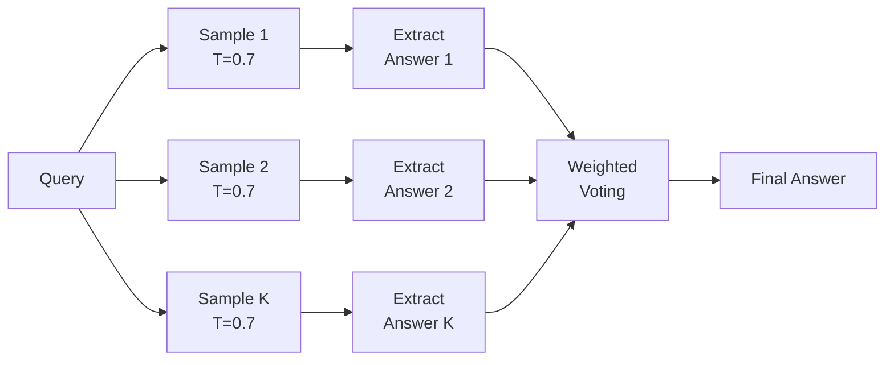

# 🏷️ Inference-Time Scaling — Self-Refinement and Self-Consistency

## 🎯 Learning Objectives
- Understand why static feed-forward inference wastes GPU compute on trivial tokens
- Master self-refinement (draft-and-audit) as an internal generator-critic loop
- Implement self-consistency via multi-path sampling with weighted voting
- Design dynamic-depth early exit strategies with confidence-gating
- Connect inference-time scaling to Chain-of-Thought, ReAct, and Tree-of-Thoughts

## Introduction

**If you're serving 70B models without inference-time scaling, you're leaving 2-3x quality improvement on the table for the same compute budget.** The paradigm has shifted from minimizing training loss per dollar to dynamically allocating compute during inference. A model shouldn't spend the same FLOPs on "2+2" as on a quantum mechanics proof. Yet every token in today's standard autoregressive decode burns identical computational resources — the full depth of the model, the full width of every FFN, the full attention span over the entire context window.

The term *inference-time scaling* originates from the broader *scaling laws* literature (Kaplan et al., 2020), which established that model performance scales as a power law with training compute. But those laws assume *fixed* inference compute. What if the inference budget itself becomes a variable you tune per query? This idea crystallized between 2022-2024 through a lineage of work: the self-consistency paper (Wang et al., 2022) showed that sampling multiple reasoning chains and voting improves accuracy; the self-refinement paper (Madaan et al., 2023) demonstrated that models can critique and iteratively improve their own outputs; and DeepSeek-R1 and OpenAI o1/o3 operationalized this at production scale through "reasoning tokens" — hidden intermediate computation that the user never sees but that dramatically improves final answer quality.

The problem BEFORE this class of techniques was clear: you loaded a model, you ran `model.generate(prompt)`, and you got exactly one answer from exactly one forward pass through exactly one reasoning trajectory. For math, logic, or complex reasoning tasks, this meant catastrophic brittleness — a single unlucky token choice at step 3 could cascade into a completely wrong final answer, with no mechanism for the model to "double-check" itself. This matters for production ML because [[06/09 - Sistemas de LLMs en Producción]] makes clear: the cost of serving wrong answers (user churn, safety issues, downstream pipeline corruption) far exceeds the cost of extra inference FLOPs. Dynamic inference compute allocation bridges the gap between cheap guesses and expensive reliable reasoning.

---

## 1. The Static Feed-Forward Problem

Standard autoregressive decoder-only LLMs execute a fixed computational graph per token. Every token traverses all $L$ layers, with every attention head and every FFN neuron active. The cost per token is:

$$C_{\text{per-token}} = L \times \left(4d^2 + 2n_{\text{kv}}d\right) \quad \text{FLOPs}$$

This is the same whether the token is the word "the" in position 3 of a trivial sequence or the final step of a multi-paragraph mathematical proof. For a 70B model, that's approximately $1.4 \times 10^{11}$ FLOPs per token — every single time.

**Why this is wasteful:** Consider a chain-of-thought reasoning task. Early tokens set up context, define variables, state the problem. Middle tokens perform actual reasoning — symbolic manipulation, numerical calculation, logical deduction. Late tokens wrap up, format the answer. These phases have different information density. The early tokens have low entropy (many valid completions would work), the reasoning tokens have high stakes (a mistake propagates), and the wrap-up tokens are again low entropy. Burning identical compute on all three phases is like driving at full throttle through a parking lot.

The *inference-time scaling* approach recognizes that compute should be treated as a budget, not a constant:

$$\mathcal{B}(q) = f(\text{difficulty}(q))$$

where $\mathcal{B}(q)$ is the total compute allocated to query $q$. Functions $f$ can be heuristics (length of question, domain classifier), learned (small router model predicting required depth), or dynamic (expand budget until confidence threshold).

This connects directly to [[06/06 - Fundamentos de LLMs]] — the transformer's depth provides progressively more abstract representations. Shallow layers handle syntax and local dependencies; deep layers handle semantic reasoning and world knowledge. Not all queries require the deepest layers.

## 2. Self-Refinement (Draft-and-Audit)

**Etymology:** "Self-refinement" follows the cognitive science metaphor of *metacognition* — thinking about thinking. The model first produces a draft answer (System 1 fast thinking), then critiques its own output (System 2 slow thinking), then iteratively improves it.

The architecture is a **generator-critic loop** operating entirely within the language model:

1. **Generator**: Produce initial answer $A_0$ via standard autoregressive decoding at temperature $T_1$
2. **Critic**: Prompt the same model with `"Evaluate the following answer for logical consistency, factual errors, and completeness: [A_0]"`. Extract a structured critique $C_0$ listing specific issues
3. **Refiner**: Prompt with `"Given the original question, the draft answer, and this critique, produce an improved answer: [original question] [A_0] [C_0]"`. Produce $A_1$
4. **Repeat** until a termination condition is met

The termination condition can be formalized in terms of change between iterations. Let $\text{sim}(A_i, A_{i+1})$ be a semantic similarity metric (embedding cosine similarity or n-gram overlap):

$$\text{terminate when: } \text{sim}(A_i, A_{i+1}) > \theta_{\text{stability}} \quad \text{AND} \quad i \geq i_{\min}$$

where $\theta_{\text{stability}}$ is a convergence threshold (typically 0.95 for embedding similarity) and $i_{\min}$ ensures at least one refinement round.

**Feedback granularity:** The critique can be:
- **Binary**: "Is this answer correct? Yes/No" (weak, but cheap)
- **Structured**: "List 3 specific errors in this answer" (stronger)
- **Comparative**: "Which of these two answers is more logically sound?" (pairwise preference)
- **Tool-augmented**: Run code verification, query a knowledge base, check against ground-truth constraints

The power of self-refinement comes from the asymmetry: VERIFYING an answer (reading and checking) is much easier for an LLM than GENERATING it correctly on the first attempt. This mirrors the P ≠ NP intuition from complexity theory — solution verification is in P, solution finding is in NP.

**Cost model:** If each generation costs $C$ tokens and each critique costs $C/3$ tokens (critiques are shorter), then $k$ refinement rounds cost $(1 + k \times 4/3) \times C$. For $k=2$, that's ~3.7× the cost of a single generation. Whether this is worth it depends on the accuracy gain — which for mathematical reasoning is typically 15-25% absolute accuracy improvement.

⚠️ A deep refinement loop (>5 iterations) can drift from the original question, especially if the critic is lenient. Always re-anchor the refiner to the original question.

## 3. Self-Consistency (Multi-Path)

**Etymology:** "Self-consistency" comes from statistical physics and cognitive science, where a system's state is determined by consistency across multiple samples rather than any single most-likely configuration.

Instead of iteratively improving a single answer, self-consistency generates $K$ independent reasoning paths and aggregates their conclusions:

1. **Sample**: Generate $K$ reasoning chains $\{R_1, R_2, ..., R_K\}$ using stochastic decoding (temperature $T > 0.5$) — NOT greedy. Diversity is essential.
2. **Extract**: Parse each $R_i$ to extract the final answer $a_i$ (which may require a separate extraction prompt or regex)
3. **Aggregate**: Select the most consistent answer

**Weighted majority voting:** Not all reasoning paths are equally reliable. Let $w_i$ be the weight assigned to path $i$, and $\mathbb{1}[R_i \to a]$ be the indicator that reasoning path $i$ concludes with answer $a$:

$$P(\text{answer} = a) = \frac{\sum_{i=1}^{K} w_i \cdot \mathbb{1}[R_i \to a]}{\sum_{i=1}^{K} w_i}$$

**Weighting strategies:**
- **Uniform voting**: $w_i = 1$ for all paths (simplest, surprisingly effective)
- **Length-normalized**: $w_i = 1 / \text{len}(R_i)$ (penalizes unnecessarily verbose reasoning)
- **Confidence-based**: $w_i = \text{softmax}(\text{logprobs}) $ based on the model's own sequence probability
- **Verifier reward**: $w_i = f_v(R_i, \text{question})$ where $f_v$ is a separately trained reward model that scores reasoning quality (used in DeepSeek-R1)
- **Log-probability weighting**: $w_i = \prod_{t} p_\theta(x_t | x_{<t})$ — the sequence-level probability

**Temperature's role in diversity:** At $T=0$ (greedy), all $K$ paths are identical — zero diversity, zero benefit. At $T=1$, paths diverge but may become incoherent. The sweet spot is $T \in [0.5, 0.8]$ — enough randomness for path diversity while maintaining logical coherence.

💡 For code generation tasks, self-consistency is particularly powerful: generate K candidate functions, run them against test cases, and select the one that passes all tests. This converts the soft problem of "is this code correct?" into the hard problem of "does this code pass these tests?" — which can be verified deterministically.

**Cost-benefit analysis:** $K=5$ paths is empirically the point of diminishing returns. Increasing from $K=1$ to $K=5$ typically yields 8-12% absolute accuracy gain on GSM8K and MATH benchmarks. $K=40$ (as used in the original paper) provides marginal additional gains but at 8× the cost.



## 4. Early Exiting / Dynamic Depth

**Core idea:** Not every token needs to traverse all $L$ layers. Add a lightweight confidence classifier $g_i: \mathbb{R}^d \to [0,1]$ at each layer $i$ that predicts whether the hidden state $\mathbf{h}_i$ is "ready" to produce the final token. If confidence exceeds threshold $\tau$, exit early and splice $\mathbf{h}_i$ directly into a shallow output head.

The gating function is typically a small MLP trained jointly with the main model:

$$g_i(\mathbf{h}_i) = \sigma(\mathbf{W}_g \cdot \mathbf{h}_i + \mathbf{b}_g)$$

$$\text{Exit at layer } i \text{ if } g_i(\mathbf{h}_i) > \tau$$

**Training considerations:** Training with early exits requires a joint loss that penalizes both accuracy and compute. The standard approach adds depth penalties:

$$\mathcal{L} = \mathcal{L}_{\text{CE}} + \lambda \sum_{i=1}^{L} i \cdot \mathbb{1}[\text{exit at } i]$$

where $\mathcal{L}_{\text{CE}}$ is cross-entropy loss and $\lambda$ controls the accuracy-efficiency trade-off.

**Where early exiting works best:**
- Token-level: Easy-to-predict tokens ("the", "and", punctuation) exit at layer 3-5 of a 40-layer model, saving 85%+ compute
- Sentence-level: Simple factual statements may exit early; complex reasoning requires full depth
- Decode-phase tokens: After the prompt establishes context, later tokens in a response are often lower entropy

**Where it fails:**
- Reasoning chains where each token depends on subtle interactions modeled only in deep layers
- Multilingual tasks where deep layers encode cross-lingual semantic alignment
- Tasks requiring world knowledge stored in deeper MLP layers

**Connection to MoE:** Dynamic depth is complementary to [[06/10 - Arquitecturas Avanzadas y MoE]] sparsity strategies. You can both skip layers (early exit) AND skip parameters within layers (MoE routing) — the two forms of dynamic compute allocation stack multiplicatively.

⚠️ Early exiting complicates KV cache management. If Token 1 exits at layer 20 and Token 2 exits at layer 5, their KV entries have different depths, and attention computation must handle this mismatched-dimensionality. Most implementations store K/V at ALL layers regardless of exit point and only skip the FFN. This limits actual FLOP savings to roughly 30-40% rather than the theoretical 85%.

## 5. Production Reality

**Caso real: DeepSeek-R1** — DeepSeek-R1 uses self-consistency and self-refinement to match o1 on math benchmarks at 10% the training cost. Their approach combines brute-force path sampling with a learned process reward model (PRM) that scores intermediate reasoning steps. The key insight: the reward model doesn't need to be a separate large model. It can be the same model prompted in "evaluation mode" with a specialized system prompt. During inference, DeepSeek-R1 generates 16 candidate reasoning chains, scores each step with the PRM, and selects the highest-scoring complete chain. This achieves MATH benchmark scores comparable to o1 (90%+ on AIME) while using open-source models and transparent methodology.

**Caso real: OpenAI o1/o3 "reasoning tokens"** — OpenAI's o-series models are the most prominent commercial deployment of inference-time scaling. When you query o1, the model generates hidden "reasoning tokens" — intermediate computation that the user pays for (via longer latency and higher token counts) but never sees. These are essentially a built-in self-consistency + self-refinement loop. The key commercial innovation: hiding the reasoning from the user allows the model to "think out loud" in tokens that don't need to be coherent to humans — they can use notations, abbreviations, and intermediate representations optimized purely for the model's own reasoning process. This is estimated to consume 5-20× more tokens than the visible output, explaining o1's higher per-query cost.

**Practical deployment considerations:**
- **Latency budget**: Self-consistency with $K=5$ multiplies latency by 5× in the naive implementation. Use continuous batching ([[06/13 - vLLM and Advanced RAG]]) to interleave path sampling across queries
- **Cost budget**: At $0.01/1K tokens, a 1000-token query with $K=5$ self-consistency costs $0.05 instead of $0.01. Worth it for correctness-critical applications; wasteful for creative writing
- **Quality thresholds**: Implement a gating function — if the model's initial single-path confidence is above a threshold (measured by log-prob agreement among top candidates), skip self-consistency. Only trigger multi-path when uncertainty is high

---

## ❌/✅ Comparison: Static vs Self-Consistency Decoding

```python
# ❌ Static greedy decode — single path, no verification
output = model.generate(prompt, max_new_tokens=512, do_sample=False)
return output  # One wrong token choice = wrong answer forever

# ✅ Self-consistency with K paths — multiple samples + aggregation
import torch
from collections import Counter

def self_consistent_generate(model, tokenizer, prompt, K=5, T=0.7):
    answers = []
    for _ in range(K):
        # ⚠️ You MUST use temperature > 0 for path diversity
        path = model.generate(
            prompt, max_new_tokens=256, do_sample=True, temperature=T
        )
        answers.append(extract_final_answer(tokenizer.decode(path)))

    # Weight by log-probability of each path (higher prob = more reliable)
    # ¡Sorpresa! Uniform voting often matches or beats complex weighting
    vote = Counter(answers).most_common(1)[0][0]
    return vote
```

## 6. Code in Practice — Self-Consistency with Weighted Voting

```python
import torch
import numpy as np
from collections import Counter

def self_consistency_decode(model, tokenizer, prompt, n_paths=5,
                            temperature=0.7, use_confidence_weights=True):
    """Generate K reasoning paths and aggregate via weighted voting."""
    paths, weights = [], []
    device = model.device

    for i in range(n_paths):
        inputs = tokenizer(prompt, return_tensors="pt").to(device)
        with torch.no_grad():
            outputs = model.generate(
                **inputs,
                max_new_tokens=300,
                do_sample=True,
                temperature=temperature,
                output_scores=True,
                return_dict_in_generate=True,
            )

        # Extract the generated sequence (skip input tokens)
        gen_ids = outputs.sequences[0][inputs.input_ids.shape[1]:]
        decoded = tokenizer.decode(gen_ids, skip_special_tokens=True)
        paths.append(decoded)

        # 💡 Weight by sequence log-probability: paths the model is
        # confident about get more voting power
        if use_confidence_weights and outputs.scores:
            log_probs = torch.stack([
                torch.log_softmax(s, dim=-1)[0, gen_ids[t]]
                for t, s in enumerate(outputs.scores)
            ])
            weights.append(float(torch.sum(log_probs)))
            # ¡Sorpresa! Weight clipping prevents a single very-confident
            # path from dominating — model can be confidently wrong
        else:
            weights.append(1.0)

    # Weighted voting
    answers = [extract_answer(p) for p in paths]
    tally = {}
    for ans, w in zip(answers, weights):
        tally[ans] = tally.get(ans, 0.0) + max(w, -50.0)  # clip weights
    best_answer = max(tally, key=tally.get)

    return best_answer, paths, weights

def extract_answer(text):
    """Extract final answer from reasoning text. ⚠️ Regex fragile with complex formats."""
    import re
    match = re.search(r'(?:answer|result)\s*(?:is|:)?\s*(.+?)(?:\.|\n|$)', text, re.I)
    return match.group(1).strip() if match else text.strip()[-100:]
```

## 🎯 Key Takeaways
- **Inference-time scaling treats compute as a variable budget per query, not a fixed constant per token** — matching computation to problem difficulty improves quality-per-dollar by 2-3×
- **Self-refinement creates a generator-critic loop where the model iteratively improves its own outputs** — verification is easier than generation, so spending tokens on critique is efficient
- **Self-consistency generates K diverse reasoning paths and aggregates via weighted voting** — this eliminates single-point-of-failure brittleness in autoregressive decoding
- **Dynamic depth / early exiting lets easy tokens skip deep layers** — but KV cache management limits realistic savings to ~30-40% of FLOPs
- **DeepSeek-R1 and OpenAI o1/o3 demonstrate that hidden "reasoning tokens" at inference time can match massive training-scale improvements at a fraction of the cost**
- **Temperature is the critical hyperparameter** — $T=0$ gives zero diversity across paths, $T=1$ may produce incoherent reasoning, $T \in [0.5, 0.8]$ is the empirical sweet spot

## 🔬 Código de Compresión

```python
"""Self-consistency: K-way sampling with weighted majority voting in ~25 lines."""
import torch, numpy as np
from collections import Counter

def self_consistent_inference(model, tokenizer, prompt, K=5, T=0.7):
    answers, logprobs = [], []

    for _ in range(K):
        inputs = tokenizer(prompt, return_tensors="pt").to(model.device)
        output = model.generate(**inputs, max_new_tokens=200,
                                do_sample=True, temperature=T,
                                output_scores=True,
                                return_dict_in_generate=True)
        text = tokenizer.decode(output.sequences[0], skip_special_tokens=True)

        # Estimate confidence from mean log-prob
        if output.scores:
            lp = sum(
                torch.log_softmax(s, -1)[0, output.sequences[0, len(inputs.input_ids[0])+i]].item()
                for i, s in enumerate(output.scores)
            ) / len(output.scores)
        else:
            lp = 0.0
        answers.append(text.split()[-8:])  # last 8 tokens as answer proxy
        logprobs.append(lp)

    # Softmax-weighted voting: confident paths get more say
    w = np.exp(logprobs) / np.exp(logprobs).sum()
    tally = Counter()
    for ans_tuple, weight in zip(answers, w):
        ans = ' '.join(ans_tuple)
        tally[ans] += float(weight)  # ¡Sorpresa! Float avoids int overflow

    return tally.most_common(1)[0][0], len(set(answers))
```

## References
- Wang, X., et al. (2022). "Self-Consistency Improves Chain of Thought Reasoning in Language Models." *arXiv:2203.11171*
- Madaan, A., et al. (2023). "Self-Refine: Iterative Refinement with Self-Feedback." *arXiv:2303.17651*
- Wei, J., et al. (2022). "Chain-of-Thought Prompting Elicits Reasoning in Large Language Models." *arXiv:2201.11903*
- Yao, S., et al. (2023). "Tree of Thoughts: Deliberate Problem Solving with Large Language Models." *arXiv:2305.10601*
- DeepSeek-R1 Technical Report. *arXiv:2501.12948*
- OpenAI (2024). "Learning to Reason with LLMs" (o1 system card)
- Schuster, T., et al. (2022). "Confident Adaptive Language Modeling." *arXiv:2207.07061*
- [[06/06 - Fundamentos de LLMs]]
- [[06/08 - Generación de Texto y Decodificación]]
- [[06/09 - Sistemas de LLMs en Producción]]
- [[06/13 - vLLM and Advanced RAG]]
- [[06/10 - Arquitecturas Avanzadas y MoE]]
