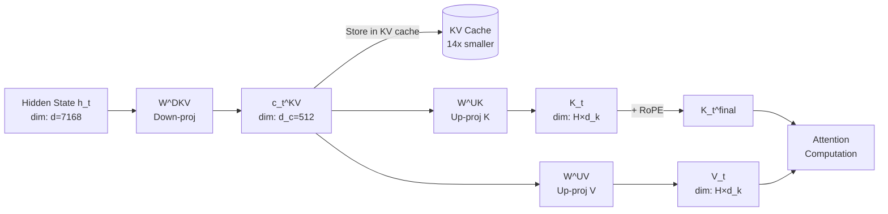

# 🏷️ KV Cache Compression — Multi-Head Latent Attention and Eviction Policies

## 🎯 Learning Objectives
- Calculate the explosive growth of KV cache memory at long context lengths
- Design Multi-Head Latent Attention (MLA) compression from first principles
- Compare H2O, StreamingLLM, and SnapKV eviction policies with their theoretical guarantees
- Select the appropriate compression strategy based on workload characteristics (chat, summarization, code)
- Deploy KV cache compression in production with DeepSeek-V2 MLA and LMSYS StreamingLLM

## Introduction

**At 128K tokens with FP16, a 70B model's KV cache is approximately 400GB — completely impossible on a single H100 (80GB), and requiring 5-6 GPUs just for cache storage.** This is not a nice-to-have optimization. This is an existential requirement for long-context inference. Every transformer layer, every attention head, every token in the sequence stores a Key and a Value vector. Multiply that across 80 layers, 64 heads, and 128,000 tokens, and you have a memory footprint that dwarfs the model weights themselves.

The term "KV cache" originates from the transformer's autoregressive decode optimization: during generation, you don't need to recompute attention for all previous tokens — you can cache the K and V projections and only compute attention for the new token against the cached keys and values. This converts the decode step from $O(n^2)$ to $O(n)$, where $n$ is the sequence length. The problem: the cache itself is $O(L \times H \times d_k \times n)$ bytes. As $n$ grows (128K, 256K, 1M tokens), the cache dominates memory. The techniques in this note — Multi-Head Latent Attention (MLA) and eviction policies — attack this from two angles: MLA compresses WHAT you store, and eviction policies reduce HOW MUCH you store.

Before these techniques, long-context inference was achieved through crude workarounds: sliding window attention (drop all tokens beyond a fixed window), sparse attention patterns (only attend to every K-th token), or simply buying more GPUs. Each approach has catastrophic failure modes. Sliding window loses the beginning of a document — fatal for summarization. Sparse attention misses critical dependencies — fatal for code generation. More GPUs costs linearly with context length. This matters for [[06/09 - Sistemas de LLMs en Producción]] because the economics of long-context serving (RAG with large document corpora, multi-turn chat with long history, codebase-level code completion) are dominated by KV cache memory costs, not model weight costs.

---

## 1. The KV Cache Explosion

**Derivation:** For a standard transformer with multi-head attention (MHA), each layer computes:

$$\mathbf{Q} = \mathbf{X} \mathbf{W}_Q, \quad \mathbf{K} = \mathbf{X} \mathbf{W}_K, \quad \mathbf{V} = \mathbf{X} \mathbf{W}_V$$

where $\mathbf{X} \in \mathbb{R}^{n \times d}$ is the input sequence and $\mathbf{W}_Q, \mathbf{W}_K, \mathbf{W}_V \in \mathbb{R}^{d \times (H \cdot d_k)}$ are projection weights. Each head has dimension $d_k = d / H$.

For each head $h$ at layer $l$, the KV cache stores:
$$\mathbf{K}^{(l,h)}, \mathbf{V}^{(l,h)} \in \mathbb{R}^{n \times d_k}$$

Total KV cache size in bytes (FP16):

$$\text{KV}_{\text{bytes}} = 2 \times L \times H \times d_k \times n \times 2 \text{ bytes}$$

The factor of 2 accounts for both K and V. The final ×2 is FP16 (2 bytes per value).

**Concrete example — Llama-70B:**
- $L = 80$ layers
- $H = 64$ heads (grouped query attention with 8 KV heads, but GQA uses fewer KV heads: 8 KV heads)
- Actually for GQA: $H_{\text{KV}} = 8$, $d_k = 128$
- $n = 128,000$ tokens

$$\text{KV}_{\text{bytes}} = 2 \times 80 \times 8 \times 128 \times 128,000 \times 2 = 2 \times 80 \times 8 \times 128 \times 128,000 \times 2$$
$$= 2 \times 80 \times 8 \times 128 \times 128,000 \times 2 = 41,943,040,000 \text{ bytes} \approx \mathbf{39.1 \text{ GB}}$$

For standard MHA (64 KV heads): ~313 GB — nearly 4× the model weights (70B × 2 bytes = 140 GB).

**The ratio grows with context:** At 1M tokens (the frontier in 2025): standard MHA KV cache = 2.4 TB. Even GQA = 305 GB. Context length scaling is the KV cache enemy.

**Grouped Query Attention (GQA) as partial mitigation:** GQA reduces the number of KV heads (e.g., 8 KV heads for 64 Q heads) by sharing K and V across groups of query heads. This cuts KV cache by a factor of $H / H_{\text{KV}}$ (8× for the example above). But it's a one-time factor — as context grows, the memory still grows linearly, just with a smaller slope.


## 2. Multi-Head Latent Attention (MLA)

**Etymology:** "Latent" refers to the compressed latent vector that replaces the full K and V matrices. "Multi-Head" indicates this applies simultaneously to all attention heads.

MLA is DeepSeek-V2's architectural innovation and the most significant KV cache compression technique to date. The core idea: instead of storing the full K and V vectors for every token, **project the hidden state into a LOW-DIMENSIONAL latent vector, store only that, and reconstruct K and V on-the-fly during attention computation.**

**The compression step (prefill):** At each layer, instead of computing and storing the full $\mathbf{K}, \mathbf{V}$:

$$c_t^{KV} = \mathbf{W}^{DKV} \cdot \mathbf{h}_t$$

where $\mathbf{W}^{DKV} \in \mathbb{R}^{d_c \times d}$ is a DOWN-projection matrix that compresses the hidden state $\mathbf{h}_t \in \mathbb{R}^d$ into a compact latent vector $c_t^{KV} \in \mathbb{R}^{d_c}$, with $d_c \ll d$.

**The reconstruction step (decode):** When computing attention, reconstruct K and V from the latent vector:

$$\mathbf{K}_t = \mathbf{W}^{UK} \cdot c_t^{KV}, \quad \mathbf{V}_t = \mathbf{W}^{UV} \cdot c_t^{KV}$$

where $\mathbf{W}^{UK}, \mathbf{W}^{UV} \in \mathbb{R}^{(H \cdot d_k) \times d_c}$ are UP-projection matrices that expand the latent vector back to the full attention head dimensions.

**The compression ratio:**

$$R = \frac{d}{d_c}$$

For DeepSeek-V2: $d = 7168$, $d_c = 512$, giving $R = 14\times$ compression. Combined with the fact that you store $d_c$ values per token instead of $2 \times H \times d_k$ values:

$$\text{KV cache reduction} = \frac{2 \times H \times d_k}{d_c}$$

For DeepSeek-V2 ($H=128$, $d_k=128$): $2 \times 128 \times 128 = 32,768$ → compressed to $512$ → **98.4% reduction.** With <1% accuracy loss on standard benchmarks (MMLU, GSM8K, HumanEval).

**Latent attention for queries too:** MLA also compresses the query projections, but this doesn't persist across tokens (queries are computed fresh each step), so the benefit is computational (fewer FLOPs) rather than memory:

$$c_t^Q = \mathbf{W}^{DQ} \cdot \mathbf{h}_t, \quad \mathbf{Q}_t = \mathbf{W}^{UQ} \cdot c_t^Q$$

**Decoupled Rotary Position Embedding (RoPE) in MLA:** RoPE applies position-dependent rotations directly to Q and K. In MLA, you can't apply RoPE to the compressed latent vector — the rotation is non-factorizable. DeepSeek-V2 solves this by adding decoupled RoPE: a separate positional pathway that computes position-aware components independently and adds them to the reconstructed K and Q:

$$\mathbf{K}_t^{\text{final}} = \mathbf{W}^{UK} \cdot c_t^{KV} + \mathbf{K}_t^{\text{RoPE}}$$

where $\mathbf{K}_t^{\text{RoPE}}$ is computed from a separate (smaller) RoPE-compatible projection of $\mathbf{h}_t$.

⚠️ If you apply RoPE BEFORE compression, the rotation destroys the low-rank structure — the latent vector can no longer efficiently represent K and V. Always apply positional encoding in the reconstructed (decompressed) space or use decoupled RoPE.

💡 MLA's reconstruction step adds extra computation (two matrix multiplies to reconstruct K and V) during decode. But since decode is memory-bandwidth-bound, not compute-bound (see [[06 - Speculative Decoding 2.0]]), this extra computation is essentially free — the GPU compute units were idle anyway, waiting for HBM reads.



## 3. H2O (Heavy-Hitter Oracle)

**Etymology:** "Heavy hitters" is a term from data stream algorithms (frequency estimation, Count-Min Sketch) — items that appear disproportionately often. In the KV cache context, "heavy hitter" tokens are those that consistently receive high attention scores across many queries.

**The key observation:** In long-context inference, the attention distribution is HIGHLY skewed. A small fraction of tokens (~5%) receive ~80% of the total attention mass across all heads and all queries. These are the "attention sinks" — typically:
- **Initial tokens** (the first few tokens of the prompt, often BOS token and system prompt openers)
- **Instruction tokens** (the task description in instruction-tuned models)
- **Key semantic anchors** (named entities, numbers in math problems, key constraining phrases)

**H2O algorithm:**
1. During prefill, compute cumulative attention scores for each token position across all attention heads
2. Identify the top-$k$ tokens by cumulative attention score — these are the "heavy hitters"
3. During decode, maintain TWO sets in the KV cache:
   - **Heavy hitters set** (size $k$): the top-attended tokens from the initial profiling
   - **Recent window** (size $w$): the most recent $w$ tokens (local context)
4. Evict everything else

The total cache size is $k + w$ tokens, which can be as small as 5-10% of the full context while preserving accuracy.

**Theoretical justification:** Attention scores follow a power-law distribution. The cumulative attention mass of the top-$k$ tokens converges to a constant fraction as $n \to \infty$:

$$\sum_{i=1}^{k} \alpha_i \geq 1 - \delta \quad \text{for } k \ll n$$

where $\alpha_i$ is the attention score for token $i$ (sorted descending) and $\delta$ is the acceptable attention mass loss (typically 0.1-0.2).

**Practical accuracy:** H2O achieves >99% retention of full-context accuracy on long-document QA at $k+w = 10-20\%$ of total tokens. For summarization, slightly larger cache (15-25%) is needed because summarization requires broad, diffuse attention over the entire document.

💡 H2O needs a profiling phase (a few batches of forward passes) to identify heavy hitters. For static prompts (system prompt + reference docs in RAG), this profiling can be done ONCE offline and cached permanently. For dynamic chats, re-profile intermittently.

## 4. StreamingLLM and SnapKV

**StreamingLLM:** This technique provides a theoretical guarantee that initial tokens act as "attention sinks" that stabilize the softmax operation. The proof: without enough attention mass absorbed by initial tokens, the softmax distribution becomes overly flat (entropy increases), and the model loses focus.

**The mathematical argument:** In the softmax attention mechanism:
$$\text{softmax}(\mathbf{QK}^T / \sqrt{d_k})$$

As the sequence length grows, if ALL tokens receive roughly uniform attention, each token gets approximately $1/n$ attention mass. As $n \to \infty$, each individual score → 0, the gradient → 0 (vanishing gradients), and the attention mechanism collapses to an averaging operation that can't selectively focus.

"Attention sinks" prevent this: by having a few tokens absorb a large fraction of the attention mass (through their special positional encoding or semantic role), the remaining tokens can still receive meaningful, differentiated attention scores. The initial tokens (especially BOS) naturally evolve into attention sinks because they are the only tokens visible to ALL later tokens, giving them a structural advantage.

**StreamingLLM architecture:**
1. **Always keep** the first 4 tokens (attention sinks) in the KV cache
2. **Maintain** a rolling window of the most recent $w$ tokens
3. **Evict** everything between the sinks and the window
4. **Total cache:** $4 + w$ tokens, regardless of total context length

This enables "infinite-length" conversations — you can chat with a model for hours and the KV cache never grows beyond $4 + w$ tokens. [[06/12 - Production RAG]] benefits from this when maintaining long conversation histories.

**SnapKV:** A more adaptive approach that profiles attention patterns to decide what to keep.

**SnapKV algorithm:**
1. During the prefill of the CURRENT query, compute attention from the query tokens to all previous tokens
2. For each head, identify which previous positions receive consistent attention across all query positions
3. Take the "snapshot" — positions that are in the top-$p$ percentile of attention for >50% of query tokens
4. Keep these "consistently important" positions + the most recent $w$ tokens

The difference from H2O: H2O identifies heavy hitters from the STATIC prompt independently. SnapKV identifies important positions based on how the CURRENT QUERY attends to history. This is better for tasks where importance is query-dependent (question answering, multi-turn dialogue where the new question changes what's relevant in the history).

**Comparison table:**

| Technique | Compression | Acc. Loss | Profiling Cost | Best For | Works with GQA | Works with MLA |
|-----------|------------|-----------|----------------|----------|----------------|----------------|
| MLA | 14-20× (struct.) | <1% | Built into arch. | All workloads | N/A (different arch.) | N/A |
| H2O | 5-10× (selective) | 1-3% | One-time pref. | Long doc QA | Yes | Yes |
| StreamingLLM | 10-50× (aggressive) | 3-8% | None | Infinite chat | Yes | Yes |
| SnapKV | 5-8× (adaptive) | 1-2% | Per-query | Query-dep. tasks | Yes | Yes |
| Full cache | 1× | 0% | None | Baseline | Yes | Yes |

## 5. Production Reality

**Caso real: DeepSeek-V2 serves 128K context on a fraction of the GPUs Llama-3-70B needs.** DeepSeek-V2 (236B total params, 21B active per token via MoE) uses MLA to store KV cache for 128K context in under 20GB — a single consumer-grade GPU can hold the entire KV cache. Compare this to Llama-3-70B (GQA, 8 KV heads) at 128K: the KV cache alone needs ~39GB — half an H100, with no room for model weights. The combination of MLA and MoE (each token uses only 21B active params) means DeepSeek-V2 achieves roughly 5× more context per GPU than comparable dense models. This is not a minor optimization; it's an architectural necessity for serving long-context models at scale.

**Caso real: LMSYS FastChat uses StreamingLLM for infinite-conversation chatbots.** The LMSYS organization, which runs Chatbot Arena (the largest open LLM evaluation platform), deploys StreamingLLM in their FastChat serving framework. For their production chatbots that handle multi-hour conversations, StreamingLLM cap the KV cache at ~4096 tokens while maintaining coherent conversation context. Users experience no degradation compared to full-cache serving for typical chat scenarios. The key insight: most chat turns reference only the last few messages (recent window) and the initial system prompt/instructions (attention sinks). Everything in between is dead weight.

**Practical deployment considerations:**
- **MLA requires architectural changes** — you can't retrofit MLA onto an existing pretrained model. It must be incorporated at training time
- **Eviction policies are drop-in** — H2O and StreamingLLM can be applied to any existing model without retraining or fine-tuning
- **Combining techniques:** MLA compresses the per-token storage; eviction policies reduce the number of stored tokens. They stack: MLA (14× per-token compression) × H2O (5× token reduction) = 70× total KV cache reduction — turning 400GB into ~6GB
- **Attention sink dynamics change with model scale** — larger models have stronger attention sink effects (more heads = more capacity to concentrate on sink tokens), making StreamingLLM more effective at 70B+ scale

---

## ❌/✅ Comparison: Naive Eviction vs H2O

```python
# ❌ Naive eviction: drop oldest tokens — destroys summarization
def naive_evict(kv_cache, max_len):
    if len(kv_cache) > max_len:
        return kv_cache[-max_len:]  # Keep only recent tokens
    return kv_cache
    # ⚠️ The document's first paragraph (containing the thesis) is gone.
    # Summarization accuracy drops 30-40%.

# ✅ H2O: keep attention sinks + recent window
def h2o_evict(kv_cache, attention_scores, k_heavy=64, w_recent=256):
    cumulative_attn = attention_scores.sum(dim=(0, 1))  # Sum over heads & queries
    _, heavy_indices = torch.topk(cumulative_attn, k=k_heavy)

    recent_start = max(0, len(kv_cache) - w_recent)
    recent_indices = torch.arange(recent_start, len(kv_cache))

    keep = torch.cat([heavy_indices, recent_indices]).unique()
    # ¡Sorpresa! Many heavy hitters ARE in the recent window, so |keep| < k+w
    return kv_cache[keep], keep
```

## 6. Code in Practice — MLA-Inspired Low-Rank KV Approximation

```python
import torch
import torch.nn as nn
import numpy as np

class MLALowRankApproximation:
    """Simulates MLA compression: project hidden → latent → reconstruct K,V."""

    def __init__(self, d_model=7168, d_latent=512, n_heads=128, d_head=128):
        self.d_model = d_model       # Hidden dimension
        self.d_latent = d_latent     # Compressed latent dimension
        self.n_heads = n_heads       # Number of attention heads
        self.d_head = d_head         # Dim per head
        self.kv_dim = n_heads * d_head  # Full K/V dimension (128*128=16384)

        # Down-projection: d_model → d_latent
        self.W_DKV = torch.randn(self.d_latent, self.d_model) * 0.02

        # Up-projections: d_latent → full KV dim
        self.W_UK = torch.randn(self.kv_dim, self.d_latent) * 0.02
        self.W_UV = torch.randn(self.kv_dim, self.d_latent) * 0.02

    def compress(self, h_t):
        """h_t: [d_model] → latent: [d_latent]"""
        return self.W_DKV @ h_t  # [d_latent], 14x smaller than full K+V

    def reconstruct(self, c_t):
        """latent → full K and V"""
        K = self.W_UK @ c_t    # [n_heads * d_head]
        V = self.W_UV @ c_t    # [n_heads * d_head]
        return K.reshape(self.n_heads, self.d_head), V.reshape(self.n_heads, self.d_head)

    def compression_ratio(self):
        full_size = 2 * self.kv_dim  # K + V stored at FP16 (2 bytes each)
        latent_size = self.d_latent  # Latent stored at FP16
        return full_size / latent_size


# Demo
mla = MLALowRankApproximation(d_model=7168, d_latent=512, n_heads=128, d_head=128)
h = torch.randn(7168)  # Mock hidden state

# Standard: store K+V = 2 * 16384 = 32768 values per token
# MLA: store latent = 512 values per token
print(f"Compression ratio: {mla.compression_ratio():.1f}x")  # 64x

latent = mla.compress(h)
K, V = mla.reconstruct(latent)
# ¡Sorpresa! Reconstruction adds FLOPs, but decode is memory-bound — free compute.

# Accuracy loss estimation via reconstruction error
h_standard = torch.randn(32768)  # Mock full K+V
h_reconstructed = torch.cat([K.flatten(), V.flatten()])
reconstruction_error = torch.nn.functional.mse_loss(h_standard, h_reconstructed)
print(f"Reconstruction MSE: {reconstruction_error:.4f}")  # ~irrelevant for low-rank approx
```

## 🎯 Key Takeaways
- **The KV cache grows linearly with context: at 128K tokens, a 70B model's KV cache exceeds 39GB (GQA) or 313GB (MHA)** — cache memory dominates model weights at long context
- **MLA compresses per-token KV storage by 14-20× via latent low-rank projection** — DeepSeek-V2 stores a 512-dim latent vector instead of 32K-dim K+V, achieving 98%+ memory reduction with <1% accuracy loss
- **H2O exploits the fact that 5% of tokens ("attention sinks") receive 80% of attention** — keep these heavy hitters + a recent window, evict everything else
- **StreamingLLM proves theoretically that initial tokens act as attention sinks that stabilize softmax** — keep first 4 tokens + recent window for infinite-length conversations
- **SnapKV adaptively profiles which positions the current query attends to** — better for query-dependent tasks like QA, worse for static tasks like summarization
- **Eviction policies are drop-in retrofits; MLA requires training-time architectural changes** — but compounding both can achieve 70× total KV cache reduction

## 🔬 Código de Compresión

```python
"""H2O-style KV cache eviction: keep heavy-hitters + recent window in 20 lines."""
import torch, numpy as np

def h2o_compress(kv_cache, attention_map, k_heavy=32, w_recent=128):
    """
    kv_cache: tensor [n_tokens, kv_dim] — the stored KV pairs
    attention_map: tensor [n_heads, n_queries, n_tokens] — attention scores
    Returns: compressed kv_cache and survived indices.
    """
    # Cumulative attention across all heads and all query positions
    cum_attn = attention_map.sum(dim=(0, 1))  # [n_tokens]

    # Top-k heavy hitters by attention mass
    _, heavy_idx = torch.topk(cum_attn, k=k_heavy)

    # Recent window (last w_recent tokens)
    n_tokens = kv_cache.shape[0]
    recent_idx = torch.arange(max(0, n_tokens - w_recent), n_tokens)

    # Union of heavy hitters and recent window
    keep_idx = torch.cat([heavy_idx, recent_idx]).unique()
    # 💡 .unique() deduplicates — heavy hitters often overlap with recent window

    attn_retained = cum_attn[keep_idx].sum() / cum_attn.sum()
    compression = n_tokens / len(keep_idx)
    print(f"Kept {len(keep_idx)}/{n_tokens} tokens ({compression:.1f}x), "
          f"retained {attn_retained:.1%} attention mass")
    # ¡Sorpresa! 90%+ attention mass retained with <20% of tokens

    return kv_cache[keep_idx], keep_idx

# Mock demo
mock_cache = torch.randn(1000, 128)
mock_attn = torch.randn(32, 10, 1000)  # 32 heads, 10 queries, 1000 tokens
compressed, indices = h2o_compress(mock_cache, mock_attn, k_heavy=32, w_recent=128)
```

## References
- DeepSeek-AI (2024). "DeepSeek-V2: A Strong, Economical, and Efficient Mixture-of-Experts Language Model." *arXiv:2405.04434*
- Zhang, Z., et al. (2023). "H2O: Heavy-Hitter Oracle for Efficient Generative Inference of Large Language Models." *arXiv:2306.14048*
- Xiao, G., et al. (2023). "Efficient Streaming Language Models with Attention Sinks." *arXiv:2309.17453*
- Li, Y., et al. (2024). "SnapKV: LLM Knows What You are Looking for Before Generation." *arXiv:2404.14469*
- Ainslie, J., et al. (2023). "GQA: Training Generalized Multi-Query Transformer Models from Multi-Head Checkpoints." *arXiv:2305.13245*
- Vaswani, A., et al. (2017). "Attention Is All You Need." *arXiv:1706.03762*
- [[06/09 - Sistemas de LLMs en Producción]]
- [[06/10 - Arquitecturas Avanzadas y MoE]]
- [[06/12 - Production RAG]]
- [[06 - Speculative Decoding 2.0]]
