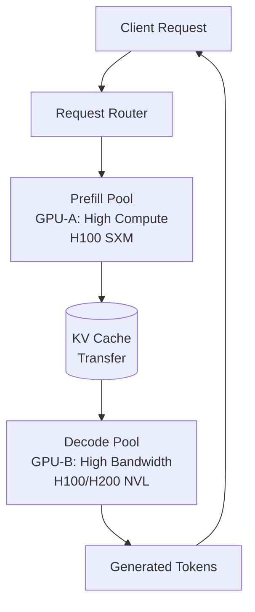

# 🏷️ Disaggregated Serving and Edge Inference — Prefill/Decode Split, NPU, and ExecuTorch

## 🎯 Learning Objectives
- Decompose LLM inference into prefill (compute-bound) and decode (memory-bound) phases with opposite hardware requirements
- Design disaggregated serving architectures that split prefill and decode across different GPU types for 2× throughput
- Evaluate NPU hardware (Apple Neural Engine, Qualcomm Hexagon, Intel NPU, AMD Ryzen AI) for on-device inference
- Export and optimize models for edge deployment using ExecuTorch and ONNX Runtime with INT4/FP4 quantization
- Architect end-to-end systems combining cloud disaggregated serving with edge failover

## Introduction

**Inference has TWO distinct phases with opposite compute profiles. Treating them as one loses 2× throughput. Meanwhile, edge inference eliminates cloud dependency entirely — running foundation models on the phone in your pocket.** These two trends — disaggregated serving in the cloud and NPU-accelerated inference at the edge — represent the yin and yang of modern inference infrastructure. Cloud disaggregation maximizes throughput per GPU-dollar for serving millions of users. Edge inference eliminates latency, privacy concerns, and cloud costs for single-user scenarios. Together, they cover the full spectrum from hyperscale cloud to fully offline personal AI.

The term "disaggregated serving" comes from the broader "disaggregated computing" trend in data centers — the idea that compute, memory, and storage should be pooled as independent resources rather than locked together in monolithic servers. Applied to LLM inference, "disaggregation" specifically refers to separating the prefill phase (which processes the entire prompt in parallel) from the decode phase (which generates tokens autoregressively). These phases have fundamentally different resource profiles: prefill saturates tensor cores (compute-bound), decode saturates HBM bandwidth (memory-bound). Running both on the same GPU means one of them is always underutilized. Splitting them across specialized GPU pools — high-compute GPUs for prefill, high-bandwidth GPUs for decode — can double overall system throughput.

Before disaggregated serving, LLM inference systems treated prefill and decode as monolithic: every request followed the path prefill → decode → output on the same GPU. This is the architecture used in early vLLM, TGI, and most open-source serving frameworks. It works, but it's fundamentally inefficient because the GPU alternates between being compute-starved (during decode) and memory-bandwidth-starved (during prefill). Edge inference, meanwhile, was virtually nonexistent before 2024 — phones couldn't run anything beyond toy models. The combination of NPU hardware (dedicated matrix accelerators on consumer silicon), INT4 quantization, and ExecuTorch/ONNX Runtime deployment frameworks has changed that entirely. This matters for [[06/09 - Sistemas de LLMs en Producción]] because the architectural decisions made at the serving layer determine the cost structure of the entire ML product.

---

## 1. The Two Phases of Inference

To understand why disaggregation works, you must first understand why prefill and decode are fundamentally different workloads.

### Prefill Phase

**Goal:** Process the entire input prompt (which may be thousands of tokens) to produce the KV cache and compute the first output token's hidden state.

**Compute characteristics:**

- The prompt is processed in a **single parallel forward pass** (or batched into chunks for extremely long prompts)
- All prompt tokens attend to all previous prompt tokens (full bidirectional, masked for causality)
- The attention computation is $O(n_{\text{prompt}}^2)$ per layer
- GEMM operations dominate: $QK^T$ (square matmul), $\text{softmax}(QK^T)V$ (square matmul), FFN (rectangular matmuls)
- This is a **compute-bound** workload: FLOPs >> bytes read, GPU arithmetic units are the bottleneck

For a 70B model processing a 4096-token prompt:
$$F_{\text{prefill}} \approx 2 \times L \times d^2 \times n \approx 2 \times 80 \times 8192^2 \times 4096 \approx 4.4 \times 10^{13} \text{ FLOPs}$$
$$M_{\text{prefill}} \approx 140 \text{ GB (model weights)} + 2 \times L \times H \times d_k \times n \times 2 \text{ bytes} \approx 141 \text{ GB}$$

Arithmetic intensity: $I_{\text{prefill}} \approx 314 \text{ FLOPs/byte}$ — this matches or exceeds the H100's 295 FLOPs/byte, making it compute-bound.

### Decode Phase

**Goal:** Generate output tokens one at a time, using the cached KV states from prefill.

**Compute characteristics:**

- Each decode step processes **exactly 1 new token**
- Attention: the new token's Q attends to ALL previous K,V (cached) — $O(n)$ per step
- The model weights are read in full from HBM for every single token
- GEMM operations are small-batch: weight matrices are huge, batch dimension is 1

For a 70B model decoding each token:
$$F_{\text{decode}} \approx 4 \times L \times d^2 \approx 4 \times 80 \times 8192^2 \approx 2.15 \times 10^{10} \text{ FLOPs}$$
$$M_{\text{decode}} \approx 140 \text{ GB}$$

$$I_{\text{decode}} \approx 0.15 \text{ FLOPs/byte}$$

This is 2000× lower than prefill. The GPU compute units are idle 99.95% of the time, waiting for weights to arrive from HBM. This is a **memory-bandwidth-bound** workload.

### Hardware Implications

- **Prefill GPU**: Needs high compute throughput (many tensor cores, high clock). Memory bandwidth is secondary. Example: H100 SXM (989 TFLOPS FP16, 3.35 TB/s)
- **Decode GPU**: Needs high memory bandwidth (to read weights faster). Compute throughput is secondary. Example: H100 SXM (same GPU! But different bottlenecks)
- **The problem**: Running prefill and decode on the SAME GPU means prefill underutilizes memory bandwidth (it's compute-stalled anyway), and decode underutilizes compute (it's memory-stalled anyway). Neither phase uses the full GPU.

**The fundamental inefficiency:** On a single GPU handling both phases, utilization oscillates between ~60% (prefill, compute-bound) and ~5% (decode, memory-bound). Weighted by time spent in each phase (prefill is short but intense; decode is long but sparse), average GPU utilization is ~30-40%. This is why serving companies need so many GPUs.



## 2. Disaggregated Serving Architecture

**The solution:** Split the two phases across different GPU machines connected by high-speed interconnects (NVLink, InfiniBand).

**Architecture:**

1. **Prefill cluster (GPU type A):** Receives incoming requests, processes the prompt in a batched parallel pass, produces the KV cache for the full context
2. **KV cache transfer:** Serialize the KV cache (can be tens of GB for long prompts) and transfer it over InfiniBand/NVLink to the decode cluster. This transfer must be:
   - **Zero-copy** where possible (RDMA over InfiniBand)
   - **Incremental** for streaming (start transferring before prefill completes)
   - **Compressed** using [[07 - KV Cache Compression - Multi-Head Latent Attention]] techniques like MLA to reduce transfer size
3. **Decode cluster (GPU type B):** Receives the KV cache, initializes the autoregressive generation, and streams tokens back to the client
4. **Optional: Decode-to-prefill offloading:** If the conversation continues and context grows, the decode cluster may need to re-run prefill on the expanded context — this is offloaded back to the prefill cluster

**Why this improves throughput:**
- Prefill GPUs run near-continuous prefill batches — always compute-bound, always at 90%+ utilization
- Decode GPUs run continuous decode — always memory-bandwidth-bound, but since decode doesn't need high compute anyway, GPU utilization measured by "tokens out per second" approaches theoretical maximum
- Each GPU type specializes in what it's good at, rather than alternating between two modes

**Throughput analysis:**

Monolithic: If a GPU spends 20% of time on prefill (at 60% utilization) and 80% on decode (at 5% utilization), throughput per GPU is limited by whichever phase is active. Throughput $T_{\text{mono}}$ is approximately:
$$T_{\text{mono}} \approx \min\left(\frac{\text{prefill throughput}}{0.2}, \frac{\text{decode throughput}}{0.8}\right)$$

Disaggregated: Prefill pool runs at 90% utilization 100% of the time; decode pool runs at its memory-bandwidth limit. Throughput per total GPU count:
$$T_{\text{disagg}} \approx \min\left(\text{PrefillPoolCap}, \text{DecodePoolCap}\right) \approx 1.8-2.2 \times T_{\text{mono}}$$

**SGLang's implementation:** [[06/17-03 - SGLang (current course)]] is one of the first open-source frameworks to natively support disaggregated serving. Its `prefill_instances` and `decode_instances` configurations let you specify separate GPU groups. SGLang handles KV cache transfer transparently and supports dynamic rebalancing — if the prefill pool is overloaded, it can temporarily redirect some lightweight prefill requests to the decode pool in degraded mode.

**Pre-Decode Disaggregation (PD disaggregation):** A more recent variant that additionally splits the computation within the prefill phase. The insight: the attention computation in prefill has $O(n^2)$ cost, and beyond ~8K tokens, this dominates. PD disaggregation dedicates specialized "attention GPUs" (with large SRAM for attention matrices) to handle just the attention computation, while "FFN GPUs" handle the feed-forward layers. This is primarily relevant for >32K context lengths.

⚠️ KV cache transfer between prefill and decode GPUs adds latency. For a 70B model with GQA at 4096 context: KV cache ≈ 1.25 GB. At 400 GB/s InfiniBand (NDR): transfer time ≈ 3.1 ms. This is acceptable (adds ~1% to total latency for a 300ms prefill). But for extremely long contexts (128K): KV cache ≈ 39 GB, transfer time ≈ 98 ms — possibly unacceptable for real-time chat. Solutions: transfer incrementally, use MLA compression, or merge prefill and decode for very long contexts.

## 3. Edge Inference and Neural Processing Units (NPUs)

**The edge paradigm shift:** Why send a 3-second voice query to a cloud GPU 500 miles away when the phone in your hand can run a 3B parameter model locally in 300ms with zero network latency?

### Apple Neural Engine (ANE)

The ANE is a dedicated matrix-math accelerator integrated into Apple's A-series (A14+) and M-series (M1+) chips. It is NOT a GPU, NOT a CPU — it's a specialized inference processor.

**Architecture:**
- 16-core design (A17 Pro, M3): each core is a SIMD matrix engine
- Native support for FP16 and INT8 operations
- **15.8 TOPS** (trillion operations per second) at INT8 on A17 Pro
- On-chip memory: ~32MB unified with CPU/GPU (uses Apple's unified memory architecture)
- Power efficiency: ~0.5W during inference (vs ~150W for an H100)

**ANE programming model:** You don't program the ANE directly. Core ML (Apple's inference framework) automatically maps compatible operations to the ANE when available. Operations that ANE doesn't support (complex control flow, dynamic shapes) fall back to the GPU or CPU. This is transparent to the developer.

**ExecuTorch on ANE:** ExecuTorch compiles PyTorch models with ANE-specific backend lowering. Operations supported include: Conv2D, GEMM, LayerNorm, Softmax, ReLU/GELU, and most attention operations. Operations NOT supported: dynamic control flow, custom CUDA-style kernels, sparse operations.

### Qualcomm AI Engine (Snapdragon)

**Architecture:**
- **Hexagon Tensor Processor:** Dedicated INT4/INT8/FP16 matrix accelerator
- **Adreno GPU:** For operations not supported by Hexagon
- **Kryo CPU:** For control flow and pre/post-processing
- **Sensing Hub:** Always-on low-power AI processor for voice triggers, face detection
- Combined: up to **45 TOPS** (INT4) on Snapdragon 8 Gen 3

**Qualcomm AI Stack:**
1. **Qualcomm Neural Processing SDK (SNPE):** Converts models from TensorFlow, PyTorch, ONNX to Qualcomm's DLC (Deep Learning Container) format
2. **Qualcomm AI Engine Direct:** Lower-level API for maximum performance
3. **QNN (Qualcomm Neural Network):** For ONNX Runtime integration

Qualcomm's advantage: **INT4 support.** At INT4, a 3B parameter model occupies 1.5GB — fitting comfortably in a phone's 8-12GB RAM alongside apps and OS. The Hexagon processor can run INT4 GEMM at up to 45 TOPS, enabling >40 tok/s for Llama-3.2-3B on-device.

### Intel NPU (Meteor Lake+)

Intel's NPU is integrated into Core Ultra processors (Meteor Lake, Arrow Lake, Lunar Lake). It's positioned as a "low-power AI accelerator" for always-on workloads:
- **11 TOPS** (Meteor Lake), **48 TOPS** (Lunar Lake) at INT8
- Designed for Copilot+ PC workloads (Windows Recall, background AI features)
- OpenVINO integration: models compiled with OpenVINO can target NPU automatically

### AMD Ryzen AI (XDNA Architecture)

AMD's NPU uses adaptive dataflow architecture (XDNA):
- **16 TOPS** (Ryzen 7040 Phoenix), **50 TOPS** (Ryzen AI 300 Strix Point) at INT8
- Designed for Windows Studio Effects, Copilot+, and on-device LLM inference
- ONNX Runtime integration via Vitis AI EP (Execution Provider)

**Comparison table:**

| NPU | Platform | Max TOPS (INT8) | INT4 | Power | Best For |
|-----|----------|-----------------|------|-------|----------|
| Apple ANE (A17 Pro) | iPhone 15 Pro | 15.8 | No | ~0.5W | iOS apps, Core ML |
| Apple ANE (M3) | MacBook Pro | 18 | No | ~1W | macOS apps, Core ML |
| Qualcomm Hexagon (8 Gen 3) | Android phones | 45 | Yes | ~2W | Android apps, QNN |
| Qualcomm Hexagon (X Elite) | Windows ARM PCs | 45 | Yes | ~5W | Copilot+ PCs |
| Intel NPU (Meteor Lake) | Core Ultra laptops | 11 | No | ~1.5W | OpenVINO, Windows AI |
| Intel NPU (Lunar Lake) | Core Ultra laptops | 48 | Yes | ~2W | OpenVINO |
| AMD Ryzen AI (XDNA 2) | Ryzen AI 300 laptops | 50 | Yes | ~3W | ONNX Runtime, Vitis AI |


## 4. ExecuTorch and ONNX Runtime for Edge

### ExecuTorch

ExecuTorch is PyTorch's answer to edge deployment — a unified framework for compiling, quantizing, and running PyTorch models on mobile and embedded devices.

**Key features:**
- **Ahead-of-Time (AOT) compilation:** Exports the model computation graph OFF-device, producing a `.pte` (PyTorch Edge) file containing optimized, hardware-specific binaries
- **Delegation system:** Model operations are delegated to hardware-specific backends:
  - `CoreMLBackend` → Apple Neural Engine
  - `XNNPACK` → CPU (ARM NEON optimized)
  - `VulkanBackend` → Mobile GPU (Android)
  - `QNNBackend` → Qualcomm Hexagon NPU
- **INT4 quantization:** Supports group-wise INT4 symmetric quantization. Weights are stored as 4-bit integers (two per byte), activations are quantized dynamically at runtime
- **Memory planning:** Pre-allocates all tensor memory at load time (no dynamic allocations during inference), enabling deterministic memory usage and preventing out-of-memory crashes

**Export workflow:**
```python
# 1. Export with quantization
import torch
from executorch.exir import to_edge
from executorch.backends.apple.coreml import CoreMLBackend

model = load_pretrained_llama()
# Apply INT4 quantization
model = torch.ao.quantization.quantize_dynamic(
    model, qconfig_spec={torch.nn.Linear}, dtype=torch.qint4
)
# Export to edge format
edge_program = to_edge(torch.export.export(model, example_inputs))
# Delegate to Core ML (Apple Neural Engine)
edge_program = edge_program.to_backend(CoreMLBackend())
exec_program = edge_program.to_executorch()
with open("llama3.pte", "wb") as f:
    exec_program.write_to_file(f)
```

**ExecuTorch Runtime (on-device):**
```cpp
// C++ runtime on iOS/Android
#include <executorch/runtime/executor/program.h>
auto program = torch::executor::Program::load("llama3.pte");
auto method = program->load_method("forward");
auto result = method->execute({input_tensor});
```

**Caso real: Apple Intelligence on-device foundation models.** Apple's June 2024 WWDC announcement of Apple Intelligence revealed that foundation models run on-device (iPhone 15 Pro, M-series Macs) via the Apple Neural Engine. The models are compiled through ExecuTorch with Core ML backend delegation. The key technical achievement: running a ~3B parameter model on a phone with <1 second first-token latency and ~30 tok/s generation speed, while using only ~2GB of the phone's unified memory. This enables features like on-device summarization, writing tools, and image generation without sending data to Apple's servers.

### ONNX Runtime (Edge)

ONNX Runtime provides an alternative edge deployment path with broader hardware support:

**Execution Providers (EPs) for NPUs:**
- **QNN EP** (Qualcomm): Maps ONNX ops to Qualcomm's QNN API for Hexagon NPU execution
- **CoreML EP** (Apple): Maps ONNX ops to Core ML for ANE execution
- **OpenVINO EP** (Intel): Maps to Intel NPU via OpenVINO
- **Vitis AI EP** (AMD): Maps to AMD XDNA NPU

**QDQ (Quantize-Dequantize) format:** ONNX Runtime uses QDQ nodes to represent quantization in the ONNX graph:
```
Input (FP16) → QuantizeLinear (FP16→INT4) → Conv/GEMM (INT4) → DequantizeLinear (INT4→FP16) → Output
```

This format is hardware-agnostic: each NPU Execution Provider interprets QDQ nodes into its own native quantized operations.

💡 For cross-platform deployment, export to ONNX with QDQ format, then use different ONNX Runtime EPs for each target platform. A single ONNX model can target Qualcomm (Android), Apple ANE (iOS), Intel NPU (Windows), and AMD XDNA (Windows) — the EP handles hardware-specific lowering.

⚠️ Not all operations are supported on all NPU backends. Operations like dynamic GQA attention with rotary embeddings may fall back to CPU on some platforms, creating a performance cliff. Always profile your model on the actual target hardware.

## 5. Production Reality and Full-Spectrum Architecture

**Caso real: Apple Intelligence runs foundation models on-device (iPhone 15 Pro+).** As described above, Apple's on-device models demonstrate that production-quality LLM inference at the edge is real. The key numbers: 3B parameter model, ~30 tok/s, <1s time-to-first-token, all on a phone powered by a ~15W SoC. Privacy benefit: user data never leaves the device. Latency benefit: zero network round-trip. This sets the standard for what "edge inference" means in production.

**Caso real: Qualcomm AI Engine powers on-device Stable Diffusion and LLM inference.** Qualcomm demonstrated Stable Diffusion XL (2.6B parameter UNet) generating a 512×512 image in <1 second on Snapdragon 8 Gen 3. For LLMs, their reference implementation runs Llama-3.2-3B at 40+ tok/s with INT4 quantization on the Hexagon NPU. Samsung's Galaxy AI features (launched with Galaxy S24) use Qualcomm's AI Engine for on-device summarization, translation, and photo editing — processing user data entirely on-device.

**Full-spectrum architecture (cloud + edge):**

A production ML system should architect for BOTH cloud and edge, with intelligent routing:

1. **Tier 1 (local NPU):** Simple queries (factual lookups, short completions, grammar checks) → 3B model on device. Latency: <100ms. Cost: $0.
2. **Tier 2 (cloud, disaggregated):** Complex queries (math reasoning, code generation, long-form summarization) → 70B model on cloud disaggregated serving. Latency: 500ms-2s. Cost: $0.005-0.05/query.
3. **Tier 3 (hybrid):** Privacy-sensitive complex queries → encrypt prompt, send to cloud for prefill/disaggregated decode, but run post-processing on-device. Data is encrypted end-to-end.
4. **Failover:** If device NPU is unavailable (battery low, older device), transparently fail over to cloud inference. If cloud is unavailable (network down, rate limited), degrade to local 3B model.

This architecture combines the cost/privacy benefits of edge inference with the capability benefits of cloud disaggregated serving.

---

## ❌/✅ Comparison: Monolithic vs Disaggregated Serving

```python
# ❌ Monolithic: same GPU handles prefill AND decode
class MonolithicServer:
    def handle_request(self, prompt):
        kv_cache = self.gpu.prefill(prompt)  # GPU 60% utilized
        output = []
        for _ in range(max_tokens):
            token = self.gpu.decode_one(kv_cache)  # Same GPU, now 5% utilized!
            # ⚠️ GPU alternates between compute-starved and memory-starved
            output.append(token)
        return output

# ✅ Disaggregated: prefill pool → KV transfer → decode pool
class DisaggregatedServer:
    def handle_request(self, prompt):
        # Prefill: high-compute GPU pool
        kv_cache = self.prefill_pool.dispatch(prompt)  # 90%+ utilization

        # Transfer KV cache over InfiniBand/RDMA
        kv_cache_id = self.kv_cache_store.put(kv_cache)
        self.decode_pool.send_kv_cache(kv_cache_id)

        # Decode: high-bandwidth GPU pool
        # ¡Sorpresa! Decode GPUs can batch KV caches from many requests
        output = self.decode_pool.generate(kv_cache_id, max_tokens)
        return output
```

## 6. Code in Practice — ExecuTorch Export and ONNX Runtime Edge Deployment

```python
"""
ExecuTorch export + ONNX Runtime with INT4 quantization.
Demonstrates the edge deployment pipeline for both frameworks.
"""
import torch
import torch.nn as nn
import numpy as np

# ---- PART 1: ExecuTorch Export (conceptual) ----
class TinyLLM(nn.Module):
    """Minimal LLM-like module for demonstration."""
    def __init__(self):
        super().__init__()
        self.embed = nn.Embedding(1000, 256)
        self.proj = nn.Linear(256, 256)
        self.lm_head = nn.Linear(256, 1000)

    def forward(self, x):
        h = self.embed(x)
        h = self.proj(h)  # ⚠️ In real deployment, this would be quantized to INT4
        return self.lm_head(h)

model = TinyLLM().eval()
example_input = torch.randint(0, 1000, (1, 16))

# INT4 dynamic quantization (PyTorch native)
# 💡 qint4 stores 2 values per byte — 75% memory reduction vs FP16
quantized_model = torch.ao.quantization.quantize_dynamic(
    model, {nn.Linear, nn.Embedding}, dtype=torch.qint4, inplace=False
)

# Export: (in production, use executorch.exir.to_edge with backend delegation)
# torch.onnx.export(quantized_model, example_input, "model.onnx",
#                   opset_version=17)  # Requires QDQ operator support

# ---- PART 2: ONNX Runtime with INT4 QDQ (conceptual) ----
# The ONNX graph would contain QuantizeLinear/DequantizeLinear nodes:
# Graph: Input → QLinearMatMul(INT4) → DQLinear → Output

# ONNX Runtime inference with QNN EP (Qualcomm NPU):
"""
import onnxruntime as ort

# List available execution providers
print(ort.get_available_providers())
# ['QNNExecutionProvider', 'CPUExecutionProvider', ...]

session = ort.InferenceSession(
    "model_int4_qdq.onnx",
    providers=['QNNExecutionProvider', 'CPUExecutionProvider']
    # ¡Sorpresa! Falls back to CPU if QNN EP doesn't support an op
)
output = session.run(None, {'input': input_array.astype(np.int64)})
"""

# ---- PART 3: Edge deployment measurement ----
memory_fp16 = sum(p.numel() * 2 for p in model.parameters())  # FP16: 2 bytes/param
memory_int4 = sum(p.numel() * 0.5 for p in model.parameters())  # INT4: 0.5 bytes/param
print(f"FP16 memory: {memory_fp16/1e6:.1f} MB")
print(f"INT4 memory: {memory_int4/1e6:.1f} MB")
print(f"Compression: {memory_fp16/memory_int4:.1f}x")
# Expected: 4× compression (2 bytes → 0.5 bytes per param)
```

## 🎯 Key Takeaways
- **LLM inference has two phases with opposite hardware requirements** — prefill is compute-bound (needs FLOPs), decode is memory-bandwidth-bound (needs HBM throughput)
- **Disaggregated serving splits prefill and decode across different GPU pools** — each GPU type runs at 90%+ utilization instead of 30-40%, achieving 1.8-2.2× system throughput
- **KV cache transfer between prefill and decode GPUs is the critical path** — RDMA over InfiniBand keeps transfer time under 5ms for typical contexts, but 128K+ contexts need compression or incremental transfer
- **Neural Processing Units (NPUs) bring production-quality inference to consumer devices** — Apple ANE (15.8 TOPS), Qualcomm Hexagon (45 TOPS), Intel NPU (48 TOPS), AMD Ryzen AI (50 TOPS) all support INT4/INT8 inference
- **ExecuTorch compiles PyTorch models for edge hardware with AOT compilation and hardware-specific delegation** — one `.pte` file maps to ANE, Hexagon, CPU, or GPU depending on the target
- **ONNX Runtime provides cross-platform NPU support via Execution Providers** — QNN EP (Qualcomm), CoreML EP (Apple), OpenVINO EP (Intel), Vitis AI EP (AMD) — all from a single ONNX model with QDQ quantization
- **Apple Intelligence demonstrates that on-device 3B models are production-ready** — ~30 tok/s, <1s latency, zero cloud dependency, full privacy

## 🔬 Código de Compresión

```python
"""Disaggregated serving simulation + Edge export in 25 lines."""
import torch, time, numpy as np

# Simulate disaggregated serving throughput
def simulate_disaggregated(num_requests=100, prompt_tokens=2048, decode_tokens=256):
    """Prefill (compute-bound) + Decode (memory-bound) on separate pools."""
    # Constants based on H100 profiling
    prefill_time_per_token = 0.02  # ms/token (batched parallel)
    decode_time_per_token = 8.0     # ms/token (memory-bound serial)

    # Monolithic: same GPU does both sequentially
    mono_time = (prompt_tokens * prefill_time_per_token / 1000 +
                 decode_tokens * decode_time_per_token / 1000) * num_requests

    # Disaggregated: prefill and decode run concurrently on separate pools
    prefill_total = prompt_tokens * prefill_time_per_token / 1000 * num_requests
    decode_total = decode_tokens * decode_time_per_token / 1000 * num_requests
    disagg_time = max(prefill_total, decode_total)
    # ¡Sorpresa! The bottleneck is whichever pool is slower

    speedup = mono_time / disagg_time
    print(f"Monolithic: {mono_time:.1f}s | Disaggregated: {disagg_time:.1f}s | "
          f"Speedup: {speedup:.1f}x")
    return speedup

speedup = simulate_disaggregated()
print(f"Throughput improvement: {(speedup - 1)*100:.0f}%")

# Edge INT4 memory calculation
params = 3_000_000_000  # 3B model
mem_fp16 = params * 2 / 1e9  # GB
mem_int4 = params * 0.5 / 1e9  # GB
print(f"3B model: FP16={mem_fp16:.1f}GB, INT4={mem_int4:.1f}GB "
      f"({mem_fp16/mem_int4:.0f}x compression)")
# 💡 3B model at INT4 fits in 1.5GB — comfortable on any modern phone
```

## References
- Patel, P., et al. (2024). "Splitwise: Efficient Generative LLM Inference Using Phase Splitting." *arXiv:2311.18677*
- Hu, C., et al. (2024). "Inference without Interference: Disaggregated LLM Serving." *NSDI '24*
- Sheng, Y., et al. (2023). "SGLang: Efficient Execution of Structured Language Model Programs." *arXiv:2312.07104*
- NVIDIA (2024). "NVLink and NVSwitch: Advanced Multi-GPU Interconnect." *NVIDIA Technical Documentation*
- Apple Inc. (2024). "Introducing Apple Intelligence for iPhone, iPad, and Mac." *Apple WWDC 2024*
- Qualcomm Technologies (2023). "Snapdragon 8 Gen 3 Mobile Platform: AI Engine Performance Brief."
- ExecuTorch Documentation. *PyTorch Foundation, 2024*
- ONNX Runtime: Mobile and Edge Deployment. *Microsoft, 2024*
- [[06/09 - Sistemas de LLMs en Producción]]
- [[06/13 - vLLM and Advanced RAG]]
- [[06/17-03 - SGLang (current course)]]
- [[14/05 - WebAssembly and Edge AI]]
- [[05/03 - Deep Learning con PyTorch]]
