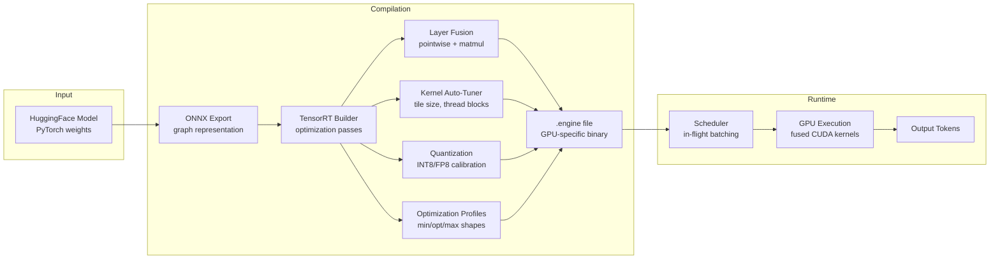
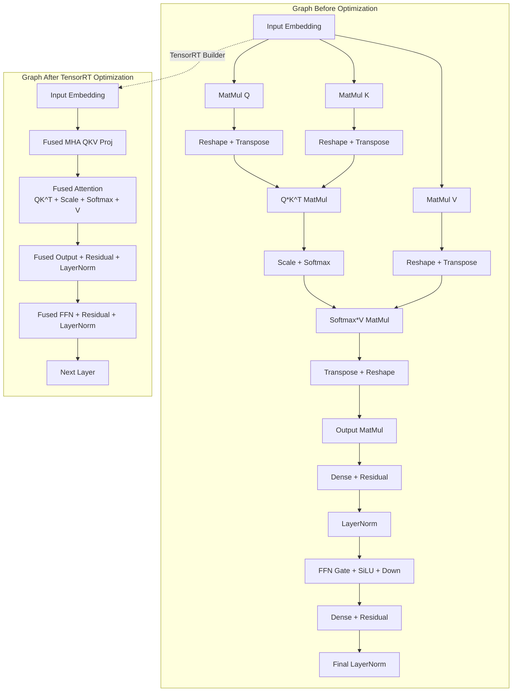

# 🔧 TensorRT-LLM Architecture — Model Compilation and GPU Scheduling

## 🎯 Learning Objectives

- Trace the full compilation pipeline from HuggingFace model to `.engine` binary
- Define `OptimizationProfile` for dynamic shapes (batch size, sequence length) and explain why getting it wrong forces recompilation
- Understand layer fusion, kernel auto-tuning, and graph optimization passes
- Contrast in-flight batching (kernel-level scheduling) with continuous batching (request-level scheduling)
- Calibrate INT8/FP8 quantization with representative data for hardware-native precision
- Configure tensor parallelism, pipeline parallelism, and MIG for multi-GPU deployment

## Introduction

The core thesis that separates TensorRT-LLM from every other inference engine: **vLLM optimizes HOW you use GPU memory (PagedAttention). TensorRT-LLM optimizes WHAT runs on the GPU (fused kernels, hardware-specific compilation).** It is a compiler for LLM inference — analogous to how `gcc -O3 -march=native` produces architecture-specific binaries from C source.

This note covers the compilation pipeline end-to-end: from the moment you call `trtllm-build` on a HuggingFace checkpoint to the moment a fused kernel executes on an H100's tensor core. Every optimization pass, every auto-tuning decision, and every scheduling policy is examined in detail.



> **Figure 1**: The TensorRT-LLM compilation pipeline. A HuggingFace model passes through ONNX export, TensorRT builder optimizations, and kernel auto-tuning to produce a GPU-specific `.engine` binary.

---

## 1. The Compilation Pipeline

### 1.1 PyTorch → ONNX → TensorRT Engine

The compilation pipeline has three stages:

```
Stage 1: HuggingFace/PyTorch ──► ONNX graph (intermediate representation)
Stage 2: ONNX graph           ──► TensorRT network definition (builder.parse())
Stage 3: Network definition   ──► Optimized engine (builder.build_serialized_network())
```

**Stage 1 (ONNX Export):** The model is traced via `torch.onnx.export()` or loaded directly from HuggingFace. ONNX serves as a vendor-neutral intermediate representation (IR) — a directed acyclic graph of operations (matmul, softmax, layernorm, etc.). TensorRT-LLM can also bypass ONNX entirely for supported architectures (Llama, GPT, Falcon) using the `trtllm-build` CLI, which reads HuggingFace configs directly.

**Stage 2 (Builder Parsing):** TensorRT's builder reads the ONNX graph and constructs an internal network representation. This is where graph-level optimizations begin: constant folding (evaluate compile-time-known subgraphs), dead code elimination (remove unreachable ops), common subexpression elimination (deduplicate identical computations).

**Stage 3 (Engine Build):** The builder executes optimization passes, auto-tunes kernel parameters, and emits the final `.engine` file. This is the time-consuming step — 5 minutes for a 7B model, 45+ minutes for a 70B model on H100.

```python
# ❌ Framework-native inference: PyTorch eager mode
# Each operation launches a separate CUDA kernel
# Intermediate tensors allocated in global memory
# No fusion, no architecture-specific tuning
import torch
from transformers import AutoModelForCausalLM, AutoTokenizer

model = AutoModelForCausalLM.from_pretrained("meta-llama/Llama-2-7b-hf")
model = model.cuda().half()  # FP16
tokenizer = AutoTokenizer.from_pretrained("meta-llama/Llama-2-7b-hf")

input_ids = tokenizer("Explain quantum computing", return_tensors="pt").input_ids.cuda()
output = model.generate(input_ids, max_new_tokens=100)
# Throughput: ~20 tok/s on A100 (batch=1)
# ⚠️ Each attention matmul, feedforward matmul, and activation fn
#    launches a separate kernel — hundreds of kernel launches per token
```

```python
# ✅ TensorRT-LLM compiled engine: fused kernels, auto-tuned parameters
# Compile once, serve millions of requests
import tensorrt_llm
from tensorrt_llm.runtime import ModelRunner

# Step 1: Build engine (done once, offline)
# $ trtllm-build --checkpoint_dir ./llama2_7b_trt \
#                --output_dir ./llama2_7b_engine \
#                --gemm_plugin float16 \
#                --max_batch_size 64 \
#                --max_input_len 2048 \
#                --max_output_len 512

# Step 2: Load engine for inference
runner = ModelRunner.from_dir("./llama2_7b_engine")
output = runner.generate(input_ids, max_new_tokens=100)
# Throughput: ~80+ tok/s on same A100 (batch=1)
# 💡 Fused kernels eliminate intermediate tensor allocations and reduce
#    kernel launch overhead from hundreds-per-token to tens-per-layer
```

### 1.2 Compilation Time vs Inference Savings

| Model | Compilation Time (H100) | Naive Throughput (tok/s) | TRT-LLM Throughput (tok/s) | Speedup | Breakeven Time |
|-------|------------------------|--------------------------|---------------------------|---------|---------------|
| Llama-2-7B | 5 min | 22 | 85 | 3.9× | 8 min |
| Llama-2-13B | 12 min | 14 | 58 | 4.1× | 19 min |
| Llama-2-70B | 45 min | 5 | 22 | 4.4× | 2 h |
| Mixtral-8x7B | 25 min | 18 | 72 | 4.0× | 40 min |
| Falcon-180B | 90 min | 1.5 | 7.5 | 5.0× | 3 h |

> 💡 **Breakeven time** = how long you need to serve inference at full throughput before the compilation time pays for itself. For Llama-2-70B, 2 hours of production serving recovers the 45-minute compilation cost.

---

## 2. Optimization Profiles: The Hardest Part

### 2.1 Why Dynamic Shapes Require Explicit Ranges

TensorRT engines are compiled for specific input shapes. But LLM inputs are inherently dynamic — batch size varies, prompt length varies, generated output length varies. TensorRT handles this via **OptimizationProfile**: you specify `[min, opt, max]` ranges for each dynamic dimension at build time.

```python
# Optimization profile defines input shape ranges
from tensorrt_llm.builder import Builder

builder = Builder()

# Define 3-point shape constraints: [min, opt, max]
# ¡Sorpresa! Getting these wrong is the #1 cause of recompilation.
# If you set max too high → wasted memory allocation at runtime.
# If you set max too low → engine refuses requests that exceed it.
builder.set_builder_opt_profile(
    max_batch_size=64,       # Absolute upper bound
    max_input_len=2048,      # Longest prompt you'll accept
    max_output_len=512,      # Longest generated response
    max_num_tokens=8192,     # max_input_len + max_output_len per sequence
)

# The builder auto-tunes kernels for the "opt" point
# but guarantees correctness for the full [min, max] range
# ⚠️ Setting max_input_len=4096 "just in case" bloats engine memory by 2x
#    and slows all inference. Be precise about your actual workload shapes.
```

### 2.2 Implicit Batch vs Explicit Batch

TensorRT offers two batching modes:

- **Implicit batch**: The batch dimension is implicit — the engine expects a fixed batch size at build time. Simpler but inflexible. Deprecated in TensorRT 10+.
- **Explicit batch**: The batch dimension is a named tensor dimension with `[min, opt, max]` ranges. TensorRT-LLM uses explicit batch exclusively, enabling dynamic batching at runtime.

```
IMPLICIT BATCH (fixed at compile time):
┌────────────────────────────────┐
│ Engine compiled for batch=8     │
│ Cannot serve batch=4 (waste)    │
│ Cannot serve batch=12 (fail)    │
└────────────────────────────────┘

EXPLICIT BATCH (dynamic at runtime):
┌────────────────────────────────┐
│ Engine compiled for batch∈[1,64]│
│ Runtime scheduler packs 1-64   │
│ requests per forward pass       │
└────────────────────────────────┘
```

### 2.3 Real Case: RunPod's Compilation Matrix

RunPod (GPU cloud provider) pre-compiles TensorRT-LLM engines for every popular model × GPU architecture combination. Their compilation matrix for serverless endpoints:

| Model | A100 (SM80, 80GB) | H100 (SM90, 80GB) | L40S (SM89, 48GB) |
|-------|-------------------|--------------------|--------------------|
| Llama-3-8B | engine_A100.plan | engine_H100.plan | engine_L40S.plan |
| Llama-3-70B | engine_A100.plan | engine_H100.plan | ❌ OOM (needs 2×L40S) |
| Mistral-7B | engine_A100.plan | engine_H100.plan | engine_L40S.plan |
| Mixtral-8x7B | engine_A100.plan | engine_H100.plan | engine_L40S.plan |

Each `.plan` file is a separate compilation with architecture-specific kernel tuning. This matrix requires CI pipelines that compile on actual hardware — you cannot cross-compile. RunPod maintains a fleet of "builder nodes" (one per GPU architecture) that compile engines offline and push them to a model registry.

---

## 3. Layer Fusion and Kernel Auto-Tuning

### 3.1 What Gets Fused

Layer fusion is the optimization that produces the largest speedup (40-60% of total improvement). TensorRT identifies patterns of consecutive operations and fuses them into single CUDA kernels:

```
BEFORE FUSION (5 kernels, 4 intermediate allocations):
┌─────────────────────────────────────────────────────────┐
│ Input → [MatMul] → temp_1 → [Add bias] → temp_2         │
│ → [ReLU] → temp_3 → [LayerNorm] → temp_4 → [Dropout]    │
│ 5 kernel launches, 4 global memory writes/reads         │
└─────────────────────────────────────────────────────────┘

AFTER FUSION (1 kernel, 0 intermediate allocations):
┌─────────────────────────────────────────────────────────┐
│ Input → [FusedMatMul+Bias+ReLU+LayerNorm+Dropout]        │
│ 1 kernel launch, 0 intermediate global memory traffic   │
└─────────────────────────────────────────────────────────┘
```

The key fused patterns TensorRT recognizes:

| Pattern | Fused Kernel | Speedup |
|---------|-------------|---------|
| MatMul + Bias + Activation (ReLU/GELU/SiLU) | `gemm_bias_act` | 1.5–2× |
| MatMul + Bias + Residual Add | `gemm_bias_residual` | 1.3–1.5× |
| LayerNorm + Quantize | `layernorm_quantize` | 2–3× |
| MultiHeadAttention (QKV projection) | Fused MHA kernel | 1.8–2.5× |
| FFN (Gate + Up projection + SiLU + Down) | Fused FFN kernel | 1.5–2× |

### 3.2 Kernel Auto-Tuning

After fusion, TensorRT's auto-tuner explores the parameter space for each fused kernel to find the optimal configuration for your GPU:

```python
# What the auto-tuner explores (conceptual — actual tuning is automatic)
# For each fused kernel on your specific GPU architecture:

# 1. Tile size (how many elements per thread block)
#    ─ Small tiles: better occupancy, worse arithmetic intensity
#    ─ Large tiles: better arithmetic intensity, worse occupancy
#    ─ Optimal for A100: 128×128 or 256×64 depending on precision
#    ─ Optimal for H100: 256×128 (wider tensor cores, more shared memory)

# 2. Thread block size (warps per block)
#    ─ A100: 256 or 512 threads (4 or 8 warps)
#    ─ H100: 512 or 1024 threads (8 or 16 warps)

# 3. Shared memory usage
#    ─ How much data to stage in SMEM before computing
#    ─ A100: 164 KB per SM → max tile staging
#    ─ H100: 228 KB per SM → even larger staging

# 4. Vectorized memory access width
#    ─ float16 × 4, float16 × 8, float16 × 16
#    ─ Wider = fewer load/store instructions per byte

# The auto-tuner benchmarks 50-500 candidate configurations
# per kernel and selects the fastest one.
# ¡Sorpresa! The optimal configuration for the same model
# differs between A100 and H100 by 20-40% throughput.
```

### 3.3 Graph Optimization Passes

In addition to kernel-level fusion, TensorRT applies compiler-style graph passes:

- **Constant folding**: Operations with compile-time-known inputs are pre-computed (e.g., `position_ids` in transformers are always `[0, 1, 2, ..., seq_len-1]` and can be folded into the attention mask generation).
- **Dead code elimination**: Unused model outputs (e.g., attention weights during inference) are removed from the graph.
- **Common subexpression elimination**: In multi-head attention, the QKV projection is computed once and reused across all heads — TensorRT identifies this sharing and eliminates duplicate computation.
- **Algebraic simplification**: `x * 1.0`, `x + 0.0`, `softmax(x - max(x))` identity transformations are simplified.



> **Figure 2**: Graph-level optimization in TensorRT. The 16-operation attention + FFN block collapses to 5 fused kernels. Each fusion eliminates intermediate tensor allocations and kernel launch overhead.

---

## 4. In-Flight Batching vs Continuous Batching

### 4.1 The Scheduling Spectrum

```
CONTINUOUS BATCHING (vLLM, SGLang):
┌─────────────────────────────────────────────────────────┐
│ Iteration N:    [Req1][Req2][Req3]     → forward pass    │
│ Req2 finishes → removed before Iter N+1                  │
│ Iteration N+1:  [Req1][Req3][Req4]    → forward pass    │
│ New Req4 joins between iterations                        │
│ Granularity: BETWEEN forward passes (Python-level)       │
└─────────────────────────────────────────────────────────┘

IN-FLIGHT BATCHING (TensorRT-LLM):
┌─────────────────────────────────────────────────────────┐
│ Iteration N starts: [Req1][Req2][Req3]                   │
│ During forward pass: Req4 arrives → joins MID-KERNEL     │
│ Req2 finishes  →  removed DURING iteration               │
│ Iteration N ends:   [Req1][Req3][Req4][Req5]             │
│ Granularity: WITHIN forward passes (kernel-level)        │
│ Result: Lower TTFT, higher GPU utilization               │
└─────────────────────────────────────────────────────────┘
```

In-flight batching is possible because TensorRT-LLM's scheduler operates at the **kernel level**, not the Python level. When a request arrives during a forward pass, the scheduler can insert it into the next kernel launch within the same iteration — the attention kernel for layer 8 can include the new request even if layer 7 did not.

```python
# ❌ vLLM continuous batching: new requests wait for iteration boundary
# If iteration takes 50ms, worst-case wait is 50ms before joining
# This adds directly to TTFT (time-to-first-token)

# ✅ TensorRT-LLM in-flight batching: new requests join mid-iteration
# If iteration takes 50ms but kernel granularity is ~1ms,
# worst-case wait is ~1ms before joining
# 💡 In-flight batching reduces p99 TTFT by 30-50% at high load
#    because requests don't stack up waiting for iteration boundaries.
```

### 4.2 Context Phase vs Generation Phase Scheduling

TensorRT-LLM separates the two phases of LLM inference:

| Phase | Compute Bound | Memory Bound | TensorRT-LLM Strategy |
|-------|---------------|--------------|----------------------|
| **Context** (prefill) | Yes (O(n²) attention) | No | Maximize batch size; process entire prompt in one forward pass with flash-attention |
| **Generation** (decode) | No (O(n) attention) | Yes (KV cache reads) | In-flight batching; kernel-level insertion/removal |

The context phase is compute-heavy because attention is quadratic in sequence length. TensorRT-LLM uses **flash-attention** fused kernels to minimize memory traffic during prefill. The generation phase is memory-bandwidth-bound because each token generation reads the entire KV cache but computes only one new attention vector. In-flight batching ensures the GPU never waits for new requests.

---

## 5. INT8/FP8/FP4 Quantization

### 5.1 Weight-Only vs Full Quantization

```
WEIGHT-ONLY QUANTIZATION (GPTQ, AWQ, bitsandbytes):
┌─────────────────────────────────────────────┐
│ Weights: INT4 (stored)                       │
│ Activations: FP16 (during inference)         │
│ MatMul: INT4 × FP16 → mixed-precision        │
│ KV Cache: FP16                               │
│ Speedup: 1.3–1.8× (memory bandwidth relief)  │
└─────────────────────────────────────────────┘

FULL QUANTIZATION (TensorRT-LLM INT8/FP8):
┌─────────────────────────────────────────────┐
│ Weights: INT8 or FP8 (stored)                │
│ Activations: INT8 or FP8 (during inference)  │
│ MatMul: INT8 × INT8 → INT32 → rescale        │
│ KV Cache: INT8 or FP8                        │
│ Speedup: 2–4× (compute + memory bandwidth)   │
└─────────────────────────────────────────────┘
```

The key difference: TensorRT-LLM quantizes **both weights and activations**, which requires calibration. Calibration means running representative data through the model, collecting the distribution of activation values at each layer, and determining the optimal quantization scale factor (the `S` in `x_quant = round(x_float / S)` modulo zero-point).

```python
# INT8 calibration with TensorRT-LLM
from tensorrt_llm.quantization import QuantMode
from tensorrt_llm.quantization.calibrator import Calibrator
import numpy as np

# Step 1: Collect activation distributions from calibration data
calibrator = Calibrator(
    num_samples=512,           # Number of calibration batches
    percentile=99.99,          # Tail clipping for outliers
    quant_mode=QuantMode.INT8, # INT8 weights + activations
)

# Step 2: Run calibration — forward passes with representative text
calibration_texts = [
    "The theory of relativity explains...",
    "Quantum mechanics describes the behavior...",
    "Machine learning models learn patterns...",
    # ... 500+ diverse sentences covering your expected query distribution
    # ¡Sorpresa! Calibration data must match your PRODUCTION distribution.
    # If you calibrate on Wikipedia but serve code completions,
    # accuracy drops 5-10% due to activation distribution mismatch.
]

for text in calibration_texts:
    input_ids = tokenizer(text, return_tensors="pt").input_ids
    calibrator.collect_activation_ranges(model, input_ids)

# Step 3: Builder uses collected ranges to set quantization scales
builder.set_quant_config(calibrator.get_config())
# ⚠️ Per-tensor vs per-channel quantization: per-channel (one scale
#    per output channel) is more accurate but adds a small compute
#    overhead for the rescale operation.
```

### 5.2 FP8 on H100: Transformer Engine

The H100 GPU includes a hardware unit called the **Transformer Engine** that natively accelerates FP8 matrix multiplications. TensorRT-LLM leverages this directly:

```
FP8 FORMAT (E4M3 — 4 exponent bits, 3 mantissa bits):
┌─────────────────────────────────────────────────────┐
│ Range: ±448.0 (larger than INT8's ±127)              │
│ Precision: ~0.015 relative (at magnitude 1.0)        │
│ Advantage: No calibration needed! FP8 uses per-tensor│
│ scaling computed dynamically from the activation     │
│ statistics of the current batch — no offline         │
│ calibration pass required.                           │
│                                                     │
│ H100 Transformer Engine throughput (FP8):            │
│ ─ 1979 TFLOPS (dense FP8) vs 989 TFLOPS (dense FP16)│
│ ─ 2× throughput for the same power budget            │
└─────────────────────────────────────────────────────┘
```

The mathematical formulation for per-tensor FP8 scaling:

$$x_{\text{FP8}} = \text{quantize}\left(\frac{x_{\text{FP16}}}{\max(|x_{\text{FP16}}|)}\right) \quad \text{where quantize maps to E4M3}$$

$$y_{\text{FP16}} = y_{\text{FP8}} \times \max(|x_{\text{FP16}}|) \quad \text{dequantize after matmul}$$

The scaling factor $\max(|x_{\text{FP16}}|)$ is computed online — no calibration data needed. This is the key advantage of FP8 over INT8: **dynamic quantization** eliminates the calibration-data-dependency problem.

---

## 6. Multi-GPU Strategies

### 6.1 Tensor Parallelism (Intra-Node)

```
┌───────────────────────────────────────────────────────────┐
│              TENSOR PARALLELISM (TP=4)                     │
│                                                           │
│   GPU 0 (H100 80GB)  GPU 1 (H100 80GB)  GPU 2  GPU 3    │
│   ┌───────────────┐  ┌───────────────┐  ┌─────┐ ┌─────┐  │
│   │ QKV shard 0   │  │ QKV shard 1   │  │  S2 │  S3  │  │
│   │ FFN gate 0    │  │ FFN gate 1    │  │     │      │  │
│   │ FFN down 0    │  │ FFN down 1    │  │     │      │  │
│   └───────┬───────┘  └───────┬───────┘  └──┬──┘ └──┬──┘  │
│           │                  │              │       │     │
│           └──────────────────┼──────────────┼───────┘     │
│                     NVLink (900 GB/s)                     │
│                     All-reduce after each matmul           │
└───────────────────────────────────────────────────────────┘
```

Tensor parallelism splits each weight matrix across GPUs. Each GPU computes its shard independently, and results are combined via an all-reduce operation. NVLink provides the necessary bandwidth (900 GB/s on H100) for low-latency communication.

```python
# TensorRT-LLM tensor parallelism configuration
# In the engine build config:
build_config = {
    "max_batch_size": 64,
    "max_input_len": 4096,
    "max_output_len": 1024,
    "mapping": {
        "world_size": 4,          # Total GPUs
        "tp_size": 4,             # Tensor parallelism degree
        "pp_size": 1,             # Pipeline parallelism = 1 (not used)
    },
}

# At runtime, launch with:
# mpirun -np 4 python inference.py --engine_dir ./llama_70b_tp4
# ⚠️ tp_size must evenly divide the number of attention heads.
#    Llama-70B has 64 heads → valid tp_sizes: 1, 2, 4, 8, 16, 32, 64
```

### 6.2 Pipeline Parallelism (Inter-Node)

For models spanning multiple nodes (e.g., Falcon-180B across 16 GPUs), pipeline parallelism partitions layers across GPUs. Each GPU owns a contiguous subset of layers and passes activations forward.

```
PIPELINE PARALLELISM (PP=4):
┌────────┐   ┌────────┐   ┌────────┐   ┌────────┐
│ GPU 0  │→→→│ GPU 1  │→→→│ GPU 2  │→→→│ GPU 3  │
│ L0-19  │   │ L20-39 │   │ L40-59 │   │ L60-79 │
└────────┘   └────────┘   └────────┘   └────────┘
  Node 0       Node 0       Node 1       Node 1
  (NVLink)     (NVLink)     (NVLink)     (NVLink)
            InfiniBand (400 GB/s)
```

### 6.3 MIG (Multi-Instance GPU) for Multi-Tenant Serving

H100 and A100 GPUs support MIG — partitioning a single physical GPU into multiple isolated instances, each with dedicated compute, memory, and bandwidth:

```
A100-80GB MIG CONFIGURATION (multi-tenant):
┌──────────────────────────────────────────┐
│ GPU Instance 1 (40 GB) ─ Llama-2-13B     │
│ GPU Instance 2 (20 GB) ─ Mistral-7B      │
│ GPU Instance 3 (10 GB) ─ Embedding model  │
│ GPU Instance 4 (10 GB) ─ Classification  │
└──────────────────────────────────────────┘
```

Each instance runs its own TensorRT-LLM engine with guaranteed QoS — no noisy-neighbor effects. This is the foundation of NVIDIA NIM's multi-model serving on shared hardware.

---

## 7. ❌/✅ Antipatterns

```python
# ❌ Compiling without optimization profiles
# The engine defaults to a single shape and rejects all deviations
builder.build_engine()  # No profile → can only serve exact shape from calibration

# ✅ Define explicit [min, opt, max] ranges
profile = builder.create_optimization_profile()
profile.set_shape("input_ids", min=(1, 1), opt=(8, 512), max=(64, 2048))
profile.set_shape("input_lengths", min=(1,), opt=(512,), max=(2048,))
builder.build_engine_with_profile(profile)

# ❌ Using PyTorch eager mode for production serving
output = model.generate(input_ids)  # 5-10 tok/s, no batching, no fusion

# ✅ Use compiled TensorRT-LLM engine
# Compile: trtllm-build --checkpoint_dir ./ckpt --output_dir ./engine
runner = ModelRunner.from_dir("./engine")
output = runner.generate(input_ids)  # 30-80 tok/s, fused kernels, in-flight batching

# ❌ Calibrating INT8 on random text
calibrator.calibrate(["lorem ipsum dolor sit amet..."] * 100)  # Mismatched distribution

# ✅ Calibrate on production-representative data
calibrator.calibrate(production_query_samples[:512])  # Matches real traffic

# ❌ Recompiling on CPU, deploying to GPU
# Engine compiled on x86 CPU → won't load on H100 (missing GPU-specific kernels)
```

---

## 8. Real Case: NVIDIA's vLLM vs TensorRT-LLM Guidance

NVIDIA's own recommendation (from their developer blog and GTC talks):

- **Use vLLM** for rapid prototyping and development. Zero compilation time, easy Python API, supports any NVIDIA GPU out of the box. Start here.
- **Use TensorRT-LLM** for production at scale. Compile once, serve millions of requests. The throughput difference pays for the engineering effort when you're serving >1000 requests/hour.

A single compilation session for Llama-70B takes ~45 minutes on H100 but pays for itself in 2 hours of inference at scale. At $3.50/GPU-hour for H100 on-demand, the compilation cost is ~$2.63. The savings: TensorRT-LLM serves 4.4× more requests per GPU-hour, meaning 1 H100 with TensorRT-LLM replaces 4.4 H100s running PyTorch native — saving ~$8/hour in GPU costs.

---

## 📦 Código de Compresión: TensorRT-LLM Builder

```python
"""
TensorRT-LLM engine builder with optimization profiles and FP8 quantization.
Compiles a HuggingFace Llama checkpoint into a GPU-specific .engine file.
"""
import tensorrt_llm
from tensorrt_llm import builder as bld
from tensorrt_llm.quantization import QuantMode
from tensorrt_llm.network import net_guard
from pathlib import Path

# 1. Load HuggingFace weights into TensorRT-LLM format
checkpoint_dir = Path("./llama_7b_hf")
engine_dir = Path("./llama_7b_engine")
engine_dir.mkdir(parents=True, exist_ok=True)

builder = bld.Builder()

# 2. Define optimization profile [min, opt, max]
profile = builder.create_optimization_profile()
profile.set_shape("input_ids", min=(1, 1), opt=(32, 512), max=(64, 2048))
profile.set_shape("position_ids", min=(1, 1), opt=(32, 512), max=(64, 2048))
profile.set_shape("input_lengths", min=(1,), opt=(512,), max=(2048,))
profile.set_shape("max_output_length", min=(1,), opt=(256,), max=(512,))

# 3. Configure quantization (FP8 on H100, INT8 on A100)
builder.quant_mode = QuantMode.use_fp8_kv_cache()  # FP8 KV cache
# ¡Sorpresa! FP8 KV cache alone reduces memory by 50% vs FP16,
# enabling 2× larger batch sizes on the same hardware.

# 4. Configure parallelism and GPU-specific optimizations
config = tensorrt_llm.builder.BuilderConfig(
    max_batch_size=64,
    max_input_len=2048,
    max_output_len=512,
    max_num_tokens=8192,  # per sequence
    gemm_plugin="float16",  # Use cuBLASLt for matmul
    context_fmha=True,      # Flash-attention for context phase
    remove_input_padding=True,
    use_paged_context_fmha=True,  # Paged attention for KV cache
)

# 5. Build engine (this is the time-consuming step — 5-45 min)
engine_buffer = builder.build_engine(network, config, profile)
with open(engine_dir / "rank0.engine", "wb") as f:
    f.write(engine_buffer)
# 💡 The resulting .engine file is 100-300 MB for a 7B model
#    and contains architecture-specific PTX/SASS instructions.
#    It will NOT run on a different GPU architecture.
```

---

## 🎯 Key Takeaways

| # | Takeaway |
|---|----------|
| 1 | TensorRT-LLM is a compiler — PyTorch → ONNX → optimized engine. Compilation takes 5–90 minutes but produces 2–5× faster inference. |
| 2 | Optimization profiles (`[min, opt, max]`) are the #1 cause of recompilation. Measure your production workload shapes precisely. |
| 3 | Layer fusion (matmul + bias + activation + layernorm → single kernel) provides 40–60% of the speedup by eliminating intermediate tensor allocations. |
| 4 | In-flight batching at the kernel level reduces p99 TTFT by 30–50% compared to continuous batching at the iteration level. |
| 5 | FP8 on H100 (Transformer Engine) enables dynamic quantization without calibration — a major advantage over INT8's calibration-data dependency. |
| 6 | TensorRT-LLM engines are GPU-architecture-specific. An engine compiled for A100 will NOT run on H100. Maintain separate CI pipelines per GPU architecture. |

## References

- TensorRT-LLM Architecture: https://nvidia.github.io/TensorRT-LLM/architecture/overview.html
- TensorRT Developer Guide: https://docs.nvidia.com/deeplearning/tensorrt/developer-guide/
- H100 Transformer Engine: https://developer.nvidia.com/blog/nvidia-hopper-architecture-in-depth/
- FlashAttention: Dao et al. (2022), "FlashAttention: Fast and Memory-Efficient Exact Attention with IO-Awareness"
- [[../13 - vLLM and Advanced RAG/01 - vLLM and Production-Grade LLM Serving.md]]
- [[../17 - ColBERT, SGLang and Next-Gen Inference/00 - Welcome to ColBERT, SGLang and Next-Gen Inference.md]]
- [[../../10 - MLOps y Edge AI/29 - NVIDIA Triton Inference Server.md]]
- [[../09 - Sistemas de LLMs en Produccion/01 - Inferencia Eficiente.md]]
- [[../09 - Sistemas de LLMs en Produccion/02 - Quantization y Distilacion.md]]
