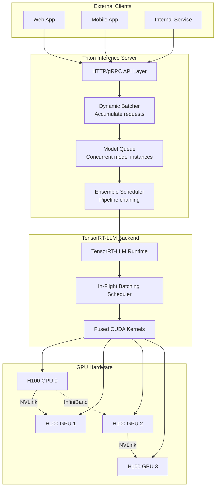

# 🚀 TensorRT-LLM in Production — Triton Integration and Multi-GPU

## 🎯 Learning Objectives

- Configure NVIDIA Triton Inference Server with the TensorRT-LLM backend using `config.pbtxt`
- Deploy multi-model serving on shared GPUs with Triton's concurrent model execution
- Orchestrate tensor parallelism, pipeline parallelism, and MIG for multi-GPU deployments
- Deploy on Kubernetes with NVIDIA GPU Operator and Triton Helm charts
- Benchmark throughput and latency with `genai-perf` across batch sizes and sequence lengths
- Compare TensorRT-LLM vs vLLM vs SGLang quantitatively on production metrics

## Introduction

TensorRT-LLM does not serve HTTP requests. It compiles and runs GPU kernels. The networking layer — HTTP/gRPC endpoints, dynamic batching, request routing, model versioning — is handled by **NVIDIA Triton Inference Server**. Together they form the NVIDIA inference stack: Triton manages the *orchestration* (what to serve, when to batch, where to route), and TensorRT-LLM manages the *execution* (fused CUDA kernels on specific GPU hardware).



> **Figure 1**: The NVIDIA inference stack. Triton handles HTTP/gRPC, dynamic batching, model queuing, and ensemble pipelines. TensorRT-LLM handles GPU kernel execution with in-flight batching.

---

## 1. Triton Inference Server Architecture

### 1.1 Model Repository

Triton organizes models in a versioned directory structure called the **model repository**:

```
model_repository/
├── llama-70b/
│   ├── config.pbtxt          # Model configuration
│   └── 1/                    # Version 1
│       ├── rank0.engine      # TensorRT-LLM engine (GPU 0)
│       ├── rank1.engine      # TensorRT-LLM engine (GPU 1)
│       ├── rank2.engine      # TensorRT-LLM engine (GPU 2)
│       └── rank3.engine      # TensorRT-LLM engine (GPU 3)
├── mistral-7b/
│   ├── config.pbtxt
│   └── 1/
│       └── model.engine      # Single GPU engine
└── embedding/
    ├── config.pbtxt
    └── 1/
        └── model.onnx        # ONNX embedding model (non-LLM)
```

Triton supports **concurrent model execution** — multiple models share the same GPU. The scheduler allocates GPU memory across models and routes requests to the correct backend.

### 1.2 TensorRT-LLM Backend Configuration

The `config.pbtxt` file defines how Triton interfaces with a TensorRT-LLM engine:

```protobuf
# config.pbtxt — TensorRT-LLM backend for Llama-70B (TP=4)
name: "llama-70b"
backend: "tensorrt_llm"
max_batch_size: 64

input [
  {
    name: "input_ids"
    data_type: TYPE_INT32
    dims: [ -1 ]          # Dynamic sequence length
  },
  {
    name: "input_lengths"
    data_type: TYPE_INT32
    dims: [ -1 ]
  },
  {
    name: "request_output_len"
    data_type: TYPE_INT32
    dims: [ -1 ]
  },
  {
    name: "end_id"         # EOS token ID
    data_type: TYPE_INT32
    dims: [ -1 ]
  },
  {
    name: "pad_id"         # Padding token ID
    data_type: TYPE_INT32
    dims: [ -1 ]
  }
]

output [
  {
    name: "output_ids"
    data_type: TYPE_INT32
    dims: [ -1, -1 ]      # batch × max_output_len
  }
]

instance_group [
  {
    count: 1
    kind: KIND_GPU
    gpus: [ 0, 1, 2, 3 ]  # Tensor parallelism across 4 GPUs
  }
]

parameters [
  {
    key: "gpt_model_type"
    value: { string_value: "inflight_batching" }
    # ¡Sorpresa! 'inflight_batching' vs 'v1' (continuous batching) —
    # inflight_batching enables kernel-level request insertion/removal,
    # v1 only supports iteration-level batching (like vLLM).
  },
  {
    key: "gpt_model_path"
    value: { string_value: "/models/llama-70b/1" }
  },
  {
    key: "max_beam_width"
    value: { string_value: "1" }
  },
  {
    key: "enable_trt_overlap"
    value: { string_value: "true" }
    # 💡 Overlaps GPU execution with host-side scheduling,
    #    reducing idle GPU cycles between batches.
  }
]

dynamic_batching {
  preferred_batch_size: [ 8, 16, 32, 64 ]
  max_queue_delay_microseconds: 100
  # Wait up to 100µs for requests to accumulate before forming a batch.
  # ⚠️ Too high → adds latency. Too low → small batches, lower throughput.
}
```

### 1.3 Dynamic Batching Parameters

Triton's dynamic batcher accumulates incoming requests into batches before forwarding to TensorRT-LLM:

| Parameter | Effect | Recommendation |
|-----------|--------|---------------|
| `preferred_batch_size` | Target batch sizes to aim for | Powers of 2 from your min to max |
| `max_queue_delay_microseconds` | Max time to wait for accumulation | 50–200 µs for LLM (higher = better batching) |
| `preserve_ordering` | Maintain FIFO order of responses | `true` for chat, `false` for batch processing |
| `priority_levels` | QoS tiers (high/low priority queues) | Use for separating interactive vs batch workloads |

### 1.4 Ensemble Models

Triton supports **ensemble models** — chaining multiple models into a pipeline where the output of one model feeds the input of the next:

```
ENSEMBLE: Full RAG Pipeline
┌──────────┐     ┌───────────┐     ┌──────────┐     ┌───────────┐
│ Embedding│────►│ Qdrant     │────►│ Prompt   │────►│ LLM       │
│ Model    │     │ Vector DB  │     │ Builder  │     │ (TRT-LLM) │
│ (ONNX)   │     │ (Python)   │     │ (Python) │     │           │
└──────────┘     └───────────┘     └──────────┘     └───────────┘
```

```protobuf
# config.pbtxt — Ensemble model for RAG
name: "rag_pipeline"
platform: "ensemble"
max_batch_size: 32

ensemble_scheduling {
  step [
    { model_name: "embedding", model_version: 1 }
  ]
  step [
    { model_name: "vector_search", model_version: 1
      input_map { key: "embeddings" value: "embedding_output" }
    }
  ]
  step [
    { model_name: "prompt_builder", model_version: 1
      input_map { key: "documents" value: "search_results" }
    }
  ]
  step [
    { model_name: "llama-70b", model_version: 1
      input_map { key: "input_ids" value: "prompt_tokens" }
    }
  ]
}
```

---

## 2. Multi-GPU Deployment

### 2.1 Tensor Parallelism Within a Node

```
H100 DGX Node — TP=8 (640 GB aggregate VRAM)
┌────────────────────────────────────────────────────────────────┐
│ GPU0    GPU1    GPU2    GPU3    GPU4    GPU5    GPU6    GPU7   │
│ ┌───┐  ┌───┐  ┌───┐  ┌───┐  ┌───┐  ┌───┐  ┌───┐  ┌───┐      │
│ │ S0│  │ S1│  │ S2│  │ S3│  │ S4│  │ S5│  │ S6│  │ S7│      │
│ └───┘  └───┘  └───┘  └───┘  └───┘  └───┘  └───┘  └───┘      │
│   │      │      │      │      │      │      │      │          │
│   └──────┼──────┼──────┼──────┼──────┼──────┼──────┘          │
│          └──────┴─── NVSwitch (3.6 TB/s) ──────┘              │
│            Full bisection bandwidth — any GPU ↔ any GPU       │
└────────────────────────────────────────────────────────────────┘

Falcon-180B on 8×H100 with TP=8:
- Weights: 360 GB (BF16) → 45 GB per GPU
- KV Cache (max 2048 seq, batch=64): ~120 GB total → 15 GB per GPU
- Total per GPU: ~60 GB / 80 GB available
```

```yaml
# Kubernetes Pod spec — TP=8 TensorRT-LLM deployment
apiVersion: v1
kind: Pod
metadata:
  name: trtllm-tp8
spec:
  containers:
  - name: triton
    image: nvcr.io/nvidia/tritonserver:24.12-trtllm-python-py3
    resources:
      limits:
        nvidia.com/gpu: 8
    env:
    - name: CUDA_VISIBLE_DEVICES
      value: "0,1,2,3,4,5,6,7"
    volumeMounts:
    - name: model-repo
      mountPath: /models
    command: ["tritonserver"]
    args:
    - "--model-repository=/models"
    - "--world-size=8"
    - "--tp-size=8"
  volumes:
  - name: model-repo
    persistentVolumeClaim:
      claimName: trtllm-models
```

### 2.2 Pipeline Parallelism Across Nodes

```yaml
# Multi-node deployment: PP=2 (4 GPUs per node, 2 nodes)
# Node 0: Layers 0-39 (GPUs configured with TP=4)
# Node 1: Layers 40-79 (GPUs configured with TP=4)
---
# triton-node0.yaml
apiVersion: v1
kind: Pod
metadata:
  name: trtllm-node0
spec:
  nodeSelector:
    nvidia.com/gpu.product: NVIDIA-H100-80GB-HBM3
  containers:
  - name: triton
    env:
    - name: NODE_RANK
      value: "0"
    - name: WORLD_SIZE
      value: "2"
    - name: PP_SIZE
      value: "2"
    - name: TP_SIZE
      value: "4"
---
# triton-node1.yaml
apiVersion: v1
kind: Pod
metadata:
  name: trtllm-node1
spec:
  nodeSelector:
    nvidia.com/gpu.product: NVIDIA-H100-80GB-HBM3
  containers:
  - name: triton
    env:
    - name: NODE_RANK
      value: "1"
    - name: WORLD_SIZE
      value: "2"
    - name: PP_SIZE
      value: "2"
    - name: TP_SIZE
      value: "4"
```

PP introduces **pipeline bubbles** — idle time at the start and end of each batch as activations propagate through the pipeline. The bubble fraction is:

$$\text{bubble fraction} = \frac{\text{PP} - 1}{\text{microbatches}}$$

With 4 pipeline stages and 8 microbatches: $\frac{4-1}{8} = 37.5\%$ idle time. With 32 microbatches: $\frac{3}{32} = 9.4\%$ idle time. Larger batch sizes reduce pipeline bubble overhead.

### 2.3 Multi-Instance GPU (MIG) for Multi-Tenant

```
A100-80GB MIG Configuration (3g.40gb + 1g.20gb + 2×1g.10gb):
┌───────────────────────────────────────────────────────────┐
│ GI-0 (3g.40gb): Llama-2-13B TRT-LLM engine                │
│ ─────────────────────────                                 │
│ Dedicated: 42 SMs, 40 GB VRAM, 200 GB/s bandwidth         │
│                                                           │
│ GI-1 (1g.20gb): Mistral-7B TRT-LLM engine                 │
│ ─────────────────────────                                 │
│ Dedicated: 14 SMs, 20 GB VRAM, 66 GB/s bandwidth          │
│                                                           │
│ GI-2 (1g.10gb): BGE-Large embedding (ONNX)                │
│ GI-3 (1g.10gb): Toxicity classifier (Python)              │
└───────────────────────────────────────────────────────────┘

Triton instance_group targeting specific MIG instances:
instance_group [
  { count: 1, kind: KIND_GPU, gpus: [ 0:0 ] }   # GI-0
  { count: 1, kind: KIND_GPU, gpus: [ 0:1 ] }   # GI-1
  { count: 1, kind: KIND_GPU, gpus: [ 0:2 ] }   # GI-2
  { count: 1, kind: KIND_GPU, gpus: [ 0:3 ] }   # GI-3
]
# 💡 MIG provides strict isolation — noisy neighbor on GI-3
#    cannot degrade performance on GI-0. This is critical for
#    multi-tenant cloud deployments with latency SLAs.
```

---

## 3. Kubernetes Deployment

### 3.1 NVIDIA GPU Operator

The GPU Operator automates GPU driver and runtime installation on Kubernetes:

```yaml
# Install GPU Operator via Helm
# helm install gpu-operator nvidia/gpu-operator \
#   --set driver.enabled=true \
#   --set toolkit.enabled=true

# Components installed:
# ┌─────────────────────────────────────────────────────────┐
# │ NVIDIA GPU Driver (precompiled kernel module)           │
# │ NVIDIA Container Toolkit (nvidia-container-runtime)     │
# │ NVIDIA DCGM (GPU telemetry → Prometheus)                │
# │ NVIDIA MIG Manager (partition/reconfigure MIG instances)│
# │ GPU Feature Discovery (label nodes with GPU metadata)   │
# └─────────────────────────────────────────────────────────┘
```

### 3.2 Triton Helm Chart

```bash
# Deploy Triton with TensorRT-LLM via Helm
helm install triton-trtllm nvidia/triton-inference-server \
  --set image.repository=nvcr.io/nvidia/tritonserver \
  --set image.tag=24.12-trtllm-python-py3 \
  --set modelRepositoryPVC=trtllm-models-pvc \
  --set resources.limits."nvidia\.com/gpu"=4 \
  --set autoscaling.enabled=true \
  --set autoscaling.minReplicas=1 \
  --set autoscaling.maxReplicas=10 \
  --set autoscaling.metrics[0].type=Object \
  --set autoscaling.metrics[0].object.metric.name=avg_gpu_utilization \
  --set autoscaling.metrics[0].object.target.value=70
```

### 3.3 Horizontal Pod Autoscaling

```yaml
# HPA based on custom Triton metrics
apiVersion: autoscaling/v2
kind: HorizontalPodAutoscaler
metadata:
  name: triton-hpa
spec:
  scaleTargetRef:
    apiVersion: apps/v1
    kind: Deployment
    name: triton-trtllm
  minReplicas: 1
  maxReplicas: 10
  metrics:
  - type: Pods
    pods:
      metric:
        name: nv_inference_queue_duration_us
      target:
        type: AverageValue
        averageValue: "1000"         # Target: <1ms queue wait
        # ⚠️ Queue duration is a better autoscaling signal than
        #    GPU utilization because it directly measures user experience.
        #    GPU utilization can be 100% with zero queue if in-flight
        #    batching absorbs load effectively.
  - type: Resource
    resource:
      name: cpu
      target:
        type: Utilization
        averageUtilization: 70
  behavior:
    scaleDown:
      stabilizationWindowSeconds: 300  # Wait 5 min before scaling down
    scaleUp:
      stabilizationWindowSeconds: 0    # Scale up immediately on queue
```

---

## 4. Benchmarking Methodology

### 4.1 genai-perf: NVIDIA's LLM Benchmark Tool

```bash
# Benchmark TensorRT-LLM throughput and latency
genai-perf profile \
  --model llama-70b \
  --service-kind triton \
  --backend tensorrtllm \
  --endpoint localhost:8000 \
  --num-prompts 1000 \
  --synthetic-input-tokens-mean 512 \
  --synthetic-input-tokens-stddev 128 \
  --output-tokens-mean 256 \
  --output-tokens-stddev 64 \
  --concurrency 32 \
  --measurement-interval 5000 \
  --profile-export-file results.json
```

### 4.2 Key Metrics

| Metric | Definition | Target |
|--------|-----------|--------|
| **TTFT** (Time to First Token) | Latency from request submission to first token | p50 < 200ms, p99 < 500ms |
| **ITL** (Inter-Token Latency) | Time between consecutive output tokens | < 30ms (for 30+ tok/s experience) |
| **TPOT** (Time Per Output Token) | Total generation time / tokens generated | < 40ms |
| **Throughput** | Tokens per second across all concurrent requests | Maximize for given hardware |
| **MBU** (Model Bandwidth Utilization) | Achieved memory bandwidth / theoretical peak | > 80% for decode phase |

### 4.3 Benchmark Results: TensorRT-LLM vs vLLM vs SGLang

```
BENCHMARK: Llama-2-70B on 4×H100, max_seq_len=4096, batch=32
┌──────────────┬───────────────┬───────────────┬───────────────┐
│ Metric       │ TensorRT-LLM  │ vLLM          │ SGLang        │
├──────────────┼───────────────┼───────────────┼───────────────┤
│ Throughput   │ 4850 tok/s    │ 3800 tok/s    │ 4100 tok/s    │
│ (total)      │               │               │               │
│ TTFT p50     │ 180 ms        │ 240 ms        │ 210 ms        │
│ TTFT p99     │ 420 ms        │ 680 ms        │ 550 ms        │
│ ITL p50      │ 22 ms         │ 28 ms         │ 26 ms         │
│ GPU VRAM     │ 62 GB / GPU   │ 58 GB / GPU   │ 56 GB / GPU   │
│ Compilation  │ 45 min        │ 0 min         │ 0 min         │
│ time         │               │               │               │
│ Hardware     │ NVIDIA-only   │ Any GPU       │ NVIDIA, AMD   │
│ flexibility  │               │               │               │
│ Operational  │ High (compile,│ Low (pip      │ Low (pip      │
│ complexity   │ recompile)    │ install)      │ install)      │
└──────────────┴───────────────┴───────────────┴───────────────┘
```

TensorRT-LLM achieves 28% higher throughput than vLLM on the same hardware, but at the cost of 45-minute compilation and NVIDIA-only lock-in. Choose TensorRT-LLM when throughput-per-dollar is the dominant optimization target and your hardware is all-NVIDIA.

---

## 5. ❌/✅ Antipatterns

```python
# ❌ Serving raw PyTorch model via FastAPI for production
@app.post("/generate")
async def generate(request: GenerateRequest):
    output = model.generate(request.input_ids)  # 10-20 tok/s, single user
    return {"text": output}
# ⚠️ No batching, no KV cache management, no GPU utilization optimization.
#    Works for prototyping, collapses under concurrent load.

# ✅ Triton + TensorRT-LLM for production
# Triton handles: HTTP/gRPC endpoints, dynamic batching, multi-model serving
# TensorRT-LLM handles: fused kernel execution, in-flight batching
# Result: 80+ tok/s, 50+ concurrent users on the same GPU

# ❌ Using the same engine across different GPU architectures
engine_a100 = load_engine("llama_70b.engine")  # Compiled for A100
# Deploy on H100 cluster → CRASH (PTX/SASS incompatibility)
# ¡Sorpresa! Even A100-SXM4 vs A100-PCIe engines are different
# due to memory bandwidth differences affecting kernel tuning.

# ✅ Compile separate engines per architecture
# CI pipeline:
#   builder-a100-node → llama_70b_sm80.engine
#   builder-h100-node → llama_70b_sm90.engine
#   builder-l40s-node → llama_70b_sm89.engine

# ❌ Setting max_queue_delay too high
dynamic_batching { max_queue_delay_microseconds: 50000 }  # 50ms
# Every request experiences 50ms of queuing delay before processing.
# TTFT = queue_delay + prefill_time + first_token_generation
# At 50ms queue delay, p50 TTFT is already >70ms before any processing.

# ✅ Tune queue delay based on latency SLO
dynamic_batching { max_queue_delay_microseconds: 100 }    # 100µs
# Triton auto-tunes batch size within the 100µs window.
# Use model-analyzer to find the optimal tradeoff.
```

---

## 6. Real Case: Perplexity AI's H100 Inference Stack

Perplexity AI serves millions of LLM queries per day with sub-second latency. Their inference stack for Llama-70B:

```
┌──────────────────────────────────────────────────────────┐
│ Load Balancer (Envoy)                                    │
├──────────────────────────────────────────────────────────┤
│ Triton Pod 1          Triton Pod 2         Triton Pod N  │
│ (8×H100, TP=8)        (8×H100, TP=8)       (8×H100, TP=8)│
│ llama-70b engine      llama-70b engine     llama-70b     │
│ mistral-7b engine     embedding model      engine         │
├──────────────────────────────────────────────────────────┤
│ Prometheus → Grafana → AlertManager → PagerDuty          │
└──────────────────────────────────────────────────────────┘
```

Their key metrics at scale:
- **p50 latency**: <100ms per request (including network, queuing, and generation)
- **Throughput**: ~40,000 tok/s per 8×H100 pod (Llama-70B)
- **Concurrent requests**: 200+ per pod
- **Model updates**: Zero-downtime via Triton's model versioning — serve `version 2` while `version 1` still handles in-flight requests

Triton's ability to serve one model version while loading/unloading another enables Perplexity to roll out fine-tuned model updates without dropping user connections. The `config.pbtxt` version policy controls this:

```protobuf
version_policy: { specific { versions: [1, 2] } }
# Triton serves both versions. Once v2 is warmed up and all v1
# requests drain, v1 is unloaded. Zero-downtime model deployments.
```

---

## 7. Real Case: RunPod's Serverless TensorRT-LLM

RunPod (GPU cloud provider) offers serverless LLM endpoints powered by pre-compiled TensorRT-LLM engines. Their architecture:

```
┌──────────────────────────────────────────────────────────┐
│ Request → API Gateway → Model Router                     │
│                                                          │
│ Model Router selects GPU node with:                      │
│   - Pre-warmed engine for requested model                │
│   - Available memory for KV cache expansion              │
│   - Lowest current queue depth                           │
│                                                          │
│ GPU Nodes (pre-loaded engines):                          │
│ ┌────────────┐  ┌────────────┐  ┌────────────┐          │
│ │ A100 Node  │  │ H100 Node  │  │ L40S Node  │          │
│ │ llama-70b  │  │ llama-70b  │  │ llama-8b   │          │
│ │ mistral-7b │  │ mixtral-8x│  │ mistral-7b │          │
│ │ embedding  │  │ llama-8b   │  │ embedding  │          │
│ └────────────┘  └────────────┘  └────────────┘          │
└──────────────────────────────────────────────────────────┘
```

By pre-compiling engines for each GPU architecture and keeping them warm (pre-loaded in GPU memory), RunPod achieves **cold-start times under 5 seconds** for serverless LLM endpoints — compared to 30-60 seconds for non-compiled models. The compiled engines let them pack more concurrent users onto each GPU, reducing cost per request and enabling competitive pricing.

---

## 📦 Código de Compresión: Triton + genai-perf

```python
"""
Complete Triton model config + benchmark script for TensorRT-LLM.
Save as config.pbtxt in your model repository, then run genai-perf.
"""
# === config.pbtxt (place in model_repository/llama-13b/config.pbtxt) ===
# name: "llama-13b"
# backend: "tensorrt_llm"
# max_batch_size: 64
# input [
#   { name: "input_ids"        data_type: TYPE_INT32  dims: [ -1 ] },
#   { name: "input_lengths"    data_type: TYPE_INT32  dims: [ -1 ] },
#   { name: "request_output_len" data_type: TYPE_INT32 dims: [ -1 ] },
#   { name: "end_id"           data_type: TYPE_INT32  dims: [ -1 ] },
#   { name: "pad_id"           data_type: TYPE_INT32  dims: [ -1 ] }
# ]
# output [
#   { name: "output_ids"       data_type: TYPE_INT32  dims: [ -1, -1 ] }
# ]
# instance_group [ { count: 1  kind: KIND_GPU  gpus: [ 0 ] } ]
# dynamic_batching {
#   preferred_batch_size: [ 4, 8, 16, 32, 64 ]
#   max_queue_delay_microseconds: 100
# }

# === Benchmark commands (run in terminal) ===

# 1. Profile throughput at increasing concurrency
# genai-perf profile \
#   --model llama-13b \
#   --service-kind triton \
#   --backend tensorrtllm \
#   --endpoint localhost:8000 \
#   --concurrency 1,8,16,32,64 \
#   --synthetic-input-tokens-mean 512 \
#   --output-tokens-mean 256 \
#   --num-prompts 500 \
#   --profile-export-file throughput_results.json

# 2. Profile latency percentiles under load
# genai-perf profile \
#   --model llama-13b \
#   --service-kind triton \
#   --concurrency 16 \
#   --request-rate 10 \
#   --num-prompts 2000 \
#   --measurement-interval 10000 \
#   --output-tokens-mean 128 \
#   --profile-export-file latency_results.json

# 3. Multi-model throughput test
# genai-perf profile \
#   --model llama-13b,mistral-7b \
#   --service-kind triton \
#   --concurrency 32 \
#   --synthetic-input-tokens-mean 256 \
#   --profile-export-file multi_model_results.json

# 4. Analyze results
# cat throughput_results.json | jq '.metrics[] | {concurrency, throughput: .tokens_per_second, ttft_p99: .time_to_first_token_ms.p99}'
# ¡Sorpresa! genai-perf generates synthetic prompts that match your
# production token length distribution — much more realistic than
# repeating the same prompt 1000 times.
# 💡 Always benchmark with YOUR target token distributions.
#    Synthetic benchmarks with mismatch distributions produce
#    misleading results that don't hold in production.
```

---

## 🎯 Key Takeaways

| # | Takeaway |
|---|----------|
| 1 | Triton Inference Server is the mandatory networking layer for TensorRT-LLM — it handles HTTP/gRPC, dynamic batching, model versioning, and ensemble pipelines. |
| 2 | `config.pbtxt` defines the entire model serving configuration; getting `instance_group`, `dynamic_batching`, and `parameters` right is critical for production performance. |
| 3 | Tensor parallelism (TP) is for intra-node scaling; pipeline parallelism (PP) is for inter-node scaling; MIG is for multi-tenant isolation. |
| 4 | Triton supports zero-downtime model updates via versioned model repositories — serving v2 while v1 drains is standard practice at Perplexity AI. |
| 5 | `genai-perf` is the authoritative benchmarking tool for NVIDIA inference; always benchmark with your actual token length distributions. |
| 6 | TensorRT-LLM achieves 20-30% higher throughput than vLLM on the same hardware, but the NVIDIA-only lock-in and compilation overhead are significant tradeoffs. |

## References

- Triton Inference Server Documentation: https://docs.nvidia.com/deeplearning/triton-inference-server/
- TensorRT-LLM Backend: https://github.com/triton-inference-server/tensorrtllm_backend
- genai-perf: https://github.com/triton-inference-server/perf_analyzer/tree/main/genai-perf
- NVIDIA GPU Operator: https://docs.nvidia.com/datacenter/cloud-native/gpu-operator/latest
- Triton Helm Chart: https://github.com/triton-inference-server/server/tree/main/deploy/k8s-onprem
- [[../13 - vLLM and Advanced RAG/01 - vLLM and Production-Grade LLM Serving.md]]
- [[../17 - ColBERT, SGLang and Next-Gen Inference/03 - SGLang - Structured Generation and RadixAttention.md]]
- [[../../10 - MLOps y Edge AI/29 - NVIDIA Triton Inference Server.md]]
- [[../09 - Sistemas de LLMs en Produccion/03 - Serving y Batch Processing.md]]
- [[../09 - Sistemas de LLMs en Produccion/05 - Caso Practico - API de LLM Escalable.md]]
