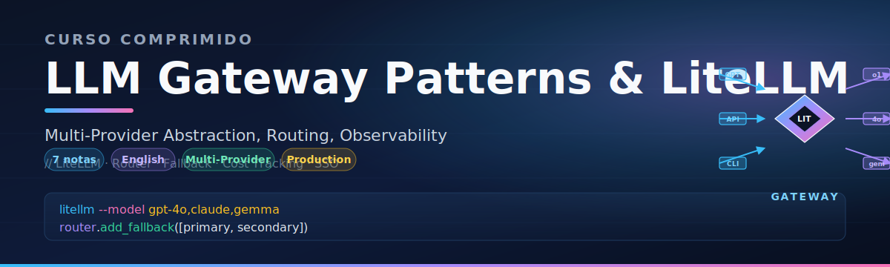

# 🏷️ Welcome to LLM Gateway Patterns and LiteLLM

## 🎯 Learning Objectives
- Understand the post-2024 multi-provider LLM reality and why gateways became non-negotiable
- Identify the failure modes that exposed the "single-vendor" illusion
- Navigate the 6 notes of this course and their dependencies
- Recognize where LiteLLM fits against DIY, Portkey, OpenRouter, Cloudflare AI Gateway, and Kong

## Introduction

By late 2024, the assumption that an LLM application could be built on a single provider was no longer defensible. The November 2024 OpenAI outage, the rotating Claude capacity throttling, the silent price wars between Google, Anthropic, and Mistral, and the rapid rise of self-hosted models (Llama, Qwen, DeepSeek) running on vLLM and SGLang forced engineering teams to confront a hard truth: **the abstraction layer between your application and the model is now product-critical, not infrastructure boilerplate**.

This course is the missing piece in the vault's LLM engineering track. You have already studied high-performance serving with vLLM in [[06 - Large Language Models/13 - vLLM and Advanced RAG]], advanced retrieval with ColBERT and SGLang in [[06 - Large Language Models/17 - ColBERT, SGLang and Next-Gen Inference]], and production RAG. What you have not yet had is a **provider-agnostic interface** that lets you swap GPT-4o for Claude 3.5 Sonnet for a self-hosted Llama 3.3 70B in a single line of code. That is exactly what this module teaches.

The cross-cutting angle is that gateways are not just Python libraries. The vault already covers the Go perspective in [[13 - Go Engineering/06 - Go for ML Backend/06 - Building a Production ML Gateway]] and the Bun/TypeScript perspective in [[Extra/Bun Runtime/06 - Bun for ML and Data Engineering]]. LiteLLM is the **Python standard** — the de facto interface used in LangChain, LlamaIndex, instructor, autogen, and most agent frameworks. Mastering it means you can move between the polyglot gateway world and the data-science-native world without friction.

---

## 1. Why This Course Exists

A modern LLM application makes dozens of micro-decisions every second: which model, which provider, which region, at what temperature, with what fallback if the primary fails, with what cost ceiling, with which observability sink. Without a gateway layer, these decisions are scattered across `if/else` branches, environment variables, and ad-hoc retry decorators. With one, they become declarative — version-controlled in a single `config.yaml`, observable in a single dashboard, and auditable per team per request.

LiteLLM, originally a 100-line wrapper written by Ishaan Jaffer and Krrish Dholakia at BerriAI in 2023, has grown into the lingua franca of LLM routing. It processes 100M+ requests per day across its open-source user base, supports 100+ providers, and has become the default gateway for everything from two-engineer startups to Fortune 500 internal platforms. This course treats it as a **pattern library**, not just a tool — the patterns generalize to Portkey, OpenRouter, Kong, and any future gateway.

---

## 2. Course Map

| Note | Title | Focus |
|------|-------|-------|
| 00 | Welcome to LLM Gateway Patterns and LiteLLM | This overview |
| 01 | The LLM Gateway Problem — Why Multi-Provider Abstraction | Vendor dynamics, outage economics, competing approaches |
| 02 | LiteLLM Core — Unified Multi-Provider Interface | `completion()`, `acompletion()`, message normalization |
| 03 | Routing, Fallback and Retry Strategies | `Router`, weights, cost/latency routing, fallback chains |
| 04 | Observability, Cost Tracking and Rate Limiting | Callbacks, virtual keys, spend limits, custom loggers |
| 05 | Self-Hosted LiteLLM Proxy — Docker, Kubernetes and Auth | `litellm-proxy`, `config.yaml`, SSO, Helm, Postgres |
| 06 | Capstone — Multi-Provider RAG Gateway with LiteLLM | End-to-end FastAPI + Redis cache + Qdrant + Phoenix |

---

## 3. Prerequisites

You should already be comfortable with:

- **Python async/await** — LiteLLM's proxy and async client are built on `asyncio` and FastAPI
- **LLM serving basics** — PagedAttention and vLLM concepts from [[06 - Large Language Models/13 - vLLM and Advanced RAG]]
- **RAG fundamentals** — retrieval pipelines from [[06 - Large Language Models/12 - Production RAG]]
- **Vector databases** — Qdrant and pgvector from [[10 - Cloud, Infra y Backend/33 - Vector Databases and Semantic Search]]
- **Containerization** — Docker Compose, basic Kubernetes from the Cloud, Infra y Backend track

💡 If you have not read [[13 - Go Engineering/06 - Go for ML Backend/06 - Building a Production ML Gateway]], skim it before Note 01 — it is the Go-native counterpart to this course and clarifies which patterns are language-agnostic and which are Python-specific.

---

## 4. Cross-Module Connections

This course does not stand alone. The patterns in LiteLLM map directly to material you have already studied:

| Vault Module | Connection to This Course |
|--------------|---------------------------|
| [[06 - Large Language Models/13 - vLLM and Advanced RAG/01 - vLLM and Production-Grade LLM Serving\|vLLM Serving]] | Self-hosted open-weight models become a first-class LiteLLM provider |
| [[06 - Large Language Models/17 - ColBERT, SGLang and Next-Gen Inference/10 - Capstone - High-Performance RAG with ColBERT and SGLang\|ColBERT/SGLang Capstone]] | SGLang and vLLM endpoints are routable targets in a LiteLLM config |
| [[13 - Go Engineering/06 - Go for ML Backend/06 - Building a Production ML Gateway\|Go ML Gateway]] | Same routing/fallback patterns expressed in idiomatic Go |
| [[Extra/Bun Runtime/06 - Bun for ML and Data Engineering\|Bun for ML]] | Same patterns in TypeScript-native gateway code |
| [[10 - Cloud, Infra y Backend/33 - Vector Databases and Semantic Search/10 - Advanced Patterns and Observability\|Vector DB Observability]] | Redis-backed semantic caches integrate with LiteLLM caching |

---

## 5. What You Will Build

By Note 06, you will have constructed a **production-shaped multi-provider RAG gateway** with:

- A FastAPI `/chat` endpoint that fans out to OpenAI, Anthropic, and Groq through a single LiteLLM router
- A Redis semantic cache that deduplicates near-identical queries
- A Qdrant vector store for RAG context retrieval
- Phoenix traces for every request, capturing latency, cost, and prompt/response pairs
- A `/cost` endpoint exposing real-time per-team spend
- A `docker-compose.yml` that boots the whole stack locally

This capstone is small enough to understand end-to-end and faithful enough to deploy in a real company.

---

⚠️ The LLM gateway space evolves fast. Provider APIs change monthly, pricing changes quarterly, and LiteLLM ships a release roughly every week. The **patterns** in this course are stable; the **prices and model names** in the code examples will need updating. Always cross-check against the official LiteLLM docs at [docs.litellm.ai](https://docs.litellm.ai) before deploying.
