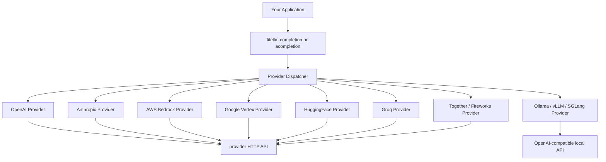

# 🏷️ LiteLLM Core: Unified Multi-Provider Interface

## 🎯 Learning Objectives
- Master LiteLLM's two entry points: `completion()` / `acompletion()` and the streaming variants
- Understand the 100+ provider adapter architecture and message-format normalization
- Use LiteLLM for embeddings, image generation, audio transcription, and function calling
- Compute cost programmatically and reason about provider-specific pricing
- Build a working 4-provider chat in 30 lines

## Introduction

LiteLLM began in mid-2023 as a 100-line Python file with a deceptively simple idea: wrap the OpenAI Python SDK's call signature, and translate it to every other provider. Three years later, that file has grown into a 50K+ line project shipping 100+ provider adapters, a production-grade proxy server, and a self-hosted control plane with SSO, virtual keys, and per-team spend limits. It has been forked by LangChain, LlamaIndex, instructor, and autogen. It is, in the most concrete sense, the **Python interface to the LLM ecosystem**.

This note is the *how* behind the *why* from [[01 - The LLM Gateway Problem - Why Multi-Provider Abstraction]]. We will walk through the unified `completion()` interface, the message normalization that makes it possible, the sibling APIs for embeddings and images, the cost-calculation engine, and the streaming protocol. By the end, the canonical LiteLLM call will feel as natural as `requests.get(url)`.

---

## 1. The Architectural Shape

The whole library is built around one abstraction: **the OpenAI chat-completion schema is the lingua franca**, and every other provider is a translation target. There is no "LiteLLM schema" — there is the OpenAI schema you already know, with a thin translation layer for providers that use something different.



The dispatcher routes on the model string. The convention is `provider/model`, so `gpt-4o` is OpenAI, `claude-3-5-sonnet-20241022` is Anthropic, `bedrock/anthropic.claude-3-sonnet-20240229-v1:0` is Bedrock, and `ollama/llama3.3` is local. If a model name is unambiguous (e.g., `gpt-4o`), the provider is inferred.

The local-case subtlety is important: **vLLM, SGLang, and Ollama all serve an OpenAI-compatible HTTP API**, so a model running on `http://gpu-pod:8000` is addressable as `openai/llama-3.3-70b-instruct` with `api_base` pointed at the local server. This is how self-hosted open weights become a first-class provider in the gateway — see [[06 - Large Language Models/13 - vLLM and Advanced RAG/01 - vLLM and Production-Grade LLM Serving\|vLLM Serving]] for the upstream side.

---

## 2. The `completion()` and `acompletion()` API

The two entry points cover the synchronous and asynchronous use cases:

```python
import litellm

# Synchronous — blocking, returns when the full response is done
response = litellm.completion(
    model="gpt-4o",
    messages=[{"role": "user", "content": "Explain PagedAttention in 2 sentences."}],
)
print(response.choices[0].message.content)
print(response.usage.prompt_tokens, response.usage.completion_tokens)

# Asynchronous — non-blocking, ideal for FastAPI / agent loops
import asyncio

async def main():
    response = await litellm.acompletion(
        model="claude-3-5-sonnet-20241022",
        messages=[{"role": "user", "content": "Same question."}],
    )
    return response.choices[0].message.content

print(asyncio.run(main()))
```

The returned object is `litellm.ModelResponse`, a normalized shape with `choices`, `usage`, `model`, and `created`. The `usage` block is normalized to:

```python
response.usage.prompt_tokens          # input tokens
response.usage.completion_tokens      # output tokens
response.usage.total_tokens           # sum
response.usage.prompt_tokens_details.cached_tokens  # provider-specific, may be 0
```

This uniformity is the whole point. Your code reads `response.usage.total_tokens` the same way whether the model was GPT-4o, Claude, or Llama on Groq.

### 2.1 Streaming

For interactive chat, you want tokens as they are generated. The streaming interface is the same in both sync and async paths:

```python
# Sync streaming
response = litellm.completion(
    model="gpt-4o",
    messages=messages,
    stream=True,
)
for chunk in response:
    if chunk.choices[0].delta.content:
        print(chunk.choices[0].delta.content, end="", flush=True)

# Async streaming
async for chunk in await litellm.acompletion(model="gpt-4o", messages=messages, stream=True):
    if chunk.choices[0].delta.content:
        print(chunk.choices[0].delta.content, end="", flush=True)
```

The library parses each provider's server-sent event format, normalizes to a `StreamingChoices` object, and yields. The application sees one consistent loop.

### 2.2 Provider Routing by Model String

The model-string convention is the routing surface. The format `<provider>/<model>` is explicit; bare names are inferred:

```python
# All valid LiteLLM model strings
litellm.completion(model="gpt-4o", ...)                                 # OpenAI (inferred)
litellm.completion(model="openai/gpt-4o", ...)                          # OpenAI (explicit)
litellm.completion(model="claude-3-5-sonnet-20241022", ...)             # Anthropic (inferred)
litellm.completion(model="anthropic/claude-3-5-sonnet-20241022", ...)  # Anthropic (explicit)
litellm.completion(model="bedrock/anthropic.claude-3-sonnet-20240229-v1:0", ...)
litellm.completion(model="vertex_ai/gemini-2.0-flash", ...)
litellm.completion(model="groq/llama-3.3-70b-versatile", ...)
litellm.completion(model="openai/llama-3.3-70b", api_base="http://gpu:8000/v1", ...)
```

You can also pass `api_key` and `api_base` per call to override the default from environment variables. This is the foundation for routing in [[03 - Routing, Fallback and Retry Strategies]].

---

## 3. The 100+ Provider Matrix

A useful way to think about the providers LiteLLM supports is in three tiers:

| Tier | Examples | Interface Pattern | Cost Model |
|------|----------|-------------------|------------|
| **OpenAI-Compatible (HTTP)** | OpenAI, Groq, Together, Fireworks, OpenRouter, vLLM, SGLang, Ollama, LM Studio | Native OpenAI HTTP, translated at most to non-streaming JSON | Per-token, defined per model |
| **First-Class Native** | Anthropic, Google Gemini, Bedrock, Vertex AI, Azure, Cohere, Mistral | Native SDK with message-format translation | Per-token, provider-specific |
| **Specialized** | HuggingFace, Replicate, Anyscale, OpenAI Whisper, ElevenLabs | Often REST with custom schemas | Variable: per-second, per-image, per-character |

The list grows monthly. A current snapshot (mid-2026) is at the [LiteLLM provider list](https://docs.litellm.ai/docs/providers). The 100+ figure includes the long tail — Vertex AI has 7 model variants, Bedrock has 15, HuggingFace has dozens of hosted endpoints. The principle is that *if it serves a chat-completion API*, LiteLLM can route to it.

A concrete example of message-format translation, the OpenAI → Anthropic case:

```python
# Application writes OpenAI format
openai_messages = [
    {"role": "system", "content": "You are a helpful assistant."},
    {"role": "user", "content": "What is PagedAttention?"},
]
# LiteLLM translates to Anthropic's expected shape:
# {
#   "system": "You are a helpful assistant.",
#   "messages": [{"role": "user", "content": "What is PagedAttention?"}],
#   "max_tokens": 1024,
#   "model": "claude-3-5-sonnet-20241022"
# }
response = litellm.completion(
    model="claude-3-5-sonnet-20241022",
    messages=openai_messages,
)
```

The user-facing `messages` list is preserved verbatim; the `system` role is hoisted to Anthropic's top-level field; `max_tokens` defaults are added; the response is normalized back to `ModelResponse`. The translation table is large (tool calling, image inputs, audio, etc.) but its effect is invisible to the caller.

---

## 4. The Embeddings, Images, and Audio APIs

Beyond chat, LiteLLM normalizes three other LLM-adjacent operations.

### 4.1 Embeddings

```python
# Same signature across OpenAI, Voyage, Cohere, Bedrock, HuggingFace, vLLM, etc.
response = litellm.embedding(
    model="text-embedding-3-small",
    input=["PagedAttention is great.", "LiteLLM is great."],
)
# response.data is a list of Embedding objects
vectors = [item["embedding"] for item in response.data]
```

Local embedding models are accessible as `openai/<model>` with an `api_base` pointed at a vLLM or SGLang server. This is the integration point with the Qdrant/pgvector material in [[10 - Cloud, Infra y Backend/33 - Vector Databases and Semantic Search]].

### 4.2 Image Generation

```python
# DALL-E, Stable Diffusion, AWS Titan, Google Imagen
response = litellm.image_generation(
    model="dall-e-3",
    prompt="A watercolor of a small ML engineer deploying a model at sunset.",
    n=1,
    size="1024x1024",
)
url = response.data[0].url
```

### 4.3 Audio Transcription

```python
# Whisper, Azure Speech, Google Speech-to-Text
with open("audio.mp3", "rb") as f:
    response = litellm.transcription(
        model="whisper-1",
        file=f,
    )
print(response.text)
```

The cost-calculation engine handles all three, with per-model pricing baked in.

---

## 5. Function Calling and Tool Use

Function calling is the integration point for agents. The OpenAI format is the standard, and LiteLLM translates it to Anthropic's `input_schema`/`tool_use`, Gemini's `functionDeclarations`, Bedrock's provider-dependent format, and others.

```python
import json
import litellm

tools = [
    {
        "type": "function",
        "function": {
            "name": "get_weather",
            "description": "Get the weather for a city",
            "parameters": {
                "type": "object",
                "properties": {
                    "city": {"type": "string", "description": "City name"},
                },
                "required": ["city"],
            },
        },
    }
]

response = litellm.completion(
    model="gpt-4o",
    messages=[{"role": "user", "content": "What's the weather in Madrid?"}],
    tools=tools,
)

# Inspect the tool call
tool_call = response.choices[0].message.tool_calls[0]
args = json.loads(tool_call.function.arguments)
# {"city": "Madrid"}
```

The same code works on `claude-3-5-sonnet-20241022`, `gemini-2.0-flash`, or a local Llama with no edits. This is the single biggest reason LangChain, LlamaIndex, and the agent frameworks standardized on LiteLLM.

---

## 6. Cost Calculation

`litellm.completion_cost()` returns the USD cost of a completed call. It uses a per-model pricing dictionary that ships with the library and is updated with each release.

```python
response = litellm.completion(
    model="gpt-4o",
    messages=[{"role": "user", "content": "Hello"}],
)
cost = litellm.completion_cost(completion_response=response)
print(f"Cost: ${cost:.6f}")
# Cost: $0.000015
```

The cost function is **model-aware**: it knows that `gpt-4o` is $2.50/$10.00 per million tokens, that `claude-3-5-sonnet` is $3.00/$15.00, that `gemini-2.0-flash` is $0.10/$0.40, and that `groq/llama-3.3-70b-versatile` is $0.59/$0.79. The dictionary is also user-extensible for custom models or negotiated enterprise rates:

```python
import litellm
litellm.model_cost = {
    **litellm.model_cost,
    "my-company/fine-tuned-llama": {
        "input_cost_per_token": 0.0000015,
        "output_cost_per_token": 0.0000020,
    },
}
```

This is the foundation of the per-team spend tracking in [[04 - Observability, Cost Tracking and Rate Limiting]].

---

## 7. Code in Practice: Four Providers in 30 Lines

A minimal, focused example that exercises the core surface. The same call, four different providers:

```python
import asyncio
import litellm

PROMPT = [
    {"role": "system", "content": "You are concise. Answer in 1 sentence."},
    {"role": "user", "content": "What is PagedAttention?"},
]

MODELS = [
    ("OpenAI",            "gpt-4o"),
    ("Anthropic",         "claude-3-5-sonnet-20241022"),
    ("Google Gemini",     "gemini/gemini-2.0-flash"),
    ("Groq (open-weights)", "groq/llama-3.3-70b-versatile"),
]

async def call_one(name, model):
    response = await litellm.acompletion(model=model, messages=PROMPT)
    cost = litellm.completion_cost(completion_response=response)
    return name, response.choices[0].message.content, cost

async def main():
    results = await asyncio.gather(*[call_one(n, m) for n, m in MODELS])
    for name, text, cost in results:
        print(f"--- {name} (${cost:.6f}) ---")
        print(text.strip(), "\n")

asyncio.run(main())
```

Expected output (will vary by model version):

```
--- OpenAI ($0.000045) ---
PagedAttention is a memory-management technique that stores the KV cache in non-contiguous fixed-size blocks, similar to virtual memory paging, to reduce fragmentation and improve GPU utilization.

--- Anthropic ($0.000063) ---
PagedAttention manages the KV cache in fixed-size pages, allowing non-contiguous memory allocation that reduces fragmentation and enables higher batch sizes for LLM serving.

--- Google Gemini ($0.000018) ---
PagedAttention divides the KV cache into uniform blocks to avoid fragmentation, allowing more requests to be served concurrently on a single GPU.

--- Groq (open-weights) ($0.000013) ---
PagedAttention is a memory scheme for LLM serving that uses paged allocation of the KV cache to eliminate fragmentation, inspired by OS virtual memory.
```

The output demonstrates three properties of LiteLLM that are the whole point of the library:

1. **Provider-agnostic interface** — the call site is identical across all four
2. **Cost transparency** — every response is metered in USD
3. **Open-weights parity** — Llama on Groq produces a quality answer at the lowest cost

---

## 8. Real Case: BerriAI at 100M Requests/Day

The BerriAI team (Ishaan Jaffer, Krrish Dholakia, and contributors) built LiteLLM originally to power their own `replit.com` AI features. By 2026, the open-source user base processes 100M+ requests/day across the major providers, with the largest single deployment (an internal platform at a Fortune 500 retailer, public via blog posts) handling 10M requests/day on a Kubernetes-deployed LiteLLM proxy. The library's release cadence is weekly, with breaking changes gated behind `litellm.suppress_debug_info = False` and a stable public surface that has not broken application code in over a year. This is the maturity curve that DIY implementations do not reach.

The library is also a stress test of provider-API stability: each new release typically fixes 20–40 provider-specific bugs reported through the GitHub issue tracker. A DIY team would have to maintain that surface area themselves.

---

## 9. Production Reality

A few operational notes that matter at scale:

- **Cold-start cost**: The first call to a given provider in a worker process pays the SDK import and any handshake latency. In long-running services this is negligible. In serverless deployments (Lambda, Cloud Run) it can dominate; use the proxy server to keep connections warm.
- **Timeout defaults**: LiteLLM defaults to 600s for non-streaming calls. For interactive chat, set `timeout=30` per call.
- **Concurrency**: `acompletion()` uses `aiohttp` and supports thousands of concurrent in-flight requests. For really high concurrency, run multiple worker processes; there is no per-process limit beyond OS file descriptors.
- **Error normalization**: All provider errors become `litellm.exceptions.{RateLimitError, ServiceUnavailableError, ContextWindowExceededError, Timeout, AuthenticationError, BadRequestError}`. Your retry logic only needs six exception types.
- **Debug logging**: `litellm._turn_on_debug()` prints the exact HTTP request and response, including the translated body. This is the single most useful tool for diagnosing why a prompt works on one provider and not another.

---

## 🎯 Key Takeaways

- LiteLLM's two entry points — `completion()` and `acompletion()` — are the entire public surface for chat; the same shape covers streaming, tool use, and async loops
- The OpenAI chat-completion schema is the lingua franca; LiteLLM is a translation layer to 100+ providers
- The same library covers embeddings, image generation, audio transcription, and function calling with provider-agnostic interfaces
- `litellm.completion_cost()` returns USD cost for any completed call, using a per-model dictionary that is user-extensible
- The 4-provider demo in 30 lines demonstrates provider parity: GPT-4o, Claude 3.5, Gemini 2.0, and Llama 3.3 70B all callable from one `acompletion()` call
- BerriAI's open-source deployment processes 100M+ requests/day; the library is the de facto Python gateway standard
- The pattern generalizes: any OpenAI-compatible endpoint (vLLM, SGLang, Ollama) becomes a first-class provider via `api_base` — see [[06 - Large Language Models/13 - vLLM and Advanced RAG]] and [[06 - Large Language Models/17 - ColBERT, SGLang and Next-Gen Inference]]

## References

- LiteLLM official docs, [docs.litellm.ai](https://docs.litellm.ai)
- LiteLLM provider matrix, [docs.litellm.ai/docs/providers](https://docs.litellm.ai/docs/providers)
- BerriAI blog, [blog.berri.ai](https://blog.berri.ai)
- LangChain LiteLLM integration, [python.langchain.com/docs/integrations/chat/litellm](https://python.langchain.com/docs/integrations/chat/litellm)
- Vault cross-links: [[01 - The LLM Gateway Problem - Why Multi-Provider Abstraction]], [[03 - Routing, Fallback and Retry Strategies]], [[04 - Observability, Cost Tracking and Rate Limiting]], [[06 - Large Language Models/13 - vLLM and Advanced RAG/01 - vLLM and Production-Grade LLM Serving\|vLLM Serving]], [[06 - Large Language Models/17 - ColBERT, SGLang and Next-Gen Inference/03 - SGLang - Structured Generation and RadixAttention\|SGLang]]
