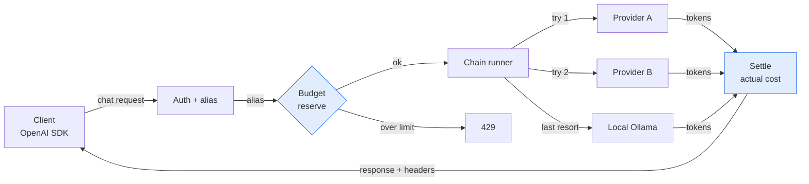

# 🏗️ 07 - Building an LLM Gateway from Scratch

LiteLLM gives you a gateway through configuration. This note shows what you build when configuration is not enough: your own adapters, aliases, budget control and streaming. These are the four parts that P0 implements.

## 🎯 Objectives
- Decide when to build a gateway and when to configure one.
- Design a provider adapter so a new provider costs one small class.
- Implement alias chains with fallback and a per-provider breaker.
- Enforce a hard budget with an atomic reserve/settle pattern in Redis.



> [!info] Estado 2026
> The OpenAI chat-completions format is still the common contract that most providers accept (Groq, Together, Fireworks, vLLM, Ollama, Google AI Studio compatibility mode). Hosted gateways (Cloudflare AI Gateway, Portkey, Kong AI Gateway) cover many needs, so a custom gateway is justified only by a specific requirement. Verified: 2026-10.

---

## 1. Build or configure?
A gateway is a thin service that sits between your apps and the model providers. Most teams should **configure** one. You build your own when you need behavior that a config file cannot express.

| Choose | When |
|--------|------|
| Configure ([[06 - Large Language Models/19 - LLM Gateway Patterns and LiteLLM/05 - Self-Hosted LiteLLM Proxy - Docker, Kubernetes and Auth\|LiteLLM proxy]]) | Standard routing, retries and spend logs are enough |
| Hosted ([[06 - Large Language Models/27 - Portkey AI Gateway and Observability/00 - Welcome - Portkey AI Gateway and Observability\|Portkey]]) | You do not want to run infrastructure |
| **Build** | You need a custom semantic cache, an exact budget cap, or your own resilience rules |
| Build | You want to understand the system well enough to debug it at 3 a.m. |

💡 Building teaches the failure modes. Even if you deploy LiteLLM later, you will configure it better.

## 2. The adapter: one interface, many providers
Every provider speaks a slightly different dialect. The adapter hides this behind one small contract, so the rest of the gateway never sees provider details.

```python
from typing import AsyncIterator, Protocol

class Provider(Protocol):
    name: str                                              # WHY: shown in the X-Provider header
    async def chat(self, req: dict) -> dict: ...           # WHY: non-streaming call, OpenAI-shaped
    def stream(self, req: dict) -> AsyncIterator[bytes]: ...  # WHY: raw SSE lines, passed through

class OpenAICompat:
    """One class covers Groq, Together, Fireworks, vLLM, Ollama (/v1)."""
    def __init__(self, name: str, base_url: str, key: str, client):
        self.name, self.base, self.key, self.http = name, base_url, key, client

    async def chat(self, req: dict) -> dict:
        r = await self.http.post(f"{self.base}/chat/completions", json=req,
                                 headers={"Authorization": f"Bearer {self.key}"})
        r.raise_for_status()                               # WHY: 4xx/5xx become exceptions the runner can classify
        return r.json()
```

⚠️ Reuse **one** `httpx.AsyncClient` for the whole process. Creating a client per request throws away connection pooling and adds a TLS handshake to every call.

Caso real: in P0, `OpenAICompat` serves four providers. Only Anthropic needs its own adapter, because its message format differs.

## 3. Aliases and the chain runner
Clients ask for a **purpose** (`fast`, `smart`, `judge`), not a model. The alias maps to an ordered chain. You can change models without touching client code.

```yaml
# routes.yaml
fast:  [groq/llama-3.1-8b, ollama/gemma3:1b]          # WHY: the last item is always local, so the chain never fully fails
smart: [google/gemma-4, groq/llama-3.3-70b, ollama/gemma3:1b]
```

```python
async def run_chain(alias: str, req: dict):
    last: Exception | None = None
    for depth, step in enumerate(CHAINS[alias]):
        if not breakers[step.name].allow():                # WHY: skip a provider whose circuit is open
            continue
        try:
            async with asyncio.timeout(step.timeout_s):    # WHY: a slow provider is a failure, not a wait
                resp = await providers[step.name].chat({**req, "model": step.model})
            breakers[step.name].success()
            return resp, step.name, depth                  # WHY: the header reports the REAL provider used
        except httpx.HTTPStatusError as e:
            if e.response.status_code < 500 and e.response.status_code != 429:
                raise                                      # ❌ do not fall back on a 400: the request itself is wrong
            breakers[step.name].failure(); last = e
        except (TimeoutError, httpx.TransportError) as e:
            breakers[step.name].failure(); last = e
    raise AllProvidersFailed from last
```

¡Sorpresa! A fallback on every error hides bugs. A malformed request will fail on all providers, burn quota on each one, and still fail. Retry only what is **transient**: timeouts, 5xx and 429.

Caso real: the Go gateway had one upstream and one fallback. P0 uses a chain per alias, and the `X-Fallback-Depth` header shows how far each request went.

## 4. The budget: reserve first, settle after
A loop in your code can spend real money in minutes. The safe pattern has two steps. **Reserve** the worst-case cost before the call, then **settle** the real cost after it.

$$\text{reserve} = \text{input tokens} \cdot p_{in} + \text{max\_tokens} \cdot p_{out}$$

```python
RESERVE = """
local spent = tonumber(redis.call('GET', KEYS[1]) or '0')
if spent + tonumber(ARGV[1]) > tonumber(ARGV[2]) then return -1 end  -- over the cap: refuse
return redis.call('INCRBY', KEYS[1], ARGV[1])                        -- atomic: check + add in one step
"""
reserve = redis.register_script(RESERVE)

async def guarded_call(client_id: str, est_micro_usd: int, limit: int, call):
    ok = await reserve(keys=[f"budget:{client_id}"], args=[est_micro_usd, limit])
    if ok == -1:
        raise BudgetExceeded                               # WHY: becomes HTTP 429 before any money is spent
    try:
        resp = await call()
        actual = cost_of(resp["usage"])                    # WHY: real tokens from the provider response
        await redis.incrby(f"budget:{client_id}", actual - est_micro_usd)  # settle: usually a refund
        return resp
    except BaseException:
        await redis.incrby(f"budget:{client_id}", -est_micro_usd)          # WHY: failed call costs nothing
        raise
```

⚠️ Use **integers** (micro-dollars), never floats. Float rounding drifts over millions of calls. Also, a `GET` followed by a `SET` in Python is **not** atomic: two requests can both pass the check. The Lua script runs as one step inside Redis.

💡 `BaseException` is intentional: a cancelled request (`CancelledError`) must also release its reservation.

Caso real: this removes the "runaway loop" risk. With a 1 USD cap, the worst case is one reservation over the limit, never an open bill.

## 5. Streaming with cancellation
For streams, the gateway forwards the provider's [[10 - Cloud, Infra y Backend/48 - LLM Token Streaming - SSE, WebSockets and gRPC/01 - Server-Sent Events Deep Dive\|SSE]] lines unchanged. The hard part is stopping work when the client leaves.

```python
async def sse(request, provider, req, settle):
    try:
        async for line in provider.stream(req):            # WHY: pass through, do not re-parse every token
            if await request.is_disconnected():
                break                                      # WHY: closing the upstream stops provider billing early
            yield line
    finally:
        await settle()                                     # WHY: always release or settle the budget, even on cancel
```

¡Sorpresa! If the generator ends without `finally`, a closed browser tab leaves the reservation open and the upstream request running. Test this explicitly: a long stream must survive the handler returning, and must stop when the client disconnects.

## 6. Landscape 2026
| Tool | What it is | Use it when |
|------|-----------|-------------|
| LiteLLM | Python library and proxy, 100+ providers | You want fast multi-provider routing by config |
| Portkey | Hosted or open-source gateway with guardrails | You want a managed control plane |
| Cloudflare AI Gateway | Edge proxy with cache and analytics | Your traffic already runs on Cloudflare |
| Kong AI Gateway | API gateway plugin for LLM traffic | You already operate Kong |
| Custom (P0) | Your own FastAPI service | You need a custom cache, exact budget or resilience |

---

## 🧠 Cheat Sheet
| Part | Rule | Failure it prevents |
|------|------|---------------------|
| Adapter | One `Protocol`; one class for all OpenAI-compatible providers | Provider details leaking into business code |
| Alias | Purpose → ordered chain; last step is local | Total outage; model names hard-coded in clients |
| Fallback | Only on timeout, 5xx, 429 | Burning quota on invalid requests |
| Budget | Reserve (Lua) → call → settle; integer micro-USD | Runaway cost, race conditions |
| Stream | Pass through; `finally` always settles | Leaked reservations, ghost upstream calls |
| Headers | Report the provider actually used | Misleading diagnostics |

## 🎤 Interview Angle
- **Trade-off:** configuring a gateway is faster; building one gives control over cache, budget and resilience, at the cost of maintaining it.
- **30-second answer:** "I put an OpenAI-compatible gateway in front of providers, with aliases that map to fallback chains. Before each call I reserve the worst-case cost atomically in Redis, then settle the real cost. Streams pass through and always settle in a `finally` block."

## 🔁 Recall
> [!question]- Why is reserve-then-settle better than checking the balance before the call?
> The check and the update happen in one atomic Lua step, so two concurrent requests cannot both pass. Settling afterwards returns the unused part.

> [!question]- Which errors should trigger a fallback?
> Timeouts, transport errors, 5xx and 429. A 4xx means the request is wrong, so another provider will fail too.

> [!question]- Why must the last item of every chain be a local model?
> It keeps the service answering when every cloud provider is down or the quota is gone.

> [!question]- What goes wrong if budget values are floats?
> Rounding errors accumulate. Integer micro-dollars keep the sum exact.

## References
- OpenAI API reference, Chat Completions (the contract that providers copy).
- Redis docs: Lua scripting and `EVAL` atomicity.
- HTTPX docs: async client and connection pooling.

⬅️ [[06 - Large Language Models/19 - LLM Gateway Patterns and LiteLLM/06 - Capstone - Multi-Provider RAG Gateway with LiteLLM|06 Capstone]] · ➡️ [[06 - Large Language Models/19 - LLM Gateway Patterns and LiteLLM/08 - Semantic Caching Without False Hits|08 Semantic Caching]] · 🧭 [[06 - Large Language Models/19 - LLM Gateway Patterns and LiteLLM/00 - Welcome to LLM Gateway Patterns and LiteLLM|Course start]] · 🛠️ P0 llm-gateway M1–M2 and M5 (budget)
