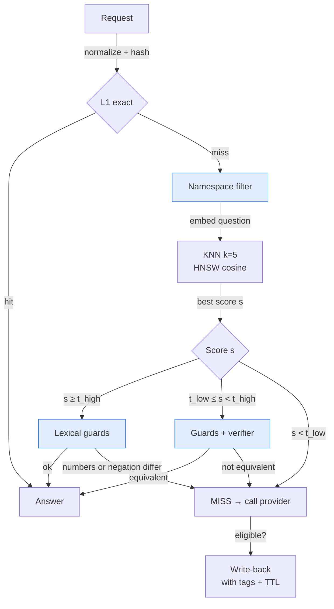

# 🧠 08 - Semantic Caching Without False Hits

A semantic cache saves money and time, but one wrong hit gives a user the answer to a different question. This note shows how to keep the savings and remove the wrong answers.

## 🎯 Objectives
- Explain why a high similarity score does not prove two questions are the same.
- Design a cache namespace so that different contexts never share answers.
- Calibrate a threshold from labeled pairs instead of guessing it.
- Combine lexical guards, a verifier and tag invalidation into one safe lookup.



> [!info] Estado 2026
> Semantic caching is built into several stacks: LiteLLM (Redis and Qdrant semantic cache), Portkey, and RedisVL's `SemanticCache`. Redis 8 includes the Query Engine with vector search, so one Redis instance can hold cache, budget and rate limits. The main risk is unchanged: false hits come from thresholds copied from a tutorial. Verified: 2026-10.

---

## 1. Why similarity is not equality
An embedding model places questions with the same topic close together, even when one word changes the answer. Cosine similarity measures topic closeness, not meaning equivalence.

| Question A | Question B | Cosine (typical) | Same answer? |
|------------|------------|:----------------:|:------------:|
| What is the national transfer fee? | What is the international transfer fee? | 0.93 | ❌ No |
| My card did not arrive | My card arrived | 0.91 | ❌ No |
| How do I reset my password? | I forgot my password, how can I reset it? | 0.92 | ✅ Yes |

Two pairs with nearly the same score have opposite labels. No single threshold separates them well, so the design needs more layers than a threshold.

$$\text{precision} = \frac{TP}{TP + FP} \qquad FP = \text{false hits (wrong answer served)}$$

A cache with 90% hits and 3% false hits is worse than one with 60% hits and 0.1% false hits, because each false hit is a wrong answer that looks confident.

## 2. Namespace: the first and cheapest defense
Before any similarity search, restrict the search to entries that were created in the **same context**. The same question can have different correct answers for two clients, two system prompts or two embedding models.

```python
import hashlib

def namespace(client: str, alias: str, system_prompt: str,
              prompt_version: str, embedder: str) -> str:
    raw = "|".join([client, alias, system_prompt, prompt_version, embedder])
    return hashlib.sha256(raw.encode()).hexdigest()[:16]   # WHY: hex only, so it is a safe Redis TAG value
```

⚠️ Include the **embedder name**. Vectors from two models live in different spaces, so comparing them gives meaningless scores.

💡 If the conversation has several turns, embed only the last question, but allow a hit only when the earlier history has the same hash. Otherwise "and the second one?" matches the wrong conversation.

Caso real: the Go gateway keyed the cache by the last user message only, so a different system prompt could receive a cached answer. P0 adds the namespace to fix this.

## 3. Search inside the namespace
The namespace filter runs **in the same vector query**, so Redis never returns neighbors from other contexts.

```python
from redis.commands.search.query import Query

q = (Query("(@ns:{$ns})=>[KNN 5 @embedding $vec AS dist]")   # WHY: filter first, then nearest 5
     .sort_by("dist").return_fields("dist", "answer", "question")
     .dialect(2))                                            # WHY: parameters need dialect 2
res = await r.ft("semcache").search(q, {"ns": ns, "vec": vec.tobytes()})
best = res.docs[0] if res.docs else None
similarity = 1 - float(best.dist) if best else 0.0          # WHY: COSINE returns a distance; similarity = 1 - distance
```

¡Sorpresa! A filter applied **after** KNN can return zero results: the 5 nearest neighbors may all belong to other namespaces. Put the filter inside the query, as above.

## 4. Calibrate the threshold with labeled pairs
Collect a few hundred to a thousand pairs labeled "same question" or "similar but different". Use real traffic and your own languages. Then pick the threshold from data.

```python
def pick_threshold(pairs: list[tuple[float, bool]], target: float = 0.995) -> float:
    """pairs = [(similarity, is_same_question)]. Lowest threshold that still meets the precision target."""
    tp = fp = 0
    best = 1.0                                   # WHY: default 1.0 means "never serve from cache"
    for sim, same in sorted(pairs, reverse=True):
        tp += same
        fp += not same
        if tp / (tp + fp) >= target:
            best = sim                           # WHY: keep lowering while precision stays above the target
    return best
```

Use **two** thresholds. Above `t_high` the guards are enough. Between `t_low` and `t_high` (the gray zone) a verifier must also agree. Below `t_low` it is always a miss.

⚠️ Each embedding model needs its own thresholds. A value like 0.85 from a tutorial was tuned for another model and another language mix.

Caso real: P0 targets at least 99.5% precision on a labeled set built from the FAQ questions of P3 and the messages of P2.

## 5. Lexical guards: cheap and strict
Embeddings are weak at numbers, dates and negation. A few lines of code catch these cases before they reach the user.

```python
import re

NEG = {"no", "not", "never", "sin", "nunca", "ni", "tampoco"}
NUM = re.compile(r"\d+(?:[.,]\d+)?")

def lexical_ok(new_q: str, cached_q: str) -> bool:
    a, b = new_q.lower(), cached_q.lower()
    if sorted(NUM.findall(a)) != sorted(NUM.findall(b)):     # WHY: "5000 USD" is not "500 USD"
        return False
    wa, wb = set(re.findall(r"\w+", a)), set(re.findall(r"\w+", b))
    return (wa & NEG) == (wb & NEG)                          # WHY: "did not arrive" vs "arrived"
```

💡 Add dates, currencies and product codes as your domain needs. Keep the guards **strict**: a rejected hit costs one provider call, while an accepted false hit costs trust.

## 6. The verifier for the gray zone
A small cross-encoder reads both questions **together** and outputs an equivalence score. It is more accurate than comparing two separate vectors, but slower, so it runs only for gray-zone candidates.

| Stage | Cost per request | Runs for |
|-------|:----------------:|----------|
| Exact hash (L1) | microseconds | every request |
| Embedding + KNN | ~10-20 ms on CPU | every L1 miss |
| Lexical guards | microseconds | every candidate |
| Cross-encoder | ~20-50 ms on CPU | gray zone only |

The verifier protects accuracy where the threshold is least reliable and adds latency only there.

## 7. Eligibility, freshness and invalidation
Do not cache everything. Store an answer only when it is safe to reuse.

| Cache it when | Never cache |
|---------------|-------------|
| `temperature` is low (≤ 0.3) or the client opts in | Truncated answers (`finish_reason` is not `stop`) |
| No tools, no per-user data | Emergency fallback answers when the alias demands quality |
| Structured output passed validation | Anything marked as private by the client |

**Freshness has two tools.** A TTL per alias handles slow change. **Tags** handle exact change: the client sends the ids of the documents it used, and when a document changes, you delete the entries that carry its tag.

```python
async def invalidate(doc_ids: list[str]) -> int:
    tags = "|".join(doc_ids)                                  # WHY: ids like doc_123 are safe TAG values (avoid hyphens)
    q = Query(f"@tags:{{{tags}}}").no_content().paging(0, 1000)
    ids = [d.id for d in (await r.ft("semcache").search(q)).docs]
    if ids:
        await r.delete(*ids)                                  # WHY: delete only matching entries, never FLUSHDB
    return len(ids)
```

⚠️ `FLUSHDB` also deletes budgets and rate limits stored in the same Redis. Delete by namespace or by tag, and keep other data under other key prefixes.

Caso real: in P3, a change in the knowledge base publishes the changed `doc_id`s. P0 deletes the cached answers that cited them, so the cache never contradicts the fresh index.

## 8. Landscape 2026
| Tool | What it is | Use it when |
|------|-----------|-------------|
| LiteLLM semantic cache | Redis or Qdrant backed cache in the proxy | You want a quick start with a config file |
| RedisVL `SemanticCache` | Python helper over Redis vector search | You build your own app and want a tested base |
| Portkey cache | Hosted exact and semantic cache | You prefer a managed gateway |
| Custom layers (P0) | Namespace, calibration, guards, verifier, tags | A wrong answer is costly and you must measure it |

---

## 🧠 Cheat Sheet
| Layer | What it does | Stops this failure |
|-------|--------------|--------------------|
| L1 exact hash | Same normalized request → same answer | Wasted embedding work |
| Namespace | Searches only inside one context | Answers from another client or prompt |
| Calibrated `t_high` / `t_low` | Threshold from labeled pairs | Guessed thresholds |
| Lexical guards | Compare numbers and negations | "500" vs "5000", "arrived" vs "did not arrive" |
| Cross-encoder | Confirms equivalence in the gray zone | Close but different questions |
| Eligibility | Stores only safe answers | Frozen creative or truncated answers |
| TTL + tags | Expire by time or by changed document | Stale answers |

## 🎤 Interview Angle
- **Trade-off:** a looser threshold gives more hits and more false hits. The right point comes from measured precision, not from intuition.
- **30-second answer:** "I scope the cache with a namespace, search inside it, and calibrate two thresholds on labeled pairs for 99.5% precision. Guards reject changed numbers and negations, a small cross-encoder checks the gray zone, and tags invalidate entries when a source document changes."

## 🔁 Recall
> [!question]- Why is cosine similarity alone not enough?
> It measures topic closeness. Two questions that differ by one word ("national" vs "international") can score almost the same and need different answers.

> [!question]- Why must the namespace filter be inside the KNN query?
> A filter after KNN can remove all 5 neighbors, because they may belong to other namespaces. The result would be empty even when a valid entry exists.

> [!question]- How do you choose the thresholds?
> Build labeled pairs, sort them by similarity, and pick the lowest score that still meets the precision target (for example 99.5%). Use two thresholds to define a gray zone for the verifier.

> [!question]- When do you invalidate by tag instead of waiting for the TTL?
> When a known source document changes. The tag removes exactly the entries that used it, so answers stay fresh without clearing the whole cache.

## References
- Redis docs: vector search, HNSW and `FT.SEARCH` with `KNN` and `DIALECT 2`.
- Sentence Transformers docs: cross-encoders for pair scoring.
- RedisVL docs: `SemanticCache`.

⬅️ [[06 - Large Language Models/19 - LLM Gateway Patterns and LiteLLM/07 - Building an LLM Gateway from Scratch|07 Building a Gateway]] · ➡️ [[06 - Large Language Models/19 - LLM Gateway Patterns and LiteLLM/09 - Tail Latency and Overload Control|09 Tail Latency]] · 🧭 [[06 - Large Language Models/19 - LLM Gateway Patterns and LiteLLM/00 - Welcome to LLM Gateway Patterns and LiteLLM|Course start]] · 🛠️ P0 llm-gateway M4 (semantic cache)
