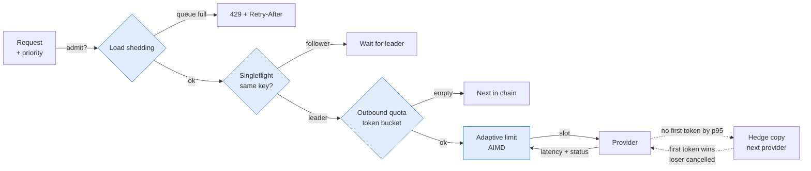

# ⏱️ 09 - Tail Latency and Overload Control

Averages hide the slow requests that users remember. This note shows how a gateway keeps the slowest 1% under control and how it behaves when more traffic arrives than the providers can handle.

## 🎯 Objectives
- Explain why tail latency (p95, p99) matters more than the average.
- Implement a hedged request that cancels the loser.
- Adapt concurrency with AIMD instead of a fixed number.
- Protect important traffic with load shedding, singleflight and outbound quotas.



> [!info] Estado 2026
> These patterns come from large distributed systems: hedging from Google's "The Tail at Scale", adaptive limits from Netflix's `concurrency-limits` and Envoy's adaptive concurrency filter. They are now standard for LLM traffic, where one call can take from 300 ms to 60 s. Free tiers add a new limit: provider quotas (requests and tokens per minute). Verified: 2026-10.

---

## 1. Why the tail matters
A user request often needs several model calls (retrieve, rewrite, answer, judge). If each call is slow with probability $p$, the chance that **at least one** of $n$ calls is slow grows fast:

$$P(\text{slow request}) = 1 - (1 - p)^n \qquad p = 0.01,\ n = 5 \Rightarrow 4.9\%$$

A "1% problem" per call becomes a "5% problem" per user request. This is why you track **p95 and p99**, not the mean.

Overload follows from **Little's law**: in-flight requests $L = \lambda \cdot W$ (arrival rate × time in system). If the provider slows down, $W$ grows, so $L$ grows even when the arrival rate $\lambda$ stays the same. Without a limit, the queue grows until memory or timeouts break the service.

## 2. Hedged requests
A hedge is a second copy of the request, sent to the next healthy provider **only when the first one is late**. The first to answer wins and the other is cancelled.

```python
import asyncio

async def hedged(primary, backup, delay_s: float):
    t1 = asyncio.create_task(primary())
    done, _ = await asyncio.wait({t1}, timeout=delay_s)       # WHY: wait up to the alias p95, no hedge if it answers
    if done:
        return t1.result()
    t2 = asyncio.create_task(backup())                        # WHY: only now pay for the second copy
    done, pending = await asyncio.wait({t1, t2}, return_when=asyncio.FIRST_COMPLETED)
    for p in pending:
        p.cancel()                                            # WHY: stop the loser so it stops costing money
    return done.pop().result()
```

⚠️ Set the delay to the **historical p95** of the alias. A smaller delay hedges too often and doubles your cost. Add a cap on hedges per time window, and never hedge against a paid provider unless the config allows it.

💡 For streaming, "first answer" means the **first token**, not the full response.

¡Sorpresa! If the first task to finish ended with an error, `done.pop().result()` raises it even though the other task could succeed. In production, ignore failed tasks and keep waiting for the other one.

Caso real: P0 measures the gain with injected delays (Toxiproxy): p99 drops while the extra request rate stays under the configured cap.

## 3. Adaptive concurrency (AIMD)
A fixed limit such as "10 parallel calls" is wrong on most days. It is too low when the provider is fast and too high when it is slow. AIMD (additive increase, multiplicative decrease) finds the limit by itself, like TCP congestion control.

```python
class AIMD:
    def __init__(self, lo=1.0, hi=32.0, target_ms=1500.0):
        self.limit, self.lo, self.hi, self.target = 4.0, lo, hi, target_ms

    def on_result(self, latency_ms: float, ok: bool) -> None:
        if not ok or latency_ms > self.target:
            self.limit = max(self.lo, self.limit * 0.7)            # WHY: cut fast when the provider struggles
        else:
            self.limit = min(self.hi, self.limit + 1 / self.limit) # WHY: grow slowly, about +1 per full window
```

The limit rises slowly while latency stays healthy and drops quickly when it does not. Ollama on a 4 GB GPU starts at 2 slots, because a larger limit only creates a queue inside the model server.

⚠️ Measure **time to first token** for streams, not total time. Long answers are slow by design and would shrink the limit for no reason.

## 4. Load shedding by priority
When the queue is full, something must be rejected. Choose what to reject **on purpose**: drop low-priority work first, so the user-facing path stays fast.

```python
def admit(priority: str, queue_len: int, limit: int = 100) -> bool:
    if queue_len >= limit:
        return False                                  # WHY: full queue, reject everything new
    if priority == "batch" and queue_len >= limit * 0.6:
        return False                                  # WHY: protect interactive traffic from a judge batch run
    return True
# caller answers 429 with a Retry-After header when admit() is False
```

A fast `429` is better than a slow timeout. The client can retry later or use its own fallback.

Caso real: P2 runs its judge over a full dataset (batch) while P3 answers users (interactive). Shedding batch first keeps the RAG responsive.

## 5. Singleflight
When a popular answer expires, many identical requests arrive together. Without protection, all of them call the provider (a "stampede"). Singleflight makes the first request the **leader** and lets the others wait for its result.

```python
inflight: dict[str, asyncio.Future] = {}

async def singleflight(key: str, fn):
    fut = inflight.get(key)
    if fut is None:                                            # WHY: first caller becomes the leader
        fut = inflight[key] = asyncio.ensure_future(fn())
        fut.add_done_callback(lambda _: inflight.pop(key, None))
    return await asyncio.shield(fut)                           # WHY: one cancelled caller must not cancel the shared call
```

💡 Build the key from the same normalized request used for the exact cache (see [[06 - Large Language Models/19 - LLM Gateway Patterns and LiteLLM/08 - Semantic Caching Without False Hits|note 08]]), so cache and singleflight agree on what "identical" means.

## 6. Outbound quotas for free tiers
Free tiers publish limits (for example requests and tokens per minute). Crossing them returns `429` and wastes time. A token bucket per provider lets the gateway **skip** a provider before it fails.

```python
import time

class Bucket:
    def __init__(self, per_minute: int):
        self.cap = self.tokens = float(per_minute)
        self.rate = per_minute / 60.0
        self.t = time.monotonic()

    def take(self, n: float = 1) -> bool:
        now = time.monotonic()
        self.tokens = min(self.cap, self.tokens + (now - self.t) * self.rate)   # WHY: refill continuously, not once a minute
        self.t = now
        if self.tokens >= n:
            self.tokens -= n
            return True
        return False                       # WHY: empty bucket means "go to the next provider in the chain"
```

⚠️ Keep a small safety margin (for example 90% of the published limit), because provider clocks and counting rules differ from yours. When a provider sends `retry-after`, trust it over your own estimate.

## 7. Landscape 2026
| Tool | What it is | Use it when |
|------|-----------|-------------|
| Netflix `concurrency-limits` | Java library with AIMD and gradient limiters | You want the reference design to copy |
| Envoy adaptive concurrency | Proxy filter that tunes the limit from latency | The gateway runs behind Envoy |
| Resilience4j | JVM bulkhead, rate limiter, circuit breaker | Your service is on the JVM |
| `asyncio` + small classes | The code in this note | Python gateway, you need full control (P0) |

---

## 🧠 Cheat Sheet
| Tool | Trigger | Protects | Main risk |
|------|---------|----------|-----------|
| Hedging | No first token by p95 | Tail latency | Double cost without a cap |
| AIMD | Latency over target or error | Provider from overload | Wrong signal (total time instead of TTFT) |
| Load shedding | Queue above limit | Interactive traffic | Rejecting the wrong class |
| Singleflight | Same key in flight | Provider from stampedes | Shared failure; needs `shield` |
| Token bucket | Quota empty | Free-tier limits | Margin too small |

## 🎤 Interview Angle
- **Trade-off:** hedging and generous limits lower latency but raise cost and load. Every tool in this note needs a cap or a margin.
- **30-second answer:** "I watch p95 and p99. I hedge a late request to the next provider with a cap, adapt concurrency with AIMD on time to first token, shed batch traffic first when the queue fills, collapse identical in-flight requests with singleflight, and use token buckets so free-tier quotas never return a 429."

## 🔁 Recall
> [!question]- Why does a 1% slow rate per call hurt more at the request level?
> A request makes several calls. With $n = 5$, the chance of at least one slow call is $1 - 0.99^5 \approx 4.9\%$.

> [!question]- Why hedge at the p95 and not earlier?
> An earlier delay sends a second copy too often, which raises cost and load. At p95, only the slowest 5% of requests pay for a hedge.

> [!question]- What does AIMD do when latency rises?
> It cuts the limit by a factor (for example 0.7) at once, then grows it back slowly by about one slot per window.

> [!question]- Why use `asyncio.shield` in singleflight?
> One waiting caller may be cancelled (a closed tab). Shield stops that cancellation from killing the shared call that other callers still need.

## References
- Dean and Barroso, "The Tail at Scale", Communications of the ACM, 2013.
- Netflix `concurrency-limits` repository and its design notes.
- Google SRE Book, chapter "Handling Overload".

⬅️ [[06 - Large Language Models/19 - LLM Gateway Patterns and LiteLLM/08 - Semantic Caching Without False Hits|08 Semantic Caching]] · ➡️ [[06 - Large Language Models/19 - LLM Gateway Patterns and LiteLLM/06 - Capstone - Multi-Provider RAG Gateway with LiteLLM|06 Capstone]] · 🧭 [[06 - Large Language Models/19 - LLM Gateway Patterns and LiteLLM/00 - Welcome to LLM Gateway Patterns and LiteLLM|Course start]] · 🛠️ P0 llm-gateway M3 (resilience) and M6 (hedging)
