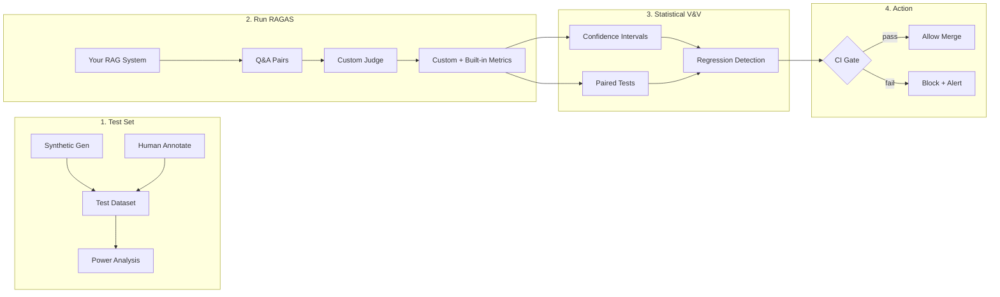

# 🧪 Welcome to RAG Evaluation Deep Dive

You know how to run RAGAS. You know the four metrics — faithfulness, answer relevancy, context precision, context recall. You have a `datasets.Dataset` with 100 hand-curated test cases and a `evaluate(...)` call that returns a CSV. That's the v1 of RAG evaluation, and it's enough to get a number on your README. It's not enough to ship a production system you can defend.

The gap between "I ran RAGAS" and "I trust my numbers" is real, well-documented, and full of pitfalls that look harmless until they bite. **A 92% faithfulness score can be a worthless number** if the judge model is biased toward longer answers, if your test set has only 30 samples, if the "improvement" you celebrated was inside the confidence interval, if your "ground truth" was itself generated by the same judge, or if positions of passages in the context window are systematically favoring pass@k=1. **Production RAG evaluation** is statistical, bias-aware, statistically significant, continuously running, and cost-aware. This course teaches that.

This is the **operational depth** that the existing [[../../../06 - Large Language Models/12 - Production RAG/05 - RAG Evaluation - RAGAS, DeepEval and Production Metrics.md|Production RAG / 05]] and [[../13 - vLLM and Advanced RAG/05 - RAG Evaluation with RAGAS and DeepEval.md|vLLM / 05]] notes only sketch. It assumes you already know the four RAGAS metrics and want to build the eval harness your AI engineering team can defend in a Monday incident review.

## 🎯 Learning Objectives

- Construct **test sets** that are large enough for statistical significance and trustworthy enough to defend (synthetic, human-annotated, hybrid).
- Implement **custom RAGAS metrics** with the `Metric` Protocol — including domain-specific faithfulness criteria.
- Apply **statistical rigor**: confidence intervals, paired tests, sample-size calculation, McNemar's test for binary comparisons.
- Detect and mitigate **LLM-as-Judge bias**: position bias, verbosity bias, self-preference bias, anchor bias.
- Wire RAGAS into **CI/CD** with regression detection, evaluation gates, and cost-aware sampling.
- Optimize **eval cost** through judge-model selection, stratification, and cached embeddings.
- Build a **production RAG eval harness** end-to-end for your portfolio project (capstone).

## Course Map

| # | Note | Core concept | Closes gap |
|:-:|------|--------------|------------|
| 00 | [[00 - Welcome to RAG Evaluation Deep Dive\|You are here]] | Why "I ran RAGAS" is not enough | Course map |
| 01 | [[01 - Test Dataset Construction\|Test Sets]] | Synthetic generation, human annotation, hybrid, sample size | Gap #1 |
| 02 | [[02 - Custom Metrics with RAGAS Protocol\|Custom Metrics]] | `Metric`, `SingleTurnSample`, prompt engineering the judge | Gap #2 |
| 03 | [[03 - Statistical Rigor\|Statistical Rigor]] | CI, paired t-tests, McNemar, sample size | Gap #3 |
| 04 | [[04 - LLM-as-Judge Bias\|Judge Bias]] | Position / verbosity / self-preference / anchor | Gap #4 |
| 05 | [[05 - CI-CD Eval Pipelines\|CI/CD Eval]] | GitHub Actions gates, regression detection, dashboards | Gap #5 |
| 06 | [[06 - Cost-Optimized Evaluation\|Cost Optimization]] | Judge model selection, sampling, cached eval | Gap #7 |
| 07 | [[07 - Capstone - Production RAG Eval Harness\|Capstone]] | Full eval harness for the Production RAG project | Integration |

## Why This Course Exists

Three audit findings from the vault:

1. **2 RAGAS notes exist ([[../../../06 - Large Language Models/12 - Production RAG/05 - RAG Evaluation - RAGAS, DeepEval and Production Metrics.md|06/12/05]] and [[../13 - vLLM and Advanced RAG/05 - RAG Evaluation with RAGAS and DeepEval.md|06/13/05]]) but both stop at `evaluate(...)`.** None teach how to size the test set, how to defend the judge's verdict, how to detect bias, or how to wire eval into CI.
2. **The portfolio project ([[../../../projects/04 - Production RAG System - Project Guide.md|projects/04]]) has Step 5 "Evaluate with RAGAS"** but runs 20 questions hand-crafted. The gap from 20 to 200 (or 2,000) is the gap between "demo" and "evidenced".
3. **The reuse pattern is missing.** The same RAGAS run is plausible for 5 different projects (StayBot, LLM Gateway, Automated LLM Evaluation Suite, Multi-Agent Research System, Production RAG). Each project reinvents the harness. This course builds one harness and shows how to apply it to all five.

## The Production RAG Eval Pipeline (The Big Picture)



The four phases map to notes 01, 02-04, 03 + 04, and 05-06 respectively. The capstone (note 07) is the complete pipeline applied to your portfolio project.

## Prerequisites

- **Python 3.11+**, `pip install ragas datasets langchain-openai pandas`.
- **RAGAS basics**: [[../../../06 - Large Language Models/12 - Production RAG/05 - RAG Evaluation - RAGAS, DeepEval and Production Metrics.md|Production RAG / 05]] for the 4-metric intro.
- **Pydantic Deep Dive (03/06)**: notes 02-03 (validators) for custom metric input/output schemas.
- **Modern Python Typing (03/07)**: type narrowing (note 02) to validate eval samples.
- **Production RAG (06/12)** or **Advanced RAG (06/13)**: a RAG system to evaluate. Capstone assumes your [[../../../projects/04 - Production RAG System - Project Guide.md|Production RAG project]] as the target.

## How to Read This Course

1. **Note 01** is the foundation: you cannot evaluate without a trustworthy test set.
2. **Notes 02-03** build the eval infrastructure (custom metrics + statistical rigor).
3. **Note 04** is the underestimated trap — judge bias can invalidate every number.
4. **Notes 05-06** are the operations: CI gates and cost control.
5. **Note 07** is the integration test.

## 📦 Compression Code

```python
# 📦 Welcome - The eval pipeline in 30 lines
from ragas import evaluate, EvaluationDataset, SingleTurnSample
from ragas.metrics import faithfulness, answer_relevancy, context_precision
from ragas.run_config import RunConfig
from datasets import Dataset
import numpy as np

# 1. Test set (note 01)
test_set = [
    SingleTurnSample(
        user_input="What is the SLA for premium customers?",
        response="Premium customers have a 99.9% uptime SLA with <100ms p95 latency.",
        retrieved_contexts=[
            "SLA tiers: Basic 99.5%, Standard 99.9%, Premium 99.99%.",
            "Premium latency: P95 <100ms for all API endpoints.",
        ],
        reference="Premium customers have a 99.9% uptime SLA with <100ms p95 latency.",
    )
    # ... 199 more samples (note 03 statistical power)
]

# 2. Run RAGAS (notes 02-04)
dataset = EvaluationDataset.from_list(test_set)
results = evaluate(
    dataset,
    metrics=[faithfulness, answer_relevancy, context_precision],
    run_config=RunConfig(max_workers=4, timeout=60),
)

# 3. Statistical rigor (note 03)
def ci95(scores: list[float]) -> tuple[float, float]:
    n = len(scores)
    mean = np.mean(scores)
    se = np.std(scores, ddof=1) / np.sqrt(n)
    return mean - 1.96 * se, mean + 1.96 * se

faith = [float(s) for s in results["faithfulness"]]
print(f"Faithfulness: {np.mean(faith):.3f} (95% CI: {ci95(faith)})")
# Faithfulness: 0.872 (95% CI: (0.84, 0.91))  → n=200, ±0.03
```

If this 30-line file tells you what to do next, you are ready to start with note 01. If not, the note covers it in depth.

## References

- [[../../../06 - Large Language Models/12 - Production RAG/05 - RAG Evaluation - RAGAS, DeepEval and Production Metrics.md|Production RAG / 05]] — the 4-metric intro this course builds on.
- [[../13 - vLLM and Advanced RAG/05 - RAG Evaluation with RAGAS and DeepEval.md|vLLM / 05]] — the 2,000-line deep dive on the same surface.
- [[../../../03 - Advanced Python/06 - Pydantic Deep Dive/00 - Welcome to Pydantic Deep Dive.md|Pydantic Deep Dive]] — for custom metric schemas.
- [[../../../03 - Advanced Python/07 - Modern Python Typing/02 - Type Narrowing|TypeGuard narrowing]] — for validating eval samples.
- [[../../../projects/04 - Production RAG System - Project Guide.md|Production RAG project]] — the capstone target.
- Es, S., et al. (2023). "RAGAS: Automated Evaluation of Retrieval Augmented Generation." *arXiv:2309.15217*.
- Zheng, L., et al. (2023). "Judging LLM-as-a-Judge with MT-Bench and Chatbot Arena." *NeurIPS 2023*.