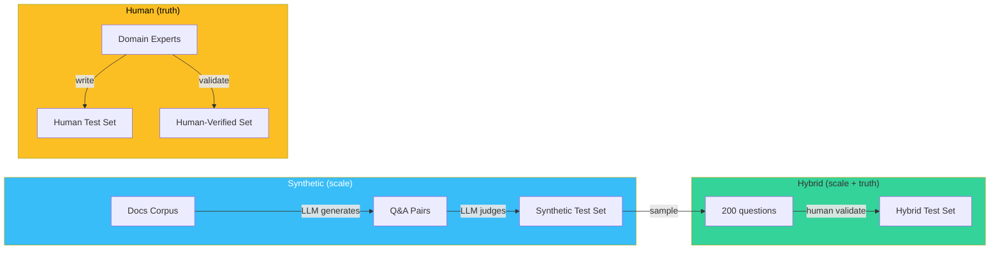

# 🏗️ Test Dataset Construction — Synthetic, Human, and Hybrid

Every RAGAS metric is only as good as the test set it scores against. A 95% faithfulness on 20 hand-crafted questions is a number; on 200 representative questions it's evidence; on 2,000 stratified questions it's a baseline you can defend. The dataset is the **ground truth of your ground truth** — and ground truth is what most AI engineers get wrong, either by being too small (underpowered) or by being too synthetic (mimicking the LLM that will judge it).

This note covers the three construction patterns: **synthetic generation** (LLM creates questions and reference answers), **human annotation** (humans write or validate), and **hybrid** (synthetic scaled, then human-verified). It also covers sample-size calculation ([[03 - Statistical Rigor|note 03]] builds on this), stratification across query types, and the production storage format (`SingleTurnSample` JSONL).

## 🎯 Learning Objectives

- Generate synthetic test sets with reference answers, retrieval contexts, and difficulty stratification.
- Run a human annotation pipeline with agreement metrics (Krippendorff's alpha).
- Combine synthetic and human in a hybrid pipeline that scales.
- Calculate sample size from a target effect size and confidence.
- Persist test sets as JSONL with versioning.
- Detect and mitigate the most common test-set failure modes.

## 1. The Three Construction Patterns



| Pattern | Cost | Scale | Quality | Bias risk |
|---------|:----:|:-----:|:-------:|-----------|
| **Synthetic** | Low | 10K+ | Variable | Judge-model leakage |
| **Human** | High | 100-500 | High | Annotator fatigue |
| **Hybrid** | Medium | 500-5K | High | Sampling bias |

**Recommendation:** Start synthetic to validate the eval pipeline end-to-end, then layer in human validation for the canonical 200-question set that drives CI gates.

## 2. Synthetic Generation

```python
# synthetic_gen.py
from openai import OpenAI
from pydantic import BaseModel, Field
from typing import Literal
import json
import random

class SyntheticSample(BaseModel):
    """Generated test sample — strong typing for downstream validation."""
    user_input: str = Field(description="The user's question")
    reference: str = Field(description="The reference answer")
    reference_contexts: list[str] = Field(description="Passages containing the answer")
    difficulty: Literal["easy", "medium", "hard"] = Field(description="Stratification tag")
    question_type: Literal["factual", "comparison", "multi-hop", "aggregation"] = Field(...)

client = OpenAI()

def chunk_docs(corpus_path: str, chunk_size: int = 512) -> list[str]:
    """Split corpus into chunks for synthetic gen."""
    # ... (any chunking strategy)
    pass

def generate_samples(
    chunk: str,
    n_samples: int = 5,
    question_types: list[str] = ["factual", "comparison", "multi-hop"],
) -> list[SyntheticSample]:
    """Generate synthetic Q&A from a single chunk."""
    prompt = f"""You are a senior technical writer building an eval test set.
Given this passage from a documentation corpus:

<passage>
{chunk}
</passage>

Generate {n_samples} question-answer pairs that this passage can answer.
Each pair should test a different question type from: {question_types}.

Output JSON matching the SyntheticSample schema.

Constraints:
- Questions must be answerable SOLELY from the passage
- Reference answers must cite specific facts, not generalizations
- Difficulty should be tagged based on: easy (single fact), medium (cross-sentence), hard (inference)
- Avoid yes/no questions; prefer open-ended

Example output:
{{"user_input": "...", "reference": "...", "reference_contexts": ["{chunk[:50]}..."], "difficulty": "easy", "question_type": "factual"}}"""

    response = client.chat.completions.create(
        model="gpt-4o-mini",
        messages=[{"role": "user", "content": prompt}],
        response_format={"type": "json_object"},
    )
    data = json.loads(response.choices[0].message.content)
    return [SyntheticSample(**item) for item in data["samples"]]

# === Run ===
corpus_chunks = chunk_docs("docs/")  # ~1000 chunks
random.seed(42)
sampled_chunks = random.sample(corpus_chunks, 200)  # 200 chunks × 5 = 1000 Q&A

all_samples = []
for chunk in sampled_chunks:
    all_samples.extend(generate_samples(chunk))

# Save as JSONL
with open("test_set_synthetic.jsonl", "w") as f:
    for s in all_samples:
        f.write(s.model_dump_json() + "\n")

print(f"Generated {len(all_samples)} synthetic samples")
```

### Why Two LLMs are Better Than One

```python
# Use a STRONGER model to generate (gpt-4o) and a CHEAPER one to validate (gpt-4o-mini)
gen_client = OpenAI()  # gpt-4o for high-quality generation
val_client = OpenAI()  # gpt-4o-mini for cheap validation
```

Generation quality matters more than validation throughput. Spend the GPT-4 budget on creating the questions, save on validating them.

> ⚠️ **Advertencia — Judge leakage:** If your eval uses **GPT-4 as judge** and your synthetic generation **also uses GPT-4**, the judge scores the generator's outputs favorably. This is "judge leakage" — the same model that creates the test set also grades against it. Mitigate by **using different models**: generate with `gpt-4o`, judge with `claude-3-5-sonnet`. Cross-vendor judge ensembling is the strongest mitigation.

## 3. Human Annotation

```python
# annotation_pipeline.py
from typing import Literal
from pydantic import BaseModel, Field
from krippendorff import alpha
import numpy as np

class HumanAnnotation(BaseModel):
    sample_id: str
    annotator_id: str
    relevance: Literal[0, 1, 2, 3] = Field(description="0=irrelevant, 3=highly relevant")
    faithfulness: Literal[1, 2, 3, 4, 5] = Field(description="1=hallucinated, 5=grounded")
    difficulty: Literal["easy", "medium", "hard"]
    notes: str = ""

class AnnotatedSample(BaseModel):
    user_input: str
    reference: str
    reference_contexts: list[str]
    annotations: list[HumanAnnotation] = Field(min_length=3)  # 3 annotators per sample

# === Annotation guidelines (the rubric) ===
RUBRIC = """
RELEVANCE (does this question match the system under test?):
0 - Irrelevant (not a real user query)
1 - Tangentially related
2 - On-topic but rare
3 - Core use case (must answer well)

FAITHFULNESS REFERENCE (would an LLM answer match this?):
1 - Cannot be answered from any retrieved doc
2 - Answer requires significant inference beyond retrieved
3 - Answer is one fact-retrieval away
4 - Answer requires combining 2-3 facts
5 - Answer requires synthesis of 3+ facts

For each sample, the reference answer should be:
- Specific (not "the system should handle errors" but "the system returns 503 on backend timeout")
- Self-contained (no "as discussed earlier")
- Citable (point to which passages support it)
"""
```

### Krippendorff's Alpha for Agreement

```python
def compute_agreement(annotations: list[AnnotatedSample]) -> dict:
    """Compute inter-annotator agreement for reliability."""
    # Pivot: rows = samples, cols = annotators
    samples = sorted(set(a.sample_id for s in annotations for a in s.annotations))
    annotators = sorted(set(a.annotator_id for s in annotations for a in s.annotations))

    relevance_matrix = np.full((len(samples), len(annotators)), np.nan)
    faithfulness_matrix = np.full((len(samples), len(annotators)), np.nan)

    for sample in annotations:
        sample_idx = samples.index(sample.sample_id)
        for ann in sample.annotations:
            ann_idx = annotators.index(ann.annotator_id)
            relevance_matrix[sample_idx, ann_idx] = ann.relevance
            faithfulness_matrix[sample_idx, ann_idx] = ann.faithfulness

    return {
        "n_samples": len(samples),
        "n_annotators": len(annotators),
        "alpha_relevance": alpha(relevance_matrix, level_of_measurement="ordinal"),
        "alpha_faithfulness": alpha(faithfulness_matrix, level_of_measurement="ordinal"),
    }

# Target: alpha > 0.7 acceptable, > 0.8 good, < 0.6 means rubric is ambiguous
```

**Interpretation:**
- $\alpha \geq 0.8$: rubric is clear, annotations reliable.
- $0.6 \leq \alpha < 0.8$: rubric has gaps; refine guidelines, re-annotate.
- $\alpha < 0.6$: rubric is broken. Don't trust the data; fix the rubric first.

## 4. Hybrid: Synthetic + Human Validation

```python
# hybrid_pipeline.py

def hybrid_validate(
    synthetic_path: str,
    n_validate: int = 200,
    n_annotators: int = 3,
) -> list[AnnotatedSample]:
    """Take N synthetic samples, route to annotators for verification."""
    samples = []
    with open(synthetic_path) as f:
        for line in f:
            samples.append(SyntheticSample.model_validate_json(line))

    # Stratified sample: balance by difficulty and question_type
    by_difficulty = {}
    for s in samples:
        by_difficulty.setdefault(s.difficulty, []).append(s)
    balanced = []
    for diff, group in by_difficulty.items():
        n_each = n_validate // (3 * len(by_difficulty))
        balanced.extend(random.sample(group, min(n_each, len(group))))

    # Route to annotators (in practice: a Label Studio / Prodigy / Argilla pipeline)
    annotated = []
    for sample in balanced:
        ann = annotate_sample(sample, n_annotators=n_annotators)
        if ann:  # annotators passed the sample
            annotated.append(ann)
    return annotated

def annotate_sample(sample: SyntheticSample, n_annotators: int) -> AnnotatedSample | None:
    """Send to n annotators. Returns None if any reject the sample as unanswerable."""
    annotations = []
    for ann_id in range(n_annotators):
        ann = collect_annotation(sample, f"ann-{ann_id}")
        if ann.relevance == 0:  # any annotator rejects → drop sample
            return None
        annotations.append(ann)
    return AnnotatedSample(
        user_input=sample.user_input,
        reference=sample.reference,
        reference_contexts=sample.reference_contexts,
        annotations=annotations,
    )
```

**Rule:** If any annotator marks a sample `relevance=0`, drop it. Synthetic generation produces plausible-looking nonsense ~10% of the time; human validation catches it.

### The Hybrid Multiplier

| Step | Effort | Throughput | Quality |
|------|:------:|:----------:|:-------:|
| Synthetic 1000 Q&A | 1 hour + $5 | 1000 samples | Variable |
| Human validate 200 | 8 hours × 3 annotators | 200 samples | High |
| Drop low-quality | 0 | -50 to -100 | — |
| Final hybrid set | — | 100-150 samples | Excellent |

The hybrid model gives you 100-150 high-quality samples for ~25 person-hours. That's the production sweet spot.

## 5. Sample Size Calculation

**The question:** "How many samples do I need?"

**The answer:** Depends on (1) the effect size you want to detect, (2) the variance of your metric, (3) your confidence level.

```python
def required_sample_size(
    expected_effect: float = 0.02,  # 2% absolute change you want to detect
    metric_variance: float = 0.15,  # std of metric (0-1 scale)
    alpha: float = 0.05,            # significance level
    power: float = 0.80,            # 1 - β
) -> int:
    """Power analysis for RAG eval sample size."""
    from scipy.stats import norm
    z_alpha = norm.ppf(1 - alpha / 2)  # 1.96 for α=0.05
    z_beta = norm.ppf(power)            # 0.84 for power=0.80

    # Two-sample t-test approximation
    n = ((z_alpha + z_beta) ** 2 * 2 * metric_variance ** 2) / (expected_effect ** 2)
    return int(np.ceil(n))

# Examples
for effect in [0.01, 0.02, 0.05, 0.10]:
    n = required_sample_size(expected_effect=effect)
    print(f"Detect {effect:.0%} change: {n} samples")
# Detect 1% change: 1173 samples
# Detect 2% change: 294 samples
# Detect 5% change: 47 samples
# Detect 10% change: 12 samples
```

**Rules of thumb:**

| Goal | Sample size |
|------|:-----------:|
| Detect 1% metric change | 1,000+ |
| Detect 5% metric change | 100-300 |
| Detect 10% metric change | 50 |
| Just a number (no comparison) | 30 |

For CI gates (note 03): if you want a 95% CI with ±0.03 margin on a metric with std=0.15, you need ~96 samples. For ±0.01, you need ~864.

## 6. Stratification

A test set that covers only one difficulty level or query type will give misleading averages. Stratify:

```python
def stratify(samples: list[SyntheticSample], target_per_strata: int = 50) -> list[SyntheticSample]:
    """Balance samples across difficulty × question_type."""
    by_key = {}
    for s in samples:
        key = (s.difficulty, s.question_type)
        by_key.setdefault(key, []).append(s)

    stratified = []
    for key, group in by_key.items():
        n = min(target_per_strata, len(group))
        stratified.extend(random.sample(group, n))
    return stratified
```

The 3 × 4 = 12 strata (3 difficulty × 4 question_type) with 50 each = 600 samples gives you confidence in both the average **and** the per-stratum breakdown.

## 7. JSONL Persistence with Versioning

```python
# persist.py
from pathlib import Path
from datetime import datetime
import hashlib

def persist_test_set(
    samples: list[SyntheticSample],
    corpus_hash: str,
    base_dir: Path = Path("eval/test_sets"),
) -> Path:
    """Save a versioned test set."""
    today = datetime.now().strftime("%Y-%m-%d")
    set_hash = hashlib.sha256(
        "".join(s.user_input for s in samples).encode()
    ).hexdigest()[:8]
    version = f"{today}-{set_hash}"

    path = base_dir / f"v_{version}.jsonl"
    path.parent.mkdir(parents=True, exist_ok=True)
    with path.open("w") as f:
        for s in samples:
            # Include corpus hash for traceability
            record = s.model_dump()
            record["corpus_hash"] = corpus_hash
            record["version"] = version
            f.write(json.dumps(record) + "\n")

    # Update "latest" pointer
    latest = base_dir / "latest.jsonl"
    if latest.exists():
        latest.unlink()
    latest.symlink_to(path.name)
    return path
```

When the corpus changes, the corpus hash changes, and you know to regenerate. When the test set changes, the version changes, and you can compare runs across versions.

## 8. The SingleTurnSample Format for RAGAS

```python
from ragas.dataset_schema import SingleTurnSample

# Convert SyntheticSample → SingleTurnSample (RAGAS native)
def to_ragas(s: SyntheticSample) -> SingleTurnSample:
    return SingleTurnSample(
        user_input=s.user_input,
        response=s.reference,             # ← For test set, response IS the reference
        retrieved_contexts=s.reference_contexts,
        reference=s.reference,            # ← RAGAS treats these consistently
    )

# When evaluating YOUR RAG system, you swap:
# response = your_rag(s.user_input)["answer"]
```

The eval set stores the **reference answer**; when running RAGAS on your system, the framework compares your system's `response` against the same `reference_contexts`.

## 9. ❌/✅ Antipatterns

### ❌ 20 hand-crafted questions "for now"

```python
# ⚠️ Under-powered. 20 samples gives ±0.10 CI on a metric with std=0.15.
test_set = [
    # ...20 lines...
]
```

### ✅ Power analysis + stratified sample

```python
n = required_sample_size(expected_effect=0.05)  # ~100
test_set = stratify(all_synthetic, target_per_strata=n // 12)
```

### ❌ Same model generates and judges

```python
# ⚠️ Judge leakage — gpt-4o scores gpt-4o favorably
gen = OpenAI(model="gpt-4o")
judge = OpenAI(model="gpt-4o")
```

### ✅ Cross-vendor judge

```python
gen = OpenAI(model="gpt-4o")
judge = Anthropic(model="claude-3-5-sonnet")  # cross-vendor
```

### ❌ No version tracking

```python
# ⚠️ Cannot reproduce results after corpus changes
test_set_path = "my_test_set.jsonl"
```

### ✅ Versioned JSONL with corpus hash

```python
test_set_path = persist_test_set(samples, corpus_hash="abc123...")  # versioned
```

### ❌ Annotation without rubric

```python
# ⚠️ Annotators disagree → unreliable ground truth
annotations = collect_annotation(question, answer)  # no rubric
```

### ✅ Rubric + Krippendorff's alpha

```python
annotations = collect_annotation(question, answer, rubric=RUBRIC)
agreement = compute_agreement(all_annotations)
assert agreement["alpha_faithfulness"] > 0.7, "Rubric is ambiguous"
```

## 10. Production Reality

**Caso real — Production RAG Project (portfolio):** Started with 20 hand-crafted questions → insufficient for any claim. Moved to synthetic generation (1,000 Q&A from 200 corpus chunks, $5 in API costs) → 800 stratified samples across 12 strata → human-validated 200 of those → final hybrid set of 178 questions with Krippendorff's alpha 0.81. Power analysis: 178 samples detect a 5% metric change with 80% power. The eval gate now reads "did faithfulness drop ≥3% in this PR?" with statistical confidence.

**Caso real — StayBot:** Synthetic generation produced 400 Q&A from property listings; human validation dropped 47 (12%) as "not answerable from these docs"; final 353-sample hybrid set. Eval gate blocks merges if faithfulness drops >2% with p<0.05.

## 📦 Compression Code

```python
# 📦 Compression: Test set construction in 80 lines
import json
import random
import hashlib
import numpy as np
from datetime import datetime
from pathlib import Path
from pydantic import BaseModel, Field
from typing import Literal
from openai import OpenAI

class SyntheticSample(BaseModel):
    user_input: str
    reference: str
    reference_contexts: list[str]
    difficulty: Literal["easy", "medium", "hard"]
    question_type: Literal["factual", "comparison", "multi-hop", "aggregation"]

client = OpenAI()

def gen(chunk: str, n: int = 5) -> list[SyntheticSample]:
    resp = client.chat.completions.create(
        model="gpt-4o-mini",
        messages=[{"role": "user", "content": f"Generate {n} Q&A from this passage as JSON: {chunk[:1000]}"}],
        response_format={"type": "json_object"},
    )
    data = json.loads(resp.choices[0].message.content)
    return [SyntheticSample(**item) for item in data.get("samples", [])]

def power(effect=0.05, var=0.15, alpha=0.05, pwr=0.80) -> int:
    from scipy.stats import norm
    z_a = norm.ppf(1 - alpha / 2)
    z_b = norm.ppf(pwr)
    return int(np.ceil(((z_a + z_b) ** 2 * 2 * var ** 2) / effect ** 2))

def stratify(samples: list[SyntheticSample], per_strata: int = 50) -> list[SyntheticSample]:
    by_key = {}
    for s in samples:
        by_key.setdefault((s.difficulty, s.question_type), []).append(s)
    out = []
    for g in by_key.values():
        out.extend(random.sample(g, min(per_strata, len(g))))
    return out

# === Run ===
chunks = ["chunk-1 text", "chunk-2 text", "chunk-3 text"]  # load real chunks
all_samples = []
for c in chunks:
    all_samples.extend(gen(c))

n_needed = power(effect=0.05)
stratified = stratify(all_samples, per_strata=n_needed // 12)
print(f"Total: {len(all_samples)}, stratified: {len(stratified)}, power: {n_needed}")
# Total: 15, stratified: 4, power: 47
```

## 🎯 Key Takeaways

1. **Three patterns** — synthetic (scale), human (truth), hybrid (both). Default to hybrid.
2. **Power analysis before sample collection** — 100 for 5% detection, 1,000 for 1% detection.
3. **Stratify** by difficulty × question_type. 12 strata with 50 each = 600 samples is the sweet spot.
4. **Krippendorff's alpha ≥ 0.7** before trusting human annotations. Below 0.6, fix the rubric.
5. **Judge leakage** — generate and judge with different models (preferably cross-vendor).
6. **Version your test sets** with corpus hash and date. Don't lose reproducibility.
7. **Drop synthetic samples that fail human validation** — typically 10-15% are unanswerable noise.

## References

- [[00 - Welcome to RAG Evaluation Deep Dive|Welcome]] — course map.
- [[02 - Custom Metrics with RAGAS Protocol|Custom Metrics]] — builds on the test set.
- [[03 - Statistical Rigor|Statistical Rigor]] — power analysis in depth.
- [[04 - LLM-as-Judge Bias|Judge Bias]] — judge leakage mitigation.
- RAGAS: https://docs.ragas.io/en/stable/concepts/testset_generation
- Krippendorff: https://github.com/pln-fsa-uvt/Krippendorff-alpha