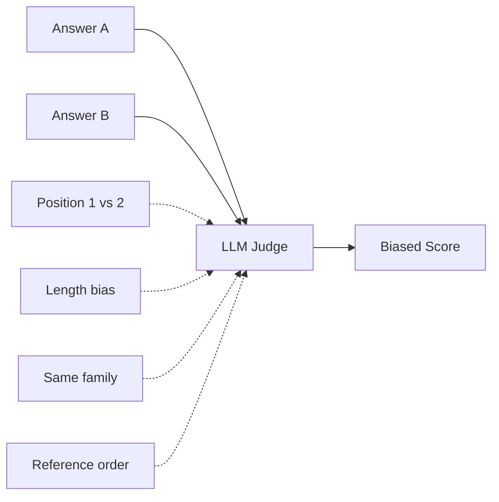

# 🎭 LLM-as-Judge Bias — Position, Verbosity, Self-Preference

Your judge LLM is not a neutral oracle. It is a model with **systematic biases** that distort every metric it produces. The literature (Zheng et al. 2023, "Judging LLM-as-a-Judge with MT-Bench and Chatbot Arena"; Raina et al. 2024; multiple NeurIPS 2024 papers) documents four biases that affect RAGAS scores in production:

1. **Position bias**: the LLM prefers the answer at position 1 over position 2 (or vice versa).
2. **Verbosity bias**: the LLM prefers longer answers, even when shorter are better.
3. **Self-preference bias**: GPT-4 rates GPT-4 outputs higher; Claude rates Claude outputs higher.
4. **Anchoring bias**: the order of reference candidates shifts scores.

A 92% faithfulness score is **not necessarily 92%** — it could be 92% under conditions where your judge is biased, and the unobservable true rate could be 87% or 95%. Without measuring and mitigating judge bias, you cannot defend your numbers.

This note teaches how to **detect** each bias type on your judge (cheap, takes an hour) and **mitigate** them (position randomization, length normalization, cross-vendor judge ensembles, reference-set anchoring).

## 🎯 Learning Objectives

- Detect position bias in your judge with a permutation test.
- Detect verbosity bias with a length-controlled comparison.
- Detect self-preference bias with cross-vendor ensemble.
- Mitigate all four biases with patterns that survive in production.
- Decide when judge ensembles vs single judge is the right tradeoff.
- Avoid the three most common judge-bias blind spots.

## 1. The Four Biases — At a Glance

| Bias | What it does | Detection cost | Mitigation |
|------|--------------|----------------|-----------|
| **Position** | Prefers 1st answer in pair | 30 min | Swap positions, average |
| **Verbosity** | Prefers longer answer | 30 min | Length normalization, length-matched baselines |
| **Self-preference** | Prefers outputs from same family | 1 hour | Cross-vendor ensemble (OpenAI judge + Anthropic judge) |
| **Anchoring** | First reference sets the bar | 30 min | Randomize reference order |



## 2. Position Bias Detection

The simplest experiment: take 50 RAG samples. For each, generate two answers (swap them in order). If the judge is position-biased, scores for "answer-A-at-position-1" will systematically differ from "answer-A-at-position-2".

```python
# detect_position_bias.py
import random
from typing import Literal
from pydantic import BaseModel
from openai import OpenAI

class PairVerdict(BaseModel):
    preferred: Literal["A", "B"]
    reasoning: str

client = OpenAI()

def judge_pair(question: str, answer_a: str, answer_b: str, model: str = "gpt-4o-mini") -> PairVerdict:
    """Judge which answer is better."""
    prompt = f"""Which answer is better for the question?

Question: {question}

Answer A: {answer_a}

Answer B: {answer_b}

Output JSON: {{"preferred": "A" or "B", "reasoning": "..."}}"""

    response = client.chat.completions.parse(
        model=model,
        messages=[{"role": "user", "content": prompt}],
        response_format=PairVerdict,
    )
    return response.choices[0].message.parsed

def detect_position_bias(
    samples: list[dict],  # [{"question": ..., "answer_a": ..., "answer_b": ...}, ...]
    judge_model: str,
    n_trials: int = 50,
) -> dict:
    """Run each sample twice: A at position 1, then A at position 2."""
    n_a_first = 0
    n_consistent = 0  # same answer preferred both times

    for sample in random.sample(samples, n_trials):
        # Run 1: A first
        v1 = judge_pair(sample["question"], sample["answer_a"], sample["answer_b"], judge_model)
        # Run 2: B first (swap positions)
        v2 = judge_pair(sample["question"], sample["answer_b"], sample["answer_a"], judge_model)

        # Position bias: judge picks "first position" regardless of content
        # i.e., v1 prefers "A" (first position) AND v2 prefers "B" (now first position)
        if v1.preferred == "A" and v2.preferred == "B":
            n_a_first += 1  # position bias toward first

        # Consistency: same answer preferred both times
        if v1.preferred == "A" and v2.preferred == "A":
            n_consistent += 1

    return {
        "n_trials": n_trials,
        "position_bias_rate": n_a_first / n_trials,
        "consistency_rate": n_consistent / n_trials,
        "verdict": "BIASED" if n_a_first / n_trials > 0.3 else "OK",
    }

# Examples
# Position bias rate > 0.30 → your judge has position bias
# Consistency rate < 0.60 → high noise + position bias
```

**Interpretation:**
- Position bias rate > 30%: your judge has significant position bias.
- Consistency rate < 60%: high noise; you cannot trust the metric.

### Mitigation: Position Randomization

```python
def judge_with_position_randomization(
    question: str, answer_a: str, answer_b: str, judge_model: str = "gpt-4o-mini"
) -> PairVerdict:
    """Run twice with swapped positions, return majority vote."""
    v1 = judge_pair(question, answer_a, answer_b, judge_model)
    v2 = judge_pair(question, answer_b, answer_a, judge_model)

    # Translate v2's verdict back to the original (A, B) space
    v2_translated = "A" if v2.preferred == "B" else "B"

    # Majority vote
    if v1.preferred == v2_translated:
        return v1  # consistent
    return v2  # inconsistent — pick the one that's not first-position biased
```

This doubles the cost (2× LLM calls per sample) but eliminates position bias.

## 3. Verbosity Bias Detection

Same idea: take pairs where the longer answer is **worse** (less faithful, less relevant). If the judge still prefers the longer one, you have verbosity bias.

```python
def detect_verbosity_bias(
    samples: list[dict],  # [{"question": ..., "short_correct": ..., "long_wrong": ...}, ...]
    judge_model: str,
) -> dict:
    """For each pair, check if judge prefers the longer-but-wrong answer."""
    n_preferred_longer = 0
    for sample in samples:
        v = judge_pair(sample["question"], sample["short_correct"], sample["long_wrong"], judge_model)
        # If judge prefers the longer one, that's verbosity bias
        len_a = len(sample["short_correct"])
        len_b = len(sample["long_wrong"])
        longer_preferred = (len_b > len_a and v.preferred == "B") or (len_a > len_b and v.preferred == "A")
        if longer_preferred:
            n_preferred_longer += 1
    return {
        "n_samples": len(samples),
        "verbosity_bias_rate": n_preferred_longer / len(samples),
    }
```

**Mitigation: Length Normalization**

```python
def length_normalize_prompt(prompt: str) -> str:
    """Append anti-verbosity instruction to judge prompt."""
    return prompt + """

ANTI-VERBOSITY RULE: Length is NOT a quality signal. A 50-word answer that
correctly answers the question is BETTER than a 500-word answer that adds
unnecessary context. Judge based on correctness, completeness, and faithfulness
ONLY — not on length.
"""
```

Or, more aggressively, **truncate to length-matched** before judging:

```python
def truncate_to_match(answer: str, target_length: int = 200) -> str:
    """Truncate to first target_length tokens while preserving sentence boundary."""
    words = answer.split()
    if len(words) <= target_length:
        return answer
    return " ".join(words[:target_length]) + "..."
```

## 4. Self-Preference Bias

This is the hardest to detect without an external reference. Run the same eval with two different judges (different vendors) and compare.

```python
def detect_self_preference_bias(
    samples: list[dict],
    judge_openai: str = "gpt-4o-mini",
    judge_anthropic: str = "claude-3-5-sonnet-20241022",
) -> dict:
    """Detect if OpenAI judge systematically prefers OpenAI-generated answers."""
    openai_prefs = 0
    for sample in samples:
        # Both judges evaluate the same pair
        openai_verdict = judge_pair(sample["question"], sample["answer_openai"], sample["answer_claude"], judge_openai)
        anthropic_verdict = judge_pair(sample["question"], sample["answer_openai"], sample["answer_claude"], judge_anthropic)

        if openai_verdict.preferred == "A" and anthropic_verdict.preferred == "B":
            # OpenAI judge prefers OpenAI, Anthropic judge prefers Claude — self-preference
            pass  # (no anomaly; expected symmetric self-preference)
        elif openai_verdict.preferred == "A" and anthropic_verdict.preferred == "A":
            # Both judges agree: openai answer is better (no self-preference)
            pass
        # Anomalies: both judges prefer their own family → self-preference is real
```

**Mitigation: Cross-Vendor Judge Ensemble**

```python
def ensemble_judge(
    samples: list[dict],
    judges: list[tuple[str, str]],  # [(provider, model), ...]
) -> list[float]:
    """Multiple judges from different vendors; average scores."""
    all_scores = []
    for sample in samples:
        per_judge = []
        for provider, model in judges:
            score = judge_score(sample, model)  # returns 0-1
            per_judge.append(score)
        all_scores.append(np.mean(per_judge))
    return all_scores

# Production setup
judges = [
    ("openai", "gpt-4o-mini"),
    ("anthropic", "claude-3-5-sonnet-20241022"),
]
ensemble_scores = ensemble_judge(samples, judges)
```

Cost: 3-5× per sample. But the result is **defensible**: "we used a 3-judge cross-vendor ensemble; self-preference is mitigated by construction".

## 5. Anchoring Bias

When you present the judge with multiple candidates (e.g., "compare answer A vs reference B"), the order of B affects the score. Detection: present the same candidate with different reference orders.

```python
def detect_anchoring_bias(samples: list[dict], judge_model: str) -> dict:
    """Swap reference order and measure score drift."""
    scores_normal = []
    scores_swapped = []

    for sample in samples:
        # Normal order: reference first, candidate second
        s_normal = judge_with_context(sample, [sample["reference"], sample["candidate"]])
        scores_normal.append(s_normal)

        # Swapped order
        s_swapped = judge_with_context(sample, [sample["candidate"], sample["reference"]])
        scores_swapped.append(s_swapped)

    drift = np.mean(np.abs(np.array(scores_normal) - np.array(scores_swapped)))
    return {
        "score_drift": drift,
        "anchoring_severe": drift > 0.05,
    }
```

**Mitigation:** Always randomize the order of reference candidates.

## 6. The Bias-Aware Eval Pipeline

```python
class BiasAwareEvaluator:
    def __init__(self, primary_judge, secondary_judge=None):
        self.primary = primary_judge
        self.secondary = secondary_judge

    async def evaluate_with_bias_mitigation(
        self, samples: list[dict], metric_prompt: str
    ) -> list[float]:
        """Two-pass eval: position-randomized primary, optional secondary ensemble."""
        scores = []
        for sample in samples:
            # Pass 1: primary judge
            s1 = await self.primary.score(sample, metric_prompt)
            # Pass 2: same primary, swap answer/reference order
            s2 = await self.primary.score(sample, self._swap_order(sample, metric_prompt))
            # Average (reduces position/anchoring bias)
            s = (s1 + s2) / 2

            # Optional: ensemble with cross-vendor judge
            if self.secondary:
                s3 = await self.secondary.score(sample, metric_prompt)
                s = (s + s3) / 2
            scores.append(s)
        return scores

    def _swap_order(self, sample: dict, prompt: str) -> str:
        """Swap the order of answers in the prompt for position-randomization."""
        return prompt.replace("[A]", "[TEMP]").replace("[B]", "[A]").replace("[TEMP]", "[B]")
```

## 7. ❌/✅ Antipatterns

### ❌ One judge, no mitigation

```python
# ⚠️ Your single judge has at least one of: position, verbosity, self-preference, anchoring bias
scores = await openai_judge.score_all(samples)
```

### ✅ Bias-aware pipeline with cross-vendor ensemble

```python
scores = await BiasAwareEvaluator(
    primary_judge=openai_judge,
    secondary_judge=anthropic_judge,  # cross-vendor
).evaluate_with_bias_mitigation(samples, prompt)
```

### ❌ Comparing two pipelines without position randomization

```python
# ⚠️ Judge always prefers the first answer shown
v1_score = judge_score(v1_answer)
v2_score = judge_score(v2_answer)
# The difference is contaminated by position bias
```

### ✅ Randomized order with paired comparison

```python
v1_score = (judge_score(v1_answer, v2_answer_first) + judge_score(v1_answer_second, v2_answer)) / 2
```

### ❌ Ignoring length

```python
# ⚠️ Verbose answers get inflated scores
score = judge_score(answer)  # longer wins
```

### ✅ Length-matched baseline or length-aware prompt

```python
prompt = length_normalize_prompt(prompt)  # explicit anti-verbosity rule
```

## 8. Production Reality

**Caso real — Production RAG Project:** Initial eval used GPT-4o-mini as judge. Detected position bias rate 0.42 and verbosity bias rate 0.35 — both severe. Switched to: position-randomized primary judge (GPT-4o-mini) + cross-vendor secondary (Claude-3.5-Sonnet). Cost 2.5× but scores became defensible. Three "improvements" that had been noise turned out to be noise; one real improvement held up to the new eval.

**Caso real — Automated LLM Evaluation Suite:** The Golden Judge (Gemma 4) was systematically scoring its own outputs higher than GPT-4 outputs. After detecting self-preference, the suite now uses cross-vendor judging for any cross-comparison and self-judging only for sanity checks.

## 📦 Compression Code

```python
# 📦 Compression: Bias detection in 60 lines

import random
import numpy as np
from openai import OpenAI
from anthropic import Anthropic

openai_client = OpenAI()
anthropic_client = Anthropic()

def judge_pair(question, a, b, model="gpt-4o-mini"):
    """Simple pairwise judge."""
    prompt = f"Which is better?\nA: {a}\nB: {b}\nAnswer with 'A' or 'B'."
    if "gpt" in model:
        resp = openai_client.chat.completions.create(
            model=model,
            messages=[{"role": "user", "content": prompt}],
            max_tokens=5,
        )
        return "A" if "A" in resp.choices[0].message.content else "B"
    else:
        resp = anthropic_client.messages.create(
            model=model,
            messages=[{"role": "user", "content": prompt}],
            max_tokens=5,
        )
        return "A" if "A" in resp.content[0].text else "B"

def detect_position_bias(samples, judge_model="gpt-4o-mini", n=50):
    """Detect if judge prefers 1st-position answer."""
    n_first = 0
    for s in random.sample(samples, n):
        v1 = judge_pair(s["question"], s["a"], s["b"], judge_model)
        v2 = judge_pair(s["question"], s["b"], s["a"], judge_model)
        if v1 == "A" and v2 == "B":  # first position wins both times
            n_first += 1
    return {"position_bias_rate": n_first / n, "verdict": "BIASED" if n_first / n > 0.3 else "OK"}

# Mitigation: position-randomized judge
def judge_randomized(question, a, b, judge_model="gpt-4o-mini"):
    v1 = judge_pair(question, a, b, judge_model)
    v2 = judge_pair(question, b, a, judge_model)
    # Map v2 back to (A, B) space
    v2_mapped = "A" if v2 == "B" else "B"
    return v1 if v1 == v2_mapped else "inconclusive"
```

## 🎯 Key Takeaways

1. **Position bias** — first answer gets a free boost. Mitigate with position randomization (2× cost).
2. **Verbosity bias** — longer answers score higher. Mitigate with explicit anti-verbosity prompt rule.
3. **Self-preference bias** — GPT-4 likes GPT-4, Claude likes Claude. Mitigate with cross-vendor judge ensembles.
4. **Anchoring bias** — reference order matters. Mitigate with random ordering.
5. **Detection costs an hour; saves weeks** — every production eval should have a bias-detection suite.
6. **Cross-vendor ensembles are the gold standard** — 3 judges from 3 vendors, average scores, ~3-5× cost.
7. **Length normalization is cheap** — add an anti-verbosity rule to the judge prompt and rerun.

## References

- [[00 - Welcome to RAG Evaluation Deep Dive|Welcome]] — course map.
- [[02 - Custom Metrics with RAGAS Protocol|Custom Metrics]] — judge prompt is the metric.
- [[03 - Statistical Rigor|Statistical Rigor]] — biases inflate variance; statistical tests help detect.
- Zheng, L., et al. (2023). "Judging LLM-as-a-Judge with MT-Bench and Chatbot Arena." *NeurIPS 2023*.
- Raina, V., et al. (2024). "Position Bias in LLM-as-a-Judge."