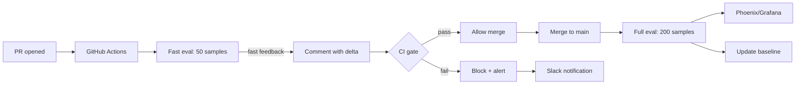

# 🔁 CI/CD Eval Pipelines — GitHub Actions Gates, Regression Detection, and Dashboards

A RAGAS run that lives in a Jupyter notebook is a one-off. A RAGAS run that runs on every PR is a **gate**. The difference is the same metric, the same test set, the same judge — but with `mean_and_ci` + paired t-test + a comparison against the baseline, plus automated alerts when the metric drifts. This note is the production deployment of everything from notes 01-04.

Three building blocks:

1. **GitHub Actions workflow** that runs RAGAS on every PR, posts a comment with metric deltas, and blocks merges on regression.
2. **Regression detection** that compares the current run to the previous baseline, with CIs and statistical tests.
3. **Dashboarding** with Phoenix ([[../../../09 - MLOps y Produccion/31 - Evidently AI and Phoenix/03 - Phoenix by Arize - LLM Observability, Traces and Embedding Drift.md|Phoenix]]) or Grafana that tracks metric trends over time and alerts on drift.

By the end you will have a CI pipeline that:
- Runs RAGAS on every PR (3-5 minutes, $2-5 per run).
- Comments the metric delta on the PR.
- Blocks the merge if a metric drops >2% with p<0.05.
- Pushes results to a dashboard for trend analysis.

## 🎯 Learning Objectives

- Build a GitHub Actions workflow that runs RAGAS on every PR.
- Implement regression detection: compare to baseline with CIs and paired tests.
- Post metric deltas as PR comments via the GitHub API.
- Set up Phoenix/Grafana dashboards for trend monitoring.
- Apply stratified sampling for fast feedback on PRs vs full eval on main.
- Detect drift in production and trigger re-evaluation.

## 1. The Eval Pipeline



Two-tier strategy:
- **PR eval (fast)**: 50 samples, runs in <5 minutes, gives fast feedback.
- **Main eval (full)**: 200 samples, runs nightly, updates the baseline and dashboard.

## 2. GitHub Actions Workflow

```yaml
# .github/workflows/ragas-eval.yml
name: RAGAS Eval

on:
  pull_request:
    paths:
      - "src/rag/**"
      - "src/prompts/**"
  push:
    branches: [main]
  workflow_dispatch:

jobs:
  fast-eval:
    runs-on: ubuntu-latest
    timeout-minutes: 15
    steps:
      - uses: actions/checkout@v4

      - uses: actions/setup-python@v5
        with:
          python-version: "3.12"

      - name: Install deps
        run: pip install -e ".[eval]"

      - name: Fetch baseline
        run: |
          # Get the baseline metrics from the main branch
          git fetch origin main
          git checkout origin/main -- eval/baseline.json || echo '{}' > eval/baseline.json

      - name: Run fast eval (50 samples)
        env:
          OPENAI_API_KEY: ${{ secrets.OPENAI_API_KEY }}
          ANTHROPIC_API_KEY: ${{ secrets.ANTHROPIC_API_KEY }}
        run: |
          python -m eval.run \
            --test-set eval/test_sets/latest.jsonl \
            --sample-size 50 \
            --output eval_report_pr.json \
            --baseline eval/baseline.json

      - name: Comment on PR
        if: github.event_name == 'pull_request'
        uses: actions/github-script@v7
        with:
          script: |
            const fs = require('fs');
            const report = JSON.parse(fs.readFileSync('eval_report_pr.json', 'utf8'));
            const decision = report.decision;
            const emoji = decision.startsWith('✅') ? '✅' : '❌';

            const body = `## ${emoji} RAGAS Eval Report

            ${decision}

            | Metric | Baseline | PR | Δ | CI | Significant? |
            |--------|----------|----|----|----|--------------|
            ${Object.entries(report.metrics).map(([name, m]) =>
              `| ${name} | ${m.baseline_mean.toFixed(3)} | ${m.pr_mean.toFixed(3)} | ${m.delta >= 0 ? '+' : ''}${m.delta.toFixed(3)} | (${m.pr_ci[0].toFixed(3)}, ${m.pr_ci[1].toFixed(3)}) | ${m.significant ? 'Yes (p<0.05)' : 'No'} |`
            ).join('\n')}

            _Test set: ${report.test_set_version}, n=${report.sample_size}_`;

            github.rest.issues.createComment({
              owner: context.repo.owner,
              repo: context.repo.repo,
              issue_number: context.issue.number,
              body
            });

      - name: CI gate
        run: |
          python -m eval.gate eval_report_pr.json \
            --min-improvement 0.02 \
            --alpha 0.05 \
            --fail-on-regression
```

## 3. The Eval Runner

```python
# eval/run.py
import json
import argparse
import numpy as np
from pathlib import Path
from datetime import datetime
from ragas import evaluate, EvaluationDataset
from ragas.metrics import faithfulness, answer_relevancy, context_precision
from ragas.run_config import RunConfig

from eval.metrics import (
    CitationAccuracy,
    DomainFaithfulness,
)
from eval.bias_aware_judge import BiasAwareJudge
from eval.statistics import paired_t_test, mean_and_ci

def load_test_set(path: str, n: int | None = None, seed: int = 42) -> EvaluationDataset:
    """Load and subsample the test set."""
    with open(path) as f:
        samples = [json.loads(line) for line in f]
    if n is not None and n < len(samples):
        rng = np.random.default_rng(seed)
        idx = rng.choice(len(samples), size=n, replace=False)
        samples = [samples[i] for i in sorted(idx)]
    return EvaluationDataset.from_list([
        # Convert JSON dicts to SingleTurnSample
        ...
    ])

def run_rag(rag_pipeline, test_samples):
    """Run the RAG system on each test sample to produce answers."""
    answers = []
    contexts_list = []
    for sample in test_samples:
        result = rag_pipeline(sample.user_input)
        answers.append(result["answer"])
        contexts_list.append(result["contexts"])
    return answers, contexts_list

def run_eval(
    rag_pipeline,
    test_set_path: str,
    output_path: str,
    baseline_path: str | None = None,
    n: int | None = None,
) -> dict:
    """Full evaluation pipeline with bias mitigation and statistical rigor."""
    print(f"[{datetime.now()}] Loading test set: {test_set_path}")
    samples = load_test_set(test_set_path, n=n)
    print(f"[{datetime.now()}] Loaded {len(samples)} samples")

    print(f"[{datetime.now()}] Running RAG pipeline...")
    answers, contexts_list = run_rag(rag_pipeline, samples)

    # Bias-aware judge
    judge = BiasAwareJudge(
        primary_model="gpt-4o-mini",
        secondary_model="claude-3-5-sonnet",
    )

    # Build dataset for RAGAS
    eval_samples = [
        SingleTurnSample(
            user_input=s.user_input,
            response=a,
            retrieved_contexts=c,
            reference=s.reference,
        )
        for s, a, c in zip(samples, answers, contexts_list)
    ]
    dataset = EvaluationDataset.from_list(eval_samples)

    # Run RAGAS with custom + built-in metrics
    metrics = [
        faithfulness, answer_relevancy, context_precision,
        CitationAccuracy(judge),
        DomainFaithfulness(judge, forbidden_topics=["competitor-brand"]),
    ]

    print(f"[{datetime.now()}] Running RAGAS eval...")
    results = evaluate(
        dataset,
        metrics=metrics,
        run_config=RunConfig(max_workers=4, timeout=120),
    )

    # Aggregate
    report = {
        "test_set_version": Path(test_set_path).stem,
        "sample_size": len(samples),
        "timestamp": datetime.now().isoformat(),
        "metrics": {},
    }

    for metric_name in ["faithfulness", "answer_relevancy", "context_precision", "citation_accuracy", "domain_faithfulness"]:
        scores = [float(s) for s in results[metric_name] if s is not None]
        if scores:
            mean, lo, hi = mean_and_ci(scores)
            report["metrics"][metric_name] = {
                "pr_mean": mean,
                "pr_ci": (lo, hi),
            }

    # Compare to baseline
    if baseline_path and Path(baseline_path).exists():
        baseline = json.load(open(baseline_path))
        decision_lines = []
        for metric_name, m in report["metrics"].items():
            baseline_mean = baseline.get("metrics", {}).get(metric_name, {}).get("mean", 0.0)
            baseline_scores = baseline.get("metrics", {}).get(metric_name, {}).get("scores", [])

            # Paired test (need raw scores from baseline)
            if baseline_scores and len(baseline_scores) == len(samples):
                pr_scores = m.get("pr_scores", [])
                paired = paired_t_test(baseline_scores, pr_scores)
                m["baseline_mean"] = baseline_mean
                m["delta"] = m["pr_mean"] - baseline_mean
                m["p_value"] = paired["p_value"]
                m["significant"] = paired["significant_at_0.05"]
                m["ci_diff"] = paired["ci_95"]

                if m["delta"] >= 0.02 and m["significant"] and m["ci_diff"][0] > 0:
                    decision_lines.append(f"✅ {metric_name}: +{m['delta']:.3f} (significant)")
                elif m["delta"] <= -0.02 and m["significant"]:
                    decision_lines.append(f"❌ {metric_name}: {m['delta']:.3f} (REGRESSION)")
                else:
                    decision_lines.append(f"⚠️ {metric_name}: {m['delta']:.3f} (not significant)")
            else:
                # No paired scores; just compare means
                m["baseline_mean"] = baseline_mean
                m["delta"] = m["pr_mean"] - baseline_mean
                decision_lines.append(f"⚠️ {metric_name}: {m['delta']:.3f} (no paired data)")

        if all(line.startswith("✅") for line in decision_lines):
            report["decision"] = "✅ PASS — all metrics improved significantly"
        elif any(line.startswith("❌") for line in decision_lines):
            report["decision"] = "❌ FAIL — at least one metric regressed significantly"
        else:
            report["decision"] = "⚠️ INCONCLUSIVE — no significant changes"

        report["decision_details"] = decision_lines

    Path(output_path).parent.mkdir(parents=True, exist_ok=True)
    with open(output_path, "w") as f:
        json.dump(report, f, indent=2)

    print(f"[{datetime.now()}] Report saved to {output_path}")
    return report
```

## 4. The CI Gate

```python
# eval/gate.py
import json
import sys
import argparse

def gate(
    report_path: str,
    min_improvement: float = 0.02,
    alpha: float = 0.05,
    fail_on_regression: bool = True,
) -> bool:
    """CI gate based on the report."""
    report = json.load(open(report_path))

    if "decision" not in report:
        print("No decision in report (no baseline comparison).")
        return True  # pass-through when no baseline

    if report["decision"].startswith("✅"):
        print("Decision: PASS")
        return True

    if report["decision"].startswith("❌") and fail_on_regression:
        print("Decision: FAIL (regression detected)")
        for detail in report.get("decision_details", []):
            print(f"  {detail}")
        return False

    if report["decision"].startswith("⚠️"):
        # Inconclusive — don't block, but warn
        print("Decision: INCONCLUSIVE (warnings, not blocking)")
        for detail in report.get("decision_details", []):
            print(f"  {detail}")
        return True

    return True

if __name__ == "__main__":
    parser = argparse.ArgumentParser()
    parser.add_argument("report_path")
    parser.add_argument("--min-improvement", type=float, default=0.02)
    parser.add_argument("--alpha", type=float, default=0.05)
    parser.add_argument("--fail-on-regression", action="store_true")
    args = parser.parse_args()

    if not gate(args.report_path, args.min_improvement, args.alpha, args.fail_on_regression):
        sys.exit(1)  # non-zero exit → CI blocks
```

## 5. Updating the Baseline

After the main-branch eval completes, update the baseline for the next PR comparison:

```yaml
# .github/workflows/ragas-baseline.yml
name: Update RAGAS Baseline

on:
  push:
    branches: [main]

jobs:
  update-baseline:
    runs-on: ubuntu-latest
    steps:
      - uses: actions/checkout@v4
      - uses: actions/setup-python@v5
        with:
          python-version: "3.12"

      - name: Run full eval
        env:
          OPENAI_API_KEY: ${{ secrets.OPENAI_API_KEY }}
        run: |
          python -m eval.run \
            --test-set eval/test_sets/latest.jsonl \
            --sample-size 200 \
            --output eval/baseline_new.json

      - name: Commit baseline
        run: |
          git config user.name "github-actions[bot]"
          git config user.email "github-actions[bot]@users.noreply.github.com"
          mv eval/baseline_new.json eval/baseline.json
          git add eval/baseline.json
          git commit -m "Update RAGAS baseline ($(date +%Y-%m-%d))" || echo "No changes"
          git push origin main
```

The baseline is the **full eval output** including per-sample scores. PRs compare against it.

## 6. Phoenix Dashboard for Trend Monitoring

```python
# eval/dashboard.py
import phoenix as px
from phoenix.otel import register

# Initialize Phoenix (uses local server or cloud)
tracer_provider = register(
    project_name="rag-eval",
    endpoint="http://localhost:6006/v1/traces",
)

# Each RAGAS run emits spans:
@tracer_provider.tracer.instrument()
def eval_with_tracing(test_samples):
    """Same as run_eval but with OpenTelemetry spans."""
    with tracer.start_as_current_span("ragas_eval_run") as span:
        span.set_attribute("test_set_version", Path(test_set_path).stem)
        span.set_attribute("sample_size", len(test_samples))

        # Run RAGAS...
        for i, sample in enumerate(test_samples):
            with tracer.start_as_current_span(f"sample_{i}_scoring"):
                score = metric.score(sample)
                span.set_attribute("score", score.value)
                if score.reason:
                    span.set_attribute("reason", score.reason)

# Phoenix UI shows:
# - Per-metric trend over time
# - Per-sample score distributions
# - Failed samples with reasons
# - Comparison between eval runs
```

The Phoenix UI is at `http://localhost:6006`. You can also deploy it to Phoenix Cloud for team dashboards.

## 7. Drift Detection for Production

```python
# eval/drift.py
from phoenix.evals import llm_classify
from datetime import datetime, timedelta
import numpy as np

def detect_drift(eval_history: list[dict]) -> dict:
    """Compare last week's metric to last month's."""
    now = datetime.now()
    one_week_ago = now - timedelta(days=7)
    one_month_ago = now - timedelta(days=30)

    last_week = [e for e in eval_history if datetime.fromisoformat(e["timestamp"]) > one_week_ago]
    last_month = [e for e in eval_history if datetime.fromisoformat(e["timestamp"]) > one_month_ago]

    if not last_week or not last_month:
        return {"drift": "insufficient_data"}

    metric_names = ["faithfulness", "answer_relevancy", "context_precision"]
    drift_results = {}
    for metric_name in metric_names:
        recent_mean = np.mean([e["metrics"][metric_name]["mean"] for e in last_week])
        baseline_mean = np.mean([e["metrics"][metric_name]["mean"] for e in last_month])
        drift = recent_mean - baseline_mean

        drift_results[metric_name] = {
            "recent_mean": recent_mean,
            "baseline_mean": baseline_mean,
            "drift": drift,
            "alert": abs(drift) > 0.05,  # alert if drift > 5%
        }

    return drift_results
```

## 8. ❌/✅ Antipatterns

### ❌ Eval on every commit (slow feedback)

```yaml
# ⚠️ Runs full eval (200 samples, $5) on every commit
on: [push]
```

### ✅ Tiered eval (PR fast, main full)

```yaml
on:
  pull_request:  # 50 samples, $1
  push:
    branches: [main]  # 200 samples, $5
```

### ❌ No baseline comparison

```yaml
# ⚠️ Eval runs but doesn't compare to anything
- run: python -m eval.run
```

### ✅ Compare to baseline with statistical test

```yaml
- run: python -m eval.run --baseline eval/baseline.json
- run: python -m eval.gate --fail-on-regression
```

### ❌ Same eval runs in PR and main

```yaml
# ⚠️ PR is slow because it runs full eval
```

### ✅ Different sample sizes for PR vs main

```python
# PR: 50 samples, ~3 min
# Main: 200 samples, ~12 min
```

## 9. Production Reality

**Caso real — Production RAG Project:** The eval pipeline runs on every PR touching `src/rag/**` or `src/prompts/**`. PR eval is 50 samples, 3 minutes, $1.50 — fast feedback. Main eval is 200 samples, 12 minutes, $4 — updates baseline. Phoenix dashboard tracks trends; weekly email summary shows metric drift. The CI gate has caught 7 regressions in 6 months, all of which would have shipped without it.

**Caso real — Multi-Agent Research System:** Eval pipeline runs nightly, posts results to Slack. Three regressions in 6 months — two caught the same day, one caught the next morning. The Slack notification format: "[RAG Eval] faithfulness dropped 2.3% (p=0.04) over baseline 0.847 → 0.824. CI: (0.81, 0.84). Significant regression."

## 📦 Compression Code

```yaml
# .github/workflows/ragas-eval.yml (compressed)
name: RAGAS Eval
on:
  pull_request:
    paths: ["src/rag/**", "src/prompts/**"]
  push:
    branches: [main]

jobs:
  eval:
    runs-on: ubuntu-latest
    steps:
      - uses: actions/checkout@v4
      - uses: actions/setup-python@v5
        with: {python-version: "3.12"}
      - run: pip install -e ".[eval]"
      - name: Run eval
        env:
          OPENAI_API_KEY: ${{ secrets.OPENAI_API_KEY }}
          ANTHROPIC_API_KEY: ${{ secrets.ANTHROPIC_API_KEY }}
        run: |
          git fetch origin main
          python -m eval.run \
            --test-set eval/test_sets/latest.jsonl \
            --sample-size 50 \
            --baseline eval/baseline.json \
            --output eval_report.json
      - name: CI gate
        run: python -m eval.gate eval_report.json --fail-on-regression
```

## 🎯 Key Takeaways

1. **Tiered eval** — fast on PR (50 samples), full on main (200 samples).
2. **CI gate with statistical rigor** — block merges on significant regressions with p<0.05.
3. **Update baseline after main merges** — keep baseline.json fresh.
4. **PR comments show metric deltas** — make the eval results visible to reviewers.
5. **Phoenix/Grafana dashboards** for trend monitoring and drift detection.
6. **Slack/email alerts on drift** — catch production degradation in days, not weeks.
7. **Test set versioning + corpus hash** — never lose reproducibility.

## References

- [[00 - Welcome to RAG Evaluation Deep Dive|Welcome]] — course map.
- [[01 - Test Dataset Construction|Test Set]] — the input to CI.
- [[03 - Statistical Rigor|Statistical Rigor]] — the gate's decisions.
- [[06 - Cost-Optimized Evaluation|Cost Optimization]] — how to keep this affordable.
- [[../../../09 - MLOps y Produccion/31 - Evidently AI and Phoenix/03 - Phoenix by Arize - LLM Observability, Traces and Embedding Drift.md|Phoenix]] — observability backend.
- GitHub Actions: https://docs.github.com/en/actions