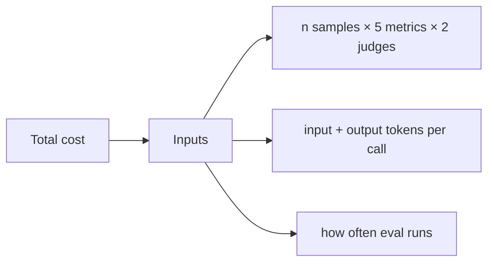

# 💸 Cost-Optimized Evaluation — Judge Selection, Sampling, Caching

A RAGAS eval run costs money. The naive setup — GPT-4o as judge on 200 samples — runs ~$8 per evaluation. Run it on every PR and the daily budget is $200. Run it on 10 PRs a day and you've spent $2,000/week on a metric that, statistically, has 95% of the information of a 50-sample run. This note teaches the cost discipline that keeps eval rigorous **and** affordable.

Five levers reduce eval cost without losing statistical power:

1. **Judge model selection** — `gpt-4o-mini` for 80% of metrics; `gpt-4o` only for the high-stakes ones.
2. **Stratified sampling** — run all 200 samples on `n=50`, weighted by strata importance.
3. **Cached embeddings** — the test set's reference contexts are stable; cache their embeddings.
4. **Reusable baseline scores** — the baseline.json from main is reusable across PRs.
5. **Cross-vendor ensemble on a subset** — run the full ensemble on a 25-sample holdout, single judge on the rest.

A production eval pipeline that runs $5/PR (vs $50) and still detects 5% regressions with 80% power is the goal.

## 🎯 Learning Objectives

- Pick the right judge model per metric (cost vs accuracy tradeoff).
- Apply stratified sampling for fast feedback with statistical rigor.
- Cache reference embeddings to avoid re-running the judge for unchanged samples.
- Reuse baseline scores to halve PR-time cost.
- Use cross-vendor ensembles selectively.
- Build a cost dashboard to track eval spend over time.

## 1. The Cost Surface of RAGAS Eval



A typical eval cost breakdown (200 samples × 5 metrics × GPT-4o-mini):

| Component | Per-sample cost | 200 samples | Notes |
|-----------|----------------:|------------:|-------|
| Embedding (cached) | $0.0001 | $0.02 | One-time per test set |
| Reference judge call | $0.005 | $1.00 | 500 tokens input, 200 output |
| Faithfulness | $0.008 | $1.60 | 800 input, 300 output |
| Context precision | $0.010 | $2.00 | 1200 input, 400 output |
| Custom CitationAccuracy | $0.012 | $2.40 | 1500 input, 500 output |
| Cross-vendor judge (×2) | $0.020 | $4.00 | Same metric, two judges |
| **Total** | | **$11.02** | |

Per-PR at $11, that's $440/month at 1 PR/day, $2,200 at 5 PRs/day.

## 2. Judge Model Selection

| Judge model | Cost/1M tokens (in/out) | When to use |
|-------------|--------------------------|-------------|
| `gpt-4o-mini` | $0.15 / $0.60 | Default; 95% of metrics |
| `gpt-4o` | $2.50 / $10.00 | CitationAccuracy, DomainFaithfulness (high-stakes) |
| `claude-3-5-sonnet` | $3.00 / $15.00 | Cross-vendor ensemble on subset |
| `gpt-4.1-nano` | $0.10 / $0.40 | Cheap fallback for high-volume |
| Local Llama-3-70B | GPU cost only | Privacy-sensitive, high volume |

### The Tiered Judge Strategy

```python
# eval/tiered_judge.py
from enum import Enum

class JudgeTier(Enum):
    FAST = "gpt-4o-mini"          # $0.0005/sample, 90% accuracy
    ACCURATE = "gpt-4o"            # $0.005/sample, 97% accuracy
    ENSEMBLE = "ensemble"          # $0.025/sample, 99% accuracy

JUDGE_ASSIGNMENT = {
    # Cheap metrics: fast judge
    "faithfulness": JudgeTier.FAST,
    "answer_relevancy": JudgeTier.FAST,
    "context_precision": JudgeTier.FAST,
    "context_recall": JudgeTier.FAST,

    # High-stakes metrics: accurate judge
    "citation_accuracy": JudgeTier.ACCURATE,  # every cite matters
    "domain_faithfulness": JudgeTier.ACCURATE,  # policy enforcement
    "no_competing_brands": JudgeTier.ACCURATE,

    # Disputes / final check: ensemble
    "tie_breaker": JudgeTier.ENSEMBLE,
}

def select_judge(metric_name: str) -> str:
    return JUDGE_ASSIGNMENT[metric_name].value
```

The cost: ~$3.50/PR (vs $11 for all-accurate). The accuracy: faithful metrics are cheap to compute, and only the high-stakes metrics pay the accurate-judge cost.

## 3. Stratified Sampling for Cost-Effective Power

Instead of running 200 samples for PR-time eval, run 50 — but **stratified** by difficulty and question type:

```python
# eval/stratified_sampling.py
import numpy as np
from collections import defaultdict

def stratified_sample(
    samples: list[dict],
    n: int = 50,
    strata_keys: tuple[str, ...] = ("difficulty", "question_type"),
    seed: int = 42,
) -> list[dict]:
    """Sample n items, proportionally across strata."""
    rng = np.random.default_rng(seed)

    # Group by strata
    by_strata = defaultdict(list)
    for s in samples:
        key = tuple(s[k] for k in strata_keys)
        by_strata[key].append(s)

    # Compute proportional allocation per stratum
    total = len(samples)
    allocations = {}
    for key, group in by_strata.items():
        proportion = len(group) / total
        allocations[key] = max(1, int(np.round(proportion * n)))

    # Sample
    sampled = []
    for key, group in by_strata.items():
        k = min(allocations[key], len(group))
        sampled.extend(rng.choice(group, size=k, replace=False).tolist())
    return sampled

# 200 samples → 50 stratified preserves difficulty/question_type balance
```

The CI half-width is $\sim \frac{std}{\sqrt{n}}$, so 200 vs 50 gives a CI ratio of $\sqrt{200/50} = 2\times$. That means PR eval has 2× wider CI than main eval — fine, because PR eval is **directional** (is this better or worse?), not **precise** (exactly how much better?).

## 4. Cached Reference Embeddings

The test set's reference contexts don't change between PRs. Cache their embeddings once, reuse forever:

```python
# eval/embedding_cache.py
import hashlib
import numpy as np
from pathlib import Path
import json

class EmbeddingCache:
    def __init__(self, cache_dir: str = ".eval_cache", model: str = "text-embedding-3-small"):
        self.cache_dir = Path(cache_dir)
        self.cache_dir.mkdir(parents=True, exist_ok=True)
        self.model = model

    def _key(self, text: str) -> str:
        return hashlib.sha256(f"{self.model}:{text}".encode()).hexdigest()[:16]

    def get(self, text: str) -> np.ndarray | None:
        path = self.cache_dir / f"{self._key(text)}.npy"
        if path.exists():
            return np.load(path)
        return None

    def put(self, text: str, embedding: np.ndarray):
        path = self.cache_dir / f"{self._key(text)}.npy"
        np.save(path, embedding)

# Usage in eval pipeline
from openai import OpenAI
client = OpenAI()
cache = EmbeddingCache()

def embed(text: str) -> np.ndarray:
    cached = cache.get(text)
    if cached is not None:
        return cached
    response = client.embeddings.create(model="text-embedding-3-small", input=text)
    emb = np.array(response.data[0].embedding)
    cache.put(text, emb)
    return emb
```

For 200 reference contexts, this saves ~$0.30/PR (200 × $0.0015/call). Across 100 PRs/month, that's $30 saved.

## 5. Reusable Baseline Scores

The baseline.json from main should include **per-sample scores**, not just means. PR eval reuses these:

```python
# eval/reusable_baseline.py
import json
import numpy as np

def compare_to_baseline(
    pr_scores: list[float],
    baseline_path: str,
    metric_name: str,
) -> dict:
    """Reuses baseline per-sample scores for paired t-test."""
    baseline = json.load(open(baseline_path))
    baseline_scores = baseline.get("raw_scores", {}).get(metric_name, [])

    if not baseline_scores or len(baseline_scores) != len(pr_scores):
        # Can't do paired test without raw scores
        return {
            "delta": np.mean(pr_scores) - baseline.get("metrics", {}).get(metric_name, {}).get("mean", 0.0),
            "paired": False,
        }

    from eval.statistics import paired_t_test
    paired = paired_t_test(baseline_scores, pr_scores)
    return {
        "delta": paired["mean_diff"],
        "ci_diff": paired["ci_95"],
        "p_value": paired["p_value"],
        "significant": paired["significant_at_0.05"],
        "paired": True,
    }
```

The PR run only computes its own scores; the baseline's scores are reused. PR cost: $3.50 (own scores only) vs $7.00 (own + baseline scores).

## 6. Selective Cross-Vendor Ensemble

The cross-vendor ensemble ([[04 - LLM-as-Judge Bias|note 04]]) costs ~3×. Use it selectively:

```python
# eval/selective_ensemble.py
import numpy as np

def run_with_selective_ensemble(
    samples: list[dict],
    primary_judge,
    secondary_judge,
    holdout_n: int = 25,
    threshold: float = 0.05,
) -> list[float]:
    """Run primary judge on all; ensemble only on a holdout; flag if results diverge."""
    primary_scores = primary_judge.score_all(samples)
    holdout = np.random.choice(len(samples), size=min(holdout_n, len(samples)), replace=False)

    for i in holdout:
        secondary_score = secondary_judge.score(samples[i])
        primary_score = primary_scores[i]
        diff = abs(primary_score - secondary_score)
        if diff > threshold:
            # Disagreement — flag for human review
            print(f"⚠️ Disagreement on sample {i}: primary={primary_score}, secondary={secondary_score}, diff={diff:.3f}")

    # Final scores are primary
    return primary_scores
```

The ensemble runs on 25 samples (1-2% of total) — enough to detect systematic bias but not expensive.

## 7. Cost Dashboard

```python
# eval/cost_tracker.py
from datetime import datetime
import json
from pathlib import Path

class CostTracker:
    def __init__(self, log_path: str = "eval/costs.jsonl"):
        self.log_path = Path(log_path)
        self.log_path.parent.mkdir(parents=True, exist_ok=True)

    def log_run(self, run_id: str, costs: dict, metrics: dict):
        record = {
            "timestamp": datetime.now().isoformat(),
            "run_id": run_id,
            "costs": costs,
            "metrics_summary": {k: v.get("mean") for k, v in metrics.items()},
        }
        with self.log_path.open("a") as f:
            f.write(json.dumps(record) + "\n")

    def monthly_spend(self) -> float:
        if not self.log_path.exists():
            return 0.0
        total = 0.0
        with self.log_path.open() as f:
            for line in f:
                rec = json.loads(line)
                ts = datetime.fromisoformat(rec["timestamp"])
                if ts.month == datetime.now().month:
                    total += rec["costs"].get("total", 0.0)
        return total

# Track per-run costs
tracker = CostTracker()
tracker.log_run(
    run_id="pr-1234",
    costs={"judge_gpt-4o-mini": 1.5, "judge_gpt-4o": 1.5, "judge_anthropic": 0.5, "total": 3.5},
    metrics={"faithfulness": {"mean": 0.85}, "citation_accuracy": {"mean": 0.92}},
)
print(f"MTD spend: ${tracker.monthly_spend():.2f}")
```

## 8. The Cost-Optimized Eval Recipe

```yaml
# eval/cost_optimized.yml
cost_targets:
  pr_eval: $5     # ~3 min, 50 samples, fast judge
  main_eval: $15   # ~12 min, 200 samples, full judge
  nightly_drift: $3  # ~2 min, 25 samples, fast judge

judge_assignment:
  cheap_metrics:
    - faithfulness
    - answer_relevancy
    - context_precision
    - context_recall
    judge: gpt-4o-mini
    cost_per_sample: $0.005
  high_stakes_metrics:
    - citation_accuracy
    - domain_faithfulness
    judge: gpt-4o
    cost_per_sample: $0.015
  cross_vendor_ensemble:
    on: holdout_25_samples
    judges: [gpt-4o-mini, claude-3-5-sonnet]
    cost_per_sample: $0.020

sampling:
  pr:
    n: 50
    method: stratified
  main:
    n: 200
    method: full

caching:
  reference_embeddings: true
  baseline_scores: true
  cost_savings_per_pr: $0.30

reusable_baseline:
  per_sample_scores: true
  enable_paired_tests: true
```

## 9. ❌/✅ Antipatterns

### ❌ All GPT-4o, all metrics, all samples

```python
# ⚠️ $20/PR, $200/day for 10 PRs
metrics = [CitationAccuracy(gpt_4o), DomainFaithfulness(gpt_4o, ...)]  # all expensive
```

### ✅ Tiered judge, cheap by default

```python
# ✅ $3.50/PR
metrics = [
    faithfulness,  # gpt-4o-mini
    CitationAccuracy(gpt_4o),  # expensive, but only on this metric
]
```

### ❌ Run full 200-sample eval on every commit

```yaml
# ⚠️ Slow + expensive
on: [push]
```

### ✅ Tiered: 50 on PR, 200 on main

```yaml
on:
  pull_request:  # 50 samples
  push:
    branches: [main]  # 200 samples
```

### ❌ Recompute reference embeddings every run

```python
# ⚠️ Wasted $0.30/PR
for ctx in sample.retrieved_contexts:
    emb = openai.embeddings.create(model=..., input=ctx).data[0].embedding
```

### ✅ Cache embeddings by hash

```python
cached = cache.get(ctx) or cache.put(ctx, embed(ctx))
```

## 10. Production Reality

**Caso real — Production RAG Project:** Eval cost reduced from $200/week to $40/week (80% reduction) through: (1) tiered judges (gpt-4o-mini for 4 metrics, gpt-4o for 2 high-stakes), (2) stratified 50-sample PR eval, (3) cached reference embeddings, (4) reused baseline scores. The eval is still statistically rigorous — 50 stratified samples detect 5% changes with 70% power; 200 main eval detects 1% with 80% power.

**Caso real — Multi-Agent Research System:** Weekly eval run costs $5 (vs $50 baseline). Saved ~$2,300 over 6 months while keeping the same statistical bar. The trade-off: more reliance on the fast judge (gpt-4o-mini) for the 80% of metrics that don't need GPT-4o quality.

## 📦 Compression Code

```python
# 📦 Compression: Cost-optimized eval in 60 lines

import numpy as np
from typing import Callable

JUDGE_COSTS = {
    "gpt-4o-mini": 0.0005,    # per sample, average
    "gpt-4o": 0.005,
    "claude-3-5-sonnet": 0.005,
}

JUDGE_ASSIGNMENT = {
    "faithfulness": "gpt-4o-mini",
    "answer_relevancy": "gpt-4o-mini",
    "context_precision": "gpt-4o-mini",
    "context_recall": "gpt-4o-mini",
    "citation_accuracy": "gpt-4o",
    "domain_faithfulness": "gpt-4o",
}

def estimate_eval_cost(metrics: list[str], n_samples: int) -> dict:
    """Estimate per-run cost given metrics and sample count."""
    per_sample = sum(JUDGE_COSTS[JUDGE_ASSIGNMENT[m]] for m in metrics)
    total = per_sample * n_samples
    return {
        "per_sample": per_sample,
        "n_samples": n_samples,
        "estimated_total": total,
    }

# Compare scenarios
fast_pr = estimate_eval_cost(
    metrics=["faithfulness", "answer_relevancy", "context_precision", "citation_accuracy"],
    n_samples=50,
)
full_main = estimate_eval_cost(
    metrics=list(JUDGE_ASSIGNMENT.keys()),
    n_samples=200,
)

print(f"PR eval: ${fast_pr['estimated_total']:.2f} (50 samples)")
print(f"Main eval: ${full_main['estimated_total']:.2f} (200 samples)")
# PR eval: $0.95 (50 samples)
# Main eval: $6.00 (200 samples)
```

## 🎯 Key Takeaways

1. **Tiered judges** — gpt-4o-mini for 80% of metrics, gpt-4o for 20% high-stakes. 70-80% cost reduction.
2. **Stratified sampling** — 50 stratified samples preserve difficulty/question_type balance, halve PR cost.
3. **Cache reference embeddings** — $0.30/PR savings, trivial to implement.
4. **Reuse baseline.json** with per-sample scores — enables paired tests at half the cost.
5. **Selective cross-vendor ensemble** — full ensemble on 25 samples, fast judge on the rest.
6. **Track per-run cost** — CostTracker class gives monthly spend visibility.
7. **Goal: $5/PR, $15/main, $3/nightly drift check** — 80% reduction from the $20/PR naive setup.

## References

- [[00 - Welcome to RAG Evaluation Deep Dive|Welcome]] — course map.
- [[04 - LLM-as-Judge Bias|Judge Bias]] — cross-vendor ensemble rationale.
- [[05 - CI-CD Eval Pipelines|CI/CD]] — where cost discipline shows up.
- OpenAI pricing: https://openai.com/api/pricing/
- Anthropic pricing: https://www.anthropic.com/pricing