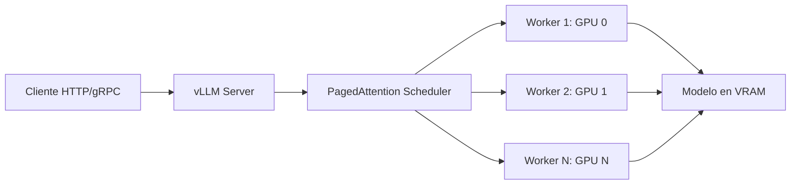

# 🚀 Bienvenida a vLLM Production Serving

Esta carpeta contiene las notas del curso **20 - vLLM Production Serving**, parte del módulo **02 - Large Language Models**.

vLLM es el motor de inferencia open-source de referencia para LLMs. Creado originalmente en UC Berkeley y ahora mantenido por una comunidad activa (con empleados de Anyscale, AMD, NVIDIA, Google, Meta, Intel, IBM, Mistral, Red Hat y muchos otros), se ha convertido en el estándar de facto para servir modelos de lenguaje a escala: cualquier organización que quiera desplegar Llama, Mistral, Qwen, DeepSeek, Gemma o sus propios fine-tunes con throughput cercano al óptimo de hardware termina usando vLLM o alguna de sus alternativas inmediatas (TGI, SGLang, TensorRT-LLM).



---

## 📚 Índice del curso

1. [[01 - Arquitectura Interna]]: PagedAttention, continuous batching, scheduler, KV cache, diseño general.
2. [[02 - Instalacion y Primer Servidor]]: Setup, modelos soportados, `vllm serve`, health checks.
3. [[03 - API OpenAI-Compat]]: Endpoints, streaming, function calling, sampling parameters.
4. [[04 - Optimizaciones de Performance]]: Prefix caching, chunked prefill, speculative decoding, batching strategies.
5. [[05 - Cuantizacion]]: GPTQ, AWQ, BitsAndBytes, FP8, INT4, trade-offs de calidad y throughput.
6. [[06 - Multimodal]]: VLLMs con imágenes y audio (LLaVA, Qwen-VL, Pixtral, Whisper).
7. [[07 - Distributed y Multi-GPU]]: Tensor parallelism, pipeline parallelism, multi-node, Ray.
8. [[08 - Observabilidad y Deployment]]: Métricas Prometheus, K8s, autoscaling, graceful shutdown, health probes.
9. [[09 - Caso Practico]]: API multi-tenant con vLLM + gateway + monitoring.

> **Nota**: el curso [[../13 - vLLM and Advanced RAG/00 - Welcome to vLLM and Advanced RAG|13 - vLLM and Advanced RAG]] (en inglés) cubre el lado de RAG avanzado. Este curso es su complemento en español, enfocado en el servidor mismo: arquitectura, serving, performance, multimodal y operaciones.

---

## 📖 Glosario de términos

| Término | Definición |
|---------|------------|
| **LLM (Large Language Model)** | Modelo de lenguaje con miles de millones de parámetros (Llama 3, Mistral, Qwen, DeepSeek, etc.). |
| **Inferencia** | Proceso de ejecutar un modelo entrenado para producir salidas (tokens) a partir de un input. |
| **Throughput** | Tokens generados por segundo agregados sobre todas las requests concurrentes. |
| **Latency / TTFT** | Time To First Token: tiempo desde la request hasta el primer token generado. |
| **TPOT** | Time Per Output Token: tiempo medio entre tokens consecutivos (excluye TTFT). |
| **KV Cache** | Caché de keys y values de atención, permite reutilizar cómputo en decodificación autoregresiva. |
| **PagedAttention** | Técnica central de vLLM: gestiona el KV cache en páginas (como memoria virtual de SO) para evitar fragmentación. |
| **Continuous batching** | Política de scheduling que admite nuevas requests en cada iteración, sin esperar a que termine un batch completo. |
| **Prefix caching** | Reutilización del KV cache entre requests que comparten un prefijo (system prompt, few-shot examples). |
| **Chunked prefill** | Procesa prompts largos en chunks para mezclarlos con la fase de decode y mejorar la utilización. |
| **Speculative decoding** | Usa un modelo draft pequeño para proponer tokens que el modelo grande verifica en paralelo. |
| **Quantization** | Reducción de la precisión numérica de los pesos (FP16 → INT8, INT4, FP8) para ahorrar VRAM y mejorar throughput. |
| **Tensor parallelism (TP)** | Parte las matrices del modelo entre múltiples GPUs en un mismo nodo. |
| **Pipeline parallelism (PP)** | Parte las capas del modelo entre GPUs; cada GPU procesa un subconjunto secuencial de capas. |
| **Data parallelism (DP)** | Réplicas del modelo en distintos nodos; cada request va a una réplica. |
| **OpenAI-compatible API** | Interfaz HTTP que imita los endpoints de OpenAI (`/v1/chat/completions`, `/v1/completions`, `/v1/embeddings`) para portabilidad. |
| **SSE (Server-Sent Events)** | Protocolo de streaming sobre HTTP usado por la API de completions para entregar tokens incrementalmente. |
| **AWQ / GPTQ** | Algoritmos de cuantización post-training que preservan accuracy con 4 bits. |
| **Speculative decoding** | Técnica que usa un modelo draft pequeño para proponer tokens que el grande verifica en paralelo. |
| **VRAM** | Memoria de la GPU (HBM en NVIDIA, HBM en AMD MI). vLLM vive casi enteramente aquí. |

---

## 🎯 Objetivos de aprendizaje

Al completar este curso serás capaz de:

1. Explicar la arquitectura interna de vLLM y por qué PagedAttention cambió el estado del arte de inference.
2. Desplegar un servidor vLLM funcional con un modelo open-source y validar su API.
3. Consumir la API OpenAI-compatible de vLLM con los SDKs estándar (openai-python, langchain, etc.).
4. Aplicar las optimizaciones de performance clave: prefix caching, chunked prefill, speculative decoding.
5. Elegir y aplicar la cuantización adecuada para tu modelo y caso de uso.
6. Servir modelos multimodales (visión, audio) y entender las diferencias con los LLMs puros.
7. Escalar vLLM a multi-GPU y multi-nodo con las estrategias correctas.
8. Operar vLLM en producción con monitoring, autoscaling y despliegues robustos en Kubernetes.
9. Integrar vLLM con gateways, load balancers y sistemas de autenticación.

---

## ⚠️ Advertencia general

vLLM es un sistema complejo que vive en la intersección de CUDA, deep learning y sistemas distribuidos. Antes de abordar este curso deberías tener:

- **Python avanzado**: type hints, async, packaging.
- **Bases de LLMs**: qué es un transformer, attention, KV cache, sampling. Si necesitas refuerzo, revisa [[../06 - Fundamentos de LLMs/00 - Bienvenida|Fundamentos de LLMs]].
- **Conceptos de GPU**: VRAM, CUDA, tipos de memoria (HBM, GDDR). vLLM asume que entiendes que la GPU es el cuello de botella.
- **Linux y contenedorización**: Docker, Docker Compose básico, kubectl básico.
- **HTTP y APIs**: REST, JSON, streaming, SSE.

> **Aviso sobre hardware**: muchas optimizaciones de vLLM (PagedAttention, FP8) requieren GPUs NVIDIA Ampere o más nuevas (A100, H100, L40, RTX 4090). AMD ROCm es soportado pero con más caveats. Si solo tienes CPU, este curso te será útil conceptualmente pero no podrás ejecutar la mayoría de los ejemplos.

💡 **Regla mnemotécnica**: **"Pide, pagina, batchea, sirve"** — el flujo de vLLM desde que llega la request hasta que sale el token, en una sola frase.

---

## 📦 Código de compresión

```python
"""
Bienvenida: verificación de entorno para vLLM.
vLLM requiere GPU NVIDIA con drivers >= 525 y CUDA >= 12.1.
"""

import importlib
import shutil
import subprocess
import sys


def check(name: str, import_name: str | None = None) -> bool:
    import_name = import_name or name
    try:
        importlib.import_module(import_name)
        print(f"[OK]      {name}")
        return True
    except ImportError:
        print(f"[FALTA]   {name}")
        return False


def cmd(cmd_str: str) -> str:
    return subprocess.check_output(cmd_str, shell=True, text=True).strip()


print("=" * 60)
print("Verificación de entorno - vLLM")
print("=" * 60)

ok = True
ok &= check("vllm")
ok &= check("torch", "torch")
ok &= check("transformers", "transformers")
ok &= check("openai", "openai")
ok &= check("prometheus-client", "prometheus_client")

# GPU
if shutil.which("nvidia-smi"):
    print("\n[GPU]")
    try:
        print(cmd("nvidia-smi --query-gpu=name,memory.total,driver_version --format=csv"))
    except subprocess.CalledProcessError:
        print("  [WARN] nvidia-smi falló")
        ok = False
else:
    print("\n[GPU] nvidia-smi no encontrado — se requiere GPU NVIDIA")
    ok = False

# Driver + CUDA
try:
    nvcc = cmd("nvcc --version | tail -1") if shutil.which("nvcc") else "nvcc no encontrado"
    print(f"\n[CUDA]   {nvcc}")
except subprocess.CalledProcessError:
    print("\n[CUDA]   nvcc no disponible (puede ser ok si solo usas binarios)")
```

---

## 🗺️ Mapa de prerrequisitos

```
00 - Python Avanzado para ML
└─ async, type hints, packaging

01 - Matemáticas para ML
└─ Álgebra lineal, probabilidades

06 - Fundamentos de LLMs
└─ Transformer, attention, KV cache, sampling

09 - Sistemas de LLMs en Produccion
└─ Deployment, contenedores, latency/throughput
```

---

¡Comencemos con [[01 - Arquitectura Interna|la arquitectura interna]]!
