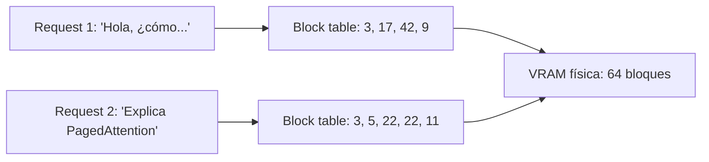
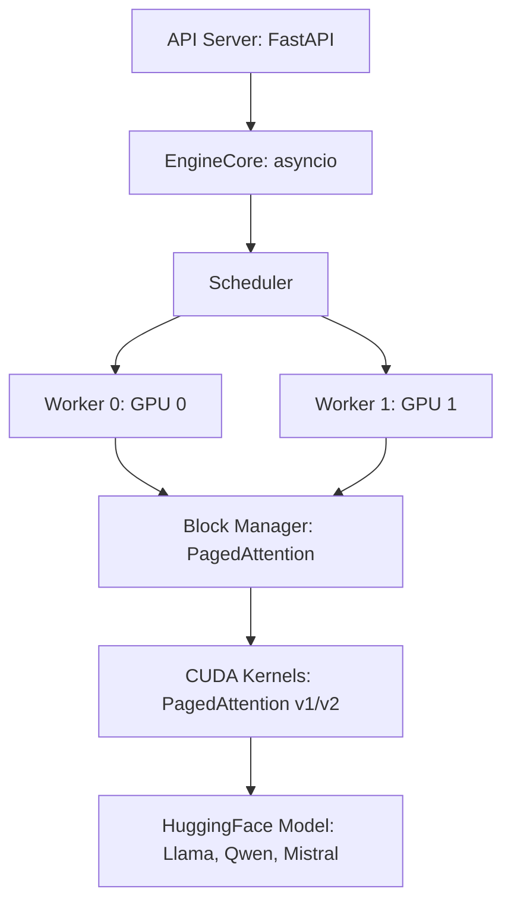
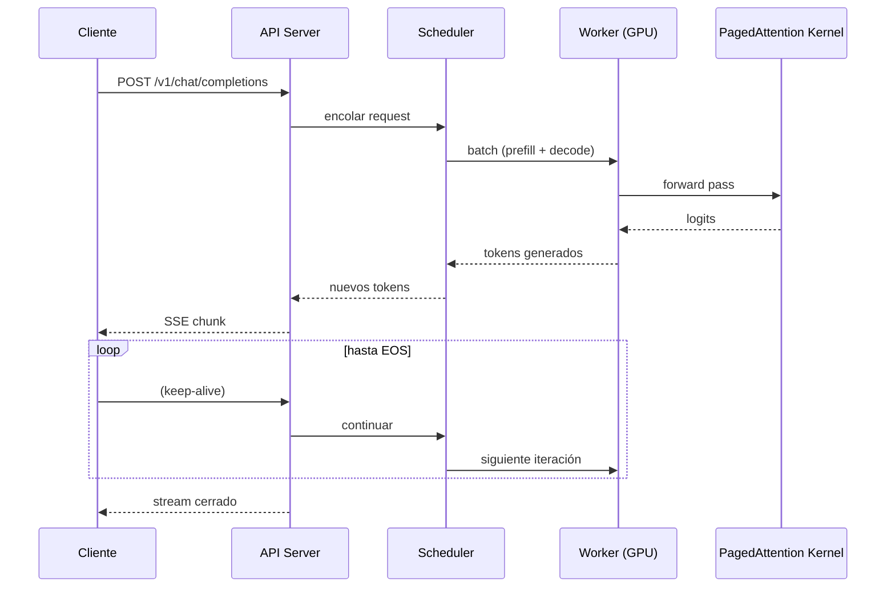

# 🏛️ Arquitectura Interna de vLLM

Para usar vLLM con soltura en producción necesitas entender qué pasa **dentro** del servidor. Este módulo desempaca los tres pilares de vLLM: **PagedAttention** (cómo gestiona el KV cache), **continuous batching** (cómo programa las requests) y el **scheduler** (cómo decide qué se ejecuta en cada paso). La comprensión profunda de estos mecanismos es la diferencia entre usar vLLM y operar vLLM.

---

## 1. El problema: el KV cache es el cuello de botella

### 1.1 Qué es el KV cache

Durante la inferencia autorregresiva, cada capa de atención calcula, para cada token, dos tensores: las **keys** y los **values**. Estos se almacenan en un buffer llamado **KV cache** para que, en cada paso de decodificación, el modelo no recalcule la atención sobre los tokens anteriores.

Para una request de longitud $L$ con $L_{\text{layers}}$ capas transformer, $H$ cabezas de atención y dimensión $D$ por cabeza, el tamaño del KV cache es:

$$
\text{KV} = 2 \times L \times L_{\text{layers}} \times H \times D \times \text{sizeof(dtype)}
$$

Ejemplo concreto: Llama 3 70B en FP16 con 80 capas, 8 cabezas KV (GQA), 128 dim por cabeza, para una request de 4096 tokens:

$$
\text{KV} = 2 \times 4096 \times 80 \times 8 \times 128 \times 2 \text{ bytes} \approx 1.34 \text{ GB}
$$

Cada request consume **gigabytes** de VRAM solo en KV cache. Para 32 requests concurrentes, son 43 GB. Una H100 tiene 80 GB, así que el modelo base (140 GB en FP16) ya no cabe. Hay que cuantizar el modelo, y aún así el KV cache domina el uso de memoria.

### 1.2 Fragmentación: el problema clásico

Los frameworks anteriores (HuggingFace Transformers, TGI antes de PagedAttention) reservaban el KV cache de cada request como **un bloque contiguo** de memoria. Si una request tiene 4096 tokens, se reservan 4096 slots contiguos aunque solo use 100 tokens hasta el momento. Esto provoca:

| Problema | Efecto |
|----------|--------|
| **Reserva提前** | Se reserva memoria para el peor caso (max_seq_len), no para el caso real |
| **Fragmentación interna** | Slots reservados pero no usados |
| **Fragmentación externa** | Huecos entre requests que no se pueden reutilizar |
| **Batching estático** | Un batch debe esperar al miembro más largo; los demás "rellenan" GPU ociosa con padding |

> **Consecuencia práctica**: los frameworks tradicionales lograban 4-8 requests concurrentes en una A100 de 80 GB con modelos 70B en FP16, con una utilización de GPU del 30-50%. vLLM logra 20-30+ requests concurrentes con utilización >80%.

---

## 2. PagedAttention: la innovación central

PagedAttention (Kwon et al., 2023, SOSP) toma prestada una idea de los sistemas operativos: **memoria virtual paginada**. En vez de tratar el KV cache como un buffer contiguo, lo divide en **bloques de tamaño fijo** (las "páginas") y mantiene una **tabla de bloques** por request que mapea posición lógica a bloque físico.

### 2.1 La analogía con memoria virtual

| Concepto de SO | Concepto en vLLM |
|----------------|------------------|
| Página (4 KB) | Bloque de KV (típicamente 16 tokens) |
| Tabla de páginas | Block table por secuencia |
| TLB | Caché de traducciones |
| Memory allocator | Block manager |
| Resident set | KV cache físico en VRAM |



Cada bloque contiene los K/V de 16 tokens para una capa y cabeza específicas. Las requests pueden compartir bloques idénticos (prefix caching) sin duplicar memoria.

### 2.2 Beneficios cuantitativos

| Métrica | Antes (estático) | Con PagedAttention |
|---------|------------------|--------------------|
| Fragmentación interna | Hasta 50% del KV cache reservado | < 4% (solo la última página) |
| Fragmentación externa | Frecuente (huecos no reutilizables) | Eliminada |
| Throughput en A100 70B FP16 | ~400 tokens/s | ~2000 tokens/s (5x) |
| Requests concurrentes | 4-8 | 20-30+ |

> **Por qué importa**: en producción, un servidor vLLM con una sola A100 y un modelo 13B puede manejar 50+ requests concurrentes con latencia razonable. Sin PagedAttention, la misma GPU saturaría a 8 requests.

### 2.3 Copy-on-write: compartir bloques de prefix

Si dos requests comparten el mismo system prompt, vLLM asigna los **mismos bloques físicos** a ambas y mantiene block tables independientes. Si una request modifica un bloque (poco frecuente en inference), se hace copy-on-write. En la práctica, durante decodificación los bloques son read-only, así que el sharing es masivo.

Este mecanismo es la base del **prefix caching** y de optimizaciones como "automatic prefix caching" en producción.

---

## 3. Continuous batching

### 3.1 El problema del batching estático

Los frameworks ingenuos forman un batch al inicio y procesan todas las requests hasta que la última termina. Mientras tanto, requests nuevas esperan. Esto es batching estático (estilo PyTorch clásico).

```
t=0:  [R1, R2, R3, R4]  (4 requests)
t=1:  [R1, R2, R3, R4]  (R1 terminó, pero R2 aún no)
t=2:  [R2, R3, R4]      (recién puedo meter R5)
```

El hueco entre $t=0$ y $t=2$ es **GPU ociosa**.

### 3.2 La solución: continuous (o in-flight) batching

vLLM admite requests nuevas en cada iteración. Cuando una request termina, su slot se libera inmediatamente y se llena con una request encolada.

```
t=0:  [R1, R2, R3, R4]  (4 requests en batch)
t=1:  [R2, R3, R4, R5]  (R1 terminó, entra R5)
t=2:  [R3, R4, R5, R6]  (R2 terminó, entra R6)
```



```mermaid
gantt
    title Continuous batching en acción
    dateFormat X
    axisFormat %s
    section Batch
    iter 1 (t=0) :a1, 0, 1
    iter 2 (t=1) :a2, 1, 1
    iter 3 (t=2) :a3, 2, 1
    iter 4 (t=3) :a4, 3, 1
    section R1
    R1 activa :b1, 0, 1
    R1 termina :milestone, 1, 0
    section R2
    R2 activa :b2, 0, 2
    R2 termina :milestone, 2, 0
    section R5
    R5 esperando :crit, 0, 1
    R5 activa :active, 1, 2
```

### 3.3 Métricas de éxito

| Política de batching | Throughput relativo | Latency p99 | Cuándo usar |
|---------------------|--------------------:|------------:|-------------|
| Estático | 1.0x | Alto | Prototipos |
| Dynamic (sin PagedAttention) | 2-3x | Medio | HF TGI antiguo |
| Continuous + PagedAttention | **5-24x** | Bajo | **vLLM** (default) |

> **Advertencia**: continuous batching no es gratis. La implementación es compleja (scheduler debe re-planificar cada iteración, manejar diferentes longitudes, attention masking dinámico). Por eso pocos frameworks lo ofrecían antes de vLLM. Hoy, TGI, SGLang, TensorRT-LLM y otros lo han adoptado.

---

## 4. El scheduler de vLLM

### 4.1 Estados de una request

```
RECEIVED → WAITING → RUNNING → (SWAPPED) → FINISHED
```

| Estado | Significado |
|--------|-------------|
| `RECEIVED` | Llegó al servidor, esperando scheduler |
| `WAITING` | Esperando turno (no hay slots libres) |
| `RUNNING` | En el batch actual, generando tokens |
| `SWAPPED` | Swapped a CPU (cuando no entra en VRAM) |
| `FINISHED` | Completada o abortada |

### 4.2 Políticas de scheduling

vLLM implementa varias políticas, configurables:

```bash
vllm serve ... --scheduling-policy fcfs   # First-Come-First-Served
vllm serve ... --scheduling-policy priority  # con prioridades
```

Y políticas de preemption:

```bash
vllm serve ... --preemption-mode swap    # swap a CPU
vllm serve ... --preemption-mode recompute  # recomputar KV (más rápido en GPU con buena I/O)
```

### 4.3 Chunked prefill

El prefill (procesar el prompt inicial) es caro: para 4096 tokens puede tomar segundos y usa mucha memoria. Si entra un prefill largo en mitad de un batch de decode, las requests en decode sufren latencia.

vLLM introduce **chunked prefill**: divide el prompt en chunks de tamaño configurable y los procesa intercalados con decode, manteniendo la GPU ocupada sin monopolizarla:

```bash
vllm serve ... \
  --max-num-batched-tokens 2048 \
  --enable-chunked-prefill
```

Beneficio: TTFT y TPOT más estables cuando hay mezcla de requests cortas y largas.

---

## 5. Componentes del runtime



### 5.1 Capa de API

- **FastAPI/uvicorn**: servidor HTTP async.
- **OpenAI-compatible endpoints**: `/v1/chat/completions`, `/v1/completions`, `/v1/embeddings`, `/v1/models`, `/v1/audio/*` (multimodal).
- **SSE streaming**: protocolo de streaming de tokens.

### 5.2 EngineCore

El "cerebro" async. Maneja:
- Cola de requests.
- Loop de scheduling.
- Comunicación con workers (zero-copy shared memory entre procesos).
- Tokenización (BPE, SentencePiece, tiktoken).

### 5.3 Workers

Cada worker controla una o más GPUs. En multi-GPU, vLLM puede usar:
- **Multiprocessing**: un proceso por GPU (comunicación con NCCL/Ray).
- **Ray**: para escalar a multi-nodo.

### 5.4 Modelos soportados

vLLM soporta cientos de arquitecturas. La lista viva está en `vllm/model_executor/models`. Algunas populares:

| Familia | Modelos | Notas |
|---------|---------|-------|
| Llama | Llama 2, Llama 3, Llama 3.1, Llama 3.2 (vision) | El caso de referencia |
| Qwen | Qwen 2, Qwen 2.5, Qwen-VL, Qwen 2.5-VL | Multimodal nativo |
| Mistral | Mistral 7B, Mixtral (MoE), Mistral Small/Medium | Mixtral usa MoE |
| DeepSeek | DeepSeek-V2, DeepSeek-V3 (MoE 671B) | MoE masivo |
| Gemma | Gemma 2, Gemma 3 (vision) | Google |
| Phi | Phi-3, Phi-4 | Microsoft, small models |
| GPT-OSS | OpenAI gpt-oss-20b/120b | Recién añadidos |

### 5.5 Kernels CUDA

vLLM usa kernels optimizados escritos a mano o generados:
- **PagedAttention v1**: implementación inicial.
- **PagedAttention v2**: optimizaciones para memory-bound attention.
- **FlashAttention-2/3**: cuando es compatible.
- **FP8 GEMM**: para GPUs con soporte FP8 nativo (H100, L40).

La selección es automática según GPU y modelo.

---

## 6. Trade-offs de diseño

| Decisión | Beneficio | Costo |
|----------|-----------|-------|
| PagedAttention | Hasta 24x throughput | Overhead de traducción de bloques, copy-on-write |
| Continuous batching | GPU siempre ocupada | Scheduler complejo, latencia variable por request |
| Chunked prefill | Estabilidad de latencia | TTFT ligeramente mayor para prompts largos |
| Multi-proceso vs Ray | Inicio rápido (multi-proc) | Ray necesario para multi-nodo |
| Bloques de 16 tokens | Balance memory/overhead | Fragmentación residual de hasta 1 bloque |

> **Regla práctica**: el tamaño de bloque (`--block-size`) por default es 16. Subirlo a 32 reduce overhead de block table pero aumenta fragmentación residual. Bajar a 8 aumenta precisión de uso pero también overhead. El default funciona en >95% de casos.

---

## 7. Comparación con otros frameworks

| Framework | PagedAttention | Continuous batching | Multi-GPU | Multimodal | Mantenimiento |
|-----------|:--------------:|:-------------------:|:---------:|:----------:|---------------|
| **vLLM** | ✅ | ✅ | ✅ | ✅ | Muy activo |
| TGI (HF) | ✅ (v2+) | ✅ | ✅ | ✅ | Activo |
| SGLang | ✅ | ✅ | ✅ | ✅ | Muy activo |
| TensorRT-LLM | ✅ (custom) | ✅ | ✅ | ✅ | NVIDIA, muy activo |
| llama.cpp | ❌ | Parcial | CPU/GPU | Limitado | Activo |
| Ollama | ❌ (wrapper de llama.cpp) | ❌ | Limitado | ✅ | Activo |

> **Posicionamiento de vLLM**: es el más versátil y maduro para servir modelos open-source de todos los tamaños. TensorRT-LLM es más rápido en hardware NVIDIA puro (usa kernels TRT optimizados), pero más complejo de configurar. SGLang es la alternativa "moderna" con mejor soporte para técnicas de serving avanzado (radix attention). Ollama es excelente para uso local pero no es un servidor de producción.

---

## 8. Resumen del flujo end-to-end



💡 **Siguiente paso**: en [[02 - Instalacion y Primer Servidor|el siguiente módulo]] bajamos a tierra: instalar vLLM, elegir un modelo, arrancar el primer servidor y consumirlo con curl y el SDK de OpenAI. Lo abstracto se vuelve ejecutable.
