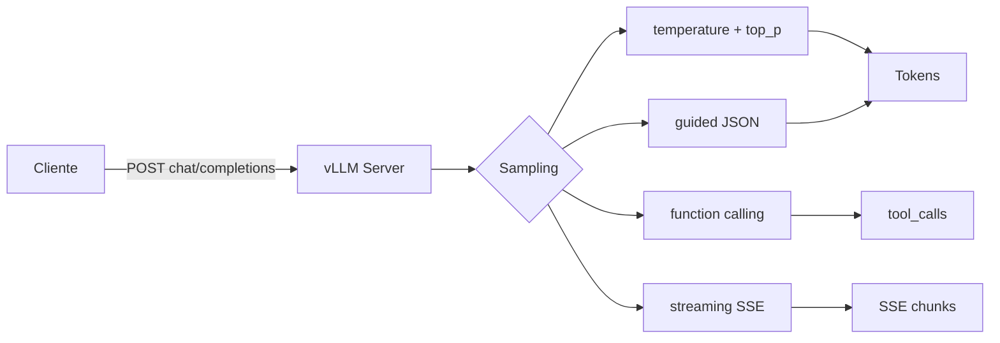

# 🔌 API OpenAI-Compat

La decisión de diseño más estratégica de vLLM es exponer una **API OpenAI-compatible**: cualquier cliente que funcione con OpenAI funciona con vLLM sin modificar una línea. Esto significa que todo el ecosistema de herramientas (LangChain, LlamaIndex, frameworks de agentes, gateways como LiteLLM, IDE plugins, evaluadores) se integra trivialmente. Este módulo recorre cada endpoint, sus parámetros, los matices que vLLM añade y los patrones de uso profesional.

---

## 1. Endpoints principales

```mermaid
flowchart LR
    A[Cliente HTTP] --> B[/v1/chat/completions]
    A --> C[/v1/completions]
    A --> D[/v1/embeddings]
    A --> E[/v1/models]
    A --> F[/v1/audio/transcriptions]
    A --> G[/v1/audio/speech]
    A --> H[/v1/score]
    A --> I[/v1/rerank]
    A --> J[/tokenize]
    A --> K[/health]
    A --> L[/metrics]
```

| Endpoint | Función | Desde OpenAI |
|----------|---------|:------------:|
| `POST /v1/chat/completions` | Chat con mensajes estructurados | ✅ |
| `POST /v1/completions` | Completion de texto plano (legacy) | ✅ |
| `POST /v1/embeddings` | Vector embedding de texto | ✅ |
| `GET /v1/models` | Listar modelos servidos | ✅ |
| `POST /v1/audio/transcriptions` | Speech-to-text (Whisper) | ✅ |
| `POST /v1/audio/translations` | Speech-to-texto a EN | ✅ |
| `POST /v1/audio/speech` | Texto a voz (TTS) | ✅ |
| `POST /v1/score` | Cross-encoder scoring | ❌ (extensión vLLM) |
| `POST /v1/rerank` | Re-ranking de documentos | ❌ (extensión vLLM) |
| `POST /tokenize` / `/detokenize` | Tokenización | ❌ (extensión vLLM) |
| `GET /health` / `/ready` | Health checks K8s | ❌ (extensión vLLM) |
| `GET /metrics` | Prometheus | ❌ (extensión vLLM) |

> **Compatibilidad**: vLLM apunta a ser drop-in compatible con OpenAI. La mayoría de campos se aceptan idénticos. Donde difiere, lo verás marcado como **extensión vLLM** o nota explícita.

---

## 2. Chat completions: el endpoint principal

### 2.1 Estructura del request

```python
from openai import OpenAI

client = OpenAI(base_url="http://localhost:8000/v1", api_key="EMPTY")

response = client.chat.completions.create(
    model="Qwen/Qwen2.5-7B-Instruct",
    messages=[
        {"role": "system", "content": "Eres un asistente útil."},
        {"role": "user", "content": "¿Qué es PagedAttention?"},
    ],
    temperature=0.7,
    top_p=0.9,
    max_tokens=500,
    frequency_penalty=0.0,
    presence_penalty=0.0,
    stop=["\n\n", "###"],
    n=1,
    stream=False,
    seed=42,
    response_format={"type": "json_object"},  # fuerza JSON
    tools=[...],                             # function calling
    tool_choice="auto",
    logit_bias={...},
    user="user-12345",                        # para tracking
)
```

### 2.2 Roles y formato de mensajes

| Rol | Significado |
|-----|-------------|
| `system` | Instrucciones de comportamiento (algunos modelos lo ignoran) |
| `user` | Input del usuario |
| `assistant` | Mensaje previo del modelo (para few-shot) |
| `tool` | Resultado de function calling |

```python
messages = [
    {"role": "system", "content": "Eres un experto en Python."},
    {"role": "user", "content": "¿Qué es una list comprehension?"},
    {"role": "assistant", "content": "Es una forma concisa de crear listas..."},
    {"role": "user", "content": "Dame un ejemplo."},
]
```

> **Multimodal**: vLLM también acepta `content` como array con tipos mixtos (texto, image_url). Lo cubrimos en [[06 - Multimodal|módulo 06]].

### 2.3 Sampling parameters

| Parámetro | Default | Rango | Efecto |
|-----------|---------|------|--------|
| `temperature` | 1.0 | 0.0-2.0 | 0 = determinista (greedy), 1 = distribución original, 2 = caótico |
| `top_p` | 1.0 | 0.0-1.0 | Nucleus sampling: considera tokens con probabilidad acumulada ≤ top_p |
| `top_k` | -1 | ≥1 | Top-K sampling |
| `min_p` | 0.0 | 0.0-1.0 | Mínimo relativo al token más probable |
| `max_tokens` | 16 | 1-N | Máximo de tokens de completion |
| `frequency_penalty` | 0.0 | -2.0 a 2.0 | Penaliza tokens que ya aparecieron (proporcional a frecuencia) |
| `presence_penalty` | 0.0 | -2.0 a 2.0 | Penaliza tokens que ya aparecieron (binario) |
| `repetition_penalty` | 1.0 | ≥1.0 | Multiplica logits de tokens ya vistos (extensión vLLM) |
| `stop` | None | list[str] | Detiene la generación si aparece alguno |
| `seed` | random | int | Semilla para reproducibilidad |
| `n` | 1 | ≥1 | Genera n completions paralelas |
| `best_of` | n | ≥n | Genera best_of y devuelve los top-n (más caro) |
| `logprobs` | None | 0-20 | Devuelve logprobs de los top-k tokens |
| `echo` | False | bool | Incluye el prompt en la completion |

> **Cuándo usar cada uno**: para chat general, `temperature=0.7, top_p=0.9` es el sweet spot. Para tareas deterministas (extracción, JSON), `temperature=0`. Para creative writing, sube a 0.9-1.2.

### 2.4 Streaming

```python
stream = client.chat.completions.create(
    model="...",
    messages=[{"role": "user", "content": "..."}],
    stream=True,
)

for chunk in stream:
    if chunk.choices and chunk.choices[0].delta.content:
        print(chunk.choices[0].delta.content, end="", flush=True)
```

El último chunk tiene `finish_reason` en lugar de `delta.content`:
- `"stop"`: encontró un stop token o secuencia.
- `"length"`: alcanzó `max_tokens`.
- `"tool_calls"`: invocó una function.
- `"content_filter"`: filtrado por seguridad.

### 2.5 JSON mode y response_format

```python
response = client.chat.completions.create(
    model="...",
    messages=[
        {"role": "system", "content": "Responde solo JSON válido."},
        {"role": "user", "content": "Extrae: nombre, edad, email de 'Juan tiene 30 y es juan@x.com'"}
    ],
    response_format={"type": "json_object"},
)
print(response.choices[0].message.content)
# {"nombre": "Juan", "edad": 30, "email": "juan@x.com"}
```

vLLM usa guided decoding (outlines o xgrammar) para garantizar JSON válido por construcción, no por post-procesado. Es la opción más robusta.

### 2.6 Structured outputs con JSON Schema

```python
import json
from pydantic import BaseModel

class Persona(BaseModel):
    nombre: str
    edad: int
    email: str

schema = Persona.model_json_schema()

response = client.chat.completions.create(
    model="...",
    messages=[{"role": "user", "content": "..."}],
    extra_body={
        "guided_json": schema,
    },
)
```

> **Extensión vLLM**: `guided_json`, `guided_choice`, `guided_regex` son extensiones que activan decoding restringido por gramática. Útiles para pipelines de extracción de datos robustos.

---

## 3. Function calling (tools)

### 3.1 Definir herramientas

```python
tools = [
    {
        "type": "function",
        "function": {
            "name": "get_weather",
            "description": "Obtiene el clima actual en una ubicación",
            "parameters": {
                "type": "object",
                "properties": {
                    "location": {"type": "string"},
                    "unit": {"type": "string", "enum": ["celsius", "fahrenheit"]}
                },
                "required": ["location"]
            }
        }
    }
]

response = client.chat.completions.create(
    model="...",
    messages=[{"role": "user", "content": "¿Clima en Madrid?"}],
    tools=tools,
    tool_choice="auto",
)
```

Si el modelo decide llamar a la tool, la respuesta tiene `tool_calls`:

```python
tool_call = response.choices[0].message.tool_calls[0]
args = json.loads(tool_call.function.arguments)
# {"location": "Madrid", "unit": "celsius"}
```

### 3.2 Devolver el resultado

```python
messages.append(response.choices[0].message)  # assistant con tool_calls
messages.append({
    "role": "tool",
    "tool_call_id": tool_call.id,
    "content": json.dumps({"temperature": 22, "unit": "celsius"})
})

final = client.chat.completions.create(
    model="...",
    messages=messages,
    tools=tools,
)
print(final.choices[0].message.content)
# "En Madrid hace 22°C."
```

### 3.3 Compatibilidad

vLLM soporta function calling para los modelos que lo nativamente soportan:

| Familia | Function calling nativo |
|---------|:----------------------:|
| Llama 3.1+ | ✅ |
| Qwen 2.5 | ✅ |
| Mistral | ✅ |
| Gemma 2+ | ✅ |
| DeepSeek-V2+ | ✅ |

Para otros modelos, vLLM simula function calling usando guided decoding (parsing JSON).

---

## 4. Embeddings

```python
response = client.embeddings.create(
    model="Qwen/Qwen2.5-7B-Instruct",  # o un modelo de embeddings dedicado
    input=["Hola mundo", "Hello world"],
    encoding_format="float",  # o "base64"
)

for i, item in enumerate(response.data):
    print(f"  text {i}: dim={len(item.embedding)}")
```

> **Modelos de embedding recomendados**: vLLM soporta modelos de la familia `text-embedding-3-*` style. Para open source: `BAAI/bge-large-en-v1.5`, `intfloat/e5-mistral-7b-instruct`, `Qwen/Qwen3-Embedding`.

### Dimensiones de embedding

| Modelo | Dimensión |
|--------|-----------|
| BGE-small | 384 |
| BGE-base | 768 |
| BGE-large | 1024 |
| E5-mistral-7b | 4096 |
| OpenAI text-embedding-3-small | 1536 |
| OpenAI text-embedding-3-large | 3072 |

> **Regla**: la dimensión del embedding debe coincidir con la de tu base de datos vectorial. Cambiar el modelo implica reembebir todo el corpus.

---

## 5. Endpoints legacy: /v1/completions

El endpoint clásico pre-Chat de OpenAI. Útil para:
- Few-shot prompting sin estructura de mensajes.
- Completion de texto libre.
- Code completion.

```python
response = client.completions.create(
    model="...",
    prompt="def fibonacci(n):\n    ",
    max_tokens=100,
    stop=["\n\n"],
    echo=False,
)
```

> **Cuándo usar**: solo si tu caso de uso es genuinamente text completion. Para chat, usa `/v1/chat/completions` siempre.

---

## 6. Endpoints de extensión vLLM

### 6.1 Tokenización

```bash
curl http://localhost:8000/tokenize \
  -H "Content-Type: application/json" \
  -d '{"prompt": "Hola mundo"}'
```

```json
{"tokens": [540, 3084]}
```

Útil para:
- Estimar coste antes de una completion.
- Debug de prompts que excedan el context.
- Pre-procesamiento de RAG (chunking por tokens).

### 6.2 Re-ranking (cross-encoder)

```python
response = client.post(
    "/v1/rerank",
    json={
        "model": "BAAI/bge-reranker-v2-m3",
        "query": "¿Qué es PagedAttention?",
        "documents": [
            "PagedAttention gestiona KV cache en bloques.",
            "La pizza es redonda.",
            "vLLM usa PagedAttention para optimizar inference.",
        ],
        "top_n": 2,
    }
)
print(response.json())
# Devuelve documentos ordenados por relevancia
```

### 6.3 Scoring (cross-encoder simple)

Similar a rerank pero devuelve scores sin reordenar.

### 6.4 Health checks para Kubernetes

```bash
curl http://localhost:8000/health  # 200 si proceso vivo
curl http://localhost:8000/ready   # 200 si modelo cargado y scheduler listo
curl http://localhost:8000/metrics # Prometheus
```

Detalle en [[08 - Observabilidad y Deployment|módulo 08]].

---

## 7. Errores y manejo

### 7.1 Códigos HTTP

| Código | Significado | Cuándo |
|-------:|-------------|--------|
| 200 | OK | Request procesada |
| 400 | Bad Request | JSON malformado, params inválidos |
| 401 | Unauthorized | Falta `Authorization: Bearer` (si `--api-key` está activo) |
| 403 | Forbidden | API key inválida |
| 404 | Not Found | Modelo inexistente |
| 413 | Payload Too Large | Prompt excede `max_model_len` |
| 429 | Too Many Requests | Rate limit alcanzado |
| 500 | Server Error | Error interno (OOM, etc.) |
| 503 | Service Unavailable | Servidor arrancando o cerrando |

### 7.2 Timeouts y retries

```python
from openai import OpenAI, APITimeoutError, RateLimitError

client = OpenAI(
    base_url="http://localhost:8000/v1",
    api_key="EMPTY",
    timeout=60.0,
    max_retries=3,
)

try:
    response = client.chat.completions.create(...)
except APITimeoutError:
    print("Timeout — el modelo tardó demasiado")
except RateLimitError:
    print("Rate limit — espera o reduce concurrencia")
```

### 7.3 Errores comunes

| Error | Causa | Solución |
|-------|-------|----------|
| `model_not_found` | Nombre incorrecto o no cargado | Verifica con `/v1/models` |
| `context_length_exceeded` | Prompt + completion > max_model_len | Sube `--max-model-len` o trunca prompt |
| `server is not ready` | Modelo aún cargando | Espera 30-60s al arrancar |
| `Out of memory` | KV cache saturado | Reduce `--max-num-seqs` o `--gpu-memory-utilization` |
| `CUDA error: invalid device` | GPU no disponible | Verifica `nvidia-smi` |

---

## 8. Patrones de uso avanzados

### 8.1 Concurrent requests con asyncio

```python
import asyncio
from openai import AsyncOpenAI

client = AsyncOpenAI(base_url="http://localhost:8000/v1", api_key="EMPTY")


async def get_response(prompt: str) -> str:
    response = await client.chat.completions.create(
        model="...",
        messages=[{"role": "user", "content": prompt}],
        max_tokens=100,
    )
    return response.choices[0].message.content


async def main():
    prompts = [f"Pregunta {i}" for i in range(100)]
    responses = await asyncio.gather(*[get_response(p) for p in prompts])
    for p, r in zip(prompts, responses):
        print(f"{p} -> {r}")


asyncio.run(main())
```

### 8.2 Connection pooling

```python
import httpx

# Cliente compartido con connection pool
limits = httpx.Limits(max_connections=100, max_keepalive_connections=20)
http_client = httpx.AsyncClient(limits=limits)

client = AsyncOpenAI(
    base_url="http://localhost:8000/v1",
    api_key="EMPTY",
    http_client=http_client,
)
```

### 8.3 Batching manual con logprobs

```python
response = client.chat.completions.create(
    model="...",
    messages=[{"role": "user", "content": "..."}],
    logprobs=True,
    top_logprobs=5,
)

choice = response.choices[0]
for token, logprob in zip(choice.logprobs.content[:5], choice.logprobs.content[:5]):
    print(f"  '{token.token}' ({logprob.logprob:.3f}): top alts = {[t.token for t in logprob.top_logprobs]}")
```

### 8.4 n>1: múltiples completions

```python
response = client.chat.completions.create(
    model="...",
    messages=[{"role": "user", "content": "Dame 3 nombres para una startup de IA."}],
    n=3,
    temperature=0.9,
)
for i, choice in enumerate(response.choices):
    print(f"Opción {i+1}: {choice.message.content}")
```

> **Advertencia**: `n=3` genera 3 secuencias independientes. Coste 3x.

---

## 9. Comparación con OpenAI nativo

| Feature | OpenAI | vLLM | Notas |
|---------|:------:|:----:|-------|
| Chat completions | ✅ | ✅ | Idéntico |
| Streaming SSE | ✅ | ✅ | Idéntico |
| Function calling | ✅ | ✅ | Depende del modelo |
| JSON mode | ✅ | ✅ | vLLM usa guided decoding |
| Vision | ✅ | ✅ | Si el modelo es multimodal |
| Audio in/out | ✅ | ✅ | Modelos Whisper/TTS |
| Logprobs | ✅ | ✅ | Idéntico |
| `n>1` | ✅ | ✅ | Idéntico |
| `best_of` | ✅ | ✅ | Idéntico |
| Fine-tuning API | ✅ | ❌ | vLLM no es trainer |
| Assistants API | ✅ | ❌ | OpenAI-only |
| Files / Vector stores | ✅ | ❌ | OpenAI-only |
| Batch API | ✅ | ❌ | Usa async en vLLM |
| Web search | ✅ | ❌ | OpenAI-only |

> **Implicación**: cualquier workflow basado en Chat Completions + Function Calling + Embeddings es portable. Asistentes, batch API y tools de OpenAI no — pero son reemplazables con RAG + agentes LangChain/LlamaIndex.

---

## 10. Resumen



💡 **Siguiente paso**: en [[04 - Optimizaciones de Performance|el siguiente módulo]] subimos el listón: prefix caching, chunked prefill, speculative decoding, y todas las palancas que separan "vLLM funciona" de "vLLM vuela en producción".
