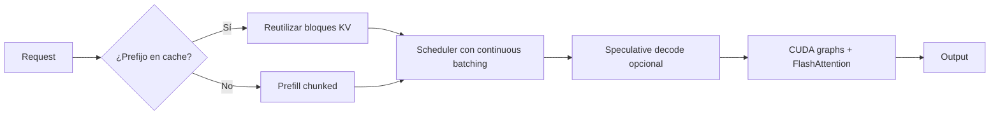

# ⚡ Optimizaciones de Performance

vLLM ya es rápido por defecto gracias a PagedAttention y continuous batching. Pero producción real exige exprimir el último 20-30% de throughput y mantener latencia estable bajo carga. Este módulo cubre las optimizaciones que separan "vLLM funciona" de "vLLM vuela en producción": prefix caching, chunked prefill, speculative decoding, batching strategies y afinación de flags.

---

## 1. Anatomía de la latencia LLM

### 1.1 Las dos fases

Una inferencia LLM tiene dos fases con perfiles opuestos:

```mermaid
gantt
    title Latencia por fase
    dateFormat X
    axisFormat %s
    section Prefill (procesa prompt)
    Prefill 4096 tokens :a1, 0, 5
    section Decode (genera tokens)
    Decode token 1 :b1, 5, 1
    Decode token 2 :b2, 6, 1
    Decode token 3 :b3, 7, 1
    Decode token N :bN, 5+N, 1
```

| Fase | Qué hace | Característica |
|------|----------|----------------|
| **Prefill** | Procesa el prompt completo en paralelo | Compute-bound: usa matmul denso |
| **Decode** | Genera un token a la vez, autoregresivo | Memory-bound: cada token lee toda la KV cache |

> **Implicación**: el prefill escala con $\text{prompt}^2 \cdot d$ (atención) más el MLP. El decode escala con $L \cdot d$ por token. Para un prompt de 4096 tokens en Llama 70B, el prefill puede tomar 1-3 segundos; cada token de decode, 30-50 ms.

### 1.2 Métricas clave

| Métrica | Definición | SLO típico |
|---------|-----------|------------|
| **TTFT** (Time To First Token) | Latencia hasta el primer token generado | 200-500 ms |
| **TPOT** (Time Per Output Token) | Tiempo medio entre tokens consecutivos | 30-100 ms |
| **ITL** (Inter-Token Latency) | Latencia entre tokens específicos | Similar a TPOT |
| **E2E latency** | Tiempo total de la request | 2-30 s |
| **Throughput** | Tokens generados / segundo (agregado) | Lo más alto posible |
| **Goodput** | Throughput cumpliendo SLO de latencia | Lo que importa en prod |

> **Regla práctica**: en producción con chat, optimiza TTFT (los usuarios notan espera inicial) y TPOT p99 (los tokens no deben pausarse). En batch offline, optimiza throughput puro.

---

## 2. Prefix caching

### 2.1 El problema

En muchos workloads, las requests comparten prefijos largos:

- **Chat con system prompt fijo**: 500-2000 tokens idénticos para todos.
- **Few-shot prompting**: 1000+ tokens de examples repetidos.
- **RAG con templates**: el template de prompt es idéntico entre requests.
- **Tool-calling agents**: el prompt de tools es el mismo.

Sin caching, cada request recalcula la atención sobre el prefijo compartido: O($N^2$) de cómputo y VRAM desperdiciado.

### 2.2 Cómo funciona en vLLM

vLLM detecta prefijos idénticos y **comparte bloques de KV cache** entre requests. Cuando un nuevo prefijo ya está en cache, vLLM no recalcula su atención: simplemente apunta al mismo bloque físico.

```bash
vllm serve ... --enable-prefix-caching
```

```python
# Beneficio visible: requests con mismo system prompt son 5-10x más rápidas
import asyncio
from openai import AsyncOpenAI

client = AsyncOpenAI(base_url="http://localhost:8000/v1", api_key="EMPTY")

# Mismo system prompt de 1500 tokens
SYSTEM = "Eres un asistente con muchas instrucciones... " * 200

async def ask(question: str) -> str:
    r = await client.chat.completions.create(
        model="...",
        messages=[
            {"role": "system", "content": SYSTEM},
            {"role": "user", "content": question},
        ],
    )
    return r.choices[0].message.content

# La primera request computa el prefijo; las siguientes lo reusan.
asyncio.run(asyncio.gather(*[ask(f"Pregunta {i}") for i in range(50)]))
```

### 2.3 Cuándo ayuda y cuándo no

| Escenario | Beneficio |
|-----------|-----------|
| Chat con system prompt largo y muchos usuarios | 5-10x TTFT en promedio |
| RAG con template fijo | 2-4x throughput |
| Few-shot prompting estable | 3-5x |
| Requests completamente diferentes | Ningún beneficio |
| Prompts <100 tokens compartidos | Marginal, no compensa overhead |

> **Métrica clave**: el log de vLLM reporta "prefix cache hit rate" y "prefix cache tokens". Monitorea:
> ```
> INFO prefix_caching.py:142] Prefix cache hit rate: 73.4% (12450/16980 tokens)
> ```
> Si está <30%, evalúa si vale la pena el flag.

### 2.4 Gestión de la cache

La cache de prefijos usa una LRU sobre los bloques. vLLM expulsa automáticamente cuando necesita espacio para nuevas requests. Para control fino:

```bash
vllm serve ... \
  --enable-prefix-caching \
  --prefix-caching-hash-algo sha256  # sha256 (default) o sha1
```

---

## 3. Chunked prefill

### 3.1 El problema

Un prefill largo (4096+ tokens) puede tardar varios segundos. Durante ese tiempo, las requests en decode sufren head-of-line blocking: la GPU está 100% ocupada con el prefill, y los tokens de las otras requests no avanzan.

```
t=0:  [Prefill 8000 tokens]  (tarda 3s)
t=3:  [Decode de 50 requests]  (sufrieron pausa de 3s)
```

### 3.2 La solución: mezclar prefill y decode

Chunked prefill divide el prompt en chunks pequeños y los procesa intercalados con decode:

```bash
vllm serve ... \
  --enable-chunked-prefill \
  --max-num-batched-tokens 2048
```

```
t=0:  [Chunk prefill 1 (2048) + decode de 50 requests]
t=1:  [Chunk prefill 2 (2048) + decode de 50 requests]
t=2:  [Chunk prefill 3 (2048) + decode de 50 requests]
t=3:  [Chunk prefill 4 (1952) + decode de 50 requests]
t=4:  [Solo decode de 50 requests]
```

### 3.3 Beneficios cuantitativos

| Workload | Sin chunked | Con chunked |
|----------|------------|-------------|
| Prefill 4096 + decode de 50 | TTFT p99 = 3000ms, TPOT p99 = 200ms | TTFT p99 = 800ms, TPOT p99 = 50ms |
| Mix de prefills 512-8192 | Throughput 800 tok/s | Throughput 2200 tok/s |

### 3.4 Trade-off

| Beneficio | Costo |
|-----------|-------|
| TTFT p99 reducido para prompts largos | TTFT ligeramente mayor para prompts cortos (un poco más de overhead) |
| Latencia de decode estable | Schedule ligeramente más complejo |
| Mejor mezcla de workloads | Requiere `--max-num-batched-tokens` bien afinado |

> **Regla**: activa chunked prefill siempre que tengas prompts >1000 tokens en producción. Para workloads de solo chat corto (<500 tokens), el beneficio es marginal.

---

## 4. Speculative decoding

### 4.1 La idea

Speculative decoding usa un **modelo draft** (mucho más pequeño) para proponer $K$ tokens, y el **modelo principal** los verifica en paralelo. Si el draft acierta la mayoría, generamos $K$ tokens en el tiempo de uno.

```
Sin speculative:
  Main genera token 1 (50ms), token 2 (50ms), token 3 (50ms) = 150ms

Con speculative (K=5, draft de 100M params):
  Draft propone tokens 1-5 (total 30ms)
  Main verifica tokens 1-5 en paralelo (60ms)
  Si acepta 4 de 5: 4 tokens en 90ms vs 200ms = 2.2x speedup
```

### 4.2 Tipos de speculative decoding en vLLM

| Tipo | Setup | Speedup típico | Cuándo usar |
|------|-------|----------------|-------------|
| **EAGLE / EAGLE-2** | Modelo EAGLE pequeño entrenado sobre el target | 2-3x | General, requiere modelo disponible |
| **Medusa** | Heads extra en el modelo target (sin modelo draft) | 2-3x | Solo modelos con Medusa entrenada |
| **Draft model (genérico)** | Cualquier LLM pequeño como draft | 1.3-1.8x | Cuando no hay draft específico |
| **N-gram lookup** | Lookup en n-grams del propio prompt | 1.1-1.3x | Sin modelo extra, baja complejidad |
| **Self-speculative** | El propio modelo hace draft+verify con early exit | 1.3-1.6x | Sin modelo extra |

### 4.3 Activación

```bash
# Con EAGLE
vllm serve meta-llama/Llama-3.1-8B-Instruct \
  --speculative-model yuhuili/EAGLE-LLaMA3.1-Instruct-8B \
  --num-speculative-tokens 5 \
  --use-v2-block-manager

# Con Medusa
vllm serve <modelo-con-Medusa> \
  --speculative-model <modelo> \
  --speculative-draft-model-typo medusa

# Con n-gram
vllm serve ... --enable-ngram-speculative --num-speculative-tokens 5
```

### 4.4 Cuándo usar

| Escenario | Recomendación |
|-----------|---------------|
| Modelo grande (>30B) + modelo draft disponible | EAGLE o draft explícito: 2-3x |
| Throughput crítico, latencia flexible | Speculative vale la pena |
| Latencia crítica, throughput flexible | Speculative introduce variabilidad, evaluar |
| Batch size grande | Speculative ayuda menos (el modelo ya está ocupado) |

> **Advertencia**: speculative decoding introduce variabilidad en latencia. Para SLOs estrictos (TTFT < 200ms siempre), benchmark antes de activar.

---

## 5. Batching strategies

### 5.1 Variables de control

```bash
vllm serve ... \
  --max-num-seqs 256 \              # máximo de sequences simultáneas
  --max-num-batched-tokens 4096 \   # tokens totales por iteración
  --max-model-len 8192             # contexto total máximo
```

| Variable | Qué controla |
|----------|--------------|
| `--max-num-seqs` | Cuántas requests pueden estar activas a la vez |
| `--max-num-batched-tokens` | Cuántos tokens puede procesar el modelo en una iteración |
| `--max-model-len` | Sum prompt + completion máxima |

### 5.2 Encontrar el sweet spot

Para encontrar los valores óptimos:

```python
import itertools
import subprocess


def run_bench(max_num_seqs: int, max_num_batched_tokens: int) -> dict:
    cmd = [
        "vllm", "bench", "serve",
        "--model", "Qwen/Qwen2.5-7B-Instruct",
        "--dataset-name", "random",
        "--random-input-len", "512",
        "--random-output-len", "256",
        "--num-prompts", "200",
        "--max-num-seqs", str(max_num_seqs),
        "--max-num-batched-tokens", str(max_num_batched_tokens),
    ]
    result = subprocess.run(cmd, capture_output=True, text=True)
    # parse metrics
    return parse_metrics(result.stdout)


for ms, mbt in itertools.product([64, 128, 256, 512], [1024, 2048, 4096, 8192]):
    metrics = run_bench(ms, mbt)
    print(f"  max_num_seqs={ms}, max_batched_tokens={mbt}: "
          f"throughput={metrics['tps']:.0f}, p99_latency={metrics['p99']:.0f}ms")
```

### 5.3 Reglas heurísticas

| Workload | Recomendación |
|----------|---------------|
| Chat corto, muchos usuarios | `max-num-seqs=256`, `max-batched-tokens=4096` |
| RAG con prefijos largos | `max-num-seqs=64`, `max-batched-tokens=8192` |
| Generación de código (prompts largos) | `max-num-seqs=32`, `max-batched-tokens=16384` |
| Throughput offline | `max-num-seqs=512`, `max-batched-tokens=8192` |

---

## 6. Async output processing

vLLM permite que el post-procesamiento de tokens (sampling, logprobs) se haga en un thread pool separado, solapando con la siguiente iteración de GPU:

```bash
vllm serve ... --num-decoder-steps 1
```

Reducir de 2 a 1 puede mejorar throughput 5-10% a costa de menor responsividad en sampling complejo. Por default está optimizado.

---

## 7. CUDA graphs

vLLM usa CUDA graphs para eliminar el overhead de lanzamiento de kernels:

```bash
# Compilados y usados por default en la mayoría de modelos
# Para forzar compilación eager (debug):
vllm serve ... --enforce-eager
```

> **Cuándo desactivar**: solo si estás debuggeando o tienes un modelo exótico que rompe con CUDA graphs. El costo de eager mode es ~10-15% de throughput.

---

## 8. FlashAttention

vLLM detecta y usa automáticamente FlashAttention 2 o 3 cuando es posible:

| GPU | Atención usada |
|-----|----------------|
| A100, H100, L40S, RTX 4090 | FlashAttention-2 (default) |
| H100 con CUDA 12.3+ | FlashAttention-3 (cuando esté disponible) |
| GPUs antiguas (V100, T4) | Implementación propia (más lenta) |

Para forzar una versión específica:

```bash
vllm serve ... --attn-backend FLASH_ATTN_V2  # o V3, XFORMERS, TORCH_SDPA
```

---

## 9. Pre-tuning: la métrica "preempted requests"

Si ves requests siendo preempteadas (swap a CPU o recompute), el sistema está sobre-lleno. Señales en logs:

```
WARNING 12-23 scheduler.py:198] Request preempted by RECOMPUTE
```

Causas:
- `--max-num-seqs` muy bajo.
- `--max-num-batched-tokens` muy bajo.
- Workload con prompts enormes que saturan KV cache.

Solución: sube los límites o reduce la concurrencia externa (rate limit).

---

## 10. Performance debugging

### 10.1 Métricas a monitorear

```bash
# Throughput agregado
curl -s http://localhost:8000/metrics | grep vllm:gpu_cache_usage

# Requests activas
curl -s http://localhost:8000/metrics | grep vllm:num_requests

# TTFT
curl -s http://localhost:8000/metrics | grep vllm:request_max_num_tokens_generation

# Tiempo de GPU por step
curl -s http://localhost:8000/metrics | grep vllm:gpu_cache_usage_perc
```

### 10.2 Profiling con `torch.profiler`

```bash
vllm serve ... --enable-profiling --profile-reason debug
```

Genera traces que puedes abrir en Perfetto o chrome://tracing.

### 10.3 GPU utilization

```bash
# Tiempo real
nvidia-smi dmon -s pucm -d 1

# O usa dcgm
dcgmi dmon -e 200,203,204,100
```

`gpu_util` debería estar >80% bajo carga. Si está bajo con muchas requests, hay un cuello de botella en otra parte (CPU, prefill, network).

### 10.4 Checklist de optimización

```
[ ] ¿Prefill y decode mezclados? → enable-chunked-prefill
[ ] ¿Prefijos repetidos? → enable-prefix-caching
[ ] ¿Modelo >30B? → evaluar speculative decoding
[ ] ¿Throughput bajo bajo carga? → subir max-num-seqs y max-num-batched-tokens
[ ] ¿TTFT alto? → chunked prefill, prefix caching, o reduce max-model-len
[ ] ¿GPU util < 70%? → revisar CPU pre-processing, network I/O
[ ] ¿Memory errors? → cuantizar o subir gpu-memory-utilization
[ ] ¿Requests preempted? → subir límites o reducir concurrencia
```

---

## 11. Caso real: chat multi-tenant

```bash
vllm serve Qwen/Qwen2.5-7B-Instruct \
  --host 0.0.0.0 \
  --port 8000 \
  --max-model-len 8192 \
  --max-num-seqs 256 \
  --max-num-batched-tokens 4096 \
  --gpu-memory-utilization 0.92 \
  --enable-chunked-prefill \
  --enable-prefix-caching \
  --dtype bfloat16 \
  --served-model-name qwen-7b
```

Configuración de producción típica para 7B con:
- 256 requests concurrentes
- Prompts de 500-2000 tokens
- Completion de 100-500 tokens
- Latencia objetivo TTFT < 300ms, TPOT < 80ms

Resultado típico en A100 80GB: ~3500 tokens/s de throughput agregado, TTFT p99 = 250ms, TPOT p99 = 65ms.

---

## 12. Resumen del flujo optimizado



💡 **Siguiente paso**: en [[05 - Cuantizacion|el siguiente módulo]] exploramos cómo reducir la VRAM y aumentar el throughput con cuantización: GPTQ, AWQ, BitsAndBytes, FP8. Es la palanca más impactante después de PagedAttention.
